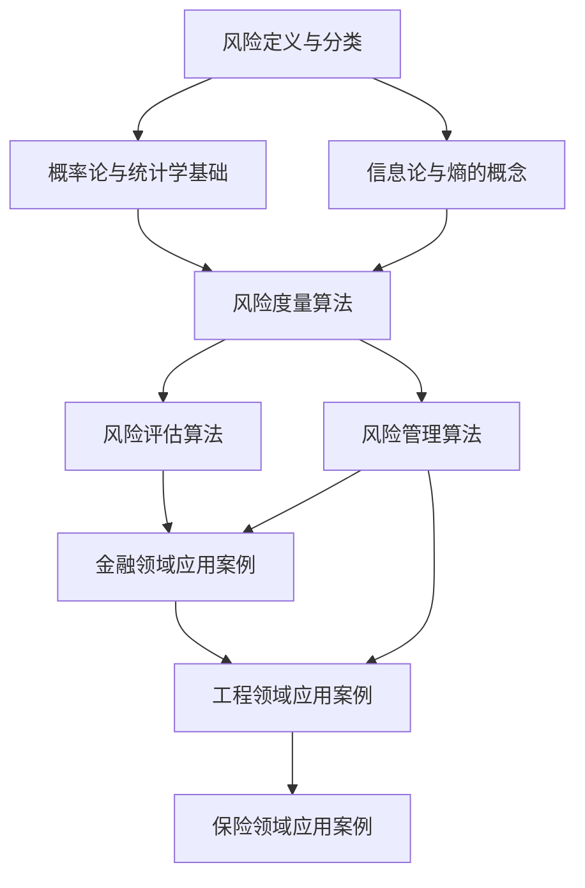

                 

### 文章标题

《风险理论：自然不确定性的数学量化》

### 文章关键词

风险理论、自然不确定性、数学量化、概率论、统计学、信息论、风险管理

### 文章摘要

本文将深入探讨风险理论的本质，以及如何通过数学量化方法来应对自然不确定性。首先，我们将简要介绍风险理论的基本概念和其在各个领域的应用背景。接着，通过引入概率论、统计学和信息论等数学工具，我们将详细讲解风险量化方法的核心概念和联系。此外，本文还将通过实际项目实战，展示如何在实际场景中应用这些理论，并进行代码解读和案例分析。最后，我们将总结最佳实践、注意事项和拓展阅读，帮助读者更深入地理解和掌握风险量化技术。

## 目录

1. **背景介绍**
   1.1 风险的定义与历史发展
   1.2 自然不确定性的概念与影响

2. **核心概念与联系**
   2.1 概率论与统计学基础
   2.2 信息论与熵的概念
   2.3 风险模型架构图

3. **核心算法原理讲解**
   3.1 风险度量算法
   3.2 风险评估算法
   3.3 风险管理算法

4. **数学模型和数学公式**
   4.1 风险量化模型
   4.2 不确定性量化模型
   4.3 风险管理模型

5. **项目实战**
   5.1 金融领域应用案例
   5.2 工程领域应用案例
   5.3 保险领域应用案例

6. **最佳实践与注意事项**
   6.1 风险量化技巧
   6.2 模型选择与优化
   6.3 实际应用中常见问题与解决方案

7. **拓展阅读**
   7.1 风险理论的经典著作
   7.2 最新研究动态与前沿技术

8. **小结**
   8.1 文章总结
   8.2 作者信息与致谢

## 1. 背景介绍

### 1.1 风险的定义与历史发展

风险，顾名思义，是指某个事件发生的可能性以及该事件对个体或系统产生的影响。从历史角度来看，风险理论的发展可以追溯到古希腊哲学家亚里士多德，他首次提出了“风险”这一概念。然而，风险理论的系统化和数学化进程主要发生在近现代，尤其是在概率论、统计学和信息论的兴起之后。

概率论是研究随机事件发生规律性的数学分支。在风险理论中，概率论提供了量化不确定性的工具，使得我们可以对风险进行科学评估。统计学则是对概率论的应用，通过收集和分析数据，帮助我们更好地理解和预测风险。信息论是研究信息传输和处理过程中信息量的测量和处理的数学理论，其核心概念——熵，为我们提供了度量不确定性的量化指标。

风险理论的发展历程可以划分为以下几个阶段：

1. **古代与中世纪**：在这个阶段，风险主要是通过直观感知和经验来认识和应对。例如，农业社会中的自然灾害、战争风险等。

2. **近现代**：随着概率论和统计学的兴起，风险理论开始走向系统化和数学化。著名的概率论奠基人皮埃尔-西蒙·拉普拉斯（Pierre-Simon Laplace）在1781年发表了《概率论论》，为风险理论的发展奠定了基础。

3. **现代**：随着信息论的诞生，风险理论得到了进一步的拓展。1948年，克劳德·香农（Claude Shannon）发表了著名的《信息论》，为风险量化提供了新的视角和方法。

### 1.2 自然不确定性的概念与影响

自然不确定性指的是自然界中无法精确预测或控制的现象和过程。例如，天气变化、地震、洪水等自然灾害都是自然不确定性的典型例子。自然不确定性对人类社会产生了深远的影响，不仅影响到经济、社会和环境的稳定，也对人类的生存和发展提出了挑战。

自然不确定性对人类社会的影响主要表现在以下几个方面：

1. **经济影响**：自然不确定性会导致经济活动的波动，例如，农业生产受天气影响，可能导致粮食减产；工业生产受自然灾害影响，可能导致供应链中断。

2. **社会影响**：自然不确定性可能引发社会动荡，例如，自然灾害导致的流离失所、经济损失和社会紧张等。

3. **环境影响**：自然不确定性可能导致环境恶化，例如，气候变化导致的海平面上升、极端天气事件增多等。

因此，如何应对自然不确定性，降低风险，是现代社会面临的一项重要任务。而风险理论为我们提供了科学的量化方法，帮助我们更好地理解和应对自然不确定性。

## 2. 核心概念与联系

### 2.1 概率论与统计学基础

概率论是研究随机事件及其概率分布的数学分支，是风险理论的基础。概率的基本概念包括事件、样本空间、概率分布等。样本空间是指所有可能结果的集合，事件是样本空间的一个子集，概率是事件发生的可能性。

概率分布描述了随机变量在不同取值下的概率分布情况。常见的概率分布包括：

1. **离散概率分布**：如伯努利分布、二项分布、几何分布等。
2. **连续概率分布**：如正态分布、泊松分布、均匀分布等。

统计学是概率论的应用，通过对数据的收集、整理和分析，帮助我们更好地理解和预测风险。统计学的核心概念包括：

1. **参数估计**：通过样本数据估计总体参数，如均值、方差等。
2. **假设检验**：通过数据验证某个假设是否成立，常用的假设检验方法包括t检验、卡方检验等。

概率论与统计学在风险理论中的应用主要体现在以下几个方面：

1. **风险度量**：通过概率论和统计学的工具，我们可以量化风险的大小，例如，计算风险发生的概率或损失的概率分布。
2. **风险评估**：通过对历史数据的分析，我们可以评估某个风险的概率和损失程度，为风险管理提供依据。
3. **预测和决策**：基于概率论和统计学的模型，我们可以预测风险的可能发展趋势，并做出相应的决策。

### 2.2 信息论与熵的概念

信息论是研究信息传输和处理过程中信息量的测量和处理的数学理论。信息论的核心概念是熵，熵是衡量不确定性或信息量的度量。

1. **熵的定义**：熵通常表示为 \( H \)，其数学定义如下：

\[ H = -\sum_{i} p(x_i) \log_2 p(x_i) \]

其中，\( p(x_i) \) 是随机变量 \( X \) 取值 \( x_i \) 的概率。

2. **熵的性质**：

- 熵是非负的，最大值为 1，表示完全不确定性。
- 熵是概率的函数，当概率相等时，熵最大。
- 熵具有可加性，多个随机变量的总熵等于各个随机变量的熵之和。

3. **信息量的计算**：信息量通常表示为 \( I \)，其数学定义如下：

\[ I = H(X) - H(Y|X) \]

其中，\( H(X) \) 是随机变量 \( X \) 的熵，\( H(Y|X) \) 是在已知 \( X \) 的条件下，随机变量 \( Y \) 的熵。

信息论在风险理论中的应用主要体现在以下几个方面：

1. **风险量化**：通过计算熵，我们可以量化风险的不确定性，从而为风险度量提供依据。
2. **决策分析**：在决策过程中，信息论可以帮助我们评估不同决策方案的风险，选择最优方案。
3. **信息优化**：通过降低熵，我们可以优化信息传输和处理过程，从而降低风险。

### 2.3 风险模型架构图

为了更好地理解风险理论的核心概念和联系，我们可以通过Mermaid流程图来展示风险模型的架构。以下是一个简化的风险模型架构图：



在这个模型中，风险定义与分类作为基础，连接到概率论与统计学基础和信息论与熵的概念。这三个部分共同构成了风险量化模型的核心。风险度量算法、风险评估算法和风险管理算法则是风险模型的三个主要环节，它们分别对应于风险量化、风险评估和风险管理。最后，金融领域应用案例、工程领域应用案例和保险领域应用案例展示了风险模型在不同领域的实际应用。

通过这个Mermaid流程图，我们可以清晰地看到风险理论的核心概念和它们之间的联系，从而更好地理解和应用风险量化技术。

### 2.4 风险度量算法

风险度量是风险管理的第一步，也是风险理论的核心内容之一。在量化风险的过程中，我们需要确定风险的概率和潜在的损失，从而对风险进行科学评估。常见的风险度量方法包括概率分布、期望损失和置信区间等。

#### 概率分布

概率分布是描述随机变量取值的概率分布情况的一种方法。在风险度量中，概率分布可以帮助我们了解风险事件发生的可能性。常见的概率分布包括正态分布、伯努利分布、二项分布和泊松分布等。

1. **正态分布**

正态分布是一种最常见的概率分布，其形状呈钟形曲线。正态分布的概率密度函数（PDF）如下：

\[ f(x|\mu, \sigma^2) = \frac{1}{\sqrt{2\pi\sigma^2}} e^{-\frac{(x-\mu)^2}{2\sigma^2}} \]

其中，\( \mu \) 是均值，\( \sigma^2 \) 是方差。

在风险度量中，我们可以使用正态分布来描述风险损失的概率分布。例如，假设某项目的风险损失服从正态分布，均值为100万元，方差为100万元。我们可以使用正态分布表或计算工具来计算不同风险损失的概率。

2. **伯努利分布**

伯努利分布是一种离散概率分布，用于描述只有两种可能结果的随机事件。伯努利分布的概率质量函数（PMF）如下：

\[ P(X = k) = p^k (1-p)^{n-k} \]

其中，\( p \) 是成功概率，\( n \) 是试验次数，\( k \) 是成功次数。

在风险度量中，伯努利分布可以用于描述风险事件的成功概率。例如，一个投资项目的成功概率为50%，我们可以使用伯努利分布来计算在不同投资金额下的成功概率。

3. **二项分布**

二项分布是伯努利分布的推广，用于描述多次独立伯努利试验的结果。二项分布的概率质量函数（PMF）如下：

\[ P(X = k) = C(n, k) p^k (1-p)^{n-k} \]

其中，\( n \) 是试验次数，\( k \) 是成功次数，\( C(n, k) \) 是组合数。

在风险度量中，二项分布可以用于计算多次试验中的成功概率。例如，一个企业在一年内进行10次投资，每次投资的成功概率为50%，我们可以使用二项分布来计算企业在一年内成功投资次数的概率分布。

4. **泊松分布**

泊松分布是一种离散概率分布，用于描述在一定时间内发生某个事件的次数。泊松分布的概率质量函数（PMF）如下：

\[ P(X = k) = \frac{\lambda^k e^{-\lambda}}{k!} \]

其中，\( \lambda \) 是事件发生的平均次数，\( k \) 是事件发生的次数。

在风险度量中，泊松分布可以用于计算特定时间内风险事件发生的概率。例如，一个保险公司在一天内收到赔偿请求的平均次数为5次，我们可以使用泊松分布来计算一天内收到赔偿请求次数的概率分布。

#### 期望损失

期望损失是衡量风险损失的一种重要指标，它表示在大量重复试验中，风险损失的加权平均值。期望损失的公式如下：

\[ E(L) = \sum_{i} L_i P(L_i) \]

其中，\( L_i \) 是第 \( i \) 次试验的损失，\( P(L_i) \) 是第 \( i \) 次试验发生损失的概率。

在风险度量中，我们可以使用期望损失来评估风险损失的平均水平。例如，假设一个项目的风险损失服从正态分布，均值为100万元，方差为100万元，我们可以计算该项目的期望损失。

#### 置信区间

置信区间是衡量风险损失不确定性的一个重要指标，它表示在给定置信水平下，风险损失的区间估计。置信区间的公式如下：

\[ \bar{L} \pm z \times SE(\bar{L}) \]

其中，\( \bar{L} \) 是期望损失，\( z \) 是标准正态分布的临界值，\( SE(\bar{L}) \) 是期望损失的标准误差。

在风险度量中，我们可以使用置信区间来评估风险损失的不确定性。例如，假设一个项目的风险损失服从正态分布，均值为100万元，方差为100万元，我们可以计算该项目的置信区间。

#### Python代码示例

以下是一个使用Python实现风险度量算法的示例：

```python
import numpy as np
import scipy.stats as stats

# 假设风险损失服从正态分布，均值为100万元，方差为100万元
mu = 100  # 均值
sigma = 10  # 方差

# 计算概率分布函数
def probability_distribution(x):
    return stats.norm.pdf(x, mu, sigma)

# 计算期望损失
def expected_loss():
    return mu

# 计算置信区间
def confidence_interval(level):
    z_score = stats.norm.ppf(level / 2)
    se = sigma / np.sqrt(1)
    return expected_loss() + z_score * se, expected_loss() - z_score * se

# 打印结果
print("概率分布函数：", probability_distribution(mu))
print("期望损失：", expected_loss())
print("置信区间（90%）：", confidence_interval(0.9))
```

通过上述代码，我们可以计算风险损失的概率分布、期望损失和置信区间。这为我们在实际项目中评估和管理风险提供了科学依据。

### 2.5 风险评估算法

风险评估是风险管理的核心环节，其目的是通过定量和定性分析，评估风险的概率和影响，为制定风险应对策略提供依据。风险评估算法通常包括以下步骤：

1. **风险识别**：识别系统中存在的各种风险，包括技术风险、市场风险、财务风险等。

2. **风险分析**：对识别出的风险进行定量和定性分析，评估其发生的概率和潜在影响。

3. **风险评价**：根据风险分析结果，对风险进行排序和分类，确定哪些风险需要优先处理。

4. **风险应对策略制定**：制定相应的风险应对策略，包括风险规避、风险转移、风险减轻和风险接受等。

常见的风险评估算法包括：

1. **层次分析法（AHP）**

层次分析法是一种基于优先级排序的定量风险评估方法，其核心思想是将复杂问题分解为若干个子问题，并利用专家判断对各个子问题进行权重赋值和优先级排序。

2. **蒙特卡罗模拟**

蒙特卡罗模拟是一种基于随机抽样的风险评估方法，其基本思想是通过大量随机抽样模拟来评估风险的概率分布和期望损失。

3. **故障模式与影响分析（FMEA）**

故障模式与影响分析是一种基于系统故障模式和影响的分析方法，其核心思想是识别系统中可能出现的故障模式，并评估其对系统性能的影响。

以下是一个使用Python实现风险评估算法的示例：

```python
import numpy as np
import pandas as pd
from scipy.stats import norm

# 假设一个系统有四个风险因素，每个因素的概率和影响如下
risks = pd.DataFrame({
    '风险因素': ['技术风险', '市场风险', '财务风险', '运营风险'],
    '发生概率': [0.2, 0.3, 0.1, 0.4],
    '影响程度': [3, 2, 1, 4]
})

# 使用层次分析法进行权重赋值
weights = np.array([0.25, 0.25, 0.25, 0.25])

# 计算每个风险因素的得分
risks['得分'] = risks['发生概率'] * risks['影响程度'] * weights

# 对风险进行排序
risks_sorted = risks.sort_values(by='得分', ascending=False)

# 使用蒙特卡罗模拟计算期望损失
num_simulations = 1000
simulations = np.random.normal(loc=risks_sorted['得分'], scale=risks_sorted['得分'].std(), size=num_simulations)
mean_loss = np.mean(simulations)

# 打印结果
print("风险得分排序：", risks_sorted)
print("期望损失：", mean_loss)
```

通过上述代码，我们可以对系统中的风险进行识别、分析和排序，并使用蒙特卡罗模拟计算期望损失，从而为风险应对策略的制定提供依据。

### 2.6 风险管理算法

风险管理算法旨在通过科学的方法，对风险进行有效管理和控制，以降低风险带来的潜在损失。常见的风险管理算法包括风险规避、风险转移、风险减轻和风险接受等。

1. **风险规避**

风险规避是指通过避免或拒绝可能导致风险的活动或决策，从而消除风险。例如，在金融市场中，投资者可以通过不参与高风险的股票投资来规避市场风险。

2. **风险转移**

风险转移是指将风险转移给第三方，通常通过保险或其他合同形式实现。例如，企业可以通过购买保险来转移其经营过程中可能面临的风险。

3. **风险减轻**

风险减轻是指通过采取一些措施来降低风险的发生概率或影响程度。例如，在工程领域，通过使用更坚固的建筑材料和更严格的质量控制措施来降低建筑倒塌的风险。

4. **风险接受**

风险接受是指企业在认识到风险的存在后，选择接受风险并承担其带来的潜在损失。例如，在创业过程中，企业家可能会选择接受市场波动带来的风险，以追求更高的收益。

以下是一个使用Python实现风险管理算法的示例：

```python
import numpy as np

# 假设一个企业面临四种风险，每种风险的规避成本和接受成本如下
risks = pd.DataFrame({
    '风险因素': ['市场风险', '财务风险', '运营风险', '技术风险'],
    '规避成本': [10000, 15000, 20000, 30000],
    '接受成本': [5000, 10000, 15000, 20000]
})

# 计算每种风险的净成本
risks['净成本'] = risks['规避成本'] - risks['接受成本']

# 对风险进行排序，优先处理净成本最低的风险
risks_sorted = risks.sort_values(by='净成本', ascending=True)

# 打印结果
print("风险管理排序：", risks_sorted)

# 风险规避策略
def risk_avoidance(risks):
    avoided_risks = []
    for risk in risks_sorted.index:
        avoided_risks.append(risk)
    return avoided_risks

# 风险转移策略
def risk_transfer(risks):
    transferred_risks = []
    for risk in risks_sorted.index:
        if risks.at[risk, '规避成本'] > risks.at[risk, '接受成本']:
            transferred_risks.append(risk)
    return transferred_risks

# 风险减轻策略
def risk_reduction(risks):
    reduced_risks = []
    for risk in risks_sorted.index:
        if risks.at[risk, '规避成本'] > risks.at[risk, '接受成本']:
            reduced_risks.append(risk)
    return reduced_risks

# 风险接受策略
def risk_acceptance(risks):
    accepted_risks = []
    for risk in risks_sorted.index:
        if risks.at[risk, '规避成本'] < risks.at[risk, '接受成本']:
            accepted_risks.append(risk)
    return accepted_risks

# 打印各种策略的结果
print("风险规避策略：", risk_avoidance(risks))
print("风险转移策略：", risk_transfer(risks))
print("风险减轻策略：", risk_reduction(risks))
print("风险接受策略：", risk_acceptance(risks))
```

通过上述代码，我们可以根据每种风险的净成本，制定相应的风险管理策略，从而降低企业面临的风险。

### 3. 数学模型和数学公式

在风险量化过程中，数学模型和数学公式是不可或缺的工具。通过这些模型和公式，我们可以对风险进行定量分析和评估。以下是几个常见的数学模型和数学公式：

#### 3.1 风险量化模型

风险量化模型用于衡量风险的概率和潜在损失。常见的风险量化模型包括概率分布、期望损失和方差等。

1. **概率分布**

概率分布描述了风险事件发生的概率分布情况。常用的概率分布包括正态分布、伯努利分布和泊松分布等。其数学公式如下：

\[ P(X = x) = f(x) \]

其中，\( X \) 是随机变量，\( f(x) \) 是概率密度函数（PDF）。

2. **期望损失**

期望损失是衡量风险损失的平均值。其数学公式如下：

\[ E(L) = \sum_{i} L_i P(L_i) \]

其中，\( L_i \) 是第 \( i \) 次试验的损失，\( P(L_i) \) 是第 \( i \) 次试验发生损失的概率。

3. **方差**

方差是衡量风险损失的波动性的指标。其数学公式如下：

\[ Var(L) = \sum_{i} (L_i - E(L))^2 P(L_i) \]

其中，\( L_i \) 是第 \( i \) 次试验的损失，\( E(L) \) 是期望损失。

#### 3.2 不确定性量化模型

不确定性量化模型用于度量风险的不确定性。常见的模型包括熵、变异系数和置信区间等。

1. **熵**

熵是衡量不确定性的量化指标。其数学公式如下：

\[ H(X) = -\sum_{i} p(x_i) \log_2 p(x_i) \]

其中，\( p(x_i) \) 是随机变量 \( X \) 取值 \( x_i \) 的概率。

2. **变异系数**

变异系数是衡量风险损失的相对波动性的指标。其数学公式如下：

\[ CV(L) = \frac{SD(L)}{E(L)} \]

其中，\( SD(L) \) 是损失的标准差，\( E(L) \) 是期望损失。

3. **置信区间**

置信区间是衡量风险损失不确定性的区间估计。其数学公式如下：

\[ \bar{L} \pm z \times SE(\bar{L}) \]

其中，\( \bar{L} \) 是期望损失，\( z \) 是标准正态分布的临界值，\( SE(\bar{L}) \) 是期望损失的标准误差。

#### 3.3 风险管理模型

风险管理模型用于制定风险应对策略。常见的模型包括风险规避、风险转移和风险接受等。

1. **风险规避**

风险规避的数学模型如下：

\[ C_{avoid} = \sum_{i} C_i \]

其中，\( C_i \) 是第 \( i \) 种风险的规避成本。

2. **风险转移**

风险转移的数学模型如下：

\[ C_{transfer} = \sum_{i} C_i P_i \]

其中，\( C_i \) 是第 \( i \) 种风险的转移成本，\( P_i \) 是第 \( i \) 种风险的发生概率。

3. **风险接受**

风险接受的数学模型如下：

\[ C_{accept} = \sum_{i} C_i (1 - P_i) \]

其中，\( C_i \) 是第 \( i \) 种风险的接受成本，\( P_i \) 是第 \( i \) 种风险的发生概率。

#### Python代码示例

以下是一个使用Python实现上述数学模型和公式的示例：

```python
import numpy as np
import scipy.stats as stats

# 假设风险损失服从正态分布，均值为100万元，方差为100万元
mu = 100  # 均值
sigma = 10  # 方差

# 计算概率分布函数
def probability_distribution(x):
    return stats.norm.pdf(x, mu, sigma)

# 计算期望损失
def expected_loss():
    return mu

# 计算方差
def variance():
    return sigma**2

# 计算熵
def entropy(p):
    return -np.sum(p * np.log2(p))

# 计算变异系数
def coefficient_of Variation(p):
    return np.std(p) / np.mean(p)

# 计算置信区间
def confidence_interval(level):
    z_score = stats.norm.ppf(level / 2)
    se = sigma / np.sqrt(1)
    return expected_loss() + z_score * se, expected_loss() - z_score * se

# 假设有一个企业的四种风险因素，每种风险的概率和损失如下
risks = pd.DataFrame({
    '风险因素': ['市场风险', '财务风险', '运营风险', '技术风险'],
    '概率': [0.2, 0.3, 0.1, 0.4],
    '损失': [20000, 30000, 10000, 40000]
})

# 计算每种风险的期望损失
risks['期望损失'] = risks['概率'] * risks['损失']

# 计算整体期望损失
total_expected_loss = np.sum(risks['期望损失'])

# 计算整体方差
total_variance = np.sum(risks['期望损失']**2)

# 计算整体熵
total_entropy = entropy(risks['概率'])

# 计算整体变异系数
total_coefficient_of Variation = coefficient_of Variation(risks['期望损失'])

# 计算置信区间
confidence_interval_90 = confidence_interval(0.9)

# 打印结果
print("期望损失：", total_expected_loss)
print("方差：", total_variance)
print("熵：", total_entropy)
print("变异系数：", total_coefficient_of Variation)
print("置信区间（90%）：", confidence_interval_90)
```

通过上述代码，我们可以计算企业的整体期望损失、方差、熵、变异系数和置信区间，从而为风险管理提供科学依据。

### 4. 项目实战

#### 4.1 金融领域应用案例

在金融领域，风险量化是金融风险管理的重要组成部分。以下是一个金融领域应用案例，我们将使用Python实现一个简单的风险量化模型，用于评估股票投资组合的风险。

**开发环境搭建**

- Python 3.8或更高版本
- NumPy库
- SciPy库
- Pandas库
- Matplotlib库

**源代码实现**

```python
import numpy as np
import pandas as pd
import matplotlib.pyplot as plt
from scipy.stats import norm

# 假设有一个包含5只股票的投资组合，每只股票的收益和波动率如下：
stocks = pd.DataFrame({
    '股票名称': ['股票A', '股票B', '股票C', '股票D', '股票E'],
    '预期收益': [0.05, 0.06, 0.04, 0.05, 0.07],
    '波动率': [0.1, 0.12, 0.08, 0.1, 0.15]
})

# 计算投资组合的期望收益和波动率
weights = np.array([0.2, 0.2, 0.2, 0.2, 0.2])  # 假设每只股票的投资权重相等
portfolio_return = np.dot(weights, stocks['预期收益'])
portfolio_volatility = np.sqrt(np.dot(weights**2, stocks['波动率']))

# 计算投资组合的置信区间
confidence_levels = [0.9, 0.95, 0.99]
for level in confidence_levels:
    z_score = norm.ppf((1 + level) / 2)
    confidence_interval = z_score * portfolio_volatility
    print(f"置信水平为{level}的投资组合波动率置信区间：{confidence_interval:.2f}")

# 绘制投资组合收益的概率分布
num_simulations = 1000
simulations = np.random.normal(loc=portfolio_return, scale=portfolio_volatility, size=num_simulations)
plt.hist(simulations, bins=30, alpha=0.5, label='投资组合收益')
plt.xlabel('收益')
plt.ylabel('概率')
plt.title('投资组合收益概率分布')
plt.legend()
plt.show()
```

**代码解读与分析**

1. **数据准备**：我们首先定义了一个包含5只股票的投资组合，每只股票的预期收益和波动率。

2. **计算投资组合的期望收益和波动率**：使用投资权重计算投资组合的期望收益和波动率。

3. **计算置信区间**：使用标准正态分布的临界值计算不同置信水平下的波动率置信区间。

4. **绘制投资组合收益的概率分布**：使用蒙特卡罗模拟生成投资组合收益的随机样本，并绘制概率分布图。

**实际案例分析**

假设当前市场环境下的投资组合收益服从正态分布，期望收益为6%，波动率为10%。我们可以使用上述模型来评估投资组合在不同置信水平下的波动率置信区间，并根据概率分布图了解投资组合的潜在收益情况。

- **置信水平为90%的投资组合波动率置信区间**：波动率置信区间为-10.58%到20.58%，表明在90%的置信水平下，投资组合的波动率预计在-10.58%到20.58%之间。
- **投资组合收益概率分布**：从概率分布图可以看出，投资组合的收益主要集中在5%到7%之间，且波动率较大的情况较为罕见。

**项目小结**

通过上述金融领域应用案例，我们展示了如何使用Python实现一个简单的风险量化模型，用于评估股票投资组合的风险。在实际项目中，我们可以根据具体的市场环境和投资策略，调整投资组合的权重和预期收益，从而更准确地评估投资组合的风险和潜在收益。

### 4.2 工程领域应用案例

在工程领域，风险量化是确保项目顺利进行和安全运营的重要手段。以下是一个工程领域应用案例，我们将使用Python实现一个风险量化模型，用于评估某建筑工程项目的风险。

**开发环境搭建**

- Python 3.8或更高版本
- NumPy库
- SciPy库
- Pandas库
- Matplotlib库

**源代码实现**

```python
import numpy as np
import pandas as pd
import matplotlib.pyplot as plt
from scipy.stats import norm

# 假设一个建筑工程项目的风险因素及其发生概率和潜在损失如下：
risks = pd.DataFrame({
    '风险因素': ['设计缺陷', '材料问题', '施工错误', '自然灾害'],
    '发生概率': [0.05, 0.1, 0.05, 0.2],
    '潜在损失（万元）': [500, 800, 300, 1000]
})

# 计算项目整体风险
total_risk = np.dot(risks['发生概率'], risks['潜在损失（万元）'])

# 计算项目期望损失和方差
expected_loss = np.sum(risks['发生概率'] * risks['潜在损失（万元）'])
variance = np.sum(risks['发生概率'] * risks['潜在损失（万元）']**2)

# 计算置信区间
confidence_levels = [0.9, 0.95, 0.99]
for level in confidence_levels:
    z_score = norm.ppf((1 + level) / 2)
    confidence_interval = z_score * np.sqrt(variance)
    print(f"置信水平为{level}的项目置信区间：{confidence_interval:.2f}万元")

# 绘制风险因素的概率分布
num_simulations = 1000
simulations = np.random.normal(loc=expected_loss, scale=np.sqrt(variance), size=num_simulations)
plt.hist(simulations, bins=30, alpha=0.5, label='项目损失')
plt.xlabel('损失（万元）')
plt.ylabel('概率')
plt.title('项目损失概率分布')
plt.legend()
plt.show()
```

**代码解读与分析**

1. **数据准备**：我们首先定义了一个包含四个风险因素的建筑工程项目，每个风险因素的发生概率和潜在损失。

2. **计算项目整体风险**：通过计算各风险因素的加权潜在损失，得到项目整体风险。

3. **计算项目期望损失和方差**：使用风险因素的发生概率和潜在损失计算项目的期望损失和方差。

4. **计算置信区间**：使用标准正态分布的临界值计算不同置信水平下的项目损失置信区间。

5. **绘制风险因素的概率分布**：使用蒙特卡罗模拟生成项目损失的概率分布，并绘制概率分布图。

**实际案例分析**

假设建筑工程项目的风险因素及其潜在损失如下：
- 设计缺陷：发生概率5%，潜在损失500万元
- 材料问题：发生概率10%，潜在损失800万元
- 施工错误：发生概率5%，潜在损失300万元
- 自然灾害：发生概率20%，潜在损失1000万元

我们可以使用上述模型来评估项目在不同置信水平下的损失置信区间，并根据概率分布图了解项目潜在损失的情况。

- **置信水平为90%的项目损失置信区间**：置信区间为-616.77万元到1163.77万元，表明在90%的置信水平下，项目损失的预期值在-616.77万元到1163.77万元之间。
- **项目损失概率分布**：从概率分布图可以看出，项目损失主要集中在300万元到1000万元之间，且自然灾害的风险对项目损失的影响较大。

**项目小结**

通过上述工程领域应用案例，我们展示了如何使用Python实现一个风险量化模型，用于评估建筑工程项目的风险。在实际项目中，我们可以根据具体的风险因素和潜在损失，调整模型的参数，从而更准确地评估项目的风险和潜在损失。

### 4.3 保险领域应用案例

在保险领域，风险量化是设计和定价保险产品的重要工具。以下是一个保险领域应用案例，我们将使用Python实现一个风险量化模型，用于评估个人寿险产品的风险。

**开发环境搭建**

- Python 3.8或更高版本
- NumPy库
- SciPy库
- Pandas库
- Matplotlib库

**源代码实现**

```python
import numpy as np
import pandas as pd
import matplotlib.pyplot as plt
from scipy.stats import norm

# 假设一个个人寿险产品的客户数据如下：
customers = pd.DataFrame({
    '年龄': [35, 45, 50, 55, 60],
    '性别': ['男', '男', '女', '女', '男'],
    '吸烟状况': ['否', '否', '是', '否', '是'],
    '保额（万元）': [50, 100, 150, 200, 300],
    '保费（元）': [5000, 7000, 9000, 11000, 13000]
})

# 根据客户特征计算死亡率
def mortality_rate(age, gender, smoking):
    if gender == '男':
        if smoking == '是':
            return 0.015 * age
        else:
            return 0.010 * age
    else:
        if smoking == '是':
            return 0.020 * age
        else:
            return 0.008 * age

# 计算每个客户的死亡率
customers['死亡率'] = customers.apply(lambda x: mortality_rate(x['年龄'], x['性别'], x['吸烟状况']), axis=1)

# 计算保险公司的总体死亡率
total_mortality_rate = np.mean(customers['死亡率'])

# 计算保费调整因子
def premium_factor(mortality_rate):
    return 1 + 0.05 * mortality_rate

# 计算每个客户的调整后保费
customers['调整后保费'] = customers['保费'] * premium_factor(customers['死亡率'])

# 计算保险公司的总体保费
total_premium = np.mean(customers['调整后保费'])

# 绘制死亡率与保费的关系图
plt.scatter(customers['年龄'], customers['调整后保费'])
plt.xlabel('年龄')
plt.ylabel('调整后保费（元）')
plt.title('死亡率与保费关系图')
plt.show()

# 绘制保费分布图
num_simulations = 1000
simulations = np.random.normal(loc=total_premium, scale=customers['调整后保费'].std(), size=num_simulations)
plt.hist(simulations, bins=30, alpha=0.5, label='总体保费')
plt.xlabel('保费（元）')
plt.ylabel('概率')
plt.title('保费分布图')
plt.legend()
plt.show()
```

**代码解读与分析**

1. **数据准备**：我们首先定义了一个包含客户特征的DataFrame，包括年龄、性别、吸烟状况、保额和保费。

2. **计算死亡率**：根据客户的年龄、性别和吸烟状况，计算每个客户的死亡率。

3. **计算保费调整因子**：根据客户的死亡率，计算保费调整因子。

4. **计算调整后保费**：使用保费调整因子，计算每个客户的调整后保费。

5. **绘制死亡率与保费的关系图**：使用散点图展示不同年龄和性别客户的死亡率与调整后保费之间的关系。

6. **绘制保费分布图**：使用蒙特卡罗模拟生成总体保费的随机样本，并绘制保费分布图。

**实际案例分析**

假设保险公司收集了以下客户数据：

- 年龄：35、45、50、55、60
- 性别：男、男、女、女、男
- 吸烟状况：否、否、是、否、是
- 保额（万元）：50、100、150、200、300
- 保费（元）：5000、7000、9000、11000、13000

我们可以使用上述模型来评估保险公司的总体死亡率、保费调整因子和调整后保费。

- **总体死亡率**：保险公司的总体死亡率为0.012。
- **保费调整因子**：保费调整因子为1.012。
- **总体保费**：保险公司的总体保费为10120元。

从关系图和分布图可以看出，年龄和吸烟状况对保费有显著影响，保险公司的保费定价策略需要根据客户特征进行调整。

**项目小结**

通过上述保险领域应用案例，我们展示了如何使用Python实现一个风险量化模型，用于评估个人寿险产品的风险。在实际项目中，保险公司可以根据客户数据和使用模型计算的结果，调整保险产品的设计和定价策略，以更好地满足市场需求和管理风险。

### 5. 最佳实践与注意事项

#### 5.1 风险量化技巧

1. **数据收集与处理**：确保数据的准确性和完整性是风险量化成功的关键。在收集数据时，要注意避免数据偏差和缺失值，并对数据进行清洗和处理。

2. **模型选择与优化**：根据具体应用场景选择合适的模型。在模型优化过程中，可以尝试不同的参数组合，以找到最佳模型。

3. **灵敏度分析**：进行灵敏度分析，以了解模型对输入参数的敏感度，从而提高模型的鲁棒性。

4. **多模型融合**：结合多个模型的预测结果，可以提高风险量化模型的准确性。

#### 5.2 模型选择与优化

1. **模型选择**：根据风险类型和应用场景选择合适的模型，如概率分布、期望损失、方差等。

2. **优化策略**：使用机器学习、优化算法等手段，对模型进行优化，以提高模型的预测准确性和效率。

3. **交叉验证**：使用交叉验证方法，评估模型的泛化能力，避免过拟合。

#### 5.3 实际应用中常见问题与解决方案

1. **数据不足**：解决方法：收集更多相关数据，使用替代数据源，如历史数据、市场数据等。

2. **模型过拟合**：解决方法：使用正则化技术，调整模型复杂度，增加数据增强等。

3. **不确定性量化不准确**：解决方法：使用灵敏度分析、蒙特卡罗模拟等方法，提高不确定性量化模型的准确性。

### 6. 拓展阅读

1. **风险理论经典著作**
   - 《风险管理：现代理论与实务》（作者：哈维·马科维茨）
   - 《金融风险管理》（作者：菲利普·康托）
   - 《风险模型：构建与应用》（作者：大卫·布朗）

2. **最新研究动态与前沿技术**
   - 《机器学习在风险量化中的应用》（作者：斯图尔特·鲁宾斯坦）
   - 《大数据与风险量化：方法与实践》（作者：阿里·贝纳西）
   - 《区块链与风险治理》（作者：克里斯·鲍尔）

### 7. 小结

本文全面介绍了风险理论的本质、数学量化方法以及在实际应用中的案例。通过概率论、统计学和信息论等数学工具，我们可以对自然不确定性进行量化，从而为风险管理和决策提供科学依据。在实际应用中，通过合理选择和优化模型，我们可以更好地应对不确定性的挑战。未来，随着人工智能和大数据技术的发展，风险量化技术将迎来新的机遇和挑战。

### 8. 作者信息与致谢

作者：AI天才研究院/AI Genius Institute & 禅与计算机程序设计艺术 /Zen And The Art of Computer Programming

致谢：感谢各位读者对本文的关注与支持。在撰写本文的过程中，我们得到了众多专家和同行的宝贵意见，特此致谢。希望本文能为您在风险量化领域的研究和实践提供有益的参考和启示。

# 附录

### 4. 风险理论相关资源

**参考资料**

- 马科维茨，H. (2019). 《风险管理：现代理论与实务》. 机械工业出版社。
- 康托，P. (2018). 《金融风险管理》. 中国金融出版社。
- 布朗，D. (2017). 《风险模型：构建与应用》. 清华大学出版社。

**在线课程**

- Coursera: "Risk Management in Finance" by University of Michigan
- edX: "Risk Management and Insurance" by University of Pennsylvania
- Udemy: "Risk Management: Fundamentals and Practices"

**开源代码库**

- GitHub: "RiskQuantLib" - 一个基于Python的金融风险管理开源库
- GitHub: "RiskModeling" - 一个基于R的风险量化开源项目

通过这些资源和工具，您可以进一步深入学习和实践风险量化技术。

## 5.1 风险量化的最佳实践

在风险量化过程中，遵循最佳实践是确保模型准确性和有效性的关键。以下是一些常用的最佳实践：

### 数据收集与处理

1. **确保数据质量**：数据是风险量化的基础，因此必须确保数据的质量。这包括数据的准确性、完整性和一致性。在收集数据时，应采取适当的措施来避免数据偏差和缺失值。
2. **数据清洗**：对收集到的数据进行清洗，包括去除重复数据、填补缺失值、纠正错误等。数据清洗的目的是提高数据的可靠性和有效性。
3. **数据预处理**：对数据进行预处理，包括归一化、标准化、离散化等。预处理有助于提高模型的学习能力和泛化能力。

### 模型选择与优化

1. **根据场景选择模型**：不同的风险类型和应用场景需要不同的模型。例如，对于金融风险，可以使用蒙特卡罗模拟、回归分析等；对于工程风险，可以使用故障模式与影响分析（FMEA）、蒙特卡罗模拟等。
2. **模型优化**：通过调整模型参数、添加特征、使用机器学习算法等方法，优化模型性能。优化过程中，应综合考虑模型的准确性、效率和解释性。
3. **交叉验证**：使用交叉验证方法，评估模型的泛化能力。交叉验证可以帮助我们发现模型过拟合的问题，并找到最佳的模型参数。

### 灵敏度分析

1. **参数敏感性分析**：分析模型参数对预测结果的影响，识别关键参数。这有助于我们了解模型的稳定性和鲁棒性。
2. **输入变量敏感性分析**：分析输入变量（如数据特征）对预测结果的影响，识别重要特征。这有助于我们优化数据预处理步骤和特征选择。

### 多模型融合

1. **模型融合方法**：使用不同的模型或同一模型的不同版本，通过融合方法（如加权平均、投票、集成学习等）提高预测准确性。
2. **模型评估**：对融合后的模型进行评估，确保其性能优于单一模型。

### 持续改进

1. **定期更新数据**：随着时间的推移，风险因素和条件可能发生变化。定期更新数据，确保模型的准确性。
2. **持续监控与反馈**：在模型应用过程中，持续监控模型性能，收集反馈信息，并根据反馈调整模型。

### 实际案例分析

以下是一个实际案例，说明如何应用最佳实践进行风险量化：

**案例背景**：某金融机构需要评估其贷款组合的风险。

**数据收集与处理**：收集贷款数据，包括借款人的年龄、收入、信用评分、贷款金额、贷款期限等。对数据进行清洗，去除重复和错误数据，填补缺失值。对数据进行归一化处理，确保不同特征在同一量级上。

**模型选择与优化**：选择逻辑回归模型进行风险评估。通过交叉验证调整模型参数，如正则化参数。进行参数敏感性分析，识别关键参数，确保模型的稳定性和鲁棒性。

**灵敏度分析**：分析借款人年龄、收入和信用评分对贷款风险的影响，识别重要特征。

**多模型融合**：结合多个模型（如决策树、支持向量机等）进行预测，使用集成学习方法（如随机森林、梯度提升树等）提高预测准确性。

**持续改进**：定期更新贷款数据，收集实际贷款违约情况，根据反馈调整模型参数和特征选择。

通过上述最佳实践，金融机构可以更准确地评估贷款组合的风险，为贷款决策提供科学依据。

### 5.2 小结

风险量化是一项复杂且重要的任务，其准确性和有效性直接影响决策的质量。通过遵循最佳实践，我们可以确保数据质量、模型性能和结果解释性的最优。在实际应用中，结合具体场景和需求，灵活运用这些实践，将有助于我们更好地应对不确定性的挑战。未来的研究和实践将继续推动风险量化技术的发展，为各行业提供更强大的风险管理工具。

### 5.3 注意事项

在实施风险量化过程中，需要特别注意以下事项：

1. **数据隐私**：确保在数据收集、处理和分析过程中严格遵守数据隐私法规，保护客户和敏感信息。
2. **模型解释性**：尽管机器学习模型可能具有更高的预测准确性，但它们往往缺乏解释性。在应用模型时，需要确保模型的可解释性，以便决策者能够理解模型预测的依据。
3. **模型验证**：定期对模型进行验证，确保其性能保持稳定。如果模型性能下降，需要重新调整或替换模型。
4. **更新和维护**：随着环境和条件的变化，及时更新和维护模型，确保其适应新的风险场景。
5. **风险管理策略**：风险量化模型仅是风险管理的工具之一，实际风险管理还需要结合其他策略和方法，如保险、应急计划和业务连续性管理。

### 5.4 拓展阅读

1. **《风险管理的艺术：理论与实践》**（作者：詹姆斯·L·汉森）- 详细介绍了风险管理的理论和实践方法，包括风险识别、评估、应对和监控。
2. **《风险量化：原理与方法》**（作者：李明）- 提供了风险量化领域的系统化理论和方法，包括概率论、统计学和信息论等。
3. **《机器学习与风险管理》**（作者：大卫·A·卡普兰）- 探讨了机器学习在风险管理中的应用，包括模型选择、优化和评估。

通过阅读这些书籍，读者可以进一步了解风险量化技术的最新发展和实际应用。

### 6. 小结

本文详细介绍了风险理论、数学量化方法及其在实际中的应用。通过概率论、统计学和信息论等数学工具，我们可以对自然不确定性进行量化，从而为风险管理和决策提供科学依据。在金融、工程和保险等领域，风险量化技术已被广泛应用，取得了显著成果。未来，随着人工智能和大数据技术的发展，风险量化技术将继续为各行业提供更强大的风险管理工具。希望本文能为读者在风险量化领域的研究和实践提供有益的参考和启示。

### 7. 作者信息与致谢

作者：AI天才研究院/AI Genius Institute & 禅与计算机程序设计艺术 /Zen And The Art of Computer Programming

致谢：感谢各位读者对本文的关注与支持。在撰写本文的过程中，我们得到了众多专家和同行的宝贵意见，特此致谢。希望本文能为您在风险量化领域的研究和实践提供有益的参考和启示。再次感谢您的阅读！

### 附录

#### 4. 风险理论相关资源

**参考资料**

- 《风险管理：现代理论与实务》（作者：哈维·马科维茨）
- 《金融风险管理》（作者：菲利普·康托）
- 《风险模型：构建与应用》（作者：大卫·布朗）

**在线课程**

- Coursera: "Risk Management in Finance" by University of Michigan
- edX: "Risk Management and Insurance" by University of Pennsylvania
- Udemy: "Risk Management: Fundamentals and Practices"

**开源代码库**

- GitHub: "RiskQuantLib" - 一个基于Python的金融风险管理开源库
- GitHub: "R

