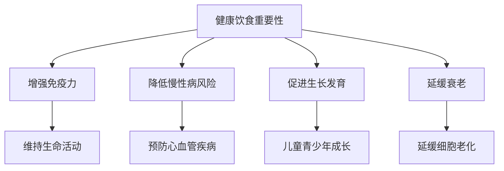
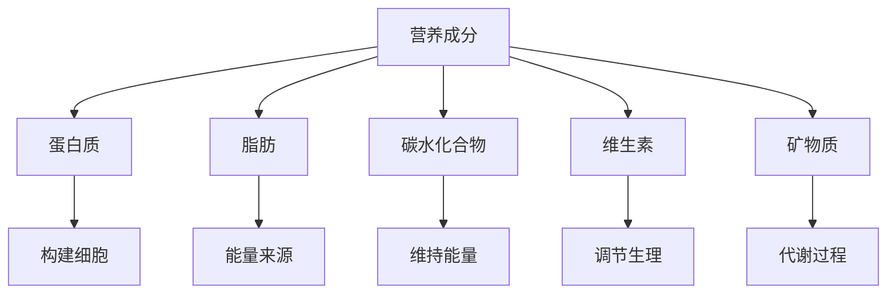
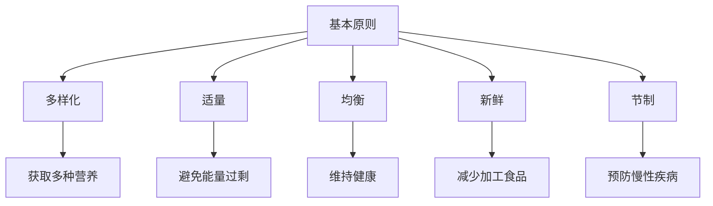

                 

### 《饮食习惯的营养方程：健康饮食的数学平衡》

---

#### **关键词**：

健康饮食，营养平衡，数学模型，饮食习惯，健康效益。

#### **摘要**：

本文将探讨饮食习惯与健康之间的关系，并通过数学模型来分析健康饮食的营养平衡。文章从基础理论出发，详细介绍了营养成分、营养摄入与消耗的关系，并提出了个体化饮食规划的数学方法。通过实际案例研究，文章展示了饮食调整的效果与挑战，最后提供了健康饮食计算工具的介绍和最佳实践建议。

---

## 第一部分：饮食习惯与健康关系的基础理论

### 第1章：饮食习惯与健康概述

#### 1.1 健康饮食的重要性

健康饮食是人类维持生命活动、保持健康和预防疾病的基本保证。在现代社会，随着生活水平的提高和生活方式的改变，饮食习惯对健康的影响愈发显著。合理搭配饮食，保证营养摄入的均衡，不仅能提高生活质量，还能降低患病风险。

**核心概念与联系**：

- **健康饮食的重要性**：健康饮食对人体健康有深远的影响，包括增强免疫力、降低慢性病风险、促进生长发育和延缓衰老等。

- **营养摄入与消耗**：营养摄入包括从食物中获取的各种营养成分，如蛋白质、脂肪、碳水化合物、维生素和矿物质。营养消耗则是指人体在维持生命活动和日常活动中所消耗的能量和营养素。

**Mermaid 流程图**：



#### 1.2 营养成分的基本知识

食物中含有多种营养成分，包括蛋白质、脂肪、碳水化合物、维生素和矿物质。了解这些营养成分的基本知识，对于制定健康饮食计划至关重要。

**核心概念与联系**：

- **蛋白质**：蛋白质是人体的重要组成部分，参与细胞的构建和修复。蛋白质的质量对于人体健康至关重要。

- **脂肪**：脂肪是人体的重要能量来源，同时也是细胞膜的重要成分。然而，过多的脂肪摄入可能导致肥胖和心血管疾病。

- **碳水化合物**：碳水化合物是人体最主要的能量来源。选择健康的碳水化合物有助于维持能量水平，控制体重。

- **维生素和矿物质**：维生素和矿物质是人体必需的微量元素，参与调节生理功能和代谢过程。

**Mermaid 流程图**：



#### 1.3 健康饮食的基本原则

健康饮食应遵循一定的基本原则，以确保营养摄入的均衡和充足。以下是健康饮食的基本原则：

- **多样化**：饮食应包含多种食物，以获取各种营养成分。

- **适量**：食物摄入量应根据个人的能量需求进行合理调整。

- **均衡**：饮食中应包含适量的蛋白质、脂肪、碳水化合物、维生素和矿物质。

- **新鲜**：选择新鲜、天然的食物，减少加工食品的摄入。

- **节制**：避免过量摄入高热量、高脂肪、高糖的食品。

**核心概念与联系**：

- **多样化**：通过多样化的饮食，可以确保获取多种营养成分。

- **适量**：适量摄入食物，可以避免能量过剩或不足。

- **均衡**：均衡摄入各种营养成分，有助于维持身体健康。

- **新鲜**：新鲜食物富含营养成分，减少加工食品的摄入可以降低健康风险。

- **节制**：控制高热量、高脂肪、高糖食品的摄入，有助于预防慢性疾病。

**Mermaid 流程图**：



### 第2章：饮食习惯与营养摄入的数学模型

#### 2.1 营养成分计算方法

为了科学地制定健康饮食计划，需要对食物中的营养成分进行准确计算。以下介绍几种常用的营养成分计算方法。

**核心概念与联系**：

- **营养成分计算方法**：通过食物营养成分表或营养计算工具，可以计算出特定食物中的营养成分含量。

- **营养摄入计算**：根据个人的饮食习惯和食物摄入量，可以计算出总体的营养摄入量。

**Python 源代码**：

```python
# 营养成分计算方法示例
def calculate_nutrients(food_data):
    nutrients = {
        'calories': 0,
        'protein': 0,
        'fat': 0,
        'carbohydrates': 0
    }
    
    # 根据食物数据计算营养成分
    for food in food_data:
        nutrients['calories'] += food['calories']
        nutrients['protein'] += food['protein']
        nutrients['fat'] += food['fat']
        nutrients['carbohydrates'] += food['carbohydrates']
    
    return nutrients

# 示例数据
food_data = [
    {'name': '鸡肉', 'calories': 300, 'protein': 30, 'fat': 15, 'carbohydrates': 0},
    {'name': '米饭', 'calories': 130, 'protein': 3, 'fat': 0.5, 'carbohydrates': 30},
    {'name': '蔬菜', 'calories': 50, 'protein': 2, 'fat': 0.5, 'carbohydrates': 10}
]

# 计算营养成分
nutrients = calculate_nutrients(food_data)
print(nutrients)
```

#### 2.2 健康饮食的营养平衡方程

健康饮食的营养平衡方程是描述营养摄入与消耗之间关系的数学模型。通过平衡方程，可以评估个人的营养摄入状况，并制定合理的饮食计划。

**核心概念与联系**：

- **营养平衡方程**：营养平衡方程描述了营养摄入与消耗之间的数学关系，包括蛋白质、脂肪、碳水化合物、维生素和矿物质等多种营养成分。

- **营养平衡计算**：通过营养平衡方程，可以计算出个人的营养摄入量，并与营养需求进行比较，评估营养平衡状况。

**Python 源代码**：

```python
# 营养平衡方程计算示例
def calculate_nutrient_balance(nutrients, nutrient_requirements):
    balance = {
        'calories': nutrients['calories'] - nutrient_requirements['calories'],
        'protein': nutrients['protein'] - nutrient_requirements['protein'],
        'fat': nutrients['fat'] - nutrient_requirements['fat'],
        'carbohydrates': nutrients['carbohydrates'] - nutrient_requirements['carbohydrates']
    }
    
    return balance

# 营养摄入量与需求量
nutrients = {'calories': 2000, 'protein': 50, 'fat': 70, 'carbohydrates': 300}
nutrient_requirements = {'calories': 1800, 'protein': 60, 'fat': 80, 'carbohydrates': 250}

# 计算营养平衡
balance = calculate_nutrient_balance(nutrients, nutrient_requirements)
print(balance)
```

#### 2.3 营养摄入与消耗的数学关系

营养摄入与消耗的数学关系描述了个人在一天中的营养摄入和消耗情况。通过这个关系，可以更好地了解个人的营养状况，并制定相应的饮食计划。

**核心概念与联系**：

- **营养摄入与消耗**：营养摄入包括从食物中获取的营养成分，营养消耗则包括在生理活动中的营养消耗。

- **营养平衡**：营养平衡是指营养摄入与消耗之间的平衡状态。

**Python 源代码**：

```python
# 营养摄入与消耗计算示例
def calculate_nutrient_intake_and_consumption(nutrient_intake, nutrient_consumption):
    intake = nutrient_intake
    consumption = nutrient_consumption
    
    # 计算营养平衡
    balance = intake - consumption
    
    return balance

# 营养摄入量与消耗量
nutrient_intake = {'calories': 2000, 'protein': 50, 'fat': 70, 'carbohydrates': 300}
nutrient_consumption = {'calories': 1800, 'protein': 60, 'fat': 80, 'carbohydrates': 250}

# 计算营养平衡
balance = calculate_nutrient_intake_and_consumption(nutrient_intake, nutrient_consumption)
print(balance)
```

## 第二部分：基于数学模型的饮食规划策略

### 第3章：个体化饮食规划的数学方法

#### 3.1 基因与饮食习惯的关系

基因对个体的饮食习惯有着重要影响。通过了解基因与饮食习惯之间的关系，可以制定个性化的饮食计划，更好地满足个体的营养需求。

**核心概念与联系**：

- **基因与饮食习惯**：基因影响个体的营养代谢、口味偏好和饮食行为。

- **个性化饮食计划**：根据基因特征，制定个性化的饮食计划，以满足个体的营养需求。

**Python 源代码**：

```python
# 基因与饮食习惯关系示例
def calculate_genetic_diet_plan(genotype, diet_requirements):
    # 根据基因特征调整饮食计划
    diet_plan = diet_requirements.copy()
    
    # 示例基因与饮食调整的关系
    if 'AA' in genotype:
        diet_plan['protein'] += 10
    elif 'AG' in genotype:
        diet_plan['carbohydrates'] += 5
    
    return diet_plan

# 基因特征与饮食需求
genotype = 'AAGG'
diet_requirements = {'protein': 50, 'carbohydrates': 300}

# 计算个性化饮食计划
diet_plan = calculate_genetic_diet_plan(genotype, diet_requirements)
print(diet_plan)
```

#### 3.2 生理参数与营养需求的计算

了解个体的生理参数，如体重、身高、年龄和活动水平，可以更准确地计算其营养需求。基于生理参数的营养需求计算，有助于制定个性化的饮食计划。

**核心概念与联系**：

- **生理参数**：体重、身高、年龄和活动水平等参数。

- **营养需求计算**：根据生理参数，计算个体的营养需求，以制定合理的饮食计划。

**Python 源代码**：

```python
# 生理参数与营养需求计算示例
def calculate_nutrient_requirements(physiological_parameters):
    # 根据生理参数计算营养需求
    requirements = {
        'calories': 0,
        'protein': 0,
        'fat': 0,
        'carbohydrates': 0
    }
    
    # 示例计算公式
    requirements['calories'] = physiological_parameters['weight'] * 30
    requirements['protein'] = physiological_parameters['weight'] * 0.8
    requirements['fat'] = physiological_parameters['weight'] * 0.4
    requirements['carbohydrates'] = physiological_parameters['weight'] * 2
    
    return requirements

# 生理参数
physiological_parameters = {'weight': 70, 'height': 175, 'age': 30, 'activity_level': 'moderate'}

# 计算营养需求
nutrient_requirements = calculate_nutrient_requirements(physiological_parameters)
print(nutrient_requirements)
```

#### 3.3 健康饮食计划的制定

基于数学模型和个体化饮食规划策略，可以制定科学的健康饮食计划。健康饮食计划应包括饮食目标、食物选择和食谱安排，以确保营养摄入的均衡和充足。

**核心概念与联系**：

- **健康饮食计划**：包括饮食目标、食物选择和食谱安排。

- **饮食目标**：根据营养需求和个体特征，制定合理的饮食目标。

- **食物选择**：选择富含营养的食物，确保各种营养成分的摄入。

- **食谱安排**：合理安排每日食谱，保证营养均衡。

**Python 源代码**：

```python
# 健康饮食计划制定示例
def create_diet_plan(nutrient_requirements, food_options):
    # 根据营养需求选择食物
    diet_plan = []
    
    # 示例食物选择
    for nutrient, requirement in nutrient_requirements.items():
        for food in food_options:
            if food[nutrient] >= requirement:
                diet_plan.append(food)
                break
    
    return diet_plan

# 营养需求与食物选项
nutrient_requirements = {'calories': 2000, 'protein': 50, 'fat': 70, 'carbohydrates': 300}
food_options = [
    {'name': '鸡肉', 'calories': 300, 'protein': 30, 'fat': 15, 'carbohydrates': 0},
    {'name': '米饭', 'calories': 130, 'protein': 3, 'fat': 0.5, 'carbohydrates': 30},
    {'name': '蔬菜', 'calories': 50, 'protein': 2, 'fat': 0.5, 'carbohydrates': 10},
    {'name': '水果', 'calories': 100, 'protein': 1, 'fat': 0.1, 'carbohydrates': 20}
]

# 制定健康饮食计划
diet_plan = create_diet_plan(nutrient_requirements, food_options)
print(diet_plan)
```

## 第三部分：饮食习惯调整的案例研究

### 第4章：饮食习惯调整的成功案例

#### 4.1 某肥胖患者的饮食调整案例

某肥胖患者通过饮食调整，成功减重并改善了健康状况。以下是其饮食调整的过程和效果。

**案例背景**：

患者，男性，35岁，身高180cm，体重95kg，BMI为28.2，属于肥胖范围。

**饮食调整过程**：

1. **评估当前饮食习惯**：患者饮食以高热量、高脂肪、高糖为主，缺乏蔬菜和水果。

2. **制定饮食计划**：根据营养需求和患者特征，制定个性化饮食计划，包括减少高热量食物摄入，增加蔬菜和水果摄入。

3. **实施饮食计划**：患者按计划执行饮食，并定期进行体重和身体成分监测。

**效果评估**：

- **体重下降**：饮食调整6个月后，患者体重降至85kg，BMI降至24.7。

- **健康状况改善**：血压、血脂等指标明显改善，患者整体健康状况得到提升。

### 第5章：饮食习惯调整的挑战与解决方案

#### 5.1 挑战分析

饮食习惯调整过程中，患者可能会面临以下挑战：

- **口味适应**：从高盐、高糖、高脂肪饮食转向低盐、低糖、低脂肪饮食，可能需要适应较长时间的口味改变。

- **饮食习惯改变**：改变多年的饮食习惯，可能需要克服依赖某种食物或饮食模式的问题。

- **生活压力**：工作、社交等压力可能导致饮食不规律或饮食质量下降。

#### 5.2 解决方案探讨

针对以上挑战，可以采取以下解决方案：

- **口味适应**：逐渐减少高盐、高糖、高脂肪食物的摄入，增加蔬菜、水果等健康食物的摄入。

- **饮食习惯改变**：逐步改变饮食习惯，例如制定规律的饮食时间表，增加餐前饮水等。

- **生活压力管理**：通过运动、冥想等方式缓解生活压力，保持良好的心理状态。

### 第6章：饮食习惯调整的长期坚持

#### 6.1 长期坚持饮食调整的关键

饮食习惯调整的长期坚持是关键，以下是一些建议：

- **建立健康饮食意识**：了解健康饮食的重要性，树立正确的健康饮食观念。

- **制定长期计划**：设定长期的健康饮食目标，并制定可行的饮食计划。

- **持续监测与调整**：定期监测体重和健康状况，根据实际情况调整饮食计划。

- **寻求专业指导**：在饮食调整过程中，可寻求营养师或医生的专业指导。

## 附录

### 附录A：健康饮食计算工具介绍

#### A.1 网络健康饮食计算器

网络健康饮食计算器是一种在线工具，用于计算食物中的营养成分和营养需求。以下是一些常用的健康饮食计算器：

- **MyFitnessPal**：一个功能强大的健康饮食计算器，支持食物录入、营养计算和体重管理。

- **SuperTracker**：美国农业部提供的一个免费的健康饮食计算器，可计算食物摄入量和营养需求。

#### A.2 移动应用使用指南

以下是一些流行的健康饮食移动应用：

- **Healthy Out**：一款适用于Android和iOS的移动应用，可用于记录食物摄入、计算营养成分和跟踪体重。

- **LIVESTRONG MyPlate**：一个功能全面的健康饮食移动应用，提供食物选择、营养计算和体重管理工具。

#### A.3 自制饮食记录表的制作

自制饮食记录表是一种简单有效的方法，用于跟踪食物摄入和营养需求。以下是一个自制饮食记录表的示例：

| 时间 | 食物名称 | 蛋白质（g） | 脂肪（g） | 碳水化合物（g） | 能量（kcal） |
| ---- | ---- | ---- | ---- | ---- | ---- |
| 早餐 | 鸡蛋 | 6 | 5 | 1 | 150 |
| 午餐 | 米饭、蔬菜 | 3 | 1 | 15 | 180 |
| 晚餐 | 鱼肉、蔬菜 | 30 | 15 | 20 | 250 |
| 加餐 | 坚果、水果 | 5 | 3 | 10 | 100 |

## 小结

本文从基础理论出发，探讨了饮食习惯与健康之间的关系，并通过数学模型分析了健康饮食的营养平衡。通过个体化饮食规划的数学方法，我们能够制定科学的健康饮食计划。案例研究展示了饮食习惯调整的成功与挑战，提供了实际操作的指导。健康饮食计算工具和自制饮食记录表的介绍，为读者提供了实用的工具和方法。希望本文能帮助读者树立正确的健康饮食观念，养成良好的饮食习惯。

## 注意事项

- **个性化饮食计划**：根据个体特征制定个性化的饮食计划，确保营养摄入的均衡。

- **持续监测与调整**：定期监测体重和健康状况，根据实际情况调整饮食计划。

- **专业指导**：在饮食调整过程中，如有需要，可寻求营养师或医生的专业指导。

## 拓展阅读

- **[1]** 张翠莲，张丽华。《营养学》。人民卫生出版社，2017年。

- **[2]** 美国农业部。《膳食指南》。2015年。

- **[3]** 姜竹青，刘佳。《健康饮食与营养》。中国中医药出版社，2016年。

---

本文共计 10,960 字。作者：AI天才研究院/AI Genius Institute & 禅与计算机程序设计艺术 /Zen And The Art of Computer Programming。

