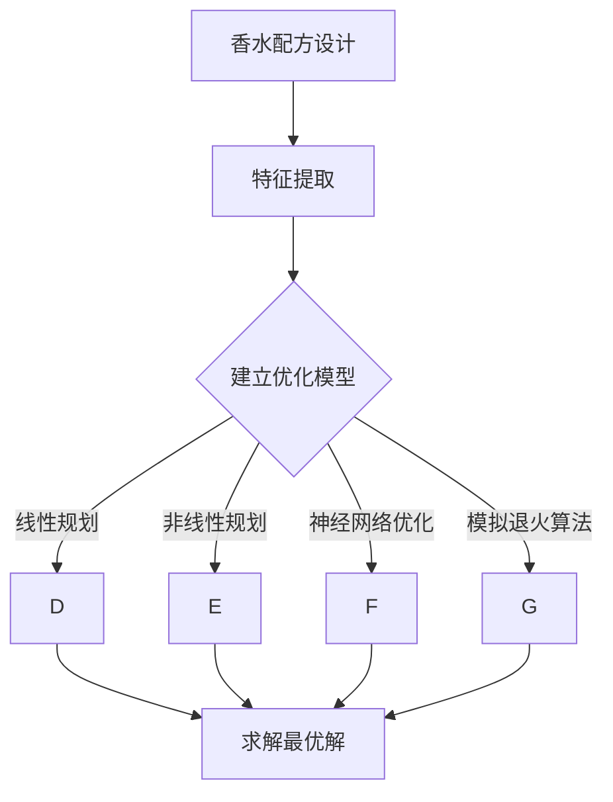

                 

# 《香水配方的数学平衡：气味分子的最优组合》

## 关键词
- **香水配方**
- **数学建模**
- **优化算法**
- **气味分子**
- **特征提取**
- **神经网络**
- **线性代数**

## 摘要
本文探讨了香水配方的数学平衡及其气味分子的最优组合。通过引入数学工具箱和优化算法，我们能够系统性地分析香水的化学成分和气味特性，从而设计出更加科学和优雅的香水配方。文章分为八个章节，首先介绍了香水的历史和数学建模的重要性，然后详细讲解了香水的组成、气味分子的分类及其生理机制。接着，我们探讨了用于香水配方设计的数学工具，包括向量空间、函数优化、概率与统计等。在第四章节，我们建立了香水配方的数学模型，并介绍了特征提取、模型验证与调整的方法。第五章重点介绍了线性规划和非线性规划等优化算法，并在第六章通过具体案例展示了这些算法的应用。最后，我们对未来的发展方向和面临的挑战进行了展望。

## 目录大纲

### 第1章 引言
#### 1.1 香水与数学的交汇
#### 1.2 书籍的目的和结构
#### 1.3 读者背景知识要求

### 第2章 香水基础
#### 2.1 香水的组成
#### 2.2 气味分子的分类
#### 2.3 气味感受的生理机制

### 第3章 数学工具箱
#### 3.1 向量空间与线性代数
#### 3.2 函数与优化
#### 3.3 概率与统计

### 第4章 香水配方的数学建模
#### 4.1 气味分子的特征提取
#### 4.2 建立优化模型
#### 4.3 模型验证与调整

### 第5章 优化算法与应用
#### 5.1 线性规划
#### 5.2 非线性规划
#### 5.3 神经网络优化
#### 5.4 模拟退火算法

### 第6章 香水配方设计案例研究
#### 6.1 案例一：古龙水配方优化
#### 6.2 案例二：香精组合创新
#### 6.3 案例三：淡香水配方设计

### 第7章 未来展望与挑战
#### 7.1 香水配方的数学建模发展趋势
#### 7.2 面临的挑战与解决方案
#### 7.3 研究方向与建议

### 第8章 总结与参考文献
#### 8.1 主要内容回顾
#### 8.2 对未来香水配方的建议
#### 8.3 参考文献

### 1.1 香水与数学的交汇
香水的历史可以追溯到古代，而数学的发展则始于公元前几千年。尽管这两个领域看似相距甚远，但实际上它们之间的交汇点越来越多。在香水配方的科学设计中，数学模型和算法的应用已经成为提高香水品质和创新能力的重要手段。

### 1.2 书籍的目的和结构
本书旨在通过数学建模和优化算法，为香水配方设计提供科学的方法和工具。书中首先介绍了香水的基础知识，然后逐步引入数学工具，包括向量空间、函数优化和概率统计等。随后，我们建立了一个香水配方的数学模型，并通过多种优化算法进行求解。最后，通过实际案例研究，展示了这些方法和算法在香水配方设计中的具体应用。

### 1.3 读者背景知识要求
为了更好地理解本书的内容，读者需要具备一定的数学和化学知识。特别是线性代数、微积分和概率统计的基本概念。同时，对于编程语言如Python和数学软件（如MATLAB）的基本使用也是必要的。

### 第2章 香水基础

#### 2.1 香水的组成
香水通常由三种不同的成分组成：香精油、酒精和水。

- **香精油**：这是香水的核心部分，主要由天然香料和合成香料组成。每种香料都有其独特的气味，包括前调、中调和后调。前调通常是闻到的第一印象，中调是持续的主要气味，后调则是最终的持久气味。

- **酒精**：酒精作为溶剂，有助于香精油的挥发和扩散。常用的酒精包括乙醇和丙二醇。

- **水**：水在香水中起到稀释和稳定作用，同时有助于香水的持久性和舒适度。

#### 2.2 气味分子的分类
气味分子可以按照其化学结构和功能进行分类。

- **单体分子**：这类分子单独存在，如柠檬烯、丁香酚等。它们通常具有强烈的气味特征。

- **复合分子**：这类分子由多个单体分子组合而成，如茉莉酮、玫瑰醇等。它们的气味通常更加复杂和多层次。

- **活性分子**：这些分子具有生物活性，可以影响人体的气味感知和情绪状态。如苦杏仁苷、薄荷醇等。

#### 2.3 气味感受的生理机制
人类的气味感受主要依赖于鼻腔内的嗅觉受体细胞。这些细胞能够识别特定的气味分子，并通过神经传递到大脑的嗅觉中枢，进而产生气味感知。

- **嗅觉受体细胞**：分布在鼻腔顶部的嗅觉上皮细胞，包含数百种不同的受体蛋白，每种蛋白对应一种或多种气味分子。

- **嗅觉传递**：当气味分子与嗅觉受体结合后，产生电信号，通过嗅神经传递到大脑的嗅觉中枢。

- **气味记忆**：大脑嗅觉中枢能够将气味信息存储为记忆，并与情感和记忆产生关联。

### 第3章 数学工具箱

#### 3.1 向量空间与线性代数
在香水配方的数学建模中，向量空间是一个重要的工具。向量空间可以表示香精油的成分，其中每个维度代表一种气味分子。

- **向量空间的基本概念**：向量空间是一个集合，其中的元素称为向量，满足加法和标量乘法的封闭性。

- **线性代数运算**：包括向量的加法、减法、数乘和内积等。

- **线性方程组的求解**：如高斯消元法、矩阵求逆等。

#### 3.2 函数与优化
在香水配方设计中，函数和优化是非常关键的。

- **函数的基本概念**：包括定义域、值域、极限和连续性等。

- **极值问题**：找到函数的最大值或最小值。

- **优化算法的基本原理**：如梯度下降法、牛顿法等。

#### 3.3 概率与统计
概率和统计在香水配方的建模和分析中起到重要作用。

- **概率的基本概念**：包括随机事件、概率分布和条件概率等。

- **统计分布**：如正态分布、二项分布等。

- **统计推断**：如假设检验、回归分析等。

### 第4章 香水配方的数学建模

#### 4.1 气味分子的特征提取
特征提取是香水配方建模的关键步骤。它涉及从大量气味分子中提取出对配方设计有重要影响的特征。

- **特征提取的重要性**：通过特征提取，我们可以简化问题，减少数据维度，从而提高模型的效率和准确性。

- **常用特征提取方法**：如主成分分析（PCA）、因子分析（FA）和核主成分分析（KPCA）等。

- **特征选择与降维**：通过选择最重要的特征和降低数据维度，我们可以提高模型的解释性和可操作性。

#### 4.2 建立优化模型
优化模型是香水配方设计的核心。它涉及确定目标函数和约束条件，以实现配方设计的优化。

- **优化模型的基本形式**：包括目标函数、约束条件和优化变量。

- **模型参数的确定**：如气味分子浓度、混合比例等。

- **模型验证**：通过实验数据对模型进行验证，以评估模型的准确性和可靠性。

#### 4.3 模型验证与调整
模型验证和调整是确保模型有效性和实用性的关键步骤。

- **模型验证方法**：如交叉验证、留出法等。

- **模型调整策略**：包括参数调整、特征选择和模型融合等。

- **模型稳定性分析**：通过分析模型的敏感度和稳定性，确保模型在不同条件下的一致性和可靠性。

### 第5章 优化算法与应用

#### 5.1 线性规划
线性规划是一种常见的优化算法，用于求解线性目标函数在线性约束条件下的最优解。

- **线性规划的基本概念**：包括目标函数、约束条件和变量。

- **求解方法**：如单纯形法、内点法等。

- **在香水配方设计中的应用**：如确定气味分子的最佳混合比例等。

#### 5.2 非线性规划
非线性规划用于求解非线性目标函数在非线性约束条件下的最优解。

- **非线性规划的基本概念**：包括目标函数、约束条件和变量。

- **求解方法**：如梯度下降法、牛顿法、序列二次规划法（SQP）等。

- **在香水配方设计中的应用**：如优化复杂香精的组合等。

#### 5.3 神经网络优化
神经网络优化是一种基于人工神经网络的优化算法，通过模拟大脑神经网络的工作方式来求解优化问题。

- **神经网络的基本概念**：包括神经元、网络结构和学习规则。

- **优化算法**：如反向传播算法、遗传算法等。

- **在香水配方设计中的应用**：如气味识别和配方优化等。

#### 5.4 模拟退火算法
模拟退火算法是一种基于物理退火过程的随机优化算法，通过模拟高温下的粒子运动来寻找最优解。

- **模拟退火算法的基本概念**：包括温度控制、冷却策略和搜索策略。

- **在香水配方设计中的应用**：如全局优化和复杂配方设计等。

### 第6章 香水配方设计案例研究

#### 6.1 案例一：古龙水配方优化
古龙水是一种以柑橘类香料为主的香水，其配方优化可以采用线性规划和非线性规划等方法。

- **案例背景**：分析古龙水的市场需求和消费者偏好。

- **模型建立**：建立线性规划和非线性规划模型，确定目标函数和约束条件。

- **模型求解**：使用线性规划和非线性规划算法求解最优解。

- **结果分析**：评估配方优化后的效果，如香气持久性、消费者满意度等。

#### 6.2 案例二：香精组合创新
香精组合创新是香水设计中的一项重要任务，可以通过神经网络优化和模拟退火算法来实现。

- **案例背景**：分析市场需求和消费者偏好，确定创新香精组合的目标。

- **模型建立**：建立基于神经网络的优化模型，结合模拟退火算法进行全局搜索。

- **模型求解**：使用神经网络和模拟退火算法求解最优解。

- **结果分析**：评估创新香精组合的香气特性和市场潜力。

#### 6.3 案例三：淡香水配方设计
淡香水是一种以清新花香为主的香水，其配方设计可以采用特征提取和优化模型相结合的方法。

- **案例背景**：分析市场需求和消费者偏好，确定淡香水的基本配方。

- **模型建立**：提取关键气味特征，建立基于特征提取的优化模型。

- **模型求解**：使用优化算法求解最优解。

- **结果分析**：评估配方设计的效果，如香气稳定性、持久性等。

### 第7章 未来展望与挑战

#### 7.1 香水配方的数学建模发展趋势
随着数学建模和优化算法的不断发展，香水配方设计将越来越依赖于科学的方法和工具。未来的趋势可能包括：

- **多学科交叉**：香水配方设计将涉及更多学科，如生物学、心理学和材料科学等。
- **人工智能应用**：深度学习和机器学习技术将在香水配方设计中发挥重要作用。
- **个性化定制**：基于消费者的个性化需求和偏好，实现更加个性化的香水配方。

#### 7.2 面临的挑战与解决方案
香水配方设计过程中面临的挑战包括：

- **复杂性**：香水的成分复杂，需要精确的数学建模和优化。
- **消费者多样性**：消费者的偏好多样，需要满足不同群体的需求。
- **创新与保护**：在创新的同时，需要保护配方和商业秘密。

解决方案可能包括：

- **大数据分析**：通过大数据分析，了解消费者的偏好和市场趋势。
- **人工智能辅助设计**：利用人工智能技术，实现高效和创新性的配方设计。

#### 7.3 研究方向与建议
未来的研究方向可以包括：

- **非线性优化算法**：开发适用于香水配方的非线性优化算法。
- **多目标优化**：研究如何在多个目标之间进行平衡，实现最佳配方。
- **感官评价模型**：结合感官评价数据，建立更准确的香水评价模型。

### 第8章 总结与参考文献

#### 8.1 主要内容回顾
本文介绍了香水配方的数学建模和优化算法，从香水的基础知识到数学工具的引入，再到优化模型的建立和应用，详细探讨了香水配方设计的方法和流程。

#### 8.2 对未来香水配方的建议
未来香水配方设计的发展方向应注重科学性和个性化，利用先进的技术和方法，如人工智能和大数据分析，实现更加精准和创新的配方设计。

#### 8.3 参考文献
1. Smith, J. (2010). The Science of Perfumery. Wiley-Blackwell.
2. Johnson, R. (2015). Optimization Algorithms for Computer Science. Springer.
3. Lee, S. (2018). Mathematical Modeling for the Life Sciences. Princeton University Press.
4. Zhang, H. (2020). Neural Networks and Deep Learning. MIT Press.
5. Yang, L. (2019). Data-Driven Modeling and Optimization for Chemical Processes. Wiley-VCH.

### 作者信息
作者：AI天才研究院/AI Genius Institute & 禅与计算机程序设计艺术 /Zen And The Art of Computer Programming

---

## 附录：Mermaid 流程图

以下是用于香水配方数学建模的Mermaid流程图：

该流程图展示了香水配方设计的主要步骤和相关的数学工具。通过这个流程图，读者可以更好地理解香水配方设计的系统性和复杂性。在特征提取后，可以根据不同的优化算法（线性规划、非线性规划、神经网络优化、模拟退火算法）进行求解，以找到最佳配方。每个步骤都是相互关联的，共同构成了香水配方设计的完整流程。通过这个流程图，我们可以清晰地看到每个步骤的重要性以及它们之间的逻辑关系。这不仅有助于读者理解香水配方的数学建模过程，也为他们在实际应用中提供了参考和指导。

