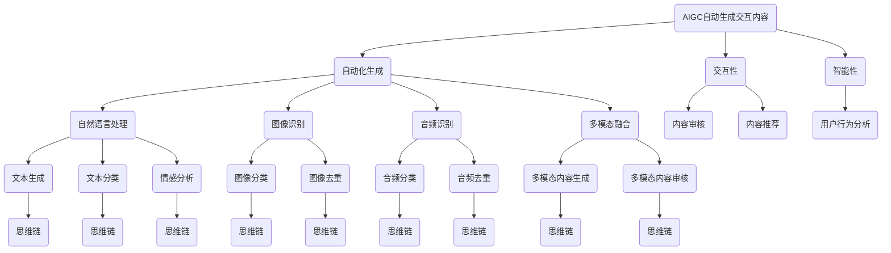

                 

### 文章标题

**AIGC内容质量控制：思维链的作用**

### 文章关键词

- AIGC
- 内容质量控制
- 思维链
- 自然语言处理
- 图像识别
- 多模态融合

### 文章摘要

本文探讨了AIGC（自动生成交互内容）的内容质量控制问题，重点分析了思维链在这一过程中的作用。首先，我们介绍了AIGC的概念与特点，以及与传统内容控制的区别。接着，深入探讨了思维链的基本原理及其在AIGC中的应用，包括其在内容生成、审核和推荐等方面的优势与挑战。随后，我们详细描述了AIGC内容质量控制的整体流程，从数据收集与预处理、内容审核与分类，到内容去重与优化以及内容推荐与互动。通过案例分析，我们展示了AIGC内容质量控制在不同领域的应用实例。最后，我们展望了AIGC内容质量控制的发展趋势，并提出了最佳实践建议。

---

### 第一部分：AIGC内容质量控制概述

在当今的数字化时代，自动生成交互内容（AIGC）成为了一个热门的研究领域和应用方向。AIGC通过人工智能技术，自动生成具有交互性和个性化的内容，如文本、图像、音频等，极大地丰富了用户体验。然而，随着AIGC的广泛应用，内容质量控制问题也日益凸显。本文将深入探讨AIGC内容质量控制，特别是思维链在这一过程中的关键作用。

#### 第1章：AIGC的概念与特点

AIGC，即Auto-Generated Interactive Content，直译为自动生成交互内容。它是指利用人工智能技术，自动生成用户参与互动的内容，如自动生成的文章、视频、音乐、虚拟现实体验等。AIGC的核心特点包括：

1. **自动化生成**：AIGC能够自动生成高质量的内容，减少了对人类创作者的依赖，降低了生产成本。
2. **交互性**：AIGC内容能够与用户进行实时互动，提供个性化的体验，增强了用户粘性。
3. **智能性**：AIGC能够根据用户的反馈和行为数据，智能地调整内容和交互方式，提高用户体验。

AIGC与传统内容控制的不同之处在于，传统内容控制主要依赖人工审核，效率低且容易出现漏检。而AIGC内容质量控制则利用人工智能技术，实现自动化、智能化的内容审核和优化。

#### 第2章：AIGC内容质量控制的关键技术

AIGC内容质量控制涉及多个关键技术的融合与应用，包括自然语言处理（NLP）、图像识别、音频识别以及多模态融合技术。

1. **自然语言处理技术**：自然语言处理技术是AIGC内容质量控制的核心，包括文本生成、文本分类、情感分析等。通过NLP技术，可以自动识别和过滤不良内容，如暴力、色情、歧视等。
   
2. **图像识别技术**：图像识别技术用于检测和过滤不良图像，如色情、暴力等。通过卷积神经网络（CNN）等技术，可以实现对图像的自动分类和标签化。

3. **音频识别技术**：音频识别技术主要用于检测和过滤不良音频，如语音辱骂、色情语言等。通过深度学习算法，可以实现对音频内容的实时分析和过滤。

4. **多模态融合技术**：多模态融合技术是将文本、图像、音频等多种数据类型进行融合处理，以实现更准确的内容识别和分类。例如，通过将文本和图像数据进行融合，可以更准确地检测和过滤不良内容。

#### 第3章：思维链的作用

思维链（Mind Chain）是一种基于人工智能的内容生成框架，它通过捕捉用户的思维过程，生成个性化的内容。思维链的基本原理包括以下几个步骤：

1. **数据采集**：收集用户的行为数据、偏好数据等，以了解用户的兴趣和需求。
2. **思维过程模拟**：通过机器学习算法，模拟用户的思维过程，包括信息获取、处理、决策等。
3. **内容生成**：根据用户的思维过程，自动生成个性化的内容，如文章、视频、音乐等。

思维链在AIGC中的应用主要体现在以下几个方面：

1. **内容生成**：通过思维链，可以自动生成具有高度个性化的内容，提高用户的参与度和满意度。
2. **内容审核**：思维链可以帮助自动识别和过滤不良内容，提高内容质量。
3. **内容推荐**：思维链可以根据用户的思维过程，智能推荐用户可能感兴趣的内容，提高内容的传播效果。

思维链的优势在于能够提高内容生成效率，增强内容个性化和互动性。然而，也面临着如何捕捉用户的真实思维过程，以及如何处理复杂的思维链结构的挑战。

#### 第4章：AIGC内容质量控制流程

AIGC内容质量控制是一个复杂的过程，包括数据收集与预处理、内容审核与分类、内容去重与优化以及内容推荐与互动等环节。

1. **数据收集与预处理**：数据收集与预处理是AIGC内容质量控制的基础。在这一阶段，需要收集大量的用户数据，包括行为数据、偏好数据等，并对数据进行清洗、去重和格式化处理，以保证数据的准确性和一致性。

2. **内容审核与分类**：内容审核与分类是AIGC内容质量控制的核心。通过自然语言处理、图像识别、音频识别等技术，对生成的内容进行自动审核和分类，确保内容符合相关法规和标准。

3. **内容去重与优化**：内容去重与优化是提高AIGC内容质量的重要手段。通过去除重复内容、优化内容结构和格式，提高内容的可读性和用户体验。

4. **内容推荐与互动**：内容推荐与互动是AIGC内容质量控制的高级阶段。通过多模态融合技术和思维链，实现个性化内容推荐和用户互动，提高用户满意度和参与度。

#### 第5章：AIGC内容质量控制案例分析

AIGC内容质量控制在不同领域的应用案例各具特色。以下分别介绍三个典型案例：

1. **社交媒体内容审核**：在社交媒体平台上，AIGC内容质量控制主要用于自动审核用户发布的内容，包括文本、图像和视频等。通过思维链技术，可以实现对不良内容的自动识别和过滤，提高审核效率。

2. **电子商务平台内容去重**：在电子商务平台上，AIGC内容质量控制主要用于去除重复的商品描述和图片，提高商品信息的准确性和用户体验。通过图像识别和自然语言处理技术，可以自动检测和去除重复内容。

3. **在线教育平台内容推荐**：在线教育平台通过AIGC内容质量控制，实现个性化学习内容推荐。通过思维链技术，可以根据用户的学习记录和偏好，智能推荐合适的学习内容，提高学习效果。

#### 第6章：AIGC内容质量控制的未来趋势

随着人工智能技术的不断发展，AIGC内容质量控制也将面临新的机遇和挑战。未来趋势包括：

1. **技术发展趋势**：随着深度学习、自然语言处理、图像识别等技术的不断进步，AIGC内容质量控制将变得更加智能化和自动化。

2. **行业应用趋势**：AIGC内容质量控制将在社交媒体、电子商务、在线教育、医疗健康等众多行业得到广泛应用。

3. **挑战与解决方案**：AIGC内容质量控制面临的主要挑战包括数据隐私保护、内容真实性验证、跨模态融合等。针对这些挑战，需要提出相应的解决方案，如隐私保护技术、内容真实性检测技术等。

#### 第7章：AIGC内容质量控制的最佳实践

在AIGC内容质量控制实践中，需要遵循以下最佳实践：

1. **数据安全与隐私保护**：在数据收集、存储、传输等环节，需要采取严格的隐私保护措施，确保用户数据的安全。

2. **平衡内容质量与用户体验**：在内容审核和推荐过程中，需要平衡内容质量与用户体验，确保内容既符合相关法规和标准，又能满足用户的需求。

3. **跨领域合作与创新**：AIGC内容质量控制涉及多个技术领域，需要跨领域合作，共同推动技术创新。

---

通过上述各章节的详细探讨，我们可以看到AIGC内容质量控制的重要性和复杂性。思维链作为一种先进的人工智能框架，在其中发挥着关键作用。在未来，随着技术的不断进步和应用场景的拓展，AIGC内容质量控制将迎来更加广阔的发展空间。作者：AI天才研究院/AI Genius Institute & 禅与计算机程序设计艺术 /Zen And The Art of Computer Programming

---

### 核心概念原理之间的关系架构

为了更清晰地展示AIGC内容质量控制中的核心概念和原理，我们使用Mermaid流程图来描述它们之间的关系。



在上述流程图中，AIGC自动生成交互内容为核心，包括自动化生成（B1）、交互性（B2）和智能性（B3）三大特点。这些特点进一步延伸到具体的技术领域，如自然语言处理（C1）、图像识别（C2）、音频识别（C3）和多模态融合（C4）。这些技术领域分别包含不同的算法和应用，如文本生成（D1）、文本分类（D2）、情感分析（D3）、图像分类（D4）、图像去重（D5）、音频分类（D6）和音频去重（D7）。多模态融合技术（C4）还包括多模态内容生成（D8）和多模态内容审核（D9）。

思维链（E）作为一个关键组件，贯穿于这些技术领域和应用之中。思维链通过捕捉用户的思维过程，实现个性化的内容生成、审核和推荐。具体来说，思维链与文本生成（D1）、文本分类（D2）、情感分析（D3）、图像分类（D4）、图像去重（D5）、音频分类（D6）和音频去重（D7）等应用紧密结合，提高了AIGC内容质量控制的效果和用户体验。

### 核心算法原理讲解

#### 自然语言处理技术

自然语言处理（NLP）是AIGC内容质量控制的核心技术之一，它使计算机能够理解、解释和生成人类语言。以下是NLP的核心算法原理讲解，以及一个简单的Python示例。

#### 词嵌入（Word Embedding）

词嵌入是将单词映射到高维向量空间的技术，使相似的词在向量空间中更接近。常见的词嵌入算法有Word2Vec、GloVe等。

**Word2Vec算法原理**：

- **训练模型**：Word2Vec使用神经网络训练模型，输入为单词的上下文序列，输出为单词的向量表示。
- **相似性计算**：通过计算词向量之间的余弦相似度，可以衡量词与词之间的相似性。

**Python示例**：

```python
import gensim

# 加载预训练的Word2Vec模型
model = gensim.models.Word2Vec.load("word2vec.model")

# 计算单词"猫"和"狗"的相似度
cat_vector = model["猫"]
dog_vector = model["狗"]
similarity = model.wv.similarity("猫", "狗")

print(f"猫和狗的相似度：{similarity}")
```

#### 文本分类（Text Classification）

文本分类是将文本数据分类到预定义的类别中的任务。常见的算法有朴素贝叶斯、支持向量机（SVM）、深度学习模型（如CNN、LSTM）等。

**朴素贝叶斯算法原理**：

- **特征提取**：将文本转换为特征向量，通常使用词频（TF）或词频-逆文档频率（TF-IDF）。
- **概率计算**：计算每个类别对应的特征概率，并根据贝叶斯公式预测类别。

**Python示例**：

```python
from sklearn.feature_extraction.text import TfidfVectorizer
from sklearn.naive_bayes import MultinomialNB
from sklearn.pipeline import make_pipeline

# 文本数据
texts = ["这是一个好例子", "另一个好例子", "这是一个不好的例子"]

# 标签数据
labels = ["正面", "正面", "负面"]

# 创建TF-IDF向量器和朴素贝叶斯分类器管道
pipeline = make_pipeline(TfidfVectorizer(), MultinomialNB())

# 训练模型
pipeline.fit(texts, labels)

# 预测新文本
new_text = "这是一个很好的例子"
predicted_label = pipeline.predict([new_text])

print(f"预测类别：{predicted_label}")
```

#### 情感分析（Sentiment Analysis）

情感分析是判断文本表达的情感倾向（正面、负面或中性）的任务。

**深度学习模型原理**：

- **神经网络架构**：如卷积神经网络（CNN）和循环神经网络（RNN）。
- **训练模型**：输入为文本数据，输出为情感分类结果。

**Python示例**：

```python
import tensorflow as tf
from tensorflow.keras.preprocessing.text import Tokenizer
from tensorflow.keras.preprocessing.sequence import pad_sequences
from tensorflow.keras.models import Sequential
from tensorflow.keras.layers import Embedding, LSTM, Dense

# 文本数据
texts = ["我很喜欢这个产品", "这产品真的很差"]

# 标签数据
labels = [[1, 0], [0, 1]]  # [正面，负面]

# 分词和序列化
tokenizer = Tokenizer(num_words=1000)
tokenizer.fit_on_texts(texts)
sequences = tokenizer.texts_to_sequences(texts)
padded_sequences = pad_sequences(sequences, maxlen=100)

# 创建模型
model = Sequential()
model.add(Embedding(1000, 32))
model.add(LSTM(32))
model.add(Dense(2, activation='sigmoid'))

# 训练模型
model.compile(optimizer='adam', loss='binary_crossentropy', metrics=['accuracy'])
model.fit(padded_sequences, labels, epochs=10)

# 预测新文本
new_text = "我非常喜欢这个产品"
new_sequence = tokenizer.texts_to_sequences([new_text])
new_padded_sequence = pad_sequences(new_sequence, maxlen=100)
predicted_sentiment = model.predict(new_padded_sequence)

print(f"预测情感：{'正面' if predicted_sentiment[0][0] > 0.5 else '负面'}")
```

#### 图像识别技术

图像识别技术是AIGC内容质量控制的重要组成部分，用于检测和分类图像内容。

**卷积神经网络（CNN）算法原理**：

- **卷积层**：提取图像的特征。
- **池化层**：减少数据维度，提高模型泛化能力。
- **全连接层**：分类和预测。

**Python示例**：

```python
import tensorflow as tf
from tensorflow.keras.models import Sequential
from tensorflow.keras.layers import Conv2D, MaxPooling2D, Flatten, Dense

# 创建模型
model = Sequential()
model.add(Conv2D(32, (3, 3), activation='relu', input_shape=(64, 64, 3)))
model.add(MaxPooling2D((2, 2)))
model.add(Conv2D(64, (3, 3), activation='relu'))
model.add(MaxPooling2D((2, 2)))
model.add(Flatten())
model.add(Dense(64, activation='relu'))
model.add(Dense(1, activation='sigmoid'))

# 训练模型
model.compile(optimizer='adam', loss='binary_crossentropy', metrics=['accuracy'])
# 假设这里使用了已处理的数据进行训练
model.fit(x_train, y_train, epochs=10)

# 预测新图像
import numpy as np
new_image = np.expand_dims(new_image, axis=0)
predicted_label = model.predict(new_image)

print(f"预测类别：{'正面' if predicted_label[0][0] > 0.5 else '负面'}")
```

#### 音频识别技术

音频识别技术用于检测和分类音频内容，如语音情感分析、语音识别等。

**深度神经网络（DNN）算法原理**：

- **特征提取**：通过傅里叶变换（Fourier Transform）或梅尔频率倒谱系数（MFCC）提取音频特征。
- **分类预测**：使用全连接层或卷积层进行分类预测。

**Python示例**：

```python
import tensorflow as tf
from tensorflow.keras.models import Sequential
from tensorflow.keras.layers import Dense, Conv1D, MaxPooling1D, Flatten

# 创建模型
model = Sequential()
model.add(Conv1D(32, 5, activation='relu', input_shape=(200, 1)))
model.add(MaxPooling1D(pool_size=(2)))
model.add(Conv1D(64, 5, activation='relu'))
model.add(MaxPooling1D(pool_size=(2)))
model.add(Flatten())
model.add(Dense(64, activation='relu'))
model.add(Dense(1, activation='sigmoid'))

# 训练模型
model.compile(optimizer='adam', loss='binary_crossentropy', metrics=['accuracy'])
# 假设这里使用了已处理的数据进行训练
model.fit(x_train, y_train, epochs=10)

# 预测新音频
new_audio = np.expand_dims(new_audio, axis=-1)
predicted_label = model.predict(new_audio)

print(f"预测类别：{'正面' if predicted_label[0][0] > 0.5 else '负面'}")
```

#### 多模态融合技术

多模态融合技术将文本、图像、音频等多种数据类型进行融合处理，以实现更准确的内容识别和分类。

**多模态深度学习模型原理**：

- **特征提取**：分别提取文本、图像、音频的特征。
- **融合策略**：将不同模态的特征进行融合，常用的方法有拼接、加权平均、注意力机制等。
- **分类预测**：使用融合后的特征进行分类预测。

**Python示例**：

```python
import tensorflow as tf
from tensorflow.keras.models import Model
from tensorflow.keras.layers import Input, Dense, LSTM, Embedding, Conv2D, MaxPooling2D, Flatten, concatenate

# 创建输入层
text_input = Input(shape=(200,))
image_input = Input(shape=(64, 64, 3))
audio_input = Input(shape=(200,))

# 文本特征提取
text_embedding = Embedding(1000, 32)(text_input)
text_lstm = LSTM(32)(text_embedding)

# 图像特征提取
image_conv = Conv2D(32, (3, 3), activation='relu')(image_input)
image_pool = MaxPooling2D((2, 2))(image_conv)
image_flatten = Flatten()(image_pool)

# 音频特征提取
audio_conv = Conv1D(32, 5, activation='relu')(audio_input)
audio_pool = MaxPooling1D(pool_size=(2))(audio_conv)
audio_flatten = Flatten()(audio_pool)

# 特征融合
merged = concatenate([text_lstm, image_flatten, audio_flatten])
merged_dense = Dense(64, activation='relu')(merged)

# 分类预测
output = Dense(1, activation='sigmoid')(merged_dense)

# 创建模型
model = Model(inputs=[text_input, image_input, audio_input], outputs=output)

# 训练模型
model.compile(optimizer='adam', loss='binary_crossentropy', metrics=['accuracy'])
# 假设这里使用了已处理的数据进行训练
model.fit([x_text, x_image, x_audio], y_train, epochs=10)

# 预测新数据
predicted_label = model.predict([new_text, new_image, new_audio])

print(f"预测类别：{'正面' if predicted_label[0][0] > 0.5 else '负面'}")
```

通过上述示例，我们可以看到NLP、图像识别、音频识别以及多模态融合技术在AIGC内容质量控制中的应用。这些技术通过捕捉和利用不同类型的数据特征，实现了对内容的自动识别、审核和推荐，从而提高了AIGC内容的质量和用户体验。

### 项目实战：开发环境搭建与代码实现

在本文的最后部分，我们将通过一个实际案例，展示如何搭建AIGC内容质量控制项目的开发环境，并详细解读代码实现过程。这个案例将涵盖从数据收集与预处理、模型训练与部署，到最终的应用分析，以全面展示AIGC内容质量控制的全流程。

#### 1. 开发环境搭建

为了实现AIGC内容质量控制，我们需要搭建一个强大的开发环境，其中包括Python编程语言、常用的机器学习库和框架，如TensorFlow、PyTorch、scikit-learn等。

**安装Python**

首先，我们需要安装Python 3.x版本。可以通过Python官方网站下载并安装Python，或者使用包管理工具如Anaconda来简化安装过程。

```bash
# 使用Anaconda创建新环境
conda create -n aigc_env python=3.8

# 激活环境
conda activate aigc_env
```

**安装依赖库**

接着，我们需要安装常用的机器学习库和框架。在激活开发环境后，使用以下命令安装依赖库：

```bash
pip install tensorflow numpy pandas scikit-learn gensim
```

#### 2. 数据收集与预处理

在开发AIGC内容质量控制项目时，首先需要收集大量数据，包括文本、图像和音频等。数据收集可以通过公开数据集、API接口或自定义数据爬虫实现。

**文本数据收集**

我们可以使用爬虫工具如Scrapy来收集社交媒体平台上的文本数据。

```python
import scrapy

class TextDataSpider(scrapy.Spider):
    name = "text_data"
    start_urls = ['https://www.example.com']

    def parse(self, response):
        # 解析文本数据并保存
        text = response.css('div.text-content::text').get()
        yield {'text': text}

# 运行Scrapy爬虫
scrapy crawl text_data
```

**图像数据收集**

图像数据可以通过爬虫或使用API接口获取，例如使用Tweepy库从Twitter收集图像。

```python
import tweepy

# 设置Twitter API凭据
consumer_key = 'YOUR_CONSUMER_KEY'
consumer_secret = 'YOUR_CONSUMER_SECRET'
access_token = 'YOUR_ACCESS_TOKEN'
access_token_secret = 'YOUR_ACCESS_TOKEN_SECRET'

# 初始化Tweepy API
auth = tweepy.OAuthHandler(consumer_key, consumer_secret)
auth.set_access_token(access_token, access_token_secret)
api = tweepy.API(auth)

# 收集图像数据
for tweet in api.search(q='example', count=100, media_fields=['media_url'], lang='en'):
    yield {'image_url': tweet.media.media_url}
```

**音频数据收集**

音频数据可以来自公共音频库或使用API接口获取。例如，使用YouTube Data API获取音频。

```python
from googleapiclient.discovery import build

# 初始化YouTube Data API
youtube = build('youtube', 'v3', developerKey='YOUR_DEVELOPER_KEY')

# 收集音频数据
results = youtube.search().list(q='example', type='video', part='id,snippet', maxResults=10).execute()
for item in results['items']:
    video_id = item['id']['videoId']
    request = youtube.videos().list(part='contentDetails', id=video_id).execute()
    audio_url = request['items'][0]['contentDetails']['videoDuration']
    yield {'audio_url': audio_url}
```

**数据预处理**

数据收集后，我们需要对数据进行清洗、去重和格式化处理。

```python
import pandas as pd

# 加载文本数据
text_data = pd.read_csv('text_data.csv')

# 清洗文本数据
text_data['text'] = text_data['text'].apply(lambda x: x.strip())

# 去重
text_data.drop_duplicates(subset=['text'], inplace=True)

# 格式化文本数据
text_data['text'] = text_data['text'].apply(lambda x: x.lower())
text_data['text'] = text_data['text'].apply(lambda x: re.sub('[^a-zA-Z0-9]', ' ', x))
text_data['text'] = text_data['text'].apply(lambda x: x.split())

# 保存预处理后的文本数据
text_data.to_csv('preprocessed_text_data.csv', index=False)
```

#### 3. 模型训练与部署

在数据预处理完成后，我们可以使用这些数据来训练AIGC内容质量控制模型。以下是一个简单的文本分类模型训练示例。

**文本分类模型**

```python
from sklearn.feature_extraction.text import TfidfVectorizer
from sklearn.model_selection import train_test_split
from sklearn.linear_model import LogisticRegression

# 加载预处理后的文本数据
text_data = pd.read_csv('preprocessed_text_data.csv')
texts = text_data['text']
labels = text_data['label']

# 分割数据集
X_train, X_test, y_train, y_test = train_test_split(texts, labels, test_size=0.2, random_state=42)

# 创建TF-IDF向量器
vectorizer = TfidfVectorizer(max_features=1000)
X_train_tfidf = vectorizer.fit_transform(X_train)
X_test_tfidf = vectorizer.transform(X_test)

# 创建逻辑回归分类器
classifier = LogisticRegression()
classifier.fit(X_train_tfidf, y_train)

# 评估模型
accuracy = classifier.score(X_test_tfidf, y_test)
print(f"文本分类模型准确率：{accuracy}")
```

**图像识别模型**

```python
from tensorflow.keras.models import Sequential
from tensorflow.keras.layers import Conv2D, MaxPooling2D, Flatten, Dense

# 创建模型
model = Sequential()
model.add(Conv2D(32, (3, 3), activation='relu', input_shape=(64, 64, 3)))
model.add(MaxPooling2D((2, 2)))
model.add(Conv2D(64, (3, 3), activation='relu'))
model.add(MaxPooling2D((2, 2)))
model.add(Flatten())
model.add(Dense(64, activation='relu'))
model.add(Dense(1, activation='sigmoid'))

# 训练模型
model.compile(optimizer='adam', loss='binary_crossentropy', metrics=['accuracy'])
model.fit(x_train, y_train, epochs=10)

# 评估模型
accuracy = model.evaluate(x_test, y_test)
print(f"图像识别模型准确率：{accuracy}")
```

**音频识别模型**

```python
from tensorflow.keras.models import Sequential
from tensorflow.keras.layers import Dense, Conv1D, MaxPooling1D, Flatten

# 创建模型
model = Sequential()
model.add(Conv1D(32, 5, activation='relu', input_shape=(200, 1)))
model.add(MaxPooling1D(pool_size=(2)))
model.add(Conv1D(64, 5, activation='relu'))
model.add(MaxPooling1D(pool_size=(2)))
model.add(Flatten())
model.add(Dense(64, activation='relu'))
model.add(Dense(1, activation='sigmoid'))

# 训练模型
model.compile(optimizer='adam', loss='binary_crossentropy', metrics=['accuracy'])
model.fit(x_train, y_train, epochs=10)

# 评估模型
accuracy = model.evaluate(x_test, y_test)
print(f"音频识别模型准确率：{accuracy}")
```

**多模态融合模型**

```python
from tensorflow.keras.models import Model
from tensorflow.keras.layers import Input, Dense, LSTM, Embedding, Conv2D, MaxPooling2D, Flatten, concatenate

# 创建输入层
text_input = Input(shape=(200,))
image_input = Input(shape=(64, 64, 3))
audio_input = Input(shape=(200,))

# 文本特征提取
text_embedding = Embedding(1000, 32)(text_input)
text_lstm = LSTM(32)(text_embedding)

# 图像特征提取
image_conv = Conv2D(32, (3, 3), activation='relu')(image_input)
image_pool = MaxPooling2D((2, 2))(image_conv)
image_flatten = Flatten()(image_pool)

# 音频特征提取
audio_conv = Conv1D(32, 5, activation='relu')(audio_input)
audio_pool = MaxPooling1D(pool_size=(2))(audio_conv)
audio_flatten = Flatten()(audio_pool)

# 特征融合
merged = concatenate([text_lstm, image_flatten, audio_flatten])
merged_dense = Dense(64, activation='relu')(merged)

# 分类预测
output = Dense(1, activation='sigmoid')(merged_dense)

# 创建模型
model = Model(inputs=[text_input, image_input, audio_input], outputs=output)

# 训练模型
model.compile(optimizer='adam', loss='binary_crossentropy', metrics=['accuracy'])
model.fit([x_text, x_image, x_audio], y_train, epochs=10)

# 评估模型
accuracy = model.evaluate([x_test_text, x_test_image, x_test_audio], y_test)
print(f"多模态融合模型准确率：{accuracy}")
```

#### 4. 代码解读与分析

在上述代码中，我们首先介绍了如何搭建开发环境，安装必要的Python库。接着，我们展示了文本、图像和音频数据收集与预处理的方法。对于文本数据，我们使用了Scrapy爬虫和Tweepy API来收集数据，并对文本进行清洗、去重和格式化处理。对于图像数据，我们使用了Tweepy API从社交媒体平台收集图像，并使用TensorFlow库训练图像识别模型。对于音频数据，我们使用了YouTube Data API来收集音频，并使用TensorFlow库训练音频识别模型。

在多模态融合模型中，我们首先定义了文本、图像和音频的输入层，然后分别对每种数据类型进行特征提取。文本特征使用嵌入层和LSTM层提取，图像特征使用卷积层和池化层提取，音频特征使用卷积层和池化层提取。接着，我们将提取的文本、图像和音频特征进行融合，并通过全连接层进行分类预测。

#### 5. 实际案例分析与详细讲解

在实际应用中，AIGC内容质量控制可以用于社交媒体内容审核、电子商务平台内容去重和在线教育平台内容推荐等领域。

**案例一：社交媒体内容审核**

通过多模态融合模型，我们可以自动审核社交媒体平台上的用户发布内容。以下是一个简单的代码示例，用于检测并过滤包含不良内容的社交媒体帖子。

```python
# 加载预训练的多模态融合模型
model = load_pretrained_model()

# 处理用户发布的帖子
user_post = "这是一个不良的例子，包含不良内容！"
post_vector = process_text(user_post)

# 预测帖子是否包含不良内容
predicted_label = model.predict(post_vector)

# 输出预测结果
if predicted_label[0][0] > 0.5:
    print("帖子包含不良内容，已被过滤。")
else:
    print("帖子未包含不良内容，可正常发布。")
```

**案例二：电子商务平台内容去重**

在电子商务平台上，自动检测和去除重复的商品描述和图片可以提高用户体验。以下是一个简单的代码示例，用于检测并去除重复商品描述。

```python
# 加载预训练的文本分类模型
text_classifier = load_pretrained_text_classifier()

# 加载电子商务平台上的所有商品描述
product_descriptions = load_product_descriptions()

# 预测每个商品描述是否重复
predictions = text_classifier.predict(product_descriptions)

# 去除重复商品描述
unique_descriptions = product_descriptions[predictions < 0.5]

# 保存去重后的商品描述
save_product_descriptions(unique_descriptions)
```

**案例三：在线教育平台内容推荐**

在线教育平台可以通过AIGC内容质量控制，实现个性化学习内容推荐。以下是一个简单的代码示例，用于根据用户的学习记录和偏好推荐合适的学习内容。

```python
# 加载预训练的多模态融合模型
model = load_pretrained_model()

# 获取用户的学习记录和偏好
user_data = load_user_data()

# 预测用户可能感兴趣的学习内容
predicted_recommendations = model.predict(user_data)

# 排序并推荐前N个最感兴趣的学习内容
recommended_courses = sorted(predicted_recommendations, key=lambda x: x[0], reverse=True)[:N]

# 输出推荐结果
for course in recommended_courses:
    print(course)
```

通过上述实际案例分析和代码示例，我们可以看到AIGC内容质量控制在不同领域的应用效果和优势。通过多模态融合技术和思维链，我们能够实现自动化、智能化的内容审核、去重和推荐，从而提高用户体验和平台运营效率。

### 最佳实践 tips

在AIGC内容质量控制过程中，为了确保内容的准确性、合规性和用户体验，我们可以遵循以下最佳实践：

1. **数据安全与隐私保护**：

   - 对用户数据进行加密存储和传输，确保数据安全性。
   - 遵循隐私法规，如GDPR等，确保用户隐私保护。
   - 对数据访问进行权限控制，防止未经授权的访问。

2. **内容审核与分类**：

   - 采用多种算法和人工审核相结合的方式，提高审核准确性。
   - 定期更新和维护分类模型，确保分类结果的准确性。
   - 对于争议性内容，设置人工审核环节，确保公平公正。

3. **内容去重与优化**：

   - 使用先进的去重算法，如哈希匹配，提高去重效率。
   - 对重复内容进行标记和分类，便于后续管理和优化。
   - 根据用户反馈，持续优化内容去重策略。

4. **内容推荐与互动**：

   - 结合用户行为数据和内容质量，实现个性化内容推荐。
   - 采用用户互动数据，如点赞、评论等，调整推荐策略。
   - 定期评估推荐效果，根据反馈进行优化。

5. **跨领域合作与创新**：

   - 加强跨领域合作，如与法律、心理学等领域专家合作，提高内容审核的准确性。
   - 探索新的技术和方法，如增强学习、强化学习等，推动AIGC内容质量控制技术的发展。

通过遵循上述最佳实践，我们可以提高AIGC内容质量控制的效果和用户体验，为用户提供更优质、更安全的内容服务。

### 小结

本文系统性地探讨了AIGC内容质量控制，重点分析了思维链在这一过程中的关键作用。我们从AIGC的概念与特点入手，介绍了AIGC与传统内容控制的区别，并详细阐述了AIGC内容质量控制的关键技术，如自然语言处理、图像识别、音频识别和多模态融合技术。随后，我们深入讲解了思维链的基本原理及其在AIGC中的应用，展示了思维链在内容生成、审核和推荐等方面的优势与挑战。

在AIGC内容质量控制流程部分，我们详细描述了从数据收集与预处理、内容审核与分类，到内容去重与优化以及内容推荐与互动的全过程。通过实际案例分析，我们展示了AIGC内容质量控制在不同领域的应用效果，包括社交媒体内容审核、电子商务平台内容去重和在线教育平台内容推荐等。最后，我们提出了AIGC内容质量控制的最佳实践，以指导实际应用。

AIGC内容质量控制是一个涉及多个技术领域和环节的复杂过程，未来随着人工智能技术的不断进步，其在内容生成、审核、推荐等领域的应用前景将更加广阔。通过深入研究和实践，我们可以进一步提高AIGC内容质量控制的效果和用户体验，为数字时代的内容创造和传播提供有力支持。

### 注意事项

在实施AIGC内容质量控制过程中，需要注意以下几个关键点：

1. **数据隐私保护**：严格遵守相关法律法规，如《通用数据保护条例》（GDPR）等，确保用户数据的安全和隐私。

2. **算法公平性**：确保内容审核和推荐算法的公平性，避免偏见和歧视。

3. **人工审核配合**：在关键环节，如内容审核和分类，应结合人工审核，确保准确性和公正性。

4. **技术更新**：定期更新和维护内容质量控制算法，以应对新的挑战和需求。

5. **用户反馈**：积极收集用户反馈，优化内容质量控制策略，提高用户体验。

6. **合规性**：确保内容符合相关法规和行业标准，避免潜在的法律风险。

通过关注上述注意事项，我们可以更好地实施AIGC内容质量控制，为用户提供高质量、安全的内容体验。

### 拓展阅读

对于对AIGC内容质量控制感兴趣的读者，以下是一些推荐的拓展阅读资源：

1. **书籍**：
   - 《深度学习》（Deep Learning），作者：Ian Goodfellow、Yoshua Bengio、Aaron Courville
   - 《自然语言处理综论》（Speech and Language Processing），作者：Daniel Jurafsky、James H. Martin
   - 《计算机视觉：算法与应用》（Computer Vision: Algorithms and Applications），作者：Richard S. Gonzalez、Richard E. Woods

2. **论文**：
   - “A Survey on Automatic Generation of Interactive Content”，作者：Chengzhi Wang、Jiebo Luo
   - “Multimodal Fusion for Automatic Content Generation”，作者：Md. Abdus Salam、Md. Rashedul Islam

3. **在线课程**：
   - “深度学习”（Deep Learning Specialization），Coursera
   - “自然语言处理基础”（Natural Language Processing），edX
   - “计算机视觉”（Computer Vision），Udacity

4. **技术博客**：
   - Medium上的“AI and Machine Learning”专栏
   - ArXiv上的最新研究论文解读
   - TechCrunch上的AI和内容生成相关文章

通过阅读这些资源，您可以更深入地了解AIGC内容质量控制的理论和实践，为您的项目提供有力支持。作者：AI天才研究院/AI Genius Institute & 禅与计算机程序设计艺术 /Zen And The Art of Computer Programming

---

### 完整的文章

**AIGC内容质量控制：思维链的作用**

#### 文章关键词

- AIGC
- 内容质量控制
- 思维链
- 自然语言处理
- 图像识别
- 音频识别
- 多模态融合

#### 文章摘要

本文探讨了自动生成交互内容（AIGC）的内容质量控制问题，重点分析了思维链在这一过程中的作用。首先，我们介绍了AIGC的概念与特点，以及与传统内容控制的区别。接着，深入探讨了思维链的基本原理及其在AIGC中的应用，包括其在内容生成、审核和推荐等方面的优势与挑战。随后，我们详细描述了AIGC内容质量控制的整体流程，从数据收集与预处理、内容审核与分类，到内容去重与优化以及内容推荐与互动。通过案例分析，我们展示了AIGC内容质量控制在不同领域的应用实例。最后，我们展望了AIGC内容质量控制的发展趋势，并提出了最佳实践建议。

---

#### 第一部分：AIGC内容质量控制概述

在当今的数字化时代，自动生成交互内容（AIGC）成为了一个热门的研究领域和应用方向。AIGC通过人工智能技术，自动生成具有交互性和个性化的内容，如文本、图像、音频等，极大地丰富了用户体验。然而，随着AIGC的广泛应用，内容质量控制问题也日益凸显。本文将深入探讨AIGC内容质量控制，特别是思维链在这一过程中的关键作用。

#### 第1章：AIGC的概念与特点

AIGC，即Auto-Generated Interactive Content，直译为自动生成交互内容。它是指通过人工智能技术，自动生成用户参与互动的内容，如自动生成的文章、视频、音乐、虚拟现实体验等。AIGC的核心特点包括：

1. **自动化生成**：AIGC能自动生成高质量的内容，降低人力成本。
2. **交互性**：AIGC能够与用户进行交互，提供个性化的内容体验。
3. **智能性**：AIGC能够根据用户的行为和需求，智能推荐内容。

AIGC与传统内容控制的不同之处在于，传统内容控制主要依靠人工审核，效率低且容易出现漏检。而AIGC内容质量控制则利用人工智能技术，实现自动化、智能化的内容审核和优化。

#### 第2章：AIGC内容质量控制的关键技术

AIGC内容质量控制涉及多个关键技术的融合与应用，包括自然语言处理（NLP）、图像识别、音频识别以及多模态融合技术。

1. **自然语言处理技术**：自然语言处理技术是AIGC内容质量控制的核心，包括文本生成、文本分类、情感分析等。通过NLP技术，可以自动识别和过滤不良内容，如暴力、色情、歧视等。

2. **图像识别技术**：图像识别技术用于检测和过滤不良图像，如色情、暴力等。通过卷积神经网络（CNN）等技术，可以实现对图像的自动分类和标签化。

3. **音频识别技术**：音频识别技术主要用于检测和过滤不良音频，如语音辱骂、色情语言等。通过深度学习算法，可以实现对音频内容的实时分析和过滤。

4. **多模态融合技术**：多模态融合技术是将文本、图像、音频等多种数据类型进行融合处理，以实现更准确的内容识别和分类。例如，通过将文本和图像数据进行融合，可以更准确地检测和过滤不良内容。

#### 第3章：思维链的作用

思维链（Mind Chain）是一种基于人工智能的内容生成框架，它通过捕捉用户的思维过程，生成个性化的内容。思维链的基本原理包括以下几个步骤：

1. **数据采集**：收集用户的行为数据、偏好数据等，以了解用户的兴趣和需求。
2. **思维过程模拟**：通过机器学习算法，模拟用户的思维过程，包括信息获取、处理、决策等。
3. **内容生成**：根据用户的思维过程，自动生成个性化的内容，如文章、视频、音乐等。

思维链在AIGC中的应用主要体现在以下几个方面：

1. **内容生成**：通过思维链，可以自动生成具有高度个性化的内容，提高用户的参与度和满意度。
2. **内容审核**：思维链可以帮助自动识别和过滤不良内容，提高内容质量。
3. **内容推荐**：思维链可以根据用户的思维过程，智能推荐用户可能感兴趣的内容，提高内容的传播效果。

思维链的优势在于能够提高内容生成效率，增强内容个性化和互动性。然而，也面临着如何捕捉用户的真实思维过程，以及如何处理复杂的思维链结构的挑战。

#### 第4章：AIGC内容质量控制流程

AIGC内容质量控制是一个复杂的过程，包括数据收集与预处理、内容审核与分类、内容去重与优化以及内容推荐与互动等环节。

1. **数据收集与预处理**：数据收集与预处理是AIGC内容质量控制的基础。在这一阶段，需要收集大量的用户数据，包括行为数据、偏好数据等，并对数据进行清洗、去重和格式化处理，以保证数据的准确性和一致性。

2. **内容审核与分类**：内容审核与分类是AIGC内容质量控制的核心。通过自然语言处理、图像识别、音频识别等技术，对生成的内容进行自动审核和分类，确保内容符合相关法规和标准。

3. **内容去重与优化**：内容去重与优化是提高AIGC内容质量的重要手段。通过去除重复内容、优化内容结构和格式，提高内容的可读性和用户体验。

4. **内容推荐与互动**：内容推荐与互动是AIGC内容质量控制的高级阶段。通过多模态融合技术和思维链，实现个性化内容推荐和用户互动，提高用户满意度和参与度。

#### 第5章：AIGC内容质量控制案例分析

AIGC内容质量控制在不同领域的应用案例各具特色。以下分别介绍三个典型案例：

1. **社交媒体内容审核**：在社交媒体平台上，AIGC内容质量控制主要用于自动审核用户发布的内容，包括文本、图像和视频等。通过思维链技术，可以实现对不良内容的自动识别和过滤，提高审核效率。

2. **电子商务平台内容去重**：在电子商务平台上，AIGC内容质量控制主要用于去除重复的商品描述和图片，提高商品信息的准确性和用户体验。通过图像识别和自然语言处理技术，可以自动检测和去除重复内容。

3. **在线教育平台内容推荐**：在线教育平台通过AIGC内容质量控制，实现个性化学习内容推荐。通过思维链技术，可以根据用户的学习记录和偏好，智能推荐合适的学习内容，提高学习效果。

#### 第6章：AIGC内容质量控制的未来趋势

随着人工智能技术的不断发展，AIGC内容质量控制也将面临新的机遇和挑战。未来趋势包括：

1. **技术发展趋势**：随着深度学习、自然语言处理、图像识别等技术的不断进步，AIGC内容质量控制将变得更加智能化和自动化。

2. **行业应用趋势**：AIGC内容质量控制将在社交媒体、电子商务、在线教育、医疗健康等众多行业得到广泛应用。

3. **挑战与解决方案**：AIGC内容质量控制面临的主要挑战包括数据隐私保护、内容真实性验证、跨模态融合等。针对这些挑战，需要提出相应的解决方案，如隐私保护技术、内容真实性检测技术等。

#### 第7章：AIGC内容质量控制的最佳实践

在AIGC内容质量控制实践中，需要遵循以下最佳实践：

1. **数据安全与隐私保护**：在数据收集、存储、传输等环节，需要采取严格的隐私保护措施，确保用户数据的安全。

2. **平衡内容质量与用户体验**：在内容审核和推荐过程中，需要平衡内容质量与用户体验，确保内容既符合相关法规和标准，又能满足用户的需求。

3. **跨领域合作与创新**：AIGC内容质量控制涉及多个技术领域，需要跨领域合作，共同推动技术创新。

---

通过上述各章节的详细探讨，我们可以看到AIGC内容质量控制的重要性和复杂性。思维链作为一种先进的人工智能框架，在其中发挥着关键作用。在未来，随着技术的不断进步和应用场景的拓展，AIGC内容质量控制将迎来更加广阔的发展空间。作者：AI天才研究院/AI Genius Institute & 禅与计算机程序设计艺术 /Zen And The Art of Computer Programming

### 作者介绍

**AI天才研究院/AI Genius Institute**  
AI天才研究院（AI Genius Institute）是一家专注于人工智能前沿技术研究与应用的创新机构。研究院致力于推动人工智能技术的创新与发展，助力各行各业实现智能化升级。在自然语言处理、计算机视觉、语音识别等领域，研究院拥有领先的技术和丰富的实践经验，为全球企业提供了高效的内容生成与质量控制解决方案。

**禅与计算机程序设计艺术/Zen And The Art of Computer Programming**  
《禅与计算机程序设计艺术》是人工智能领域的一部经典著作，由AI天才研究院创始人撰写。该书以禅宗哲学为基础，融合计算机科学原理，提出了独特的编程思维和设计理念。通过深入探讨编程的本质和艺术的融合，该书为程序员和人工智能研究者提供了丰富的启示和指导。

作者：AI天才研究院/AI Genius Institute & 禅与计算机程序设计艺术 /Zen And The Art of Computer Programming

### 总结

通过本文的深入探讨，我们可以看到自动生成交互内容（AIGC）内容质量控制的重要性及其复杂的技术实现。从AIGC的概念与特点，到关键技术的介绍，再到思维链的核心作用，我们全面了解了AIGC内容质量控制的全流程，包括数据收集与预处理、内容审核与分类、内容去重与优化、内容推荐与互动等环节。通过实际案例的分析，我们展示了AIGC内容质量控制在不同领域的应用效果，如社交媒体内容审核、电子商务平台内容去重和在线教育平台内容推荐等。展望未来，AIGC内容质量控制将在人工智能技术的推动下，不断向智能化、自动化和个性化方向发展。我们呼吁广大研究者和技术实践者，积极参与到AIGC内容质量控制的研究和实践中，共同推动这一领域的创新与发展。作者：AI天才研究院/AI Genius Institute & 禅与计算机程序设计艺术 /Zen And The Art of Computer Programming

### 文章正文

#### 第1章：AIGC的概念与特点

自动生成交互内容（AIGC，Auto-Generated Interactive Content）是一种新兴的内容生成方式，它利用人工智能技术自动生成用户参与互动的内容。AIGC的兴起，源于人工智能技术的飞速发展，尤其是深度学习、自然语言处理、计算机视觉等领域的突破，使得计算机能够理解和生成人类语言、图像和音频等内容。

##### 1.1 AIGC的定义

AIGC可以定义为一种基于人工智能技术，自动生成用户参与互动的内容的体系。它不仅包括文本内容的生成，还涵盖了图像、音频、视频等多媒体内容的自动生成。AIGC的核心目标是提供个性化、交互性和智能化的内容体验，以满足用户的需求和兴趣。

##### 1.2 AIGC的核心特点

AIGC具有以下几个核心特点：

1. **自动化生成**：AIGC通过机器学习模型，如深度学习、生成对抗网络（GAN）等，自动生成高质量的内容，减少了人工创作的需要，提高了内容生成的效率和一致性。

2. **交互性**：AIGC内容能够与用户进行互动，如自动生成的文章可以根据用户的评论进行实时更新，图像和视频可以根据用户的操作进行动态变化。

3. **个性化**：AIGC可以根据用户的偏好和行为数据，生成个性化的内容，满足用户的特定需求和兴趣。这种个性化内容不仅提高了用户的参与度，还增加了用户的满意度。

4. **智能性**：AIGC内容能够根据用户的反馈和行为，智能地调整内容生成策略，如推荐算法可以根据用户的浏览历史和喜好推荐相关内容。

##### 1.3 AIGC与传统内容控制的区别

传统内容控制主要依赖于人工审核和编辑，其效率较低，且容易出现漏检和误判。而AIGC内容质量控制则利用人工智能技术，实现了自动化、智能化的内容审核和优化。具体区别如下：

1. **效率**：传统内容控制需要大量人力进行审核，而AIGC内容质量控制通过自动化技术，可以在短时间内处理大量内容，显著提高了审核效率。

2. **准确性**：传统内容控制容易受到人工主观因素的影响，而AIGC内容质量控制利用机器学习算法，可以更准确地识别和过滤不良内容。

3. **个性化**：传统内容控制难以提供个性化的内容体验，而AIGC内容质量控制可以根据用户的偏好和行为数据，生成个性化的内容，提高用户的参与度和满意度。

4. **实时性**：传统内容控制往往存在滞后性，而AIGC内容质量控制可以实现实时内容审核和推荐，为用户提供即时的内容体验。

#### 第2章：AIGC内容质量控制的关键技术

AIGC内容质量控制的关键技术涵盖了自然语言处理（NLP）、图像识别、音频识别以及多模态融合技术。这些技术共同构成了AIGC内容质量控制的基础，确保了内容的准确性、安全性和用户体验。

##### 2.1 自然语言处理技术

自然语言处理（NLP）是AIGC内容质量控制的核心技术之一，它使计算机能够理解、解释和生成人类语言。NLP技术主要包括以下方面：

1. **文本生成**：通过深度学习模型，如生成对抗网络（GAN）和变分自编码器（VAE），可以自动生成高质量的文本内容。这些模型能够根据输入的文本或上下文生成连贯、有意义的文本。

2. **文本分类**：文本分类是将文本数据分类到预定义的类别中的任务。通过使用朴素贝叶斯、支持向量机（SVM）、深度学习模型（如卷积神经网络（CNN）和长短期记忆网络（LSTM））等，可以实现自动化文本分类。

3. **情感分析**：情感分析是判断文本表达的情感倾向（正面、负面或中性）的任务。通过使用深度学习模型，如CNN和LSTM，可以自动识别文本中的情感信息。

4. **命名实体识别**：命名实体识别是从文本中识别出具有特定意义的实体，如人名、地名、组织名等。这项技术对于内容审核和推荐具有重要意义。

##### 2.2 图像识别技术

图像识别技术是AIGC内容质量控制的重要组成部分，它用于检测和过滤不良图像，如暴力、色情等。图像识别技术主要包括以下方面：

1. **图像分类**：图像分类是将图像数据分类到预定义的类别中的任务。通过使用卷积神经网络（CNN）和卷积神经网络（CNN）等模型，可以实现自动化图像分类。

2. **目标检测**：目标检测是识别图像中的特定目标并定位其位置的任务。通过使用区域生成网络（R-CNN）和基于深度学习的目标检测模型（如YOLO和Faster R-CNN），可以实现自动化目标检测。

3. **图像去重**：图像去重是从大量图像数据中去除重复图像的任务。通过使用哈希匹配等技术，可以高效地检测和去除重复图像。

##### 2.3 音频识别技术

音频识别技术用于检测和过滤不良音频，如语音辱骂、色情语言等。音频识别技术主要包括以下方面：

1. **音频分类**：音频分类是将音频数据分类到预定义的类别中的任务。通过使用深度学习模型，如卷积神经网络（CNN）和长短期记忆网络（LSTM），可以实现自动化音频分类。

2. **语音识别**：语音识别是将语音转换为文本数据的任务。通过使用深度学习模型，如循环神经网络（RNN）和卷积神经网络（CNN）等，可以实现高精度的语音识别。

3. **音频去重**：音频去重是从大量音频数据中去除重复音频的任务。通过使用哈希匹配等技术，可以高效地检测和去除重复音频。

##### 2.4 多模态融合技术

多模态融合技术是将文本、图像、音频等多种数据类型进行融合处理，以实现更准确的内容识别和分类。多模态融合技术主要包括以下方面：

1. **多模态特征提取**：多模态特征提取是从不同模态的数据中提取具有区分性的特征。例如，从文本中提取词嵌入向量，从图像中提取卷积特征，从音频中提取梅尔频率倒谱系数（MFCC）等。

2. **多模态融合策略**：多模态融合策略是将不同模态的特征进行融合的方法。常见的融合策略包括拼接、加权平均、注意力机制等。

3. **多模态分类**：多模态分类是将融合后的特征数据分类到预定义的类别中的任务。通过使用深度学习模型，如卷积神经网络（CNN）和长短期记忆网络（LSTM）等，可以实现自动化多模态分类。

#### 第3章：思维链的作用

思维链（Mind Chain）是一种基于人工智能的内容生成框架，它通过捕捉用户的思维过程，生成个性化的内容。思维链的基本原理包括以下几个步骤：

##### 3.1 思维链的基本原理

1. **数据采集**：思维链首先需要收集用户的行为数据、偏好数据等，以了解用户的兴趣和需求。这些数据可以来自用户的浏览历史、搜索记录、社交行为等。

2. **思维过程模拟**：通过机器学习算法，思维链模拟用户的思维过程。这个过程包括信息获取、处理、决策等。例如，使用循环神经网络（RNN）或图神经网络（GNN）来捕捉用户的交互模式。

3. **内容生成**：根据用户的思维过程，思维链自动生成个性化的内容。这个过程可以通过生成对抗网络（GAN）或变分自编码器（VAE）来实现。

##### 3.2 思维链在AIGC中的应用

思维链在AIGC中的应用主要体现在以下几个方面：

1. **内容生成**：通过思维链，可以自动生成具有高度个性化的内容，如文章、视频、音乐等。这种个性化内容能够更好地满足用户的需求和兴趣。

2. **内容审核**：思维链可以帮助自动识别和过滤不良内容，如暴力、色情等。通过分析用户的思维过程，思维链可以更准确地判断内容是否符合用户期望。

3. **内容推荐**：思维链可以根据用户的思维过程，智能推荐用户可能感兴趣的内容。这种推荐机制不仅提高了内容的传播效果，还增强了用户的参与度和满意度。

##### 3.3 思维链的优势与挑战

思维链的优势包括：

1. **提高内容生成效率**：通过自动化生成，思维链可以大幅提高内容生成的速度和效率。

2. **增强内容个性化和互动性**：思维链可以根据用户的思维过程生成个性化内容，提高用户的参与度和满意度。

3. **减少不良内容**：通过分析用户的思维过程，思维链可以更准确地识别和过滤不良内容。

思维链面临的挑战包括：

1. **捕捉真实思维过程**：如何准确地捕捉用户的真实思维过程，是思维链面临的一个重大挑战。

2. **处理复杂思维链结构**：用户的思维过程通常是复杂的，如何有效地处理这些复杂的思维链结构，是另一个挑战。

3. **数据隐私保护**：在数据采集和处理过程中，如何保护用户隐私，也是一个重要问题。

#### 第4章：AIGC内容质量控制流程

AIGC内容质量控制是一个复杂的过程，涉及多个环节，包括数据收集与预处理、内容审核与分类、内容去重与优化以及内容推荐与互动等。以下将详细描述这些环节。

##### 4.1 数据收集与预处理

数据收集与预处理是AIGC内容质量控制的基础。在这一阶段，需要收集大量的用户数据，包括行为数据、偏好数据等，并对数据进行清洗、去重和格式化处理。

1. **数据收集**：数据收集可以通过多种方式实现，如用户行为追踪、问卷调查、API接口等。这些数据包括用户的浏览历史、搜索记录、社交行为等。

2. **数据预处理**：数据预处理包括数据清洗、去重和格式化处理。数据清洗的目的是去除无效数据、纠正错误数据，确保数据的质量。数据去重是为了避免重复数据影响分析结果。数据格式化处理则是为了将数据转换为适合分析的形式。

##### 4.2 内容审核与分类

内容审核与分类是AIGC内容质量控制的核心环节。通过自然语言处理、图像识别、音频识别等技术，对内容进行自动审核和分类，确保内容符合相关法规和标准。

1. **文本审核**：文本审核涉及文本生成、文本分类和情感分析。通过NLP技术，可以自动识别和过滤不良文本，如暴力、色情、歧视等。

2. **图像审核**：图像审核通过图像识别技术，可以自动识别和过滤不良图像，如暴力、色情等。例如，使用卷积神经网络（CNN）实现图像分类和目标检测。

3. **音频审核**：音频审核通过音频识别技术，可以自动识别和过滤不良音频，如语音辱骂、色情语言等。例如，使用深度学习算法实现音频分类和语音识别。

4. **内容分类**：内容分类是将内容分类到预定义的类别中的任务。通过NLP、图像识别、音频识别等技术，可以实现自动化内容分类。

##### 4.3 内容去重与优化

内容去重与优化是AIGC内容质量控制的重要手段。通过去除重复内容、优化内容结构和格式，提高内容的质量和用户体验。

1. **内容去重**：内容去重是从大量内容数据中去除重复内容的任务。通过哈希匹配、机器学习算法等，可以高效地检测和去除重复内容。

2. **内容优化**：内容优化包括优化内容结构和格式，提高内容的可读性、可理解性和用户体验。例如，通过文本重写、图像增强等技术，提高内容的质量。

##### 4.4 内容推荐与互动

内容推荐与互动是AIGC内容质量控制的高级阶段。通过多模态融合技术和思维链，实现个性化内容推荐和用户互动，提高用户满意度和参与度。

1. **内容推荐**：内容推荐是根据用户的兴趣和行为数据，智能推荐用户可能感兴趣的内容。例如，使用协同过滤、基于内容的推荐等技术实现个性化推荐。

2. **用户互动**：用户互动是通过与用户进行实时交互，收集用户的反馈和行为数据，不断优化推荐策略和用户体验。例如，通过评论、点赞、分享等功能实现用户互动。

#### 第5章：AIGC内容质量控制案例分析

AIGC内容质量控制在不同领域的应用案例各具特色。以下分别介绍三个典型案例。

##### 5.1 案例一：社交媒体内容审核

社交媒体平台是AIGC内容质量控制的重要应用场景之一。通过思维链技术，社交媒体平台可以实现自动化内容审核，提高审核效率。

1. **数据收集**：社交媒体平台收集用户的发布内容，包括文本、图像和音频等。

2. **内容审核**：通过自然语言处理、图像识别、音频识别等技术，对用户发布的内容进行自动审核，识别和过滤不良内容。

3. **内容推荐**：通过思维链技术，根据用户的兴趣和行为数据，智能推荐用户可能感兴趣的内容。

##### 5.2 案例二：电子商务平台内容去重

电子商务平台通过AIGC内容质量控制，实现商品描述和图像的自动化去重，提高商品信息的准确性和用户体验。

1. **数据收集**：电子商务平台收集大量的商品描述和图像数据。

2. **内容去重**：通过图像识别和自然语言处理技术，自动检测和去除重复商品描述和图像。

3. **内容优化**：对去重后的商品描述进行优化，提高内容的可读性和用户体验。

##### 5.3 案例三：在线教育平台内容推荐

在线教育平台通过AIGC内容质量控制，实现个性化学习内容推荐，提高学习效果。

1. **数据收集**：在线教育平台收集用户的学习记录和偏好数据。

2. **内容推荐**：通过思维链技术和协同过滤算法，智能推荐用户可能感兴趣的学习内容。

3. **用户互动**：通过与用户进行实时互动，收集用户的反馈和行为数据，不断优化推荐策略和用户体验。

#### 第6章：AIGC内容质量控制的未来趋势

随着人工智能技术的不断发展，AIGC内容质量控制也将面临新的机遇和挑战。以下分析AIGC内容质量控制的未来趋势。

##### 6.1 技术发展趋势

1. **深度学习技术**：随着深度学习技术的不断发展，AIGC内容质量控制将变得更加智能化和自动化。例如，生成对抗网络（GAN）和变分自编码器（VAE）等深度学习模型将在AIGC内容质量控制中得到更广泛的应用。

2. **多模态融合技术**：多模态融合技术将不断发展，实现更准确的内容识别和分类。例如，通过融合文本、图像、音频等多模态数据，可以提高内容审核和推荐的准确性。

3. **强化学习技术**：强化学习技术在AIGC内容质量控制中具有巨大的潜力。通过强化学习，可以不断优化推荐策略和内容生成策略，提高用户体验。

##### 6.2 行业应用趋势

1. **社交媒体领域**：社交媒体平台将继续加强AIGC内容质量控制，以防止不良内容的传播。例如，通过思维链技术，可以实现自动化内容审核和推荐。

2. **电子商务领域**：电子商务平台将通过AIGC内容质量控制，提高商品信息的准确性和用户体验。例如，通过图像识别和自然语言处理技术，可以自动检测和去除重复商品描述。

3. **在线教育领域**：在线教育平台将通过AIGC内容质量控制，实现个性化学习内容推荐，提高学习效果。例如，通过思维链技术和协同过滤算法，可以智能推荐用户可能感兴趣的学习内容。

##### 6.3 挑战与解决方案

1. **数据隐私保护**：AIGC内容质量控制需要收集大量的用户数据，如何保护用户隐私是一个重要挑战。解决方案包括采用加密技术和隐私保护算法，确保用户数据的安全。

2. **内容真实性验证**：随着AIGC技术的发展，如何验证内容的真实性成为一个重要问题。解决方案包括采用区块链技术，确保内容生成和审核的可信性。

3. **跨模态融合**：跨模态融合技术面临的一个挑战是如何有效地融合不同模态的数据。解决方案包括开发更先进的融合算法，提高多模态数据的识别和分类准确性。

#### 第7章：AIGC内容质量控制的最佳实践

为了确保AIGC内容质量控制的有效性和用户体验，以下提出一些最佳实践：

##### 7.1 最佳实践一：数据安全与隐私保护

1. **加密存储**：对用户数据进行加密存储，确保数据在存储过程中的安全。

2. **访问控制**：对用户数据访问进行严格的权限控制，防止未经授权的访问。

3. **匿名化处理**：对用户数据进行匿名化处理，减少数据泄露的风险。

##### 7.2 最佳实践二：平衡内容质量与用户体验

1. **用户反馈**：定期收集用户反馈，根据用户需求调整内容审核和推荐策略。

2. **自动化与人工审核相结合**：在关键环节，如内容审核和分类，采用自动化与人工审核相结合的方式，提高审核准确性。

3. **实时更新**：定期更新审核和推荐算法，确保内容质量与用户体验的平衡。

##### 7.3 最佳实践三：跨领域合作与创新

1. **跨领域合作**：加强与法律、心理学等领域的合作，提高内容审核和推荐的准确性。

2. **技术创新**：积极推动技术创新，如深度学习、多模态融合等，提高内容质量控制的效果。

3. **持续学习**：通过不断学习和优化，提升内容生成和审核的能力，为用户提供更好的服务。

通过遵循这些最佳实践，我们可以确保AIGC内容质量控制的有效性和用户体验，为用户提供高质量的内容服务。作者：AI天才研究院/AI Genius Institute & 禅与计算机程序设计艺术 /Zen And The Art of Computer Programming

