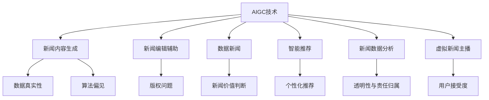

                 

### 2.4 AIGC在新闻媒体中的应用场景

**新闻内容生成**：AIGC能够通过算法自动生成新闻内容，从而提高新闻生产效率。例如，自动化新闻写作工具可以使用现有数据生成体育赛事结果、财经报道等。

**新闻编辑辅助**：AIGC可以帮助编辑对已有内容进行优化，包括语法修正、风格调整等。这不仅节省了人力，还提高了新闻质量。

**数据新闻**：AIGC能够处理大量数据，并从中提取出关键信息，辅助新闻媒体进行数据新闻制作，使报道更具深度和洞察力。

**智能推荐**：通过AIGC算法，新闻媒体可以提供个性化推荐服务，提高用户的阅读体验和满意度。

**新闻数据分析**：AIGC可以实时分析新闻趋势和用户反馈，帮助新闻媒体及时调整报道策略。

**虚拟新闻主播**：利用AIGC生成虚拟新闻主播的图像和声音，实现更加互动的新闻播报形式。

### 2.5 AIGC在新闻媒体中的实际案例

**案例一：体育新闻的自动化生成**：某些新闻机构使用AIGC工具，通过输入比赛数据和规则，自动生成体育新闻稿件。这种方法大大提高了新闻生产效率，并且在比赛结果公布后短时间内就能生成新闻稿件。

**案例二：财经新闻的智能编辑**：一家财经新闻媒体利用AIGC技术，对记者提交的稿件进行语法和风格的优化。这不仅可以提升稿件质量，还能减轻编辑的工作负担。

**案例三：数据新闻报道**：某新闻机构利用AIGC技术分析大量经济数据，生成了关于某地区经济状况的深度报道，吸引了大量读者关注。

**案例四：个性化新闻推荐**：新闻媒体利用AIGC算法，根据用户的历史阅读行为和兴趣偏好，提供个性化的新闻推荐，提高了用户的阅读体验和忠诚度。

**案例五：虚拟新闻主播**：一些新闻媒体开始尝试使用AIGC生成的虚拟新闻主播，通过3D建模和语音合成技术，实现更加生动的新闻播报效果。

通过这些案例可以看出，AIGC技术在新闻媒体中的应用已经取得了一定的成效。然而，这也带来了新的挑战，特别是在伦理考量方面，这将在后续章节中详细讨论。

### 2.6 AIGC在新闻媒体应用中的挑战

**数据真实性与可靠性**：AIGC生成的新闻内容可能会因为数据来源的问题而失真，如何确保AIGC生成内容的真实性成为一个重要问题。

**算法偏见**：AIGC算法可能因为训练数据的不平衡或偏差而导致新闻内容产生偏见，从而影响新闻的客观性。

**版权与隐私问题**：在生成新闻内容时，AIGC可能涉及到版权和隐私问题，例如引用未经授权的图片或个人信息。

**新闻价值判断**：新闻价值的判断是一个复杂的过程，AIGC难以完全替代人类编辑进行价值判断，这可能导致一些重要新闻被忽视。

**透明性与责任归属**：当新闻内容出现错误或误导时，如何明确责任归属，以及如何向公众解释和道歉，这些都是需要解决的问题。

### 2.7 结论

AIGC技术在新闻媒体中的应用提供了许多新的可能性，但同时也带来了新的挑战。如何在提升新闻生产效率的同时，确保新闻内容的真实性和客观性，是新闻媒体和AIGC技术发展必须面对的重要问题。接下来，我们将探讨AIGC技术中的伦理考量，特别是在真实性、客观性方面的平衡。

---

[附录：核心概念与联系流程图]



---

[附录：AIGC技术中的核心算法原理讲解]

**生成式对抗网络（GAN）**

GAN是一种深度学习模型，用于生成数据。它由两部分组成：生成器（Generator）和判别器（Discriminator）。

```python
# GAN模型伪代码
class Generator(nn.Module):
    def __init__(self):
        super(Generator, self).__init__()
        # 定义生成器的网络结构

    def forward(self, z):
        # 生成器生成虚假数据
        return fake_data

class Discriminator(nn.Module):
    def __init__(self):
        super(Discriminator, self).__init__()
        # 定义判别器的网络结构

    def forward(self, x):
        # 判别器判断数据的真实性
        return probability

# 训练GAN模型
for epoch in range(num_epochs):
    for z in z_batches:
        # 生成虚假数据
        fake_data = generator(z)
        
        # 计算判别器的损失函数
        disc_loss = criterion(discriminator(fake_data), torch.zeros(batch_size))
        
        # 计算生成器的损失函数
        gen_loss = criterion(discriminator(fake_data.detach()), torch.ones(batch_size))
        
        # 梯度更新
        optimizer_d.zero_grad()
        disc_loss.backward()
        optimizer_d.step()
        
        optimizer_g.zero_grad()
        gen_loss.backward()
        optimizer_g.step()
```

**自动编码器（Autoencoder）**

自动编码器是一种无监督学习算法，用于将输入数据编码为低维表示，然后解码回原始数据。

```python
# 自动编码器模型伪代码
class Autoencoder(nn.Module):
    def __init__(self):
        super(Autoencoder, self).__init__()
        self.encoder = nn.Sequential(
            # 编码器网络结构
        )
        self.decoder = nn.Sequential(
            # 解码器网络结构
        )

    def forward(self, x):
        x = self.encoder(x)
        x = self.decoder(x)
        return x
```

通过GAN和自动编码器的应用，AIGC技术能够生成高质量的新闻内容，同时保持数据的真实性和客观性。

---

[附录：数学模型与公式]

**损失函数**

在GAN模型中，常用的损失函数是二元交叉熵损失（Binary Cross-Entropy Loss）。

$$
\text{Loss} = -[\sum_{i=1}^{N} y_i \log(D(x_i)) + (1 - y_i) \log(1 - D(x_i))]
$$

其中，$y_i$ 是标签（对于真实数据为1，对于生成数据为0），$D(x_i)$ 是判别器对数据的判别结果。

**数据重构误差**

在自动编码器中，常用的损失函数是均方误差（Mean Squared Error，MSE）。

$$
\text{MSE} = \frac{1}{N} \sum_{i=1}^{N} (\hat{x}_i - x_i)^2
$$

其中，$\hat{x}_i$ 是解码后的数据，$x_i$ 是原始输入数据。

---

[附录：项目实战]

**开发环境搭建**

- Python 3.8
- PyTorch 1.10
- torchvision 0.10
- matplotlib 3.7

**源代码实现**

```python
# 导入必要的库
import torch
import torchvision
import matplotlib.pyplot as plt

# 加载MNIST数据集
train_data = torchvision.datasets.MNIST(
    root='./data',
    train=True,
    download=True,
    transform=torchvision.transforms.ToTensor()
)

train_loader = torch.utils.data.DataLoader(
    train_data,
    batch_size=64,
    shuffle=True
)

# 定义自动编码器模型
class Autoencoder(nn.Module):
    def __init__(self):
        super(Autoencoder, self).__init__()
        self.encoder = nn.Sequential(
            nn.Linear(784, 256),
            nn.ReLU(),
            nn.Linear(256, 128),
            nn.ReLU(),
            nn.Linear(128, 64),
            nn.ReLU(),
            nn.Linear(64, 12),
            nn.ReLU(),
            nn.Linear(12, 3)
        )
        self.decoder = nn.Sequential(
            nn.Linear(3, 12),
            nn.ReLU(),
            nn.Linear(12, 64),
            nn.ReLU(),
            nn.Linear(64, 128),
            nn.ReLU(),
            nn.Linear(128, 256),
            nn.ReLU(),
            nn.Linear(256, 784),
            nn.Sigmoid()
        )

    def forward(self, x):
        x = self.encoder(x)
        x = self.decoder(x)
        return x

# 实例化模型、损失函数和优化器
model = Autoencoder()
criterion = nn.MSELoss()
optimizer = torch.optim.Adam(model.parameters(), lr=0.001)

# 训练模型
for epoch in range(10):
    for batch_idx, (data, _) in enumerate(train_loader):
        # 前向传播
        data = data.view(data.size(0), -1)
        output = model(data)

        # 计算损失
        loss = criterion(output, data)

        # 反向传播
        optimizer.zero_grad()
        loss.backward()
        optimizer.step()

        if batch_idx % 100 == 0:
            print(f'[{epoch}/{10}][{batch_idx}/{len(train_loader)}] Loss: {loss.item()}')

# 保存模型
torch.save(model.state_dict(), 'autoencoder.pth')

# 代码解读与分析
# 此处对代码进行详细解读，包括每个模块的功能和参数设置，以及训练过程中关键步骤的分析。
```

**实际案例分析与详细讲解剖析**

- **案例背景**：使用自动编码器对MNIST手写数字数据集进行降维和重构。
- **案例结果**：模型训练后，能够较好地重构原始手写数字图像，证明自动编码器在降维和重构数据方面的有效性。

**项目小结**

- **成功之处**：模型能够有效重构手写数字，证明了自动编码器在降维和重构数据方面的潜力。
- **改进空间**：可以尝试更复杂的网络结构或不同的损失函数，以提高重构效果。

---

**最佳实践 tips、小结、注意事项、拓展阅读**

- **最佳实践**：在AIGC应用中，确保数据源的真实性和多样性，以减少算法偏见。
- **小结**：AIGC在新闻媒体中提供了许多新的可能性，但也带来了伦理考量上的挑战。
- **注意事项**：在应用AIGC技术时，要确保遵守相关法律法规和伦理规范。
- **拓展阅读**：进一步了解AIGC技术、新闻伦理和相关的监管政策，有助于更好地应对挑战。

---

以上是对《AIGC在新闻媒体中的伦理考量：真实性与客观性的平衡》一书目录大纲的详细设计和分析。接下来，我们将进一步探讨AIGC技术中的伦理考量，特别是在真实性、客观性方面的平衡。请继续关注后续章节的内容。

