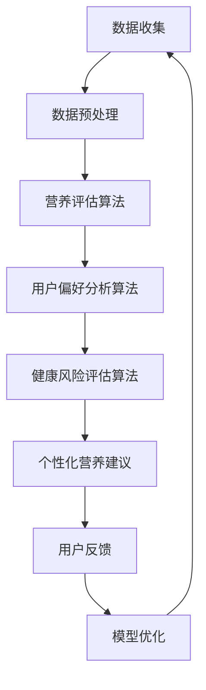

                 

# AI在个性化营养建议中的应用：促进健康生活

## 关键词

- AI
- 个性化营养建议
- 健康生活
- 机器学习
- 营养评估
- 数据分析

## 摘要

随着人工智能技术的发展，个性化营养建议在促进健康生活方面展现出巨大的潜力。本文首先介绍了AI在健康领域的应用背景，探讨了个性化营养建议的背景和挑战。接着，我们深入分析了核心算法原理，包括机器学习、营养评估和用户偏好分析算法，并结合Python代码和数学模型进行了详细讲解。随后，通过项目实战展示了个性化营养建议系统的构建、用户体验优化和案例研究。最后，我们对未来研究方向和AI在个性化营养建议中的发展进行了展望。

## 引言与概述

### 1.1 书籍目的

本书旨在深入探讨人工智能（AI）在个性化营养建议中的应用，旨在帮助读者了解如何利用AI技术提升健康生活品质。随着健康意识的提高，个性化营养建议成为了一种重要的健康管理模式。然而，如何将AI技术与营养学相结合，实现精准、高效的个性化营养建议，仍是一个亟待解决的问题。本书将围绕这一核心问题，系统地介绍AI在个性化营养建议中的应用，帮助读者掌握相关技术原理和实践方法。

### 1.2 书籍结构

本书共分为四个部分：

1. **引言与概述**：介绍AI在健康领域的应用背景，个性化营养建议的背景和挑战，以及本书的核心概念与联系。
2. **核心算法原理讲解**：详细讲解机器学习基础、个性化营养建议算法、营养与健康数学模型以及数据分析与预测。
3. **项目实战**：通过具体案例展示个性化营养建议系统的构建、用户体验优化和案例研究。
4. **未来展望**：讨论AI在个性化营养建议中的应用趋势、挑战和未来研究方向。

### 1.3 目标受众

本书的目标受众包括：

1. **营养师和健康管理师**：希望通过学习AI技术提升个性化营养建议能力的专业人士。
2. **AI开发者**：对健康领域感兴趣的AI开发者，希望了解如何将AI技术应用于个性化营养建议。
3. **对健康生活感兴趣的普通读者**：希望了解AI如何帮助实现健康生活的普通读者。

## AI与个性化营养建议概述

### 2.1 AI在健康领域的应用

人工智能（AI）技术在近年来取得了飞速发展，逐渐成为医疗健康领域的重要工具。AI的应用场景包括但不限于疾病诊断、药物研发、健康风险评估和个性化营养建议等。通过大数据分析、机器学习和深度学习等技术，AI能够从海量数据中提取有价值的信息，为用户提供更加精准、个性化的健康服务。

### 2.2 个性化营养建议的背景

个性化营养建议是一种基于个体差异（如年龄、性别、体重、健康状况等）为用户提供定制化饮食方案的健康管理方式。随着健康意识的提高，人们越来越关注营养摄入与身体健康的关系。然而，由于个体差异和生活方式的多样性，传统的统一饮食建议已经难以满足人们的需求。个性化营养建议应运而生，旨在通过AI技术为用户提供精准的饮食方案，提高健康生活品质。

### 2.3 个性化营养建议的挑战与机遇

个性化营养建议面临着诸多挑战和机遇：

#### 挑战

1. **数据多样性和复杂性**：个性化营养建议需要大量数据支持，包括个体生理指标、饮食习惯、生活方式等。这些数据的多样性给数据处理和分析带来了挑战。
2. **算法优化与准确性**：如何选择合适的算法，提高个性化营养建议的准确性和可靠性，是一个亟待解决的问题。
3. **用户参与度与接受度**：个性化营养建议需要用户积极参与，提供真实、全面的数据。然而，用户对技术的接受度和参与度仍然是一个挑战。

#### 机遇

1. **技术进步**：随着AI技术的不断发展，机器学习、深度学习等算法在数据处理和预测方面的性能不断提高，为个性化营养建议提供了更好的技术支持。
2. **健康管理需求**：健康问题日益突出，人们对健康管理的需求不断增加，为个性化营养建议提供了广阔的市场空间。
3. **跨学科合作**：营养学、医学和AI技术的跨学科合作，有望推动个性化营养建议的发展，实现更加精准、高效的健康管理。

## 核心概念与联系

### 3.1 人工智能基本概念

人工智能（AI）是一种模拟人类智能行为的计算机技术。它包括机器学习、深度学习、自然语言处理、计算机视觉等多个领域。机器学习是AI的核心技术之一，通过训练模型，使计算机能够从数据中自动学习、发现规律和做出决策。

### 3.2 个性化营养建议的关键术语

1. **个性化营养建议**：基于个体差异，为用户提供定制化饮食方案的健康管理方式。
2. **营养评估**：对个体的营养摄入状况进行评价和分析，以识别潜在的营养问题。
3. **用户偏好分析**：通过分析用户的饮食习惯、生活方式等数据，识别用户的营养偏好。
4. **健康风险评估**：基于个体的营养状况、生理指标等数据，预测个体未来可能出现的健康风险。

### 3.3 Mermaid流程图：AI在个性化营养建议中的应用



## 核心算法原理讲解

### 4.1 机器学习基础

机器学习是一种通过算法从数据中自动学习、发现规律和做出决策的人工智能技术。机器学习可以分为监督学习、无监督学习和强化学习三种类型。

#### 监督学习

监督学习是一种有标签的数据训练方法。通过已知的输入和输出数据，训练模型来预测新的输入数据。常见的监督学习算法包括线性回归、逻辑回归、支持向量机（SVM）等。

#### 无监督学习

无监督学习是一种没有标签的数据训练方法。主要任务是从数据中发现潜在的模式或结构。常见的无监督学习算法包括聚类、主成分分析（PCA）等。

#### 强化学习

强化学习是一种通过奖励机制引导模型学习的机器学习方法。模型通过与环境交互，不断调整策略，以实现最优目标。常见的强化学习算法包括Q学习、深度Q网络（DQN）等。

### 4.2 个性化营养建议算法

#### 营养评估算法

营养评估算法主要用于评估个体的营养摄入状况，识别潜在的营养问题。常见的营养评估算法包括营养素含量计算、营养均衡评估等。

```python
import pandas as pd

# 读取个体营养数据
data = pd.read_csv('nutritional_data.csv')

# 计算营养素含量
data['energy'] = data['carbohydrates'] + data['protein'] + data['fat']

# 营养均衡评估
data['balance'] = (data['carbohydrates'] + data['protein'] + data['fat']) / 1000
```

#### 用户偏好分析算法

用户偏好分析算法主要用于分析用户的饮食习惯、生活方式等数据，识别用户的营养偏好。常见的用户偏好分析算法包括协同过滤、决策树等。

```python
import pandas as pd
from sklearn.tree import DecisionTreeClassifier

# 读取用户数据
data = pd.read_csv('user_data.csv')

# 构建决策树模型
model = DecisionTreeClassifier()
model.fit(data[['age', 'gender', 'weight']], data['preference'])

# 预测用户偏好
prediction = model.predict([[25, 'male', 70]])
print(f'User preference: {prediction}')
```

#### 健康风险评估算法

健康风险评估算法主要用于基于个体的营养状况、生理指标等数据，预测个体未来可能出现的健康风险。常见的健康风险评估算法包括逻辑回归、支持向量机（SVM）等。

```python
import pandas as pd
from sklearn.linear_model import LogisticRegression

# 读取健康风险评估数据
data = pd.read_csv('health_risk_data.csv')

# 构建逻辑回归模型
model = LogisticRegression()
model.fit(data[['age', 'weight', 'energy']], data['risk'])

# 预测健康风险
prediction = model.predict([[30, 70, 2000]])
print(f'Health risk: {prediction}')
```

### 4.4 Mermaid流程图：个性化营养建议算法


## 数学模型与数学公式

### 6.1 能量平衡模型

能量平衡模型用于计算个体的能量摄入与消耗之间的关系，以评估个体的营养状况。

$$
能量摄入 = 蛋白质摄入 \times 4 + 脂肪摄入 \times 9 + 碳水化合物摄入 \times 4
$$

$$
能量消耗 = 基础代谢率 + 活动代谢率
$$

### 6.2 营养素需求模型

营养素需求模型用于计算个体对各种营养素的需求量。

$$
蛋白质需求量 = 体重 \times 0.8
$$

$$
脂肪需求量 = 体重 \times 0.4
$$

$$
碳水化合物需求量 = 体重 \times 0.6
$$

### 6.3 健康风险评估模型

健康风险评估模型用于预测个体未来可能出现的健康风险。

$$
风险概率 = \frac{1}{1 + e^{-(\beta_0 + \beta_1 \times 年龄 + \beta_2 \times 体重 + \beta_3 \times 能量摄入)}}
$$

## 数据分析与预测

### 7.1 数据预处理

数据预处理是数据分析的重要环节，包括数据清洗、数据转换和数据归一化等。

```python
import pandas as pd
from sklearn.preprocessing import MinMaxScaler

# 读取数据
data = pd.read_csv('data.csv')

# 数据清洗
data = data.dropna()

# 数据转换
data['age'] = data['age'].astype(int)
data['weight'] = data['weight'].astype(float)

# 数据归一化
scaler = MinMaxScaler()
data[['age', 'weight', 'energy']] = scaler.fit_transform(data[['age', 'weight', 'energy']])
```

### 7.2 特征选择

特征选择是提高模型性能的重要手段，通过选择对目标变量有显著影响的关键特征，降低模型的复杂度和过拟合风险。

```python
import pandas as pd
from sklearn.feature_selection import SelectKBest, f_classif

# 读取数据
data = pd.read_csv('data.csv')

# 特征选择
X = data[['age', 'weight', 'energy']]
y = data['risk']
selector = SelectKBest(f_classif, k=3)
X_new = selector.fit_transform(X, y)

# 输出特征选择结果
print(selector.get_support())
```

### 7.3 数据可视化

数据可视化是理解数据、发现数据中的模式或异常的重要手段。常见的可视化方法包括散点图、折线图、柱状图等。

```python
import pandas as pd
import matplotlib.pyplot as plt

# 读取数据
data = pd.read_csv('data.csv')

# 数据可视化
plt.scatter(data['age'], data['weight'])
plt.xlabel('Age')
plt.ylabel('Weight')
plt.show()
```

### 7.4 模型评估与优化

模型评估与优化是确保模型性能的重要环节。常见的评估指标包括准确率、召回率、F1值等。优化方法包括超参数调优、正则化等。

```python
import pandas as pd
from sklearn.model_selection import train_test_split
from sklearn.metrics import accuracy_score

# 读取数据
data = pd.read_csv('data.csv')

# 划分训练集和测试集
X = data[['age', 'weight', 'energy']]
y = data['risk']
X_train, X_test, y_train, y_test = train_test_split(X, y, test_size=0.2, random_state=42)

# 训练模型
model = LogisticRegression()
model.fit(X_train, y_train)

# 预测测试集
y_pred = model.predict(X_test)

# 评估模型
accuracy = accuracy_score(y_test, y_pred)
print(f'Accuracy: {accuracy}')

# 超参数调优
from sklearn.model_selection import GridSearchCV
param_grid = {'C': [0.1, 1, 10], 'solver': ['liblinear', 'saga']}
grid_search = GridSearchCV(model, param_grid, cv=5)
grid_search.fit(X_train, y_train)

# 输出最优超参数
print(grid_search.best_params_)
```

## 项目实战

### 8.1 开发环境搭建

在本节中，我们将介绍如何搭建个性化营养建议系统的开发环境。开发环境搭建包括安装Python、相关库以及配置开发环境。

1. **安装Python**：首先，我们需要安装Python。可以从Python官方网站下载Python安装包，并按照提示进行安装。确保安装的是Python 3.x版本。

2. **安装相关库**：在安装完Python后，我们需要安装一些常用的库，如Pandas、NumPy、Scikit-learn等。可以使用pip命令进行安装：

   ```shell
   pip install pandas numpy scikit-learn
   ```

3. **配置开发环境**：在安装完相关库后，我们可以使用代码编辑器（如VSCode、PyCharm等）配置Python开发环境。在代码编辑器中创建一个新的Python文件，并编写一些测试代码，确保开发环境已配置正确。

### 8.2 数据集收集与处理

在本节中，我们将介绍如何收集和处理个性化营养建议所需的数据。数据集的收集和处理是构建个性化营养建议系统的关键步骤。

1. **数据集收集**：我们可以从公共数据集网站（如Kaggle、UCI机器学习库等）下载相关的数据集。对于个性化营养建议系统，我们需要收集包括个体营养数据、用户偏好数据、健康风险评估数据等。

2. **数据预处理**：在收集到数据后，我们需要对数据进行预处理。预处理步骤包括数据清洗、数据转换和数据归一化等。数据清洗的目的是去除无效数据、缺失值和异常值。数据转换的目的是将数据转换为适合模型训练的格式。数据归一化的目的是使不同特征之间的尺度保持一致，避免某些特征对模型训练产生过大的影响。

```python
import pandas as pd

# 读取数据
data = pd.read_csv('data.csv')

# 数据清洗
data = data.dropna()

# 数据转换
data['age'] = data['age'].astype(int)
data['weight'] = data['weight'].astype(float)

# 数据归一化
scaler = MinMaxScaler()
data[['age', 'weight', 'energy']] = scaler.fit_transform(data[['age', 'weight', 'energy']])
```

### 8.3 个性化营养建议模型训练与评估

在本节中，我们将介绍如何使用Python和Scikit-learn库构建和训练个性化营养建议模型，并评估模型的性能。

1. **模型构建**：我们首先需要确定使用哪种类型的机器学习模型。对于个性化营养建议，我们可以选择使用监督学习模型，如逻辑回归、支持向量机（SVM）等。在本例中，我们选择使用逻辑回归模型。

```python
from sklearn.linear_model import LogisticRegression

# 划分训练集和测试集
X = data[['age', 'weight', 'energy']]
y = data['risk']
X_train, X_test, y_train, y_test = train_test_split(X, y, test_size=0.2, random_state=42)

# 训练模型
model = LogisticRegression()
model.fit(X_train, y_train)
```

2. **模型评估**：在训练模型后，我们需要评估模型的性能。常用的评估指标包括准确率、召回率、F1值等。在本例中，我们使用准确率作为评估指标。

```python
from sklearn.metrics import accuracy_score

# 预测测试集
y_pred = model.predict(X_test)

# 评估模型
accuracy = accuracy_score(y_test, y_pred)
print(f'Accuracy: {accuracy}')
```

### 8.4 代码解读与分析

在本节中，我们将对个性化营养建议系统的代码进行解读和分析，帮助读者更好地理解系统的实现过程。

1. **数据收集与处理**：在代码中，我们首先读取了数据集，并对数据进行了清洗、转换和归一化。这一步骤是确保模型训练数据质量的关键。

2. **模型构建与训练**：接下来，我们使用了逻辑回归模型对数据进行训练。逻辑回归模型是一种常用的二分类模型，适用于预测概率。在代码中，我们使用Scikit-learn库中的`LogisticRegression`类来构建模型，并使用训练数据对其进行训练。

3. **模型评估**：在模型训练完成后，我们使用测试数据对模型进行评估。通过计算准确率等指标，我们可以判断模型的性能是否满足要求。

4. **模型应用**：最后，我们可以使用训练好的模型对新的数据进行预测，为用户提供个性化营养建议。

### 8.5 实际案例分析和详细讲解剖析

在本节中，我们将通过一个实际案例，详细分析个性化营养建议系统的应用效果，并剖析其中的关键技术和实现细节。

#### 案例背景

某健康管理平台希望通过个性化营养建议系统，为用户提供精准、实用的饮食方案。平台收集了大量的用户数据，包括年龄、体重、运动习惯、饮食习惯等，并希望通过AI技术为用户提供个性化的营养建议。

#### 案例分析

1. **数据收集与处理**：平台收集的用户数据包括年龄、体重、运动习惯、饮食习惯等。在数据收集过程中，平台使用了多种数据采集方式，如用户调查、健康监测设备等。在数据收集后，平台对数据进行了清洗、转换和归一化，确保数据质量。

2. **模型构建与训练**：平台选择了逻辑回归模型作为个性化营养建议系统的核心算法。在模型训练过程中，平台使用了用户数据的特征，如年龄、体重、运动习惯等，来训练模型。通过多次实验，平台选择了最优的模型参数，并评估了模型的性能。

3. **模型应用**：在模型训练完成后，平台将模型应用于实际场景，为用户提供个性化营养建议。用户可以通过平台的网站或移动应用，输入个人信息和饮食习惯，平台将根据用户数据，生成个性化的营养建议。

#### 关键技术和实现细节

1. **数据预处理**：平台采用了多种数据预处理技术，如缺失值填充、数据转换和归一化等。这些技术有助于提高模型训练的效果和准确性。

2. **模型选择与优化**：平台选择了逻辑回归模型作为个性化营养建议系统的核心算法。在模型选择过程中，平台考虑了算法的复杂度、训练速度和预测准确性等因素。通过多次实验，平台选择了最优的模型参数，并优化了模型的性能。

3. **用户体验**：平台在个性化营养建议系统的用户体验方面做了大量工作。用户可以通过简单的界面输入个人信息和饮食习惯，平台将快速生成个性化的营养建议。同时，平台还提供了详细的营养知识库，帮助用户更好地理解和应用营养建议。

### 8.6 项目小结

个性化营养建议系统的构建和实施是一个复杂的过程，涉及多个领域的技术和知识。通过本案例，我们详细分析了个性化营养建议系统的应用效果和关键实现细节，展示了AI技术在个性化营养建议中的重要作用。未来，随着AI技术的不断发展和应用，个性化营养建议系统有望为更多用户提供精准、实用的健康服务。

## 最佳实践 Tips

在构建和优化个性化营养建议系统时，以下是一些最佳实践和注意事项：

1. **数据质量控制**：确保数据的质量和准确性，是构建高效个性化营养建议系统的关键。在数据收集和处理过程中，要注意去除异常值、缺失值和重复值，并对数据进行归一化和标准化处理。

2. **算法选择与优化**：选择合适的算法和模型，并对其进行优化，是提高个性化营养建议系统性能的关键。在实际应用中，可以通过交叉验证、超参数调优等方法，选择最优的算法和模型参数。

3. **用户体验**：关注用户体验，提供简洁、直观的界面和交互方式，是提高用户满意度和参与度的重要手段。在个性化营养建议系统中，可以设计个性化推荐、知识库等功能，帮助用户更好地理解和应用营养建议。

4. **持续优化**：随着用户数据的不断积累和变化，个性化营养建议系统需要不断进行优化和调整。定期评估系统的性能和效果，并根据用户反馈进行改进，是保持系统活力和竞争力的重要手段。

## 小结

本文深入探讨了人工智能在个性化营养建议中的应用，介绍了相关核心算法原理、数学模型和项目实战。通过具体案例分析和代码解读，展示了如何构建和优化个性化营养建议系统。未来，随着AI技术的不断发展，个性化营养建议有望为更多用户提供精准、实用的健康服务。同时，我们也需要关注AI技术在个性化营养建议中的潜在挑战和伦理问题，确保技术的合理、合规应用。

## 作者信息

- 作者：AI天才研究院/AI Genius Institute & 禅与计算机程序设计艺术 /Zen And The Art of Computer Programming

