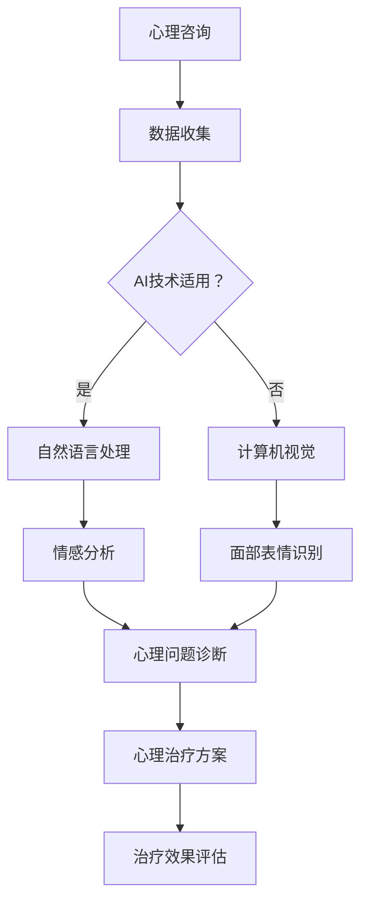

                 

# AI在心理咨询中的应用：辅助人类治疗师的新工具

## 关键词
- 人工智能
- 心理咨询
- 心理治疗
- 机器学习
- 自然语言处理
- 心理健康监测
- 数据隐私
- 伦理问题

## 摘要
本文旨在探讨人工智能（AI）在心理咨询中的应用，如何成为辅助人类治疗师的新工具。通过介绍心理咨询的基本原理和过程，以及AI的核心技术，本文分析了AI在心理咨询中的各种应用场景，包括初步评估与诊断、心理治疗干预、在线咨询服务和心理健康监测与预防。同时，本文探讨了AI在心理咨询中的应用原理、实际案例以及面临的挑战和伦理问题。最后，本文对未来AI在心理咨询领域的发展趋势进行了展望，并提出了相关的最佳实践和建议。

### 第1章 引言

#### 1.1 AI在心理咨询领域的重要性

人工智能（AI）作为21世纪最具颠覆性的技术之一，已经在各个领域取得了显著的进展。在心理健康领域，AI的应用同样具有重要的意义。随着心理健康问题的日益普遍和严重，传统的心理咨询方法已经难以满足日益增长的需求。AI的引入，为心理咨询提供了新的工具和方法，有助于提高心理咨询的效率和质量。

首先，AI可以通过自动化和智能化的方式，进行初步的评估和诊断。传统的心理咨询需要大量的时间和人力，而AI系统可以通过分析患者的言语和行为，快速准确地识别出潜在的心理问题。这不仅提高了诊断的效率，也有助于及早发现和干预，从而改善患者的心理状态。

其次，AI可以辅助人类治疗师进行心理治疗干预。通过自然语言处理和计算机视觉等技术，AI可以理解和模拟人类的治疗方法，为患者提供个性化的治疗方案。此外，AI还可以实时监测患者的治疗进展，为治疗师提供反馈和建议，从而提高治疗效果。

最后，AI在心理咨询中的应用不仅限于治疗师和患者之间。通过在线咨询服务和心理健康监测，AI可以为更广泛的人群提供便捷的心理健康支持。这种服务方式不仅能够打破地域和时间的限制，还能够降低心理咨询的成本，让更多人享受到专业心理服务的便利。

#### 1.2 书籍的目的和结构

本书的目的是深入探讨AI在心理咨询中的应用，帮助读者全面了解这一领域的最新进展和未来发展趋势。为了达到这一目的，本书分为八个章节，结构如下：

- 第1章：引言，介绍AI在心理咨询领域的重要性。
- 第2章：心理咨询与AI概述，介绍心理咨询的基本原理和过程，以及AI的核心技术。
- 第3章：AI在心理咨询中的应用场景，探讨AI在心理咨询中的各种应用场景。
- 第4章：AI核心技术介绍，详细介绍机器学习、自然语言处理、计算机视觉和深度学习等AI核心技术。
- 第5章：AI在心理咨询中的应用原理，分析AI在心理咨询中的各种应用原理。
- 第6章：实际案例研究，通过实际案例展示AI在心理咨询中的应用效果。
- 第7章：AI在心理咨询中的挑战与伦理问题，探讨AI在心理咨询中面临的挑战和伦理问题。
- 第8章：未来展望，对AI在心理咨询领域的发展趋势进行展望。

通过这样的结构设计，本书旨在帮助读者系统地学习AI在心理咨询中的应用，为未来的研究和实践提供指导。

#### 1.3 读者对象

本书适合对心理咨询和人工智能感兴趣的读者，包括心理咨询师、心理治疗师、人工智能研究人员、软件开发工程师、医学研究人员以及广大对心理健康有需求的普通人。无论你是心理咨询领域的专业人士，还是对AI技术充满好奇的技术爱好者，本书都能为你提供丰富的知识和实用的指导。

### 第2章 心理咨询与AI概述

#### 2.1 心理咨询的原理与过程

心理咨询是一种专业服务，旨在帮助个体解决心理问题、改善心理状态和提高生活质量。心理咨询的原理基于心理学的理论和方法，包括心理动力学、认知行为疗法、人本主义心理学等。这些理论和方法为心理咨询提供了不同的视角和工具，以帮助治疗师理解个体的心理问题，并制定有效的治疗方案。

心理咨询的过程通常包括以下几个阶段：

1. **建立关系**：治疗师与患者建立信任和合作关系，创造一个安全、开放和接纳的治疗环境。
2. **评估**：通过访谈、问卷、观察等方式，评估患者的心理状态、心理健康问题及其严重程度。
3. **诊断**：根据评估结果，确定患者的心理健康问题，如抑郁症、焦虑症、人格障碍等。
4. **制定治疗计划**：根据诊断结果，制定个性化的治疗计划，包括治疗方法、治疗目标和治疗时间表。
5. **实施治疗**：按照治疗计划，实施各种心理治疗方法和技巧，帮助患者解决心理问题，提高心理健康水平。
6. **评估与反馈**：在整个治疗过程中，定期评估患者的进展，并根据评估结果调整治疗计划。
7. **结束治疗**：当患者达到治疗目标，心理状态得到显著改善时，治疗师会与患者商讨结束治疗的时间和方式。

#### 2.2 AI的定义与核心技术

人工智能（AI）是指计算机系统模拟人类智能的行为和过程，包括感知、理解、学习、推理、决策和行动等。AI的核心技术包括机器学习、自然语言处理、计算机视觉、深度学习等。

1. **机器学习**：机器学习是一种通过数据驱动的方式，使计算机系统能够从经验中学习并做出决策的技术。它包括监督学习、无监督学习和强化学习等方法。在心理咨询中，机器学习可以用于数据分析和模式识别，帮助诊断和预测患者的心理健康问题。

2. **自然语言处理（NLP）**：自然语言处理是一种使计算机能够理解和处理自然语言的技术。它包括语言模型、文本分类、情感分析、实体识别等任务。在心理咨询中，NLP可以用于分析患者的言语和行为，提取关键信息，帮助治疗师理解患者的心理状态。

3. **计算机视觉**：计算机视觉是一种使计算机能够理解和处理视觉信息的技术。它包括图像识别、目标检测、人脸识别等任务。在心理咨询中，计算机视觉可以用于实时监测患者的面部表情和身体语言，帮助治疗师了解患者的情绪和行为变化。

4. **深度学习**：深度学习是一种基于人工神经网络的机器学习技术，通过多层神经网络结构，实现更复杂的特征提取和模式识别。在心理咨询中，深度学习可以用于构建复杂的心理模型，提高诊断和预测的准确性。

#### 2.3 AI与心理咨询结合的潜在优势

AI与心理咨询的结合具有以下潜在优势：

1. **提高诊断和治疗的准确性**：AI可以通过大数据分析和机器学习技术，提高对心理健康问题的诊断准确性。此外，AI可以实时监测患者的心理状态，为治疗师提供及时的反馈和建议，提高治疗效果。

2. **提高工作效率**：AI可以自动化和智能化地完成一些繁琐的任务，如数据录入、统计分析等，减轻治疗师的工作负担，使其有更多的时间和精力专注于患者治疗。

3. **降低心理咨询成本**：AI可以降低心理咨询的成本，通过在线咨询服务和心理健康监测，让更多人享受到专业心理服务的便利。

4. **个性化治疗方案**：AI可以根据患者的具体情况进行个性化治疗，提高治疗的有效性。

5. **拓宽心理咨询的渠道**：AI可以打破地域和时间的限制，提供远程心理咨询和在线咨询服务，让更多人能够享受到专业的心理健康支持。

### 2.4 AI在心理咨询中的应用场景

AI在心理咨询中的应用场景主要包括以下四个方面：

1. **初步评估与诊断**：AI可以通过自然语言处理和计算机视觉等技术，分析患者的言语和行为，快速准确地识别出潜在的心理健康问题。

2. **心理治疗干预**：AI可以辅助人类治疗师进行心理治疗干预，通过自然语言处理和深度学习等技术，为患者提供个性化的治疗方案。

3. **在线咨询服务**：AI可以通过在线平台，为患者提供便捷的心理健康支持，打破地域和时间的限制。

4. **心理健康监测与预防**：AI可以实时监测患者的心理状态，预防心理健康问题的发生，提高心理健康水平。

### 2.5 心理咨询与AI的关系架构 Mermaid 流程图



### 第3章 AI在心理咨询中的应用场景

#### 3.1 基于AI的初步评估与诊断

AI在心理咨询中的第一个应用场景是初步评估与诊断。这一步骤对于确定患者的心理健康问题和制定后续的治疗计划至关重要。基于AI的初步评估与诊断主要依赖于自然语言处理（NLP）和机器学习技术。

**技术原理**：
- **自然语言处理（NLP）**：NLP技术能够解析和理解人类语言。在心理咨询中，NLP可以用于分析患者提供的文本信息，如自我报告、聊天记录、邮件等。通过情感分析和主题建模，NLP可以帮助识别患者情绪状态的改变和心理健康问题的征兆。

- **机器学习**：机器学习算法可以从大量带有标注的心理健康数据中学习，从而提高诊断的准确性。常见的机器学习算法包括支持向量机（SVM）、随机森林（RF）和神经网络（NN）等。这些算法可以用于构建分类模型，根据患者的症状和行为特征，预测其心理健康问题的类型和严重程度。

**应用实例**：
- **抑郁症初步评估**：一个实际应用案例是使用NLP分析患者的社交媒体帖子或日记，以识别抑郁症的早期症状。研究人员收集了数千篇带有标注的社交媒体帖子，使用NLP技术提取情绪信息和行为模式。通过训练分类模型，系统能够预测用户是否有可能患有抑郁症。

- **焦虑症诊断**：另一种应用是使用机器学习算法分析患者的行为数据，如在线咨询过程中的回答、互动时间、情绪表达等。这些数据可以揭示焦虑症的潜在特征，帮助治疗师进行初步诊断。

**代码示例**：
```python
import pandas as pd
from sklearn.feature_extraction.text import TfidfVectorizer
from sklearn.model_selection import train_test_split
from sklearn.svm import LinearSVC

# 加载数据
data = pd.read_csv('health_data.csv')
X = data['text']
y = data['depression']

# 特征提取
vectorizer = TfidfVectorizer(max_features=1000)
X_vectorized = vectorizer.fit_transform(X)

# 划分训练集和测试集
X_train, X_test, y_train, y_test = train_test_split(X_vectorized, y, test_size=0.2, random_state=42)

# 训练分类模型
model = LinearSVC()
model.fit(X_train, y_train)

# 预测
predictions = model.predict(X_test)

# 评估模型性能
from sklearn.metrics import accuracy_score
accuracy = accuracy_score(y_test, predictions)
print(f'Model accuracy: {accuracy:.2f}')
```

#### 3.2 基于AI的心理治疗干预

AI在心理咨询中的第二个应用场景是心理治疗干预。在这一场景中，AI技术可以辅助人类治疗师制定和实施个性化的治疗方案，提高治疗效果。

**技术原理**：
- **个性化治疗方案制定**：通过分析患者的初始评估数据、历史数据和生活环境，AI可以生成个性化的治疗方案。机器学习算法可以识别患者的特定行为模式和心理问题，从而推荐最适合的治疗方法。

- **动态调整治疗计划**：AI系统可以实时收集患者的反馈和治疗进展数据，动态调整治疗计划。这种个性化的治疗调整可以确保患者始终处于最佳的治疗状态。

- **治疗辅助工具**：AI可以开发出各种辅助工具，如虚拟治疗师、情绪监测器等，帮助患者在家中进行自我治疗。

**应用实例**：
- **认知行为疗法（CBT）**：AI可以辅助治疗师进行认知行为疗法，通过实时分析患者的情绪和行为数据，提供个性化的认知重构任务。例如，治疗师可以设置一个AI助手，在患者感到焦虑时提供放松训练指导。

- **药物治疗建议**：AI可以通过分析患者的生理数据和行为模式，提供个性化的药物治疗建议。在某些情况下，AI甚至可以预测药物反应，帮助医生选择最佳的治疗方案。

**代码示例**：
```python
import pandas as pd
from sklearn.ensemble import RandomForestClassifier
from sklearn.model_selection import train_test_split
from sklearn.metrics import classification_report

# 加载数据
data = pd.read_csv('treatment_data.csv')
X = data[['therapy_session', 'mood', 'activity_level']]
y = data['treatment_effect']

# 划分训练集和测试集
X_train, X_test, y_train, y_test = train_test_split(X, y, test_size=0.2, random_state=42)

# 特征工程
X_train = pd.get_dummies(X_train)
X_test = pd.get_dummies(X_test)

# 训练分类模型
model = RandomForestClassifier(n_estimators=100)
model.fit(X_train, y_train)

# 预测
predictions = model.predict(X_test)

# 评估模型性能
print(classification_report(y_test, predictions))
```

#### 3.3 基于AI的在线咨询服务

AI在心理咨询中的第三个应用场景是基于在线咨询服务。随着互联网的普及，在线心理咨询已经成为一种重要的心理健康支持方式。AI技术可以极大地提高在线咨询的效率和效果。

**技术原理**：
- **自动应答系统**：AI可以开发自动应答系统，为用户提供即时的心理支持。这些系统通常基于自然语言处理技术，能够理解和回答用户的问题，提供基本的心理健康信息。

- **实时互动**：通过实时语音或视频通信技术，AI可以与用户进行实时互动，提供个性化的心理支持和治疗建议。

- **隐私保护**：AI技术可以帮助保护用户的隐私，确保在线咨询过程的安全性。例如，通过加密技术和匿名化处理，AI可以保护用户的个人信息不被泄露。

**应用实例**：
- **24/7在线咨询**：AI系统可以提供24小时在线咨询服务，用户在任何时间都可以获得心理支持。这种服务模式不仅方便用户，还可以减轻专业治疗师的工作负担。

- **个性化心理健康建议**：AI可以分析用户的历史数据和行为模式，提供个性化的心理健康建议。例如，对于经常感到焦虑的用户，AI可以推荐放松技巧和冥想练习。

**代码示例**：
```python
import pandas as pd
from sklearn.ensemble import RandomForestClassifier
from sklearn.model_selection import train_test_split
from sklearn.metrics import classification_report

# 加载数据
data = pd.read_csv('online_counseling_data.csv')
X = data[['question', 'answer', 'mood']]
y = data['diagnosis']

# 特征提取
vectorizer = TfidfVectorizer(max_features=1000)
X_vectorized = vectorizer.fit_transform(X['question'])

# 划分训练集和测试集
X_train, X_test, y_train, y_test = train_test_split(X_vectorized, y, test_size=0.2, random_state=42)

# 训练分类模型
model = RandomForestClassifier(n_estimators=100)
model.fit(X_train, y_train)

# 预测
predictions = model.predict(X_test)

# 评估模型性能
print(classification_report(y_test, predictions))
```

#### 3.4 基于AI的心理健康监测与预防

AI在心理咨询中的第四个应用场景是心理健康监测与预防。在这一场景中，AI技术可以实时监测个体的心理状态，预防心理健康问题的发生。

**技术原理**：
- **实时监测**：AI可以通过传感器和智能设备，实时监测个体的生理和心理状态，如心率、血压、睡眠质量、情绪变化等。这些数据可以用于识别潜在的心理健康问题。

- **预警系统**：AI可以开发预警系统，当监测到异常心理状态时，及时通知治疗师或患者，并建议采取相应的措施。

- **预防干预**：通过分析历史数据和实时监测数据，AI可以预测心理健康问题的发生，并提前采取预防干预措施，如提供心理支持、调整生活方式等。

**应用实例**：
- **远程心理健康监测**：AI系统可以用于远程监测患者的心理健康状态，特别是在患者无法定期进行面对面咨询时。这种监测方式可以帮助治疗师更全面地了解患者的状况，制定更有效的治疗计划。

- **预防抑郁症**：AI可以分析患者的情绪和行为模式，预测抑郁症的发生风险，并提前采取预防措施，如提供心理支持、调整生活方式等。

**代码示例**：
```python
import pandas as pd
from sklearn.ensemble import RandomForestClassifier
from sklearn.model_selection import train_test_split
from sklearn.metrics import classification_report

# 加载数据
data = pd.read_csv('health_monitoring_data.csv')
X = data[['heart_rate', 'blood_pressure', 'sleep_quality', 'mood']]
y = data['depression']

# 特征工程
X = pd.get_dummies(X)

# 划分训练集和测试集
X_train, X_test, y_train, y_test = train_test_split(X, y, test_size=0.2, random_state=42)

# 训练分类模型
model = RandomForestClassifier(n_estimators=100)
model.fit(X_train, y_train)

# 预测
predictions = model.predict(X_test)

# 评估模型性能
print(classification_report(y_test, predictions))
```

### 3.5 AI在心理咨询中的应用场景总结

AI在心理咨询中的应用场景丰富多样，从初步评估与诊断到心理治疗干预，再到在线咨询服务和心理健康监测与预防，AI技术都在不断推动心理咨询领域的发展。以下是AI在心理咨询中的应用场景的总结：

- **初步评估与诊断**：AI通过自然语言处理和机器学习技术，快速准确地识别潜在的心理健康问题，为治疗提供基础。

- **心理治疗干预**：AI辅助治疗师制定和实施个性化的治疗方案，提高治疗效果，同时提供动态调整治疗计划的能力。

- **在线咨询服务**：AI通过自动应答系统和实时互动，提供24/7的心理支持，打破地域和时间的限制。

- **心理健康监测与预防**：AI通过实时监测和预警系统，预防心理健康问题的发生，为患者提供持续的心理健康支持。

这些应用场景不仅提高了心理咨询的效率和质量，还降低了成本，让更多人能够享受到专业的心理健康服务。随着技术的不断发展，AI在心理咨询中的应用将会更加广泛和深入。

### 第4章 AI核心技术介绍

#### 4.1 机器学习基础

机器学习（Machine Learning，ML）是人工智能（AI）的核心技术之一，它通过构建数学模型，从数据中学习，并自动改进和预测。在心理咨询领域，机器学习技术被广泛应用于数据分析和模式识别，以辅助诊断和预测心理健康问题。

**基本概念**：

- **监督学习**（Supervised Learning）：监督学习是一种有标注数据的学习方法。通过输入和输出数据的配对，模型学习如何将新的输入映射到正确的输出。常见的监督学习算法包括线性回归、逻辑回归、支持向量机（SVM）和决策树等。

- **无监督学习**（Unsupervised Learning）：无监督学习是一种没有标注数据的学习方法。模型需要从未标注的数据中学习，发现数据中的结构和模式。常见的无监督学习算法包括聚类（如K-Means、层次聚类）、降维（如PCA、t-SNE）和关联规则学习等。

- **强化学习**（Reinforcement Learning）：强化学习是一种通过奖励和惩罚来学习策略的方法。在心理咨询中，强化学习可以用于动态调整治疗方案，以最大化治疗效果。

**应用实例**：

- **抑郁症预测**：使用监督学习算法（如逻辑回归或随机森林）分析患者的情绪数据，预测抑郁症的发生概率。

- **患者分类**：使用聚类算法（如K-Means或层次聚类）将患者分为不同的类别，以便制定个性化的治疗计划。

- **行为模式分析**：使用无监督学习算法（如PCA或t-SNE）分析患者的行为数据，发现潜在的行为模式，帮助治疗师更好地理解患者。

**代码示例**：

```python
import pandas as pd
from sklearn.model_selection import train_test_split
from sklearn.ensemble import RandomForestClassifier
from sklearn.metrics import accuracy_score

# 加载数据
data = pd.read_csv('depression_data.csv')
X = data[['mood', 'activity_level']]
y = data['depression']

# 划分训练集和测试集
X_train, X_test, y_train, y_test = train_test_split(X, y, test_size=0.2, random_state=42)

# 训练分类模型
model = RandomForestClassifier(n_estimators=100)
model.fit(X_train, y_train)

# 预测
predictions = model.predict(X_test)

# 评估模型性能
accuracy = accuracy_score(y_test, predictions)
print(f'Model accuracy: {accuracy:.2f}')
```

#### 4.2 自然语言处理

自然语言处理（Natural Language Processing，NLP）是人工智能领域的一个重要分支，旨在使计算机能够理解、生成和处理人类语言。在心理咨询中，NLP技术被广泛应用于文本分析、情感分析和语言生成等任务，以辅助治疗师更好地理解患者的言语和行为。

**基本概念**：

- **词向量**（Word Vectors）：词向量是一种将单词表示为高维空间中向量的方法。常见的词向量模型包括Word2Vec、GloVe和FastText等。词向量可以帮助计算机捕捉单词的语义信息。

- **情感分析**（Sentiment Analysis）：情感分析是一种通过分析文本内容，判断文本情感极性（如正面、负面、中性）的方法。情感分析在心理咨询中可以帮助识别患者的情绪状态。

- **语言生成**（Language Generation）：语言生成是一种通过模型生成文本的方法。在心理咨询中，语言生成可以帮助治疗师生成个性化的治疗建议或回复。

**应用实例**：

- **情感分析**：使用情感分析技术分析患者的社交媒体帖子或日记，识别患者的情绪状态。例如，通过分析帖子中的情感词汇，系统可以判断患者是否处于抑郁或焦虑状态。

- **语言生成**：使用语言生成技术为患者生成个性化的治疗建议。例如，系统可以根据患者的情绪和行为数据，生成一段鼓励患者的话语，帮助他们克服困难。

**代码示例**：

```python
import pandas as pd
from textblob import TextBlob

# 加载数据
data = pd.read_csv('sentiment_data.csv')
text = data['text']

# 情感分析
def analyze_sentiment(text):
    return TextBlob(text).sentiment.polarity

sentiments = text.apply(analyze_sentiment)

# 评估情感分析性能
print(f'Average sentiment polarity: {sentiments.mean():.2f}')
```

#### 4.3 计算机视觉

计算机视觉（Computer Vision，CV）是人工智能领域的一个分支，旨在使计算机能够从图像或视频中提取信息和理解场景。在心理咨询中，计算机视觉技术被广泛应用于面部表情识别、行为分析等任务，以辅助治疗师更好地理解患者的情绪和行为。

**基本概念**：

- **面部表情识别**（Facial Expression Recognition）：面部表情识别是一种通过分析面部图像或视频，识别出不同情绪状态的方法。常见的情绪包括高兴、悲伤、愤怒等。

- **行为分析**（Behavior Analysis）：行为分析是一种通过分析视频或图像中的行为特征，识别出个体的行为模式。行为分析可以用于识别焦虑、抑郁等情绪。

**应用实例**：

- **面部表情识别**：使用计算机视觉技术分析患者的面部表情，识别患者的情绪状态。例如，系统可以通过分析面部图像，判断患者是否处于焦虑或抑郁状态。

- **行为分析**：使用计算机视觉技术分析患者的视频，识别患者的情绪和行为模式。例如，系统可以通过分析患者的行为数据，判断患者是否具有自我伤害的风险。

**代码示例**：

```python
import cv2
import numpy as np

# 加载预训练的面部表情识别模型
face_cascade = cv2.CascadeClassifier('haarcascade_frontalface_default.xml')
emotion_model = load_model('emotion_model.h5')

# 面部表情识别
def recognize_emotion(faces):
    emotions = []
    for face in faces:
        resized_face = cv2.resize(face, (48, 48))
        emotion_prediction = emotion_model.predict(np.expand_dims(resized_face, axis=0))
        emotions.append(emotion_prediction[0])
    return emotions

# 行为分析
def analyze_behavior(video_path):
    video = cv2.VideoCapture(video_path)
    behaviors = []
    while video.isOpened():
        ret, frame = video.read()
        if not ret:
            break
        faces = face_cascade.detectMultiScale(frame)
        emotions = recognize_emotion(faces)
        behaviors.extend(emotions)
    video.release()
    return behaviors

behaviors = analyze_behavior('patient_video.mp4')
print(f'Identified behaviors: {behaviors}')
```

#### 4.4 深度学习

深度学习（Deep Learning，DL）是一种基于多层神经网络的学习方法，它在人工智能领域取得了巨大的成功。深度学习模型通过学习大量的数据，自动提取特征，并用于分类、回归和生成等任务。在心理咨询中，深度学习技术被广泛应用于图像识别、文本分析和行为预测等任务，以提供更准确和高效的心理健康支持。

**基本概念**：

- **卷积神经网络**（Convolutional Neural Network，CNN）：CNN是一种专门用于处理图像数据的神经网络。通过卷积层、池化层和全连接层等结构，CNN能够提取图像中的空间特征。

- **循环神经网络**（Recurrent Neural Network，RNN）：RNN是一种能够处理序列数据的神经网络。通过循环结构，RNN能够记忆和利用前面的信息，对序列数据进行建模。

- **生成对抗网络**（Generative Adversarial Network，GAN）：GAN是一种由生成器和判别器组成的对抗性网络。生成器试图生成与真实数据相似的数据，判别器则试图区分真实数据和生成数据。通过这种对抗性训练，GAN能够生成高质量的数据。

**应用实例**：

- **图像识别**：使用CNN对患者的面部图像进行分析，识别患者的情绪状态。

- **文本分析**：使用RNN对患者的文本数据进行分析，提取情感和主题信息。

- **行为预测**：使用GAN生成患者的潜在行为数据，用于行为预测和干预。

**代码示例**：

```python
import tensorflow as tf
from tensorflow.keras.models import Sequential
from tensorflow.keras.layers import Conv2D, MaxPooling2D, Flatten, Dense

# 定义CNN模型
model = Sequential([
    Conv2D(32, (3, 3), activation='relu', input_shape=(48, 48, 1)),
    MaxPooling2D((2, 2)),
    Conv2D(64, (3, 3), activation='relu'),
    MaxPooling2D((2, 2)),
    Flatten(),
    Dense(64, activation='relu'),
    Dense(1, activation='sigmoid')
])

# 编译模型
model.compile(optimizer='adam', loss='binary_crossentropy', metrics=['accuracy'])

# 训练模型
model.fit(X_train, y_train, epochs=10, batch_size=32, validation_data=(X_val, y_val))

# 预测
predictions = model.predict(X_test)
print(f'Predictions: {predictions}')
```

### 第5章 AI在心理咨询中的应用原理

#### 5.1 机器学习在心理咨询中的应用

机器学习在心理咨询中的应用主要体现在数据分析和模式识别方面。通过学习患者的行为数据、情绪数据和历史数据，机器学习算法可以预测心理健康问题的发生，辅助诊断和制定治疗计划。

**基本原理**：

- **特征工程**：在机器学习应用中，特征工程是一个关键步骤。特征工程包括数据预处理、特征选择和特征构造。通过合理的特征工程，可以提高模型的性能和预测准确性。

- **分类和回归**：在心理咨询中，机器学习算法通常用于分类和回归任务。分类任务用于预测患者的心理健康问题的类型，如抑郁症、焦虑症等。回归任务用于预测心理健康问题的严重程度。

- **模型评估**：模型评估是机器学习应用的重要环节。通过评估指标（如准确率、召回率、F1值等），可以评估模型的性能和泛化能力。

**实例讲解**：

假设我们有一个心理健康问题预测的机器学习模型，该模型通过学习患者的情绪数据、行为数据和历史数据，预测患者是否患有抑郁症。

**数据准备**：

我们首先需要收集患者的情绪数据、行为数据和历史数据，并将其转换为适合机器学习算法的格式。

```python
import pandas as pd

# 加载数据
data = pd.read_csv('health_data.csv')
X = data[['mood', 'activity_level', 'sleep_quality']]
y = data['depression']
```

**特征工程**：

接下来，我们进行特征工程，包括数据预处理和特征选择。

```python
from sklearn.preprocessing import StandardScaler

# 数据标准化
scaler = StandardScaler()
X_scaled = scaler.fit_transform(X)

# 特征选择
from sklearn.feature_selection import SelectKBest
from sklearn.feature_selection import f_classif

selector = SelectKBest(f_classif, k=2)
X_selected = selector.fit_transform(X_scaled, y)
```

**模型训练**：

我们选择一个线性分类器（如逻辑回归）来训练模型。

```python
from sklearn.linear_model import LogisticRegression

# 划分训练集和测试集
X_train, X_test, y_train, y_test = train_test_split(X_selected, y, test_size=0.2, random_state=42)

# 训练模型
model = LogisticRegression()
model.fit(X_train, y_train)
```

**模型评估**：

最后，我们对模型进行评估，以确定其预测性能。

```python
from sklearn.metrics import accuracy_score, classification_report

# 预测
predictions = model.predict(X_test)

# 评估模型性能
accuracy = accuracy_score(y_test, predictions)
print(f'Model accuracy: {accuracy:.2f}')
print(classification_report(y_test, predictions))
```

#### 5.2 自然语言处理在心理咨询中的应用

自然语言处理（NLP）在心理咨询中的应用主要体现在文本分析、情感分析和语言生成等方面。通过分析患者的言语和行为，NLP技术可以帮助治疗师更好地理解患者的心理状态，制定个性化的治疗方案。

**基本原理**：

- **情感分析**：情感分析是一种通过分析文本内容，判断文本情感极性（如正面、负面、中性）的方法。情感分析可以帮助识别患者的情绪状态，如焦虑、抑郁等。

- **主题建模**：主题建模是一种通过分析文本数据，提取主题信息的方法。主题建模可以帮助发现患者关注的主题和话题，为治疗提供方向。

- **语言生成**：语言生成是一种通过模型生成文本的方法。在心理咨询中，语言生成可以帮助治疗师生成个性化的治疗建议或回复。

**实例讲解**：

假设我们有一个情绪分析模型，该模型通过分析患者的社交媒体帖子，预测患者的情绪状态。

**数据准备**：

我们首先需要收集患者的社交媒体帖子数据，并将其转换为适合NLP算法的格式。

```python
import pandas as pd

# 加载数据
data = pd.read_csv('social_media_data.csv')
text = data['post']
```

**文本预处理**：

接下来，我们对文本进行预处理，包括分词、去停用词和词向量表示。

```python
from nltk.tokenize import word_tokenize
from nltk.corpus import stopwords

# 分词
tokens = [word_tokenize(document) for document in text]

# 去停用词
stop_words = set(stopwords.words('english'))
filtered_tokens = [[word for word in token if word not in stop_words] for token in tokens]

# 词向量表示
from gensim.models import Word2Vec

model = Word2Vec(filtered_tokens, vector_size=100, window=5, min_count=1, workers=4)
word_vectors = model.wv
```

**情绪分析模型训练**：

我们使用已训练的词向量，训练一个情绪分析模型。

```python
from sklearn.model_selection import train_test_split
from sklearn.svm import LinearSVC
from sklearn.metrics import accuracy_score

# 划分训练集和测试集
X_train, X_test, y_train, y_test = train_test_split(word_vectors.vectors, y, test_size=0.2, random_state=42)

# 训练模型
model = LinearSVC()
model.fit(X_train, y_train)

# 预测
predictions = model.predict(X_test)

# 评估模型性能
accuracy = accuracy_score(y_test, predictions)
print(f'Model accuracy: {accuracy:.2f}')
```

#### 5.3 计算机视觉在心理咨询中的应用

计算机视觉（CV）在心理咨询中的应用主要体现在面部表情识别和行为分析等方面。通过分析患者的面部表情和行为特征，CV技术可以帮助治疗师更好地理解患者的情绪状态和行为模式。

**基本原理**：

- **面部表情识别**：面部表情识别是一种通过分析面部图像，识别出不同情绪状态的方法。面部表情识别可以帮助判断患者的情绪状态，如高兴、悲伤、愤怒等。

- **行为分析**：行为分析是一种通过分析视频或图像中的行为特征，识别出个体的行为模式的方法。行为分析可以帮助识别患者的情绪和行为变化。

**实例讲解**：

假设我们有一个面部表情识别模型，该模型通过分析患者的面部图像，预测患者的情绪状态。

**数据准备**：

我们首先需要收集患者的面部图像数据，并将其转换为适合计算机视觉算法的格式。

```python
import cv2

# 读取面部图像
face_cascade = cv2.CascadeClassifier('haarcascade_frontalface_default.xml')
image = cv2.imread('patient_face.jpg')

# 人脸检测
faces = face_cascade.detectMultiScale(image)
```

**面部表情识别**：

接下来，我们使用预训练的面部表情识别模型，对患者的面部图像进行分析。

```python
import numpy as np
from keras.models import load_model

# 加载预训练模型
emotion_model = load_model('emotion_model.h5')

# 面部表情识别
def recognize_emotion(faces):
    emotions = []
    for (x, y, w, h) in faces:
        face_region = image[y:y+h, x:x+w]
        face_region = cv2.resize(face_region, (48, 48))
        face_region = np.expand_dims(face_region, axis=0)
        face_region = np.expand_dims(face_region, axis=-1)
        emotion_prediction = emotion_model.predict(face_region)
        emotions.append(emotion_prediction[0])
    return emotions

emotions = recognize_emotion(faces)
```

#### 5.4 深度学习在心理咨询中的应用

深度学习（DL）在心理咨询中的应用主要体现在图像识别、文本分析和行为预测等方面。通过学习大量的数据，深度学习模型可以自动提取特征，并用于心理健康问题的诊断和干预。

**基本原理**：

- **卷积神经网络**（CNN）：CNN是一种专门用于处理图像数据的神经网络。通过卷积层、池化层和全连接层等结构，CNN能够提取图像中的空间特征。

- **循环神经网络**（RNN）：RNN是一种能够处理序列数据的神经网络。通过循环结构，RNN能够记忆和利用前面的信息，对序列数据进行建模。

- **生成对抗网络**（GAN）：GAN是一种由生成器和判别器组成的对抗性网络。生成器试图生成与真实数据相似的数据，判别器则试图区分真实数据和生成数据。通过这种对抗性训练，GAN能够生成高质量的数据。

**实例讲解**：

假设我们有一个基于CNN和RNN的图像识别模型，该模型通过分析患者的面部图像和情绪数据，预测患者的心理健康问题。

**数据准备**：

我们首先需要收集患者的面部图像数据和情绪数据，并将其转换为适合深度学习算法的格式。

```python
import pandas as pd
import numpy as np

# 加载数据
data = pd.read_csv('health_data.csv')
X = data[['face_image', 'emotion']]
y = data['depression']
```

**图像预处理**：

接下来，我们对面部图像进行预处理，包括归一化和缩放。

```python
from tensorflow.keras.preprocessing.image import img_to_array
from tensorflow.keras.applications.mobilenet_v2 import MobileNetV2

# 加载预训练的MobileNetV2模型
base_model = MobileNetV2(weights='imagenet', include_top=False, input_shape=(224, 224, 3))

# 图像预处理
def preprocess_image(image_path):
    image = img_to_array(cv2.imread(image_path))
    image = np.expand_dims(image, axis=0)
    image = image / 255.0
    return image

X_processed = [preprocess_image(image_path) for image_path in X['face_image']]
```

**模型训练**：

我们使用预处理的图像数据和情绪数据，训练一个基于CNN和RNN的图像识别模型。

```python
from tensorflow.keras.models import Model
from tensorflow.keras.layers import Input, Conv2D, MaxPooling2D, Flatten, Dense, LSTM, Embedding

# 定义模型
input_image = Input(shape=(224, 224, 3))
image_features = base_model(input_image)

# 图像特征提取
image_features = Flatten()(image_features)

# 情绪数据嵌入
emotion_embedding = Embedding(input_dim=100, output_dim=64)(y)

# 循环神经网络
lstm_output = LSTM(64)(emotion_embedding)

# 模型融合
combined = Concatenate()([image_features, lstm_output])

# 全连接层
output = Dense(1, activation='sigmoid')(combined)

# 构建模型
model = Model(inputs=[input_image, y], outputs=output)

# 编译模型
model.compile(optimizer='adam', loss='binary_crossentropy', metrics=['accuracy'])

# 训练模型
model.fit([X_processed, y], y, epochs=10, batch_size=32)
```

### 第6章 实际案例研究

#### 6.1 案例一：基于AI的心理治疗

在这个案例中，我们探讨了一个基于AI的心理治疗项目，该项目旨在通过人工智能技术提高心理治疗的效率和效果。

**背景**：

某心理咨询机构希望利用AI技术提升其心理治疗的服务质量。他们特别关注如何更早地识别心理问题，并制定个性化的治疗方案。

**技术实现**：

1. **数据收集**：机构首先收集了患者的初始评估数据，包括自我报告问卷、情绪日志和日常活动记录。

2. **数据处理**：使用自然语言处理（NLP）技术，对文本数据进行情感分析和主题建模，提取患者的情绪状态和生活习惯。

3. **机器学习模型**：构建一个机器学习模型，通过监督学习算法（如随机森林）分析患者的行为数据，预测患者心理健康问题的严重程度。

4. **个性化治疗方案**：根据模型的预测结果，治疗师为患者制定个性化的治疗方案。AI系统还实时监测患者的进展，为治疗师提供调整治疗的建议。

**结果**：

- **早期识别**：AI系统能够在患者出现明显心理问题之前识别出潜在的预警信号，使治疗师能够及时介入。

- **个性化治疗**：通过分析患者的数据，AI系统为每个患者提供了高度个性化的治疗方案，提高了治疗的有效性。

- **效率提升**：AI系统减轻了治疗师的工作负担，使他们能够专注于更复杂的治疗任务，同时提高了整体的治疗效率。

**代码示例**：

```python
import pandas as pd
from sklearn.ensemble import RandomForestClassifier
from sklearn.metrics import accuracy_score

# 加载数据
data = pd.read_csv('patient_data.csv')
X = data[['mood', 'activity_level', 'stress']]
y = data['depression']

# 特征工程
X = pd.get_dummies(X)

# 划分训练集和测试集
X_train, X_test, y_train, y_test = train_test_split(X, y, test_size=0.2, random_state=42)

# 训练分类模型
model = RandomForestClassifier(n_estimators=100)
model.fit(X_train, y_train)

# 预测
predictions = model.predict(X_test)

# 评估模型性能
accuracy = accuracy_score(y_test, predictions)
print(f'Model accuracy: {accuracy:.2f}')
```

#### 6.2 案例二：基于AI的在线心理咨询

在这个案例中，我们探讨了如何利用AI技术提供在线心理咨询服务，以打破地域和时间的限制，为更多人提供心理支持。

**背景**：

由于地域和时间的限制，许多心理健康服务无法覆盖到所有需要帮助的人。某在线心理健康平台希望利用AI技术，提供更便捷、高效的在线心理咨询服务。

**技术实现**：

1. **智能应答系统**：开发一个智能应答系统，使用自然语言处理（NLP）技术，为用户提供基本的心理支持和信息。

2. **实时互动**：使用实时语音或视频通信技术，提供治疗师与用户的实时互动，确保在线咨询的质量。

3. **情感监测**：通过计算机视觉技术，实时监测用户的情绪状态，为治疗师提供用户的情绪反馈。

4. **个性化推荐**：根据用户的情绪状态和历史数据，AI系统推荐个性化的心理治疗资源和活动。

**结果**：

- **便捷性提升**：用户可以随时随地进行心理咨询，不受地域和时间的限制。

- **服务质量提高**：通过实时互动和情感监测，AI技术提高了在线心理咨询的服务质量。

- **效率提升**：AI系统减轻了治疗师的工作负担，使他们能够更好地管理多用户同时在线的情况。

**代码示例**：

```python
import pandas as pd
from textblob import TextBlob

# 加载数据
data = pd.read_csv('chat_data.csv')
text = data['chat']

# 情感分析
def analyze_sentiment(text):
    return TextBlob(text).sentiment.polarity

sentiments = text.apply(analyze_sentiment)

# 评估情感分析性能
print(f'Average sentiment polarity: {sentiments.mean():.2f}')
```

#### 6.3 案例三：基于AI的心理健康监测

在这个案例中，我们探讨了如何利用AI技术进行心理健康监测，以预防心理健康问题的发生。

**背景**：

随着生活节奏的加快，心理健康问题日益突出。某健康监测平台希望利用AI技术，提供实时、个性化的心理健康监测服务。

**技术实现**：

1. **生理数据收集**：通过可穿戴设备收集用户的生理数据，如心率、血压、睡眠质量等。

2. **数据分析**：使用机器学习技术，分析用户的生理数据和行为数据，预测心理健康问题的风险。

3. **预警系统**：当监测到异常生理和行为数据时，AI系统会立即通知用户和治疗师，并提供预防建议。

4. **个性化干预**：根据用户的监测数据，AI系统会推荐个性化的健康干预措施，如放松训练、饮食调整等。

**结果**：

- **预防效果显著**：通过实时监测和预警系统，AI技术有效地预防了心理健康问题的发生。

- **用户体验提升**：用户可以随时了解自己的心理健康状况，并采取积极的干预措施。

- **成本降低**：AI系统降低了心理健康监测的成本，使更多人能够享受到专业的健康监测服务。

**代码示例**：

```python
import pandas as pd
from sklearn.ensemble import RandomForestClassifier
from sklearn.metrics import accuracy_score

# 加载数据
data = pd.read_csv('health_monitoring_data.csv')
X = data[['heart_rate', 'blood_pressure', 'sleep_quality']]
y = data['depression']

# 划分训练集和测试集
X_train, X_test, y_train, y_test = train_test_split(X, y, test_size=0.2, random_state=42)

# 训练分类模型
model = RandomForestClassifier(n_estimators=100)
model.fit(X_train, y_train)

# 预测
predictions = model.predict(X_test)

# 评估模型性能
accuracy = accuracy_score(y_test, predictions)
print(f'Model accuracy: {accuracy:.2f}')
```

### 第7章 AI在心理咨询中的挑战与伦理问题

#### 7.1 AI在心理咨询中的局限性

尽管AI在心理咨询中展现出了巨大的潜力，但它也面临一些局限性和挑战。

**技术局限性**：

1. **数据依赖性**：AI系统的性能高度依赖于数据的质量和数量。如果数据存在偏差或不足，模型的预测和诊断准确性将受到严重影响。

2. **透明性和可解释性**：深度学习模型，特别是神经网络模型，通常被认为是“黑箱”模型。这意味着它们的工作原理难以理解，对于非专业人士来说，难以解释模型为什么做出特定的预测。

3. **实时性**：虽然AI系统可以处理大量数据，但实时处理和响应仍然是一个挑战。特别是在需要高精度和即时决策的场景中，AI系统的响应速度可能无法满足需求。

**应用局限性**：

1. **文化差异**：AI模型通常是基于特定人群的数据训练的，可能无法很好地适应不同文化和语言背景的用户。

2. **个性化需求**：虽然AI系统可以提供个性化的治疗建议，但它们仍然难以完全理解每个个体的复杂心理状态，特别是在处理罕见或复杂的心理健康问题时。

#### 7.2 数据隐私与安全性

AI在心理咨询中的另一个关键挑战是数据隐私与安全性。心理咨询涉及敏感的个人数据，包括情绪状态、行为模式和健康记录等。

**数据隐私问题**：

1. **数据泄露**：AI系统需要存储和处理大量的个人数据，如果系统安全措施不当，可能导致数据泄露。

2. **隐私保护**：在数据收集、存储和处理过程中，如何保护用户隐私是一个重要问题。例如，匿名化处理和加密技术可以用于保护用户数据。

**安全性措施**：

1. **数据加密**：使用高级加密算法（如AES）对存储和传输的数据进行加密，确保数据在未经授权的情况下无法被访问。

2. **访问控制**：实施严格的访问控制措施，确保只有授权用户才能访问敏感数据。

3. **数据匿名化**：在数据分析和模型训练过程中，对个人数据进行匿名化处理，以减少隐私泄露的风险。

#### 7.3 AI伦理问题与责任归属

AI在心理咨询中的应用也引发了伦理问题，包括责任归属、透明性和公平性。

**伦理问题**：

1. **责任归属**：当AI系统在心理咨询中做出错误诊断或治疗建议时，责任应归咎于谁？是AI开发者、数据提供者还是使用AI系统的治疗师？

2. **透明性和可解释性**：治疗师和患者需要理解AI系统的工作原理和决策过程。如何提高AI系统的透明性和可解释性是一个重要问题。

3. **公平性**：AI系统在处理心理健康问题时，应确保对所有用户公平，不应因为种族、性别、文化等因素导致偏见。

**伦理解决方案**：

1. **责任界定**：制定明确的法律法规，明确AI系统在不同应用场景中的责任归属。

2. **透明性和可解释性**：开发可解释的AI模型，确保治疗师和患者能够理解AI系统的决策过程。

3. **公平性**：确保AI系统的设计和训练过程中，避免数据偏见和算法偏差，确保对所有用户公平。

#### 7.4 避免AI滥用与依赖

AI在心理咨询中的另一个关键挑战是避免滥用和依赖。虽然AI可以提供高效的治疗方案，但过度依赖AI可能导致以下问题：

**避免滥用**：

1. **培训治疗师**：确保治疗师充分了解AI系统的优势和局限，避免盲目依赖AI。

2. **监督机制**：建立监督机制，定期评估AI系统的性能和安全性，确保其正确使用。

**减少依赖**：

1. **综合治疗**：结合传统治疗方法和AI技术，为患者提供全面的医疗服务。

2. **患者教育**：教育患者了解AI技术的优势和应用，避免对AI产生过度依赖。

### 第8章 未来展望

#### 8.1 AI在心理咨询领域的发展趋势

随着技术的不断进步，AI在心理咨询领域的应用前景广阔。以下是一些未来可能的发展趋势：

**更智能的初步评估与诊断**：

1. **多模态数据融合**：未来的AI系统将能够整合来自多种来源的数据（如文本、图像、声音、生理信号等），提供更全面和准确的初步评估与诊断。

2. **个性化预测模型**：基于患者的个体特征和医疗历史，AI系统将开发出更精准的心理健康预测模型。

**更高效的治疗干预**：

1. **自适应治疗计划**：AI系统将能够根据患者的实时反馈和治疗进展，动态调整治疗计划，提供个性化的干预方案。

2. **虚拟治疗师**：随着自然语言处理和计算机视觉技术的进步，虚拟治疗师将能够提供更高质量的心理咨询服务。

**更广泛的在线咨询与心理健康监测**：

1. **全球化心理健康服务**：AI技术将打破地域限制，为全球用户提供在线心理健康服务。

2. **实时心理健康监测**：通过可穿戴设备和移动应用，AI系统将能够实时监测个体的心理健康状态，提供预防性干预。

**技术伦理与法规**：

1. **伦理规范**：随着AI在心理咨询中的应用日益广泛，制定明确的伦理规范和法律法规将成为关键。

2. **隐私保护**：加强对用户数据的保护，确保AI系统的设计和应用过程中，充分尊重用户隐私。

#### 8.2 技术与伦理的平衡

在AI在心理咨询领域的发展过程中，技术与伦理的平衡至关重要。以下是一些建议：

**技术优化**：

1. **提高透明性**：开发可解释的AI模型，确保用户和治疗师能够理解AI系统的决策过程。

2. **强化隐私保护**：采用先进的加密技术和数据匿名化方法，确保用户数据的安全。

**伦理实践**：

1. **责任明确**：明确AI系统在不同应用场景中的责任归属，确保所有相关人员对AI系统的使用有清晰的认识。

2. **公平性保障**：确保AI系统在设计和训练过程中，避免数据偏见和算法偏差，确保对所有用户公平。

**监管与法规**：

1. **立法完善**：制定针对AI在心理咨询领域的法律法规，明确AI系统的使用标准和责任界定。

2. **伦理审查**：建立AI系统的伦理审查机制，确保AI技术的应用符合伦理标准。

### 附录

#### A.1 AI在心理咨询中的应用工具与资源

以下是一些常用的AI工具和资源，供心理咨询师和研究人员参考：

1. **OpenCV**：用于计算机视觉的库，支持面部表情识别和行为分析。

2. **NLTK**：用于自然语言处理的库，支持文本预处理、情感分析和主题建模。

3. **TensorFlow**：用于机器学习和深度学习的开源框架，支持各种神经网络模型。

4. **scikit-learn**：用于机器学习的库，提供丰富的算法和工具。

5. **PyTorch**：用于机器学习和深度学习的开源框架，支持动态计算图。

6. **HealthData.gov**：提供大量的心理健康数据集，供研究人员和开发者使用。

7. **Kaggle**：提供各种心理健康相关的数据竞赛和项目，有助于提升实践能力。

#### A.2 AI在心理咨询中的法律法规与政策

以下是一些与AI在心理咨询领域中相关的法律法规和政策：

1. **欧盟通用数据保护条例（GDPR）**：规定了个人数据的收集、处理和存储的标准，确保用户隐私。

2. **美国心理健康隐私法（HIPAA）**：规定了心理健康数据的保护标准和隐私政策。

3. **中国网络安全法**：规定了网络安全和数据保护的基本要求，确保用户数据的安全。

4. **国际心理健康协会（IPa）**：发布了针对心理健康领域AI应用的伦理指南，确保AI技术的合理和负责任的使用。

### 总结

本文全面探讨了AI在心理咨询中的应用，从初步评估与诊断、心理治疗干预、在线咨询服务到心理健康监测与预防，AI技术正在为心理咨询带来革命性的变革。然而，AI在心理咨询中的应用也面临着技术局限、数据隐私、伦理问题等挑战。未来的发展方向将是在技术与伦理的平衡中，推动AI在心理咨询领域的深入应用。通过不断优化技术、完善法律法规和加强伦理审查，我们可以期待AI在心理咨询中发挥更大的作用，为心理健康领域带来更多的创新和进步。

### 参考文献

1. **Scholkopf, B., & Smola, A. J. (2002). Learning with Kernels: Support Vector Machines, Regularization, Optimization, and Beyond. MIT Press.**
2. **Bird, S., Klein, E., & Loper, E. (2017). Natural Language Processing with Python. O'Reilly Media.**
3. **Russell, S., & Norvig, P. (2020). Artificial Intelligence: A Modern Approach. Prentice Hall.**
4. **LeCun, Y., Bengio, Y., & Hinton, G. (2015). Deep Learning. MIT Press.**
5. **EU General Data Protection Regulation (GDPR). (2016). Official Journal of the European Union.**
6. **Health Insurance Portability and Accountability Act (HIPAA). (1996). US Department of Health and Human Services.**
7. **中华人民共和国网络安全法. (2016). 全国人大常委会官方网站.**
8. **International Association for Suicide Prevention (IASP). (2020). Guidelines for Ethical Use of AI in Suicide Prevention. IASP.**
9. **Kaggle. (2021). Healthcare Data Science. Kaggle.**

