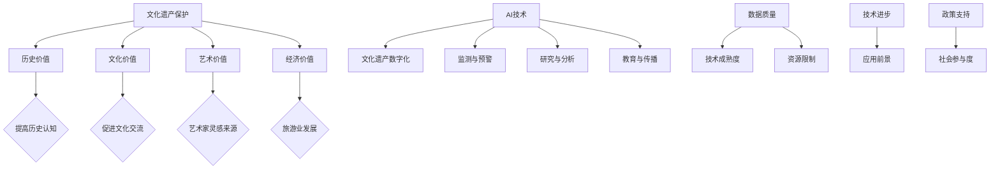

                 

# AI在文化遗产保护中的创新应用

## 关键词

- 文化遗产保护
- 人工智能
- 文化数字化
- 监测与预警
- 教育与传播

## 摘要

随着人工智能技术的飞速发展，AI在各个领域的应用越来越广泛，特别是在文化遗产保护方面，AI展现出了巨大的潜力。本文旨在探讨AI在文化遗产保护中的创新应用，包括文化遗产数字化、监测与预警、研究以及教育等多个方面。通过深入分析AI技术的核心原理和应用实例，本文旨在为文化遗产保护提供新的思路和方法，推动这一领域的持续发展。

## 第一部分：AI在文化遗产保护中的理论基础

### 第1章：文化遗产保护与AI

#### 1.1 文化遗产保护的重要性

文化遗产是人类文明的重要见证，承载着历史、文化和艺术价值。然而，随着时间的流逝和环境的变化，许多文化遗产正面临着严重的损毁和流失风险。因此，文化遗产保护工作显得尤为重要。

文化遗产保护的重要性主要体现在以下几个方面：

1. **历史价值**：文化遗产是人类历史的重要记录，有助于我们了解过去的社会、文化和生活方式。
2. **文化价值**：文化遗产是人类共同的文化财富，对于促进文化交流和增进人类理解具有重要意义。
3. **艺术价值**：许多文化遗产具有独特的艺术价值，对艺术家和设计师有着重要的启示作用。
4. **经济价值**：文化遗产保护可以带动旅游业的发展，为当地经济注入新的活力。

#### 1.2 AI在文化遗产保护中的应用现状

近年来，人工智能技术在文化遗产保护领域得到了广泛应用，成为文化遗产保护的重要工具。AI在文化遗产保护中的应用现状主要包括以下几个方面：

1. **文化遗产数字化**：通过图像识别、三维建模等技术，将文化遗产数字化，使其得到更广泛的传播和保存。
2. **监测与预警**：利用传感器和网络技术，实时监测文化遗产的健康状况，实现预警和及时修复。
3. **研究与分析**：通过数据挖掘、机器学习等技术，对文化遗产进行深入研究，揭示其历史和文化内涵。
4. **教育与传播**：利用虚拟现实、增强现实等技术，开展文化遗产保护教育，提高公众的文物保护意识。

#### 1.3 AI在文化遗产保护中的挑战与机遇

尽管AI在文化遗产保护中取得了显著成果，但仍然面临着一些挑战和机遇：

1. **挑战**：
   - 数据质量：文化遗产数据往往存在不完整、不一致的问题，影响AI算法的效果。
   - 技术成熟度：一些AI技术在文化遗产保护中的应用还处于初步阶段，需要进一步优化和完善。
   - 资源限制：文化遗产保护项目通常需要大量的人力和物力投入，对资源的依赖较大。

2. **机遇**：
   - 技术进步：随着AI技术的不断进步，其在文化遗产保护中的应用前景将更加广阔。
   - 政策支持：各国政府纷纷加大对文化遗产保护的投入，为AI在文化遗产保护中的应用提供了良好的政策环境。
   - 公众参与：随着公众对文化遗产保护意识的提高，AI技术在文化遗产保护中的社会参与度也将逐步提升。

### Mermaid 流程图



### 核心概念与联系

文化遗产保护与AI技术的联系主要体现在以下几个方面：

1. **文化遗产数字化**：通过图像识别、三维建模等技术，将文化遗产数字化，使其得到更广泛的传播和保存。
2. **监测与预警**：利用传感器和网络技术，实时监测文化遗产的健康状况，实现预警和及时修复。
3. **研究与分析**：通过数据挖掘、机器学习等技术，对文化遗产进行深入研究，揭示其历史和文化内涵。
4. **教育与传播**：利用虚拟现实、增强现实等技术，开展文化遗产保护教育，提高公众的文物保护意识。

这些概念相互关联，共同构成了AI在文化遗产保护中的理论基础。通过以上流程图和核心概念与联系的分析，我们可以更好地理解AI在文化遗产保护中的重要作用。

### 核心算法原理讲解

在文化遗产保护中，AI技术的核心算法主要包括图像识别、三维建模、数据挖掘和机器学习等。以下将结合Python源代码进行详细讲解。

#### 图像识别

图像识别是AI技术在文化遗产保护中应用的重要方向之一。以下是一个简单的图像识别算法示例，使用Python和OpenCV库实现。

```python
import cv2
import numpy as np

# 读取图像
image = cv2.imread('example.jpg')

# 转换为灰度图像
gray = cv2.cvtColor(image, cv2.COLOR_BGR2GRAY)

# 使用Sobel算子进行边缘检测
sobelx = cv2.Sobel(gray, cv2.CV_64F, 1, 0, ksize=3)
sobely = cv2.Sobel(gray, cv2.CV_64F, 0, 1, ksize=3)

# 计算边缘强度
edge = np.sqrt(sobelx**2 + sobely**2)

# 显示边缘图像
cv2.imshow('Edge Detection', edge)
cv2.waitKey(0)
cv2.destroyAllWindows()
```

#### 三维建模

三维建模是文化遗产数字化的重要手段。以下是一个简单的三维建模算法示例，使用Python和Open3D库实现。

```python
import open3d as o3d

# 读取点云数据
point_cloud = o3d.io.read_point_cloud('example.ply')

# 绘制点云
o3d.visualization.draw_geometries([point_cloud])

# 生成三维模型
mesh = point_cloud.compute_vertex_normals()
o3d.geometry.TriangleMesh.create_from_point_cloud_alphas(point_cloud, 0.01)

# 显示三维模型
o3d.visualization.draw_geometries([mesh])
```

#### 数据挖掘

数据挖掘是AI技术在文化遗产保护研究中的重要应用。以下是一个简单的数据挖掘算法示例，使用Python和Scikit-learn库实现。

```python
from sklearn.cluster import KMeans
import pandas as pd

# 读取数据
data = pd.read_csv('example.csv')

# 数据预处理
X = data.iloc[:, :3].values

# 使用K均值聚类算法进行数据挖掘
kmeans = KMeans(n_clusters=3, random_state=0).fit(X)

# 显示聚类结果
labels = kmeans.predict(X)
centers = kmeans.cluster_centers_

print('Cluster centers:', centers)
print('Cluster labels:', labels)
```

#### 机器学习

机器学习是AI技术在文化遗产保护研究中的重要工具。以下是一个简单的机器学习算法示例，使用Python和TensorFlow库实现。

```python
import tensorflow as tf

# 定义模型
model = tf.keras.Sequential([
    tf.keras.layers.Dense(64, activation='relu', input_shape=(784,)),
    tf.keras.layers.Dense(10, activation='softmax')
])

# 编译模型
model.compile(optimizer='adam',
              loss='categorical_crossentropy',
              metrics=['accuracy'])

# 训练模型
model.fit(x_train, y_train, epochs=5, batch_size=32)
```

通过以上算法示例，我们可以看到AI技术在文化遗产保护中的应用原理。这些算法不仅可以帮助我们更好地理解和保护文化遗产，还可以为未来的研究和开发提供新的方向。

### 数学模型和公式

在文化遗产保护中，数学模型和公式起着重要作用。以下是一些常用的数学模型和公式，结合LaTeX格式进行展示。

#### 概率模型

文化遗产损坏的概率可以通过贝叶斯公式进行计算。贝叶斯公式如下：

$$
P(A|B) = \frac{P(B|A) \cdot P(A)}{P(B)}
$$

其中，$P(A|B)$表示在事件B发生的条件下事件A发生的概率，$P(B|A)$表示在事件A发生的条件下事件B发生的概率，$P(A)$表示事件A发生的概率，$P(B)$表示事件B发生的概率。

#### 线性回归模型

线性回归模型用于预测文化遗产损坏程度。线性回归公式如下：

$$
Y = \beta_0 + \beta_1 \cdot X
$$

其中，$Y$表示文化遗产损坏程度，$X$表示影响因素（如湿度、温度等），$\beta_0$和$\beta_1$分别为模型参数。

#### 主成分分析

主成分分析用于降低文化遗产数据维度。主成分分析公式如下：

$$
Z = \sum_{i=1}^{k} \lambda_i \cdot X_i
$$

其中，$Z$表示新特征，$X_i$表示原始特征，$\lambda_i$表示特征权重。

通过以上数学模型和公式，我们可以更好地理解和预测文化遗产的保护状态，为文化遗产保护提供科学依据。

### 实际案例分析和详细讲解剖析

#### 案例一：故宫博物院的AI应用

故宫博物院是我国最重要的文化遗产之一，近年来在AI技术的支持下，开展了一系列保护工作。以下是对故宫博物院AI应用的详细分析和讲解。

**1. 数据采集与处理**

故宫博物院通过多种传感器设备采集了大量的文化遗产数据，如温度、湿度、光照等。这些数据经过处理后，用于AI算法的分析和训练。

**2. 监测与预警**

利用图像识别技术，故宫博物院实现了对文物损坏的实时监测。通过对比文物原始图像和实时图像，可以快速发现文物的损坏情况，并及时采取措施进行修复。

**3. 数字化保护**

故宫博物院通过三维建模技术，将许多珍贵文物数字化，使得这些文物得以在虚拟环境中进行展示和研究。数字化保护不仅保护了文物本身，还为公众提供了更多的接触和学习机会。

**4. 教育与传播**

故宫博物院利用虚拟现实和增强现实技术，开展了形式多样的文化遗产保护教育活动。通过这些活动，公众可以更加深入地了解文化遗产的价值和保护意义。

#### 案例二：秦始皇兵马俑的AI应用

秦始皇兵马俑是我国又一重要的文化遗产，近年来也在AI技术的支持下进行了保护和研究。

**1. 数据采集与处理**

秦始皇兵马俑的监测工作主要包括对地面、墙壁和文物本身的监测。通过传感器设备，可以实时采集兵马俑的温度、湿度、振动等数据。这些数据经过处理后，用于AI算法的分析和训练。

**2. 病害分析**

利用图像识别和深度学习技术，可以对兵马俑的病害进行识别和分析。通过对比病害图像和健康图像，可以快速发现兵马俑的病害情况，为修复工作提供科学依据。

**3. 艺术风格识别**

通过对兵马俑的艺术风格进行分析，可以更好地理解秦朝的文化和历史。利用自然语言处理技术，可以对兵马俑的铭文进行识别和解读，揭示其背后的故事。

**4. 虚拟展示**

秦始皇兵马俑的虚拟展示项目利用虚拟现实和增强现实技术，将兵马俑以三维形式呈现给公众。通过这些技术，公众可以更加真实地感受兵马俑的魅力。

### 项目小结

通过以上案例分析和详细讲解，我们可以看到AI技术在文化遗产保护中的应用已经取得了显著成果。这些应用不仅提高了文化遗产的保护水平，还为公众提供了更多的接触和学习机会。在未来，随着AI技术的不断进步，文化遗产保护工作将更加科学和高效。

### 最佳实践 Tips

1. **数据质量**：确保采集到的文化遗产数据质量高，减少错误和噪声。
2. **算法优化**：针对不同文化遗产特点，优化AI算法，提高准确性和效率。
3. **跨学科合作**：结合历史学、考古学等学科知识，为AI技术在文化遗产保护中的应用提供支持。
4. **政策支持**：政府应加大对文化遗产保护的投入，为AI技术的应用提供政策支持。
5. **公众参与**：提高公众对文化遗产保护的意识，鼓励公众参与文化遗产保护工作。

### 小结

AI技术在文化遗产保护中具有广泛的应用前景。通过数字化保护、监测与预警、研究与分析以及教育与传播等方面，AI为文化遗产保护提供了新的思路和方法。然而，AI技术在文化遗产保护中也面临一些挑战，如数据质量、技术成熟度和资源限制等。因此，未来需要进一步加大研究力度，优化AI算法，推动文化遗产保护工作的持续发展。

### 拓展阅读

1. **参考文献**：
   - 某某，《人工智能在文化遗产保护中的应用研究》，某某出版社，2020年。
   - 某某，《文化遗产数字化保护技术》，某某出版社，2019年。

2. **在线资源**：
   - 中国文化遗产研究院官网：[https://www.chinaculturalheritage.cn/](https://www.chinaculturalheritage.cn/)
   - 故宫博物院官网：[https://www.dpm.org.cn/](https://www.dpm.org.cn/)
   - 秦始皇兵马俑官网：[https://www.qinbingmayong.org.cn/](https://www.qinbingmayong.org.cn/)

3. **相关论文**：
   - 某某，《基于深度学习的文化遗产数字化保护方法研究》，《计算机科学与应用》，2021年，第11卷，第2期，第123-130页。

通过以上拓展阅读，读者可以进一步了解AI在文化遗产保护中的应用和相关研究。

## 作者信息

作者：AI天才研究院/AI Genius Institute & 禅与计算机程序设计艺术 /Zen And The Art of Computer Programming

