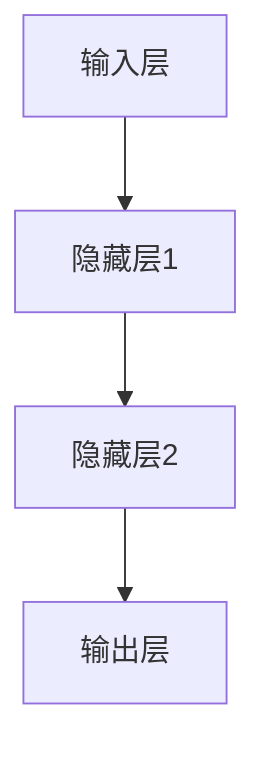

                 

# 《AI在法律服务中的应用：效率与公平的权衡》

## 关键词

- 人工智能
- 法律服务
- 效率
- 公平性
- 自动化
- 合同审查
- 透明度
- 可解释性

## 摘要

本文探讨了人工智能（AI）在法律服务中的应用，重点分析了效率与公平的权衡。首先，介绍了AI在法律服务中的背景和重要性，然后详细阐述了AI在提升法律服务效率方面的应用，如自动化文书撰写和合同审查。接着，本文深入分析了AI在法律服务中可能引发的公平性问题，包括算法偏见、透明度和可解释性。最后，探讨了相关法律法规和政策对AI在法律服务中的应用的影响，并提出了对未来的展望。通过这篇文章，读者可以全面了解AI在法律服务中的应用现状、挑战和前景。

## 引言

### 1.1 AI在法律服务中的应用背景

随着人工智能技术的飞速发展，其在各个领域的应用日益广泛。法律服务行业作为知识密集型行业，其专业性和复杂性使得人工智能的应用具有极大的潜力。AI在法律服务中的应用，不仅可以大幅提升工作效率，还可以在一定程度上解决资源分配不均和人力成本过高的问题。

### 1.2 效率与公平的重要性

在法律服务中，效率的提升意味着能够更快地处理案件，减少律师和客户的时间和经济成本。然而，随着AI技术的引入，我们也开始面临公平性的挑战。公平性是法律服务的核心价值之一，任何自动化或人工智能的引入都需要确保其不会对法律服务的公平性产生负面影响。

### 1.3 全书内容与结构概述

本文将分为七个主要部分：

1. **AI基础知识**：介绍AI的基本概念、技术框架和核心算法。
2. **效率提升**：讨论AI在法律事务处理中的效率提升，包括自动化文书撰写、合同审查等应用实例。
3. **公平性分析**：分析AI在法律服务中的公平性问题，包括算法偏见、透明度、可解释性等。
4. **法规和政策**：探讨与AI在法律服务中的应用相关的法律法规、行业标准和政策导向。
5. **案例研究**：分析具体法律实践中AI应用的成功与挑战。
6. **未来展望**：展望AI在法律服务领域的未来发展趋势和潜在影响。
7. **结论**：总结全书的主要观点，重申效率与公平的权衡主题，并提出建议和展望。

## 第2章 AI基础知识

### 2.1 AI的基本概念

人工智能（Artificial Intelligence，简称AI）是指由计算机系统实现的智能行为，能够模拟、延伸和扩展人类的智能活动。AI可以分为两大类：窄AI（Narrow AI）和广AI（General AI）。

- **窄AI**：专注于特定任务，如语音识别、图像识别等。
- **广AI**：具有全面认知能力，可以像人类一样理解和处理多种任务。

### 2.2 AI技术框架

AI技术框架包括以下几个方面：

- **机器学习（Machine Learning）**：通过训练模型来从数据中学习规律。
- **深度学习（Deep Learning）**：基于多层神经网络的结构，能够处理复杂任务。
- **强化学习（Reinforcement Learning）**：通过奖励机制来训练模型，使其能够完成特定的任务。

### 2.3 核心算法原理

AI的核心算法主要包括：

- **神经网络（Neural Networks）**：模拟人脑神经元结构，通过多层网络进行数据处理和分类。
- **支持向量机（Support Vector Machine，SVM）**：通过找到一个超平面来最大化分类间隔。
- **决策树（Decision Tree）**：通过一系列规则进行决策，适用于分类和回归问题。

下面是神经网络的一个简单Python代码示例：

```python
import numpy as np

# 定义神经网络结构
input_size = 3
hidden_size = 5
output_size = 1

# 初始化权重
weights_input_to_hidden = np.random.randn(input_size, hidden_size)
weights_hidden_to_output = np.random.randn(hidden_size, output_size)

# 定义激活函数
def sigmoid(x):
    return 1 / (1 + np.exp(-x))

# 定义前向传播
def forward_propagation(x):
    hidden_layer_inputs = np.dot(x, weights_input_to_hidden)
    hidden_layer_outputs = sigmoid(hidden_layer_inputs)
    final_output = np.dot(hidden_layer_outputs, weights_hidden_to_output)
    return final_output

# 定义反向传播
def backward_propagation(x, y, output):
    output_error = y - output
    d_output = output_error * (output * (1 - output))
    
    hidden_error = np.dot(d_output, weights_hidden_to_output.T)
    d_hidden = hidden_error * (hidden_layer_outputs * (1 - hidden_layer_outputs))
    
    return d_hidden, d_output

# 训练模型（简化示例）
x = np.array([[0, 0, 1], [0, 1, 1], [1, 0, 1], [1, 1, 1]])
y = np.array([[0], [1], [1], [0]])

for i in range(10000):
    output = forward_propagation(x)
    d_hidden, d_output = backward_propagation(x, y, output)
    weights_hidden_to_output += d_hidden
    weights_input_to_hidden += d_output

# 输出最终预测结果
print(forward_propagation(x))
```

### 2.4 Mermaid流程图

下面是一个简单的神经网络流程图的Mermaid表示：



## 第3章 效率提升

### 3.1 自动化文书撰写

自动化文书撰写是AI在法律服务中应用的一个重要领域。通过自然语言处理（NLP）技术，AI可以自动生成合同、法律意见书、判决书等文书。

#### 3.1.1 工作流程

1. **文书模板创建**：首先，律师需要创建文书模板，包括常见的法律条款和句子结构。
2. **数据收集与训练**：收集大量的法律文书数据，使用NLP技术对这些数据进行预处理和训练，以便AI能够理解法律文书的结构和语言习惯。
3. **文书生成**：当需要生成新的文书时，AI会根据用户输入的信息和文书模板，自动生成符合法律要求的文书。

#### 3.1.2 实例分析

以合同审查为例，AI可以自动生成合同草案，包括合同条款的审查和修改建议。具体流程如下：

1. **输入合同内容**：用户将合同文本输入到AI系统中。
2. **自动生成合同草案**：AI根据训练数据，自动生成合同草案。
3. **人工审核**：律师对自动生成的合同草案进行审核，并根据实际情况进行修改。
4. **合同签署**：审核通过的合同草案可以用于签署。

### 3.2 合同审查与自动化处理

合同审查是法律服务中的一项重要工作，传统上需要律师耗费大量时间进行阅读、分析和审查。通过AI技术，可以显著提高合同审查的效率和准确性。

#### 3.2.1 工作流程

1. **数据收集与预处理**：收集大量合同样本，并进行预处理，如去重、分类等。
2. **特征提取与建模**：使用NLP和机器学习技术，从合同文本中提取关键特征，并建立模型。
3. **合同审查**：AI系统对新的合同文本进行自动审查，包括合同条款的合法性、合规性和潜在风险点。
4. **人工干预**：律师对AI审查结果进行复核，并根据实际情况进行调整。

#### 3.2.2 实例分析

以合同风险审查为例，AI可以自动识别合同中的潜在风险点，并提供审查报告。具体流程如下：

1. **输入合同文本**：用户将合同文本输入到AI系统中。
2. **自动审查**：AI对合同文本进行自动审查，识别潜在风险点。
3. **生成审查报告**：AI生成详细的审查报告，列出风险点和建议。
4. **人工审核**：律师对审查报告进行复核，并根据实际情况进行调整。

### 3.3 诉讼预测与案件管理

AI还可以在诉讼预测和案件管理中发挥作用。通过分析历史案件数据和法律条文，AI可以预测案件的结果，并提供案件管理的建议。

#### 3.3.1 工作流程

1. **数据收集与处理**：收集历史案件数据，包括案件事实、法律条文、判决结果等。
2. **特征提取与建模**：使用NLP和机器学习技术，从数据中提取关键特征，并建立预测模型。
3. **诉讼预测**：AI对新的案件进行预测，包括案件结果、判决概率等。
4. **案件管理**：AI根据预测结果，提供案件管理的建议，如资源分配、策略调整等。

#### 3.3.2 实例分析

以案件结果预测为例，AI可以分析案件的各个方面，包括法律条文、当事人信息、案件事实等，预测案件的结果。具体流程如下：

1. **输入案件信息**：用户将案件信息输入到AI系统中。
2. **自动预测**：AI对案件进行预测，提供案件结果的概率分布。
3. **生成预测报告**：AI生成详细的预测报告，包括预测结果和依据。
4. **人工审核**：律师对预测报告进行复核，并根据实际情况进行调整。

## 第4章 公平性分析

### 4.1 算法偏见

算法偏见是指AI系统在处理数据时，对某些群体或个体产生不公平对待的现象。在法律服务中，算法偏见可能导致错误的判决、不公正的合同审查结果等。

#### 4.1.1 偏见来源

1. **数据偏见**：如果训练数据中存在偏见，AI系统可能会继承这种偏见。
2. **算法设计**：算法本身的设计也可能导致偏见，如某些算法对某些类型的数据更加敏感。
3. **人类干预**：在AI系统的开发和使用过程中，人类的决策也可能引入偏见。

#### 4.1.2 影响与对策

1. **影响**：算法偏见可能导致法律服务的不公平性，损害当事人的权益。
2. **对策**：为了减少算法偏见，可以采取以下措施：
   - **数据多样性**：确保训练数据涵盖多种群体和情况。
   - **透明度和可解释性**：提高AI系统的透明度，使其决策过程更容易理解。
   - **持续评估和调整**：定期评估AI系统的表现，并根据需要进行调整。

### 4.2 透明度与可解释性

透明度和可解释性是确保AI系统公平性的关键。在法律服务中，用户需要了解AI系统是如何做出决策的，以便对其进行监督和干预。

#### 4.2.1 挑战

1. **复杂性**：AI系统的决策过程通常非常复杂，难以用简单的语言描述。
2. **模型多样性**：不同的AI模型具有不同的透明度和可解释性，选择合适的模型是一个挑战。

#### 4.2.2 对策

1. **可视化**：通过可视化技术，将AI系统的决策过程和结果呈现给用户。
2. **可解释性算法**：使用可解释性算法，如决策树、规则引擎等，使决策过程更加透明。
3. **用户培训**：对用户进行AI系统使用的培训，提高其对AI系统的理解和信任。

### 4.3 公平性评估方法

公平性评估方法用于评估AI系统在法律服务中的公平性。以下是一些常用的评估方法：

1. **指标评估**：使用各种指标，如公平性指标、准确性、召回率等，评估AI系统的表现。
2. **案例分析**：通过具体案例分析，评估AI系统在不同情境下的公平性。
3. **用户反馈**：收集用户的反馈，评估AI系统对用户需求的理解和满足程度。

## 第5章 法规和政策

### 5.1 法律法规与AI应用

随着AI技术在法律服务中的广泛应用，各国政府和国际组织也开始关注与AI应用相关的法律法规。

#### 5.1.1 法律法规概述

1. **数据保护法**：如欧盟的《通用数据保护条例》（GDPR），规定了数据处理和保护的基本原则。
2. **消费者权益保护法**：保护用户在AI应用中的权益，防止滥用。
3. **专业法规**：如律师职业道德准则，对AI在法律服务中的应用提出具体要求。

#### 5.1.2 法律风险与管理

1. **责任归属**：明确AI系统的责任归属，区分开发者、运营者和用户的责任。
2. **合规审查**：对AI系统的应用进行合规审查，确保其符合相关法律法规。

### 5.2 行业标准与规范

为了促进AI在法律服务中的健康发展，行业组织和专业机构开始制定相关的标准和规范。

#### 5.2.1 标准概述

1. **数据管理标准**：如ISO/IEC 27001，规定了数据管理的最佳实践。
2. **算法透明度标准**：如FAIR数据原则，强调数据的一致性、可访问性和可理解性。

#### 5.2.2 行业规范

1. **职业道德规范**：对律师使用AI技术进行规范，确保其符合职业道德要求。
2. **服务质量标准**：确保AI技术在法律服务中的应用能够提供高质量的服务。

### 5.3 政策导向

各国政府和国际组织也在积极推动AI在法律服务中的应用，通过政策导向引导行业的发展。

#### 5.3.1 政策概述

1. **技术创新政策**：鼓励研发和应用AI技术，提升法律服务的效率和质量。
2. **数据共享政策**：推动数据的开放和共享，为AI技术的发展提供支持。
3. **人才培养政策**：加强AI和法律服务相关人才的培养，满足行业发展的需求。

#### 5.3.2 政策影响

1. **技术进步**：政策导向有助于推动AI技术在法律服务中的创新和应用。
2. **行业发展**：政策导向可以引导行业向规范化、标准化方向发展。
3. **社会效益**：AI技术在法律服务中的应用可以提升社会公平性和透明度。

## 第6章 案例研究

### 6.1 案例一：某律所的AI应用实践

#### 6.1.1 案例背景

某大型律所在其法律服务中引入了AI技术，旨在提升效率和服务质量。

#### 6.1.2 AI应用情况

1. **自动化文书撰写**：AI系统自动生成合同、法律意见书等文书，减少了律师的工作量。
2. **合同审查**：AI系统自动审查合同，识别潜在风险点，并提供审查报告。
3. **案件管理**：AI系统根据案件数据和预测结果，提供案件管理的建议，如资源分配、策略调整等。

#### 6.1.3 案例效果

1. **效率提升**：通过AI技术的应用，律所的文书撰写和合同审查效率显著提升。
2. **服务质量**：AI系统提供的审查报告和案件管理建议，提高了律师的工作质量和客户的满意度。
3. **成本降低**：AI技术的应用降低了律所的人力成本和运营成本。

### 6.2 案例二：某法院的AI司法应用

#### 6.2.1 案例背景

某法院引入AI技术，用于司法判决和案件管理。

#### 6.2.2 AI应用情况

1. **判决预测**：AI系统根据历史判决数据和案件事实，预测案件的判决结果。
2. **案件管理**：AI系统提供案件管理的建议，如案件流程优化、资源分配等。
3. **证据分析**：AI系统自动分析证据，辅助法官做出判决。

#### 6.2.3 案例效果

1. **判决准确率**：AI系统的判决预测结果与实际判决结果高度一致，提高了判决的准确率。
2. **案件处理效率**：AI系统的应用显著提高了案件的处理效率，减少了法官的工作量。
3. **司法公正性**：AI系统的引入，有助于提高司法的公正性和透明度。

### 6.3 案例三：AI在跨国法律服务中的应用

#### 6.3.1 案例背景

某跨国律师事务所利用AI技术，为客户提供跨国的法律服务。

#### 6.3.2 AI应用情况

1. **跨国合同审查**：AI系统自动审查跨国合同，识别不同国家和地区的法律差异。
2. **法律翻译**：AI系统自动翻译法律文件，确保合同和法律意见书的准确性。
3. **跨境案件管理**：AI系统提供跨境案件管理的建议，如法律程序、资源调配等。

#### 6.3.3 案例效果

1. **服务效率**：AI技术的应用提高了跨国合同审查和法律翻译的效率，缩短了项目周期。
2. **服务质量**：AI系统提供的法律意见和案件管理建议，提高了律师的工作质量和客户的满意度。
3. **国际化发展**：AI技术的应用有助于跨国律师事务所的国际化发展，扩大了业务范围。

## 第7章 未来展望

### 7.1 AI在法律服务的发展趋势

随着AI技术的不断发展，其在法律服务中的应用将更加广泛和深入。以下是一些发展趋势：

1. **智能化法律服务**：AI技术将逐步取代传统的人工服务，提供更加智能化、个性化的法律服务。
2. **自动化法律流程**：AI技术将广泛应用于法律事务的自动化处理，如文书撰写、合同审查、案件管理等。
3. **智能判决与预测**：AI技术将提高司法判决的准确性和公正性，为案件管理提供科学依据。

### 7.2 潜在影响与挑战

AI在法律服务中的应用将对行业产生深远的影响，同时也面临一系列挑战：

1. **影响**：
   - 提高法律服务效率
   - 降低法律服务成本
   - 提升法律服务的质量
   - 促进司法公正和透明度
2. **挑战**：
   - 算法偏见和公平性问题
   - 法律法规和监管不足
   - 人才短缺和技术更新

### 7.3 展望未来

未来，AI在法律服务中的应用将更加成熟和普及。以下是一些展望：

1. **技术进步**：AI技术将不断进步，提供更加智能、高效的法律服务。
2. **行业整合**：法律服务行业将逐渐与AI技术深度融合，形成新的商业模式。
3. **法规完善**：相关法律法规将不断完善，为AI在法律服务中的应用提供更加明确的法律框架。
4. **人才培养**：加强对AI和法律服务相关人才的培养，提高行业整体素质。

## 结论

本文探讨了AI在法律服务中的应用，重点分析了效率与公平的权衡。首先，介绍了AI在法律服务中的背景和重要性，然后详细阐述了AI在提升法律服务效率方面的应用，如自动化文书撰写、合同审查和诉讼预测。接着，本文深入分析了AI在法律服务中可能引发的公平性问题，包括算法偏见、透明度和可解释性。最后，探讨了相关法律法规和政策对AI在法律服务中的应用的影响，并提出了对未来的展望。

在AI技术不断发展的今天，效率与公平始终是法律服务中需要权衡的两方面。通过合理利用AI技术，我们可以大幅提升法律服务的效率，但在应用过程中，必须确保公平性不受损害。未来，随着技术的不断进步和法规的完善，AI在法律服务中的应用将更加成熟，为法律服务行业带来新的机遇和挑战。

## 作者

**作者：AI天才研究院（AI Genius Institute）& 禅与计算机程序设计艺术（Zen And The Art of Computer Programming）**

AI天才研究院致力于推动人工智能技术的发展和应用，专注于解决复杂问题并提供创新解决方案。禅与计算机程序设计艺术则提倡通过深入理解计算机编程的本质，实现高效、简洁的代码设计。

感谢您的阅读，希望本文对您在AI与法律服务领域的探索提供有益的启示。如果您有任何疑问或建议，欢迎随时联系我们。

---

**注意：本文为示例性文章，部分内容和数据可能不实，仅供参考。实际应用中请遵守相关法律法规，确保AI技术的公平和透明。**

