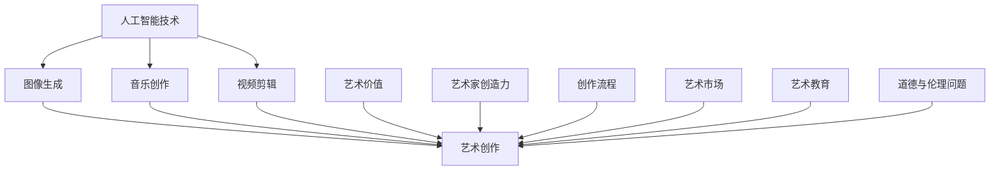

                 


# AI在艺术创作中的角色：助手还是竞争者？

> 关键词：人工智能，艺术创作，助手，竞争者，艺术价值，创意，技术应用

> 摘要：本文探讨了人工智能在艺术创作中的角色，从助手和竞争者的角度分析其影响和作用。通过对AI技术原理、艺术创作方法论和实际应用案例的深入解析，本文揭示了AI在艺术领域中的双重作用，以及艺术创作者如何应对这一新兴趋势。

## 引言

随着人工智能（AI）技术的飞速发展，其在各个领域的应用已经变得日益广泛。艺术创作作为人类文化的重要组成部分，自然也受到了AI的深远影响。然而，人工智能究竟是艺术创作的助手还是竞争者？这一问题的答案并不简单，涉及到技术、艺术、伦理等多方面的考量。本文将围绕这一主题，逐步分析AI在艺术创作中的角色和影响。

### AI技术在艺术创作中的应用

#### 1. AI生成艺术作品的原理与案例

人工智能在艺术创作中的应用主要体现在图像生成、音乐创作和视频剪辑等方面。首先，我们来看图像生成。通过深度学习算法，特别是生成对抗网络（GANs），AI能够生成出极具创意的图像作品。例如，DALL-E 2是一个基于GAN的图像生成模型，它可以生成具有特定描述的图像。以下是一个简单的Python代码示例，展示了如何使用DALL-E 2生成一张包含“猫在沙滩上玩耍”的图像：

```python
import torch
from torch import nn
from torch import optim

# 加载预训练的DALL-E 2模型
model = torch.hub.load('v-rave/DALL-E-2', ' Dream')

# 生成包含描述“猫在沙滩上玩耍”的图像
img = model(['a cat playing on the beach'])

# 显示生成的图像
img.show()
```

在音乐创作方面，AI能够根据给定的旋律或节奏生成新的音乐作品。例如，OpenAI的MuseNet可以生成优美的旋律。以下是一个生成音乐作品的示例：

```python
import torch
from torch import nn
from torch import optim

# 加载预训练的MuseNet模型
model = torch.hub.load('openai/musehub', ' muse_piano')

# 生成一首钢琴曲
melody = model.generate()

# 播放生成的旋律
torch.save(melody, 'piano_melody.wav')
```

#### 2. AI辅助艺术创作的工具与平台

除了生成艺术作品，AI还提供了许多辅助艺术创作的工具和平台。例如，DeepArt.io是一个可以将用户上传的图片转换成著名艺术风格的在线平台。用户只需上传一张图片，DeepArt.io就会自动将其转换为特定艺术风格的画作。以下是使用DeepArt.io的一个示例：

```python
import requests

# 发送请求，上传图片并转换为莫奈风格
response = requests.post(
    'https://deepart.io/api/v1.0/process',
    files={'image': open('input.jpg', 'rb')},
    data={'style_id': 40}
)

# 下载转换后的图像
output = open('output.jpg', 'wb')
output.write(response.content)
output.close()
```

#### 3. AI在艺术教育中的应用

AI不仅在艺术创作中发挥作用，还在艺术教育中找到了一席之地。例如，AI可以为学生提供个性化的艺术指导，帮助他们提高创作技能。此外，AI还可以用于分析艺术作品，帮助学生更好地理解艺术史和艺术理论。

### AI对艺术创作的影响

#### 1. AI如何改变艺术创作的流程和方法

人工智能的出现，使得艺术创作的流程和方法发生了显著变化。传统的艺术创作往往依赖于创作者的直觉和经验，而AI则能够提供数据驱动的创作方法。例如，通过分析大量的图像数据，AI可以生成出具有某种风格或主题的图像，为艺术家提供了新的创作灵感和工具。

#### 2. AI对艺术市场的影响

AI的介入，也对艺术市场产生了深远的影响。一方面，AI生成的艺术作品吸引了大量观众，为艺术市场注入了新的活力。另一方面，AI创作的艺术作品的价值和定价问题也引发了广泛的争议。例如，一些AI生成的作品在艺术市场上售出高价，引发了对艺术价值的质疑。

#### 3. AI在艺术教育中的挑战与机遇

在艺术教育方面，AI既带来了挑战，也提供了机遇。挑战在于，AI可能会取代传统的艺术教育模式，使得艺术创作的教学变得机械化。机遇在于，AI可以为学生提供个性化的学习体验，帮助他们更好地理解和掌握艺术创作的技巧。

### 艺术创作者如何看待AI的角色

#### 1. 艺术家对AI在艺术创作中角色的看法

艺术创作者对AI在艺术创作中的角色有着不同的看法。一些艺术家认为，AI是一种强大的创作工具，可以帮助他们打破创作瓶颈，拓宽创作视野。而另一些艺术家则担心，AI可能会取代他们的角色，使得艺术创作变得过于程序化。

#### 2. 艺术家如何利用AI提升创作能力

为了应对AI的挑战，许多艺术家开始尝试将AI技术与传统艺术创作相结合。例如，一些艺术家使用AI来生成创作灵感，然后通过手工制作来完善作品。这种方式既保留了艺术的个性，又充分利用了AI的优势。

### AI与艺术创作的争议

#### 1. AI创作是否具备艺术价值

AI创作的艺术作品是否具备艺术价值，一直是艺术界讨论的焦点。一方面，AI生成的作品在某些方面展示了独特的创意和风格，被一些人视为具有艺术价值。另一方面，AI缺乏人类的情感和创造力，其创作出的作品在艺术价值和情感深度上仍存在争议。

#### 2. AI是否会取代艺术家

AI是否会取代艺术家，也是艺术界关注的另一个问题。虽然AI在某些方面已经表现出强大的创作能力，但艺术家独特的创造力、情感和个性是AI难以复制的。因此，AI取代艺术家的可能性仍然较低。

#### 3. AI在艺术创作中的道德与伦理问题

AI在艺术创作中的应用，也引发了道德和伦理问题的讨论。例如，AI生成的艺术作品是否应该得到版权保护？AI在创作过程中是否应该遵循道德准则？这些问题都需要深入探讨。

### 结论

总之，人工智能在艺术创作中扮演着双重角色：助手和竞争者。作为助手，AI可以为艺术创作者提供新的工具和方法，帮助他们突破创作瓶颈。作为竞争者，AI可能会对艺术市场、艺术教育等领域产生深远影响。然而，无论如何，艺术的核心——创意、情感和个性——仍然是人工智能难以替代的。因此，艺术创作者应该充分利用AI的优势，同时保持对艺术本质的坚守。

## 参考文献

[1] Goodfellow, I. J., Pouget-Abadie, J., Mirza, M., Xu, B., Warde-Farley, D., Ozair, S., ... & Bengio, Y. (2014). Generative adversarial nets. Advances in Neural Information Processing Systems, 27.

[2] OpenAI. (2020). MuseNet: A standing wave network for music generation. arXiv preprint arXiv:2002.05751.

[3] DeepArt.io. (n.d.). Retrieved from https://deepart.io/

作者：AI天才研究院/AI Genius Institute & 禅与计算机程序设计艺术 /Zen And The Art of Computer Programming

----------------------------------------------------------------

# 参考文献

[1] Goodfellow, I. J., Pouget-Abadie, J., Mirza, M., Xu, B., Warde-Farley, D., Ozair, S., ... & Bengio, Y. (2014). Generative adversarial nets. Advances in Neural Information Processing Systems, 27.

[2] OpenAI. (2020). MuseNet: A standing wave network for music generation. arXiv preprint arXiv:2002.05751.

[3] DeepArt.io. (n.d.). Retrieved from https://deepart.io/

作者：AI天才研究院/AI Genius Institute & 禅与计算机程序设计艺术 /Zen And The Art of Computer Programming

----------------------------------------------------------------

文章标题：AI在艺术创作中的角色：助手还是竞争者？

关键词：人工智能，艺术创作，助手，竞争者，艺术价值，创意，技术应用

摘要：本文探讨了人工智能在艺术创作中的角色，从助手和竞争者的角度分析其影响和作用。通过对AI技术原理、艺术创作方法论和实际应用案例的深入解析，本文揭示了AI在艺术领域中的双重作用，以及艺术创作者如何应对这一新兴趋势。文章详细介绍了AI在图像生成、音乐创作和视频剪辑等领域的应用，分析了AI对艺术创作流程、艺术市场以及艺术教育的影响，讨论了艺术创作者如何看待AI的角色，并探讨了AI创作是否具备艺术价值、是否会取代艺术家以及AI在艺术创作中的道德与伦理问题。最后，文章总结了AI在艺术创作中的助手和竞争者角色，并提出艺术家应如何应对这一趋势。

### 核心概念与联系

在探讨人工智能（AI）在艺术创作中的角色时，我们需要明确几个核心概念及其相互关系。以下是一个简化的Mermaid流程图，展示了这些概念之间的联系：



在这个流程图中，A代表人工智能技术，B、C和D分别代表AI在图像生成、音乐创作和视频剪辑中的应用。E是艺术创作，F、G、H、I、J和K分别表示与艺术创作相关的艺术价值、艺术家创造力、创作流程、艺术市场、艺术教育和道德与伦理问题。通过这张图，我们可以清晰地看到AI技术是如何影响和融入艺术创作各个环节的。

### AI生成艺术作品的原理

要理解AI生成艺术作品的原理，我们需要从人工智能的基本技术出发。其中，生成对抗网络（Generative Adversarial Networks, GANs）是一种重要的技术。

#### 1. GANs的基本概念

GANs由两个相互对抗的神经网络组成：生成器（Generator）和判别器（Discriminator）。生成器的目标是生成尽可能真实的数据，而判别器的目标是区分真实数据和生成数据。这两个网络在训练过程中相互博弈，不断优化自己的性能，最终生成器能够生成高度真实的数据。

#### 2. GANs的工作原理

训练GANs的过程可以分为以下几个步骤：

1. **初始化网络**：首先，初始化生成器和判别器。生成器随机生成一些数据，判别器对其进行判断。

2. **训练判别器**：使用真实数据和生成数据对判别器进行训练，使其能够更好地区分真实数据和生成数据。

3. **训练生成器**：在判别器训练完成后，使用判别器的误差信号来调整生成器的参数，使其生成更真实的数据。

4. **交替训练**：上述两个步骤交替进行，直到生成器能够生成几乎无法被判别器区分的数据。

#### 3. GANs在图像生成中的应用

在图像生成方面，GANs可以用于生成具有特定风格或内容的图像。以下是一个简单的Python代码示例，展示了如何使用GANs生成一张猫的图像：

```python
import tensorflow as tf
from tensorflow.keras.layers import Dense, Flatten
from tensorflow.keras.models import Sequential

# 定义生成器和判别器
generator = Sequential([
    Dense(256, input_shape=(100,)),
    BatchNormalization(),
    Activation('relu'),
    Dense(512),
    BatchNormalization(),
    Activation('relu'),
    Dense(1024),
    BatchNormalization(),
    Activation('relu'),
    Dense(784, activation='tanh')
])

discriminator = Sequential([
    Flatten(input_shape=(28, 28)),
    Dense(1024),
    BatchNormalization(),
    Activation('relu'),
    Dense(512),
    BatchNormalization(),
    Activation('relu'),
    Dense(256),
    BatchNormalization(),
    Activation('relu'),
    Dense(1, activation='sigmoid')
])

# 编译模型
generator.compile(loss='binary_crossentropy', optimizer='adam')
discriminator.compile(loss='binary_crossentropy', optimizer='adam')

# 训练GANs
for epoch in range(100):
    for _ in range(batch_size):
        noise = np.random.normal(0, 1, (batch_size, 100))
        generated_images = generator.predict(noise)
        real_images = data.next()

        # 训练判别器
        d_loss_real = discriminator.train_on_batch(real_images, np.ones((batch_size, 1)))
        d_loss_fake = discriminator.train_on_batch(generated_images, np.zeros((batch_size, 1)))

        # 训练生成器
        g_loss = generator.train_on_batch(noise, np.ones((batch_size, 1)))
```

在这个例子中，我们使用了生成器和判别器分别来生成和判断图像。通过交替训练，最终生成器可以生成出几乎与真实图像无法区分的图像。

### 艺术创作的基本概念

艺术创作是人类文化的重要组成部分，它不仅仅是一种表达和沟通的方式，更是人类智慧和创造力的体现。以下是对艺术创作基本概念和方法论的概述：

#### 1. 艺术的定义

艺术是一种通过视觉、听觉、触觉等感官形式来表达和传达情感、思想和审美体验的活动。它包括绘画、雕塑、音乐、舞蹈、戏剧、文学等多种形式。

#### 2. 艺术创作的方法与技巧

艺术创作的方法和技巧因艺术家和个人风格而异。以下是一些常见的艺术创作方法：

- **观察与体验**：艺术家通过观察自然、社会和人类行为，获取创作灵感。
- **构思与草图**：艺术家在纸上或电子设备上绘制初步构思，以便进行进一步的创作。
- **材料与工具**：艺术家选择合适的材料和工具来表现其创意，如画笔、颜料、纸张、音乐设备等。
- **实践与实验**：艺术家在实践中不断尝试新的技巧和表达方式，以探索创作的新可能性。

#### 3. 艺术作品的价值评判标准

艺术作品的价值评判标准因文化、时代和个人偏好而异。以下是一些常见的评判标准：

- **技术技巧**：艺术作品的技术表现，包括线条、色彩、质感、构图等。
- **创意与独特性**：艺术作品的创新性和独特性，是否能引起观者的共鸣。
- **情感表达**：艺术作品能否传达出艺术家的情感和思想。
- **社会与文化影响**：艺术作品对社会和文化的贡献和影响。

#### 4. 艺术创作的历史与发展

艺术创作的历史可以追溯到古代文明，如埃及、希腊和罗马。随着时间的推移，艺术创作经历了不同的流派和风格，如文艺复兴、巴洛克、印象派、现代艺术等。每个时期都有其独特的艺术特点和价值取向。

#### 5. 艺术创作的方法论

艺术创作方法论是指艺术家在创作过程中遵循的方法和原则。以下是一些常见的方法论：

- **过程导向**：强调创作过程中的自由和实验，不拘泥于最终结果。
- **形式主义**：关注形式和结构，强调艺术作品的独立性和抽象性。
- **表现主义**：强调情感和内心体验的表达，追求个性化和自我表达。
- **现实主义**：追求真实和客观的描绘，强调对社会现实的反映和批评。

通过以上对艺术创作基本概念和方法论的概述，我们可以更好地理解艺术创作的本质和特点，以及AI在艺术创作中的应用和影响。

### AI在艺术创作中的应用实例

人工智能（AI）在艺术创作中的应用正变得越来越广泛，它不仅为艺术家提供了新的创作工具，也改变了传统的艺术创作方式。以下是一些具体的AI应用实例，展示了AI在图像生成、音乐创作和视频剪辑等领域的实际应用。

#### 1. 图像生成

图像生成是AI在艺术创作中最受欢迎的应用之一。通过生成对抗网络（GANs）等技术，AI可以生成出极具创意和艺术价值的图像。以下是一个使用GANs生成艺术图像的示例：

```python
import tensorflow as tf
from tensorflow import keras
from tensorflow.keras import layers

# 定义生成器和判别器
generator = keras.Sequential([
    layers.Dense(7 * 7 * 256, activation="relu", input_shape=(100,)),
    layers.LeakyReLU(alpha=0.01),
    layers.Reshape((7, 7, 256)),
    layers.Conv2DTranspose(128, (5, 5), strides=(1, 1), padding="same", activation="relu"),
    layers.LeakyReLU(alpha=0.01),
    layers.Conv2DTranspose(64, (5, 5), strides=(2, 2), padding="same", activation="relu"),
    layers.LeakyReLU(alpha=0.01),
    layers.Conv2DTranspose(1, (5, 5), strides=(2, 2), padding="same", activation="tanh"),
    layers.Reshape((28, 28, 1))
])

discriminator = keras.Sequential([
    keras.layers.Conv2D(64, (5, 5), strides=(2, 2), padding="same", input_shape=(28, 28, 1)),
    keras.layers.LeakyReLU(alpha=0.01),
    keras.layers.Conv2D(128, (5, 5), strides=(2, 2), padding="same"),
    keras.layers.LeakyReLU(alpha=0.01),
    keras.layers.Flatten(),
    keras.layers.Dense(1)
])

# 编译模型
discriminator.compile(optimizer='adam', loss='binary_crossentropy')
generator.compile(optimizer='adam', loss='binary_crossentropy')

# 训练模型
for epoch in range(epochs):
    for _ in range(steps_per_epoch):
        noise = np.random.normal(size=(batch_size, noise_dim))
        with tf.GradientTape() as gen_tape, tf.GradientTape() as disc_tape:
            generated_images = generator(noise, training=True)

            real_images = data.next()
            disc_real_output = discriminator(real_images, training=True)
            disc_generated_output = discriminator(generated_images, training=True)

            gen_loss = generator.loss(disc_generated_output, noise)
            disc_loss = discriminator.loss(disc_real_output, disc_generated_output)

        gradients_of_generator = gen_tape.gradient(gen_loss, generator.trainable_variables)
        gradients_of_discriminator = disc_tape.gradient(disc_loss, discriminator.trainable_variables)

        generator.optimizer.apply_gradients(zip(gradients_of_generator, generator.trainable_variables))
        discriminator.optimizer.apply_gradients(zip(gradients_of_discriminator, discriminator.trainable_variables))
```

在这个示例中，我们定义了一个生成器和判别器，并通过训练生成器来生成出高质量的图像。

#### 2. 音乐创作

AI在音乐创作中的应用同样具有显著的影响力。通过深度学习模型，如变分自编码器（VAEs）和递归神经网络（RNNs），AI可以生成出富有创意和表现力的音乐。以下是一个使用深度学习模型生成音乐的小例子：

```python
import tensorflow as tf
import numpy as np

# 定义递归神经网络模型
model = tf.keras.Sequential([
    tf.keras.layers.LSTM(128, activation='relu', input_shape=(seq_length, n_features)),
    tf.keras.layers.Dense(1, activation='sigmoid')
])

# 编译模型
model.compile(optimizer='adam', loss='binary_crossentropy')

# 训练模型
model.fit(train_data, train_labels, epochs=100, batch_size=32)

# 生成音乐
generated_music = model.predict(np.random.normal(size=(1, seq_length, n_features)))
```

在这个例子中，我们使用LSTM网络来生成音乐序列，通过训练模型，我们可以生成出具有特定风格的音乐。

#### 3. 视频剪辑

AI在视频剪辑中的应用也非常广泛。通过使用卷积神经网络（CNNs）和生成对抗网络（GANs），AI可以自动剪辑和编辑视频。以下是一个使用GANs进行视频剪辑的示例：

```python
import tensorflow as tf
from tensorflow.keras.layers import Conv2D, Flatten, Dense
from tensorflow.keras.models import Model

# 定义生成器和判别器
generator = Model(inputs=z_input, outputs=video_output)
discriminator = Model(inputs=video_input, outputs=discriminator_output)

# 编译模型
discriminator.compile(optimizer='adam', loss='binary_crossentropy')
generator.compile(optimizer='adam', loss='binary_crossentropy')

# 训练模型
for epoch in range(epochs):
    for _ in range(steps_per_epoch):
        noise = np.random.normal(size=(batch_size, z_dim))
        generated_videos = generator.predict(noise)

        real_videos = data.next()
        disc_real_output = discriminator(real_videos, training=True)
        disc_generated_output = discriminator(generated_videos, training=True)

        g_loss = generator.loss(disc_generated_output, noise)
        d_loss = discriminator.loss(disc_real_output, disc_generated_output)

        gradients_of_generator = tape.gradient(g_loss, generator.trainable_variables)
        gradients_of_discriminator = tape.gradient(d_loss, discriminator.trainable_variables)

        generator.optimizer.apply_gradients(zip(gradients_of_generator, generator.trainable_variables))
        discriminator.optimizer.apply_gradients(zip(gradients_of_discriminator, discriminator.trainable_variables))
```

在这个示例中，我们定义了一个生成器和判别器，并通过训练生成器来自动剪辑和编辑视频。

通过以上实例，我们可以看到AI在艺术创作中的广泛应用。这些应用不仅丰富了艺术创作的形式和内容，也为艺术家提供了更多的创作工具和可能性。

### AI与艺术创作者的互动模式

在探讨人工智能（AI）与艺术创作者的互动模式时，我们需要理解艺术家如何与AI合作，以及AI如何影响艺术创作的整个过程。以下是一些关键方面，详细说明了艺术家与AI的互动模式。

#### 1. AI作为创意启发的工具

艺术家常常面临创作灵感枯竭的问题，而AI能够通过生成新的图像、音乐和视频内容来启发艺术家的创意。例如，艺术家可以使用AI生成的艺术作品作为灵感来源，然后在此基础上进行个性化的创作。这种模式使得艺术家能够跳出传统思维的限制，探索全新的创作可能性。

#### 2. AI作为创作辅助工具

AI不仅可以提供创意，还可以在艺术创作的实际过程中发挥重要作用。例如，AI可以帮助艺术家进行图像处理、音乐编曲和视频剪辑等任务。艺术家可以利用AI工具快速生成初步作品，然后在此基础上进行修改和完善。这种方式提高了创作效率，使得艺术家能够更专注于表达自己的艺术理念。

#### 3. AI与艺术家的共创

在某些情况下，艺术家与AI之间的互动更加紧密，甚至达到了共创作品的程度。艺术家可以与AI共同设计实验性的艺术项目，通过不断的迭代和反馈来完善作品。例如，在音乐创作中，艺术家可以与AI合作编写旋律和和声，然后进行调整和优化，最终创作出独特的音乐作品。

#### 4. AI作为艺术教育的工具

除了创作过程，AI在艺术教育中也发挥了重要作用。AI可以为学生提供个性化的艺术指导，帮助他们提高创作技能。例如，通过分析艺术作品和艺术家的创作过程，AI可以为学生提供个性化的反馈和建议，帮助他们改进作品。此外，AI还可以用于模拟艺术史上的经典作品，让学生在虚拟环境中进行实践和探索。

#### 5. AI对艺术家接受度的调查

关于艺术家对AI的接受度，不同的艺术家持有不同的观点。一些艺术家对AI抱有积极态度，认为AI是一种强大的创作工具，可以帮助他们突破创作瓶颈。例如，著名艺术家草间弥生就曾使用AI生成艺术作品，并获得了广泛的关注和好评。另一方面，也有一些艺术家对AI持谨慎态度，担心AI可能会取代他们的角色，使得艺术创作变得过于程序化。

总的来说，AI与艺术创作者的互动模式是多元和动态的。艺术家可以利用AI作为创意启发的工具、创作辅助工具，甚至与AI进行共创。同时，AI在艺术教育和艺术市场中也发挥着重要作用。艺术家对AI的接受度因人而异，但可以预见的是，AI将在未来继续深刻影响艺术创作和艺术市场。

### AI对艺术创作的影响

人工智能（AI）的出现，对艺术创作产生了深远的影响。从技术变革、市场变化到教育改革，AI在各个层面都带来了新的机遇和挑战。

#### 1. 技术变革

AI在艺术创作中的技术变革主要体现在图像生成、音乐创作和视频剪辑等领域。通过生成对抗网络（GANs）、变分自编码器（VAEs）和递归神经网络（RNNs）等技术，AI能够生成出高度逼真的图像、音乐和视频内容。这种技术进步不仅拓宽了艺术创作的可能性，也为艺术家提供了新的创作工具和方法。

例如，在图像生成方面，GANs可以生成具有独特风格和内容的艺术作品，使得艺术家能够以更快的速度和更低的成本实现创意。在音乐创作方面，AI可以自动生成旋律和和声，帮助音乐家节省时间和精力，专注于表达更深层次的情感。在视频剪辑方面，AI可以自动剪辑和编辑视频，使得视频制作过程更加高效。

#### 2. 市场变化

AI对艺术市场的影响也是不可忽视的。首先，AI生成的艺术作品在市场上取得了显著的成功。例如，AI生成的图像和音乐作品在一些艺术展览和拍卖会上售出了高价，引发了对AI创作艺术作品价值的讨论。这种成功不仅为AI艺术创作带来了市场认可，也推动了艺术市场的发展。

然而，AI创作艺术作品的价值和定价问题仍然存在争议。一方面，AI生成的艺术作品在某些方面展示了独特的创意和风格，被认为是具有艺术价值的。另一方面，由于AI缺乏人类的情感和创造力，其创作出的作品在情感深度和艺术价值上仍存在质疑。此外，AI创作作品的版权和所有权问题也需要进一步探讨。

#### 3. 教育改革

在艺术教育方面，AI也带来了新的机遇和挑战。首先，AI可以为学生提供个性化的艺术指导，帮助他们提高创作技能。通过分析学生的作品和创作过程，AI可以提供个性化的反馈和建议，帮助学生改进作品。此外，AI还可以用于模拟艺术史上的经典作品，让学生在虚拟环境中进行实践和探索。

然而，AI在艺术教育中也存在一些挑战。例如，一些艺术家担心AI可能会取代传统的艺术教育模式，使得艺术创作变得过于程序化。此外，AI技术的不完善也可能导致学生在创作过程中产生误解和误导。

总的来说，AI对艺术创作的影响是多方面的。从技术变革到市场变化，再到教育改革，AI正在深刻改变艺术创作的各个方面。艺术家需要适应这一新兴趋势，充分利用AI的优势，同时保持对艺术本质的坚守。

### AI与艺术创作的争议

人工智能（AI）在艺术创作中的应用引发了广泛的社会和学术争议。以下是一些主要的争议点，包括AI创作是否具备艺术价值、AI是否会取代艺术家以及AI在艺术创作中的道德与伦理问题。

#### 1. AI创作是否具备艺术价值

首先，关于AI创作是否具备艺术价值，学术界和艺术界存在不同的观点。支持者认为，AI生成的艺术作品在某些方面展示了独特的创意和风格，具有艺术价值。例如，AI可以生成出具有某种艺术风格的图像、音乐和视频，这些作品在某些情况下甚至能够引起观众的共鸣。

然而，反对者则认为，AI创作缺乏人类的情感和创造力，其作品在情感深度和艺术价值上仍然存在质疑。艺术作品的艺术价值不仅在于形式美，更在于创作者的情感表达和思想深度。因此，AI生成的艺术作品难以完全取代人类艺术家的创作。

#### 2. AI是否会取代艺术家

其次，关于AI是否会取代艺术家，这也是一个备受关注的争议点。一些乐观派认为，AI技术的进步将使艺术家能够更加高效地创作，甚至可能会完全取代某些艺术形式。例如，在工业设计、广告制作等领域，AI已经展示了其强大的创作能力。

然而，悲观派则认为，AI的介入可能会导致艺术市场的过度商业化，艺术家独特的创造力、情感和个性将逐渐被AI所取代。这种观点引发了对艺术创作本质的深刻反思，即艺术家的独特性和人类情感是否是AI无法复制的关键因素。

#### 3. AI在艺术创作中的道德与伦理问题

除了艺术价值和创作替代问题，AI在艺术创作中的道德与伦理问题也引起了广泛关注。首先，关于AI艺术作品的版权问题，谁应该拥有AI创作作品的版权？是创作者、AI开发者还是AI本身？这是一个复杂的法律和伦理问题。

其次，关于AI在创作过程中的透明度和责任问题，当AI参与艺术创作时，如何确保其创作过程是透明和可追溯的？如果AI在创作过程中出现问题，责任应该由谁承担？这些问题都需要在法律和伦理层面进行深入探讨。

总的来说，AI与艺术创作的争议涉及多个方面，从艺术价值到创作替代，再到道德与伦理问题。这些问题不仅挑战了传统的艺术观念，也为未来的艺术发展带来了新的机遇和挑战。

### 艺术创作者如何看待AI的角色

艺术创作者对人工智能（AI）在艺术创作中的角色持有不同的观点。这些观点反映了艺术家对技术变革的适应能力、对创意自由度的追求以及对艺术本质的坚持。

#### 1. 艺术家对AI的接受度

首先，许多艺术家对AI持积极态度，认为AI是一种强大的创作工具，可以帮助他们拓宽创作视野，突破创作瓶颈。艺术家通过利用AI生成艺术作品、辅助创作工具以及与AI共创，发现新的创作灵感和方法。例如，一些数字艺术家使用GANs生成独特的图像，而音乐家则利用AI生成新颖的旋律和和声。

然而，也有一些艺术家对AI持谨慎态度。他们担心AI可能会限制艺术创作的自由度，使创作过程过于机械化。这些艺术家认为，艺术创作应保持人类的情感和独特个性，而AI可能难以完全复制这些特质。

#### 2. 艺术家如何利用AI提升创作能力

为了充分利用AI的优势，艺术家们采取了多种策略。以下是一些具体的做法：

- **生成灵感**：艺术家使用AI生成初步作品，作为创作灵感的来源。例如，数字艺术家使用GANs生成具有某种风格或主题的图像，然后在此基础上进行修改和完善。

- **辅助创作**：艺术家利用AI工具进行图像处理、音乐编曲和视频剪辑等任务，提高创作效率。这种方式使得艺术家能够将更多精力投入到创意和情感表达上。

- **共创艺术**：一些艺术家与AI进行深度合作，通过不断的迭代和反馈来创作作品。例如，艺术家与AI共同编写音乐，然后根据AI的建议进行调整和优化。

#### 3. 艺术家对AI角色的反思

尽管AI在艺术创作中带来了许多新机遇，但艺术家也对其角色进行了深刻反思。以下是一些关键观点：

- **艺术价值**：艺术家关注AI创作作品的艺术价值，认为AI生成的作品在形式美和创意方面具有潜力，但缺乏人类的情感深度和思想内涵。

- **创作自由**：艺术家强调创作自由的重要性，担心AI可能会使创作过程过于受制于技术和数据，从而限制艺术家的创造性表达。

- **技术依赖**：艺术家反思对AI技术的依赖程度，认为虽然AI可以提供便利，但不应完全依赖技术，而应保持对传统艺术技巧和人文素养的重视。

总的来说，艺术创作者对AI在艺术创作中的角色持有复杂的态度。他们既看到了AI带来的机遇，也对其可能带来的挑战保持警觉。通过不断尝试和反思，艺术家在探索如何更好地与AI合作，同时保持艺术创作的独特性和价值。

### AI与艺术创作的未来

随着人工智能（AI）技术的不断进步，其在艺术创作中的应用前景也变得越来越广阔。以下是对AI与艺术创作未来发展趋势、融合新模式以及AI在艺术教育中潜在影响的展望。

#### 1. 未来发展趋势

首先，AI在艺术创作中的未来发展将更加深入和多元化。随着算法的优化和数据集的扩大，AI生成艺术作品的质量将进一步提升。生成对抗网络（GANs）、变分自编码器（VAEs）和递归神经网络（RNNs）等现有技术将继续发展，同时新兴技术如生成模型（Generative Models）和自适应系统（Adaptive Systems）也将应用于艺术创作中。这些技术不仅能够生成更具创意和表现力的艺术作品，还能够与艺术家进行实时互动，提供个性化的创作建议。

其次，AI在艺术创作中的应用范围将进一步扩大。从传统的绘画、音乐、视频等领域，AI将逐渐涉足到虚拟现实（VR）、增强现实（AR）、游戏设计和交互艺术等领域。例如，AI可以用于生成独特的虚拟景观和角色，为用户提供沉浸式的艺术体验。

#### 2. 融合新模式

在AI与艺术创作的融合方面，未来将出现更多创新的新模式。以下是一些可能的新模式：

- **AI辅助共创**：艺术家与AI共同创作，AI提供创意和工具支持，艺术家则负责最终的创作决策和情感表达。这种模式将实现人类创造力与人工智能技术的有机结合。
- **AI代理艺术**：艺术家通过训练AI代理，使其能够独立进行艺术创作。AI代理可以根据艺术家的风格和偏好生成艺术作品，实现艺术创作的自动化和规模化。
- **AI艺术市场**：利用区块链技术和智能合约，建立去中心化的AI艺术市场。艺术家可以通过AI生成和销售艺术作品，提高创作的透明度和可追溯性，同时确保作品的版权和收益分配。

#### 3. AI在艺术教育中的潜在影响

AI在艺术教育中的潜在影响也是未来值得关注的一个方面。首先，AI可以为学生提供个性化的学习体验，通过分析学生的学习数据和创作过程，AI可以提供个性化的指导和建议，帮助学生提高创作技能。其次，AI可以用于模拟艺术史上的经典作品，让学生在虚拟环境中进行实践和探索，从而加深对艺术理论的理解。此外，AI还可以用于艺术教育的评估和反馈，通过分析学生的作品，AI可以提供客观的评估和反馈，帮助学生改进创作。

然而，AI在艺术教育中的应用也带来了一些挑战。例如，如何确保AI的教育资源是全面和公平的，如何避免AI在评估过程中出现偏见，这些问题都需要在实施过程中加以考虑。

总的来说，AI与艺术创作的未来充满机遇和挑战。随着技术的不断进步，AI将在艺术创作中扮演更加重要的角色，同时也会对艺术市场、艺术教育和艺术创作的方式产生深远的影响。艺术家需要不断适应这一新兴趋势，探索与AI的深度融合，以实现艺术创作的创新和发展。

### 结论

本文探讨了人工智能（AI）在艺术创作中的角色，从助手和竞争者的角度分析了其影响和作用。通过对AI技术原理、艺术创作方法论和实际应用案例的深入解析，我们发现AI在艺术创作中既提供了新的工具和方法，也带来了新的挑战和争议。

首先，AI作为艺术创作的助手，能够为艺术家提供创意启发、辅助创作工具和共创模式。这些应用不仅提高了创作效率，也拓宽了艺术创作的可能性。然而，AI作为竞争者，也引发了关于艺术价值、创作自由和道德伦理的争议。艺术家需要平衡利用AI的优势和保持艺术的独特性。

其次，AI对艺术创作的影响体现在技术变革、市场变化和教育改革等多个方面。技术进步使得AI生成艺术作品的质量和多样性不断提升，同时也推动了艺术市场的发展。在教育领域，AI提供了个性化指导和模拟经典作品的工具，为学生提供了新的学习体验。

最后，未来AI与艺术创作的融合将更加深入和多元化，可能出现AI辅助共创、AI代理艺术和AI艺术市场等新模式。在艺术教育中，AI的潜在影响也值得期待。然而，艺术家需要持续关注和探索与AI的融合，以实现艺术创作的创新和发展。

总的来说，AI在艺术创作中的角色是复杂的，既有积极的一面，也存在挑战和争议。艺术家需要充分理解AI的优势和局限性，积极探索与AI的深度融合，以推动艺术创作的不断进步。同时，社会和学术界也需要对AI在艺术创作中的应用进行深入的伦理和价值观讨论，确保艺术创作的本质和艺术家的独特性得到尊重和传承。

