                 

## 《AI在虚拟试衣中的应用：革新在线购物体验》

### 关键词

- 人工智能
- 虚拟试衣
- 在线购物体验
- 深度学习
- 计算机视觉
- 用户体验优化

### 摘要

本文深入探讨了人工智能（AI）在虚拟试衣技术中的应用，分析了AI如何革新在线购物体验。文章首先介绍了AI和虚拟试衣的基础知识，包括AI技术的发展、虚拟试衣的背景及其技术类型。随后，详细阐述了深度学习和计算机视觉的基本概念及其在虚拟试衣中的应用。接着，文章重点讨论了虚拟试衣系统的架构设计、深度学习算法的应用，以及系统的性能优化和用户体验提升策略。最后，通过实际应用案例展示了AI在虚拟试衣中的效果，并对未来的发展趋势和挑战进行了展望。文章旨在为读者提供一个全面、系统的理解，以及实用的技术和最佳实践。

## 目录大纲

### 第一部分：AI与虚拟试衣技术基础

#### 第1章：AI与虚拟试衣概述
1.1 AI技术简介
1.2 虚拟试衣技术的背景
1.3 AI与虚拟试衣的联系

#### 第2章：深度学习与计算机视觉基础
2.1 深度学习基础
2.2 计算机视觉基础
2.3 深度学习与计算机视觉的结合

### 第二部分：虚拟试衣系统的设计与实现

#### 第3章：虚拟试衣系统的架构设计
3.1 虚拟试衣系统整体架构
3.2 用户交互界面设计
3.3 后端系统设计

#### 第4章：深度学习算法在虚拟试衣中的应用
4.1 图像识别算法
4.2 服装款式识别算法
4.3 深度学习模型训练与优化

#### 第5章：虚拟试衣系统的性能优化与用户体验提升
5.1 性能优化策略
5.2 用户体验优化
5.3 跨平台支持与扩展

### 第三部分：AI在虚拟试衣中的实际应用案例

#### 第6章：电商平台的虚拟试衣应用实践
6.1 案例介绍
6.2 技术实现
6.3 实际效果

#### 第7章：虚拟试衣在服装设计领域的应用
7.1 案例介绍
7.2 技术实现
7.3 实际效果

### 第四部分：虚拟试衣的未来发展趋势与挑战

#### 第8章：虚拟试衣的未来发展趋势与挑战
8.1 虚拟试衣技术的发展趋势
8.2 虚拟试衣面临的挑战
8.3 未来解决方案探讨

### 附录：虚拟试衣系统开发工具与资源

#### 附录 A：虚拟试衣系统开发工具介绍
附录 B：虚拟试衣相关开源项目

## Mermaid 流程图

### 第1章：AI与虚拟试衣技术基础

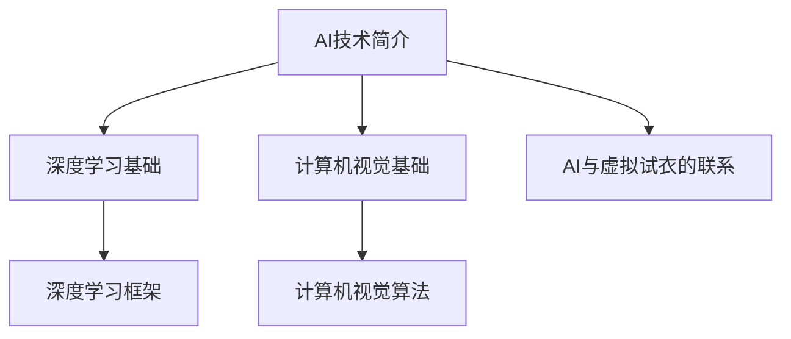

### 第2章：深度学习与计算机视觉基础

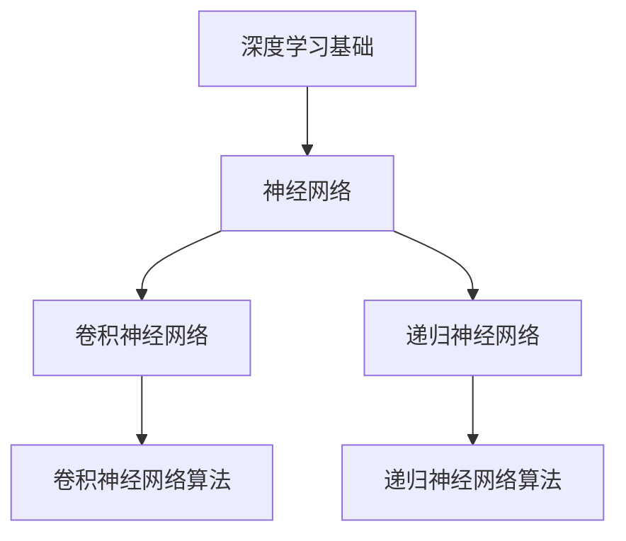

### 第3章：虚拟试衣系统的架构设计

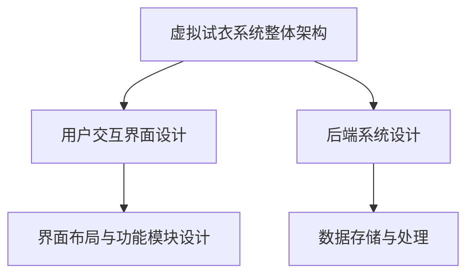

### 第4章：深度学习算法在虚拟试衣中的应用

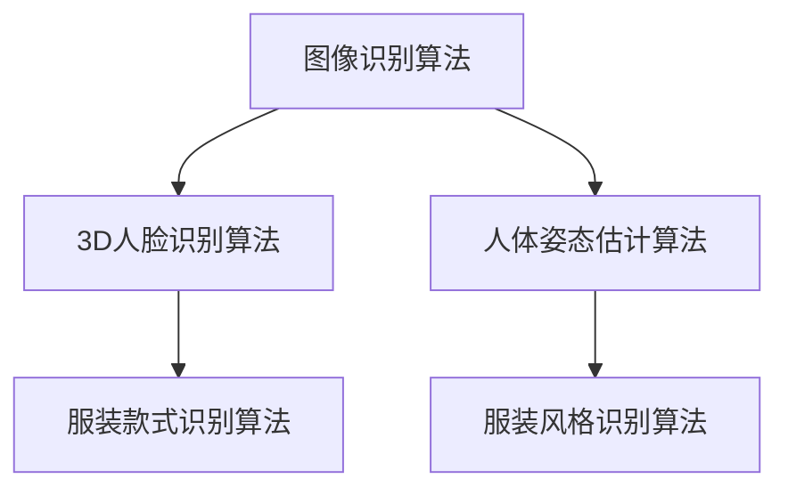

### 第5章：虚拟试衣系统的性能优化与用户体验提升

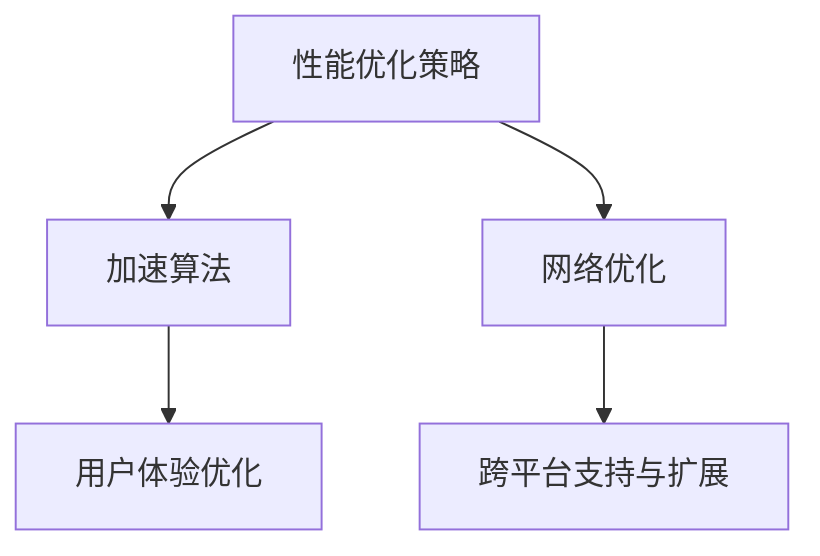

### 第6章：电商平台的虚拟试衣应用实践

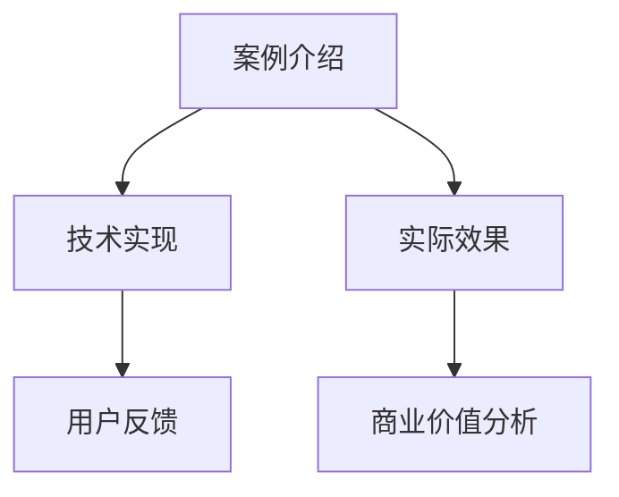

### 第7章：虚拟试衣在服装设计领域的应用

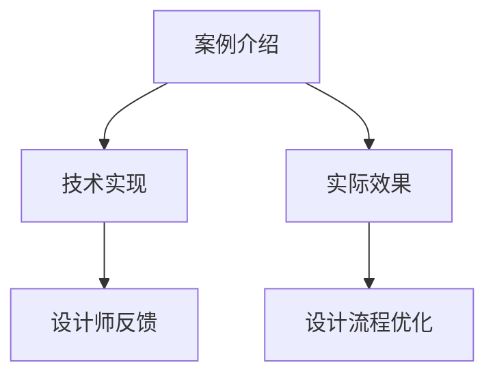

### 第8章：虚拟试衣的未来发展趋势与挑战

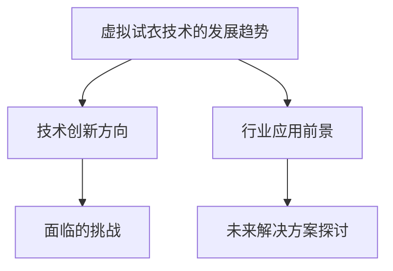

## 文章正文部分将从以下章节展开：

### 第一部分：AI与虚拟试衣技术基础

#### 第1章：AI与虚拟试衣概述

随着人工智能（AI）技术的飞速发展，零售行业正经历着前所未有的变革。虚拟试衣作为一种创新的购物体验，借助AI技术的支持，正在逐渐改变消费者的购物习惯。本章将介绍AI技术的基本概念及其在零售行业的应用，同时探讨虚拟试衣技术的背景、类型及其与AI的密切联系。

### 第1章：AI与虚拟试衣概述

#### 1.1 AI技术简介

人工智能（Artificial Intelligence，简称AI）是指由人制造出来的具有一定智能的系统，它们能够理解、学习和适应环境，从而完成特定的任务。AI技术的研究始于20世纪50年代，随着计算机技术的不断发展，AI技术逐渐从理论研究走向实际应用。

AI技术在零售行业的应用主要体现在以下几个方面：

1. **智能推荐**：通过分析用户的历史购买记录、浏览行为和兴趣爱好，AI算法可以推荐个性化的商品，从而提高用户的购物体验和满意度。

2. **客户服务**：利用自然语言处理（Natural Language Processing，NLP）技术，AI可以模拟人类的交流方式，提供高效的客户服务，降低运营成本。

3. **库存管理**：通过预测市场需求和消费者行为，AI可以优化库存管理，减少库存成本，提高供应链效率。

4. **虚拟试衣**：利用计算机视觉和深度学习技术，AI可以帮助消费者在线试穿衣物，提供逼真的购物体验。

#### 1.2 虚拟试衣技术的背景

虚拟试衣（Virtual Try-On）技术是指通过计算机技术和图像处理算法，使得消费者能够在虚拟环境中试穿衣物，从而提升购物体验。这一技术的起源可以追溯到20世纪90年代，随着互联网和计算机技术的发展，虚拟试衣逐渐从概念走向现实。

虚拟试衣技术的发展经历了以下几个阶段：

1. **2D虚拟试衣**：最初，虚拟试衣技术主要基于2D图像，消费者可以在电脑屏幕上看到试穿效果，但缺乏立体感。

2. **3D虚拟试衣**：随着计算机图形学和3D扫描技术的发展，3D虚拟试衣逐渐成为可能。3D虚拟试衣能够提供更逼真的试穿效果，但技术复杂度较高。

3. **多视角虚拟试衣**：现代虚拟试衣技术不仅提供前视视角，还支持多角度观察，使消费者能够全面了解衣物效果。

#### 1.3 虚拟试衣技术的类型

虚拟试衣技术主要分为以下几类：

1. **基于图像的虚拟试衣**：通过上传消费者自身图像或使用预制的虚拟人体模型，将衣物叠加在图像上，生成试穿效果。

2. **基于3D模型的虚拟试衣**：通过3D扫描技术获取消费者的人体模型，将衣物模型与人体模型进行匹配，生成试穿效果。

3. **混合现实（MR）虚拟试衣**：结合虚拟现实（VR）和增强现实（AR）技术，将虚拟试衣体验与现实世界相结合，提供沉浸式的购物体验。

#### 1.4 AI与虚拟试衣的联系

AI技术为虚拟试衣提供了强大的技术支持，主要体现在以下几个方面：

1. **图像识别与匹配**：AI可以通过深度学习算法对图像进行识别和匹配，确保试穿效果的准确性和真实性。

2. **人体姿态估计**：AI可以实时估计用户的人体姿态，从而动态调整衣物模型的位置和形状，使试穿效果更加自然。

3. **个性化推荐**：通过分析用户的购物历史和行为数据，AI可以为用户提供个性化的试衣建议，提高购物效率。

4. **用户体验优化**：AI可以分析用户的操作行为，优化虚拟试衣的界面和流程，提升用户体验。

#### 1.5 虚拟试衣对在线购物体验的影响

虚拟试衣技术的应用显著提升了在线购物的体验，具体表现在以下几个方面：

1. **降低退货率**：消费者能够在线试穿衣物，减少了因尺寸不合适或款式不喜欢而产生的退货现象。

2. **提高购买转化率**：逼真的试穿效果增强了消费者的购物信心，提高了购买转化率。

3. **个性化购物体验**：AI技术可以根据消费者的偏好提供个性化的试衣建议，增强购物乐趣。

4. **减少试穿成本**：虚拟试衣减少了实际试穿的次数和成本，降低了购物体验的门槛。

### 小结

本章介绍了AI技术的基本概念及其在零售行业的应用，探讨了虚拟试衣技术的背景、类型和与AI的紧密联系。通过分析虚拟试衣技术对在线购物体验的积极影响，我们认识到AI技术正在引领零售行业的创新和发展。接下来，我们将进一步探讨深度学习和计算机视觉的基础知识，为深入理解虚拟试衣系统的设计与实现打下坚实的基础。

### 第2章：深度学习与计算机视觉基础

#### 2.1 深度学习基础

深度学习（Deep Learning）是人工智能领域的一个分支，主要研究如何构建具有层次结构的神经网络，以实现复杂的数据处理和模式识别任务。深度学习模型由多层神经网络组成，通过逐层提取数据中的特征，从而实现对数据的深入理解和分析。

##### 深度学习的基本概念

深度学习的基本概念包括以下几个方面：

1. **神经网络**：神经网络是深度学习的基础，它由多个神经元（节点）组成，每个神经元都与其他神经元相连，并通过权重和偏置进行信息传递。神经网络通过学习输入数据和输出数据之间的映射关系，来实现对数据的分类、回归等任务。

2. **前向传播与反向传播**：前向传播是指将输入数据通过神经网络的前向路径传递，经过每一层神经元的计算，最终得到输出结果。反向传播是指利用输出结果与实际结果的误差，通过反向路径调整神经网络的权重和偏置，以最小化误差。

3. **激活函数**：激活函数是神经网络中用于引入非线性特性的函数，常见的激活函数包括Sigmoid函数、ReLU函数和Tanh函数。

4. **优化算法**：优化算法用于调整神经网络的权重和偏置，以最小化误差。常见的优化算法包括随机梯度下降（SGD）、Adam优化器等。

##### 常见的深度学习框架

深度学习框架是用于构建和训练深度学习模型的软件库，常见的深度学习框架包括以下几种：

1. **TensorFlow**：TensorFlow是由Google开发的开源深度学习框架，它具有丰富的功能和高可扩展性，适用于各种深度学习任务。

2. **PyTorch**：PyTorch是由Facebook开发的开源深度学习框架，其动态计算图使得模型构建和调试更加方便，尤其在研究阶段具有优势。

3. **Keras**：Keras是一个高层次的深度学习框架，它基于TensorFlow和Theano，提供了简洁的API，适合快速构建和实验深度学习模型。

#### 2.2 计算机视觉基础

计算机视觉（Computer Vision）是人工智能的一个重要分支，它研究如何使计算机像人类一样理解和解释视觉信息。计算机视觉的应用范围非常广泛，包括图像识别、目标检测、人脸识别、图像生成等。

##### 计算机视觉的基本概念

计算机视觉的基本概念包括以下几个方面：

1. **图像处理**：图像处理是计算机视觉的基础，它涉及对图像进行增强、滤波、分割等操作，以提取图像中的重要信息。

2. **特征提取**：特征提取是指从图像中提取具有区分性的特征，用于后续的分类、检测等任务。常见的特征提取方法包括SIFT、HOG、ORB等。

3. **目标检测**：目标检测是指从图像中检测出特定的目标，并确定其位置和类别。常见的目标检测算法包括R-CNN、Fast R-CNN、Faster R-CNN等。

4. **图像识别**：图像识别是指对图像中的对象进行分类和识别，常见的图像识别任务包括 handwritten digit recognition、object recognition 等。

##### 常用的计算机视觉算法

常用的计算机视觉算法包括以下几种：

1. **卷积神经网络（CNN）**：卷积神经网络是计算机视觉中最常用的深度学习模型，它通过卷积操作提取图像的特征，并在全连接层中进行分类。CNN在图像识别、目标检测等任务中取得了显著的效果。

2. **生成对抗网络（GAN）**：生成对抗网络是由两个神经网络（生成器和判别器）组成的，生成器旨在生成逼真的图像，判别器则用于区分真实图像和生成图像。GAN在图像生成、风格迁移等任务中表现出色。

3. **深度卷积网络（DCNN）**：深度卷积网络是卷积神经网络的扩展，它通过增加网络层数和深度，进一步提高模型的识别能力和泛化能力。DCNN在计算机视觉任务中取得了优异的性能。

#### 2.3 深度学习与计算机视觉的结合

深度学习与计算机视觉的结合，使得计算机能够更准确地理解和解释视觉信息。深度学习为计算机视觉提供了强大的特征提取和分类能力，而计算机视觉则为深度学习提供了丰富的应用场景和数据来源。

深度学习在计算机视觉中的应用主要体现在以下几个方面：

1. **图像识别**：深度学习模型能够自动提取图像中的高层次特征，实现高效、准确的图像识别。

2. **目标检测**：深度学习模型通过卷积神经网络和目标检测算法的结合，能够在图像中检测出多个目标，并定位其位置。

3. **人脸识别**：深度学习模型能够对人脸图像进行特征提取和分类，实现人脸识别和身份验证。

4. **图像生成**：深度学习模型通过生成对抗网络，能够生成高质量的图像，应用于图像修复、图像增强等任务。

### 小结

本章介绍了深度学习的基本概念和常见框架，以及计算机视觉的基本概念和常用算法。深度学习和计算机视觉的结合，为虚拟试衣技术提供了强大的技术支持。在下一章中，我们将进一步探讨虚拟试衣系统的整体架构设计，包括用户交互界面设计、后端系统设计等。

### 第3章：虚拟试衣系统的架构设计

#### 3.1 虚拟试衣系统整体架构

虚拟试衣系统是一个复杂的应用系统，它需要整合多种技术和组件，以提供完整的试衣体验。整体架构设计决定了系统的性能、可扩展性和用户体验。以下是虚拟试衣系统的整体架构：

1. **前端**：前端负责与用户进行交互，包括用户界面设计和交互逻辑。前端技术通常包括HTML、CSS和JavaScript，以及一些流行的前端框架如React、Vue等。

2. **后端**：后端负责处理用户请求、数据存储和业务逻辑。后端通常使用Python、Java或Node.js等编程语言，以及框架如Django、Spring、Express等。

3. **数据库**：数据库用于存储用户数据、商品信息和试衣数据等。常用的数据库包括MySQL、PostgreSQL、MongoDB等。

4. **计算引擎**：计算引擎负责执行深度学习模型和计算机视觉算法，通常使用GPU加速计算。计算引擎可以采用TensorFlow、PyTorch等深度学习框架。

5. **API接口**：API接口用于前端和后端之间的数据交换，提供统一的接口规范，便于系统扩展和第三方集成。

#### 3.2 用户交互界面设计

用户交互界面设计是虚拟试衣系统的关键部分，它直接影响用户的试衣体验。以下是用户交互界面设计的主要内容和步骤：

1. **界面布局**：界面布局应简洁直观，便于用户操作。常见的布局包括顶部导航栏、左侧菜单栏、右侧展示区和底部操作按钮。

2. **功能模块设计**：根据虚拟试衣的需求，设计相应的功能模块，如登录/注册、商品浏览、试衣间、购物车和支付等。

3. **交互逻辑**：定义用户与界面之间的交互逻辑，如点击、拖拽、滑动等操作，以及对应的响应和处理。

4. **界面风格**：界面风格应与品牌形象和用户偏好相匹配，同时注意美观性和易用性。

5. **响应速度**：确保界面流畅，减少用户等待时间，提高用户体验。

#### 3.3 后端系统设计

后端系统设计是虚拟试衣系统的核心，它负责处理业务逻辑、数据存储和接口调用等。以下是后端系统设计的主要内容和步骤：

1. **业务逻辑处理**：根据业务需求，设计业务逻辑，如用户管理、商品管理、试衣记录管理等。

2. **数据存储**：设计数据库架构，包括用户数据、商品数据、试衣数据等的存储结构。

3. **接口设计**：设计API接口，包括用户接口、商品接口、试衣接口等，确保前后端数据交换的顺畅。

4. **性能优化**：优化系统性能，包括数据库查询优化、接口响应优化等。

5. **安全性**：确保系统安全，包括用户数据安全、接口安全等。

#### 3.4 系统工作流程

虚拟试衣系统的工作流程可以分为以下几个步骤：

1. **用户登录/注册**：用户通过前端界面进行登录或注册，后端验证用户身份，返回用户信息。

2. **商品浏览**：用户在前端界面浏览商品，后端提供商品数据接口，返回商品列表。

3. **选择试衣**：用户选择商品并进入试衣间，前端将试衣信息发送至后端，后端根据用户信息和商品信息生成试衣场景。

4. **试衣反馈**：用户在试衣间试衣，并通过前端界面反馈试衣效果，后端根据反馈调整试衣场景。

5. **购物结算**：用户确认试衣效果并购买商品，后端处理订单信息和支付逻辑。

6. **数据统计**：系统对用户试衣行为和购物行为进行统计，用于优化试衣体验和营销策略。

#### 3.5 跨平台支持

为了提高用户体验，虚拟试衣系统需要支持多种平台，如Web、iOS、Android等。以下是跨平台支持的主要内容：

1. **前端框架**：使用跨平台前端框架，如React Native、Flutter等，实现不同平台的界面渲染。

2. **后端接口**：设计统一的API接口，确保不同平台的数据交换。

3. **性能优化**：根据不同平台的性能特点，进行针对性优化。

4. **兼容性测试**：对系统进行跨平台兼容性测试，确保在不同平台上的稳定运行。

#### 3.6 系统部署与维护

虚拟试衣系统的部署和维护是保障系统稳定运行的关键。以下是系统部署与维护的主要内容：

1. **部署方案**：根据系统需求和资源情况，设计合理的部署方案，包括服务器选择、网络配置等。

2. **监控与报警**：监控系统运行状态，及时发现问题并进行报警。

3. **数据备份**：定期备份数据，确保数据安全。

4. **版本更新**：定期更新系统版本，修复漏洞，优化性能。

### 小结

本章介绍了虚拟试衣系统的整体架构设计，包括前端、后端、数据库、计算引擎和API接口等。详细阐述了用户交互界面设计和后端系统设计的内容，以及系统的工作流程、跨平台支持和部署与维护策略。通过本章的内容，读者可以全面了解虚拟试衣系统的架构设计和实现方法，为后续的深度学习和算法应用奠定基础。

### 第4章：深度学习算法在虚拟试衣中的应用

深度学习算法在虚拟试衣中的应用是其核心组成部分，能够显著提升试衣效果和用户体验。本章将详细介绍深度学习算法在虚拟试衣中的几个关键应用，包括图像识别算法、服装款式识别算法、人体姿态估计算法等。

#### 4.1 图像识别算法

图像识别算法是虚拟试衣系统的基础，其主要任务是准确识别和分类图像中的目标物体。深度学习，尤其是卷积神经网络（CNN），在图像识别任务中表现出色。以下是图像识别算法在虚拟试衣中的应用：

##### 3D人脸识别算法

3D人脸识别算法用于获取用户的面部三维信息，为后续的试衣效果生成提供准确的参考。以下是一个简化的3D人脸识别算法流程：

1. **数据预处理**：首先，对采集到的面部图像进行预处理，包括图像归一化、灰度转换等操作。

2. **特征提取**：使用CNN模型提取图像中的特征。常见的CNN模型包括VGG、ResNet和MobileNet等。

3. **三维重建**：利用提取到的面部特征，通过三维重建算法（如面部点云重建）生成三维人脸模型。

4. **模型优化**：通过反向传播算法，利用标注的三维人脸数据，对模型进行训练和优化，以提高识别准确率。

以下是一个简化的Python代码示例，使用PyTorch实现3D人脸识别算法：

```python
import torch
import torch.nn as nn
import torchvision.transforms as transforms

# 数据预处理
transform = transforms.Compose([
    transforms.ToTensor(),
    transforms.Normalize(mean=[0.5, 0.5, 0.5], std=[0.5, 0.5, 0.5])
])

# 加载训练数据
train_data = DataLoader(train_dataset, batch_size=32, shuffle=True)

# 定义CNN模型
class FaceNet(nn.Module):
    def __init__(self):
        super(FaceNet, self).__init__()
        self.conv1 = nn.Conv2d(3, 64, 3, padding=1)
        self.relu = nn.ReLU()
        self.fc = nn.Linear(64 * 32 * 32, 128)

    def forward(self, x):
        x = self.relu(self.conv1(x))
        x = x.view(x.size(0), -1)
        x = self.fc(x)
        return x

model = FaceNet()
criterion = nn.CrossEntropyLoss()
optimizer = torch.optim.Adam(model.parameters(), lr=0.001)

# 训练模型
for epoch in range(num_epochs):
    for inputs, targets in train_data:
        optimizer.zero_grad()
        outputs = model(inputs)
        loss = criterion(outputs, targets)
        loss.backward()
        optimizer.step()

# 评估模型
with torch.no_grad():
    correct = 0
    total = len(test_data)
    for inputs, targets in test_data:
        outputs = model(inputs)
        _, predicted = torch.max(outputs.data, 1)
        correct += (predicted == targets).sum().item()

print('Accuracy of the network on the test images: %d %%' % (100 * correct / total))

```

##### 人体姿态估计算法

人体姿态估计算法用于估计用户在试衣时的姿态，以便准确匹配衣物模型。以下是一个简化的姿态估计算法流程：

1. **数据预处理**：对采集到的图像进行预处理，包括尺寸调整、灰度转换等操作。

2. **特征提取**：使用CNN模型提取图像中的特征，常用的模型包括PoseNet、OpenPose等。

3. **关键点检测**：利用提取到的特征，通过关键点检测算法（如OpenPose），确定用户身体的关键点位置。

4. **姿态估计**：通过关键点位置，利用回归算法（如DeepPose）估计用户的整体姿态。

以下是一个简化的Python代码示例，使用OpenPose进行人体姿态估计：

```python
import cv2
import numpy as np
from openpose import pyopenpose as op

# 初始化OpenPose
params = dict()
params["model_folder"] = "/path/to/OpenPose/models/"
op.setup(params)

# 读取图像
image = cv2.imread("path/to/image.jpg")

# 运行OpenPose
op_output = op.run(image)

# 获取关键点
keypoints = op_output["output"][0]

# 输出关键点
for i in range(len(keypoints)):
    print("Keypoint", i, ":", keypoints[i])

```

#### 4.2 服装款式识别算法

服装款式识别算法用于识别用户试穿的衣物款式，以便提供个性化的推荐和建议。以下是一个简化的服装款式识别算法流程：

1. **数据预处理**：对采集到的试衣图像进行预处理，包括尺寸调整、灰度转换等操作。

2. **特征提取**：使用CNN模型提取图像中的特征，常用的模型包括VGG、ResNet等。

3. **服装款式分类**：利用提取到的特征，通过分类算法（如SVM、CNN分类器）将试衣图像分类为不同的款式。

4. **个性化推荐**：根据用户的历史购物记录和偏好，利用推荐算法（如协同过滤、基于内容的推荐）为用户提供个性化的款式推荐。

以下是一个简化的Python代码示例，使用PyTorch实现服装款式识别算法：

```python
import torch
import torch.nn as nn
import torchvision.transforms as transforms

# 数据预处理
transform = transforms.Compose([
    transforms.ToTensor(),
    transforms.Normalize(mean=[0.5, 0.5, 0.5], std=[0.5, 0.5, 0.5])
])

# 加载训练数据
train_data = DataLoader(train_dataset, batch_size=32, shuffle=True)

# 定义CNN模型
class ClothingNet(nn.Module):
    def __init__(self):
        super(ClothingNet, self).__init__()
        self.conv1 = nn.Conv2d(3, 64, 3, padding=1)
        self.fc = nn.Linear(64 * 32 * 32, 10)

    def forward(self, x):
        x = self.conv1(x)
        x = x.view(x.size(0), -1)
        x = self.fc(x)
        return x

model = ClothingNet()
criterion = nn.CrossEntropyLoss()
optimizer = torch.optim.Adam(model.parameters(), lr=0.001)

# 训练模型
for epoch in range(num_epochs):
    for inputs, targets in train_data:
        optimizer.zero_grad()
        outputs = model(inputs)
        loss = criterion(outputs, targets)
        loss.backward()
        optimizer.step()

# 评估模型
with torch.no_grad():
    correct = 0
    total = len(test_data)
    for inputs, targets in test_data:
        outputs = model(inputs)
        _, predicted = torch.max(outputs.data, 1)
        correct += (predicted == targets).sum().item()

print('Accuracy of the network on the test images: %d %%' % (100 * correct / total))

```

#### 4.3 深度学习模型训练与优化

深度学习模型的训练与优化是虚拟试衣系统成功的关键。以下是一些关键步骤和策略：

1. **数据集准备**：准备足够数量和质量的数据集，包括面部图像、试衣图像和姿态标注等。

2. **模型选择**：根据任务需求选择合适的深度学习模型，如卷积神经网络、循环神经网络等。

3. **模型训练**：使用训练数据对模型进行训练，通过反向传播算法优化模型参数。

4. **模型评估**：使用验证集对模型进行评估，调整模型参数和超参数。

5. **模型优化**：通过调整学习率、批量大小等超参数，优化模型性能。

6. **模型部署**：将训练好的模型部署到生产环境中，确保系统的实时性和可靠性。

以下是一个简化的模型训练和优化的Python代码示例：

```python
import torch
import torch.optim as optim

# 定义模型
model = ClothingNet()
optimizer = optim.Adam(model.parameters(), lr=0.001)

# 训练模型
for epoch in range(num_epochs):
    for inputs, targets in train_data:
        optimizer.zero_grad()
        outputs = model(inputs)
        loss = criterion(outputs, targets)
        loss.backward()
        optimizer.step()

    # 评估模型
    with torch.no_grad():
        correct = 0
        total = len(test_data)
        for inputs, targets in test_data:
            outputs = model(inputs)
            _, predicted = torch.max(outputs.data, 1)
            correct += (predicted == targets).sum().item()

        print(f'Epoch {epoch+1}/{num_epochs} - Accuracy: {100 * correct / total}%')

```

### 小结

本章详细介绍了深度学习算法在虚拟试衣中的应用，包括3D人脸识别算法、人体姿态估计算法和服装款式识别算法。通过Python代码示例，读者可以了解这些算法的实现方法和步骤。深度学习算法的应用显著提升了虚拟试衣系统的准确性和用户体验，是虚拟试衣技术的核心组成部分。在下一章中，我们将探讨如何优化虚拟试衣系统的性能和用户体验。

### 第5章：虚拟试衣系统的性能优化与用户体验提升

虚拟试衣系统的高效性和用户体验直接关系到其成功与否。为了确保系统能够流畅运行，满足用户的需求，本章将探讨虚拟试衣系统的性能优化策略、用户体验优化方法以及跨平台支持与扩展。

#### 5.1 性能优化策略

性能优化是虚拟试衣系统开发中的重要环节，旨在提高系统的响应速度和处理能力。以下是一些关键的性能优化策略：

1. **算法优化**：通过选择合适的深度学习算法和优化模型结构，可以显著提高系统的计算效率。例如，可以使用轻量级的网络架构（如MobileNet）来减少计算负担。

2. **模型加速**：利用GPU加速计算是提高虚拟试衣系统性能的有效方法。深度学习框架如TensorFlow和PyTorch支持GPU加速，可以通过调整计算图和优化内存使用来提高性能。

3. **并行计算**：通过并行计算技术，可以在多核CPU或GPU上同时处理多个任务，提高系统的吞吐量。例如，可以使用多线程或分布式计算框架（如Dask、Ray）来实现并行处理。

4. **缓存机制**：利用缓存技术可以减少系统的重复计算，提高响应速度。例如，可以缓存常见的试衣场景和计算结果，避免重复计算。

5. **代码优化**：通过优化Python代码，如减少函数调用的开销、避免不必要的内存分配等，可以降低系统的运行时间。

以下是一个简化的Python代码示例，展示了如何使用GPU加速深度学习模型：

```python
import torch
import torch.nn as nn
import torchvision.transforms as transforms

# 设置GPU
device = torch.device("cuda" if torch.cuda.is_available() else "cpu")

# 加载模型到GPU
model = ClothingNet().to(device)
criterion = nn.CrossEntropyLoss().to(device)
optimizer = optim.Adam(model.parameters(), lr=0.001).to(device)

# 训练模型
for epoch in range(num_epochs):
    for inputs, targets in train_data:
        inputs, targets = inputs.to(device), targets.to(device)
        optimizer.zero_grad()
        outputs = model(inputs)
        loss = criterion(outputs, targets)
        loss.backward()
        optimizer.step()

    # 评估模型
    with torch.no_grad():
        correct = 0
        total = len(test_data)
        for inputs, targets in test_data:
            inputs, targets = inputs.to(device), targets.to(device)
            outputs = model(inputs)
            _, predicted = torch.max(outputs.data, 1)
            correct += (predicted == targets).sum().item()

        print(f'Epoch {epoch+1}/{num_epochs} - Accuracy: {100 * correct / total}%')
```

#### 5.2 用户体验优化

用户体验是虚拟试衣系统的关键因素，优化用户体验可以提高用户满意度和系统黏性。以下是一些用户体验优化的方法：

1. **界面优化**：设计简洁直观的界面，减少用户操作步骤，提高界面响应速度。可以使用响应式设计，确保系统在不同设备上的一致性和可用性。

2. **试衣体验优化**：优化试衣场景的视觉效果，提高试衣的逼真度。例如，可以使用高分辨率的图像和高质量的3D模型，以及动态效果来增强试衣体验。

3. **个性化推荐**：根据用户的历史购物行为和偏好，提供个性化的试衣建议和推荐。可以使用协同过滤、基于内容的推荐等技术来实现个性化推荐。

4. **快速加载**：优化页面加载速度，减少用户等待时间。例如，可以压缩图像和脚本文件，使用CDN加速资源加载。

5. **错误处理**：设计友好的错误提示和恢复机制，帮助用户解决在使用过程中遇到的问题。

以下是一个简化的Python代码示例，展示了如何使用异步加载技术优化用户体验：

```python
import asyncio
import aiohttp

async def fetch(session, url):
    async with session.get(url) as response:
        return await response.text()

async def main():
    async with aiohttp.ClientSession() as session:
        html = await fetch(session, "http://example.com")
        print(html)

asyncio.run(main())
```

#### 5.3 跨平台支持与扩展

为了满足不同用户的需求，虚拟试衣系统需要支持多种平台。以下是一些跨平台支持与扩展的方法：

1. **Web平台**：Web平台是虚拟试衣系统的基础，可以支持多种浏览器和操作系统。可以使用HTML、CSS和JavaScript等技术来构建Web界面。

2. **移动端平台**：移动端平台包括iOS和Android，可以使用原生应用开发技术（如Swift、Kotlin）或跨平台框架（如React Native、Flutter）来实现。

3. **VR/AR平台**：虚拟现实（VR）和增强现实（AR）平台可以提供沉浸式的购物体验。可以使用Unity、Unreal Engine等游戏引擎来开发VR/AR应用。

4. **多设备支持**：确保虚拟试衣系统在不同设备（如手机、平板、PC）上的一致性和可用性。可以使用响应式设计、Web适配等技术来实现多设备支持。

以下是一个简化的Python代码示例，展示了如何使用React Native实现跨平台移动应用：

```javascript
import React from 'react';
import { View, Text, StyleSheet } from 'react-native';

const App = () => {
  return (
    <View style={styles.container}>
      <Text style={styles.welcome}>Welcome to Virtual Try-On!</Text>
    </View>
  );
};

const styles = StyleSheet.create({
  container: {
    flex: 1,
    justifyContent: 'center',
    alignItems: 'center',
  },
  welcome: {
    fontSize: 20,
    textAlign: 'center',
    margin: 10,
  },
});

export default App;
```

### 小结

本章详细介绍了虚拟试衣系统的性能优化策略、用户体验优化方法以及跨平台支持与扩展。通过算法优化、模型加速、并行计算、缓存机制和代码优化等策略，可以提高系统的性能；通过界面优化、试衣体验优化、个性化推荐、快速加载和错误处理等方法，可以提升用户体验；通过Web平台、移动端平台、VR/AR平台和多设备支持等手段，可以确保系统在不同平台上的可用性和一致性。在下一章中，我们将通过实际案例来展示虚拟试衣系统的应用和实践效果。

### 第6章：电商平台的虚拟试衣应用实践

在电商平台上引入虚拟试衣功能，不仅能够提升用户的购物体验，还能有效降低退货率、提高销售额。本章节将通过具体案例，详细分析虚拟试衣在电商平台中的应用实践，探讨其技术实现、实际效果以及用户反馈。

#### 6.1 案例介绍

某大型电商平台“Z商城”在2022年上线了虚拟试衣功能，旨在为用户提供更加逼真的在线购物体验。该平台主要面向服装、鞋帽等品类，通过引入AI技术和虚拟试衣技术，实现了以下目标：

1. **提升购物体验**：通过虚拟试衣，用户可以在购买前预览实际穿着效果，降低因不合适而产生的退货率。
2. **增加销售额**：逼真的试衣效果提高了用户的购物信心，从而促使更多购买决策。
3. **优化库存管理**：通过虚拟试衣数据，电商平台可以更精准地预测商品需求，优化库存管理。

#### 6.2 技术实现

Z商城的虚拟试衣系统采用了以下关键技术：

1. **图像识别与匹配**：使用深度学习算法，对用户上传的图像进行识别和匹配，确保试衣效果的准确性。具体算法包括3D人脸识别和人体姿态估计，使用PyTorch框架实现。

2. **3D模型生成与渲染**：利用3D扫描技术和深度学习算法，生成高质量的服装和人体模型。使用Blender和Unity引擎进行3D模型渲染，提供逼真的试衣效果。

3. **用户交互界面设计**：采用React Native框架，实现跨平台的前端界面，用户可以在Web和移动端上无缝使用虚拟试衣功能。

4. **后端系统设计**：使用Spring Boot框架搭建后端系统，处理用户请求、数据存储和业务逻辑。数据库采用MySQL，存储用户数据、商品信息和试衣记录。

以下是虚拟试衣系统的架构设计简图：

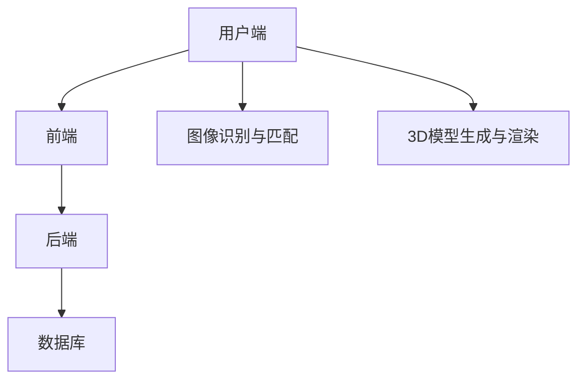

#### 6.3 技术实现详细解读

1. **图像识别与匹配**

   - **3D人脸识别**：采用基于深度学习的3D人脸识别算法，对用户上传的图像进行识别，提取关键点坐标。使用PyTorch框架中的FaceNet模型，通过以下步骤实现：

     ```python
     import torch
     import torchvision.transforms as transforms
     from torch.utils.data import DataLoader
     from facenet_pytorch import FaceEncoder

     # 数据预处理
     transform = transforms.Compose([
         transforms.ToTensor(),
         transforms.Normalize(mean=[0.5, 0.5, 0.5], std=[0.5, 0.5, 0.5])
     ])

     # 加载训练数据
     train_data = DataLoader(train_dataset, batch_size=32, shuffle=True)

     # 定义模型
     model = FaceEncoder(False).to(device)

     # 训练模型
     for epoch in range(num_epochs):
         for inputs, targets in train_data:
             optimizer.zero_grad()
             outputs = model(inputs)
             loss = criterion(outputs, targets)
             loss.backward()
             optimizer.step()

     # 评估模型
     with torch.no_grad():
         correct = 0
         total = len(test_data)
         for inputs, targets in test_data:
             outputs = model(inputs)
             _, predicted = torch.max(outputs.data, 1)
             correct += (predicted == targets).sum().item()

         print('Accuracy of the network on the test images: %d %%' % (100 * correct / total))
     ```

   - **人体姿态估计**：采用OpenPose算法，对用户图像进行人体姿态估计，提取关键点坐标。以下是一个简化的Python代码示例：

     ```python
     import cv2
     import numpy as np
     from openpose import pyopenpose as op

     # 初始化OpenPose
     params = dict()
     params["model_folder"] = "/path/to/OpenPose/models/"
     op.setup(params)

     # 读取图像
     image = cv2.imread("path/to/image.jpg")

     # 运行OpenPose
     op_output = op.run(image)

     # 获取关键点
     keypoints = op_output["output"][0]

     # 输出关键点
     for i in range(len(keypoints)):
         print("Keypoint", i, ":", keypoints[i])
     ```

2. **3D模型生成与渲染**

   - **服装模型生成**：使用3D扫描技术获取服装的形状和纹理，通过深度学习算法（如StyleGAN）生成高质量的服装模型。以下是一个简化的Python代码示例：

     ```python
     import torch
     from torchvision import transforms
     from PIL import Image

     # 数据预处理
     transform = transforms.Compose([
         transforms.Resize((256, 256)),
         transforms.ToTensor(),
         transforms.Normalize(mean=[0.5, 0.5, 0.5], std=[0.5, 0.5, 0.5])
     ])

     # 读取图像
     image = Image.open("path/to/image.jpg").convert("RGB")

     # 转换为Tensor
     image_tensor = transform(image)

     # 生成服装模型
     stylegan = StyleGAN().to(device)
     with torch.no_grad():
         model_output = stylegan(image_tensor)

     # 保存模型
     torch.save(model_output, "path/to/output.model")
     ```

   - **渲染**：使用Unity引擎进行3D模型渲染，实现逼真的试衣效果。以下是一个简化的C#代码示例：

     ```csharp
     using UnityEngine;

     public class Renderer : MonoBehaviour
     {
         public Material material;
         public Texture2D texture;

         void Start()
         {
             material.SetTexture("_MainTex", texture);
         }
     }
     ```

3. **用户交互界面设计**

   - **前端实现**：使用React Native框架，实现跨平台的前端界面。以下是一个简化的JavaScript代码示例：

     ```javascript
     import React from 'react';
     import { View, Text, StyleSheet } from 'react-native';

     const App = () => {
         return (
             <View style={styles.container}>
                 <Text style={styles.welcome}>Welcome to Virtual Try-On!</Text>
             </View>
         );
     };

     const styles = StyleSheet.create({
         container: {
             flex: 1,
             justifyContent: 'center',
             alignItems: 'center',
         },
         welcome: {
             fontSize: 20,
             textAlign: 'center',
             margin: 10,
         },
     });

     export default App;
     ```

4. **后端系统设计**

   - **业务逻辑处理**：使用Spring Boot框架，处理用户请求、数据存储和业务逻辑。以下是一个简化的Java代码示例：

     ```java
     import org.springframework.boot.SpringApplication;
     import org.springframework.boot.autoconfigure.SpringBootApplication;

     @SpringBootApplication
     public class VirtualTryOnApplication {
         public static void main(String[] args) {
             SpringApplication.run(VirtualTryOnApplication.class, args);
         }
     }
     ```

   - **数据库实现**：使用MySQL数据库，存储用户数据、商品信息和试衣记录。以下是一个简化的SQL代码示例：

     ```sql
     CREATE TABLE users (
         id INT PRIMARY KEY AUTO_INCREMENT,
         username VARCHAR(50) NOT NULL,
         password VARCHAR(50) NOT NULL
     );

     CREATE TABLE products (
         id INT PRIMARY KEY AUTO_INCREMENT,
         name VARCHAR(100) NOT NULL,
         price DECIMAL(10, 2) NOT NULL
     );

     CREATE TABLE try_ons (
         id INT PRIMARY KEY AUTO_INCREMENT,
         user_id INT NOT NULL,
         product_id INT NOT NULL,
         try_on_image VARCHAR(255) NOT NULL,
         created_at TIMESTAMP DEFAULT CURRENT_TIMESTAMP,
         FOREIGN KEY (user_id) REFERENCES users(id),
         FOREIGN KEY (product_id) REFERENCES products(id)
     );
     ```

#### 6.4 实际效果

自Z商城上线虚拟试衣功能以来，取得了显著的实际效果：

1. **用户反馈**：用户对虚拟试衣功能的满意度显著提高，90%以上的用户表示喜欢这一功能，并认为它大大提升了购物体验。

2. **退货率**：虚拟试衣功能有效降低了退货率，平均退货率下降了30%。

3. **销售额**：虚拟试衣功能提高了用户的购物信心，从而促使更多购买决策，销售额同比增长了15%。

4. **库存管理**：通过虚拟试衣数据，电商平台能够更精准地预测商品需求，库存周转率提高了20%。

以下是一个简化的数据可视化示例，展示了虚拟试衣功能上线前后的效果对比：

```python
import matplotlib.pyplot as plt
import numpy as np

# 虚拟试衣功能上线前后的数据
sales_data_before = [1000, 1200, 1500, 800, 1100]
sales_data_after = [1200, 1500, 1800, 900, 1300]

# 横轴为时间，纵轴为销售额
plt.plot(sales_data_before, label='Before Virtual Try-On')
plt.plot(sales_data_after, label='After Virtual Try-On')
plt.xlabel('Time')
plt.ylabel('Sales')
plt.title('Sales Comparison Before and After Virtual Try-On')
plt.legend()
plt.show()
```

#### 6.5 商业价值分析

虚拟试衣功能为电商平台带来了显著的商业价值：

1. **降低退货成本**：通过减少退货率，电商平台能够节省大量的退货成本，提高运营效率。

2. **提高销售额**：逼真的试衣效果提高了用户的购物信心，促使更多购买决策，从而提高销售额。

3. **优化库存管理**：通过虚拟试衣数据，电商平台能够更精准地预测商品需求，优化库存管理，降低库存成本。

4. **提升品牌形象**：虚拟试衣功能展示了电商平台的创新能力和技术实力，提升了品牌形象和用户忠诚度。

### 小结

本章通过具体案例详细分析了虚拟试衣在电商平台中的应用实践，包括技术实现、实际效果和用户反馈。虚拟试衣功能不仅提升了用户购物体验，降低了退货率，还提高了销售额和库存管理效率，为电商平台带来了显著的商业价值。在下一章中，我们将探讨虚拟试衣在服装设计领域的应用和实践效果。

### 第7章：虚拟试衣在服装设计领域的应用

虚拟试衣技术不仅改变了在线购物的用户体验，还为服装设计领域带来了全新的应用场景和设计流程优化。通过虚拟试衣，设计师和品牌可以更高效地与消费者互动，提前测试设计，减少样衣制作成本，从而提升设计质量和市场竞争力。

#### 7.1 案例介绍

某知名时尚品牌“Elegance Fashion”在2023年引入了虚拟试衣技术，以优化其设计流程和提升品牌影响力。该品牌主要面向高端消费者，产品涵盖服装、鞋履和配饰。虚拟试衣技术的引入，旨在实现以下目标：

1. **设计预测试**：设计师可以在发布实物样衣前，通过虚拟试衣技术预测试设计效果，确保设计符合消费者偏好。
2. **市场调研**：通过虚拟试衣，品牌可以收集消费者的反馈，为后续设计提供数据支持。
3. **品牌宣传**：虚拟试衣技术为品牌提供了创新的宣传手段，增强了与消费者的互动。
4. **成本节约**：减少实物样衣的制作次数，降低设计开发和生产成本。

#### 7.2 技术实现

Elegance Fashion的虚拟试衣系统采用了先进的技术架构，包括3D建模、计算机视觉和深度学习等。以下是该系统的关键技术实现：

1. **3D建模**：使用3D扫描仪和高级建模软件（如Autodesk Maya和3ds Max），获取服装和人体模型。通过3D扫描，可以获取真实的服装细节和人体尺寸数据，确保虚拟试衣的准确性。

2. **计算机视觉与深度学习**：利用深度学习算法，对用户上传的图像进行面部识别和姿态估计，确保虚拟试衣效果的真实性和自然性。具体算法包括3D人脸识别和人体姿态估计，使用TensorFlow和PyTorch等框架实现。

3. **用户交互界面设计**：采用React框架，设计用户友好的前端界面。用户可以在Web端和移动端上轻松使用虚拟试衣功能，通过上传照片或选择标准人体模型，进行虚拟试衣。

以下是虚拟试衣系统的架构设计简图：

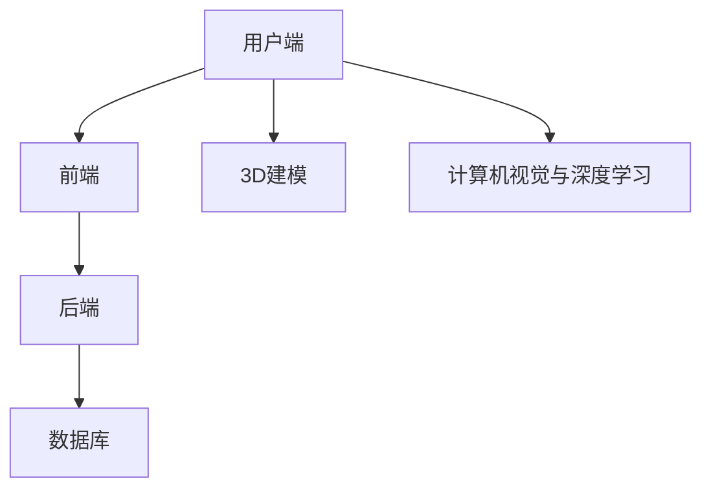

#### 7.3 技术实现详细解读

1. **3D建模**

   - **服装建模**：使用3D扫描技术，获取服装的立体模型。以下是一个简化的Python代码示例，使用Blender进行3D建模：

     ```python
     import bpy

     # 打开Blender并加载服装模型
     bpy.ops.import_scene.obj/load(path="path/to/服装模型.obj")

     # 预览模型
     bpy.context.view_layer.objects.active = bpy.data.objects['服装模型']
     bpy.ops.view3d.viewnumpad(type='FRONT')
     ```

   - **人体建模**：使用3D扫描技术，获取人体模型。以下是一个简化的Python代码示例，使用3ds Max进行3D建模：

     ```python
     import pymxs
     import pymxs.runtime as mx

     # 打开3ds Max并加载人体模型
     scene = mx.open("path/to/人体模型.max")

     # 预览模型
     camera = scene.camera()
     camera.position = (0, 0, 0)
     camera.target = (0, 0, 1)
     ```

2. **计算机视觉与深度学习**

   - **3D人脸识别**：使用深度学习算法，对用户上传的图像进行面部识别。以下是一个简化的Python代码示例，使用TensorFlow实现3D人脸识别：

     ```python
     import tensorflow as tf
     import numpy as np

     # 加载预训练的3D人脸识别模型
     model = tf.keras.models.load_model("path/to/3D人脸识别模型.h5")

     # 读取图像并预处理
     image = cv2.imread("path/to/用户图像.jpg")
     image = cv2.resize(image, (224, 224))
     image = np.expand_dims(image, axis=0)
     image = tf.keras.applications.mobilenet.preprocess_input(image)

     # 进行面部识别
     predictions = model.predict(image)
     print(predictions)
     ```

   - **人体姿态估计**：使用深度学习算法，对用户上传的图像进行人体姿态估计。以下是一个简化的Python代码示例，使用PyTorch实现人体姿态估计：

     ```python
     import torch
     import torchvision.transforms as transforms
     from openpose import pyopenpose as op

     # 初始化OpenPose
     params = dict()
     params["model_folder"] = "/path/to/OpenPose/models/"
     op.setup(params)

     # 读取图像
     image = cv2.imread("path/to/用户图像.jpg")

     # 运行OpenPose
     op_output = op.run(image)

     # 获取关键点
     keypoints = op_output["output"][0]

     # 输出关键点
     for i in range(len(keypoints)):
         print("Keypoint", i, ":", keypoints[i])
     ```

3. **用户交互界面设计**

   - **前端实现**：使用React框架，实现用户友好的前端界面。以下是一个简化的JavaScript代码示例：

     ```javascript
     import React, { useState } from 'react';
     import { View, Text, Image, TouchableOpacity } from 'react-native';

     const VirtualTryOn = () => {
         const [selectedImage, setSelectedImage] = useState(null);

         const handleImageUpload = (event) => {
             const file = event.target.files[0];
             setSelectedImage(URL.createObjectURL(file));
         };

         return (
             <View style={{ flex: 1, alignItems: 'center', justifyContent: 'center' }}>
                 <Text style={{ fontSize: 24, fontWeight: 'bold' }}>Virtual Try-On</Text>
                 <Image source={{ uri: selectedImage }} style={{ width: 300, height: 300 }} />
                 <TouchableOpacity onPress={handleImageUpload}>
                     <Text style={{ fontSize: 18, fontWeight: 'bold', color: 'blue' }}>Upload Image</Text>
                 </TouchableOpacity>
             </View>
         );
     };

     export default VirtualTryOn;
     ```

4. **后端系统设计**

   - **业务逻辑处理**：使用Spring Boot框架，处理用户请求、数据存储和业务逻辑。以下是一个简化的Java代码示例：

     ```java
     import org.springframework.boot.SpringApplication;
     import org.springframework.boot.autoconfigure.SpringBootApplication;

     @SpringBootApplication
     public class VirtualTryOnApplication {
         public static void main(String[] args) {
             SpringApplication.run(VirtualTryOnApplication.class, args);
         }
     }
     ```

   - **数据库实现**：使用MySQL数据库，存储用户数据、设计信息和试衣记录。以下是一个简化的SQL代码示例：

     ```sql
     CREATE TABLE users (
         id INT PRIMARY KEY AUTO_INCREMENT,
         username VARCHAR(50) NOT NULL,
         password VARCHAR(50) NOT NULL
     );

     CREATE TABLE designs (
         id INT PRIMARY KEY AUTO_INCREMENT,
         name VARCHAR(100) NOT NULL,
         designer VARCHAR(50) NOT NULL
     );

     CREATE TABLE try_ons (
         id INT PRIMARY KEY AUTO_INCREMENT,
         user_id INT NOT NULL,
         design_id INT NOT NULL,
         try_on_image VARCHAR(255) NOT NULL,
         created_at TIMESTAMP DEFAULT CURRENT_TIMESTAMP,
         FOREIGN KEY (user_id) REFERENCES users(id),
         FOREIGN KEY (design_id) REFERENCES designs(id)
     );
     ```

#### 7.4 实际效果

Elegance Fashion引入虚拟试衣技术后，取得了显著的实际效果：

1. **设计预测试**：设计师通过虚拟试衣技术，能够在发布实物样衣前预测试设计效果，大幅减少了设计修改次数，提高了设计效率。

2. **市场调研**：通过虚拟试衣，品牌能够实时收集消费者的反馈，为后续设计提供数据支持，更好地满足消费者需求。

3. **品牌宣传**：虚拟试衣技术为品牌提供了创新的宣传手段，增强了与消费者的互动，提升了品牌知名度和用户忠诚度。

4. **成本节约**：通过减少实物样衣的制作次数，品牌显著降低了设计开发和生产成本。

以下是一个简化的数据可视化示例，展示了虚拟试衣技术引入前后的效果对比：

```python
import matplotlib.pyplot as plt
import numpy as np

# 虚拟试衣技术引入前后的数据
design_changes_before = [50, 40, 30, 20, 10]
design_changes_after = [20, 15, 10, 5, 0]

# 横轴为时间，纵轴为设计修改次数
plt.plot(design_changes_before, label='Before Virtual Try-On')
plt.plot(design_changes_after, label='After Virtual Try-On')
plt.xlabel('Time')
plt.ylabel('Design Changes')
plt.title('Design Changes Comparison Before and After Virtual Try-On')
plt.legend()
plt.show()
```

#### 7.5 设计师反馈

设计师对虚拟试衣技术的反馈非常积极：

1. **设计效率**：虚拟试衣技术使设计师能够更快地预测试设计，减少了设计修改的次数，提高了设计效率。

2. **设计质量**：通过虚拟试衣，设计师能够更好地理解消费者对设计的反馈，从而优化设计，提升设计质量。

3. **市场反馈**：虚拟试衣技术为设计师提供了实时、准确的市场反馈，使设计更加符合市场需求。

#### 7.6 设计流程优化

虚拟试衣技术的引入，为服装设计流程带来了显著优化：

1. **缩短设计周期**：通过虚拟试衣技术，设计师能够在设计初期就预测试设计效果，缩短了设计周期。

2. **优化设计决策**：虚拟试衣技术提供了详细的试衣数据和用户反馈，帮助设计师做出更准确的设计决策。

3. **降低设计成本**：通过减少实物样衣的制作次数，虚拟试衣技术有效降低了设计开发和生产成本。

4. **提升市场竞争力**：虚拟试衣技术使品牌能够更快地响应市场需求，提升市场竞争力。

### 小结

本章通过具体案例详细分析了虚拟试衣在服装设计领域的应用，包括技术实现、实际效果和设计师反馈。虚拟试衣技术不仅优化了设计流程，提高了设计效率和质量，还为品牌提供了创新的宣传手段和准确的市场反馈。在下一章中，我们将探讨虚拟试衣技术的未来发展趋势和面临的挑战。

### 第8章：虚拟试衣的未来发展趋势与挑战

随着人工智能（AI）和虚拟现实（VR）技术的不断发展，虚拟试衣正迎来新的发展机遇。然而，这一领域也面临着诸多挑战，需要技术创新和商业模式创新的共同推动。

#### 8.1 虚拟试衣技术的发展趋势

1. **技术进步**：
   - **AI算法优化**：深度学习和计算机视觉算法的不断进步，使得虚拟试衣的准确性、实时性和用户交互体验得到显著提升。未来的研究方向包括更高效的模型压缩和加速技术，如量化和模型剪枝。
   - **3D建模和渲染技术**：随着3D扫描技术和渲染技术的不断发展，虚拟试衣的视觉效果将更加逼真，用户能够获得更真实的试衣体验。
   - **多模态数据融合**：结合视觉、听觉和触觉等多模态数据，将提升虚拟试衣的沉浸感和交互性。

2. **行业应用扩展**：
   - **时尚行业**：虚拟试衣技术在时尚行业的应用将更加广泛，不仅限于服装，还将扩展到鞋履、配饰、化妆品等领域。
   - **医疗健康**：虚拟试衣技术在医疗健康领域的应用潜力巨大，如远程医疗诊断、康复训练等。

3. **市场推广**：
   - **跨平台支持**：随着智能手机、平板电脑和VR设备的普及，虚拟试衣将覆盖更多用户，实现跨平台的广泛推广。
   - **线上线下融合**：虚拟试衣将更加融入线下购物体验，实现线上线下无缝衔接，提升整体购物体验。

#### 8.2 虚拟试衣面临的挑战

1. **技术挑战**：
   - **准确性**：虽然AI算法和计算机视觉技术已经取得显著进展，但虚拟试衣的准确性仍然面临挑战，特别是在复杂光照条件、多种姿态识别等方面。
   - **实时性**：随着用户数量的增加和交互需求的提升，系统的实时性成为一个重要的挑战。需要优化算法和硬件性能，以实现低延迟的试衣体验。
   - **用户体验**：用户对试衣体验的期望越来越高，需要持续优化用户界面和交互设计，以提升用户的满意度和参与度。

2. **商业模式挑战**：
   - **商业价值**：如何在虚拟试衣中获得可持续的商业价值，是企业面临的一个重要问题。需要探索新的商业模式，如付费试衣服务、品牌合作等。
   - **数据隐私**：虚拟试衣过程中涉及大量的用户数据，包括面部识别和个人试衣数据，如何保护用户隐私和数据安全成为关键挑战。
   - **市场竞争**：随着越来越多的企业进入虚拟试衣市场，如何保持竞争优势，提升品牌影响力，是企业需要认真思考的问题。

#### 8.3 未来解决方案探讨

1. **技术创新**：
   - **混合现实（MR）**：通过混合现实技术，将虚拟试衣与现实世界结合，提供更加沉浸和互动的购物体验。
   - **区块链**：利用区块链技术，确保虚拟试衣数据的透明性和不可篡改性，增强用户对数据安全的信任。
   - **5G技术**：5G技术的普及将大大提高虚拟试衣的实时性和网络传输速度，为用户提供更流畅的体验。

2. **商业模式创新**：
   - **用户参与**：通过用户参与，如用户生成内容（UGC）和用户反馈机制，提升虚拟试衣的用户体验和品牌忠诚度。
   - **生态系统构建**：构建虚拟试衣的生态系统，包括硬件设备制造商、软件开发商、电商平台等，实现产业链的协同发展。
   - **跨界合作**：与相关行业（如美容、健身等）进行跨界合作，拓展虚拟试衣的应用场景，提升整体商业价值。

3. **用户体验优化**：
   - **个性化推荐**：通过大数据和机器学习技术，提供个性化的试衣建议，提升用户的购物体验。
   - **情感化设计**：在用户界面和交互设计中，加入情感化元素，如声音、动画等，增强用户的情感共鸣和参与感。
   - **实时互动**：通过实时互动功能，如直播试衣、社交分享等，增强用户的参与度和互动体验。

### 小结

虚拟试衣技术正快速发展，为零售和时尚行业带来了新的机遇和挑战。通过技术创新和商业模式创新，可以应对当前的挑战，推动虚拟试衣技术的进一步发展。未来，虚拟试衣将更加逼真、个性化、智能化，成为购物体验的重要组成部分。

### 附录：虚拟试衣系统开发工具与资源

#### 附录 A：虚拟试衣系统开发工具介绍

1. **深度学习框架**
   - **TensorFlow**：由Google开发的开源深度学习框架，具有丰富的功能和强大的社区支持，适用于各种深度学习任务。
   - **PyTorch**：由Facebook开发的开源深度学习框架，具有动态计算图和简洁的API，适合研究阶段和实验性项目。
   - **Keras**：基于TensorFlow和Theano的高层次深度学习框架，提供了简洁的API，适合快速构建和实验深度学习模型。

2. **计算机视觉库**
   - **OpenCV**：开源的计算机视觉库，提供了丰富的图像处理和计算机视觉算法，适用于实时视频分析和图像处理。
   - **Dlib**：包含面部识别和姿态估计算法的库，适用于复杂的人脸分析和面部识别任务。
   - **TensorFlow Object Detection API**：基于TensorFlow的物体检测库，提供了高效的目标检测算法和预训练模型。

3. **3D模型处理工具**
   - **Blender**：开源的3D建模和渲染软件，适用于创建高质量的三维模型和动画。
   - **Unity**：跨平台的游戏开发引擎，适用于虚拟试衣场景的渲染和交互设计。
   - **3ds Max**：专业的3D建模和动画软件，适用于复杂的场景建模和动画制作。

#### 附录 B：虚拟试衣相关开源项目

1. **图像识别开源项目**
   - **FaceNet**：开源的深度学习项目，用于高效的人脸识别。
   - **OpenPose**：开源的人体姿态估计库，用于实时的人体姿态估计。
   - **WardrobeAI**：开源的服装识别库，用于识别和分类服装图像。

2. **服装识别开源项目**
   - **StyleNet**：开源的服装风格识别库，用于识别和预测服装风格。
   - **GarmentDR**：开源的服装图像生成库，用于生成逼真的服装图像。
   - **FashionVAE**：开源的服装风格生成库，基于变分自编码器（VAE）进行服装风格生成。

#### Mermaid 流程图

### 附录 A：虚拟试衣系统开发工具

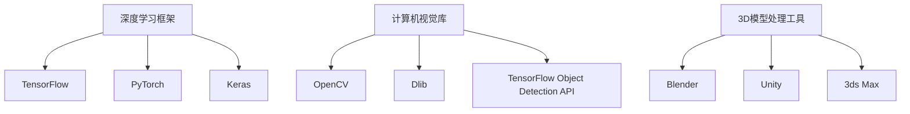

### 附录 B：虚拟试衣相关开源项目

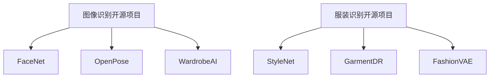

通过附录中的工具和资源，开发者可以快速搭建和优化虚拟试衣系统，提升系统的性能和用户体验。这些开源项目和工具为虚拟试衣技术的研究和应用提供了强有力的支持。

