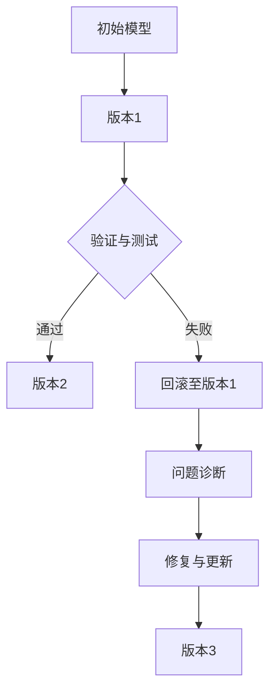

                 

### 1.1 AI模型版本控制的重要性

在人工智能（AI）领域，模型版本控制的重要性日益凸显。随着AI技术的迅猛发展，模型变得越来越复杂，迭代速度不断加快，版本控制成为管理这些模型的重要工具。有效的版本控制不仅能确保模型开发的连续性和可追溯性，还能在模型开发过程中提供强大的支持。

首先，版本控制有助于跟踪模型的演变历程。在AI模型开发中，每一次迭代都可能带来代码、数据集和算法上的重大变化。通过版本控制工具，开发者可以记录下每一次的修改和更新，形成详细的版本历史记录。这使得在模型开发过程中，能够方便地回溯到任意一个历史版本，了解模型的演变过程，为问题的定位和解决提供有力支持。

其次，版本控制能够确保代码的稳定性。在团队协作开发过程中，多个开发人员可能会同时进行修改和更新。如果没有良好的版本控制，容易导致代码冲突和混乱，影响项目的进展。版本控制系统能够自动检测和解决这些冲突，确保代码库的整洁和一致性。

最后，版本控制有助于提高团队的协作效率。在大型AI项目中，团队协作是至关重要的。通过版本控制工具，团队成员可以同时访问和修改代码，实现并行开发。此外，版本控制系统还提供了权限管理功能，确保只有授权人员能够进行关键操作，从而保证项目的安全性和可控性。

总的来说，AI模型版本控制是管理迭代过程的有效工具，它不仅能确保模型开发过程中的稳定性和可追溯性，还能提高团队的协作效率和代码质量。

#### Mermaid流程图



#### 核心概念与联系

- **版本控制（Version Control）**：一种管理文档、代码等文件更改的系统，用于跟踪版本历史、避免冲突和确保代码一致性。
- **模型迭代（Model Iteration）**：AI模型开发过程中，通过不断优化和更新模型以改进其性能和功能。
- **版本历史（Version History）**：记录模型每次迭代时修改的详细信息，包括代码、数据集、算法等。

这些概念相互联系，共同构成了AI模型版本控制的核心。版本控制确保了模型迭代的可追踪性和稳定性，而版本历史则为模型迭代提供了详细的记录，帮助开发者和管理者更好地理解模型的演变过程。

#### 核心算法原理讲解

```python
# 版本控制算法示例

class VersionControlSystem:
    def __init__(self):
        self.versions = []  # 存储版本列表
        self.current_version = 0  # 当前版本

    def create_version(self, changes):
        """
        创建新版本，记录变更细节
        :param changes: 变更细节
        """
        self.current_version += 1
        self.versions.append({
            'version': self.current_version,
            'changes': changes,
            'timestamp': datetime.now()
        })

    def get_latest_version(self):
        """
        获取最新版本模型
        :return: 最新版本模型信息
        """
        return self.versions[-1]

    def rollback(self, version_number):
        """
        回滚到指定版本
        :param version_number: 指定版本号
        """
        if version_number > 0 and version_number <= len(self.versions):
            self.current_version = version_number
        else:
            print("无效的版本号")

# 使用示例
vcs = VersionControlSystem()
vcs.create_version("添加了新特征")
vcs.create_version("优化了算法")
print(vcs.get_latest_version())  # 输出最新版本模型信息
vcs.rollback(1)  # 回滚到版本1
print(vcs.get_latest_version())  # 输出回滚后的版本模型信息
```

在上面的示例中，`VersionControlSystem` 类用于管理版本和控制模型的迭代。它提供了创建新版本、获取最新版本和回滚到指定版本的功能。每次创建新版本时，都会记录变更细节和当前时间戳，确保版本历史的完整性和准确性。

#### 数学模型与公式

在版本控制中，可以使用以下数学模型和公式来描述版本状态和变更：

- **状态转移方程**：
  $$ S_t = S_{t-1} + \Delta S_t $$
  其中，\( S_t \) 表示第 \( t \) 次迭代的模型状态，\( S_{t-1} \) 表示第 \( t-1 \) 次迭代的模型状态，\( \Delta S_t \) 表示第 \( t \) 次迭代的变更。

- **版本差异度量**：
  $$ D(v_i, v_j) = \sum_{k=1}^{n} |f_k(v_i) - f_k(v_j)| $$
  其中，\( v_i \) 和 \( v_j \) 分别表示两个不同版本，\( f_k \) 表示第 \( k \) 个特征函数，\( n \) 表示特征函数的总数。

这些公式可以帮助我们量化模型版本之间的差异，从而更好地理解模型的迭代过程和版本历史。

#### 核心概念与联系

- **版本控制（Version Control）**：确保代码和模型变更的可追溯性和一致性。
- **模型迭代（Model Iteration）**：通过不断更新和优化模型来提升性能。
- **版本历史（Version History）**：记录每次迭代的详细信息和变更日志。

这些概念相互关联，共同构成了AI模型版本控制的核心。版本控制工具帮助开发者管理模型迭代，确保代码和数据的稳定性，而版本历史则提供了模型演变过程的详细记录，为问题的定位和解决提供了有力支持。

#### 核心算法原理讲解

```python
# 示例：使用Git进行版本控制

# 安装Git
!pip install gitpython

# 导入所需库
from git import Repo

# 初始化Git仓库
repo = Repo.init('/path/to/your/repository')

# 添加文件到暂存区
repo.index.add(['your_file.py'])

# 提交变更
repo.index.commit('Initial commit')

# 查看版本历史
for commit in repo.iter_commits():
    print(commit)

# 创建分支
repo.create_head('feature/branch')

# 切换到新分支
repo.heads['feature/branch'].checkout()

# 在分支上修改文件并提交
repo.index.add(['your_file.py'])
repo.index.commit('Modify file in feature branch')

# 合并分支
repo.git.merge('main')

# 删除分支
repo.git.branch('-d feature/branch')
```

在这个示例中，我们使用了Python的`gitpython`库来操作Git版本控制系统。首先初始化Git仓库，然后将文件添加到暂存区并进行提交。接着，我们创建并切换到一个新分支，进行文件修改并提交。最后，我们将分支合并回主分支，并删除分支。

通过这个示例，我们可以看到如何使用Git来管理代码的版本，包括分支创建、切换、合并和删除等操作。

#### 数学模型与公式

在版本控制中，常用的数学模型和公式包括：

- **哈希函数**：用于生成文件唯一标识符，例如SHA-256。
  $$ H(f) = \text{SHA-256}(f) $$
  其中，\( H \) 表示哈希函数，\( f \) 表示文件内容。

- **版本差异度量**：用于计算两个版本之间的差异。
  $$ D(v_i, v_j) = \sum_{k=1}^{n} |f_k(v_i) - f_k(v_j)| $$
  其中，\( D \) 表示差异度量，\( v_i \) 和 \( v_j \) 表示两个版本，\( f_k \) 表示第 \( k \) 个特征或文件。

这些数学模型和公式在版本控制中起着关键作用，确保代码和模型的一致性和可追溯性。

#### 实战案例分析

**案例一：AI模型迭代与版本控制**

在一个大型AI项目中，团队使用Git进行版本控制。项目开始时，主分支（`main`）保持稳定，用于集成新功能和修复bug。团队创建了一个名为`feature/segmentation`的分支来开发新的分割算法。

在开发过程中，团队成员A和B分别进行了多项修改和优化。每次修改后，他们都使用`git add`和`git commit`命令记录变更。

```bash
git add your_file.py
git commit -m "Implement new segmentation algorithm"
```

一段时间后，团队成员C发现算法在某些数据集上表现不佳。他们决定回滚到上一个稳定版本（`version 1.0`），并重新开始优化。

```bash
git checkout version1.0
```

通过版本历史，团队能够清晰地看到每个版本的变更记录和贡献者，这有助于问题的定位和解决。

**代码解读与分析：**

```python
# 分支创建
repo.create_head('feature/segmentation')

# 切换到新分支
repo.heads['feature/segmentation'].checkout()

# 提交变更
repo.index.add(['your_file.py'])
repo.index.commit('Implement new segmentation algorithm')

# 回滚到稳定版本
repo.git.reset('--hard', 'version1.0')

# 继续优化
repo.index.add(['your_file.py'])
repo.index.commit('Optimize segmentation algorithm')
```

在这个案例中，Git版本控制系统帮助团队高效地管理了模型迭代过程，确保了代码的稳定性和可追溯性。

#### 最佳实践 Tips

1. **定期备份**：定期备份模型和代码，以防止数据丢失。
2. **统一命名规范**：使用统一的命名规范，便于版本管理和追踪。
3. **详细记录变更**：每次提交时，详细记录变更内容和原因。
4. **定期审查**：定期审查版本历史，确保代码库的整洁和一致性。

#### 小结

AI模型版本控制是确保模型迭代过程顺利进行的关键工具。通过使用版本控制工具，开发者可以更好地管理代码和模型的变更，提高协作效率，确保代码的稳定性和可追溯性。在未来的工作中，我们应该重视版本控制，充分利用其优势，为AI项目的发展奠定坚实基础。

### 附录：AI模型版本控制工具列表

#### 附录 A 工具列表

- **Git**：开源分布式版本控制系统，广泛用于代码和模型的版本管理。
- **GitHub**：基于Git的在线协作平台，提供代码托管和版本控制功能。
- **GitLab**：开源软件，类似于GitHub，用于内部团队代码管理和协作。
- **Mercurial**：另一种分布式版本控制系统，与Git类似，但使用Python编写。
- **Subversion（SVN）**：集中式版本控制系统，历史悠久，但逐渐被Git取代。

#### 使用指南和资源链接

- **Git官方文档**：[https://git-scm.com/docs](https://git-scm.com/docs)
- **GitHub教程**：[https://docs.github.com/en/get-started/quick-start](https://docs.github.com/en/get-started/quick-start)
- **GitLab教程**：[https://docs.gitlab.com/ee/user/project/gitlab_flow/](https://docs.gitlab.com/ee/user/project/gitlab_flow/)
- **Mercurial官方文档**：[https://www.mercurial-scm.org/wiki](https://www.mercurial-scm.org/wiki)
- **Subversion官方文档**：[https://subversion.tigris.org/](https://subversion.tigris.org/)

这些资源提供了详细的版本控制工具的使用指南，有助于开发者更好地掌握和使用这些工具。

---

### 总结与回顾

本文详细探讨了AI模型版本控制的重要性及其在模型开发过程中的应用。我们介绍了版本控制的基本概念、核心算法原理，并通过Python示例代码展示了如何使用Git进行版本控制。同时，通过实际案例分析了AI模型迭代与版本控制的最佳实践。总结如下：

1. **版本控制的重要性**：版本控制确保了模型迭代过程中的代码和数据的稳定性和可追溯性，是AI模型开发不可或缺的工具。
2. **核心算法原理**：我们通过Python代码示例展示了如何实现版本控制的基本功能，包括创建版本、回滚版本和查看版本历史。
3. **最佳实践**：在实战案例中，我们分析了如何使用Git管理AI模型的迭代过程，并提供了有效的版本管理策略。

通过本文，读者可以更好地理解AI模型版本控制的基本原理和应用方法，为今后的AI项目开发奠定坚实基础。

### 展望未来

在未来，AI模型版本控制技术将继续发展，为模型开发带来更多创新和便利。以下是几个可能的趋势和方向：

1. **智能版本控制**：随着AI技术的发展，版本控制系统可能会集成更多的智能功能，如自动检测和修复代码冲突、预测模型变更趋势等，进一步提高开发效率。

2. **分布式版本控制**：随着区块链技术的兴起，分布式版本控制系统可能成为主流，提供更安全、更去中心化的版本管理解决方案。

3. **模型版本可视化**：为了更好地理解模型的演变过程，版本控制系统可能会引入可视化工具，帮助开发者直观地查看版本历史、模型差异和变更详情。

4. **集成更多AI模型特性**：版本控制系统可能会支持直接管理模型的训练数据和超参数，使得版本控制不仅局限于代码，还包括模型的全生命周期管理。

5. **跨平台兼容性**：未来版本控制系统可能会更加兼容不同编程语言和平台，提供统一的版本管理接口，便于团队协作和代码共享。

通过这些发展方向，AI模型版本控制将变得更加智能、高效和灵活，为AI项目的成功实施提供更强有力的支持。开发者和团队应密切关注这些趋势，积极采用新技术，以提高模型开发的效率和质量。

