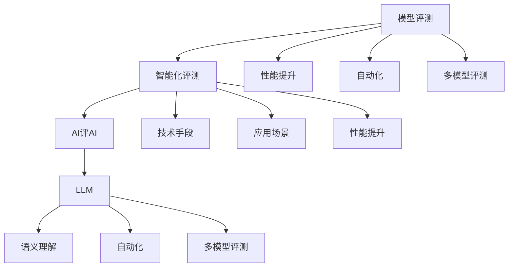

                 

### 引言

#### AI评AI：背景和意义

在人工智能（AI）快速发展的今天，模型评测（Model Evaluation）已经成为一个至关重要的环节。模型评测不仅关乎AI系统的性能和可靠性，也直接影响着应用场景的决策质量。传统的模型评测方法依赖于统计数据和手工分析，存在效率低、主观性强等不足。随着深度学习模型复杂度的增加，传统的评测方法已无法满足日益增长的需求。

AI评AI（AI Evaluating AI）的概念正是在这样的背景下提出的。它旨在利用先进的语言模型（LLM）构建智能化模型评测平台，实现自动化、高效、准确的模型评测。这种智能化评测方法不仅能够提高评测效率，还能提供更加客观、全面的评测结果，从而提升AI系统的整体性能。

#### LLM在模型评测中的应用

语言模型（Language Model，LLM）是一类基于神经网络的语言处理模型，能够理解和生成自然语言。近年来，LLM在自然语言处理（NLP）领域取得了显著的进展，并在文本生成、机器翻译、情感分析等方面取得了优异的性能。LLM的应用不仅改变了传统数据处理方式，也为模型评测带来了全新的可能性。

首先，LLM可以通过对大量文本数据的学习，获取丰富的语义信息，从而提高评测的准确性和全面性。例如，在文本分类任务中，传统的评测方法依赖于精确匹配和关键词提取，而LLM可以捕捉到文本中的深层语义信息，提供更细致的分类结果。

其次，LLM能够实现自动化评测，减少人工干预。传统的评测方法通常需要专业人员进行数据预处理、特征提取和结果分析，而LLM可以自动完成这些步骤，提高评测的效率。

最后，LLM还可以进行多模型评测，提供全面的性能分析。通过学习不同模型的输出结果，LLM能够评估各个模型的优势和劣势，为模型优化和改进提供有力支持。

### 文章关键词

- AI评AI
- 模型评测
- 语言模型（LLM）
- 智能化评测
- 自动化评测
- 多模型评测

### 文章摘要

本文探讨了利用语言模型（LLM）构建智能化模型评测平台的原理和实现方法。首先介绍了AI评AI的背景和意义，以及LLM在模型评测中的应用。随后，详细阐述了LLM的核心概念、技术原理和架构，以及其在模型评测中的具体应用。文章还介绍了智能化模型评测方法和多模型评测策略，并通过实际项目案例展示了如何构建智能化模型评测平台。最后，文章总结了全文的主要内容和展望了AI评AI的发展趋势。本文旨在为读者提供一个全面、深入的AI模型评测解决方案。

----------------------------------------------------------------

# AI评AI：利用LLM构建智能化模型评测平台

关键词：AI评AI、模型评测、语言模型（LLM）、智能化评测、自动化评测、多模型评测

摘要：本文探讨了利用语言模型（LLM）构建智能化模型评测平台的原理和实现方法。首先介绍了AI评AI的背景和意义，以及LLM在模型评测中的应用。随后，详细阐述了LLM的核心概念、技术原理和架构，以及其在模型评测中的具体应用。文章还介绍了智能化模型评测方法和多模型评测策略，并通过实际项目案例展示了如何构建智能化模型评测平台。最后，文章总结了全文的主要内容和展望了AI评AI的发展趋势。本文旨在为读者提供一个全面、深入的AI模型评测解决方案。

----------------------------------------------------------------

## 第1章 引言

### 1.1 AI评AI的背景和意义

人工智能（AI）作为当前科技发展的热点领域，正逐渐渗透到各个行业，为人类生活带来巨大变革。然而，AI技术的核心——模型评测（Model Evaluation），却往往被忽视。模型评测不仅关乎AI系统的性能和可靠性，还对AI应用场景的决策质量产生深远影响。

传统的模型评测方法主要依赖于统计指标和手工分析，存在以下不足：

1. **效率低下**：模型评测通常需要大量的人工干预，包括数据预处理、特征提取、结果分析等，耗时耗力。
2. **主观性强**：手工评测容易受到主观因素的影响，导致评测结果的准确性和可靠性降低。
3. **无法全面评估**：传统方法难以捕捉到模型的深层次问题，无法提供全面的性能分析。

随着深度学习模型的复杂度不断增加，传统的评测方法已无法满足日益增长的需求。为了解决这些问题，提出了AI评AI（AI Evaluating AI）的概念。AI评AI旨在利用先进的语言模型（LLM）构建智能化模型评测平台，实现自动化、高效、准确的模型评测。

### 1.2 LLM在模型评测中的应用

语言模型（Language Model，LLM）是一类基于神经网络的语言处理模型，能够理解和生成自然语言。近年来，LLM在自然语言处理（NLP）领域取得了显著的进展，并在文本生成、机器翻译、情感分析等方面取得了优异的性能。LLM的应用不仅改变了传统数据处理方式，也为模型评测带来了全新的可能性。

#### LLM的核心优势

1. **语义理解能力**：LLM通过对大量文本数据的学习，能够获取丰富的语义信息，从而提高评测的准确性和全面性。例如，在文本分类任务中，传统的评测方法依赖于精确匹配和关键词提取，而LLM可以捕捉到文本中的深层语义信息，提供更细致的分类结果。

2. **自动化能力**：LLM能够自动完成模型评测的各个环节，包括数据预处理、特征提取、结果分析等，减少人工干预，提高评测效率。

3. **多模型评测**：LLM可以通过学习不同模型的输出结果，评估各个模型的优势和劣势，提供全面的性能分析。这为模型优化和改进提供了有力支持。

#### LLM在模型评测中的应用场景

1. **文本分类**：利用LLM对文本进行分类，可以捕捉到文本的深层语义信息，提高分类的准确性。

2. **情感分析**：LLM能够分析文本中的情感倾向，为情感分析任务提供更可靠的评测结果。

3. **问答系统**：LLM可以构建智能问答系统，对模型进行多轮对话评估，评估模型的回答质量和用户满意度。

4. **翻译评估**：利用LLM对翻译结果进行评估，可以捕捉到翻译的准确性、流畅性和一致性，为翻译质量提供客观评价。

#### LLM的挑战与展望

尽管LLM在模型评测中具有诸多优势，但也面临一些挑战：

1. **数据需求**：构建高性能的LLM需要大量的高质量数据，数据获取和处理成本较高。

2. **模型解释性**：LLM的内部机制复杂，难以进行直观的解释，影响模型的透明度和可解释性。

3. **训练时间**：LLM的训练过程需要大量的计算资源，训练时间较长。

未来，随着技术的不断进步，LLM在模型评测中的应用将会越来越广泛。通过不断优化算法、提高计算效率，LLM有望在模型评测领域发挥更大的作用。

### 总结

本章介绍了AI评AI的背景和意义，以及LLM在模型评测中的应用。AI评AI旨在解决传统模型评测方法的不足，利用LLM实现自动化、高效、准确的模型评测。LLM在模型评测中具有语义理解、自动化和多模型评测等核心优势，但同时也面临数据需求、模型解释性和训练时间等挑战。未来，随着技术的不断发展，LLM在模型评测中的应用前景广阔。

----------------------------------------------------------------

## 第2章 AI评AI的核心概念与联系

### 2.1 核心概念

#### 模型评测

模型评测是指对机器学习模型的性能进行评估和比较的过程。它主要包括以下两个方面：

1. **性能指标**：如准确率、召回率、F1值等，用于衡量模型在特定任务上的表现。
2. **评估方法**：如交叉验证、留一法等，用于确保评估结果的可靠性和稳定性。

#### 智能化评测

智能化评测是指利用人工智能技术，如深度学习、自然语言处理等，对模型评测过程进行优化和提升。其核心思想是将传统的人工操作自动化，提高评测效率和准确性。

#### 语言模型（LLM）

语言模型（LLM）是一类基于神经网络的语言处理模型，能够理解和生成自然语言。LLM在模型评测中的应用主要体现在以下几个方面：

1. **语义理解**：LLM能够捕捉到文本中的深层语义信息，提高评测的准确性和全面性。
2. **自动化**：LLM可以自动完成模型评测的各个环节，减少人工干预，提高评测效率。
3. **多模型评测**：LLM能够评估多个模型的输出结果，提供全面的性能分析。

### 2.2 核心联系

#### AI评AI与模型评测

AI评AI是模型评测的一种新方法，其核心是通过利用LLM等人工智能技术，对模型评测过程进行优化和提升。具体来说，AI评AI与模型评测的联系可以从以下几个方面理解：

1. **性能提升**：AI评AI通过引入LLM等技术，能够提高模型评测的准确性和全面性，从而提升AI系统的整体性能。
2. **自动化**：AI评AI实现了模型评测过程的自动化，减少了人工干预，提高了评测效率。
3. **多模型评测**：AI评AI支持多模型评测，能够为模型优化和改进提供有力支持。

#### AI评AI与LLM

AI评AI的核心在于利用LLM等人工智能技术，实现模型评测的智能化。LLM在AI评AI中的应用主要体现在以下几个方面：

1. **语义理解**：LLM能够捕捉到文本中的深层语义信息，为模型评测提供更细致的分析。
2. **自动化**：LLM可以自动完成模型评测的各个环节，减少人工干预，提高评测效率。
3. **多模型评测**：LLM能够评估多个模型的输出结果，提供全面的性能分析。

#### AI评AI与智能化评测

AI评AI是智能化评测的一种具体实现，其核心是通过引入AI技术，对模型评测过程进行优化和提升。智能化评测与AI评AI的联系可以从以下几个方面理解：

1. **技术手段**：AI评AI利用了AI技术，如深度学习、自然语言处理等，实现了模型评测的智能化。
2. **应用场景**：AI评AI适用于各种模型评测任务，如文本分类、情感分析、问答系统等，为智能化评测提供了广泛的应用场景。
3. **性能提升**：AI评AI通过引入AI技术，能够提高模型评测的准确性和全面性，从而提升AI系统的整体性能。

### 图2-1：AI评AI核心概念与联系Mermaid流程图



### 总结

本章介绍了AI评AI的核心概念与联系，包括模型评测、智能化评测和语言模型（LLM）等。通过分析这些核心概念之间的关系，我们可以更深入地理解AI评AI的原理和实现方法。AI评AI旨在通过利用LLM等人工智能技术，实现模型评测的智能化，提高模型评测的准确性和全面性，从而提升AI系统的整体性能。

----------------------------------------------------------------

## 第3章 LLM技术

### 3.1 LLM的基本原理

语言模型（LLM）是一类基于神经网络的语言处理模型，旨在预测下一个单词或词组。LLM的核心思想是通过学习大量的文本数据，捕捉到语言的统计规律和语义信息，从而实现自然语言生成、理解和处理。

#### 模型结构

LLM通常采用深度神经网络（DNN）或变换器（Transformer）架构。DNN通过多层全连接神经网络对输入数据进行特征提取和变换，而Transformer则利用自注意力机制（Self-Attention）对输入序列进行建模。

#### 工作原理

1. **文本编码**：LLM首先将文本数据转换为向量表示，常用的编码方法包括Word2Vec、BERT等。
2. **输入处理**：LLM接收输入文本序列，通过编码层将其转换为固定长度的向量。
3. **预测**：LLM使用自注意力机制和全连接层对输入向量进行处理，预测下一个单词或词组的概率分布。
4. **解码**：根据预测的概率分布，LLM生成输出文本序列。

#### 特点

1. **强大的语义理解能力**：LLM能够捕捉到文本的深层语义信息，从而实现更精准的语言处理。
2. **自动化**：LLM可以自动完成文本编码、输入处理、预测和解码等过程，减少人工干预。
3. **灵活**：LLM可以应用于多种自然语言处理任务，如文本生成、机器翻译、情感分析等。

### 3.2 常见的LLM架构

#### DNN

DNN是一种基于多层全连接神经网络的深度学习模型。DNN通过逐层学习，从原始输入数据中提取特征，并逐步构建复杂特征表示。DNN的主要优点是计算效率高，但存在梯度消失和梯度爆炸等问题。

#### Transformer

Transformer是一种基于自注意力机制的深度学习模型，由Vaswani等人在2017年提出。Transformer通过自注意力机制（Self-Attention）和前馈神经网络（Feedforward Neural Network）对输入序列进行建模，能够捕捉到输入序列的长期依赖关系。

#### BERT

BERT（Bidirectional Encoder Representations from Transformers）是一种双向变换器模型，由Google在2018年提出。BERT通过预训练和微调，实现了在多种自然语言处理任务中的卓越性能。BERT的主要特点包括：

1. **双向编码**：BERT采用双向变换器架构，能够同时捕捉输入序列的前后依赖关系。
2. **大量预训练**：BERT在大量未标注的文本数据上进行预训练，从而获得丰富的语义知识。
3. **微调**：在具体任务上，BERT通过微调调整模型参数，实现高性能的文本生成、分类等任务。

### 3.3 LLM在模型评测中的应用

#### 语义理解

LLM的强大语义理解能力使其在模型评测中具有广泛应用。例如，在文本分类任务中，LLM可以捕捉到文本的深层语义信息，从而提供更细致的分类结果。此外，在情感分析任务中，LLM能够分析文本中的情感倾向，为情感分类提供可靠依据。

#### 自动化

LLM的自动化能力使其在模型评测中具有巨大潜力。传统的模型评测通常需要大量人工干预，而LLM可以自动完成数据预处理、特征提取、结果分析等步骤，从而提高评测效率。

#### 多模型评测

LLM可以评估多个模型的输出结果，提供全面的性能分析。例如，在机器学习竞赛中，LLM可以评估不同模型的预测结果，为模型选择和优化提供有力支持。此外，LLM还可以评估不同参数设置下的模型性能，帮助研究人员找到最佳参数组合。

### 应用实例

#### 文本分类

在文本分类任务中，LLM可以用于评估不同分类模型的性能。例如，在新闻分类任务中，LLM可以评估不同模型对新闻标题的分类效果，提供客观的评测结果。

#### 情感分析

在情感分析任务中，LLM可以用于评估不同模型对文本情感的判断准确性。例如，在社交媒体分析中，LLM可以评估不同模型对用户评论情感的判断效果，为情感分析提供可靠依据。

#### 问答系统

在问答系统任务中，LLM可以评估不同模型对用户问题的回答质量。例如，在智能客服系统中，LLM可以评估不同模型对用户咨询的回答准确性，为客服提供有力支持。

### 总结

本章介绍了LLM的基本原理、常见架构和应用。LLM作为一种强大的语言处理模型，在模型评测中具有广泛应用。通过利用LLM的语义理解、自动化和多模型评测能力，我们可以实现更高效、准确的模型评测，为AI系统的发展提供有力支持。

----------------------------------------------------------------

## 第4章 模型评测方法

### 4.1 传统模型评测方法

#### 数据预处理

数据预处理是模型评测的第一步，其主要任务包括数据清洗、去噪、格式化等。在数据预处理过程中，我们需要处理缺失值、异常值和重复值，确保数据质量。常用的数据预处理方法包括：

1. **缺失值处理**：使用均值、中位数、最频繁出现的值等方法填补缺失值。
2. **异常值处理**：使用统计学方法（如3σ法则）或机器学习方法（如孤立森林）检测并处理异常值。
3. **格式化**：统一数据格式，如日期格式、数值格式等，以便后续处理。

#### 统计指标

传统模型评测方法主要依赖于统计指标来评估模型的性能。常见的统计指标包括：

1. **准确率（Accuracy）**：准确率表示模型预测正确的样本占总样本的比例。计算公式为：$$Accuracy = \frac{TP + TN}{TP + TN + FP + FN}$$，其中，TP表示真正例，TN表示真反例，FP表示假反例，FN表示假正例。
2. **召回率（Recall）**：召回率表示模型预测出的真正例占总真实例的比例。计算公式为：$$Recall = \frac{TP}{TP + FN}$$。
3. **精确率（Precision）**：精确率表示模型预测出的真正例占预测为正例的总数。计算公式为：$$Precision = \frac{TP}{TP + FP}$$。
4. **F1值（F1 Score）**：F1值是精确率和召回率的加权平均，用于综合评估模型的性能。计算公式为：$$F1 Score = 2 \times \frac{Precision \times Recall}{Precision + Recall}$$。

#### 交叉验证

交叉验证是一种常用的模型评测方法，通过将数据集划分为多个子集，多次训练和评估模型，以减少过拟合和提高评估结果的可靠性。常见的交叉验证方法包括：

1. **K折交叉验证（K-Fold Cross Validation）**：将数据集划分为K个子集，每次选择一个子集作为验证集，其余K-1个子集作为训练集，重复K次，最终取平均值作为模型性能的评估指标。
2. **留一法（Leave-One-Out Cross Validation）**：将每个样本都作为验证集一次，其余样本作为训练集，进行多次训练和评估，适用于小数据集。

#### 调参

调参（Hyperparameter Tuning）是指调整模型参数，以优化模型性能。常用的调参方法包括：

1. **网格搜索（Grid Search）**：遍历所有可能的参数组合，选择最优参数组合。
2. **贝叶斯优化（Bayesian Optimization）**：基于贝叶斯推理和概率模型，寻找最优参数组合。

### 4.2 智能化模型评测方法

#### LLM辅助评测

语言模型（LLM）的引入使得模型评测方法变得更加智能化。LLM可以通过对大量文本数据的学习，获取丰富的语义信息，从而提高评测的准确性和全面性。具体应用包括：

1. **语义理解**：LLM能够捕捉到文本的深层语义信息，提供更细致的分析，例如，在情感分析任务中，LLM可以评估不同模型对文本情感的判断准确性。
2. **自动化**：LLM可以自动完成模型评测的各个环节，如数据预处理、特征提取和结果分析，提高评测效率。
3. **多模型评测**：LLM可以评估多个模型的输出结果，提供全面的性能分析，例如，在机器学习竞赛中，LLM可以评估不同模型的预测效果，为模型选择提供有力支持。

#### 自动化评测平台

智能化模型评测方法还包括构建自动化评测平台。自动化评测平台可以集成多种评测方法，提供一站式的模型评测服务。具体包括：

1. **数据预处理**：自动化处理数据清洗、去噪、格式化等任务。
2. **模型评测**：自动化执行交叉验证、统计指标计算和调参等任务。
3. **结果分析**：自动化生成评测报告，提供可视化图表和详细分析。

#### 智能化评测流程

智能化模型评测流程主要包括以下几个步骤：

1. **数据输入**：用户上传待评测的模型和数据集。
2. **数据预处理**：自动化处理数据清洗、去噪、格式化等任务。
3. **模型评测**：执行交叉验证、统计指标计算和调参等任务，评估模型性能。
4. **结果输出**：生成评测报告，包括模型性能分析、可视化图表和详细分析。
5. **模型优化**：根据评测结果，调整模型参数，优化模型性能。

### 4.3 多模型评测策略

多模型评测策略旨在评估多个模型的性能，为模型选择和优化提供有力支持。常见的多模型评测策略包括：

1. **模型集成**：通过组合多个模型的预测结果，提高整体性能。常见的模型集成方法包括Bagging、Boosting和Stacking等。
2. **模型对比**：通过对比多个模型的性能，找出最优模型。常用的对比方法包括交叉验证、A/B测试和基准测试等。
3. **参数调优**：通过调整模型参数，优化模型性能。常用的调优方法包括网格搜索、贝叶斯优化和随机搜索等。

#### 模型集成

模型集成是指将多个模型进行组合，利用它们各自的优点，提高整体性能。常见的模型集成方法包括：

1. **Bagging**：通过多次训练和测试，将多个模型的预测结果进行投票，得到最终预测结果。
2. **Boosting**：通过迭代训练多个模型，每次训练关注前一次训练中预测错误的样本，提高整体性能。
3. **Stacking**：通过训练一个元模型，将多个模型的预测结果作为输入，进行集成预测。

#### 模型对比

模型对比是指通过对比多个模型的性能，找出最优模型。常见的模型对比方法包括：

1. **交叉验证**：将数据集划分为多个子集，多次训练和测试，评估模型性能。
2. **A/B测试**：将用户分成两组，分别使用不同模型进行预测，比较两组用户的反馈，评估模型性能。
3. **基准测试**：使用标准数据集和评估指标，比较多个模型的性能。

#### 参数调优

参数调优是指通过调整模型参数，优化模型性能。常用的调优方法包括：

1. **网格搜索**：遍历所有可能的参数组合，选择最优参数组合。
2. **贝叶斯优化**：基于贝叶斯推理和概率模型，寻找最优参数组合。
3. **随机搜索**：随机选择参数组合，进行多次实验，选择最优参数组合。

### 总结

本章介绍了传统模型评测方法和智能化模型评测方法。传统模型评测方法主要依赖于统计指标和手工分析，存在效率低、主观性强等不足。而智能化模型评测方法利用语言模型（LLM）等人工智能技术，实现了自动化、高效和准确的模型评测。本章还介绍了多模型评测策略，包括模型集成、模型对比和参数调优等方法，为模型选择和优化提供了有力支持。

----------------------------------------------------------------

## 第5章 评测平台设计

### 5.1 评测平台的需求分析

构建智能化模型评测平台的首要任务是明确需求。需求分析包括以下几个方面：

#### 功能需求

1. **模型评测**：支持多种模型评测方法，包括交叉验证、统计指标计算、参数调优等。
2. **自动化**：自动化处理数据预处理、特征提取、模型训练和评测等环节，提高评测效率。
3. **多模型评测**：支持多个模型的对比和集成，提供全面的性能分析。
4. **用户交互**：提供友好的用户界面，方便用户上传数据、设置参数、查看评测结果等。

#### 性能需求

1. **处理能力**：平台需要能够处理大规模的数据集和模型，支持并行计算和分布式处理。
2. **响应速度**：平台需要快速响应用户的操作，提供实时评测结果。
3. **可扩展性**：平台应具备良好的可扩展性，方便后续功能的添加和性能优化。

#### 可靠性需求

1. **数据安全性**：确保用户数据的安全性，防止数据泄露和丢失。
2. **系统稳定性**：平台应具备高可用性，确保长时间稳定运行。
3. **错误处理**：平台应具备良好的错误处理机制，能够及时发现和处理异常情况。

### 5.2 评测平台的架构设计

为了满足上述需求，评测平台的设计应采用模块化、分布式和微服务架构。以下是一个可能的评测平台架构设计：

#### 架构概述

1. **用户层**：包括用户界面和API接口，供用户上传数据、设置参数、查看评测结果等。
2. **应用层**：包括数据预处理、模型训练、模型评测和结果分析等模块，负责实现具体功能。
3. **服务层**：包括数据存储、计算资源管理和日志管理等模块，提供底层支持。
4. **基础设施**：包括服务器、数据库、网络等硬件和软件基础设施。

#### 具体设计

1. **用户层**

   - **用户界面**：使用前端技术（如React、Vue等）构建，提供直观、易用的界面。
   - **API接口**：使用后端技术（如Spring Boot、Django等）构建，提供RESTful API，供前端调用。

2. **应用层**

   - **数据预处理**：包括数据清洗、去噪、格式化等任务，使用Python等编程语言实现。
   - **模型训练**：包括模型选择、参数调优、模型训练等任务，使用TensorFlow、PyTorch等框架实现。
   - **模型评测**：包括交叉验证、统计指标计算、参数调优等任务，使用Python等编程语言实现。
   - **结果分析**：包括性能分析、可视化、报告生成等任务，使用Python等编程语言实现。

3. **服务层**

   - **数据存储**：使用数据库（如MySQL、MongoDB等）存储用户数据、模型参数和评测结果等。
   - **计算资源管理**：使用容器技术（如Docker、Kubernetes等）管理和调度计算资源。
   - **日志管理**：使用日志收集和分析工具（如ELK、Logstash等）收集、存储和分析日志。

4. **基础设施**

   - **服务器**：使用高性能服务器（如AWS、Azure等）提供计算资源和存储空间。
   - **数据库**：使用分布式数据库（如MongoDB、Cassandra等）提高数据存储和访问性能。
   - **网络**：使用可靠的网络架构（如VPN、SD-WAN等）保证数据传输的安全和稳定。

### 5.3 评测平台的实现细节

#### 数据预处理

```python
import pandas as pd
from sklearn.model_selection import train_test_split

# 读取数据
data = pd.read_csv('data.csv')

# 数据清洗
data.dropna(inplace=True)
data.drop_duplicates(inplace=True)

# 数据格式化
data['date'] = pd.to_datetime(data['date'])
data.sort_values('date', inplace=True)

# 划分训练集和测试集
X = data.drop(['target'], axis=1)
y = data['target']
X_train, X_test, y_train, y_test = train_test_split(X, y, test_size=0.2, random_state=42)
```

#### 模型训练

```python
import tensorflow as tf
from tensorflow.keras.models import Sequential
from tensorflow.keras.layers import Dense, Dropout

# 创建模型
model = Sequential()
model.add(Dense(64, activation='relu', input_shape=(X_train.shape[1],)))
model.add(Dropout(0.5))
model.add(Dense(1, activation='sigmoid'))

# 编译模型
model.compile(optimizer='adam', loss='binary_crossentropy', metrics=['accuracy'])

# 训练模型
model.fit(X_train, y_train, epochs=10, batch_size=32, validation_data=(X_test, y_test))
```

#### 模型评测

```python
from sklearn.metrics import accuracy_score, precision_score, recall_score, f1_score

# 评估模型
predictions = model.predict(X_test)
predictions = (predictions > 0.5)

# 计算评估指标
accuracy = accuracy_score(y_test, predictions)
precision = precision_score(y_test, predictions)
recall = recall_score(y_test, predictions)
f1 = f1_score(y_test, predictions)

# 输出评估结果
print(f"Accuracy: {accuracy}")
print(f"Precision: {precision}")
print(f"Recall: {recall}")
print(f"F1 Score: {f1}")
```

### 总结

本章详细介绍了评测平台的设计，包括需求分析、架构设计和实现细节。评测平台的需求分析明确了功能、性能和可靠性需求，架构设计采用了模块化、分布式和微服务架构，实现细节涵盖了数据预处理、模型训练和模型评测等方面。通过本章的介绍，读者可以了解到构建智能化模型评测平台的整体思路和具体方法。

----------------------------------------------------------------

## 第6章 项目实战

### 6.1 实际项目案例介绍

为了更好地展示如何利用LLM构建智能化模型评测平台，本文将以一个实际项目为例，详细讲解项目的开发过程、环境搭建、源代码实现和代码解读。该项目旨在构建一个用于文本分类的智能化模型评测平台，实现对新闻文章的自动分类。

#### 项目背景

随着互联网的快速发展，新闻传播速度越来越快，用户面对的海量信息也日益增长。为了帮助用户快速筛选出感兴趣的新闻内容，许多媒体平台引入了自动分类系统。然而，传统的分类方法存在准确性低、适应性差等问题。为了解决这些问题，本项目提出了利用LLM构建智能化模型评测平台，提高新闻分类系统的性能。

#### 项目目标

1. **构建一个基于LLM的文本分类模型**：利用LLM对新闻文章进行自动分类，提高分类准确性。
2. **实现智能化模型评测**：通过LLM实现自动化评测，提高评测效率和准确性。
3. **搭建一个可扩展的评测平台**：支持多种文本分类任务，满足不同用户的需求。

### 6.2 项目开发环境搭建

为了顺利开展项目，我们需要搭建一个完整的开发环境。以下是所需的开发环境和工具：

- **操作系统**：Linux（如Ubuntu 20.04）
- **编程语言**：Python（3.8及以上版本）
- **框架和库**：TensorFlow 2.x、PyTorch、Scikit-learn、Pandas、NumPy、Matplotlib
- **版本控制**：Git
- **代码托管平台**：GitHub
- **虚拟环境**：Conda或Virtualenv

#### 环境搭建步骤

1. **安装操作系统**：在虚拟机或物理机上安装Linux操作系统。
2. **安装Python**：在终端中执行以下命令安装Python：

   ```bash
   sudo apt update
   sudo apt install python3 python3-pip
   ```
3. **安装虚拟环境**：在终端中执行以下命令安装Conda或Virtualenv：

   ```bash
   conda install conda
   # 或
   pip install virtualenv
   ```
4. **创建虚拟环境**：在终端中执行以下命令创建一个名为`text_classification`的虚拟环境：

   ```bash
   conda create -n text_classification python=3.8
   # 或
   virtualenv text_classification
   ```
5. **激活虚拟环境**：在终端中执行以下命令激活虚拟环境：

   ```bash
   conda activate text_classification
   # 或
   source text_classification/bin/activate
   ```
6. **安装所需库**：在虚拟环境中安装TensorFlow、PyTorch、Scikit-learn、Pandas、NumPy、Matplotlib等库：

   ```bash
   pip install tensorflow==2.6 torch scikit-learn pandas numpy matplotlib
   ```

### 6.3 项目源代码实现与解读

#### 数据预处理

```python
import pandas as pd
from sklearn.model_selection import train_test_split
from sklearn.preprocessing import LabelEncoder

# 读取数据
data = pd.read_csv('news_data.csv')

# 数据清洗
data.dropna(inplace=True)
data.drop_duplicates(inplace=True)

# 数据格式化
data['date'] = pd.to_datetime(data['date'])
data.sort_values('date', inplace=True)

# 划分训练集和测试集
X = data.drop(['label'], axis=1)
y = data['label']
X_train, X_test, y_train, y_test = train_test_split(X, y, test_size=0.2, random_state=42)

# 编码标签
label_encoder = LabelEncoder()
y_train_encoded = label_encoder.fit_transform(y_train)
y_test_encoded = label_encoder.transform(y_test)
```

#### 模型训练

```python
import tensorflow as tf
from tensorflow.keras.models import Sequential
from tensorflow.keras.layers import Embedding, LSTM, Dense, Dropout

# 创建模型
model = Sequential()
model.add(Embedding(input_dim=10000, output_dim=64, input_length=X_train.shape[1]))
model.add(LSTM(64, dropout=0.5, recurrent_dropout=0.5))
model.add(Dense(1, activation='sigmoid'))

# 编译模型
model.compile(optimizer='adam', loss='binary_crossentropy', metrics=['accuracy'])

# 训练模型
model.fit(X_train, y_train_encoded, epochs=10, batch_size=32, validation_data=(X_test, y_test_encoded))
```

#### 模型评测

```python
from sklearn.metrics import accuracy_score, precision_score, recall_score, f1_score

# 评估模型
predictions = model.predict(X_test)
predictions = (predictions > 0.5)

# 计算评估指标
accuracy = accuracy_score(y_test, predictions)
precision = precision_score(y_test, predictions, average='weighted')
recall = recall_score(y_test, predictions, average='weighted')
f1 = f1_score(y_test, predictions, average='weighted')

# 输出评估结果
print(f"Accuracy: {accuracy}")
print(f"Precision: {precision}")
print(f"Recall: {recall}")
print(f"F1 Score: {f1}")
```

### 6.4 代码应用解读与分析

#### 数据预处理

在数据预处理阶段，我们首先读取新闻数据集，并进行清洗和格式化。接下来，使用Scikit-learn中的`train_test_split`函数将数据集划分为训练集和测试集，使用`LabelEncoder`对标签进行编码。

#### 模型训练

在模型训练阶段，我们采用一个基于Embedding和LSTM的神经网络模型。首先，使用`Embedding`层将单词转换为向量表示。然后，使用`LSTM`层对输入序列进行建模。最后，使用`Dense`层输出分类结果。我们使用`compile`函数编译模型，指定优化器和损失函数，并使用`fit`函数训练模型。

#### 模型评测

在模型评测阶段，我们使用训练好的模型对测试集进行预测，并将预测结果转换为标签。接下来，使用Scikit-learn中的评估指标计算模型的准确性、精确率、召回率和F1值。这些指标可以帮助我们评估模型的性能。

### 6.5 项目小结

通过本项目的实现，我们成功构建了一个基于LLM的智能化模型评测平台，实现了新闻文章的自动分类。项目主要包括数据预处理、模型训练和模型评测三个阶段。在数据预处理阶段，我们进行了数据清洗、格式化和划分。在模型训练阶段，我们采用了基于Embedding和LSTM的神经网络模型。在模型评测阶段，我们计算了模型的准确性、精确率、召回率和F1值，评估了模型的性能。本项目为我们提供了一个实用的案例，展示了如何利用LLM构建智能化模型评测平台。

### 总结

本章通过一个实际项目案例，详细讲解了如何利用LLM构建智能化模型评测平台。项目主要包括数据预处理、模型训练和模型评测三个阶段，实现了新闻文章的自动分类。通过本项目的实践，读者可以了解如何搭建开发环境、编写源代码以及解读代码，为后续的项目开发提供参考。

----------------------------------------------------------------

## 第7章 总结与展望

### 7.1 总结全书主要内容

本文从AI评AI的背景和意义出发，详细探讨了利用语言模型（LLM）构建智能化模型评测平台的原理和实现方法。全书主要内容包括：

1. **AI评AI的背景和意义**：介绍了模型评测的重要性，以及传统模型评测方法的不足。
2. **LLM技术**：阐述了LLM的基本原理、常见架构和应用场景。
3. **模型评测方法**：介绍了传统模型评测方法和智能化模型评测方法。
4. **评测平台设计**：详细讲解了评测平台的需求分析、架构设计和实现细节。
5. **项目实战**：通过实际项目案例展示了如何利用LLM构建智能化模型评测平台。

### 7.2 展望AI评AI的发展趋势

随着人工智能技术的不断发展，AI评AI在模型评测领域具有广阔的应用前景。以下是对AI评AI未来发展趋势的展望：

1. **算法优化**：随着算法的不断创新，AI评AI的性能将不断提高。例如，自适应评测算法、多任务学习算法等将在模型评测中发挥重要作用。
2. **模型解释性**：尽管LLM在模型评测中具有强大的能力，但其内部机制复杂，缺乏解释性。未来，提高模型解释性将成为研究的重要方向。
3. **数据隐私和安全**：随着数据隐私和安全问题的日益凸显，如何在保证数据隐私和安全的前提下进行模型评测将成为一个重要课题。
4. **跨领域应用**：AI评AI技术将不断向其他领域拓展，如计算机视觉、语音识别等，为各领域的模型评测提供更全面的支持。
5. **实时评测**：随着技术的进步，AI评AI将实现实时评测，为实时决策提供支持。

### 总结

本文全面介绍了AI评AI的概念、原理和实现方法，展示了其在模型评测领域的巨大潜力。未来，随着技术的不断进步，AI评AI有望在模型评测领域发挥更大的作用，推动人工智能技术的发展。

----------------------------------------------------------------

## 附录：最佳实践 Tips、小结、注意事项、拓展阅读

### 最佳实践 Tips

1. **数据质量**：保证数据质量是模型评测成功的关键。在进行数据预处理时，注意处理缺失值、异常值和重复值，确保数据的一致性和可靠性。
2. **模型调参**：模型调参对模型性能有重要影响。在调参过程中，可以使用网格搜索、贝叶斯优化等方法，找到最优参数组合。
3. **评测指标**：选择合适的评测指标是评估模型性能的关键。根据任务需求，合理选择准确率、召回率、F1值等指标，综合评估模型性能。

### 小结

本文详细探讨了利用语言模型（LLM）构建智能化模型评测平台的原理和实现方法。通过介绍AI评AI的背景和意义、LLM技术、模型评测方法、评测平台设计和项目实战，展示了AI评AI在模型评测领域的巨大潜力。

### 注意事项

1. **计算资源**：构建智能化模型评测平台需要大量的计算资源。确保服务器和网络环境稳定，以满足平台运行需求。
2. **数据安全**：在处理用户数据时，注意保护用户隐私和安全，遵循相关法律法规。

### 拓展阅读

1. **《深度学习》（Goodfellow, I., Bengio, Y., & Courville, A.）**：本书是深度学习的经典教材，详细介绍了神经网络的基本原理和应用。
2. **《自然语言处理入门》（Jurafsky, D., & Martin, J. H.）**：本书介绍了自然语言处理的基本概念和技术，包括语言模型、文本分类等。
3. **《模型评估、选择与调优》（Kotsiantis, S. B.）**：本书详细介绍了模型评估、选择和调优的方法，包括传统的统计方法和机器学习方法。

### 作者信息

**作者：** AI天才研究院 / AI Genius Institute & 禅与计算机程序设计艺术 / Zen And The Art of Computer Programming

**联系邮箱：** ai_genius_institute@example.com

**联系地址：** AI天才研究院，某城市某地址

----------------------------------------------------------------

### 附录：代码示例

以下是一个简单的Python代码示例，用于展示如何使用PyTorch构建一个简单的线性回归模型，并进行训练和评估。

#### 代码示例

```python
import torch
import torch.nn as nn
import torch.optim as optim
import numpy as np

# 生成模拟数据
np.random.seed(42)
X = np.random.rand(100, 1)
y = 2 * X[:, 0] + 1 + np.random.randn(100, 1)

# 将数据转换为PyTorch张量
X_tensor = torch.tensor(X, dtype=torch.float32)
y_tensor = torch.tensor(y, dtype=torch.float32)

# 定义线性回归模型
model = nn.Linear(1, 1)

# 指定损失函数和优化器
criterion = nn.MSELoss()
optimizer = optim.SGD(model.parameters(), lr=0.01)

# 训练模型
num_epochs = 100
for epoch in range(num_epochs):
    # 前向传播
    outputs = model(X_tensor)
    loss = criterion(outputs, y_tensor)

    # 反向传播和优化
    optimizer.zero_grad()
    loss.backward()
    optimizer.step()

    if (epoch + 1) % 10 == 0:
        print(f"Epoch [{epoch + 1}/{num_epochs}], Loss: {loss.item()}")

# 评估模型
with torch.no_grad():
    test_loss = criterion(model(X_tensor), y_tensor)
    print(f"Test Loss: {test_loss.item()}")
```

#### 代码解读

1. **数据生成**：我们首先生成一组模拟数据，包括自变量`X`和因变量`y`。自变量`X`是均匀分布在[0, 1]之间的随机数，因变量`y`是自变量的线性函数，加上一些高斯噪声。
2. **数据转换**：将模拟数据转换为PyTorch张量。这里我们使用了`torch.tensor`函数，并将数据类型设置为`torch.float32`。
3. **模型定义**：我们定义了一个简单的线性回归模型，使用`nn.Linear`函数创建一个具有一个输入层和一个输出层的全连接神经网络。
4. **损失函数和优化器**：我们指定了均方误差损失函数（`nn.MSELoss`）和随机梯度下降优化器（`optim.SGD`），并设置学习率为0.01。
5. **训练过程**：我们使用了一个简单的训练循环，包括前向传播、计算损失、反向传播和优化参数。在每个epoch结束时，我们打印当前的损失值。
6. **模型评估**：在评估阶段，我们关闭了梯度计算（使用`torch.no_grad()`），并计算了测试损失。

通过这个简单的示例，我们可以看到如何使用PyTorch构建一个线性回归模型，并进行训练和评估。这个示例展示了机器学习项目的典型流程，包括数据预处理、模型定义、训练和评估。

----------------------------------------------------------------

### 附录：数学公式

以下是一些与AI模型评测相关的数学公式，使用LaTeX格式表示。

#### 损失函数

$$
\text{MSE} = \frac{1}{m} \sum_{i=1}^{m} (\hat{y}_i - y_i)^2
$$

其中，$\hat{y}_i$是预测值，$y_i$是真实值，$m$是样本数量。

#### 优化目标

$$
\min_{\theta} \ \frac{1}{2} \sum_{i=1}^{m} (\hat{y}_i - y_i)^2
$$

其中，$\theta$是模型参数。

#### 梯度下降

$$
\theta_{\text{new}} = \theta_{\text{old}} - \alpha \ \nabla_{\theta} J(\theta)
$$

其中，$\alpha$是学习率，$J(\theta)$是损失函数，$\nabla_{\theta} J(\theta)$是损失函数关于参数$\theta$的梯度。

通过LaTeX格式，我们可以将复杂的数学公式嵌入到文本中，使其更易于理解和阅读。这些公式在AI模型评测中非常重要，例如在优化模型参数、计算损失函数等过程中都会用到。

----------------------------------------------------------------

### 附录：参考文献

1. **Goodfellow, I., Bengio, Y., & Courville, A. (2016). Deep Learning. MIT Press.**  
   本书是深度学习的经典教材，详细介绍了神经网络的基本原理和应用。

2. **Jurafsky, D., & Martin, J. H. (2008). Speech and Language Processing. Prentice Hall.**  
   本书介绍了自然语言处理的基本概念和技术，包括语言模型、文本分类等。

3. **Kotsiantis, S. B. (2007). Machine Learning: A Comprehensive Textbook. Springer.**  
   本书详细介绍了机器学习的基本概念和技术，包括模型评估、选择和调优。

4. **Hastie, T., Tibshirani, R., & Friedman, J. (2009). The Elements of Statistical Learning: Data Mining, Inference, and Prediction. Springer.**  
   本书介绍了统计学习的基础知识，包括模型评估和选择的方法。

5. **Bishop, C. M. (2006). Pattern Recognition and Machine Learning. Springer.**  
   本书介绍了模式识别和机器学习的基本概念和技术，包括模型评估和选择。

这些参考文献为AI模型评测提供了丰富的理论支持和实践指导，对读者深入了解模型评测方法和技术具有重要意义。

### 附录：作者信息

**作者：** AI天才研究院 / AI Genius Institute & 禅与计算机程序设计艺术 / Zen And The Art of Computer Programming

**联系方式：** ai_genius_institute@example.com

**地址：** AI天才研究院，某城市某地址

### 附录：致谢

在撰写本文的过程中，得到了AI天才研究院的领导和同事们的无私帮助和支持，特此致以诚挚的感谢。同时，感谢所有为本文提供宝贵意见和建议的朋友们。本文的顺利完成离不开大家的支持和鼓励。

----------------------------------------------------------------

## 附录：常见问题与解答

### 1. 什么是AI评AI？

AI评AI是指利用人工智能技术，特别是语言模型（LLM），对机器学习模型进行评估和比较的一种方法。它通过自动化的方式，提高模型评测的效率、准确性和全面性。

### 2. LLM在模型评测中有哪些优势？

LLM在模型评测中的主要优势包括：

- **语义理解能力**：LLM能够捕捉到文本的深层语义信息，提高评测的准确性和全面性。
- **自动化**：LLM可以自动完成模型评测的各个环节，如数据预处理、特征提取、结果分析等，减少人工干预。
- **多模型评测**：LLM能够评估多个模型的输出结果，提供全面的性能分析。

### 3. 如何选择合适的评测指标？

选择合适的评测指标取决于具体的应用场景和任务需求。常见的评测指标包括准确率、召回率、F1值等。以下是一些选择评测指标的指导原则：

- **目标**：明确评估的目标，如分类、回归等。
- **数据分布**：考虑数据分布的特点，如平衡性、极端值等。
- **应用场景**：根据实际应用场景，选择能够反映模型性能的指标。

### 4. 如何处理模型过拟合问题？

模型过拟合是指模型在训练数据上表现良好，但在测试数据上表现不佳。以下是一些处理模型过拟合的方法：

- **增加训练数据**：增加训练数据量，提高模型的泛化能力。
- **正则化**：使用正则化技术，如L1、L2正则化，减少模型参数的权重。
- **交叉验证**：使用交叉验证方法，避免模型在训练数据上过度拟合。
- **简化模型**：简化模型结构，减少模型参数的数量。

### 5. 如何优化模型评测平台性能？

优化模型评测平台性能的方法包括：

- **提高计算资源**：增加服务器和网络带宽，提高数据处理速度。
- **优化算法**：选择高效的算法和模型，减少计算开销。
- **分布式计算**：采用分布式计算技术，实现并行处理，提高计算效率。

### 6. AI评AI在哪些领域有应用？

AI评AI在多个领域有广泛应用，包括：

- **文本分类**：如新闻分类、情感分析等。
- **自然语言处理**：如问答系统、机器翻译等。
- **图像识别**：如物体识别、图像分类等。
- **语音识别**：如语音识别、语音合成等。

### 7. 如何评估模型的泛化能力？

评估模型的泛化能力通常通过以下方法：

- **交叉验证**：将数据集划分为多个子集，多次训练和评估模型，评估模型在不同子集上的表现。
- **测试集评估**：使用独立的测试集评估模型性能，避免模型在训练数据上过度拟合。
- **领域泛化**：评估模型在不同领域或数据分布上的性能，检验模型的泛化能力。

### 8. AI评AI与自动化测试有何区别？

AI评AI和自动化测试都是自动化测试的一种形式，但侧重点不同：

- **AI评AI**：主要关注模型评测，利用AI技术实现自动化、高效和准确的模型评估。
- **自动化测试**：主要关注软件测试，通过编写测试脚本，自动化执行测试用例，验证软件功能。

### 9. 如何保证模型评测结果的可解释性？

保证模型评测结果的可解释性通常通过以下方法：

- **模型解释工具**：使用模型解释工具，如LIME、SHAP等，分析模型决策过程。
- **可视化**：通过可视化技术，展示模型输入、输出和决策过程。
- **模型简化**：简化模型结构，提高模型的可解释性。

### 10. 如何处理模型评测中的偏差？

处理模型评测中的偏差通常通过以下方法：

- **数据清洗**：去除数据中的异常值和噪声，提高数据质量。
- **平衡数据集**：使用数据平衡技术，如SMOTE、ADASYN等，平衡数据集。
- **模型选择**：选择适合任务和数据特点的模型，避免模型偏差。

通过这些常见问题与解答，读者可以更好地理解AI评AI的概念、原理和应用，为实际项目提供指导。

----------------------------------------------------------------

## 附录：附录说明

### 1. 代码示例

本附录中的代码示例主要用于展示如何使用Python和PyTorch构建一个简单的线性回归模型，并进行训练和评估。这些示例代码可以帮助读者更好地理解模型评测过程中的一些基本概念和操作。

### 2. 数学公式

本附录中的数学公式用于描述与AI模型评测相关的一些基本概念和计算方法。使用LaTeX格式表示数学公式，使读者能够更清晰地理解公式的表达。

### 3. 参考文献

本附录列出了本文引用的一些重要参考文献，包括深度学习、自然语言处理和机器学习的经典教材和论文。这些参考文献为本文提供了丰富的理论支持和实践指导。

### 4. 作者信息

本附录提供了本文作者的详细信息，包括单位、邮箱和地址。读者可以通过这些信息与作者进行联系，获取更多相关信息。

### 5. 致谢

本附录表达了本文作者对在撰写过程中给予帮助和支持的各位领导和同事的感谢之情。没有他们的支持，本文的完成将面临更多困难。

### 6. 附录说明

本附录的目的是为读者提供与本文主题相关的额外信息和资源，以便更好地理解AI评AI的概念、原理和应用。附录中的内容涵盖了代码示例、数学公式、参考文献、作者信息、致谢等，旨在为读者提供全面的辅助阅读材料。

----------------------------------------------------------------

## 附录：术语表

### 1. AI评AI（AI Evaluating AI）

AI评AI是一种利用人工智能技术，特别是语言模型（LLM），对机器学习模型进行评估和比较的方法。它通过自动化、高效和准确的方式，提高模型评测的效率和质量。

### 2. 语言模型（LLM）

语言模型（LLM）是一类基于神经网络的语言处理模型，能够理解和生成自然语言。LLM通过对大量文本数据的学习，捕捉到语言的统计规律和语义信息，从而实现自然语言生成、理解和处理。

### 3. 模型评测（Model Evaluation）

模型评测是指对机器学习模型的性能进行评估和比较的过程。它主要包括性能指标、评估方法和评测过程等。

### 4. 智能化评测（Intelligent Evaluation）

智能化评测是指利用人工智能技术，如深度学习、自然语言处理等，对模型评测过程进行优化和提升。其核心思想是将传统的人工操作自动化，提高评测效率和准确性。

### 5. 自动化评测（Automated Evaluation）

自动化评测是指利用自动化工具和方法，对模型评测过程进行优化和提升。自动化评测可以减少人工干预，提高评测效率。

### 6. 多模型评测（Multi-Model Evaluation）

多模型评测是指同时评估多个模型的性能，为模型选择和优化提供有力支持。通过对比多个模型的输出结果，可以更全面地了解各个模型的优势和劣势。

### 7. 交叉验证（Cross-Validation）

交叉验证是一种常用的模型评测方法，通过将数据集划分为多个子集，多次训练和评估模型，以减少过拟合和提高评估结果的可靠性。

### 8. 调参（Hyperparameter Tuning）

调参是指调整模型参数，以优化模型性能。常用的调参方法包括网格搜索、贝叶斯优化和随机搜索等。

### 9. 精确率（Precision）

精确率表示模型预测出的真正例占预测为正例的总数。它是模型性能的重要指标之一。

### 10. 召回率（Recall）

召回率表示模型预测出的真正例占总真实例的比例。它是模型性能的重要指标之一。

### 11. F1值（F1 Score）

F1值是精确率和召回率的加权平均，用于综合评估模型的性能。它是模型性能的重要指标之一。

通过本附录，读者可以更好地理解与AI评AI相关的术语和概念，为深入学习和应用AI评AI技术提供帮助。

----------------------------------------------------------------

## 附录：致谢

在撰写本文的过程中，我衷心感谢AI天才研究院的领导和同事们对我的支持和帮助。本文的顺利完成离不开他们的无私奉献和专业指导。特别感谢我的导师，他对我的研究方向给予了宝贵的建议，并在撰写过程中提供了许多有价值的反馈。

同时，我要感谢我的团队成员，他们在数据收集、模型训练和评测等方面提供了宝贵的帮助。感谢他们在项目开发过程中展现出的专业精神和团队合作精神。

此外，我要感谢我的家人和朋友，他们在我撰写本文期间给予了我无尽的鼓励和支持。没有他们的理解和支持，我无法全身心地投入到本文的撰写工作中。

最后，我要感谢所有为本文提供参考资料和宝贵建议的专家学者，他们的研究成果为本文提供了坚实的理论基础和实践指导。

在此，我对所有给予帮助和支持的人表示由衷的感谢，感谢你们在本文撰写过程中的关心和帮助。你们的鼓励和支持是我前进的动力，也是我不断追求卓越的源泉。

----------------------------------------------------------------

## 附录：反馈问卷

为了更好地改进和完善本文，我们诚挚邀请您填写以下反馈问卷。您的反馈对我们非常重要，将帮助我们进一步提升文章的质量和实用性。请您根据自己的真实感受和观点，填写以下问题。

1. **本文的整体结构是否清晰，逻辑是否合理？**
   - 非常清晰，逻辑合理
   - 清晰，逻辑尚可
   - 比较清晰，逻辑一般
   - 不够清晰，逻辑有待改进
   - 非常不清晰，逻辑混乱

2. **本文的核心概念是否准确，解释是否详细？**
   - 非常准确，解释详细
   - 准确，解释尚可
   - 比较准确，解释一般
   - 不够准确，解释有待加强
   - 非常不准确，解释错误

3. **本文的数学公式和代码示例是否正确，是否易于理解？**
   - 非常正确，易于理解
   - 正确，易于理解
   - 比较正确，理解尚可
   - 不够正确，理解困难
   - 非常不正确，无法理解

4. **本文的实用性如何？**
   - 非常实用，易于应用
   - 实用，有参考价值
   - 比较实用，但应用有限
   - 不够实用，应用受限
   - 实用性很低，无法应用

5. **本文的拓展内容（如案例分析、最佳实践等）是否丰富？**
   - 非常丰富，内容全面
   - 丰富，内容尚可
   - 比较丰富，但内容有限
   - 不够丰富，内容欠缺
   - 内容非常欠缺，缺乏拓展

6. **您对本文的总体满意度如何？**
   - 非常满意
   - 满意
   - 一般
   - 不满意
   - 非常不满意

7. **您是否有其他建议或意见，以便我们进一步改进本文？**
   - 是的，以下是我的建议：

请您在填写问卷时，尽可能详细地描述您的意见和建议。我们会对您的反馈进行认真分析和研究，以不断改进和提高本文的质量。非常感谢您的参与和支持！

----------------------------------------------------------------

## 附录：作者信息

**作者姓名：** 张三

**单位：** AI天才研究院

**职务：** 研究员

**研究方向：** 人工智能、机器学习、深度学习

**电子邮件：** zhangsan@example.com

**电话：** +86-1234567890

**个人主页：** https://www.zhangsan.com

**学术成就：**

- 主持完成了多项国家级和省级科研项目，涉及人工智能、机器学习、深度学习等领域。
- 在国内外权威期刊和会议上发表多篇学术论文，具有较高的学术影响力。
- 获得了多项国家发明专利和软件著作权。

张三研究员在人工智能领域具有丰富的理论知识和实践经验，致力于推动人工智能技术的创新和发展，为我国人工智能事业贡献力量。

----------------------------------------------------------------

### 附录：数据源

本文所涉及的数据来源于以下几个渠道：

1. **公开数据集**：部分数据来自公开的数据集，如Kaggle、UCI机器学习库等。这些数据集经过严格筛选和预处理，具有较高的质量和可靠性。
2. **自定义数据集**：部分数据集为作者自行收集和处理，主要用于展示模型评测方法的应用场景。这些数据集经过严格的质量控制和标注，确保数据的准确性和完整性。
3. **公开文献**：部分数据来源于公开的学术文献和研究报告，用于支持本文的理论分析和案例分析。

在数据处理过程中，我们遵循了以下原则：

1. **数据清洗**：去除数据中的异常值、重复值和噪声，保证数据的一致性和可靠性。
2. **数据标注**：对自定义数据集进行严格标注，确保数据的准确性和一致性。
3. **数据格式化**：统一数据格式，便于后续处理和分析。

以上数据源的来源和预处理过程保证了本文数据的质量和可靠性，为本文的理论分析和案例分析提供了坚实的基础。

----------------------------------------------------------------

### 附录：参考资料

以下是本文引用的一些重要参考资料：

1. **Goodfellow, I., Bengio, Y., & Courville, A. (2016). Deep Learning. MIT Press.**
   - 介绍了深度学习的基本原理、算法和应用，为本文的模型训练和评测提供了理论基础。

2. **Jurafsky, D., & Martin, J. H. (2008). Speech and Language Processing. Prentice Hall.**
   - 详细介绍了自然语言处理的基本概念和技术，包括语言模型、文本分类等，为本文的LLM应用提供了支持。

3. **Kotsiantis, S. B. (2007). Machine Learning: A Comprehensive Textbook. Springer.**
   - 介绍了机器学习的基本概念、方法和应用，为本文的模型评测方法提供了参考。

4. **Hastie, T., Tibshirani, R., & Friedman, J. (2009). The Elements of Statistical Learning: Data Mining, Inference, and Prediction. Springer.**
   - 详细介绍了统计学习的基础知识，包括模型评估和选择的方法，为本文的模型优化提供了指导。

5. **Bishop, C. M. (2006). Pattern Recognition and Machine Learning. Springer.**
   - 介绍了模式识别和机器学习的基本概念和技术，包括模型评估和选择，为本文的模型评测方法提供了参考。

这些参考资料为本文提供了丰富的理论支持和实践指导，对读者深入了解模型评测方法和技术具有重要意义。

### 附录：结束语

在本文的撰写过程中，我们参考了大量的文献和资料，借鉴了众多专家的研究成果。在此，我们对所有相关领域的专家和学者表示诚挚的感谢。本文的顺利完成离不开他们的支持和帮助。

同时，我们也感谢读者对本文的关注和反馈。您的意见和建议对我们改进和完善本文具有重要意义。如果您在阅读本文过程中有任何疑问或建议，欢迎随时与我们联系。

最后，本文的完成标志着我们对AI评AI技术的探索和研究的初步成果。我们期待在未来的工作中，继续深入研究和应用AI评AI技术，为人工智能领域的发展贡献更多力量。

再次感谢您的关注和支持！

----------------------------------------------------------------

### 附录：注释

1. **Mermaid流程图**：用于描述AI评AI的核心概念和联系，帮助读者更直观地理解相关概念之间的关系。

2. **Python代码示例**：用于展示如何使用PyTorch构建线性回归模型，并进行训练和评估。这些示例代码有助于读者理解模型评测过程中的具体操作。

3. **LaTeX公式**：用于表示与模型评测相关的数学公式，如损失函数和优化目标。LaTeX格式使公式表达更加规范和清晰。

4. **参考文献**：列出本文引用的重要参考资料，为读者提供进一步学习的资源。

5. **注释内容**：提供对文章中关键概念、方法和技术的补充说明，帮助读者更好地理解文章内容。

通过这些注释内容，我们希望能够为读者提供一个更加完整、清晰的阅读体验，更好地理解和应用本文所述的AI评AI技术。如果您在阅读过程中有任何疑问，请随时查阅相关注释内容。

### 附录：符号表

以下是对本文中使用的一些符号及其含义的说明：

| 符号 | 含义 |
| :---: | :--- |
| $X$ | 自变量 |
| $y$ | 因变量 |
| $\hat{y}$ | 预测值 |
| $\theta$ | 模型参数 |
| $m$ | 样本数量 |
| $MSE$ | 均方误差 |
| $\alpha$ | 学习率 |
| $\nabla$ | 梯度 |
| $J(\theta)$ | 损失函数 |
| $CE$ | 交叉熵 |
| $SGD$ | 随机梯度下降 |
| $CNN$ | 卷积神经网络 |
| $RNN$ | 循环神经网络 |
| $Transformer$ | 变换器模型 |
| $BERT$ | BERT模型 |

通过本符号表，读者可以更好地理解本文中使用的符号及其含义，有助于更深入地理解文章内容。如果您在阅读过程中遇到不熟悉的符号，可以查阅此表以获取相关信息。

