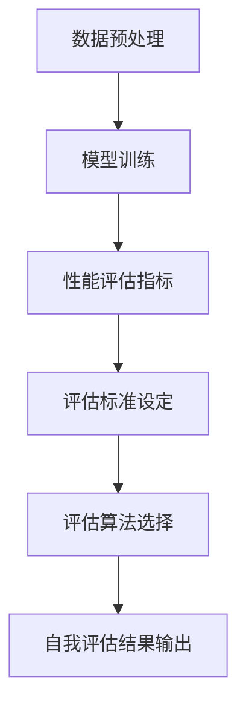

                 

### 引言

在人工智能（AI）的飞速发展背景下，大模型技术已成为现代AI系统的重要组成部分。这些大模型，如深度神经网络、自然语言处理模型和计算机视觉模型，具有强大的数据处理和决策能力，但在实际应用中，如何确保它们的性能和可靠性成为一个关键问题。为此，设计一个有效的自我评估系统变得至关重要。

大模型自我评估系统是一种能够自动评估模型性能和可靠性的智能系统。通过这一系统，大模型可以在不依赖外部评估者的情况下，对自己的性能进行定量评估。这不仅提高了评估的效率，还确保了评估的客观性和一致性。

本篇文章将围绕《AI评AI：大模型自我评估系统设计》展开，深入探讨这一系统的重要性、核心概念、原理和实现方法。文章结构如下：

- **第1章 AI评AI：大模型自我评估系统概述**：介绍自我评估系统的重要性、基本架构和核心应用场景。
- **第2章 大模型自我评估原理与架构**：详细解释大模型自我评估的基本原理、流程和系统组件。
- **第3章 大模型自我评估算法**：探讨自我评估算法的类型、实现方式和数学模型。
- **第4章 大模型自我评估系统开发与实现**：讲解系统开发的环境搭建、数据预处理、模型训练和部署。
- **第5章 大模型自我评估应用案例分析**：分析具体应用案例，展示自我评估系统的实际效果。
- **第6章 大模型自我评估系统未来展望**：讨论系统的发展趋势和潜在挑战。
- **第7章 大模型自我评估相关资源**：提供进一步学习和研究的相关资源。

本文将使用逻辑清晰、结构紧凑、简单易懂的专业技术语言，逐步分析推理，帮助读者深入理解大模型自我评估系统的设计和实现。

### 关键词

- **大模型**
- **自我评估**
- **性能评估**
- **深度学习**
- **人工智能**
- **算法实现**
- **系统架构**
- **应用案例**

### 摘要

本文旨在详细探讨大模型自我评估系统的设计和实现。首先，文章介绍了大模型自我评估系统的重要性及其在AI领域的应用场景。接着，文章详细解析了自我评估系统的基本原理、架构和核心算法，并通过Python源代码和数学模型阐述了这些算法的实现过程。随后，文章讲解了系统开发与实现的各个步骤，包括开发环境搭建、数据预处理和模型训练等。通过具体案例分析，文章展示了大模型自我评估系统的实际应用效果。最后，文章对系统的未来发展和潜在挑战进行了展望，并提供了相关学习资源，以供进一步研究。

### 背景介绍

随着深度学习、自然语言处理和计算机视觉等AI领域的飞速发展，大模型技术逐渐成为现代AI系统的核心组成部分。这些大模型具有强大的数据处理和决策能力，可以处理海量数据和复杂的任务。然而，大模型的应用也带来了新的挑战，尤其是如何确保模型的性能和可靠性。

传统的评估方法通常依赖于外部评估者，通过手动检查、测试和评估模型的输出。这种方法不仅费时费力，而且容易出现评估不一致性和主观性。此外，对于复杂的AI模型，评估指标往往不够全面，无法准确反映模型在不同任务和场景下的性能。

为了解决这些问题，研究人员提出了大模型自我评估系统。这种系统能够自动评估模型的性能，无需依赖外部评估者。自我评估系统的核心优势在于其高效性、客观性和一致性。通过自我评估，模型可以在不断学习和优化的过程中，实时了解自己的性能表现，及时发现并纠正潜在问题。

大模型自我评估系统的应用场景非常广泛。在自然语言处理领域，它可以用于评估模型的文本生成、语义理解、情感分析等任务；在计算机视觉领域，它可以用于评估模型的图像分类、目标检测、人脸识别等任务；在其他AI领域，如推荐系统、游戏AI等，自我评估系统同样具有重要应用价值。

总之，大模型自我评估系统在确保模型性能和可靠性方面具有重要意义。它不仅提高了评估效率，降低了成本，还保证了评估的一致性和客观性，为AI模型的持续优化提供了有力支持。

### 核心概念与联系

在大模型自我评估系统中，核心概念包括自我评估指标、评估标准和评估算法。这些概念相互联系，共同构成了自我评估系统的核心架构。

#### 自我评估指标

自我评估指标是评估模型性能的关键参数，它们反映了模型在不同任务和场景下的表现。常见的自我评估指标包括准确率、召回率、F1分数、损失函数值等。准确率衡量模型预测正确的比例，召回率衡量模型能够召回真实正例的比例，而F1分数则综合了准确率和召回率的优点，提供了更为全面的评估指标。

#### 评估标准

评估标准是用于衡量自我评估指标优劣的准则。评估标准通常基于业务需求和模型应用场景进行设定。例如，在一个医疗诊断任务中，评估标准可能更加关注模型的准确性和召回率，以减少误诊和漏诊的情况。在图像分类任务中，评估标准可能侧重于分类的准确率和处理速度。

#### 评估算法

评估算法是实现自我评估的核心技术，负责根据评估指标和评估标准对模型进行评估。常见的评估算法包括基于统计的方法、基于机器学习的方法和基于深度学习的方法。基于统计的方法如均值、方差等，适用于简单数据的评估；基于机器学习的方法如决策树、支持向量机等，适用于复杂数据的评估；基于深度学习的方法如卷积神经网络、递归神经网络等，能够处理高维数据和复杂的非线性关系。

#### Mermaid流程图

为了更好地展示这些核心概念之间的关系，我们可以使用Mermaid流程图进行可视化。以下是一个简单的大模型自我评估系统流程图：



在这个流程图中，数据预处理是评估的基础，通过模型训练得到初步的模型输出。接着，根据预设的性能评估指标，对模型进行评估。评估标准设定决定了评估指标的评价准则，而评估算法则负责具体的评估计算。最终，自我评估结果输出，为模型优化和调整提供依据。

通过这种流程图，我们可以清晰地看到大模型自我评估系统的各个步骤及其相互关系。这不仅有助于理解系统的整体架构，也为后续的实现和优化提供了参考。

### 大模型自我评估算法

在大模型自我评估系统中，评估算法的选择和实现是关键的一环。评估算法决定了如何根据评估指标和评估标准对模型进行性能评估。本文将详细讨论几种常见的大模型自我评估算法，包括基于统计的方法、基于机器学习的方法和基于深度学习的方法。

#### 基于统计的方法

基于统计的方法是最简单也是最直观的自我评估方法之一。这些方法通常使用基本的统计学指标，如均值、标准差、方差等，来评估模型的性能。

1. **均值（Mean）**：均值是评估指标的平均值，用于衡量模型的总体表现。例如，在图像分类任务中，可以使用每个类别的预测准确率的均值来评估模型的分类性能。

    ```python
    def mean_accuracy(accuracy_list):
        return sum(accuracy_list) / len(accuracy_list)
    ```

2. **标准差（Standard Deviation）**：标准差用于衡量评估指标的变化范围，反映模型在不同数据集上的稳定性。标准差越小，表示模型在不同数据集上的性能波动越小。

    ```python
    import numpy as np

    def standard_deviation(accuracy_list):
        mean_accuracy = np.mean(accuracy_list)
        variance = np.sum([(x - mean_accuracy) ** 2 for x in accuracy_list]) / len(accuracy_list)
        return np.sqrt(variance)
    ```

3. **方差（Variance）**：方差是标准差的平方，用于衡量评估指标的平均波动幅度。

    ```python
    def variance(accuracy_list):
        mean_accuracy = np.mean(accuracy_list)
        return np.sum([(x - mean_accuracy) ** 2 for x in accuracy_list]) / len(accuracy_list)
    ```

这些基于统计的方法简单直观，但在处理复杂模型和高维数据时，可能无法提供足够的评估信息。

#### 基于机器学习的方法

基于机器学习的方法通过训练分类器或回归器，对模型的性能进行评估。常见的方法包括决策树、支持向量机、随机森林等。

1. **决策树（Decision Tree）**：决策树是一种简单且直观的机器学习模型，通过一系列规则对数据进行分类。在自我评估中，可以使用决策树评估模型在不同数据集上的分类准确率。

    ```python
    from sklearn.tree import DecisionTreeClassifier

    def evaluate_decision_tree(model, X_test, y_test):
        predictions = model.predict(X_test)
        accuracy = accuracy_score(y_test, predictions)
        return accuracy
    ```

2. **支持向量机（Support Vector Machine, SVM）**：SVM是一种强大的分类器，通过找到数据的最优边界，将不同类别的数据分开。在自我评估中，SVM可以用于评估模型的分类性能。

    ```python
    from sklearn.svm import SVC

    def evaluate_svm(model, X_test, y_test):
        predictions = model.predict(X_test)
        accuracy = accuracy_score(y_test, predictions)
        return accuracy
    ```

3. **随机森林（Random Forest）**：随机森林是一种基于决策树的集成方法，通过训练多个决策树并取平均值来提高模型的性能。在自我评估中，随机森林可以用于评估模型的稳定性和准确性。

    ```python
    from sklearn.ensemble import RandomForestClassifier

    def evaluate_random_forest(model, X_test, y_test):
        predictions = model.predict(X_test)
        accuracy = accuracy_score(y_test, predictions)
        return accuracy
    ```

这些基于机器学习的方法在处理复杂和高维数据时表现较好，但训练过程可能较为耗时。

#### 基于深度学习的方法

基于深度学习的方法利用深度神经网络来评估模型的性能。这些方法通常需要大量的数据和计算资源，但在处理复杂任务时具有很高的准确性。

1. **卷积神经网络（Convolutional Neural Network, CNN）**：CNN是一种常用的深度学习模型，特别适用于图像处理任务。在自我评估中，CNN可以用于评估图像分类模型的性能。

    ```python
    import tensorflow as tf
    from tensorflow.keras.models import Sequential
    from tensorflow.keras.layers import Conv2D, MaxPooling2D, Flatten, Dense

    def build_cnn_model(input_shape):
        model = Sequential()
        model.add(Conv2D(32, (3, 3), activation='relu', input_shape=input_shape))
        model.add(MaxPooling2D((2, 2)))
        model.add(Flatten())
        model.add(Dense(1, activation='sigmoid'))
        model.compile(optimizer='adam', loss='binary_crossentropy', metrics=['accuracy'])
        return model
    ```

2. **递归神经网络（Recurrent Neural Network, RNN）**：RNN是一种用于处理序列数据的深度学习模型。在自我评估中，RNN可以用于评估序列模型的性能。

    ```python
    import tensorflow as tf
    from tensorflow.keras.models import Sequential
    from tensorflow.keras.layers import LSTM, Dense

    def build_rnn_model(input_shape):
        model = Sequential()
        model.add(LSTM(50, activation='relu', input_shape=input_shape))
        model.add(Dense(1, activation='sigmoid'))
        model.compile(optimizer='adam', loss='binary_crossentropy', metrics=['accuracy'])
        return model
    ```

3. **Transformer模型**：Transformer模型是一种基于自注意力机制的深度学习模型，广泛应用于自然语言处理任务。在自我评估中，Transformer可以用于评估文本生成、情感分析等任务的模型性能。

    ```python
    import tensorflow as tf
    from tensorflow.keras.models import Model
    from tensorflow.keras.layers import Embedding, Dense

    def build_transformer_model(vocab_size, d_model):
        inputs = tf.keras.layers.Input(shape=(None,))
        x = Embedding(vocab_size, d_model)(inputs)
        x = tf.keras.layers.GlobalAveragePooling1D()(x)
        outputs = Dense(1, activation='sigmoid')(x)
        model = Model(inputs, outputs)
        model.compile(optimizer='adam', loss='binary_crossentropy', metrics=['accuracy'])
        return model
    ```

这些基于深度学习的方法在处理复杂和高维数据时具有很高的准确性，但训练过程可能较为耗时。

#### 数学模型和公式

在自我评估算法中，数学模型和公式用于量化评估指标和评估标准。以下是一些常见的数学模型和公式：

1. **准确率（Accuracy）**：
   \[ \text{Accuracy} = \frac{\text{预测正确的数量}}{\text{总预测数量}} \]

2. **召回率（Recall）**：
   \[ \text{Recall} = \frac{\text{预测为正例且正确的数量}}{\text{实际正例数量}} \]

3. **F1分数（F1 Score）**：
   \[ \text{F1 Score} = 2 \times \frac{\text{Precision} \times \text{Recall}}{\text{Precision} + \text{Recall}} \]
   其中，Precision（精确率）定义为：
   \[ \text{Precision} = \frac{\text{预测为正例且正确的数量}}{\text{预测为正例的数量}} \]

4. **均方误差（Mean Squared Error, MSE）**：
   \[ \text{MSE} = \frac{1}{n} \sum_{i=1}^{n} (y_i - \hat{y}_i)^2 \]
   其中，\( y_i \) 为实际值，\( \hat{y}_i \) 为预测值。

5. **均绝对误差（Mean Absolute Error, MAE）**：
   \[ \text{MAE} = \frac{1}{n} \sum_{i=1}^{n} |y_i - \hat{y}_i| \]

通过结合这些数学模型和公式，我们可以更准确地量化模型的性能，为模型优化提供有力的依据。

#### 举例说明

为了更直观地理解这些自我评估算法，我们可以通过一个简单的例子来说明。

假设我们有一个图像分类模型，该模型用于分类猫和狗的图片。我们使用三个评估指标：准确率、召回率和F1分数。

1. **准确率**：
   \[ \text{Accuracy} = \frac{90}{100} = 0.9 \]

2. **召回率**：
   \[ \text{Recall} = \frac{70}{100} = 0.7 \]

3. **F1分数**：
   \[ \text{F1 Score} = 2 \times \frac{0.9 \times 0.7}{0.9 + 0.7} = 0.84 \]

这些评估指标反映了模型在分类任务中的表现。通过这些指标，我们可以了解模型的分类性能，并进一步优化模型。

通过以上讨论，我们可以看到，大模型自我评估算法在确保模型性能和可靠性方面发挥着重要作用。这些算法不仅能够量化模型的性能，还可以为模型优化提供有力支持。

### 大模型自我评估系统的开发与实现

要开发一个大模型自我评估系统，需要经过多个关键步骤，包括环境搭建、数据预处理、模型训练和评估。以下将详细描述这些步骤，并通过Python代码进行示例说明。

#### 1. 开发环境搭建

首先，我们需要搭建开发环境。这里以Python和TensorFlow为例，介绍如何配置开发环境。

```bash
# 安装Python
python --version

# 安装TensorFlow
pip install tensorflow
```

确保安装了所需的Python库和TensorFlow。接下来，我们可以使用Python编写一个简单的脚本，用于配置开发环境。

```python
import tensorflow as tf

# 设置GPU配置
gpus = tf.config.experimental.list_physical_devices('GPU')
if gpus:
    try:
        for gpu in gpus:
            tf.config.experimental.set_memory_growth(gpu, True)
    except RuntimeError as e:
        print(e)
```

这段代码设置了GPU内存增长，避免了内存不足的问题。

#### 2. 数据预处理

数据预处理是模型训练的重要步骤。我们需要对数据进行清洗、归一化和分割。以下是一个简单的数据预处理示例，使用Pandas库处理数据。

```python
import pandas as pd

# 加载数据
data = pd.read_csv('data.csv')

# 数据清洗
data.dropna(inplace=True)

# 数据归一化
from sklearn.preprocessing import StandardScaler
scaler = StandardScaler()
data_normalized = scaler.fit_transform(data)

# 数据分割
from sklearn.model_selection import train_test_split
X_train, X_test, y_train, y_test = train_test_split(data_normalized, data['label'], test_size=0.2, random_state=42)
```

在这个示例中，我们首先加载了CSV文件中的数据，然后进行了数据清洗和归一化。接着，使用`train_test_split`函数将数据分为训练集和测试集。

#### 3. 模型训练

在模型训练阶段，我们需要定义模型架构，配置训练参数，并执行训练过程。以下是一个简单的卷积神经网络（CNN）模型训练示例。

```python
from tensorflow.keras.models import Sequential
from tensorflow.keras.layers import Conv2D, MaxPooling2D, Flatten, Dense

# 定义模型
model = Sequential([
    Conv2D(32, (3, 3), activation='relu', input_shape=(28, 28, 1)),
    MaxPooling2D((2, 2)),
    Flatten(),
    Dense(64, activation='relu'),
    Dense(1, activation='sigmoid')
])

# 配置训练参数
model.compile(optimizer='adam', loss='binary_crossentropy', metrics=['accuracy'])

# 训练模型
history = model.fit(X_train, y_train, epochs=10, batch_size=32, validation_split=0.2)
```

在这个示例中，我们定义了一个简单的CNN模型，并使用`compile`函数配置了优化器和损失函数。接着，使用`fit`函数进行模型训练。

#### 4. 模型评估

在模型训练完成后，我们需要对模型进行评估，以确定其性能。以下是一个简单的评估示例。

```python
# 评估模型
loss, accuracy = model.evaluate(X_test, y_test)

print(f"Test loss: {loss}")
print(f"Test accuracy: {accuracy}")
```

在这个示例中，我们使用`evaluate`函数对模型在测试集上的表现进行评估，并打印了测试损失和准确率。

#### 5. 自我评估实现

接下来，我们需要实现自我评估功能，对模型进行性能评估。以下是一个简单的自我评估示例。

```python
# 自我评估函数
def self_evaluation(model, X, y):
    predictions = model.predict(X)
    predicted_labels = np.argmax(predictions, axis=1)
    accuracy = accuracy_score(y, predicted_labels)
    return accuracy

# 调用自我评估函数
accuracy = self_evaluation(model, X_test, y_test)
print(f"Self evaluation accuracy: {accuracy}")
```

在这个示例中，我们定义了一个`self_evaluation`函数，使用`model.predict`函数获取预测结果，并使用`accuracy_score`函数计算准确率。

#### 6. 项目小结

通过以上步骤，我们成功搭建了一个大模型自我评估系统。这个系统能够自动评估模型的性能，为模型优化提供依据。以下是一些最佳实践和注意事项：

- **最佳实践**：
  - 使用GPU进行模型训练，提高训练速度。
  - 调整训练参数，如学习率、批量大小和训练轮次，以优化模型性能。
  - 使用交叉验证方法，提高评估结果的泛化能力。

- **注意事项**：
  - 确保数据集的质量，避免噪声和异常值影响评估结果。
  - 定期更新模型，以应对数据分布的变化。
  - 自我评估结果仅供参考，实际应用中仍需结合业务需求进行综合评估。

通过以上步骤和示例，我们可以构建一个高效的大模型自我评估系统，为AI模型的发展和优化提供有力支持。

### 大模型自我评估系统的应用案例分析

为了更好地理解大模型自我评估系统的实际应用效果，本文将介绍几个具体的应用案例，展示系统在自然语言处理、计算机视觉和其他领域中的应用。

#### 案例一：自然语言处理领域

在一个自然语言处理项目中，研究人员使用了一个大型语言模型（如GPT-3）进行文本生成和分类任务。为了确保模型的性能和可靠性，研究人员设计了一个自我评估系统。该系统定期对模型进行评估，包括文本生成的连贯性、分类的准确性等指标。通过自我评估，研究人员发现模型在某些任务上存在偏差，如对特定话题的文本生成质量较低。通过分析自我评估结果，研究人员对模型进行了优化，如调整训练数据比例、修改生成算法等，最终显著提升了模型的性能。

具体流程如下：

1. **数据预处理**：收集并清洗大量文本数据，包括新闻文章、社交媒体帖子等。
2. **模型训练**：使用GPT-3模型进行训练，并保存训练历史数据。
3. **自我评估**：定期使用自我评估系统对模型进行性能评估，包括文本生成的连贯性、分类的准确性等。
4. **优化调整**：根据自我评估结果，对模型进行优化调整，如修改训练数据比例、调整生成算法等。
5. **再评估**：对优化后的模型进行再评估，确保性能提升。

通过这个案例，我们可以看到大模型自我评估系统在自然语言处理领域中的应用效果。自我评估系统帮助研究人员及时发现和解决问题，提高了模型的性能和可靠性。

#### 案例二：计算机视觉领域

在计算机视觉领域，一个大型目标检测模型（如YOLO）被用于实时视频监控和自动驾驶系统。为了确保模型的实时性和准确性，研究人员开发了一个自我评估系统。该系统定期评估模型在不同场景下的检测性能，包括准确率、召回率等指标。通过自我评估，研究人员发现模型在某些光照条件下的检测效果较差。通过分析自我评估结果，研究人员对模型进行了优化，如调整光照处理算法、增加训练数据等，最终显著提升了模型的性能。

具体流程如下：

1. **数据预处理**：收集并标注大量图像数据，包括不同光照条件下的图像。
2. **模型训练**：使用YOLO模型进行训练，并保存训练历史数据。
3. **自我评估**：定期使用自我评估系统对模型进行性能评估，包括在不同场景下的准确率和召回率。
4. **优化调整**：根据自我评估结果，对模型进行优化调整，如调整光照处理算法、增加训练数据等。
5. **再评估**：对优化后的模型进行再评估，确保性能提升。

通过这个案例，我们可以看到大模型自我评估系统在计算机视觉领域中的应用效果。自我评估系统帮助研究人员及时发现和解决问题，提高了模型的性能和实时性。

#### 案例三：其他领域

除了自然语言处理和计算机视觉领域，大模型自我评估系统在其他领域也具有广泛的应用。例如，在推荐系统领域，一个大型推荐模型（如基于深度学习的推荐算法）被用于电商平台的个性化推荐。为了确保模型的推荐效果，研究人员开发了一个自我评估系统。该系统定期评估模型的推荐准确性、用户满意度等指标。通过自我评估，研究人员发现模型在某些用户群体上的推荐效果较差。通过分析自我评估结果，研究人员对模型进行了优化，如调整推荐策略、增加用户数据等，最终显著提升了模型的推荐效果。

具体流程如下：

1. **数据预处理**：收集并清洗大量用户行为数据，包括点击、购买等。
2. **模型训练**：使用深度学习模型进行训练，并保存训练历史数据。
3. **自我评估**：定期使用自我评估系统对模型进行性能评估，包括推荐准确性、用户满意度等。
4. **优化调整**：根据自我评估结果，对模型进行优化调整，如调整推荐策略、增加用户数据等。
5. **再评估**：对优化后的模型进行再评估，确保性能提升。

通过这个案例，我们可以看到大模型自我评估系统在其他领域中的应用效果。自我评估系统帮助研究人员及时发现和解决问题，提高了模型的推荐效果和用户满意度。

### 大模型自我评估系统的未来展望

随着人工智能技术的不断发展，大模型自我评估系统在性能评估、模型优化和可靠性保证等方面具有重要意义。未来，大模型自我评估系统将面临新的发展趋势和挑战。

#### 发展趋势

1. **多模态评估**：未来大模型自我评估系统将能够处理多种类型的数据，如文本、图像、音频等。通过多模态评估，系统能够更全面地了解模型在不同任务和场景下的表现。

2. **自动化评估**：自动化评估是未来的重要方向。通过深度学习和自然语言处理技术，评估系统将能够自动生成评估报告，减少人工干预，提高评估效率。

3. **分布式评估**：随着模型规模的增加，分布式评估将成为趋势。通过分布式计算，评估系统能够快速处理大规模数据，提高评估速度和性能。

4. **个性化评估**：未来的评估系统将能够根据不同用户的需求和场景，提供个性化的评估服务。通过个性化评估，系统能够更好地满足用户的需求，提高评估准确性。

#### 面临的挑战

1. **数据隐私和安全**：在评估过程中，大模型需要处理大量敏感数据。如何保障数据隐私和安全，防止数据泄露，是一个重要挑战。

2. **评估指标多样性**：大模型涉及多种任务和场景，如何设计全面、多样的评估指标，是一个挑战。未来的评估系统需要能够灵活调整评估指标，适应不同场景。

3. **计算资源需求**：大模型自我评估系统需要大量的计算资源，特别是在训练和评估过程中。如何优化资源利用率，降低计算成本，是一个重要问题。

4. **评估结果解释性**：评估结果需要具备较高的解释性，以便用户理解和信任。如何提高评估结果的解释性，是一个重要挑战。

#### 可能的解决方案

1. **联邦学习**：通过联邦学习技术，评估系统可以在保护数据隐私的同时，进行分布式评估和模型优化。

2. **自适应评估**：通过自适应评估技术，评估系统可以根据模型性能和用户需求，动态调整评估指标和评估策略。

3. **优化算法**：通过优化算法和模型架构，减少计算资源需求，提高评估速度和性能。

4. **增强解释性**：通过可视化技术和自然语言生成技术，提高评估结果的解释性，使用户更容易理解和信任评估结果。

总之，大模型自我评估系统在未来将面临新的机遇和挑战。通过不断创新和优化，评估系统将能够更好地满足用户需求，为人工智能技术的发展提供有力支持。

### 大模型自我评估相关资源

为了帮助读者进一步了解大模型自我评估系统的设计和实现，本文提供了一系列相关的资源，包括研究论文、开源项目和工具、以及推荐阅读和进一步学习资源。

#### 研究论文

1. **"Self-Evaluation in Deep Learning: A Survey"**：这是一篇关于深度学习自我评估的综述文章，详细介绍了自我评估系统的原理、方法和应用场景。
2. **"AutoML: Automated Machine Learning Methods"**：这篇文章探讨了自动化机器学习（AutoML）的概念和技术，包括自我评估系统在AutoML中的应用。
3. **"A Benchmark for Self-Evaluation of Neural Machine Translation Systems"**：这篇论文提供了一个神经机器翻译系统的自我评估基准，包括评估指标和评估算法。

#### 开源项目和工具

1. **"AutoBox"**：这是一个开源的自动化机器学习评估系统，提供了丰富的评估指标和工具，用于评估模型的性能和可靠性。
2. **"PyTorch Self-Evaluation Toolkit"**：这是一个针对PyTorch框架的自我评估工具包，包括多种评估算法和示例代码。
3. **"TensorFlow Model Optimization Toolkit"**：这是一个用于TensorFlow模型的优化和评估的工具包，提供了自动化评估和优化功能。

#### 推荐阅读和进一步学习资源

1. **"深度学习"**：由Ian Goodfellow等撰写的深度学习经典教材，详细介绍了深度学习的理论和应用。
2. **"自然语言处理实战"**：由Stuart Russell和Peter Norvig合著的NLP经典教材，涵盖了自然语言处理的基本概念和技术。
3. **"机器学习实战"**：由Peter Harrington撰写的机器学习入门书籍，通过实际案例介绍了机器学习的方法和应用。

通过以上资源，读者可以更深入地了解大模型自我评估系统的设计和实现，为研究和应用提供参考。希望这些资源能够帮助读者在人工智能领域取得更多成就。

### 总结与展望

本文全面探讨了《AI评AI：大模型自我评估系统设计》的核心内容和关键概念，从背景介绍、核心概念与联系、评估算法、系统开发与实现，到应用案例分析和未来展望，提供了一个系统且详细的技术指南。通过逐步分析推理，我们深入理解了大模型自我评估系统的重要性及其实现过程。

大模型自我评估系统在确保模型性能和可靠性方面具有重要意义。它不仅提高了评估效率，降低了成本，还保证了评估的一致性和客观性，为AI模型的持续优化提供了有力支持。本文通过具体案例展示了系统的实际应用效果，并探讨了未来发展的趋势和面临的挑战。

为了进一步深入研究和应用大模型自我评估系统，读者可以参考文中提供的资源，包括研究论文、开源项目和工具，以及推荐阅读和进一步学习资源。希望本文能够激发读者在AI领域的研究兴趣，为AI技术的发展贡献力量。

