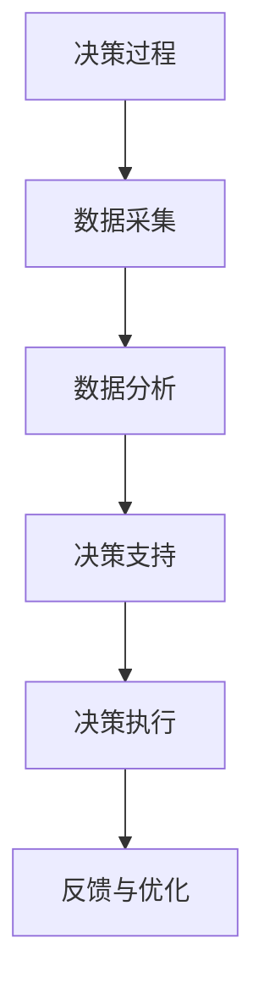

                 

### 书名：《AI辅助决策系统：增强人类判断力的新工具》

这篇文章将深入探讨人工智能（AI）辅助决策系统的基础知识、核心算法原理及其在各领域的应用。随着技术的不断进步，AI辅助决策系统正在成为提升人类判断力和决策效率的重要工具。以下，我们将一步一步分析这一新兴技术的本质和潜力。

#### 关键词：AI辅助决策系统、人工智能、决策支持、算法原理、应用领域

> 摘要：
本文旨在为读者提供一个全面而深入的AI辅助决策系统概述。我们将首先解释AI辅助决策系统的定义及其在决策过程中的作用。接着，文章将详细介绍系统的核心概念、架构设计和核心算法原理，并通过实际案例进行分析。最后，我们将探讨AI辅助决策系统在金融、医疗和智能交通等领域的应用，并给出一些最佳实践建议。

### 第一部分：AI辅助决策系统概述

#### 第1章 AI辅助决策系统的基础知识

##### 1.1 AI辅助决策系统的定义与作用

**1.1.1 AI辅助决策系统的定义**

AI辅助决策系统（AI-aided decision support system，AI-DSS）是一种基于人工智能技术的系统，它通过分析和处理大量数据，辅助人类做出更准确、更高效的决策。

**1.1.2 AI辅助决策系统的作用**

- **提高决策效率**：通过快速处理和分析数据，AI-DSS可以显著缩短决策时间。
- **减少决策失误**：通过数据分析和模式识别，AI-DSS可以帮助识别潜在的风险和机会，减少因信息不全或理解偏差导致的决策失误。
- **增强决策深度**：AI-DSS可以处理比人类更多的数据和变量，从而提供更全面、更深入的决策支持。
- **优化资源配置**：通过预测和分析，AI-DSS可以帮助优化资源分配，提高资源利用效率。

**1.1.3 Mermaid流程图**

##### 1.2 AI辅助决策系统的核心概念与联系

**1.2.1 数据采集与处理**

**1.2.2 模型训练与优化**

**1.2.3 决策支持模块**

**1.2.4 软件与硬件架构**

**1.2.5 数据流与信息处理**

##### 1.3 AI辅助决策系统的架构设计

**1.3.1 硬件架构**

硬件架构是AI辅助决策系统的基础，包括处理器、内存、存储设备和网络接口等。

**1.3.2 软件架构**

软件架构包括数据采集模块、数据处理模块、模型训练模块和决策支持模块。

##### 1.4 AI辅助决策系统的应用领域

**1.4.1 金融行业**

AI辅助决策系统在金融行业中的应用主要包括风险评估、量化交易和金融欺诈检测等。

**1.4.2 医疗健康**

AI辅助决策系统在医疗健康领域的应用包括疾病预测、治疗方案推荐和健康风险预警等。

**1.4.3 智能交通**

AI辅助决策系统在智能交通领域的应用包括交通流量预测、路线规划和车辆管理等。

### 第2章 AI辅助决策系统核心算法原理

##### 2.1 监督学习算法

**2.1.1 线性回归**

线性回归是一种简单的监督学习算法，用于预测一个连续的输出值。

**2.1.2 逻辑回归**

逻辑回归是一种用于预测概率的监督学习算法，常用于分类问题。

##### 2.2 无监督学习算法

**2.2.1 K-均值聚类**

K-均值聚类是一种基于距离的聚类算法，用于将数据集分为多个类别。

**2.2.2 主成分分析**

主成分分析是一种降维技术，用于提取数据的主要特征。

##### 2.3 强化学习算法

强化学习算法是一种通过不断尝试和反馈来学习最优策略的算法。

### 第二部分：AI辅助决策系统应用与实现

#### 第3章 AI辅助决策系统在金融行业的应用

**3.1 风险评估**

**3.2 量化交易**

**3.3 金融欺诈检测**

#### 第4章 AI辅助决策系统在医疗健康领域的应用

**4.1 疾病预测**

**4.2 治疗方案推荐**

**4.3 健康风险预警**

#### 第5章 AI辅助决策系统在智能交通领域的应用

**5.1 交通流量预测**

**5.2 路线规划**

**5.3 车辆管理**

### 第三部分：AI辅助决策系统的未来与发展

#### 第6章 AI辅助决策系统的挑战与机遇

**6.1 数据隐私与安全**

**6.2 模型解释性与可解释性**

**6.3 算法公平性与透明性**

#### 第7章 AI辅助决策系统的未来趋势

**7.1 跨领域融合**

**7.2 人工智能与人类的协同**

**7.3 智能决策系统的普及与应用**

### 结语

随着人工智能技术的不断进步，AI辅助决策系统将在未来的各个领域中发挥越来越重要的作用。本文通过详细的解析，旨在帮助读者更好地理解和应用这一先进技术。

#### 作者信息

- 作者：AI天才研究院/AI Genius Institute & 禅与计算机程序设计艺术 /Zen And The Art of Computer Programming

### 全文总结

本文系统地介绍了AI辅助决策系统的基础知识、核心算法原理及其在各领域的应用。通过深入分析和实例讲解，我们看到了AI辅助决策系统在提升人类决策力方面的巨大潜力。随着技术的不断发展和应用场景的不断拓展，AI辅助决策系统有望在未来带来更多的创新和变革。让我们一起期待这一技术的进一步发展，并积极应用它为人类社会创造更大的价值。

