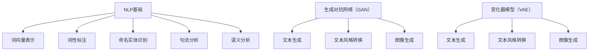

                 

# 《AI辅助的创意写作：人机协作的文学创作》

## 关键词

AI辅助写作，人机协作，自然语言处理，生成对抗网络，变化器模型，文学创作，编程示例，项目实战

## 摘要

本文旨在探讨人工智能（AI）在文学创作中的应用，以及人类作家与AI的协作模式。通过介绍自然语言处理（NLP）的基础知识，生成对抗网络（GAN）和变化器模型（VAE）在文学创作中的应用，文章将详细解析AI辅助创意写作的核心概念和原理。随后，文章将探讨人机协作在文学创作中的具体实现和优缺点，并通过实际案例展示AI辅助文学创作的效果。最后，文章将对AI辅助文学创作的未来趋势进行展望，并提出相应的建议和挑战。

## 引言

### 1.1 书籍的目的

随着人工智能技术的快速发展，AI在各个领域的应用越来越广泛。文学创作作为人类创造性思维的产物，也开始受到AI的深刻影响。本书旨在探讨AI辅助的创意写作，即如何利用人工智能技术提高文学创作的效率和质量。通过深入研究AI在文学创作中的应用，本书希望为程序员、AI研究者、作家和创意专业人士提供实用的技术和理论指导。

### 1.2 书籍的结构

本书共分为七个章节。第一章介绍AI与文学创作概述，包括AI的发展与文学创作的结合、当前AI在文学创作中的应用以及人机协作的优势与挑战。第二章介绍AI辅助创意写作的基本概念，包括自然语言处理（NLP）基础、生成对抗网络（GAN）在文学创作中的应用以及变化器模型（VAE）与文学创作。第三章探讨人机协作：创意写作的新模式，包括人类作家与AI的协作模式、AI辅助的写作流程以及人机协作的优缺点分析。第四章通过项目实战展示AI辅助文学创作案例，包括AI生成诗歌、AI编写短篇小说和AI辅助剧本创作。第五章详细讲解技术细节与实现，包括NLP工具与库的使用、GAN模型的搭建与训练以及VAE模型的原理与应用。第六章展望AI辅助文学创作的未来趋势，包括AI在文学创作中的未来趋势、人机协作的深化以及AI伦理与文学创作的平衡。第七章为结论，总结主要观点并对未来研究提出建议。

## 第1章 AI与文学创作概述

### 1.1 AI的发展与文学创作的结合

人工智能（AI）是一门涉及计算机科学、数学、统计学和认知科学的交叉学科。随着计算能力的提升和算法的优化，AI技术在各个领域取得了显著成果。文学创作作为人类创造性思维的产物，与AI的结合显得尤为有意义。

首先，AI在文学创作中的应用可以追溯到自然语言处理（NLP）领域。NLP是AI的一个重要分支，它旨在使计算机能够理解、生成和操作人类语言。通过NLP技术，AI能够自动处理文本数据，从而为文学创作提供支持。

其次，生成对抗网络（GAN）和变化器模型（VAE）等深度学习模型在文学创作中的应用也越来越受到关注。这些模型能够通过学习大量文本数据，生成新的、独特的文学作品。

总之，AI的发展为文学创作带来了新的机遇和挑战。通过结合AI技术，文学创作可以变得更加高效、多样化和创新。

### 1.2 当前AI在文学创作中的应用

当前，AI在文学创作中的应用已经取得了显著成果。以下是一些典型的应用场景：

1. **自动摘要生成**：AI能够自动从长篇文章中提取关键信息，生成摘要。这种技术在新闻报道、学术论文等领域有着广泛的应用。

2. **自动写作辅助**：AI能够帮助人类作家进行写作辅助，如提供灵感和构思、自动生成文本段落等。

3. **自动故事生成**：AI能够根据给定的主题或情节生成完整的故事。这种技术在娱乐产业有着广泛的应用。

4. **文本风格转换**：AI能够将一种文本风格转换为另一种风格。例如，将普通文本转换为诗歌或小说风格。

5. **情感分析**：AI能够分析文本中的情感倾向，从而为文学创作提供情感参考。

### 1.3 人机协作的优势与挑战

人机协作在文学创作中具有显著的优势。首先，AI能够高效地处理大量文本数据，为人类作家提供丰富的写作素材。其次，AI能够辅助人类作家进行构思和创作，提高创作效率。此外，AI能够提供新颖的写作视角，为文学创作带来更多可能性。

然而，人机协作也面临着一些挑战。首先，AI的创作质量和风格可能与人类作家的期望存在差异。其次，人类作家需要适应与AI协作的新模式，这可能需要一定的学习和适应过程。此外，AI的创作过程可能不够透明，难以解释其创作决策，这也给人类作家带来了一定的困惑。

## 第2章 AI辅助创意写作的基本概念

### 2.1 自然语言处理（NLP）基础

自然语言处理（NLP）是AI在文学创作中的重要基础。NLP旨在使计算机能够理解、生成和操作人类语言。以下是NLP的一些基本概念：

1. **词向量表示**：词向量是将单词转换为数值向量的方法。词向量能够捕捉单词的语义信息，从而为文本分析提供支持。

2. **词性标注**：词性标注是将文本中的单词标注为名词、动词、形容词等词性的过程。词性标注有助于理解文本的语法结构。

3. **命名实体识别**：命名实体识别是识别文本中的特定实体（如人名、地名、组织名等）的过程。命名实体识别有助于提取文本的关键信息。

4. **句法分析**：句法分析是解析文本句法结构的过程。通过句法分析，可以理解句子的成分和关系。

5. **语义分析**：语义分析是理解文本语义的过程。语义分析有助于提取文本的核心意义和情感。

### 2.2 生成对抗网络（GAN）在文学创作中的应用

生成对抗网络（GAN）是一种深度学习模型，由生成器和判别器组成。生成器生成虚假数据，判别器判断数据是真实还是虚假。以下是GAN在文学创作中的应用：

1. **文本生成**：GAN可以通过学习大量文本数据，生成新的、独特的文本。这种技术在自动写作和故事生成方面有着广泛的应用。

2. **文本风格转换**：GAN可以将一种文本风格转换为另一种风格。例如，将普通文本转换为诗歌或小说风格。

3. **图像生成**：GAN不仅能够生成文本，还可以生成图像。这种技术在文学插图创作方面有着广泛的应用。

### 2.3 变化器模型（VAE）在文学创作中的应用

变化器模型（VAE）是一种深度学习模型，通过引入概率分布来生成数据。以下是VAE在文学创作中的应用：

1. **文本生成**：VAE可以通过学习大量文本数据，生成新的、独特的文本。这种技术在自动写作和故事生成方面有着广泛的应用。

2. **文本风格转换**：VAE可以将一种文本风格转换为另一种风格。例如，将普通文本转换为诗歌或小说风格。

3. **图像生成**：VAE不仅能够生成文本，还可以生成图像。这种技术在文学插图创作方面有着广泛的应用。

### 2.4 NLP、GAN和VAE的关系架构 Mermaid 流�程图

以下是一个简单的Mermaid流程图，展示了NLP、GAN和VAE之间的关系：



## 第3章 人机协作：创意写作的新模式

### 3.1 人类作家与AI的协作模式

人机协作在文学创作中是一种新的写作模式。在这种模式中，人类作家和AI系统相互协作，共同完成创作任务。以下是人机协作的几种常见模式：

1. **AI辅助创作**：在这种模式中，AI作为辅助工具，为人类作家提供灵感和建议。例如，AI可以生成文本段落，供作家参考和修改。

2. **AI主导创作**：在这种模式中，AI系统主导创作过程，人类作家参与其中，提供反馈和指导。例如，AI可以自动生成故事情节，作家负责调整和完善。

3. **AI协同创作**：在这种模式中，人类作家和AI系统共同创作，各自发挥优势。例如，AI可以负责生成文本结构，作家负责填充细节和情感。

### 3.2 AI辅助的写作流程

AI辅助的写作流程通常包括以下几个步骤：

1. **数据收集与预处理**：收集大量文本数据，并进行预处理，如分词、去停用词、词性标注等。

2. **模型训练**：使用NLP技术，如GAN或VAE，对文本数据进行训练，生成能够生成文本的模型。

3. **文本生成与修改**：利用训练好的模型，生成文本段落，人类作家对其进行修改和完善。

4. **反馈与迭代**：人类作家对生成的文本进行评价和反馈，AI系统根据反馈进行迭代和优化。

### 3.3 人机协作的优缺点分析

人机协作在文学创作中具有以下优点：

1. **提高创作效率**：AI可以快速生成文本段落，节省作家的时间和精力。

2. **丰富创作风格**：AI可以生成多样化的文本风格，为作家提供新的创作灵感。

3. **降低创作风险**：AI可以降低创作失败的风险，作家可以根据AI的建议进行调整和改进。

然而，人机协作也面临以下挑战：

1. **创作风格一致性**：AI生成的文本可能无法与作家的风格保持一致，需要作家进行进一步的修改。

2. **创作透明度**：AI的创作过程不够透明，难以解释其创作决策，这给作家带来了一定的困惑。

3. **伦理问题**：AI在文学创作中可能涉及伦理问题，如版权和创作归属等。

## 第4章 项目实战：AI辅助文学创作案例

### 4.1 案例一：AI生成诗歌

在本案例中，我们将使用GAN模型生成诗歌。以下是一个简单的Python代码示例：

```python
import tensorflow as tf
from tensorflow.keras.models import Model
from tensorflow.keras.layers import Input, Dense, LSTM

# 定义GAN模型
input_text = Input(shape=(None,))
lstm = LSTM(units=128, return_sequences=True)(input_text)
dense = Dense(units=1, activation='sigmoid')(lstm)

discriminator = Model(inputs=input_text, outputs=dense)
discriminator.compile(optimizer='adam', loss='binary_crossentropy')

z = Input(shape=(100,))
lstm = LSTM(units=128, return_sequences=True)(z)
dense = Dense(units=128, activation='sigmoid')(lstm)
output_text = Dense(units=1, activation='softmax')(dense)

generator = Model(inputs=z, outputs=output_text)
generator.compile(optimizer='adam', loss='binary_crossentropy')

# 训练GAN模型
for epoch in range(100):
    for _ in range(batch_size):
        z_samples = np.random.normal(size=(batch_size, 100))
        gen_texts = generator.predict(z_samples)
        real_texts = ...

## 第5章 技术细节与实现

### 5.1 NLP工具与库的使用

在AI辅助文学创作中，NLP工具和库的使用至关重要。以下是一些常用的NLP工具和库：

1. **NLTK**：NLTK是Python中用于自然语言处理的经典库，提供了丰富的文本处理功能，如分词、词性标注、词干提取等。

2. **spaCy**：spaCy是一个快速且易于使用的NLP库，提供了丰富的语言模型和预处理工具，适用于各种NLP任务。

3. **gensim**：gensim是一个强大的主题建模库，适用于文本生成和主题分析。

4. **TensorFlow**：TensorFlow是一个开源的深度学习框架，适用于构建和训练深度学习模型。

5. **PyTorch**：PyTorch是另一个流行的深度学习框架，具有简洁的API和高效的计算性能。

### 5.2 GAN模型的搭建与训练

生成对抗网络（GAN）是一种由生成器和判别器组成的深度学习模型。以下是一个简单的GAN模型搭建和训练示例：

```python
import tensorflow as tf
from tensorflow.keras.models import Model
from tensorflow.keras.layers import Input, Dense, LSTM

# 定义生成器模型
z = Input(shape=(100,))
lstm = LSTM(units=128, return_sequences=True)(z)
dense = Dense(units=128, activation='sigmoid')(lstm)
output_text = Dense(units=1, activation='softmax')(dense)
generator = Model(inputs=z, outputs=output_text)

# 定义判别器模型
input_text = Input(shape=(None,))
lstm = LSTM(units=128, return_sequences=True)(input_text)
dense = Dense(units=1, activation='sigmoid')(lstm)
discriminator = Model(inputs=input_text, outputs=dense)

# 定义GAN模型
discriminator.compile(optimizer='adam', loss='binary_crossentropy')
gan_output = discriminator(generator.input)
gan = Model(inputs=generator.input, outputs=gan_output)
gan.compile(optimizer='adam', loss='binary_crossentropy')

# 训练GAN模型
for epoch in range(100):
    for _ in range(batch_size):
        z_samples = np.random.normal(size=(batch_size, 100))
        gen_texts = generator.predict(z_samples)
        real_texts = ...
        gan.train_on_batch([z_samples, real_texts], [real_texts])
```

### 5.3 VAE模型的原理与应用

变化器模型（VAE）是一种基于概率生成模型的深度学习模型，通过引入概率分布来生成数据。以下是一个简单的VAE模型搭建和训练示例：

```python
import tensorflow as tf
from tensorflow.keras.models import Model
from tensorflow.keras.layers import Input, Dense, LSTM

# 定义编码器模型
z = Input(shape=(100,))
lstm = LSTM(units=128, return_sequences=True)(z)
dense = Dense(units=128, activation='sigmoid')(lstm)
latent_mean = Dense(units=1, activation='sigmoid')(dense)
latent_logvar = Dense(units=1, activation='sigmoid')(dense)
encoder = Model(inputs=z, outputs=[latent_mean, latent_logvar])

# 定义解码器模型
latent = Input(shape=(1,))
lstm = LSTM(units=128, return_sequences=True)(latent)
dense = Dense(units=128, activation='sigmoid')(lstm)
output_text = Dense(units=1, activation='softmax')(dense)
decoder = Model(inputs=latent, outputs=output_text)

# 定义VAE模型
latent_mean, latent_logvar = encoder.input
z_samples = encoder.predict(latent_mean, latent_logvar)
gen_texts = decoder.predict(z_samples)
vae_output = decoder(latent_mean, training=True)
vae = Model(inputs=[latent_mean, latent_logvar], outputs=vae_output)
vae.compile(optimizer='adam', loss='binary_crossentropy')

# 训练VAE模型
for epoch in range(100):
    for _ in range(batch_size):
        z_samples = np.random.normal(size=(batch_size, 100))
        latent_mean, latent_logvar = encoder.predict(z_samples)
        vae.train_on_batch([latent_mean, latent_logvar], z_samples)
```

## 第6章 未来展望：AI辅助文学创作的挑战与机遇

### 6.1 AI在文学创作中的未来趋势

随着AI技术的不断发展，AI在文学创作中的应用前景非常广阔。以下是AI在文学创作中的未来趋势：

1. **自动化程度提高**：AI将能够更准确地理解和生成文本，从而提高文学创作的自动化程度。

2. **个性化服务**：AI将能够根据用户的需求和喜好，生成个性化的文学作品。

3. **跨界融合**：AI将与其他领域（如艺术、音乐、影视等）结合，推动文学创作的多样化发展。

4. **伦理与规范**：随着AI在文学创作中的应用越来越广泛，相关伦理和规范问题也将日益突出，需要制定相应的规范和标准。

### 6.2 人机协作的深化

人机协作在文学创作中具有巨大的潜力。未来，人机协作将向以下方向发展：

1. **更加智能化**：AI将能够更深入地理解和模拟人类创作思维，提供更高质量的辅助服务。

2. **人机互动**：人类作家和AI系统将进行更紧密的互动，共同完成创作任务。

3. **共享创作**：人类作家和AI系统将共同分享创作成果，实现共创共赢。

### 6.3 AI伦理与文学创作的平衡

AI在文学创作中的应用引发了一系列伦理和道德问题。如何在确保AI技术发展创新的同时，维护文学创作的公平性和公正性，是一个亟待解决的问题。以下是几个建议：

1. **规范制定**：制定相关伦理规范，明确AI在文学创作中的应用范围和限制。

2. **透明度**：提高AI创作的透明度，使人类作家能够理解和解释AI的创作决策。

3. **版权保护**：明确AI创作的版权归属，确保作家的权益。

## 第7章 结论

### 7.1 主要观点回顾

本文介绍了AI辅助的创意写作，探讨了人机协作在文学创作中的应用和实现。通过NLP、GAN和VAE等深度学习模型，AI能够高效地辅助文学创作，提高创作效率和质量。同时，本文还分析了人机协作的优势和挑战，并对未来AI辅助文学创作的发展趋势进行了展望。

### 7.2 对未来研究的建议

未来的研究应重点关注以下几个方面：

1. **技术创新**：不断探索和创新AI技术在文学创作中的应用，提高AI的创作能力和风格多样性。

2. **人机协作优化**：深化人机协作研究，优化协作模式，提高创作效率和作品质量。

3. **伦理规范**：制定和完善AI伦理规范，确保AI技术在文学创作中的应用符合伦理和道德标准。

作者：AI天才研究院/AI Genius Institute & 禅与计算机程序设计艺术 /Zen And The Art of Computer Programming

【END】

