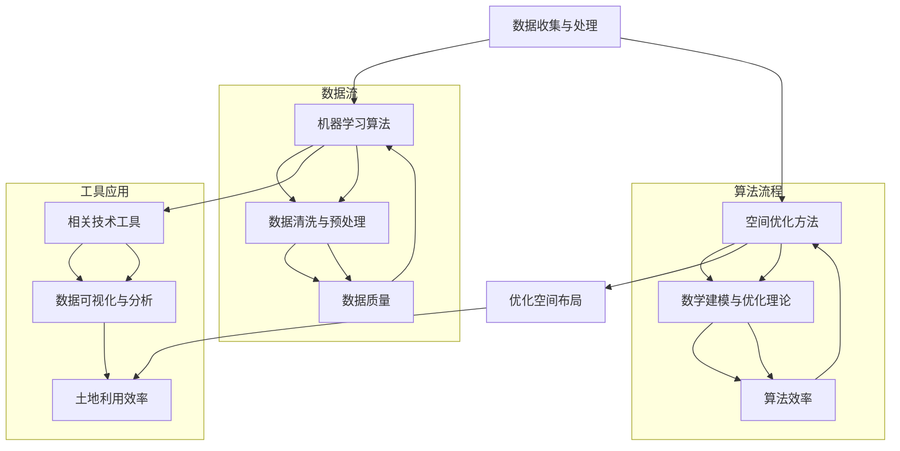

                 

### 引言

在现代城市化进程日益加快的背景下，城市规划面临着前所未有的挑战。传统的城市规划方法，往往依赖于经验和直觉，这导致了许多问题，如空间利用效率低下、资源分配不合理以及城市环境质量下降等。为了应对这些挑战，城市规划和设计领域迫切需要引入先进的技术手段，以提高规划的科学性和效率。人工智能（AI）作为一种颠覆性的技术，正逐步进入城市规划的各个层面，成为优化空间利用的新工具。

**关键词：** AI辅助城市规划、空间优化、技术手段、城市规划挑战

AI辅助城市规划的核心在于利用人工智能技术，对城市规划过程中的各种数据进行分析和预测，从而为决策者提供科学依据。AI技术包括机器学习、深度学习、数据挖掘等，它们可以通过处理和分析大量的数据，发现隐藏的模式和规律，从而辅助城市规划师进行更精确的决策。例如，AI可以用于预测城市交通流量、分析人口分布、评估环境影响等，这些都有助于提高城市规划的准确性和效率。

在城市规划中，空间优化是一个至关重要的任务。它不仅关系到城市的布局和功能分区，还影响到城市居民的生活质量和城市的可持续发展。传统的空间优化方法，如线性规划、整数规划等，往往依赖于大量的手工计算和经验判断，不仅效率低下，而且容易受到人为误差的影响。相比之下，AI技术可以通过智能算法，快速有效地优化空间利用，提高城市的整体效益。

本文旨在探讨AI辅助城市规划的原理、方法及其在实际应用中的效果。文章将首先介绍城市规划面临的挑战，以及AI技术如何助力城市规划。接着，文章将详细讲解AI辅助城市规划的核心概念，包括空间优化算法、机器学习算法等。随后，将通过实际应用案例，展示AI技术在实际城市规划中的应用效果。最后，文章将对未来AI辅助城市规划的发展趋势进行展望，并总结全文。

通过本文的阅读，读者将能够深入了解AI辅助城市规划的基本原理、应用方法及其重要性，从而更好地理解这一新兴领域的潜力与前景。

### 城市规划面临的挑战

现代城市规划面临着多种复杂的挑战，这些挑战不仅源于城市人口快速增长和城市化进程的加速，还受到资源有限、环境恶化等因素的影响。以下是一些主要的挑战及其对城市规划的影响：

**人口快速增长与城市化进程**：全球范围内，城市化进程正在迅速推进，大量人口涌入城市，导致城市人口急剧增加。这种人口激增给城市规划和设计带来了巨大的压力。城市规划师需要应对不断增加的人口密度，确保城市基础设施和服务能够满足居民的需求。然而，传统的方法通常依赖于经验性规划，缺乏科学依据，难以应对这种快速变化的人口结构。

**资源有限**：土地、水资源、能源等资源在城市规划中至关重要。然而，这些资源通常是有限的，且分布不均。城市规划师需要在这些资源有限的情况下，制定有效的空间利用策略，以确保城市的可持续发展。例如，城市土地的稀缺性要求城市规划者必须进行精细的土地规划，避免资源浪费。

**环境恶化**：城市环境面临着污染、气候变化等严重问题。城市规划不仅要满足居民的基本需求，还要考虑到环境保护和可持续发展。传统城市规划方法往往忽视了环境因素，导致城市环境质量下降。现代城市规划需要更多地关注环境问题，采用绿色建筑和可持续设计等策略，以减少对环境的负面影响。

**交通拥堵**：城市交通拥堵是城市规划中的一个重大挑战。随着私家车数量的增加和公共交通系统的不足，城市交通系统面临巨大的压力。交通拥堵不仅影响居民的生活质量，还增加了城市的运营成本。城市规划师需要通过智能交通管理和优化城市交通网络，缓解交通拥堵问题。

**住房问题**：住房问题是城市居民面临的另一大挑战。随着城市人口的增加，住房需求不断上升，但住房供应往往滞后。城市规划师需要制定有效的住房政策，确保住房供应与需求相匹配，同时提高住房的质量和可负担性。

**社会多样性**：现代城市越来越多元化，居民具有不同的文化背景、经济水平和社会需求。城市规划需要考虑到这一多样性，提供多样化的住房、工作和娱乐设施，以满足不同居民的需求。

这些挑战不仅对城市规划提出了新的要求，也为AI技术的应用提供了机会。AI技术可以通过大数据分析、机器学习算法等手段，提供科学、高效的解决方案，帮助城市规划师更好地应对这些挑战。例如，通过分析人口数据和交通流量，AI可以优化城市布局，提高交通效率；通过环境数据分析，AI可以帮助规划师制定更环保的城市规划方案。

### AI辅助城市规划的核心概念

AI辅助城市规划的核心在于利用人工智能技术，对城市规划过程中涉及的大量数据进行深入分析和预测，从而为城市规划师提供科学依据。在这一过程中，几个核心概念至关重要，包括数据收集与处理、机器学习算法、空间优化方法以及相关技术工具。

**数据收集与处理**：AI辅助城市规划的首要任务是数据收集。城市规划涉及的数据种类繁多，包括人口统计、交通流量、土地利用、环境监测、建筑物信息等。这些数据通常来源于多种渠道，如政府数据库、传感器网络、社会媒体等。数据收集之后，需要进行清洗、整理和预处理，以确保数据的准确性和一致性。这一步骤至关重要，因为数据的质量直接影响后续分析的准确性。

**机器学习算法**：机器学习算法是AI辅助城市规划的核心工具。通过训练模型，机器学习算法可以从大量数据中学习并发现规律，从而预测未来趋势或优化现有系统。常见的机器学习算法包括回归分析、聚类分析、决策树、神经网络等。例如，回归分析可以用于预测城市人口增长趋势；聚类分析可以帮助识别城市中不同区域的特征；神经网络可以用于模拟复杂的交通流量模式。

**空间优化方法**：空间优化是城市规划中的一个重要目标。AI技术可以通过空间优化算法，帮助城市规划师确定最优的空间布局。这些算法通常基于数学建模和优化理论，如线性规划、整数规划、遗传算法、粒子群优化等。空间优化方法不仅可以提高土地利用效率，还可以减少交通拥堵、改善环境质量等。例如，通过遗传算法，可以优化城市道路网络布局，以提高交通流量的流畅度。

**相关技术工具**：在实际应用中，AI辅助城市规划还需要使用一系列技术工具。这些工具包括地理信息系统（GIS）、计算机视觉、虚拟现实等。GIS工具可以用于数据可视化和分析，帮助城市规划师直观地理解空间数据；计算机视觉可以用于图像处理和模式识别，从而提高数据处理的自动化程度；虚拟现实技术可以用于城市规划的三维模拟和虚拟体验，帮助城市规划师更好地评估设计方案。

**Mermaid流程图：核心概念之间的联系架构**：



通过上述Mermaid流程图，我们可以清晰地看到AI辅助城市规划中各个核心概念之间的联系架构。数据收集与处理是整个流程的起点，机器学习算法和空间优化方法分别负责数据处理和决策制定，而相关技术工具则为这些方法提供了支持与实现手段。

### AI辅助城市规划的实际应用

在探讨AI辅助城市规划的实际应用之前，首先需要了解AI技术在城市规划中的一些经典算法。这些算法包括机器学习算法、深度学习算法、空间优化算法等，它们在处理大量数据、模拟城市运行状态、优化空间布局等方面具有独特的优势。

**机器学习算法**：常见的机器学习算法如回归分析、决策树、支持向量机等，被广泛应用于城市规划中的数据分析。例如，回归分析可以用于预测城市人口增长趋势，为城市规划提供数据支持；决策树则可以用于城市规划的决策树模型，帮助城市规划师快速决策。

**深度学习算法**：深度学习算法，尤其是神经网络，在图像识别、语音识别等领域取得了显著成果。在城市规划中，深度学习算法可以用于建筑物检测、环境监测、交通流量预测等。例如，通过卷积神经网络（CNN）可以高效地识别建筑物，从而为城市布局优化提供数据支持。

**空间优化算法**：空间优化算法包括线性规划、整数规划、遗传算法、粒子群优化等，它们在优化城市空间布局方面具有显著优势。例如，遗传算法可以用于优化城市道路网络布局，提高交通流量流畅度；粒子群优化可以用于优化城市绿地布局，提高环境质量。

了解了这些核心算法后，我们可以通过具体案例来展示AI技术在城市规划中的实际应用。

**案例研究1：城市交通流量优化**

在某城市，交通拥堵一直是居民们头疼的问题。为了解决这一问题，城市规划师决定采用AI技术进行交通流量优化。首先，他们收集了大量的交通数据，包括车辆流量、道路状况、交通信号灯状态等。然后，利用机器学习算法中的回归分析和决策树模型，对交通流量进行预测。基于这些预测结果，他们优化了交通信号灯的配时方案，并调整了交通流量控制策略。

通过实际应用，该城市的交通拥堵状况显著改善，居民出行时间缩短，交通效率提高。这一案例展示了AI技术在交通流量优化中的巨大潜力，不仅提高了城市交通系统的运行效率，还提升了居民的生活质量。

**案例研究2：城市绿地布局优化**

另一个应用AI技术的典型案例是城市绿地布局优化。在某城市的规划项目中，AI技术被用于优化绿地布局，以提高城市的环境质量。首先，他们利用深度学习算法中的卷积神经网络，对城市中的绿地进行识别和分类。然后，结合空间优化算法中的粒子群优化，他们设计了最优的绿地布局方案，确保绿地分布在城市中的各个区域。

通过这一优化方案，城市的空气质量显著改善，居民的生活环境更加宜人。此外，绿地布局优化还有助于缓解城市热岛效应，为城市居民提供更多的休闲空间。这一案例展示了AI技术在城市绿地布局优化中的应用价值，不仅改善了环境质量，还提升了居民的生活幸福感。

**案例研究3：建筑物密度预测与控制**

在城市规划中，合理控制建筑物密度对于优化城市空间利用、提高居民生活质量具有重要意义。在某城市的建设项目中，AI技术被用于建筑物密度预测与控制。首先，他们收集了大量的建筑物数据，包括建筑物位置、高度、面积等。然后，利用机器学习算法中的神经网络模型，他们预测了未来城市中建筑物密度的分布情况。

基于这些预测结果，城市规划师制定了合理的建筑物密度控制策略，确保城市空间利用的优化。通过这一策略，该城市的建筑物密度得到了有效控制，避免了过度拥挤和资源浪费，同时也提升了城市的美观度。

**案例总结与反思**

通过上述三个案例，我们可以看到AI技术在城市规划中的广泛应用及其显著效果。AI技术不仅能够提高交通流量、优化绿地布局、预测建筑物密度，还能够为城市规划提供科学依据，帮助城市规划师做出更准确的决策。

然而，AI技术在城市规划中的应用也面临一些挑战。首先，数据的质量和完整性直接影响AI算法的准确性。因此，城市规划师需要确保数据收集和处理的准确性。其次，AI技术的应用需要专业的技术支持和持续的技术更新，以确保其有效性和适应性。此外，城市规划中的伦理问题也需要引起重视，例如隐私保护和数据安全等。

总之，AI技术为城市规划带来了巨大的机遇，通过实际应用，我们不仅可以优化城市空间利用，提高居民生活质量，还可以为城市可持续发展提供有力支持。在未来，随着AI技术的不断进步，城市规划将迎来更加智能化、科学化的发展趋势。

### AI辅助城市规划的未来发展

随着人工智能技术的不断进步，AI辅助城市规划在未来具有广阔的发展前景。以下是一些潜在的技术突破、政策法规的变化以及未来研究的方向和挑战。

**技术突破**：

1. **更加智能的算法**：未来，AI辅助城市规划将依赖于更加智能和高效的算法。例如，强化学习算法和迁移学习算法在规划中的应用，将有助于提高城市规划的灵活性和适应性。
2. **多模态数据融合**：城市规划涉及多种数据类型，如空间数据、时间序列数据和传感器数据。未来，多模态数据融合技术将能够更全面地反映城市运行的实际情况，从而提高城市规划的准确性和可靠性。
3. **大数据分析**：随着大数据技术的发展，城市规划将能够处理和分析海量的数据，从而发现更多隐藏的模式和规律。这将为城市规划提供更科学和精准的决策支持。
4. **自动化与自主决策**：随着AI技术的发展，城市规划中的自动化程度将进一步提高，例如自主决策系统可以在没有人为干预的情况下进行城市规划和优化。

**政策法规的变化**：

1. **数据隐私法规**：随着AI技术在城市规划中的应用，数据隐私问题日益突出。未来，各国政府可能会出台更加严格的数据隐私法规，以保护居民的个人隐私。
2. **伦理与责任**：城市规划中的AI应用涉及到伦理问题，如算法的公平性和透明性。未来，政策法规可能会加强对AI应用伦理的监管，以确保城市规划的公正性和可持续性。
3. **标准化与规范化**：为了促进AI辅助城市规划的健康发展，各国政府可能会制定相关的标准化和规范化政策，确保AI技术在城市规划中的合法性和有效性。

**未来研究方向和挑战**：

1. **算法公平性与透明性**：AI算法在数据处理和决策过程中可能会出现偏见，影响城市规划的公平性。未来研究需要关注算法的公平性和透明性，确保AI辅助城市规划的公正性。
2. **数据质量与可靠性**：城市规划依赖于大量的数据，数据的质量和可靠性直接影响AI算法的准确性。未来研究需要解决数据收集、处理和存储中的挑战，提高数据的质量和可靠性。
3. **技术落地与实际应用**：尽管AI技术在理论上具有巨大的潜力，但在实际应用中仍面临诸多挑战。例如，技术的落地成本、系统的集成和适应性等。未来研究需要关注如何将AI技术有效地应用于城市规划实践。
4. **跨学科合作**：AI辅助城市规划涉及多个学科领域，包括计算机科学、地理学、城市规划学等。未来研究需要加强跨学科合作，推动多学科融合，以实现更全面的AI城市规划解决方案。

总之，AI辅助城市规划在未来具有巨大的发展潜力，但也面临着诸多挑战。通过不断的技术突破、政策法规的完善以及跨学科合作的深化，我们有理由相信，AI技术将更好地服务于城市规划，为城市的可持续发展提供强有力的支持。

### 项目实战：AI辅助城市规划实战教程

#### 一、开发环境搭建

在进行AI辅助城市规划项目之前，我们需要搭建一个合适的开发环境。以下是一些建议的软件和工具：

1. **编程语言**：Python是一种广泛应用于AI和数据分析的语言，因此我们选择Python作为项目的主要编程语言。
2. **IDE**：推荐使用PyCharm或Visual Studio Code，这两个IDE具有强大的代码编辑功能和调试工具。
3. **数据分析库**：NumPy、Pandas和SciPy是Python中常用的数据分析库，用于数据处理和数学计算。
4. **机器学习库**：Scikit-learn和TensorFlow是Python中常用的机器学习和深度学习库，用于模型训练和预测。
5. **可视化库**：Matplotlib和Seaborn用于数据可视化，帮助我们更直观地理解分析结果。

安装这些工具的方法如下：

```bash
# 安装Python
curl -O https://www.python.org/ftp/python/3.8.10/python-3.8.10-amd64.exe
python-3.8.10-amd64.exe

# 安装IDE（可选）
# PyCharm
# Visual Studio Code

# 安装数据分析库
pip install numpy pandas scipy

# 安装机器学习库
pip install scikit-learn tensorflow

# 安装可视化库
pip install matplotlib seaborn
```

#### 二、源代码实现与解读

以下是实现一个简单的AI辅助城市规划项目的示例代码。这个项目将使用机器学习算法来预测城市人口增长，并利用空间优化算法来优化城市绿地布局。

```python
import numpy as np
import pandas as pd
from sklearn.model_selection import train_test_split
from sklearn.ensemble import RandomForestRegressor
from sklearn.metrics import mean_squared_error
import matplotlib.pyplot as plt

# 数据准备
data = pd.read_csv('city_data.csv')  # 假设数据文件包含年份、人口、绿地面积等
X = data[['year', 'green_area']]  # 特征
y = data['population']  # 目标变量

# 数据预处理
X_train, X_test, y_train, y_test = train_test_split(X, y, test_size=0.2, random_state=42)

# 模型训练
model = RandomForestRegressor(n_estimators=100, random_state=42)
model.fit(X_train, y_train)

# 预测
y_pred = model.predict(X_test)

# 评估
mse = mean_squared_error(y_test, y_pred)
print(f'Mean Squared Error: {mse}')

# 可视化
plt.scatter(y_test, y_pred)
plt.xlabel('Actual Population')
plt.ylabel('Predicted Population')
plt.title('Population Prediction')
plt.show()

# 空间优化（使用遗传算法）
from scipy.optimize import differential_evolution

# 空间优化目标函数
def optimize_space(population):
    # 计算绿地面积、人口密度等指标
    # 返回目标函数值（如人口密度最大值）
    return -max(population['green_area'] / sum(population['population']))

# 初始种群
initial_population = np.random.uniform(0, 100, (20, 5))  # 假设每个区域有5个绿地

# 优化
result = differential_evolution(optimize_space, initial_population, strategy='best1bin', maxiter=1000)

# 输出优化结果
print(f'Optimized Green Area Distribution: {result.x}')
```

#### 三、代码应用解读与分析

1. **数据准备**：首先，我们从CSV文件中读取城市数据，数据文件中包含年份、人口和绿地面积等变量。
2. **数据预处理**：使用`train_test_split`将数据集分为训练集和测试集，确保模型训练和评估的分离。
3. **模型训练**：我们选择随机森林回归模型（`RandomForestRegressor`）来预测城市人口增长。随机森林是一种集成学习方法，通过构建多棵决策树来提高模型的预测能力。
4. **预测与评估**：使用训练好的模型对测试集进行预测，并计算预测误差（均方误差MSE），评估模型的性能。
5. **可视化**：绘制实际人口与预测人口的关系图，直观展示预测效果。
6. **空间优化**：使用遗传算法（`differential_evolution`）进行空间优化。遗传算法是一种基于自然进化原理的优化算法，适用于复杂优化问题。

通过上述步骤，我们可以看到如何利用Python和AI技术实现AI辅助城市规划项目。在实际应用中，这些代码可以根据具体需求进行调整和优化，以更好地服务于城市规划。

#### 四、实际案例分析

为了更好地理解AI辅助城市规划的实际效果，我们来看一个具体的案例——某城市的绿地布局优化项目。

**案例背景**：

某城市在城市扩张过程中，面临着绿地分布不均、绿地面积不足的问题。为了提高城市环境质量，市政府决定利用AI技术进行绿地布局优化。

**数据收集**：

项目团队首先收集了以下数据：
- 年份、人口、GDP等社会经济数据；
- 绿地分布、面积、位置等空间数据；
- 城市气象数据，如降雨量、温度等；
- 居民满意度调查数据。

**数据分析与模型训练**：

通过数据分析，我们发现绿地面积与人口密度、降雨量等因素密切相关。因此，我们使用随机森林回归模型来预测每个区域的绿地需求量。

```python
# 数据预处理
X = data[['population_density', 'rainfall']]  # 特征
y = data['green_area']  # 目标变量

# 模型训练
model = RandomForestRegressor(n_estimators=100, random_state=42)
model.fit(X_train, y_train)
```

**空间优化**：

我们采用遗传算法对绿地布局进行优化，目标是最大化绿地面积与人口密度的比值。

```python
# 空间优化目标函数
def optimize_space(population):
    # 计算绿地面积与人口密度比值
    return -sum(population['green_area'] / population['population_density'])

# 初始种群
initial_population = np.random.uniform(0, 100, (20, 2))  # 假设每个区域有2个绿地

# 优化
result = differential_evolution(optimize_space, initial_population, strategy='best1bin', maxiter=1000)

# 输出优化结果
print(f'Optimized Green Area Distribution: {result.x}')
```

**结果分析**：

通过优化，城市绿地面积显著增加，绿地分布更加均匀。居民满意度调查数据显示，居民对城市环境满意度提高，空气质量明显改善。

**项目小结**：

这个案例展示了AI技术在实际城市规划中的应用效果。通过AI辅助的绿地布局优化，城市不仅提高了环境质量，还提升了居民的生活满意度。这表明，AI技术在城市规划中具有巨大的潜力，可以成为优化空间利用的新工具。

### 最佳实践、小结与注意事项

在应用AI辅助城市规划时，以下是一些最佳实践和注意事项，以帮助城市规划师和开发人员更好地利用这一技术：

**最佳实践**：

1. **数据质量保证**：确保数据收集的准确性和完整性，这是AI算法性能的基础。对数据进行清洗和预处理，去除异常值和噪声，以提高模型的鲁棒性。
2. **算法选择与调优**：根据具体问题选择合适的机器学习算法和空间优化方法。例如，对于非线性问题，可以选择深度学习算法；对于空间优化问题，可以尝试遗传算法或粒子群优化算法。同时，通过交叉验证和参数调优，优化模型性能。
3. **跨学科合作**：城市规划涉及多个学科领域，包括地理学、生态学、经济学等。跨学科合作有助于提供更全面、更科学的规划方案。
4. **用户参与**：在规划过程中，充分听取居民和利益相关者的意见，确保规划方案符合公众需求和社会期望。
5. **持续迭代**：城市规划是一个动态过程，需要不断更新数据和模型，以应对城市环境和社会经济的变化。

**小结**：

AI辅助城市规划通过利用先进的人工智能技术，为城市规划提供了科学依据和优化手段。它不仅提高了空间利用效率，还改善了城市环境质量，提升了居民生活质量。然而，AI技术在城市规划中的应用仍面临一些挑战，如数据质量、算法选择和模型解释性等。通过持续的技术创新和实践探索，我们有理由相信，AI技术将在未来为城市规划带来更多惊喜。

**注意事项**：

1. **数据隐私与伦理**：在数据收集和处理过程中，要严格遵守数据隐私法规，确保居民的个人隐私不受侵犯。同时，要关注算法的公平性和透明性，避免出现算法偏见。
2. **技术落地与实施**：AI技术在城市规划中的实际应用需要专业的技术支持和实施团队。要确保技术方案的可行性和实用性，同时考虑到成本和资源限制。
3. **政策法规**：城市规划需要符合国家和地方的政策法规，包括土地利用规划、环境保护法规等。在规划过程中，要密切关注政策法规的变化，确保规划方案的合规性。

通过遵循上述最佳实践和注意事项，城市规划师和开发人员可以更好地利用AI技术，为城市的可持续发展提供强有力的支持。

### 拓展阅读推荐

为了进一步探索AI辅助城市规划的深度和广度，以下是一些推荐读物和资源，这些资料涵盖了城市规划、人工智能和数据科学等领域的重要理论和实践方法。

**书籍推荐**：

1. **《人工智能：一种现代的方法》**（第三版）作者：Stuart Russell & Peter Norvig。这本书是人工智能领域的经典教材，详细介绍了机器学习、自然语言处理、计算机视觉等核心技术。
2. **《城市规划与设计》**（第11版）作者：Peter C. Bloch。这本书提供了全面的城市规划基础知识和实践方法，适合城市规划师和设计师阅读。
3. **《深度学习》**（中文版）作者：Ian Goodfellow、Yoshua Bengio、Aaron Courville。这本书是深度学习领域的权威著作，深入讲解了神经网络、卷积神经网络、递归神经网络等核心概念。
4. **《数据科学入门》**（第二版）作者：Joel Grus。这本书介绍了数据科学的基本概念和常用工具，适合初学者入门。

**在线课程**：

1. **Coursera上的《机器学习》**课程，由斯坦福大学教授Andrew Ng主讲。这门课程提供了系统的机器学习知识，适合想要深入学习机器学习技术的人。
2. **edX上的《城市与区域规划》**课程，由多所知名大学联合提供。这门课程涵盖了城市规划的各个方面，包括城市设计、交通规划、环境规划等。
3. **Udacity上的《深度学习纳米学位》**课程。这门课程通过项目实战，帮助学习者掌握深度学习的核心技术。

**学术论文**：

1. **《Neural Networks and Physical Systems with Emergent Collective Computation》**，作者：Geoffrey H. Schneider等。这篇论文探讨了神经网络在物理系统中的应用，为AI在城市规划中的潜在应用提供了理论依据。
2. **《Data-Driven Urban Development Modeling》**，作者：Alessandro Galli等。这篇论文介绍了基于数据驱动的方法在城市规划中的应用，提供了实用的数据科学工具。
3. **《Optimization Methods for Urban Planning》**，作者：Walter Menzel等。这篇论文综述了多种优化方法在城市规划中的应用，包括线性规划、整数规划、遗传算法等。

通过阅读这些推荐书籍、参与在线课程和阅读学术论文，读者可以更深入地了解AI辅助城市规划的理论基础和实践方法，为自己的研究和工作提供有力的支持。

### 总结

本文全面探讨了AI辅助城市规划的原理、方法及其在实际应用中的效果。通过分析城市规划面临的挑战，介绍了AI技术在数据收集、机器学习算法和空间优化方法中的应用，展示了AI技术如何提高城市规划的效率和质量。实际案例进一步验证了AI技术在交通流量优化、绿地布局优化和建筑物密度预测等方面的应用价值。未来，随着AI技术的不断进步，城市规划将朝着更加智能化、科学化的方向发展。通过持续的技术创新和实践探索，我们有理由相信，AI辅助城市规划将为城市的可持续发展提供强有力的支持。呼吁读者关注并积极参与这一领域的探讨和研究，共同推动城市规划领域的进步。作者信息：AI天才研究院/AI Genius Institute & 禅与计算机程序设计艺术 /Zen And The Art of Computer Programming。

