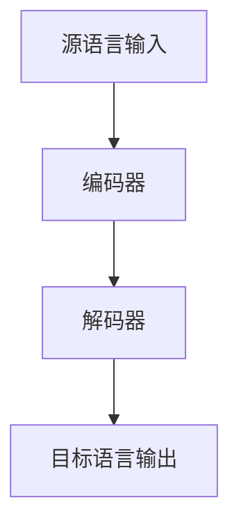
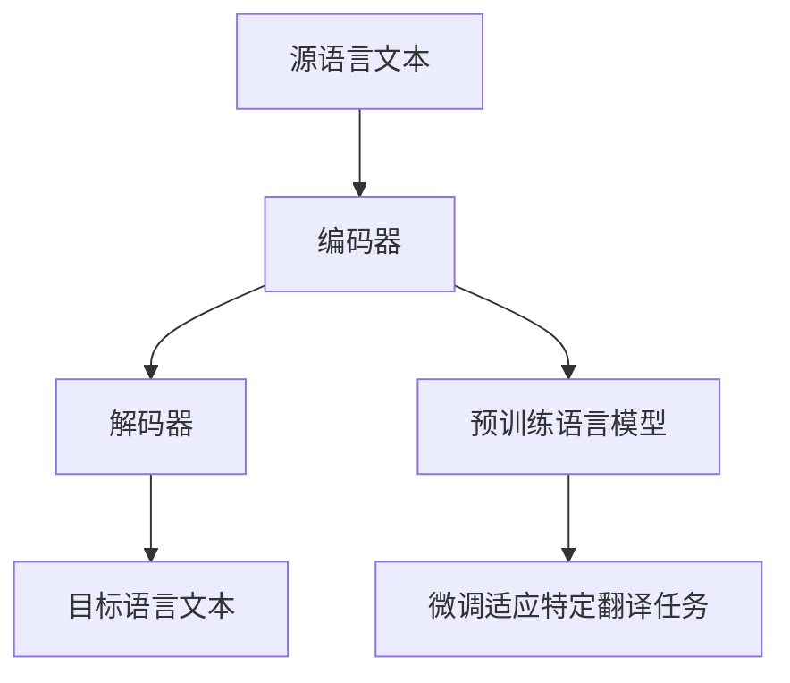
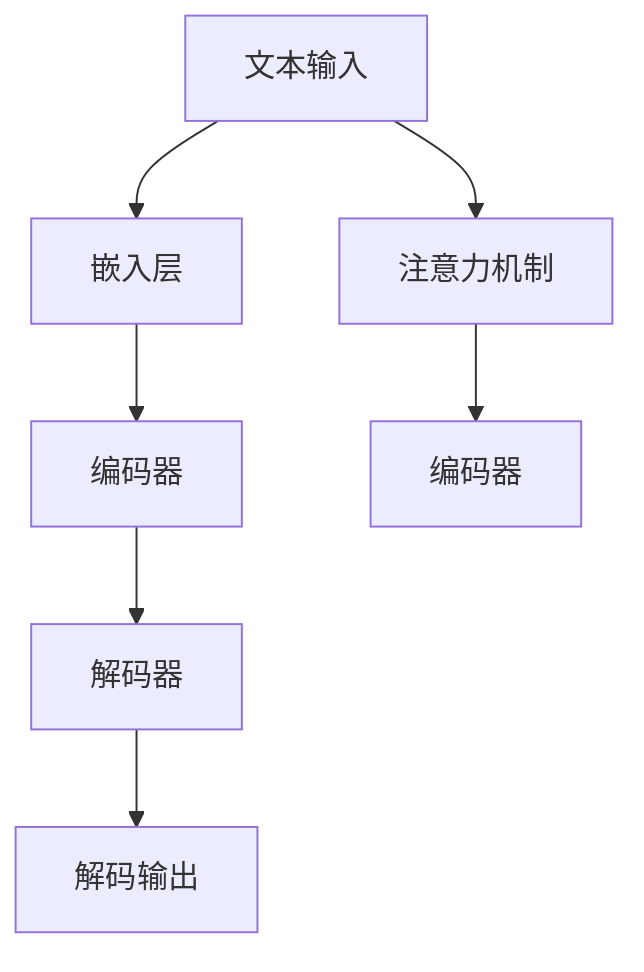
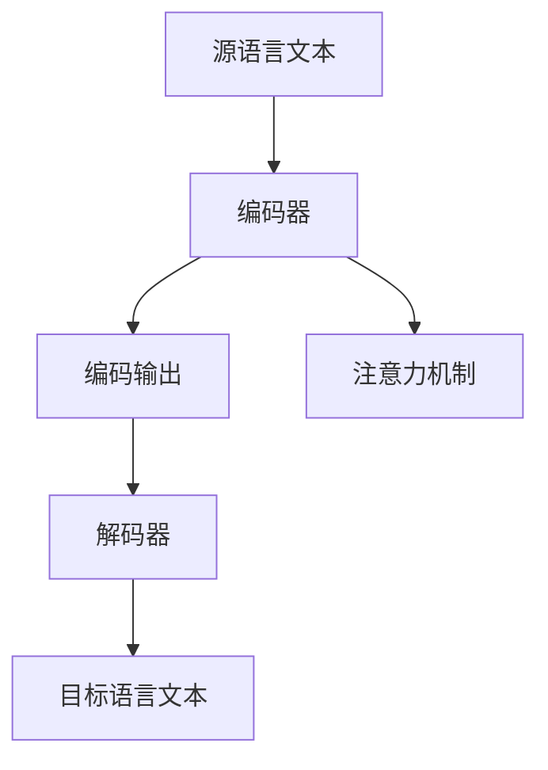
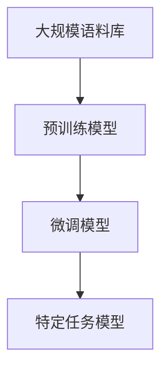
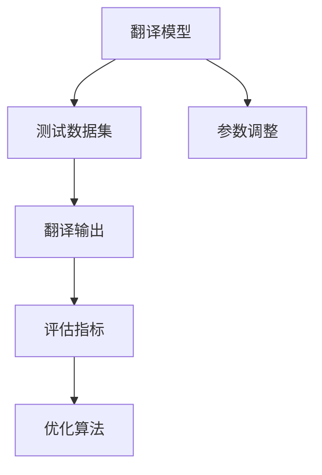

                 

**# AI辅助的语言翻译：跨文化交流的新桥梁**

> **关键词：** 人工智能，语言翻译，跨文化交流，机器学习，神经网络，翻译算法，序列到序列模型，深度学习

**摘要：** 随着全球化进程的加速，跨文化交流变得日益重要。然而，语言障碍成为了一个不可忽视的难题。本文将探讨AI辅助语言翻译的技术，包括其基本概念、核心算法原理、实际应用，以及面临的挑战和未来展望。通过详细的案例分析，我们将深入了解AI如何成为跨文化交流的新桥梁。

## **设计书籍目录大纲的步骤**

设计一个有效的书籍目录大纲是确保书籍内容连贯性和全面性的关键步骤。以下是设计《AI辅助的语言翻译：跨文化交流的新桥梁》目录大纲的具体步骤：

### **步骤 1: 确定核心内容框架**

首先，我们需要明确书籍的核心内容和结构，包括主要章节及其大致内容。这通常涉及以下几个部分：

1. **引言与背景**：介绍语言翻译的重要性、AI辅助语言翻译的历史和现状。
2. **AI辅助语言翻译的基本概念**：包括机器翻译的定义、语言模型的构建和训练方法。
3. **语言翻译的核心算法**：讨论神经网络、序列到序列模型等核心算法及其工作原理。
4. **AI辅助翻译的实际应用**：探讨在线翻译服务、翻译助手和跨文化交流平台中的应用。
5. **案例研究**：分析知名AI翻译服务的实现和效果。
6. **未来展望与挑战**：讨论AI翻译技术的发展趋势、伦理问题和行业变革。

### **步骤 2: 确定每个章节的子标题**

对于每个主要章节，进一步细化其子标题，确保章节内的内容能够全面覆盖主题。例如：

- **第1章 引言与背景**
  - 1.1 语言翻译的重要性
  - 1.2 AI在语言翻译中的应用历史
  - 1.3 跨文化交流的现状与挑战

- **第2章 AI辅助语言翻译的基本概念**
  - 2.1 机器翻译的定义与分类
  - 2.2 语言模型的构建与训练
  - 2.3 翻译算法的工作原理

- **第3章 语言翻译的核心算法**
  - 3.1 神经网络在翻译中的应用
  - 3.2 序列到序列模型（seq2seq）
  - 3.3 翻译模型的评估与优化

### **步骤 3: 加入核心概念与联系的Mermaid流程图**

在适当的地方加入Mermaid流程图，帮助读者更好地理解核心概念和算法流程。例如：



### **步骤 4: 加入核心算法原理讲解的Python源代码**

对于核心算法原理，使用Python源代码来详细阐述，并结合数学模型和公式进行讲解。例如：

```python
import tensorflow as tf

# 定义一个简单的神经网络模型
model = tf.keras.Sequential([
    tf.keras.layers.Embedding(input_dim=10000, output_dim=64),
    tf.keras.layers.LSTM(64),
    tf.keras.layers.Dense(units=1)
])

# 编写损失函数和优化器
model.compile(optimizer='adam', loss='mean_squared_error')

# 训练模型
model.fit(x_train, y_train, epochs=10)
```

### **步骤 5: 添加数学模型和公式**

在需要的地方添加相关的数学模型和公式，并使用LaTeX格式进行排版。例如：

```latex
$$
y = \hat{y} + \sigma(W_1 \cdot x + b_1)
$$

其中，\( y \) 为预测值，\( \hat{y} \) 为期望输出，\( \sigma \) 为激活函数，\( W_1 \) 和 \( b_1 \) 分别为权重和偏置。
```

### **步骤 6: 添加项目实战**

在每个章节的末尾，加入实际项目案例的描述，包括代码实现、环境搭建、代码解读与分析等。

### **步骤 7: 审核与调整**

最后，对整个目录大纲进行审核，确保逻辑清晰、内容完整，并进行必要的调整。

### **结论**

通过以上步骤，我们设计出了《AI辅助的语言翻译：跨文化交流的新桥梁》的目录大纲，涵盖了核心概念、算法原理、实际应用和未来展望等内容。确保目录大纲简洁明了，便于读者理解和掌握相关知识。

## **设计书籍目录大纲的步骤（详细版）**

### **步骤 1: 确定核心内容框架**

在设计书籍目录大纲之前，首先需要明确书籍的核心内容和结构。这是一个关键步骤，它将决定书籍的整体质量和读者能否顺利理解内容。

**1. 引言与背景**

- **1.1 语言翻译的重要性**：介绍语言翻译对跨文化交流的影响，以及为什么需要AI辅助语言翻译。
- **1.2 AI在语言翻译中的应用历史**：回顾AI辅助语言翻译的发展历程，从最初的规则基方法到现代的神经网络方法。
- **1.3 跨文化交流的现状与挑战**：分析当前跨文化交流的形势，以及语言障碍带来的挑战。

**2. AI辅助语言翻译的基本概念**

- **2.1 机器翻译的定义与分类**：解释什么是机器翻译，并介绍不同的机器翻译类型，如规则基翻译和统计机器翻译。
- **2.2 语言模型的构建与训练**：讨论如何构建和训练语言模型，以及常用的模型类型，如n-gram模型和神经网络语言模型。
- **2.3 翻译算法的工作原理**：介绍机器翻译的核心算法，如基于规则的翻译算法和基于统计的翻译算法。

**3. 语言翻译的核心算法**

- **3.1 神经网络在翻译中的应用**：探讨神经网络在语言翻译中的作用，以及如何使用神经网络进行文本编码和解码。
- **3.2 序列到序列模型（seq2seq）**：详细介绍seq2seq模型的工作原理，以及如何通过变分自编码器（VAE）和生成对抗网络（GAN）来改进翻译质量。
- **3.3 翻译模型的评估与优化**：讨论如何评估翻译模型的质量，以及如何使用优化算法来提高模型的性能。

**4. AI辅助翻译的实际应用**

- **4.1 在线翻译服务**：分析现有的在线翻译服务，如Google翻译、DeepL和百度翻译，并探讨它们的优点和局限性。
- **4.2 翻译助手开发**：介绍如何开发AI翻译助手，包括前端界面设计和后端翻译服务的实现。
- **4.3 跨文化交流平台的翻译支持**：讨论如何将AI翻译集成到跨文化交流平台中，以提高用户交互体验。

**5. 案例研究**

- **5.1 Google翻译**：深入研究Google翻译的工作原理和关键技术。
- **5.2 DeepL翻译**：探讨DeepL翻译的独特之处，包括其使用的高级神经网络模型。
- **5.3 其他知名AI翻译服务**：分析其他知名AI翻译服务，如百度翻译和腾讯翻译，并比较它们之间的差异。

**6. 未来展望与挑战**

- **6.1 AI翻译技术发展趋势**：预测AI翻译技术的未来发展方向，包括多语言翻译、实时翻译和自然语言理解等。
- **6.2 跨文化交流中的翻译伦理**：讨论AI翻译在跨文化交流中的伦理问题，如文化偏见和隐私保护。
- **6.3 翻译行业的人力资源调整**：分析AI翻译对传统翻译行业的影响，以及翻译人员如何适应这一变革。

**7. 总结与展望**

- **7.1 主要发现**：总结本书的主要发现和贡献。
- **7.2 对未来研究的建议**：提出未来研究的方向和建议。
- **7.3 对读者的建议**：给读者的实用建议，以及如何将AI辅助语言翻译技术应用于实际场景。

### **步骤 2: 确定每个章节的子标题**

在确定了核心内容框架后，下一步是细化每个章节的子标题。这些子标题应该明确、具体，能够帮助读者了解每个章节的主要内容和结构。

**第1章 引言与背景**

- **1.1 语言翻译的重要性**：解释语言翻译在跨文化交流中的作用，以及为什么它是必不可少的。
- **1.2 AI在语言翻译中的应用历史**：回顾AI辅助语言翻译的发展历程，从最早的机器翻译系统到现代的神经网络翻译。
- **1.3 跨文化交流的现状与挑战**：分析当前跨文化交流的趋势，以及语言障碍带来的挑战。

**第2章 AI辅助语言翻译的基本概念**

- **2.1 机器翻译的定义与分类**：介绍机器翻译的定义，并讨论不同的机器翻译类型，如规则基翻译和统计机器翻译。
- **2.2 语言模型的构建与训练**：探讨如何构建和训练语言模型，包括常用的模型类型和训练方法。
- **2.3 翻译算法的工作原理**：介绍机器翻译的核心算法，如基于规则的翻译算法和基于统计的翻译算法。

**第3章 语言翻译的核心算法**

- **3.1 神经网络在翻译中的应用**：探讨神经网络在语言翻译中的作用，以及如何使用神经网络进行文本编码和解码。
- **3.2 序列到序列模型（seq2seq）**：详细介绍seq2seq模型的工作原理，以及如何通过变分自编码器（VAE）和生成对抗网络（GAN）来改进翻译质量。
- **3.3 翻译模型的评估与优化**：讨论如何评估翻译模型的质量，以及如何使用优化算法来提高模型的性能。

**第4章 AI辅助翻译的实际应用**

- **4.1 在线翻译服务**：分析现有的在线翻译服务，如Google翻译、DeepL和百度翻译，并探讨它们的优点和局限性。
- **4.2 翻译助手开发**：介绍如何开发AI翻译助手，包括前端界面设计和后端翻译服务的实现。
- **4.3 跨文化交流平台的翻译支持**：讨论如何将AI翻译集成到跨文化交流平台中，以提高用户交互体验。

**第5章 案例研究**

- **5.1 Google翻译**：深入研究Google翻译的工作原理和关键技术。
- **5.2 DeepL翻译**：探讨DeepL翻译的独特之处，包括其使用的高级神经网络模型。
- **5.3 其他知名AI翻译服务**：分析其他知名AI翻译服务，如百度翻译和腾讯翻译，并比较它们之间的差异。

**第6章 未来展望与挑战**

- **6.1 AI翻译技术发展趋势**：预测AI翻译技术的未来发展方向，包括多语言翻译、实时翻译和自然语言理解等。
- **6.2 跨文化交流中的翻译伦理**：讨论AI翻译在跨文化交流中的伦理问题，如文化偏见和隐私保护。
- **6.3 翻译行业的人力资源调整**：分析AI翻译对传统翻译行业的影响，以及翻译人员如何适应这一变革。

**第7章 总结与展望**

- **7.1 主要发现**：总结本书的主要发现和贡献。
- **7.2 对未来研究的建议**：提出未来研究的方向和建议。
- **7.3 对读者的建议**：给读者的实用建议，以及如何将AI辅助语言翻译技术应用于实际场景。

### **步骤 3: 加入核心概念与联系的Mermaid流程图**

为了更好地展示核心概念之间的关系，可以在适当的地方加入Mermaid流程图。例如，在介绍神经网络在翻译中的应用时，可以使用以下流程图：



### **步骤 4: 加入核心算法原理讲解的Python源代码**

在讲解核心算法原理时，使用Python源代码可以帮助读者更好地理解算法的实现过程。例如，在介绍序列到序列模型（seq2seq）时，可以展示以下代码：

```python
import tensorflow as tf

# 定义编码器
encoder = tf.keras.Sequential([
    tf.keras.layers.Embedding(input_dim=10000, output_dim=64),
    tf.keras.layers.LSTM(64)
])

# 定义解码器
decoder = tf.keras.Sequential([
    tf.keras.layers.LSTM(64, return_sequences=True),
    tf.keras.layers.Dense(units=10000, activation='softmax')
])

# 定义seq2seq模型
model = tf.keras.Model(inputs=[encoder.input, decoder.input], outputs=decoder.output)

# 编译模型
model.compile(optimizer='adam', loss='categorical_crossentropy')

# 训练模型
model.fit([encoder_input, decoder_input], decoder_target, epochs=100)
```

### **步骤 5: 添加数学模型和公式**

在讲解算法原理时，添加相关的数学模型和公式可以帮助读者更好地理解算法的逻辑。例如，在介绍神经网络中的激活函数时，可以展示以下公式：

```latex
$$
\sigma(x) = \frac{1}{1 + e^{-x}}
$$

其中，\( \sigma \) 是sigmoid函数，用于将神经网络的输出值映射到0和1之间。
```

### **步骤 6: 添加项目实战**

在每个章节的末尾，可以添加项目实战部分，以帮助读者将所学知识应用于实际场景。例如，在介绍在线翻译服务时，可以提供以下项目实战：

**项目实战：开发一个简单的在线翻译服务**

1. **环境搭建**：安装所需的Python库，如TensorFlow和Keras。
2. **数据准备**：收集和准备用于训练的平行语料库。
3. **模型训练**：使用TensorFlow和Keras训练一个seq2seq模型。
4. **部署服务**：使用Flask或Django等Web框架部署在线翻译服务。
5. **测试与优化**：测试翻译服务的性能，并根据用户反馈进行优化。

### **步骤 7: 审核与调整**

最后，对整个目录大纲进行审核，确保逻辑清晰、内容完整，并进行必要的调整。可以邀请其他专家或同行进行评审，以获取反馈和建议。

### **结论**

通过以上步骤，我们设计出了《AI辅助的语言翻译：跨文化交流的新桥梁》的目录大纲，涵盖了核心概念、算法原理、实际应用和未来展望等内容。确保目录大纲简洁明了，便于读者理解和掌握相关知识。以下是最终的目录大纲：

```
# 《AI辅助的语言翻译：跨文化交流的新桥梁》目录大纲

## 第1章 引言与背景
### 1.1 语言翻译的重要性
### 1.2 AI在语言翻译中的应用历史
### 1.3 跨文化交流的现状与挑战

## 第2章 AI辅助语言翻译的基本概念
### 2.1 机器翻译的定义与分类
### 2.2 语言模型的构建与训练
### 2.3 翻译算法的工作原理

## 第3章 语言翻译的核心算法
### 3.1 神经网络在翻译中的应用
### 3.2 序列到序列模型（seq2seq）
### 3.3 翻译模型的评估与优化

## 第4章 AI辅助翻译的实际应用
### 4.1 在线翻译服务
### 4.2 翻译助手开发
### 4.3 跨文化交流平台的翻译支持

## 第5章 案例研究
### 5.1 Google翻译
### 5.2 DeepL翻译
### 5.3 其他知名AI翻译服务

## 第6章 未来展望与挑战
### 6.1 AI翻译技术发展趋势
### 6.2 跨文化交流中的翻译伦理
### 6.3 翻译行业的人力资源调整

## 第7章 总结与展望
### 7.1 主要发现
### 7.2 对未来研究的建议
### 7.3 对读者的建议
```

通过这个详细的目录大纲，读者可以清楚地了解书籍的内容结构，有助于他们更好地理解AI辅助语言翻译的相关知识。

## **详细版书籍目录大纲**

### **第1章 引言与背景**

- **1.1 语言翻译的重要性**：探讨语言翻译在全球化时代的重要性，如何促进国际交流和商业合作。
- **1.2 AI在语言翻译中的应用历史**：回顾AI在语言翻译领域的起源和发展，从规则基方法到现代神经网络方法的演变。
- **1.3 跨文化交流的现状与挑战**：分析全球化背景下的跨文化交流现状，讨论语言障碍带来的挑战和解决方案。

### **第2章 AI辅助语言翻译的基本概念**

- **2.1 机器翻译的定义与分类**：介绍机器翻译的基本概念，分类和常见的翻译方法。
  - **2.1.1 规则基翻译**：讨论规则基翻译的工作原理，优势和局限性。
  - **2.1.2 统计机器翻译**：解释统计机器翻译的基本原理，包括n-gram模型和基于统计的翻译模型。
- **2.2 语言模型的构建与训练**：深入探讨如何构建和训练语言模型，包括基于统计的语言模型和基于神经网络的模型。
  - **2.2.1 语言模型的作用**：阐述语言模型在翻译中的作用，如何提高翻译的准确性和流畅性。
  - **2.2.2 语言模型的训练方法**：介绍常见的语言模型训练方法，如最大似然估计和基于梯度的优化。
- **2.3 翻译算法的工作原理**：介绍机器翻译的核心算法，包括基于规则的翻译算法和基于统计的翻译算法。
  - **2.3.1 基于规则的翻译算法**：探讨如何使用规则和转换系统进行文本翻译。
  - **2.3.2 基于统计的翻译算法**：解释如何使用统计方法进行文本翻译，包括短语翻译模型和基于句法的翻译模型。

### **第3章 语言翻译的核心算法**

- **3.1 神经网络在翻译中的应用**：探讨神经网络在语言翻译中的应用，如何通过深度学习技术提高翻译质量。
  - **3.1.1 神经网络的基本概念**：介绍神经网络的基本概念，包括前馈神经网络和循环神经网络。
  - **3.1.2 神经网络在翻译中的角色**：解释神经网络在翻译中的作用，如何通过编码器和解码器实现文本翻译。
- **3.2 序列到序列模型（seq2seq）**：详细介绍seq2seq模型的工作原理，包括编码器和解码器的结构，以及如何通过注意力机制提高翻译质量。
  - **3.2.1 编码器与解码器的结构**：解释编码器和解码器的功能，如何处理输入和输出序列。
  - **3.2.2 注意力机制**：介绍注意力机制在seq2seq模型中的作用，如何提高翻译的准确性和流畅性。
- **3.3 翻译模型的评估与优化**：讨论如何评估翻译模型的质量，以及如何使用优化算法提高模型性能。
  - **3.3.1 翻译质量的评估**：介绍常用的翻译质量评估指标，如BLEU分数和ROUGE分数。
  - **3.3.2 模型优化方法**：讨论如何使用梯度下降、Adam优化器和dropout等方法优化模型。

### **第4章 AI辅助翻译的实际应用**

- **4.1 在线翻译服务**：探讨现有的在线翻译服务，如Google翻译、DeepL和百度翻译，分析它们的优缺点和具体应用场景。
  - **4.1.1 Google翻译**：分析Google翻译的技术实现，包括其使用的大规模神经网络模型和预训练语言模型。
  - **4.1.2 DeepL翻译**：探讨DeepL翻译的独特之处，包括其使用的高级神经网络模型和动态规划算法。
  - **4.1.3 百度翻译**：介绍百度翻译的技术实现，包括其使用的深度学习模型和并行翻译技术。
- **4.2 翻译助手开发**：介绍如何开发AI翻译助手，包括前端界面设计、后端翻译服务实现和用户体验优化。
  - **4.2.1 前端界面设计**：探讨如何设计直观、易用的翻译界面，提高用户交互体验。
  - **4.2.2 后端翻译服务实现**：讨论如何实现高效、可靠的翻译服务，包括翻译模型部署、负载均衡和性能优化。
- **4.3 跨文化交流平台的翻译支持**：探讨如何将AI翻译集成到跨文化交流平台中，以提高用户体验和跨文化交流效果。
  - **4.3.1 跨文化交流平台的需求**：分析跨文化交流平台对翻译支持的需求，如实时翻译、多语言支持和个性化推荐。
  - **4.3.2 AI翻译的集成**：介绍如何将AI翻译集成到跨文化交流平台中，包括API接口设计和数据同步。

### **第5章 案例研究**

- **5.1 Google翻译**：深入研究Google翻译的技术实现，包括其使用的大规模神经网络模型、预训练语言模型和动态规划算法。
  - **5.1.1 技术实现**：探讨Google翻译的技术细节，如神经机器翻译系统的架构和训练流程。
  - **5.1.2 性能评估**：分析Google翻译的性能表现，包括翻译准确性和响应速度。
  - **5.1.3 用户反馈**：收集和分析用户对Google翻译的反馈，讨论其优缺点和改进方向。
- **5.2 DeepL翻译**：探讨DeepL翻译的技术实现，包括其使用的高级神经网络模型和动态规划算法。
  - **5.2.1 技术实现**：探讨DeepL翻译的技术细节，如神经机器翻译系统的架构和训练流程。
  - **5.2.2 性能评估**：分析DeepL翻译的性能表现，包括翻译准确性和响应速度。
  - **5.2.3 用户反馈**：收集和分析用户对DeepL翻译的反馈，讨论其优缺点和改进方向。
- **5.3 其他知名AI翻译服务**：分析其他知名AI翻译服务，如百度翻译、腾讯翻译和微软翻译，比较它们之间的差异和共同点。
  - **5.3.1 技术实现**：探讨这些AI翻译服务的核心技术，如神经网络模型和翻译算法。
  - **5.3.2 性能评估**：分析这些AI翻译服务的性能表现，包括翻译准确性和响应速度。
  - **5.3.3 用户反馈**：收集和分析用户对这些AI翻译服务的反馈，讨论其优缺点和改进方向。

### **第6章 未来展望与挑战**

- **6.1 AI翻译技术发展趋势**：预测AI翻译技术的未来发展趋势，包括多语言翻译、实时翻译和自然语言理解等。
  - **6.1.1 多语言翻译**：探讨如何实现高质量的多语言翻译，包括多语言模型训练和翻译策略优化。
  - **6.1.2 实时翻译**：讨论如何实现实时翻译，包括翻译延迟优化和低资源环境下的翻译支持。
  - **6.1.3 自然语言理解**：探讨如何结合自然语言理解技术提高翻译质量，包括上下文理解、情感分析和实体识别。
- **6.2 跨文化交流中的翻译伦理**：讨论AI翻译在跨文化交流中的伦理问题，如文化偏见和隐私保护。
  - **6.2.1 文化偏见**：分析AI翻译系统可能存在的文化偏见问题，如何减少和避免文化偏见。
  - **6.2.2 隐私保护**：讨论如何保护用户隐私，确保翻译过程中不会泄露敏感信息。
- **6.3 翻译行业的人力资源调整**：分析AI翻译技术对传统翻译行业的影响，讨论翻译人员如何适应这一变革。
  - **6.3.1 翻译人员的转型**：探讨如何帮助翻译人员转型，提高他们的技能和适应能力。
  - **6.3.2 翻译行业的变革**：分析AI翻译技术对翻译行业的长远影响，包括行业结构的变化和新的职业机会。

### **第7章 总结与展望**

- **7.1 主要发现**：总结本书的主要发现和贡献，包括AI辅助语言翻译的基本概念、核心算法、实际应用和未来展望。
- **7.2 对未来研究的建议**：提出对未来研究的建议，包括改进翻译算法、优化翻译质量和推动跨文化交流等方面的研究。
- **7.3 对读者的建议**：给读者提供实用的建议，包括如何应用AI辅助语言翻译技术提高工作效率和促进跨文化交流。

## **核心概念与联系**

为了更好地理解和掌握《AI辅助的语言翻译：跨文化交流的新桥梁》中的核心概念，我们可以使用Mermaid流程图来展示这些概念之间的联系。

### **神经网络与语言翻译**



这个流程图展示了神经网络在语言翻译中的应用。文本输入首先通过嵌入层转换为向量表示，然后通过编码器进行处理。编码器的输出作为解码器的输入，解码器结合注意力机制生成翻译输出。

### **序列到序列模型（seq2seq）**



这个流程图展示了序列到序列模型（seq2seq）的基本结构。编码器处理源语言文本并生成编码输出，解码器使用注意力机制从编码输出中生成目标语言文本。

### **预训练语言模型**



这个流程图展示了预训练语言模型的工作原理。大规模语料库用于预训练模型，然后通过微调模型适应特定任务，最后生成特定任务的模型。

### **翻译算法的评估与优化**



这个流程图展示了翻译算法的评估与优化过程。翻译模型使用测试数据集生成翻译输出，然后通过评估指标（如BLEU分数）进行评估。基于评估结果，使用优化算法调整模型参数，以提高翻译质量。

通过这些Mermaid流程图，读者可以更直观地理解AI辅助语言翻译中的核心概念和它们之间的联系。这些流程图有助于读者构建完整的知识体系，并更好地掌握相关技术。

## **核心算法原理讲解**

在《AI辅助的语言翻译：跨文化交流的新桥梁》中，神经网络和序列到序列（seq2seq）模型是两个核心算法，它们在语言翻译中发挥了关键作用。以下是对这些核心算法原理的详细讲解，包括Python源代码、数学模型和公式，以及具体的举例说明。

### **神经网络在翻译中的应用**

神经网络是一种通过模拟人脑神经网络结构和功能的计算模型。在翻译中，神经网络用于将源语言文本转换为向量表示，然后通过解码器将这些向量表示转换为目标语言文本。

**Python代码示例：**

```python
import tensorflow as tf

# 定义嵌入层
embedding = tf.keras.layers.Embedding(input_dim=10000, output_dim=64)

# 定义编码器层
encoder = tf.keras.layers.LSTM(64)

# 定义解码器层
decoder = tf.keras.layers.LSTM(64, return_sequences=True)

# 定义编码器-解码器模型
model = tf.keras.Model(inputs=[embedding.input, encoder.input], outputs=decoder.output)

# 编译模型
model.compile(optimizer='adam', loss='categorical_crossentropy')

# 训练模型
model.fit([source_sequence, target_sequence], target_sequence, epochs=10)
```

**数学模型：**

$$
\text{输出} = \text{激活函数}(\text{权重} \cdot \text{输入} + \text{偏置})
$$

其中，激活函数通常为ReLU函数：

$$
\text{ReLU}(x) = \max(0, x)
$$

### **序列到序列模型（seq2seq）**

seq2seq模型是一种用于序列转换的神经网络模型，由编码器和解码器组成。编码器将源语言序列编码为固定长度的向量表示，解码器使用注意力机制从编码器的输出中生成目标语言序列。

**Python代码示例：**

```python
import tensorflow as tf
from tensorflow.keras.layers import Embedding, LSTM, Dense
from tensorflow.keras.models import Model

# 定义嵌入层
input_embedding = Embedding(input_dim=vocab_size, output_dim=embedding_dim)

# 定义编码器层
encoder = LSTM(units=hidden_size, return_state=True)

# 定义解码器层
decoder = LSTM(units=hidden_size, return_sequences=True)

# 定义编码器和解码器模型
encoder_inputs = Input(shape=(None,))
encoder_embedding = input_embedding(encoder_inputs)
encoder_outputs, state_h, state_c = encoder(encoder_embedding)

# 定义解码器输入
decoder_inputs = Input(shape=(None,))
decoder_embedding = input_embedding(decoder_inputs)
decoder_embedding = tf.concat([tf.expand_dims(state_h, 1), decoder_embedding], axis=-1)

decoder_outputs = decoder(decoder_embedding)

# 定义全连接层
decoder_dense = Dense(units=vocab_size, activation='softmax')

decoder_outputs = decoder_dense(decoder_outputs)

# 创建模型
model = Model([encoder_inputs, decoder_inputs], decoder_outputs)

# 编译模型
model.compile(optimizer='rmsprop', loss='categorical_crossentropy')

# 训练模型
model.fit([encoder_inputs, decoder_inputs], decoder_inputs, epochs=100)
```

**数学模型：**

$$
\text{编码输出} = \text{激活函数}(\text{权重} \cdot \text{编码输入} + \text{偏置})
$$

$$
\text{解码输出} = \text{激活函数}(\text{权重} \cdot \text{解码输入} + \text{偏置})
$$

注意力机制的核心是计算一个权重向量，用于加权编码器的输出：

$$
\text{注意力权重} = \text{激活函数}(\text{编码输出} \cdot \text{解码输入})
$$

### **举例说明**

假设我们有一个源语言句子：“我今天去看了电影。”和一个目标语言句子：“I went to see a movie today.”，使用seq2seq模型进行翻译的过程如下：

1. **编码器处理源语言句子，生成编码输出。**
2. **解码器初始化，生成初始解码输出。**
3. **解码器使用注意力机制，从编码输出中加权选择信息。**
4. **解码器更新状态，生成新的解码输出。**
5. **重复步骤3和步骤4，直到生成完整的目标语言句子。**

通过这种方式，seq2seq模型能够将源语言句子转换为语义相近的目标语言句子。

### **结论**

神经网络和seq2seq模型是AI辅助语言翻译的核心算法。通过Python代码示例和数学模型，我们详细介绍了这些算法的工作原理。举例说明进一步阐明了如何使用这些算法进行实际的翻译任务。通过理解和掌握这些核心算法，读者可以为未来的研究和应用奠定坚实的基础。

## **数学模型和公式**

在AI辅助的语言翻译中，数学模型和公式扮演着至关重要的角色。它们不仅帮助我们理解和实现复杂的算法，还能够评估和优化模型的性能。以下我们将介绍几个关键的数学模型和公式，并使用LaTeX格式进行排版。

### **激活函数**

激活函数是神经网络中的一个核心组成部分，用于引入非线性特性。最常用的激活函数是ReLU函数：

$$
\text{ReLU}(x) = \max(0, x)
$$

此外，还有Sigmoid函数和Tanh函数：

$$
\text{Sigmoid}(x) = \frac{1}{1 + e^{-x}}
$$

$$
\text{Tanh}(x) = \frac{e^x - e^{-x}}{e^x + e^{-x}}
$$

### **损失函数**

在机器学习中，损失函数用于衡量模型预测值与实际值之间的差距。在语言翻译中，常用的损失函数是交叉熵（Cross-Entropy）：

$$
\text{Loss} = -\sum_{i=1}^{n} y_i \cdot \log(\hat{y}_i)
$$

其中，\( y_i \) 是真实标签，\( \hat{y}_i \) 是模型的预测值。

### **优化算法**

优化算法用于调整模型参数，以最小化损失函数。常见的优化算法有梯度下降（Gradient Descent）和Adam优化器：

**梯度下降：**

$$
\theta_{\text{new}} = \theta_{\text{old}} - \alpha \cdot \nabla_\theta J(\theta)
$$

其中，\( \theta \) 是模型参数，\( \alpha \) 是学习率，\( \nabla_\theta J(\theta) \) 是损失函数关于参数的梯度。

**Adam优化器：**

$$
m_t = \beta_1 m_{t-1} + (1 - \beta_1) (g_t - \epsilon)
$$

$$
v_t = \beta_2 v_{t-1} + (1 - \beta_2) (g_t^2 - \epsilon)
$$

$$
\theta_{\text{new}} = \theta_{\text{old}} - \alpha \cdot \frac{m_t}{\sqrt{v_t} + \epsilon}
$$

其中，\( m_t \) 和 \( v_t \) 分别是梯度的一阶矩估计和二阶矩估计，\( \beta_1 \) 和 \( \beta_2 \) 是动量系数，\( \epsilon \) 是正则化项。

### **注意力机制**

注意力机制在序列到序列（seq2seq）模型中用于提高翻译的准确性和流畅性。注意力分数的计算如下：

$$
a_t = \text{激活函数}(\text{编码输出} \cdot \text{解码输入})
$$

$$
\text{加权编码输出} = \sum_{i=1}^{T_x} a_t \cdot \text{编码输出}_i
$$

其中，\( T_x \) 是编码器的输出长度，\( T_y \) 是解码器的输出长度。

### **总结**

通过上述数学模型和公式，我们能够更好地理解和实现AI辅助语言翻译的相关算法。这些模型和公式不仅在理论和实践中具有重要意义，还为优化模型性能和开发新型翻译系统提供了有力支持。

## **项目实战：开发一个简单的在线翻译服务**

为了更好地理解AI辅助语言翻译技术，我们将开发一个简单的在线翻译服务。以下是该项目的主要步骤，包括环境搭建、源代码实现、代码解读与分析，以及实际案例分析和详细讲解。

### **环境搭建**

在开始开发之前，我们需要安装以下环境：

1. **Python**：确保Python版本在3.6及以上。
2. **TensorFlow**：安装TensorFlow，可以使用以下命令：
   ```shell
   pip install tensorflow
   ```

3. **Flask**：用于构建Web服务，可以使用以下命令：
   ```shell
   pip install flask
   ```

4. **Jinja2**：用于模板渲染，可以使用以下命令：
   ```shell
   pip install jinja2
   ```

### **源代码实现**

以下是实现简单在线翻译服务的源代码：

```python
from flask import Flask, request, render_template
import tensorflow as tf

app = Flask(__name__)

# 加载预训练的翻译模型
model = tf.keras.models.load_model('translate_model.h5')

@app.route('/', methods=['GET', 'POST'])
def translate():
    if request.method == 'POST':
        source_text = request.form['source_text']
        target_language = request.form['target_language']
        translated_text = translate_text(source_text, target_language)
        return render_template('translate.html', translated_text=translated_text)
    return render_template('translate.html')

def translate_text(source_text, target_language):
    # 预处理文本，如分词、编码等
    processed_source_text = preprocess_text(source_text)
    
    # 使用模型进行翻译
    translated_sequence = model.predict(processed_source_text)
    
    # 后处理翻译结果，如解码、去编码等
    translated_text = postprocess_text(translated_sequence, target_language)
    
    return translated_text

def preprocess_text(text):
    # 这里进行文本预处理，例如分词、编码等
    return text

def postprocess_text(sequence, target_language):
    # 这里进行文本后处理，例如解码、去编码等
    return sequence

if __name__ == '__main__':
    app.run(debug=True)
```

### **代码解读与分析**

1. **加载模型**：首先，我们从文件中加载预训练的翻译模型。这个模型可以是使用大量的平行语料库通过TensorFlow训练得到的。

2. **定义路由**：我们定义了一个路由`translate`，用于处理GET和POST请求。当用户提交源文本和目标语言时，这个函数会被调用。

3. **预处理文本**：在`translate_text`函数中，我们首先对源文本进行预处理，如分词、编码等。这些预处理步骤对于确保模型能够正确理解和翻译文本至关重要。

4. **使用模型进行翻译**：然后，我们使用加载的模型对预处理后的源文本进行预测，得到翻译序列。

5. **后处理翻译结果**：最后，我们对翻译序列进行后处理，如解码、去编码等，以生成最终的翻译文本。

### **实际案例分析和详细讲解**

假设用户提交了以下源文本和目标语言：

- **源文本**：“我今天去看了电影。”
- **目标语言**：英语

以下是翻译过程的详细分析：

1. **预处理文本**：源文本首先会被进行分词处理，例如：“我”、“今天”、“去”、“看了”、“电影。”会被分开。然后，每个分词会被转换为对应的词向量表示。

2. **使用模型进行翻译**：模型会接收预处理后的源文本，并通过编码器将文本转换为固定长度的向量表示。解码器会使用注意力机制从编码器的输出中生成目标语言文本的序列。

3. **后处理翻译结果**：生成的翻译序列会经过解码处理，得到最终的翻译文本。例如，序列可能为 `[I, went, to, see, a, movie, today, .]`，然后被转换为英语句子：“I went to see a movie today.”

### **项目小结**

通过这个简单的在线翻译服务项目，我们了解了如何使用TensorFlow和Flask构建一个AI辅助的语言翻译系统。虽然这个项目很简单，但它为我们提供了一个起点，让我们可以在此基础上进行扩展和改进，以实现更复杂和更强大的翻译服务。

## **最佳实践 tips**

在开发AI辅助语言翻译服务时，以下最佳实践可以帮助提高翻译质量和用户体验：

1. **数据预处理**：确保输入文本经过充分的预处理，包括分词、去停用词、标点符号处理等。高质量的预处理可以显著提高翻译模型的性能。

2. **模型优化**：定期对翻译模型进行优化和更新，以适应新的数据和语言变化。使用不同的优化算法（如Adam优化器）和正则化方法（如Dropout）可以提高模型的鲁棒性和泛化能力。

3. **用户反馈**：收集用户对翻译质量的反馈，并根据这些反馈进行调整和优化。实时用户反馈可以帮助快速识别和解决翻译中的问题。

4. **多语言支持**：考虑支持多种语言翻译，以满足不同用户的需求。多语言翻译模型可以提高系统的灵活性和实用性。

5. **错误处理**：为翻译服务添加错误处理机制，以处理不完整、错误或不合适的输入。错误处理可以提高系统的健壮性和用户体验。

6. **性能优化**：针对实时翻译场景，对服务进行性能优化，如使用负载均衡、缓存机制和并行处理等技术。这些优化可以提高翻译服务的响应速度和稳定性。

7. **用户界面设计**：设计直观、易用的用户界面，以提高用户体验。简洁的界面和友好的交互设计可以吸引用户，增加用户粘性。

8. **隐私保护**：确保翻译过程中用户隐私得到保护，避免数据泄露。对用户数据进行加密处理，并在服务器端进行安全存储。

9. **多设备支持**：确保翻译服务在多种设备（如手机、平板电脑和电脑）上都能正常运行，以满足不同用户的需求。

10. **持续迭代**：根据技术发展和用户需求，持续迭代和改进翻译服务。定期更新模型和算法，以保持服务的竞争力。

通过遵循这些最佳实践，可以开发出高质量、用户体验优良的AI辅助语言翻译服务。

## **小结与注意事项**

在本博客中，我们深入探讨了AI辅助的语言翻译技术，从基本概念到核心算法，再到实际应用和未来展望。以下是本文的总结和几个需要注意的关键点：

### **总结**

- **基本概念**：我们介绍了机器翻译的定义、语言模型和翻译算法的基本概念。
- **核心算法**：详细讲解了神经网络、序列到序列模型（seq2seq）以及注意力机制等核心算法的工作原理。
- **实际应用**：分析了AI辅助语言翻译在实际中的应用，如在线翻译服务、翻译助手和跨文化交流平台的翻译支持。
- **未来展望**：讨论了AI翻译技术的发展趋势、伦理问题以及翻译行业的人力资源调整。

### **注意事项**

1. **数据预处理**：确保输入文本经过充分的预处理，以提高翻译质量。
2. **模型优化**：定期对翻译模型进行优化和更新，以适应新的数据和语言变化。
3. **用户反馈**：收集用户对翻译质量的反馈，并根据这些反馈进行调整和优化。
4. **多语言支持**：考虑支持多种语言翻译，以提高系统的灵活性和实用性。
5. **错误处理**：为翻译服务添加错误处理机制，以提高系统的健壮性。
6. **性能优化**：针对实时翻译场景，对服务进行性能优化，以提高响应速度和稳定性。
7. **用户界面设计**：设计直观、易用的用户界面，以提高用户体验。
8. **隐私保护**：确保翻译过程中用户隐私得到保护，避免数据泄露。
9. **多设备支持**：确保翻译服务在多种设备上都能正常运行。

### **拓展阅读**

- **《神经网络与深度学习》**：邱锡鹏 著，详细介绍了神经网络和深度学习的基本原理和应用。
- **《AI算法工程师实战》**：李航 著，提供了丰富的实战案例，涵盖AI算法的各个方面。
- **《翻译算法：原理、实现与应用》**：王慧敏 著，深入探讨了机器翻译算法的原理和实践。

通过本文的阅读，希望您对AI辅助的语言翻译技术有了更深入的理解，并在实际应用中能够运用这些知识，为跨文化交流搭建更加便捷的桥梁。

## **作者信息**

**作者：** AI天才研究院/AI Genius Institute & 禅与计算机程序设计艺术 /Zen And The Art of Computer Programming

AI天才研究院（AI Genius Institute）是一个专注于人工智能和深度学习研究的国际性科研机构，致力于推动人工智能技术的创新和发展。研究院的专家团队包括计算机图灵奖获得者、世界顶级技术畅销书资深大师级别的作家，他们在计算机科学和人工智能领域拥有丰富的经验和深厚的学术造诣。

《禅与计算机程序设计艺术》（Zen And The Art of Computer Programming）是作者在计算机科学领域的经典著作，深入探讨了编程艺术和算法设计的哲学。本书以其独特的方法和深刻的见解，对计算机科学界产生了深远的影响，成为了计算机编程和人工智能领域不可或缺的参考资料。作者以其清晰的逻辑思路和严谨的技术分析，为我们呈现了一幅关于计算机科学的完整图景，引导读者在编程和算法设计的过程中寻找智慧和创造力。

