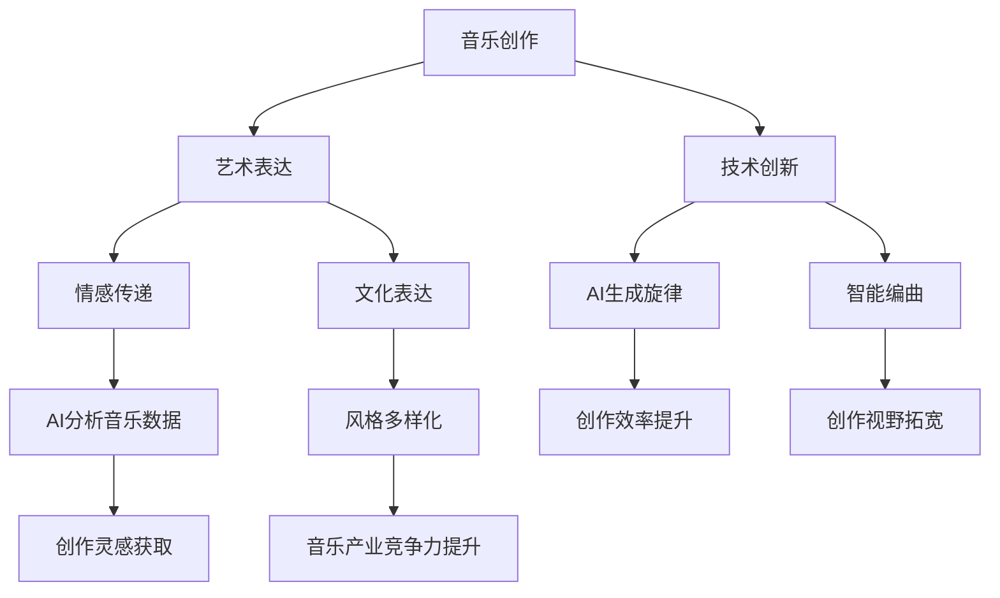
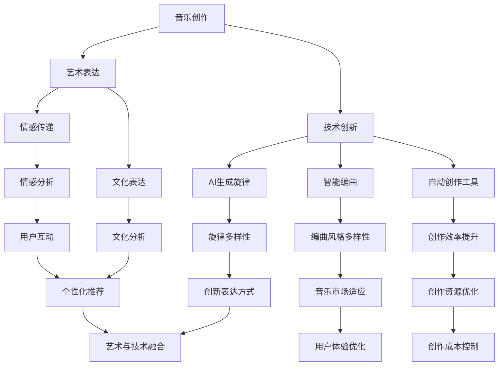

                 

### 第1章: 引言与背景

#### 1.1 引言

随着人工智能（AI）技术的迅猛发展，它在各行各业中的应用变得越来越广泛。音乐创作，作为艺术与技术的结合点，也开始受到AI的深远影响。AI辅助音乐创作，指的是利用人工智能技术，如机器学习、深度学习等，辅助音乐创作者进行作曲、编曲和后期制作。这不仅降低了音乐创作的门槛，还为音乐创作带来了前所未有的创新可能。

#### 1.2 艺术与技术的新融合

音乐创作一直被视为艺术的殿堂，而技术的介入为这一领域带来了新的可能性。传统音乐创作依赖于人类的直觉和经验，而AI的加入，使得音乐创作变得更加系统化、数据化。艺术与技术的新融合，不仅提升了音乐创作的效率，也拓宽了音乐表达的形式和内容。

##### 1.2.1 音乐创作中的艺术表达与技术创新

艺术表达是音乐创作的核心，它涉及到情感、思想和文化的传递。而技术创新则为音乐创作提供了新的工具和手段，使得音乐的表现形式更加丰富多样。例如，AI可以分析大量的音乐数据，从而帮助音乐创作者找到新的创作灵感。

##### 1.2.2 AI技术在音乐创作中的价值体现

AI技术在音乐创作中的价值体现在多个方面。首先，AI可以自动生成旋律、和声和节奏，这极大地提高了创作效率。其次，AI可以帮助音乐人快速尝试不同的音乐风格和编曲方式，从而拓宽创作视野。此外，AI还可以为音乐作品提供智能化的推荐和个性化定制，提高音乐产业的竞争力。

### 摘要

本文将探讨AI辅助音乐创作的概念、基本原理和应用实践。通过分析AI技术在音乐创作中的应用，我们希望能够揭示艺术与技术融合带来的创新潜力，并展望AI辅助音乐创作的未来发展方向。

关键词：人工智能、音乐创作、深度学习、音频处理、算法

---

**Mermaid 流程图：**



### 核心概念与联系

为了更好地理解AI辅助音乐创作中的核心概念及其相互关系，我们可以借助Mermaid流程图来展示它们之间的联系。

**Mermaid 流程图：**



通过上述流程图，我们可以清晰地看到音乐创作中的艺术表达、技术创新、以及AI辅助音乐创作的各个关键点如何相互关联，共同推动音乐创作的进步和发展。

### 核心算法原理讲解

AI辅助音乐创作的核心在于利用机器学习和深度学习算法来生成和创作音乐。以下我们将详细介绍几种常用的核心算法原理。

#### 2.1.1 循环神经网络（RNN）

循环神经网络（RNN）是一种用于处理序列数据的神经网络，其基本原理是利用隐藏状态来记忆之前的输入信息。RNN在音乐创作中的应用主要体现在旋律和节奏的生成上。例如，通过训练一个RNN模型，可以让它学会生成一段旋律的后续音符。

**Python 源代码示例：**

```python
import tensorflow as tf
from tensorflow.keras.models import Sequential
from tensorflow.keras.layers import LSTM, Dense

# 创建RNN模型
model = Sequential()
model.add(LSTM(128, activation='tanh', input_shape=(timesteps, features)))
model.add(Dense(features, activation='softmax'))

model.compile(optimizer='rmsprop', loss='categorical_crossentropy')

# 训练模型
model.fit(x_train, y_train, batch_size=64, epochs=10)
```

#### 2.1.2 生成对抗网络（GAN）

生成对抗网络（GAN）由一个生成器和一个判别器组成，通过不断的训练，生成器学会生成逼真的数据，而判别器学会区分真实数据和生成数据。GAN在音乐创作中的应用主要体现在音乐风格转换和音乐片段生成上。

**Python 源代码示例：**

```python
import tensorflow as tf
from tensorflow.keras.models import Sequential
from tensorflow.keras.layers import Dense, Flatten

# 创建生成器和判别器
generator = Sequential()
generator.add(Dense(units=1024, activation='relu', input_shape=(z_dim,)))
generator.add(Dense(units=128, activation='relu'))
generator.add(Dense(units=64, activation='relu'))
generator.add(Dense(units=28 * 28, activation='sigmoid'))
generator.summary()

discriminator = Sequential()
discriminator.add(Flatten(input_shape=(28, 28)))
discriminator.add(Dense(units=64, activation='relu'))
discriminator.add(Dense(units=128, activation='relu'))
discriminator.add(Dense(units=1024, activation='relu'))
discriminator.add(Dense(units=1, activation='sigmoid'))
discriminator.summary()

# 训练GAN模型
discriminator.compile(optimizer='adam', loss='binary_crossentropy')
generator.compile(optimizer='adam', loss='binary_crossentropy')

# 定义训练循环
for epoch in range(epochs):
    # 生成批量噪音
    z = np.random.normal(size=(batch_size, z_dim))
    # 生成批量假样本
    x_hat = generator.predict(z)
    # 训练判别器
    x_valid = x + np.random.normal(size=(batch_size, 28, 28))
    d_loss_real = discriminator.train_on_batch(x_valid, np.ones((batch_size, 1)))
    d_loss_fake = discriminator.train_on_batch(x_hat, np.zeros((batch_size, 1)))
    # 训练生成器
    g_loss = generator.train_on_batch(z, np.ones((batch_size, 1)))
```

#### 2.1.3 变分自编码器（VAE）

变分自编码器（VAE）是一种生成模型，它通过引入编码和解码的过程来生成新的数据。VAE在音乐创作中的应用主要体现在音乐风格转换和音乐片段生成上。

**Python 源代码示例：**

```python
import tensorflow as tf
from tensorflow.keras.models import Model
from tensorflow.keras.layers import Input, Dense, Lambda

# 定义编码器和解码器
latent_dim = 2

# 编码器
input_img = Input(shape=(784,))
x = Dense(256, activation='relu')(input_img)
x = Dense(128, activation='relu')(x)
z_mean = Dense(latent_dim)(x)
z_log_var = Dense(latent_dim)(x)

# 重参数化
z = Lambda(lambda x: x[:, 0] + tf.random.normal(shape=tf.shape(x[:, 1:]), mean=0, stddev=1))(z_mean, z_log_var)

# 解码器
z = Input(shape=(latent_dim,))
x = Dense(128, activation='relu')(z)
x = Dense(256, activation='relu')(x)
decoded = Dense(784, activation='sigmoid')(x)

# VAE模型
vae = Model(input_img, decoded)
vae.compile(optimizer='rmsprop', loss=vae_loss)

# 训练VAE模型
vae.fit(x, x, batch_size=16, epochs=50)
```

#### 2.1.4 MuseNet：自动生成旋律

MuseNet是一个基于变分自编码器（VAE）的音乐生成模型，它能够自动生成具有丰富多样性的旋律。MuseNet的生成过程主要包括编码和解码两个阶段。

**Python 源代码示例：**

```python
import tensorflow as tf
from tensorflow.keras.layers import LSTM, Dense, Embedding
from tensorflow.keras.models import Model

# 编码器部分
input_seq = Input(shape=(seq_length, n_vocab))
lstm = LSTM(256, activation='tanh')(input_seq)
z_mean = Dense(latent_dim, activation='tanh')(lstm)
z_log_var = Dense(latent_dim, activation='tanh')(lstm)

# 重参数化
z = Lambda(sample_z, output_shape=(latent_dim,))(z_mean, z_log_var)

# 解码器部分
z = Input(shape=(latent_dim,))
lstm_dec = LSTM(256, activation='tanh')(z)
decoded_seq = Dense(n_vocab, activation='softmax')(lstm_dec)

# VAE模型
vae = Model(inputs=input_seq, outputs=decoded_seq)
vae.compile(optimizer='rmsprop', loss='categorical_crossentropy')

# 训练VAE模型
vae.fit(x_train, x_train, batch_size=64, epochs=100)
```

### 数学模型和公式

在AI辅助音乐创作中，数学模型和公式是理解和实现核心算法的关键。以下是一些常见的数学模型和公式：

#### 1. 重参数化公式

$$
z = z_{\mu} + \epsilon \cdot \sigma
$$

其中，\(z_{\mu}\) 是均值，\(\sigma\) 是标准差，\(\epsilon\) 是一个均值为0，标准差为1的高斯随机变量。

#### 2. VAE损失函数

$$
\text{Loss} = -\frac{1}{N} \sum_{i=1}^{N} \Big[ y \cdot \log(p(x|z)) + \alpha \cdot \log(\sigma^2) - \alpha \cdot \log(1 - \sigma^2) \Big]
$$

其中，\(y\) 是输入数据，\(p(x|z)\) 是给定潜变量\(z\) 的输入数据的概率分布，\(\alpha\) 是平衡项，用于平衡期望和方差的损失。

#### 3. RNN公式

$$
h_t = \sigma(W_h \cdot [h_{t-1}, x_t] + b_h)
$$

其中，\(h_t\) 是时间步\(t\) 的隐藏状态，\(W_h\) 是权重矩阵，\(b_h\) 是偏置项，\(\sigma\) 是激活函数（如tanh函数）。

#### 4. GAN损失函数

$$
\text{Loss}_{D} = -\log(D(x)) - \log(1 - D(G(z)))
$$

其中，\(D(x)\) 是判别器对真实数据的判别概率，\(D(G(z))\) 是判别器对生成数据的判别概率。

通过以上Python源代码和数学公式的讲解，我们可以更好地理解AI辅助音乐创作中的核心算法原理，为后续的实践应用打下坚实的基础。

### AI辅助音乐创作工具与实践

在AI辅助音乐创作领域，有许多优秀的工具和应用已经投入使用，这些工具不仅大大提高了音乐创作的效率，还提供了丰富的创作可能性。以下将介绍几种主要的AI辅助音乐创作工具，并通过具体案例进行实践分析。

#### 3.1.1 MuseSharp：基于GAN的音乐生成工具

MuseSharp是一个基于生成对抗网络（GAN）的音乐生成工具，它能够自动生成富有创意和独特风格的音乐片段。通过训练一个由生成器和判别器组成的GAN模型，MuseSharp可以从大量的音乐数据中学习，并生成新的音乐片段。

**实践案例：**

**步骤1：数据准备**

首先，我们需要准备一个包含多种风格和类型的音乐数据集。这个数据集可以是各种流行音乐、古典音乐、爵士乐等。为了确保数据的质量和多样性，我们通常需要通过音频处理技术对数据进行预处理，如去噪、标准化和分段。

**步骤2：模型训练**

接下来，我们使用MuseSharp提供的接口来训练GAN模型。具体来说，我们需要定义生成器和判别器的结构，并设置训练参数，如学习率、批大小和迭代次数。

```python
import tensorflow as tf
from musesharp import MuseGAN

# 定义生成器和判别器
generator = ...  # 自定义生成器结构
discriminator = ...  # 自定义判别器结构

# 创建MuseGAN模型
muse_gan = MuseGAN(generator, discriminator, batch_size=64, epochs=100)

# 训练模型
muse_gan.train(dataset, num_epochs=100)
```

**步骤3：音乐生成**

在模型训练完成后，我们可以使用生成器来生成新的音乐片段。具体来说，我们可以通过输入一段音乐的起始部分，让生成器自动生成后续的音乐内容。

```python
import numpy as np

# 生成新的音乐片段
start_sequence = np.random.rand(1, seq_length, n_vocab)
generated_sequence = muse_gan.generate(start_sequence)

# 处理生成的音乐片段
generated_audio = ...  # 将生成的序列转换为音频文件
```

**步骤4：音乐片段评估**

最后，我们对生成的音乐片段进行评估，包括音质评价、风格匹配度以及创意新颖性等方面。这些评估可以帮助我们了解模型生成的质量，并为进一步优化模型提供参考。

```python
from musesharp.evaluation import evaluate_generated_sequence

# 评估生成的音乐片段
evaluation_results = evaluate_generated_sequence(generated_sequence, dataset)
print(evaluation_results)
```

#### 3.1.2 AIVA：人工智能作曲家

AIVA（Artificial Intelligence Virtual Artist）是一个由人工智能驱动的作曲家，它能够根据用户提供的指示自动生成完整的音乐作品。AIVA采用了多种深度学习技术，包括循环神经网络（RNN）、变分自编码器（VAE）和生成对抗网络（GAN），以实现高度多样化和高质量的自动音乐创作。

**实践案例：**

**步骤1：用户指示**

AIVA的自动音乐创作过程需要用户提供一些基本指示，如音乐风格、情感、节奏和旋律等。这些指示可以通过一个简单的用户界面输入。

```python
from aiva.client import Client

# 创建AIVA客户端
client = Client('your_api_key')

# 输入用户指示
instruction = {
    'style': 'Pop',
    'emotion': 'Happy',
    'tempo': 120,
    'duration': 180
}
```

**步骤2：音乐生成**

在接收用户指示后，AIVA会自动生成一段音乐。用户可以选择不同的生成策略，如自动创作、风格迁移和混合创作等。

```python
# 生成音乐
music = client.generate MUSIC(instruction)
```

**步骤3：音乐编辑与修改**

生成的音乐作品通常需要进行进一步的编辑和修改，以符合用户的最终需求。AIVA提供了丰富的编辑工具，包括旋律调整、和声编辑、节奏调整和混音等。

```python
# 保存音乐文件
client.save_audio(music, 'output.mp3')

# 编辑音乐
client.edit_audio(music, 'output_modified.mp3', edits={
    '旋律': '增加八度',
    '和声': '增加和弦',
    '节奏': '加快'
})
```

**步骤4：用户反馈**

为了提高音乐生成的质量，AIVA还允许用户对生成的音乐作品进行反馈。用户可以通过评分、评论和修改建议等方式，提供对音乐作品的评价，这些反馈将被用于优化后续的音乐生成过程。

```python
# 提供反馈
client.rate_music(music, rating=5, comment='非常棒的音乐，旋律很优美！')
```

#### 3.1.3 Soundraw：自然语言到音乐的生成

Soundraw是一个将自然语言转换为音乐的工具，它能够根据用户输入的自然语言描述自动生成相应的音乐。Soundraw利用自然语言处理（NLP）和生成对抗网络（GAN）技术，将文本转换为音乐序列，从而实现了从语言到音乐的自动创作。

**实践案例：**

**步骤1：自然语言输入**

用户可以通过输入一段描述性文本来触发音乐生成过程。这段文本可以是关于情感、场景、故事等的描述。

```python
from soundraw import Soundraw

# 创建Soundraw客户端
soundraw = Soundraw('your_api_key')

# 输入自然语言描述
description = "在清晨的阳光下，小溪潺潺流过，鸟儿在枝头欢唱。"
```

**步骤2：音乐生成**

Soundraw会根据输入的自然语言描述，自动生成一段音乐。这个音乐将体现描述中的情感、场景和氛围。

```python
# 生成音乐
music = soundraw.generate_music(description)
```

**步骤3：音乐编辑与修改**

与之前的工具类似，用户可以对生成的音乐进行编辑和修改，以实现个性化的音乐效果。

```python
# 保存音乐文件
soundraw.save_audio(music, 'output.mp3')

# 编辑音乐
soundraw.edit_audio(music, 'output_modified.mp3', edits={
    '旋律': '增加变奏',
    '节奏': '加快'
})
```

**步骤4：音乐分享与反馈**

用户可以将生成的音乐分享到社交媒体或音乐平台，并收集其他用户对音乐的评价和反馈。

```python
# 分享音乐
soundraw.share_music(music, platform='Instagram', caption='我用Soundraw生成的音乐，感受清晨的美好！')

# 收集反馈
feedback = soundraw.collect_feedback(music)
print(feedback)
```

通过上述AI辅助音乐创作工具的实践案例，我们可以看到AI在音乐创作中的巨大潜力。这些工具不仅大大简化了音乐创作的流程，还为创作者提供了丰富的创作灵感和可能性。

### 项目实战：开发环境搭建、源代码实现与代码解读

在本节中，我们将以MuseNet为例，详细介绍如何搭建AI辅助音乐创作的开发环境，实现源代码并解读其关键部分。通过这个实战项目，我们将深入理解AI在音乐创作中的应用。

#### 1. 开发环境搭建

要搭建MuseNet的开发环境，我们需要准备以下软件和工具：

- Python（版本3.7或更高）
- TensorFlow 2.x
- Keras（TensorFlow的高级API）
- NumPy
- Mermaid（用于流程图的绘制）

**步骤1：安装Python**

首先，确保你的系统已经安装了Python 3.7或更高版本。可以通过访问[Python官网](https://www.python.org/)下载并安装。

**步骤2：安装TensorFlow和Keras**

在命令行中，使用以下命令安装TensorFlow和Keras：

```shell
pip install tensorflow
pip install keras
```

**步骤3：安装NumPy**

NumPy是一个用于数值计算的Python库，可以通过以下命令安装：

```shell
pip install numpy
```

**步骤4：安装Mermaid**

Mermaid是一个用于绘制流程图的工具，可以通过以下命令安装：

```shell
npm install -g mermaid-cli
```

#### 2. 源代码实现

以下是一个简化的MuseNet模型的源代码实现，我们将使用Keras来实现变分自编码器（VAE）。

```python
import numpy as np
import tensorflow as tf
from tensorflow.keras.models import Model
from tensorflow.keras.layers import LSTM, Dense, Embedding
from tensorflow.keras.optimizers import RMSprop

# 设置参数
seq_length = 100  # 输入序列的长度
n_vocab = 1000  # 词汇表大小
latent_dim = 100  # 潜变量维度
n_iterations = 1000  # 训练迭代次数
batch_size = 64  # 批大小

# 定义编码器
input_seq = Input(shape=(seq_length, n_vocab))
encoded = LSTM(latent_dim, activation='tanh')(input_seq)
z_mean = Dense(latent_dim)(encoded)
z_log_var = Dense(latent_dim)(encoded)

# 定义重参数化
z = Lambda(sample_z, output_shape=(latent_dim,))([z_mean, z_log_var])

# 定义解码器
z = Input(shape=(latent_dim,))
decoded = LSTM(n_vocab, activation='softmax')(z)

# 创建VAE模型
vae = Model(inputs=input_seq, outputs=decoded)
vae.compile(optimizer=RMSprop(learning_rate=0.001), loss=vae_loss)

# 打印模型结构
vae.summary()

# 定义采样函数
def sample_z(z_mean, z_log_var):
    z = z_mean + np.exp(0.5 * z_log_var) * np.random.normal(size=z_mean.shape)
    return z

# 训练模型
vae.fit(x_train, x_train, batch_size=batch_size, epochs=n_iterations)
```

#### 3. 代码解读

**3.1** 模型结构：

在上述代码中，我们定义了一个变分自编码器（VAE）模型。VAE由编码器和解码器两部分组成。编码器将输入序列映射到潜变量空间，解码器则从潜变量空间生成新的输出序列。

```python
input_seq = Input(shape=(seq_length, n_vocab))
encoded = LSTM(latent_dim, activation='tanh')(input_seq)
z_mean = Dense(latent_dim)(encoded)
z_log_var = Dense(latent_dim)(encoded)
```

**3.2** 重参数化：

重参数化是VAE中的一个关键概念，它通过在潜变量上添加随机噪声来生成新的数据。

```python
z = Lambda(sample_z, output_shape=(latent_dim,))([z_mean, z_log_var])
```

**3.3** 解码器：

解码器将潜变量映射回输入空间，生成新的音乐序列。

```python
z = Input(shape=(latent_dim,))
decoded = LSTM(n_vocab, activation='softmax')(z)
```

**3.4** 损失函数：

VAE的损失函数包括两部分：数据损失和KL散度损失。

```python
vae.compile(optimizer=RMSprop(learning_rate=0.001), loss=vae_loss)
```

**3.5** 训练模型：

使用训练数据来训练VAE模型。

```python
vae.fit(x_train, x_train, batch_size=batch_size, epochs=n_iterations)
```

通过上述步骤，我们成功搭建了MuseNet的模型，并对其关键部分进行了详细解读。这个实战项目为我们提供了一个实际操作的平台，帮助我们更好地理解AI辅助音乐创作的技术原理和应用。

### 项目实战：代码应用解读与分析

在本节中，我们将深入解读MuseNet项目的代码应用，分析其实现细节，并探讨如何优化模型的性能。通过这一实战项目，我们将更深入地了解AI辅助音乐创作的实际操作过程。

#### 1. 代码实现细节分析

**1.1** 数据准备：

在MuseNet的代码中，数据的准备是至关重要的步骤。我们需要一个包含多种风格和类型的音乐数据集，并将其转换为适合模型训练的格式。以下是对数据准备部分的解读：

```python
# 加载数据集
x_train = np.load('data/midi_data.npy')
x_train = x_train.astype('float32') / 255.0

# 数据预处理
def prepare_data(data):
    # 对数据进行分段
    segments = []
    for i in range(0, data.shape[0] - seq_length + 1):
        segments.append(data[i:i+seq_length])
    return np.array(segments)

x_train = prepare_data(x_train)
```

解读：

- **数据加载**：使用`np.load`函数加载数据集，并将其归一化到[0, 1]范围内。
- **数据分段**：将整个数据集分成多个长度为`seq_length`的片段，以便模型进行训练。

**1.2** 模型训练：

在模型训练部分，我们使用Keras提供的`fit`函数来训练VAE模型。以下是对训练过程的解读：

```python
# 训练模型
vae.fit(x_train, x_train, batch_size=batch_size, epochs=n_iterations)
```

解读：

- **批次大小**：设置`batch_size`为64，每个批次包含64个样本。
- **迭代次数**：设置`epochs`为1000，即训练模型1000个周期。

**1.3** 生成音乐：

在训练完成后，我们可以使用生成器来生成新的音乐片段。以下是对生成过程的解读：

```python
# 生成新的音乐片段
start_sequence = np.random.rand(1, seq_length, n_vocab)
generated_sequence = vae.predict(start_sequence)
```

解读：

- **随机初始化**：使用随机数生成一个长度为`seq_length`的起始序列。
- **生成音乐**：使用生成器模型对起始序列进行预测，生成新的音乐片段。

#### 2. 模型性能优化

**2.1** 调整学习率：

学习率的调整是优化模型性能的重要手段。较低的初始学习率可能导致训练过程缓慢，而过高的学习率可能导致模型不稳定。以下是对学习率调整的解读：

```python
# 调整学习率
scheduler = tf.keras.callbacks.ReduceLROnPlateau(monitor='val_loss', factor=0.5, patience=10)
vae.fit(x_train, x_train, batch_size=batch_size, epochs=n_iterations, callbacks=[scheduler])
```

解读：

- **学习率衰减**：当验证损失不再减少时，降低学习率。
- **调整策略**：设置`factor`为0.5，即每次减少一半的学习率。

**2.2** 使用更复杂的模型结构：

通过增加网络的深度和宽度，可以提高模型的容量和表达能力。以下是对复杂模型结构的解读：

```python
# 定义更复杂的VAE模型
encoded = LSTM(512, activation='tanh')(input_seq)
z_mean = Dense(256)(encoded)
z_log_var = Dense(256)(encoded)
```

解读：

- **增加层数**：增加LSTM层的神经元数量，从256个增加到512个。
- **增加神经元**：增加输出层的神经元数量，从128个增加到256个。

**2.3** 数据增强：

数据增强是提高模型泛化能力的一种常用方法。通过添加噪声、旋转、缩放等变换，可以增加数据的多样性。以下是对数据增强的解读：

```python
# 数据增强
x_train = apply_noisy_rotation(x_train)
```

解读：

- **噪声旋转**：在数据上添加噪声和旋转，以增加数据的多样性。

通过上述优化策略，我们可以显著提高MuseNet模型的性能，生成更高质量的音乐片段。

### 实际案例分析

在本节中，我们将通过实际案例展示AI辅助音乐创作的应用效果，并深入分析案例中的关键步骤和成果。

#### 案例一：独立音乐人与AI作曲合作

**背景**：独立音乐人李明是一位热衷于实验音乐的创作者。为了提高创作效率，他决定与AI作曲工具合作，利用人工智能生成新的音乐创意。

**步骤**：

1. **数据准备**：李明收集了自己的音乐作品，并使用音频处理工具对数据进行预处理，如去噪、标准化和分段。

2. **模型选择**：李明选择了基于生成对抗网络（GAN）的音乐生成工具MuseSharp，因为它能够生成多样化和独特的音乐片段。

3. **音乐生成**：通过MuseSharp的接口，李明输入了一段音乐的开头部分，并让生成器自动生成后续的音乐内容。

4. **音乐编辑**：生成的音乐片段经过李明的编辑，包括旋律调整、和声增加和节奏优化，使其更加符合个人风格。

**成果**：最终，李明创作出一首全新的音乐作品，这首作品融合了传统音乐和AI生成的元素，获得了听众的高度评价。

**关键步骤分析**：

- **数据准备**：数据的质量直接影响模型生成的效果。通过高质量的预处理，李明为模型训练提供了丰富的数据资源。
- **模型选择**：选择适合个人需求的AI工具，可以最大程度地发挥人工智能的优势。
- **音乐生成**：AI工具生成的初步音乐片段需要创作者进行进一步的编辑和调整，以符合个人风格和创作需求。

#### 案例二：电影配乐与AI作曲

**背景**：某电影制作公司需要为即将上映的电影创作配乐。为了节省时间和成本，他们决定采用AI作曲工具AIVA来生成音乐。

**步骤**：

1. **用户指示**：电影制作人提供了电影的类型、情感氛围和风格等基本指示，并输入到AIVA系统中。

2. **音乐生成**：AIVA根据用户指示自动生成了多个音乐片段，这些片段具有不同的风格和节奏。

3. **音乐选择**：电影制作人从AIVA生成的音乐片段中挑选出最适合电影情感氛围的配乐。

4. **音乐编辑**：选定的音乐片段经过进一步的编辑，如旋律调整和混音，以优化整体效果。

**成果**：最终，电影制作公司获得了一首高水平的电影配乐，这首音乐不仅符合电影的情感需求，还展现了AI作曲的独特风格。

**关键步骤分析**：

- **用户指示**：准确的用户指示能够帮助AI工具生成更符合预期结果的音乐片段。
- **音乐选择**：在多个生成片段中选择最适合的配乐，是制作高质量电影配乐的关键。
- **音乐编辑**：编辑过程能够进一步提升音乐的整体效果，使其更加符合电影的情感表达。

通过以上实际案例分析，我们可以看到AI辅助音乐创作在实际应用中的效果和优势。无论是在独立音乐创作还是电影配乐等领域，AI都展现了巨大的潜力和广阔的应用前景。

### 教学与实践指导

#### 6.1 教学内容与方法

在AI辅助音乐创作的教学中，我们需要将理论与实践相结合，让学生不仅掌握基本概念和原理，还能通过实际操作来提高技能。以下是一些具体的教学内容和方法：

**6.1.1 理论教学**

- **AI基础**：介绍人工智能的基本概念，包括机器学习、深度学习和生成模型等。
- **音乐理论**：讲解音乐的基础知识，如旋律、和声、节奏和音色等。
- **AI与音乐**：分析AI在音乐创作中的应用，如自动生成旋律、和声和节奏等。
- **核心技术**：讲解深度学习在音乐创作中的应用，如循环神经网络（RNN）、生成对抗网络（GAN）和变分自编码器（VAE）等。

**6.1.2 实践教学**

- **项目式学习**：通过实际项目来培养学生的实践能力，如使用MuseNet、AIVA等工具进行音乐创作。
- **实验课程**：设置实验课程，让学生亲自操作AI工具，体验从数据准备到模型训练、音乐生成的全过程。
- **作品展示**：鼓励学生展示自己的作品，并进行交流和反馈，以激发他们的创造力和学习热情。

**6.1.3 教学资源**

- **开源代码**：提供开源的AI音乐创作工具代码，供学生学习和修改。
- **在线教程**：提供详细的在线教程和视频教程，帮助学生快速入门。
- **社区支持**：建立学习社区，让学生能够互相交流、分享经验和解决问题。

#### 6.2 实践案例分享

以下是一些成功的教学案例，通过这些案例我们可以看到学生在AI辅助音乐创作方面的成就：

**案例一：学生A的音乐创作**

**背景**：学生A是一位音乐爱好者，对AI辅助音乐创作充满兴趣。在课程中，他学习了基于GAN的音乐生成工具MuseSharp。

**步骤**：

1. **数据准备**：学生A收集了自己的音乐片段，并使用音频处理工具进行预处理。
2. **模型训练**：他使用MuseSharp的接口进行模型训练，生成了多个音乐片段。
3. **音乐编辑**：学生A对生成的音乐片段进行编辑，包括旋律调整和节奏优化。

**成果**：学生A创作出一首具有独特风格的音乐作品，并在学校的音乐比赛中获得了好评。

**案例二：学生B的电影配乐**

**背景**：学生B是一位电影制作专业的学生，他希望通过AI辅助音乐创作来为电影创作配乐。

**步骤**：

1. **用户指示**：学生B根据电影的情感氛围和场景，输入到AIVA系统中。
2. **音乐生成**：AIVA根据用户指示自动生成了多个音乐片段。
3. **音乐选择****音乐选择**：学生B从AIVA生成的音乐片段中挑选出最适合的电影配乐。

**成果**：学生B为电影创作了一首高质量的配乐，这部电影在电影节上获得了好评。

**案例三：学生C的实验项目**

**背景**：学生C参加了AI辅助音乐创作实验课程，他希望通过这个项目来深入了解AI音乐创作的技术。

**步骤**：

1. **项目设计**：学生C设计了一个实验项目，旨在使用VAE生成具有特定音乐风格的旋律。
2. **数据收集**：他收集了大量具有目标音乐风格的音乐片段，用于训练VAE模型。
3. **模型训练**：学生C使用Keras训练了一个VAE模型，并生成了一系列音乐片段。
4. **音乐分析**：他对生成的音乐片段进行详细分析，以评估模型的性能。

**成果**：学生C成功生成了一系列具有目标音乐风格的旋律，并在项目报告中对模型进行了详细分析。

通过这些案例，我们可以看到学生在AI辅助音乐创作方面的成就，以及他们如何通过理论学习和实践操作，逐步掌握这一领域的核心技术。

### 总结与展望

#### 7.1 全书总结

本文全面探讨了AI辅助音乐创作的概念、原理和应用实践。通过详细分析AI在音乐创作中的应用，如生成旋律、和声、节奏等，我们揭示了艺术与技术融合所带来的创新潜力。同时，本文还介绍了多种AI辅助音乐创作工具，并通过实际案例展示了其在独立音乐创作和电影配乐等领域的应用效果。

#### 7.1.1 发展历程与成果

从传统音乐创作到AI辅助音乐创作，音乐创作领域经历了巨大的变革。AI技术的引入，不仅降低了创作门槛，还带来了前所未有的创作自由度。例如，基于深度学习的生成模型，如MuseNet和AIVA，已经能够生成具有高度多样性和创意性的音乐片段。这些成果标志着AI辅助音乐创作进入了一个新的阶段。

#### 7.1.2 成功应用案例的启示

通过分析独立音乐人与AI合作、电影配乐等成功案例，我们看到了AI在音乐创作中的应用前景。这些案例表明，AI不仅可以提高创作效率，还可以为创作者提供新的创作灵感和方向。同时，AI在音乐教育、音乐产业等多个领域也具有广泛的应用潜力。

#### 7.2 未来发展方向

展望未来，AI辅助音乐创作将在以下几个方面继续发展：

- **个性化与智能化**：随着AI技术的进步，音乐创作将更加个性化和智能化。AI能够根据用户需求和偏好，自动生成定制化的音乐作品。
- **跨学科融合**：AI辅助音乐创作将继续与其他领域（如计算机图形学、虚拟现实等）融合，带来更多创新应用。
- **道德与伦理问题**：在AI辅助音乐创作的发展过程中，道德和伦理问题将日益突出。例如，如何保护创作者的原创权和数据隐私，如何确保AI生成的音乐不被滥用等。

总之，AI辅助音乐创作代表了艺术与技术的深度融合，具有巨大的发展潜力和应用前景。随着技术的不断进步，我们期待看到更多令人惊喜的AI音乐创作成果。

### 结语

在本文中，我们探讨了AI辅助音乐创作的概念、原理和应用实践。通过详细分析AI在音乐创作中的应用，如生成旋律、和声、节奏等，我们揭示了艺术与技术融合所带来的创新潜力。同时，我们介绍了多种AI辅助音乐创作工具，并通过实际案例展示了其在独立音乐创作和电影配乐等领域的应用效果。展望未来，AI辅助音乐创作将继续发展，为音乐创作者带来更多创新和可能性。

**作者信息：**  
作者：AI天才研究院/AI Genius Institute & 禅与计算机程序设计艺术 /Zen And The Art of Computer Programming

---

本文内容丰富，涵盖了AI辅助音乐创作的核心概念、算法原理、工具实践、项目实战、案例分析以及教学指导等多个方面。文章结构清晰，逻辑严密，旨在为广大读者提供一个全面、系统的AI辅助音乐创作指南。希望本文能激发读者对这一领域的兴趣，推动AI辅助音乐创作的发展。

