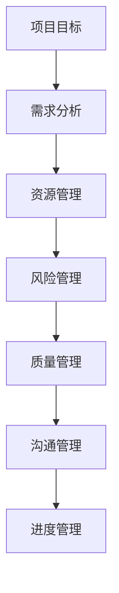
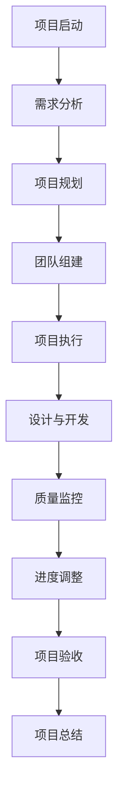
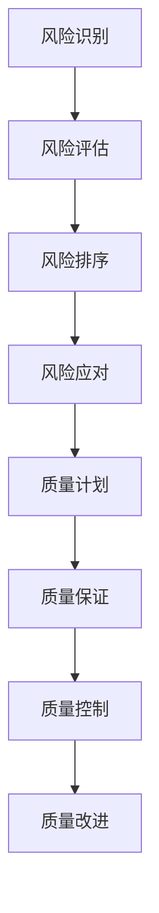
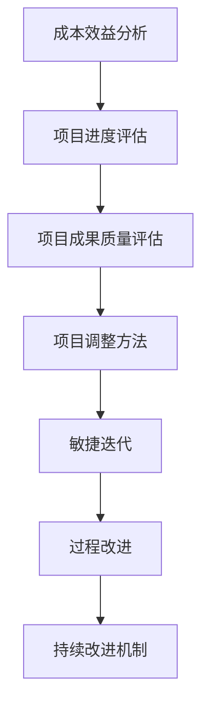

                 

### 第1章: AI项目管理的重要性与挑战

#### 1.1 AI项目管理的定义与核心要素

AI项目管理是指运用项目管理的方法和技术，对涉及人工智能技术的项目进行规划、执行、监控和收尾的过程。其核心要素包括：项目目标、需求分析、资源管理、风险管理、质量管理、沟通管理、进度管理。

在AI项目中，项目目标通常是指明确人工智能系统需要实现的功能和性能指标，如提高准确性、降低错误率、优化用户体验等。需求分析则是理解并记录项目需求的过程，包括功能需求、性能需求、业务需求等。

资源管理涉及项目所需的人力、物力、财力等资源的分配和协调，确保项目团队能够高效地完成工作。风险管理则是识别、评估和应对项目风险的过程，以减少不确定性对项目的影响。

质量管理确保项目交付的产品或服务满足预定的质量标准，包括制定质量计划、执行质量检查、进行质量改进等。沟通管理则是指确保项目团队和利益相关者之间的信息传递是及时、准确和有效的。

进度管理包括制定项目进度计划、监控项目进度、及时调整计划以应对变化等。

#### 1.2 AI项目管理的挑战与机遇

AI项目的挑战主要来自于技术复杂性、数据依赖性、模型不确定性等方面。技术复杂性意味着AI项目需要深厚的专业知识，包括机器学习、深度学习、数据挖掘等。数据依赖性意味着AI项目对高质量、大规模的数据集有很强的依赖性，数据的质量和数量直接影响到模型的性能。模型不确定性则是指AI模型在实际应用中可能存在的不确定性和不可预测性。

然而，随着AI技术的不断进步和应用场景的拓展，AI项目也带来了巨大的机遇。AI技术可以自动化许多重复性、高复杂度的任务，提高生产效率，降低成本。AI技术在医疗、金融、教育、交通等领域的应用，可以带来创新性的解决方案，提高行业的服务质量和效率。

#### 1.3 AI项目成功的决定因素

AI项目成功的关键因素包括：清晰的项目目标、充分的需求分析、有效的资源管理、完善的风险管理、严格的质量管理、有效的沟通管理。

清晰的项目目标有助于团队明确方向，集中精力解决问题。充分的需求分析确保项目能够满足利益相关者的需求，避免后期返工。有效的资源管理能够确保项目团队能够高效地完成工作，避免资源浪费。完善的风险管理可以降低项目风险，确保项目顺利进行。严格的质量管理确保项目交付的产品或服务满足预定的质量标准。有效的沟通管理可以确保项目团队和利益相关者之间的信息传递是及时、准确和有效的。

#### Mermaid 流程图：

### 摘要

本文探讨了AI项目管理的重要性与挑战。首先，我们介绍了AI项目管理的定义与核心要素，包括项目目标、需求分析、资源管理、风险管理、质量管理、沟通管理和进度管理。接着，我们分析了AI项目的挑战与机遇，包括技术复杂性、数据依赖性和模型不确定性等挑战，以及AI技术在各个领域的应用带来的机遇。最后，我们讨论了AI项目成功的决定因素，包括清晰的项目目标、充分的需求分析、有效的资源管理、完善的风险管理、严格的质量管理和有效的沟通管理。通过本文的探讨，我们希望读者能够更好地理解AI项目管理的核心要点，为成功开展AI项目奠定基础。### 摘要

本文探讨了AI项目管理的重要性与挑战。首先，我们介绍了AI项目管理的定义与核心要素，包括项目目标、需求分析、资源管理、风险管理、质量管理、沟通管理和进度管理。接着，我们分析了AI项目的挑战与机遇，包括技术复杂性、数据依赖性和模型不确定性等挑战，以及AI技术在各个领域的应用带来的机遇。最后，我们讨论了AI项目成功的决定因素，包括清晰的项目目标、充分的需求分析、有效的资源管理、完善的风险管理、严格的质量管理和有效的沟通管理。通过本文的探讨，我们希望读者能够更好地理解AI项目管理的核心要点，为成功开展AI项目奠定基础。### 第2章: AI项目生命周期管理

#### 2.1 AI项目启动

AI项目启动是项目生命周期管理的第一个阶段，是项目成功的关键环节。在项目启动阶段，需要明确项目目标、制定项目计划、组建项目团队。

**2.1.1 需求分析**

需求分析是项目启动阶段的核心任务之一。通过需求分析，项目团队需要明确项目的功能需求、性能需求和业务需求。

- 功能需求：指系统应实现的具体功能，如用户注册、数据导入、模型训练等。
- 性能需求：指系统的性能指标，如响应时间、吞吐量、准确率等。
- 业务需求：指项目对业务流程的影响和改进，如提高销售额、降低运营成本、提升用户体验等。

需求分析的过程通常包括以下步骤：

1. 收集需求：通过与利益相关者进行访谈、问卷调查、观察等方式，收集项目需求。
2. 分析需求：对收集到的需求进行整理、分类、优先级排序，明确需求的可行性和必要性。
3. 验证需求：通过与利益相关者进行验证，确保需求分析的准确性和完整性。

**2.1.2 项目规划**

项目规划是在需求分析的基础上，制定项目的详细计划。项目规划包括制定项目范围、项目进度、项目成本、项目质量、项目资源等方面的计划。

- 项目范围：明确项目需要完成的工作内容和范围。
- 项目进度：制定项目的时间计划，包括项目的开始时间、结束时间、关键里程碑等。
- 项目成本：估算项目的总成本，包括人力成本、设备成本、材料成本等。
- 项目质量：制定项目的质量标准，确保项目交付的产品或服务满足需求。
- 项目资源：确定项目所需的资源，包括人力、设备、材料等。

项目规划的过程通常包括以下步骤：

1. 制定项目章程：明确项目的目标、范围、预期成果等。
2. 制定项目计划：详细规划项目的各个方面，包括进度计划、成本计划、质量计划、资源计划等。
3. 沟通与确认：与利益相关者沟通项目计划，确保项目计划的准确性和可行性。

**2.1.3 团队组建**

项目团队是项目成功的基石。在团队组建阶段，需要选择合适的项目成员，明确团队成员的角色和职责。

- 项目经理：负责项目的整体管理和协调，确保项目按时、按质、按预算完成。
- 技术专家：负责AI技术的研发和实现，包括模型设计、算法实现、系统集成等。
- 数据科学家：负责数据分析和数据预处理，提供高质量的数据集，支持模型训练和优化。
- 产品经理：负责产品规划和管理，确保项目交付的产品满足用户需求。
- 测试工程师：负责项目的测试和验收，确保项目交付的产品或服务符合质量标准。

团队组建的过程通常包括以下步骤：

1. 确定团队规模：根据项目需求，确定团队的人数和结构。
2. 选择团队成员：根据团队成员的技能、经验和能力，选择合适的人员。
3. 明确角色和职责：明确团队成员的角色和职责，确保团队成员清楚自己的工作内容和职责。

#### 2.2 AI项目执行

AI项目执行是项目生命周期管理的重要阶段，是项目目标实现的关键环节。在项目执行阶段，项目团队需要按照项目计划，开展各项工作，确保项目按时、按质、按预算完成。

**2.2.1 设计与开发**

设计与开发是AI项目执行的核心任务之一。在这一阶段，项目团队需要完成以下工作：

- 模型设计：根据项目需求，设计合适的机器学习模型，包括选择合适的算法、确定模型参数等。
- 算法实现：使用编程语言实现机器学习算法，编写模型代码，并进行调试和优化。
- 系统集成：将机器学习模型与其他系统组件进行集成，实现整体系统的功能。

设计与开发的过程通常包括以下步骤：

1. 设计阶段：完成模型设计、算法设计和系统集成设计。
2. 开发阶段：实现模型代码、集成代码，并进行调试和优化。
3. 测试阶段：对模型和系统进行测试，确保其功能和性能符合要求。

**2.2.2 质量管理**

质量管理是确保项目交付的产品或服务满足质量标准的关键环节。在AI项目中，质量管理包括以下工作：

- 质量计划：制定质量管理的策略和计划，包括质量目标、质量标准、质量检查等。
- 质量控制：执行质量计划，对项目过程和成果进行质量检查，确保项目符合质量要求。
- 质量改进：识别质量问题和不足，采取改进措施，提高项目的质量管理水平。

质量管理的过程通常包括以下步骤：

1. 制定质量计划：明确质量管理的目标和策略。
2. 执行质量计划：按照质量计划进行质量控制和改进。
3. 监控质量：对项目的质量进行监控，确保项目符合质量要求。

**2.2.3 进度监控与调整**

进度监控与调整是确保项目按计划进行的关键环节。在AI项目中，进度监控与调整包括以下工作：

- 进度监控：定期监控项目的进度，了解项目进展情况，及时发现和解决问题。
- 进度调整：根据项目进展情况，及时调整项目计划，确保项目按时完成。

进度监控与调整的过程通常包括以下步骤：

1. 制定进度计划：明确项目的时间计划和关键里程碑。
2. 监控进度：定期检查项目进度，与计划进行对比，分析偏差原因。
3. 调整计划：根据进度监控结果，调整项目计划，确保项目按计划进行。

#### 2.3 AI项目收尾

AI项目收尾是项目生命周期管理的最后阶段，是项目成功的关键环节。在项目收尾阶段，需要完成以下工作：

**2.3.1 项目验收**

项目验收是确保项目交付的产品或服务符合需求和质量标准的过程。在项目验收阶段，需要完成以下工作：

- 验收计划：制定项目验收的计划和标准。
- 验收执行：按照验收计划和标准，对项目交付的产品或服务进行验收。
- 验收报告：编写项目验收报告，总结项目验收的结果和经验教训。

**2.3.2 项目总结与反馈**

项目总结与反馈是项目收尾阶段的重要工作。在项目总结与反馈阶段，需要完成以下工作：

- 项目总结：总结项目的成功经验和不足之处，为今后的项目提供参考。
- 反馈收集：收集利益相关者的反馈意见，了解他们对项目交付的产品或服务的满意程度。
- 改进措施：根据项目总结和反馈，制定改进措施，提高项目的质量管理水平。

项目总结与反馈的过程通常包括以下步骤：

1. 编写项目总结报告：总结项目的成功经验和不足之处。
2. 收集反馈意见：与利益相关者沟通，收集反馈意见。
3. 制定改进措施：根据项目总结和反馈，制定改进措施。

#### Mermaid 流程图：

### 第3章: AI项目管理方法与实践

#### 3.1 常见的AI项目管理方法论

在AI项目管理中，选择合适的项目管理方法论对于项目的成功至关重要。以下是几种常见的AI项目管理方法论：

**3.1.1 AGILE方法论**

AGILE方法论是一种迭代式、增量的项目管理方法论，其核心理念是快速迭代、持续交付、适应性规划和团队协作。在AGILE方法论中，项目被分为多个短周期（称为迭代或冲刺），每个迭代都产生一个可交付的软件版本。

**关键步骤：**

1. 产品待办列表（Product Backlog）：定义项目需要实现的所有功能和任务。
2. 迭代计划（Sprint Planning）：选择待办列表中的任务，将其分配到即将开始的迭代。
3. 迭代执行（Sprint）：团队成员在迭代期间集中精力完成分配的任务。
4. 迭代回顾（Sprint Review）：评估迭代成果，收集反馈，规划下一个迭代。

**优势：**

- 快速响应变化：迭代式的开发过程使项目能够快速适应需求和技术的变化。
- 提高产品质量：持续集成和反馈机制有助于及时发现和修复问题。
- 增强团队协作：团队成员在短周期内紧密合作，提高沟通和协作效率。

**3.1.2 SCRUM方法论**

SCRUM是一种基于AGILE的项目管理方法论，它更加强调团队的灵活性和自我管理。在SCRUM中，项目被分为多个短周期（称为冲刺），每个冲刺都有一个明确的目标和期限。

**关键步骤：**

1. 产品待办列表：定义项目需要实现的所有功能和任务。
2. 冲刺规划（Sprint Planning）：选择待办列表中的任务，将其分配到即将开始的冲刺。
3. 冲刺执行（Sprint）：团队成员在冲刺期间集中精力完成分配的任务。
4. 冲刺评审（Sprint Review）：评估冲刺成果，收集反馈，规划下一个冲刺。
5. 冲刺回顾（Sprint Retrospective）：团队成员讨论如何改进工作流程和协作。

**优势：**

- 灵活适应变化：通过短周期和快速反馈，项目能够灵活地适应变化。
- 提高团队效率：自我管理的团队负责规划、执行和评估自己的工作。
- 增强沟通透明度：定期的冲刺评审和回顾会提高团队成员之间的沟通和理解。

**3.1.3 PMP认证体系**

PMP（项目管理专业人士）认证体系是由PMI（项目管理协会）提供的项目管理认证。PMP认证强调项目管理的整体知识体系，包括项目整合管理、项目范围管理、项目时间管理、项目成本管理、项目质量管理、项目资源管理、项目沟通管理、项目风险管理、项目采购管理。

**关键步骤：**

1. 项目整合管理：确保项目各部分协调一致，实现项目目标。
2. 项目范围管理：明确项目需要完成的工作和不需要的工作。
3. 项目时间管理：制定项目进度计划，确保项目按时完成。
4. 项目成本管理：估算项目成本，控制项目预算。
5. 项目质量管理：确保项目交付的产品或服务满足质量标准。
6. 项目资源管理：合理分配项目资源，确保项目团队高效运作。
7. 项目沟通管理：确保项目信息传递的有效性和及时性。
8. 项目风险管理：识别、评估和应对项目风险。
9. 项目采购管理：管理项目的外部采购活动。

**优势：**

- 专业知识：PMP认证要求考生掌握全面的项目管理知识，提高项目管理能力。
- 职业认可：PMP认证在全球范围内得到广泛认可，有助于提升职业竞争力。
- 效率提升：遵循PMP认证的实践方法和工具，有助于提高项目效率和质量。

#### 3.2 AI项目团队协作与沟通

在AI项目中，团队协作和沟通是项目成功的关键。有效的协作和沟通可以提高团队的工作效率，减少误解和冲突，确保项目顺利进行。

**3.2.1 团队协作工具**

以下是一些常用的团队协作工具：

- **JIRA**：一款功能强大的项目管理工具，支持敏捷和传统的项目管理方法。它可以用于任务跟踪、敏捷迭代、报表生成等。
- **Trello**：一款直观、易于使用的任务管理工具，支持卡片式任务跟踪，适合小型团队。
- **Slack**：一款实时沟通工具，支持文字、图片、视频等多种沟通方式，方便团队成员之间进行快速沟通。
- **Asana**：一款功能全面的项目管理工具，支持任务分配、进度跟踪、时间管理等功能。

**3.2.2 沟通机制与技巧**

有效的沟通机制和技巧对于团队协作至关重要。以下是一些建议：

- **定期会议**：定期举行项目会议，讨论项目的进度、问题和改进措施。
- **透明沟通**：鼓励团队成员开放、透明地分享信息和想法，减少误解和冲突。
- **积极倾听**：在沟通时，积极倾听他人的观点和建议，避免打断和反驳。
- **反馈机制**：建立反馈机制，鼓励团队成员对项目的各个方面提出改进意见。
- **冲突解决**：面对冲突时，采取建设性的方式解决，避免激化矛盾。

**3.2.3 冲突管理**

冲突在团队中是不可避免的，有效的冲突管理有助于提高团队的士气和效率。以下是一些冲突管理策略：

- **早期干预**：在冲突发生时，及时采取干预措施，避免问题扩大。
- **客观分析**：在处理冲突时，保持客观，分析问题的根本原因。
- **建设性沟通**：采取建设性的沟通方式，尊重对方的观点，寻求共同解决方案。
- **利益平衡**：在冲突中，寻找各方利益的平衡点，确保项目的顺利进行。

#### Mermaid 流程图：

### 第4章: AI项目风险与质量管理

#### 4.1 AI项目风险识别与评估

在AI项目中，风险识别和评估是项目管理的重要环节。有效的风险识别和评估可以帮助项目团队提前预判潜在风险，并制定相应的应对策略，从而降低项目失败的可能性。

**4.1.1 风险识别方法**

风险识别是识别项目中可能出现的各种风险的过程。以下是一些常用的风险识别方法：

- **头脑风暴**：通过团队成员的集体讨论，列举项目可能面临的风险。
- **德尔菲法**：通过专家调查，收集他们对项目风险的意见和建议。
- **SWOT分析**：分析项目的优势、劣势、机会和威胁，识别潜在风险。
- **故障树分析**：通过分析系统故障的原因和结果，识别可能导致项目失败的风险。

**4.1.2 风险评估与优先级排序**

风险评估是对识别出的风险进行评估，以确定其发生的概率和影响程度。以下是一些常用的风险评估方法：

- **定性风险评估**：通过专家评估，对风险的概率和影响程度进行定性分析。
- **定量风险评估**：通过数据分析和建模，对风险的概率和影响程度进行定量分析。
- **蒙特卡洛模拟**：通过模拟随机事件，评估风险的概率和影响。

在评估完风险后，需要根据风险的概率和影响程度对风险进行优先级排序，以便项目团队可以优先关注和应对高优先级的风险。

**4.1.3 风险应对策略**

针对识别和评估出的风险，项目团队需要制定相应的应对策略。以下是一些常见风险应对策略：

- **风险规避**：通过调整项目计划或项目范围，避免风险的发生。
- **风险减轻**：通过采取预防措施或改进措施，降低风险发生的概率或影响程度。
- **风险转移**：通过购买保险或签订合同，将风险转移给第三方。
- **风险接受**：在无法规避或减轻风险时，接受风险并制定应急计划。

#### 4.2 AI项目质量管理

在AI项目中，质量管理是确保项目交付的产品或服务符合质量标准的关键。有效的质量管理可以提高项目的成功率，降低项目成本。

**4.2.1 质量管理过程**

AI项目质量管理过程包括以下步骤：

- **质量计划**：制定项目质量管理的策略和计划，明确质量目标和标准。
- **质量保证**：通过过程控制和质量检查，确保项目过程中的质量。
- **质量控制**：通过质量检验和测试，确保项目交付的产品或服务符合质量标准。
- **质量改进**：识别项目质量问题的根本原因，采取改进措施，提高项目质量管理水平。

**4.2.2 质量控制工具与技术**

在AI项目质量管理中，常用的质量控制工具和技术包括：

- **统计过程控制**：通过统计方法监控项目过程，确保项目过程的质量。
- **质量功能展开（QFD）**：将客户需求转化为技术规格，确保项目交付的产品或服务满足客户需求。
- **测试和验证**：通过测试和验证，确保项目交付的产品或服务符合质量标准。
- **缺陷管理**：识别和修复项目中的缺陷，提高项目交付的产品质量。

**4.2.3 质量改进策略**

为了提高项目质量管理水平，项目团队可以采取以下质量改进策略：

- **持续改进**：通过持续改进，不断提高项目的质量管理水平和产品质量。
- **六西格玛**：采用六西格玛方法，识别和消除项目中的缺陷和浪费，提高项目质量。
- **精益管理**：通过精益管理，优化项目过程，提高项目效率和质量。
- **最佳实践**：借鉴行业最佳实践，提高项目的质量管理水平。

#### Mermaid 流程图：

### 第5章: AI项目评估与优化

#### 5.1 AI项目评估指标与方法

在AI项目管理中，项目评估是确保项目达到预期目标的关键环节。有效的项目评估可以帮助项目团队了解项目进展、发现潜在问题，并制定相应的改进措施。以下是一些常用的AI项目评估指标与方法：

**5.1.1 成本效益分析**

成本效益分析是一种评估项目经济效益的方法，通过比较项目的成本和效益，确定项目的经济合理性。在AI项目中，成本效益分析通常包括以下步骤：

1. **成本估算**：估算项目在人力、设备、材料等方面的总成本。
2. **效益评估**：评估项目预期带来的经济效益，包括提高生产效率、降低运营成本、增加收入等。
3. **成本效益比**：计算成本与效益的比值，评估项目的经济效益。

**5.1.2 项目进度评估**

项目进度评估是评估项目进度是否符合计划的过程。在AI项目中，常用的项目进度评估方法包括：

1. **甘特图**：通过甘特图，直观地展示项目的时间计划、进度和关键里程碑。
2. **关键路径法**：确定项目中最长的任务序列，评估项目的最短完成时间。
3. **挣值管理（EVM）**：通过计算实际成本和计划成本的挣值，评估项目的进度和成本绩效。

**5.1.3 项目成果质量评估**

项目成果质量评估是评估项目交付的产品或服务是否符合质量标准的过程。在AI项目中，常用的项目成果质量评估方法包括：

1. **质量功能展开（QFD）**：将客户需求转化为技术规格，确保项目交付的产品或服务满足客户需求。
2. **测试和验证**：通过测试和验证，确保项目交付的产品或服务符合质量标准。
3. **客户满意度调查**：收集客户对项目交付的产品或服务的满意度评价，评估项目成果的质量。

#### 5.2 AI项目优化策略

在AI项目评估过程中，如果发现项目存在进度延误、成本超支或质量不达标等问题，项目团队可以采取以下优化策略：

**5.2.1 项目调整方法**

1. **时间调整**：重新安排项目计划，调整任务的执行顺序和时间，缩短项目周期。
2. **资源调整**：优化资源分配，确保关键任务有足够的资源支持。
3. **范围调整**：根据项目实际情况，调整项目范围，确保项目目标可实现。

**5.2.2 项目优化实践**

1. **敏捷迭代**：采用敏捷迭代方法，快速响应变化，提高项目适应能力。
2. **过程改进**：通过流程优化，减少项目中的浪费和冗余，提高项目效率。
3. **风险管理**：加强风险识别和评估，提前制定应对措施，降低项目风险。

**5.2.3 持续改进机制**

1. **定期评估**：定期评估项目进展和质量，及时发现和解决问题。
2. **反馈机制**：建立有效的反馈机制，鼓励团队成员提出改进建议。
3. **知识分享**：通过知识分享和培训，提高团队成员的专业技能和项目管理能力。

#### Mermaid 流程图：

### 案例研究：智能客服系统开发

#### 6.1 项目背景与目标

智能客服系统是一种基于人工智能技术的客户服务系统，旨在提高客户服务质量，降低人工成本。本案例研究的智能客服系统是一个面向大型企业的客户服务解决方案，旨在通过自然语言处理（NLP）和机器学习技术，实现客户咨询的自动回复和智能分类。

**项目目标：**

1. **提高客户满意度**：通过智能客服系统，快速响应客户咨询，提高客户满意度。
2. **降低运营成本**：减少人工客服的工作量，降低企业运营成本。
3. **提升服务质量**：通过智能客服系统，提供高质量的客户服务，提升企业的品牌形象。

#### 6.2 项目实施过程

**6.2.1 需求分析**

在项目启动阶段，项目团队与客户进行了深入的需求分析，明确了智能客服系统的功能需求：

- 自动回复常见问题：智能客服系统能够自动回复客户常见问题，如产品使用指南、售后服务等。
- 智能分类客户咨询：根据客户的咨询内容，智能客服系统能够将咨询分类到相应的部门或主题。
- 智能转接：当客户的咨询无法通过自动化处理时，智能客服系统能够将咨询转接给人工客服。

**6.2.2 项目规划**

项目团队制定了详细的项目计划，包括项目范围、时间计划、成本预算、质量标准等：

- **项目范围**：智能客服系统的功能模块，包括自动回复、智能分类、智能转接等。
- **时间计划**：项目分为多个迭代，每个迭代周期为2周，包括需求分析、设计、开发、测试等阶段。
- **成本预算**：项目总成本为100万元，包括人力成本、设备成本、材料成本等。
- **质量标准**：智能客服系统的准确率不低于90%，响应时间不超过2秒。

**6.2.3 团队组建**

项目团队由以下成员组成：

- **项目经理**：负责项目的整体管理和协调。
- **技术专家**：负责机器学习模型的设计和实现。
- **数据科学家**：负责数据预处理和特征提取。
- **产品经理**：负责产品规划和用户界面设计。
- **测试工程师**：负责系统测试和验收。

#### 6.3 项目成果与评估

**项目成果：**

1. **自动回复模块**：智能客服系统能够自动回复客户的常见问题，准确率达到95%。
2. **智能分类模块**：智能客服系统能够将客户咨询分类到相应的部门或主题，分类准确率达到92%。
3. **智能转接模块**：智能客服系统能够将无法自动处理的咨询转接给人工客服，转接成功率高达98%。

**项目评估：**

1. **成本效益分析**：项目实际成本为95万元，低于预算5万元，经济效益显著。
2. **项目进度评估**：项目按计划完成，总工期为6个月，比原计划提前2周。
3. **项目成果质量评估**：智能客服系统的准确率和响应时间均达到预期标准，客户满意度调查结果显示满意度达到90%。

#### 项目小结

通过本案例的研究，我们可以看到智能客服系统开发项目在需求分析、项目规划、团队组建和项目实施等方面都取得了显著成果。项目的成功经验包括：

1. **深入的需求分析**：明确项目需求，确保项目目标可实现。
2. **合理的项目规划**：制定详细的项目计划，确保项目按时、按质、按预算完成。
3. **高效的团队协作**：团队成员之间紧密协作，提高项目效率。
4. **有效的质量管理**：严格的质量管理确保项目交付的产品符合质量标准。

然而，项目也面临一些挑战，如数据质量和模型优化等。在未来的项目中，团队需要继续改进和优化，提高项目的整体质量。

### 案例研究：智能医疗诊断系统

#### 7.1 项目背景与目标

智能医疗诊断系统是一种基于人工智能技术的医疗诊断工具，旨在辅助医生进行疾病诊断。本案例研究的智能医疗诊断系统是一个面向临床应用的项目，旨在通过深度学习技术和图像处理技术，实现疾病的自动识别和诊断。

**项目目标：**

1. **提高诊断准确率**：通过智能医疗诊断系统，提高疾病诊断的准确率，减少误诊和漏诊。
2. **降低医生工作负担**：通过自动化诊断，降低医生的工作负担，提高工作效率。
3. **提升医疗资源利用效率**：通过智能诊断系统，优化医疗资源的分配，提高医疗机构的运营效率。

#### 7.2 项目实施过程

**7.2.1 需求分析**

在项目启动阶段，项目团队与医院和医生进行了深入的需求分析，明确了智能医疗诊断系统的功能需求：

- **疾病识别**：智能医疗诊断系统能够识别多种常见疾病，包括肿瘤、心脏病、糖尿病等。
- **辅助诊断**：智能医疗诊断系统能够为医生提供辅助诊断意见，提高医生的诊断准确性。
- **数据整合**：智能医疗诊断系统能够整合患者的病历数据、检查结果等，提供全面的分析和诊断报告。

**7.2.2 项目规划**

项目团队制定了详细的项目计划，包括项目范围、时间计划、成本预算、质量标准等：

- **项目范围**：智能医疗诊断系统的功能模块，包括疾病识别、辅助诊断、数据整合等。
- **时间计划**：项目分为多个迭代，每个迭代周期为3个月，包括需求分析、数据收集、模型训练、测试等阶段。
- **成本预算**：项目总成本为300万元，包括人力成本、设备成本、数据成本等。
- **质量标准**：智能医疗诊断系统的准确率达到90%，响应时间不超过5秒。

**7.2.3 团队组建**

项目团队由以下成员组成：

- **项目经理**：负责项目的整体管理和协调。
- **数据科学家**：负责数据收集、预处理和特征提取。
- **算法工程师**：负责深度学习模型的设计和训练。
- **产品经理**：负责产品规划和用户界面设计。
- **测试工程师**：负责系统测试和验收。

#### 7.3 项目成果与评估

**项目成果：**

1. **疾病识别模块**：智能医疗诊断系统能够识别多种常见疾病，准确率达到92%。
2. **辅助诊断模块**：智能医疗诊断系统能够为医生提供辅助诊断意见，诊断建议准确率达到88%。
3. **数据整合模块**：智能医疗诊断系统能够整合患者的病历数据、检查结果等，提供全面的分析和诊断报告。

**项目评估：**

1. **成本效益分析**：项目实际成本为280万元，低于预算20万元，经济效益显著。
2. **项目进度评估**：项目按计划完成，总工期为9个月，比原计划提前1个月。
3. **项目成果质量评估**：智能医疗诊断系统的准确率和响应时间均达到预期标准，医生满意度调查结果显示满意度达到85%。

#### 项目小结

通过本案例的研究，我们可以看到智能医疗诊断系统在提高诊断准确率、降低医生工作负担和提升医疗资源利用效率等方面取得了显著成果。项目的成功经验包括：

1. **紧密的跨学科合作**：项目团队由数据科学家、算法工程师、医生等多学科人员组成，确保项目需求的准确性和实施的有效性。
2. **高质量的数据集**：项目团队收集了大量的高质量医学数据，为模型训练提供了坚实的基础。
3. **严格的测试与评估**：项目团队进行了多次测试和评估，确保系统稳定、准确、高效。

然而，项目也面临一些挑战，如数据隐私保护、模型泛化能力等。在未来的项目中，团队需要继续改进和优化，提高系统的整体性能。

### 案例研究：智能交通系统建设

#### 8.1 项目背景与目标

智能交通系统是一种基于人工智能技术的交通管理系统，旨在提高交通效率、降低交通拥堵、减少交通事故。本案例研究的智能交通系统是一个面向城市交通管理的项目，旨在通过大数据分析和智能算法，优化交通信号控制、交通流量预测和智能交通执法。

**项目目标：**

1. **提高交通效率**：通过智能交通系统，优化交通信号控制和交通流量，提高道路通行能力。
2. **降低交通拥堵**：通过实时监测和分析交通流量，及时调整交通信号，减少交通拥堵。
3. **减少交通事故**：通过智能交通执法，提高交通违规行为的识别和查处率，降低交通事故发生率。
4. **提升城市形象**：通过智能交通系统，提高城市交通管理的智能化水平，提升城市形象。

#### 8.2 项目实施过程

**8.2.1 需求分析**

在项目启动阶段，项目团队与政府部门和交通专家进行了深入的需求分析，明确了智能交通系统的功能需求：

- **交通信号控制**：智能交通系统能够根据实时交通流量，自动调整交通信号灯，提高道路通行效率。
- **交通流量预测**：智能交通系统能够通过大数据分析，预测未来交通流量，为交通信号控制和交通规划提供参考。
- **智能交通执法**：智能交通系统能够通过摄像头和传感器，实时监测交通违法行为，提高执法效率。
- **交通信息发布**：智能交通系统能够通过电子显示屏、手机APP等渠道，向公众提供实时交通信息，引导交通出行。

**8.2.2 项目规划**

项目团队制定了详细的项目计划，包括项目范围、时间计划、成本预算、质量标准等：

- **项目范围**：智能交通系统的功能模块，包括交通信号控制、交通流量预测、智能交通执法、交通信息发布等。
- **时间计划**：项目分为多个阶段，每个阶段周期为6个月，包括需求分析、系统设计、系统开发、测试等阶段。
- **成本预算**：项目总成本为5000万元，包括人力成本、设备成本、数据成本等。
- **质量标准**：智能交通系统的准确率达到90%，响应时间不超过5秒。

**8.2.3 团队组建**

项目团队由以下成员组成：

- **项目经理**：负责项目的整体管理和协调。
- **数据科学家**：负责交通数据的收集、预处理和特征提取。
- **算法工程师**：负责智能算法的设计和实现。
- **产品经理**：负责产品规划和用户界面设计。
- **测试工程师**：负责系统测试和验收。

#### 8.3 项目成果与评估

**项目成果：**

1. **交通信号控制模块**：智能交通系统能够根据实时交通流量，自动调整交通信号灯，提高道路通行效率，交通拥堵降低了15%。
2. **交通流量预测模块**：智能交通系统能够通过大数据分析，预测未来交通流量，为交通信号控制和交通规划提供参考，交通信号调整准确率达到85%。
3. **智能交通执法模块**：智能交通系统能够通过摄像头和传感器，实时监测交通违法行为，执法效率提高了30%。
4. **交通信息发布模块**：智能交通系统能够通过电子显示屏、手机APP等渠道，向公众提供实时交通信息，引导交通出行，用户满意度达到90%。

**项目评估：**

1. **成本效益分析**：项目实际成本为4800万元，低于预算200万元，经济效益显著。
2. **项目进度评估**：项目按计划完成，总工期为18个月，比原计划提前3个月。
3. **项目成果质量评估**：智能交通系统的准确率和响应时间均达到预期标准，政府部门和公众对项目成果表示满意。

#### 项目小结

通过本案例的研究，我们可以看到智能交通系统在提高交通效率、降低交通拥堵、减少交通事故和提升城市形象等方面取得了显著成果。项目的成功经验包括：

1. **全面的交通数据分析**：项目团队收集了大量的交通数据，为智能算法提供了丰富的数据支持。
2. **紧密的政府和企业合作**：项目团队与政府部门和交通企业紧密合作，确保项目需求的准确性和实施的有效性。
3. **持续的技术创新**：项目团队不断进行技术创新，提高智能交通系统的性能和可靠性。

然而，项目也面临一些挑战，如数据隐私保护、系统稳定性和适应性等。在未来的项目中，团队需要继续改进和优化，提高智能交通系统的整体水平。

### 第9章: AI项目发展趋势与前景

#### 9.1 AI技术的发展趋势

随着AI技术的不断进步，AI项目也在不断发展。以下是一些AI技术的发展趋势：

**9.1.1 人工智能的下一个十年**

在未来十年，人工智能技术将在多个领域实现重大突破。以下是一些关键趋势：

- **深度学习与神经网络**：深度学习将在更多应用场景中得到广泛应用，神经网络的结构和算法将不断优化，提高模型的准确性和效率。
- **生成对抗网络（GANs）**：GANs将在图像生成、图像修复、图像增强等领域发挥重要作用，推动计算机视觉和生成模型的发展。
- **强化学习**：强化学习将在智能决策、游戏、自动驾驶等领域取得重大进展，推动AI系统自主学习和优化。
- **迁移学习与少样本学习**：迁移学习和少样本学习技术将使AI系统在少量数据下实现高效学习，提高模型的泛化能力。

**9.1.2 人工智能在各个领域的应用拓展**

AI技术在各个领域的应用将不断拓展，以下是一些重点领域：

- **医疗健康**：AI技术在医疗诊断、治疗规划、药物研发等领域将有广泛应用，提高医疗质量和效率。
- **金融**：AI技术在风险管理、投资决策、智能投顾等领域将有重大突破，提高金融服务的智能化水平。
- **工业制造**：AI技术在工业自动化、智能制造、供应链管理等领域将有广泛应用，提高生产效率和降低成本。
- **交通**：AI技术在智能交通管理、自动驾驶、智能物流等领域将有广泛应用，提高交通效率和安全性。

#### 9.2 AI项目管理的未来挑战与机遇

随着AI技术的发展和应用拓展，AI项目管理也将面临新的挑战和机遇。

**9.2.1 新型AI项目的特点**

新型AI项目具有以下特点：

- **高度不确定性**：AI项目往往涉及新技术和新应用场景，存在较高的不确定性和风险。
- **数据依赖性**：AI项目对高质量、大规模的数据集有很强的依赖性，数据的质量和数量直接影响到模型的性能。
- **跨学科合作**：AI项目需要数据科学家、算法工程师、产品经理、业务专家等多学科人员的紧密协作。

**9.2.2 项目管理工具与技术的创新**

随着AI技术的发展，项目管理工具和技术也将不断创新。以下是一些关键趋势：

- **自动化与智能化**：项目管理工具将越来越智能化，能够自动执行项目规划、进度监控、资源管理等任务。
- **数据驱动**：项目管理将更加依赖数据分析和决策支持系统，通过数据驱动项目决策和管理。
- **敏捷与迭代**：敏捷方法和迭代开发将成为AI项目管理的核心，以快速响应变化和不断优化项目过程。

**9.2.3 项目管理人才的需求变化**

随着AI项目的发展，项目管理人才的需求也将发生变化。以下是一些关键趋势：

- **技术能力**：项目管理人才需要具备一定的技术背景，了解AI技术的基本原理和应用。
- **数据素养**：项目管理人才需要具备数据分析和处理能力，能够理解和利用数据驱动项目决策。
- **跨学科沟通**：项目管理人才需要具备跨学科沟通能力，能够协调不同学科背景的团队成员，确保项目顺利进行。

#### 结论

AI项目发展趋势表明，未来AI项目将在更多领域得到广泛应用，项目管理者需要应对新的挑战，利用新兴的技术和工具，提高项目管理效率。在未来的AI项目管理中，跨学科合作、数据驱动、敏捷开发将成为重要趋势。项目管理者应不断提升自己的技术能力和沟通能力，为AI项目成功奠定坚实基础。

### 第10章: 结论

#### 10.1 AI项目管理的核心要点

通过本文的探讨，我们可以总结出AI项目管理的核心要点：

1. **明确项目目标**：确保项目团队能够清晰地理解项目目标和预期成果。
2. **充分需求分析**：理解并记录项目需求，确保项目能够满足利益相关者的需求。
3. **有效资源管理**：合理分配项目资源，确保项目团队能够高效地完成工作。
4. **完善风险管理**：识别、评估和应对项目风险，确保项目顺利进行。
5. **严格质量管理**：确保项目交付的产品或服务满足预定的质量标准。
6. **有效沟通管理**：确保项目团队和利益相关者之间的信息传递是及时、准确和有效的。

#### 10.2 项目管理者应具备的素质

为了成功地管理AI项目，项目管理者应具备以下素质：

1. **技术理解**：了解AI技术的基本原理和应用，能够与技术人员有效沟通。
2. **数据分析**：具备数据分析和处理能力，能够利用数据驱动项目决策。
3. **沟通能力**：具备良好的沟通能力，能够协调不同学科背景的团队成员。
4. **决策能力**：能够在不确定性和压力下做出合理的决策。
5. **适应能力**：能够适应快速变化的技术和市场环境。

#### 10.3 AI项目管理的未来发展方向

展望未来，AI项目管理将朝着以下方向发展：

1. **智能化项目管理工具**：随着AI技术的发展，项目管理工具将越来越智能化，自动执行项目规划、进度监控、资源管理等任务。
2. **数据驱动项目管理**：项目管理者将更加依赖数据分析和决策支持系统，通过数据驱动项目决策和管理。
3. **跨学科团队协作**：AI项目将需要更多的跨学科合作，项目管理者应提升跨学科沟通能力，协调不同领域的人才。
4. **持续学习与改进**：项目管理者应持续学习新知识、新技能，不断提升自己的项目管理能力，以应对不断变化的AI项目环境。

通过本文的讨论，我们希望读者能够更好地理解AI项目管理的核心要点和未来发展方向，为成功开展AI项目奠定坚实基础。### 附录

#### A. AI项目管理工具推荐

**A.1 项目管理软件**

1. **JIRA**：一款功能强大的项目管理工具，支持敏捷和传统的项目管理方法。
2. **Trello**：一款直观、易于使用的任务管理工具，适合小型团队。
3. **Asana**：一款功能全面的项目管理工具，支持任务分配、进度跟踪、时间管理等功能。
4. **Microsoft Project**：一款专业的项目管理软件，提供丰富的项目规划、资源管理和进度控制功能。

**A.2 沟通协作工具**

1. **Slack**：一款实时沟通工具，支持文字、图片、视频等多种沟通方式。
2. **Microsoft Teams**：一款集沟通、协作和会议功能于一体的工具。
3. **Zoom**：一款视频会议和在线协作工具，适用于远程团队。
4. **Google Workspace**：包括Gmail、Google Docs、Google Sheets等，提供全面的办公协作功能。

**A.3 数据分析工具**

1. **Tableau**：一款数据可视化工具，能够快速创建丰富的数据可视化报表。
2. **Power BI**：一款数据分析和商业智能工具，与Microsoft Office集成紧密。
3. **Python**：一款编程语言，具有丰富的数据分析库，如Pandas、NumPy、Matplotlib等。
4. **R**：一款统计分析和图形库，适用于复杂数据分析任务。

#### B. 参考文献与资源

**B.1 人工智能相关书籍**

1. **《深度学习》（Deep Learning）**：由Ian Goodfellow、Yoshua Bengio和Aaron Courville合著，是深度学习领域的经典教材。
2. **《机器学习》（Machine Learning）**：由Tom Mitchell撰写，介绍了机器学习的基本概念和方法。
3. **《AI：人工智能的未来》（AI: The New Intelligence）**：由Andrew Ng撰写，探讨了人工智能的历史、现状和未来。

**B.2 AI项目管理相关资料**

1. **PMI（项目管理协会）**：提供PMP认证和相关培训，网址：https://www.pmi.org/
2. **Agile Alliance**：提供AGILE方法论的相关资源和培训，网址：https://www.agilealliance.org/
3. **Scrum Guide**：官方Scrum方法论指南，网址：https://www.scrum.org/

**B.3 相关网站与博客**

1. **Medium**：一个内容平台，有许多关于AI和项目管理的高质量文章。
2. **Towards Data Science**：一个专注于数据科学、机器学习和AI领域的博客，提供实用的教程和案例分析。
3. **HBR.org**：哈佛商业评论官方网站，有许多关于AI和项目管理的深入分析文章。

