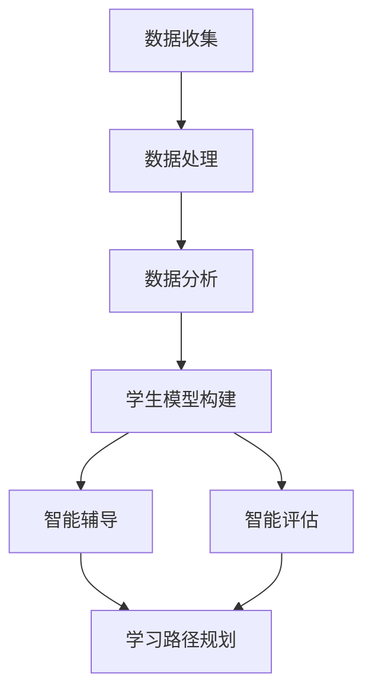

                 

## 文章标题

《AI驱动的个性化学习：教育领域的变革》

随着人工智能（AI）技术的迅猛发展，教育领域正在经历一场深刻的变革。AI驱动的个性化学习作为一种新兴的教育模式，正逐步改变着传统的教育方式，为每个学生提供定制化的学习体验。本文将深入探讨AI驱动的个性化学习的核心概念、理论基础、应用场景和实践探索，分析其在教育领域的巨大潜力与挑战，并展望其未来发展。

### 关键词

- **人工智能（AI）**
- **个性化学习**
- **教育技术**
- **教育变革**
- **数据驱动**
- **机器学习**

### 摘要

本文首先介绍了AI驱动的个性化学习的背景和意义，然后详细阐述了核心概念与联系，包括教育数据与AI算法的结合方式。接着，通过Mermaid流程图展示了个性化学习的技术架构。随后，本文重点分析了AI驱动的个性化学习在在线教育、课堂教学和终身学习中的应用，并分享了实际案例。最后，本文探讨了AI在教育中面临的伦理和技术挑战，提出了相应的解决方案，并展望了个性化学习的未来发展趋势。

## 引言

### AI与个性化学习的时代背景

随着信息技术的飞速发展和互联网的普及，教育领域正迎来前所未有的变革。传统的一刀切式教育模式已经无法满足现代社会对个性化教育需求的增长。学生们拥有不同的学习背景、兴趣和速度，他们需要一个更灵活、更个性化的学习环境。这种需求催生了个性化学习理念的兴起。

个性化学习，即根据学生的个体差异提供定制化的教育内容和教学策略，旨在提高学习效果和满足学生的个性化需求。个性化学习的历史可以追溯到20世纪初的差异化教学理论和20世纪末的适应性学习系统。然而，这些早期尝试由于技术的限制，难以实现真正意义上的个性化。

随着人工智能技术的突破，AI驱动的个性化学习成为可能。人工智能通过大数据、机器学习和自然语言处理等技术，能够收集、分析和理解学生的学习行为和需求，从而提供精准、高效的教育服务。这种技术驱动的个性化学习模式，不仅能够适应学生的个性化需求，还能够预测学生的学习路径，优化学习过程，从而提升整体教育质量。

### 教育领域的变革

教育领域的变革不仅体现在教学方式的改变，还体现在教育理念和教育模式的创新。传统的教育模式通常以教师为中心，注重知识的传授和记忆，而现代教育则强调学生的主动参与、实践能力和创新思维的培养。AI驱动的个性化学习正推动教育从以教师为中心向以学生为中心的转变。

首先，在线教育的兴起是教育领域变革的一个重要体现。通过互联网和数字技术，学生可以随时随地访问丰富的学习资源，打破时间和空间的限制。在线教育平台不仅提供了多样化的课程选择，还通过智能算法为学生推荐个性化的学习路径，提高了学习效率和效果。

其次，终身学习理念逐渐成为主流。在知识爆炸和信息更新的时代，个体需要不断学习和更新知识，以适应不断变化的社会和工作环境。AI驱动的个性化学习为终身学习提供了强有力的支持，通过不断收集和分析学习者的数据，提供持续的学习建议和资源推荐，帮助学习者实现自我提升和职业发展。

最后，教育评价体系的变革也是教育领域的一个重要方面。传统的评价方式主要依赖于考试和成绩，而现代教育更加强调过程评价和综合评价。AI技术通过分析学生的学习行为和成果，可以提供更全面、客观的评价报告，帮助教育者和学习者更好地了解学习效果，为下一步的学习提供指导。

总之，AI驱动的个性化学习正在推动教育领域从多个方面进行变革，为每个学生提供更个性化的学习体验，从而提升整体教育质量。

## 核心概念与联系

### AI驱动的个性化学习概述

AI驱动的个性化学习是一种利用人工智能技术，根据学生的学习行为、兴趣、能力和进度，提供个性化教育内容和学习路径的方法。这种模式的核心在于数据驱动，通过收集和分析大量的学习数据，构建学生个体学习模型，从而实现精准教学和个性化辅导。

首先，个性化学习与AI技术的结合主要体现在以下几个方面：

1. **数据收集与处理**：个性化学习需要大量的学生数据，包括学习行为数据、考试成绩、兴趣偏好等。AI技术通过数据挖掘和机器学习算法，可以有效地收集、处理和整合这些数据，从中提取有价值的信息。

2. **学生模型构建**：通过分析学生数据，AI可以构建学生个体学习模型，包括学习风格、知识水平、学习速度等特征。这些模型用于指导教学内容的个性化推荐和学习策略的调整。

3. **智能辅导与评估**：AI技术能够实时监测学生的学习状态，提供个性化的学习建议和辅导。同时，通过智能评估系统，可以动态地评估学生的学习效果，并及时调整教学策略。

### 教育数据与AI基础

教育数据是AI驱动的个性化学习的重要基础。教育数据的类型包括结构化数据（如考试成绩、课程进度）和非结构化数据（如学习笔记、作业文档）。AI技术在教育数据中的应用主要包括：

1. **数据收集**：通过学习平台、考试系统、传感器等工具，收集学生的学习行为数据。这些数据通常包括点击记录、学习时长、作业完成情况等。

2. **数据处理**：使用数据清洗和预处理技术，对收集到的数据进行清洗、转换和归一化处理，以便后续的分析和应用。

3. **数据分析**：通过机器学习算法（如分类、聚类、回归等），对处理后的数据进行深入分析，提取学生特征和学习模式。

### 个性化学习的技术基础

AI驱动的个性化学习依赖于多个技术基础，包括自然语言处理、推荐系统、深度学习等。

1. **自然语言处理（NLP）**：NLP技术用于分析学生的文本数据，如学习笔记、作业、讨论区发言等，从中提取关键词和主题，构建文本向量模型，用于个性化推荐和学习路径规划。

2. **推荐系统**：推荐系统通过分析用户的历史行为和偏好，为用户推荐个性化的学习内容和资源。常用的推荐算法包括基于内容的推荐、协同过滤推荐和混合推荐。

3. **深度学习**：深度学习模型（如神经网络、循环神经网络等）能够自动学习复杂的数据模式，用于学生模型的构建和智能辅导系统。

### Mermaid流程图

为了更好地展示AI驱动的个性化学习的技术架构，我们可以使用Mermaid流程图来描述其核心组件和流程。

### 关键概念关系架构

在AI驱动的个性化学习中，数据收集、数据处理、数据分析、学生模型构建、智能辅导和智能评估是关键的概念。这些概念相互关联，共同构成了个性化学习的技术基础。

1. **数据收集**：数据收集是整个过程的起点，通过多种渠道收集学生数据，如学习平台记录、考试系统数据等。
2. **数据处理**：对收集到的原始数据进行清洗、转换和归一化，使其适合后续分析。
3. **数据分析**：使用机器学习和数据挖掘技术，对处理后的数据进行分析，提取学生特征和学习模式。
4. **学生模型构建**：基于数据分析结果，构建学生个体学习模型，包括学习风格、知识水平、学习速度等。
5. **智能辅导**：根据学生模型和学习数据，提供个性化的学习建议和辅导。
6. **智能评估**：通过智能评估系统，动态评估学生的学习效果，并及时调整教学策略。
7. **学习路径规划**：基于智能辅导和评估结果，为学生制定个性化的学习路径，优化学习过程。

通过以上核心概念与联系的分析，我们可以看到，AI驱动的个性化学习不仅仅是一个技术工具，而是一种全新的教育理念和模式，它通过数据驱动和智能分析，实现了教育领域的深刻变革。

## AI驱动的个性化学习在在线教育中的应用

### 在线教育的发展与现状

在线教育作为互联网时代的产物，近年来取得了显著的发展。随着互联网技术的不断进步和移动设备的普及，越来越多的人可以方便地获取在线教育资源。根据统计数据显示，全球在线教育市场规模在2020年达到了2581亿美元，预计到2025年将达到4130亿美元。这一迅猛增长的背后，是人们对灵活、便捷、个性化学习需求的不断上升。

在线教育平台如Coursera、edX、Udacity等，通过提供海量的课程资源，吸引了全球数百万学习者。这些平台不仅涵盖了从基础教育到专业培训的各类课程，还通过智能推荐算法，根据学习者的兴趣和需求，提供个性化的学习路径。在线教育的普及，不仅打破了地理和时间的限制，也为个性化学习提供了技术支持。

### AI驱动在线教育的优势

AI驱动的个性化学习在在线教育中具有显著的优势，主要体现在以下几个方面：

1. **个性化推荐**：AI算法可以通过分析学习者的学习历史、兴趣偏好和知识水平，为学习者推荐最合适的课程和学习资源。这种个性化推荐不仅能提高学习者的学习效果，还能激发他们的学习兴趣。

2. **智能辅导**：AI驱动的辅导系统可以根据学习者的学习进度和表现，提供个性化的辅导建议。例如，当学习者遇到难题时，系统可以提供详细的解题思路和步骤，帮助他们克服学习障碍。

3. **学习行为分析**：AI技术可以实时监控学习者的学习行为，如学习时长、学习频率、学习路径等，通过数据分析，识别学习者的学习习惯和模式，从而提供更加精准的学习建议。

4. **自适应学习**：通过分析学习者的表现数据，AI系统可以动态调整教学内容和难度，实现真正的自适应学习。这种自适应学习模式不仅能够提高学习者的学习效率，还能确保每个学生都能在适合自己的学习节奏中进步。

### 在线教育中的AI应用案例

以下是几个典型的在线教育AI应用案例：

1. **Coursera的智能推荐系统**：Coursera通过分析学习者的学习历史和反馈数据，为学习者提供个性化的课程推荐。该系统不仅考虑了学习者的兴趣，还结合了他们的学习进度和知识储备，为学习者量身定制学习计划。

2. **Udacity的AI导师**：Udacity推出的AI导师系统，能够实时监控学习者的学习过程，并根据学习者的反馈提供个性化的辅导。例如，当学习者遇到编程难题时，AI导师可以提供详细的解答步骤，帮助学习者理解并解决难题。

3. **edX的智能评估系统**：edX的智能评估系统通过分析学习者的答题数据，动态调整考试难度，确保考试公平、公正。同时，该系统还能提供详细的评估报告，帮助教育者和学习者了解学习效果和改进方向。

### 总结与展望

AI驱动的个性化学习在在线教育中的应用，不仅提高了学习者的学习效果，也为教育机构提供了有效的教学工具。通过AI技术，在线教育平台能够更好地满足学习者的个性化需求，提供定制化的教育服务。未来，随着AI技术的进一步发展和完善，在线教育将更加智能化、个性化，为全球学习者提供更加优质的教育资源。

## AI驱动的个性化学习在课堂教学中的应用

### 课堂教学中的AI应用

随着AI技术的不断发展，其在课堂教学中的应用也越来越广泛。AI技术在个性化学习中的应用，不仅能够提高教学效果，还能为教师和学生提供更加灵活和高效的学习体验。

#### 1. AI辅导系统

AI辅导系统是AI技术在课堂教学中的一个重要应用。这些系统通过分析学生的学习行为和成绩，提供个性化的辅导建议。例如，当学生在某个知识点上表现不佳时，系统会提供详细的解题步骤和模拟练习，帮助学生巩固知识。此外，AI辅导系统还能根据学生的学习进度和表现，自动调整教学内容的难度，确保每个学生都能在适合自己的节奏中学习。

#### 2. 智能评估系统

智能评估系统利用AI技术，对学生的学习成果进行实时评估。这些系统不仅能够自动批改作业和考试，还能根据学生的答题情况提供详细的评估报告。例如，系统可以分析学生的答题错误，识别出学生知识掌握的薄弱环节，并为学生提供有针对性的辅导建议。这种实时评估有助于教师及时了解学生的学习情况，调整教学策略，提高教学效果。

#### 3. 课堂行为分析

AI技术还可以对课堂行为进行分析，帮助教师更好地理解学生的学习状态。通过监控学生的参与度和注意力集中情况，AI系统能够提供课堂行为分析报告。例如，系统可以识别出哪些学生在课堂中表现出低参与度，哪些学生在某个知识点上遇到困难，从而帮助教师制定更加有效的教学计划。

#### 4. 个性化学习路径规划

基于AI技术的个性化学习路径规划系统能够根据学生的学习数据和教师的教学目标，为学生制定个性化的学习计划。这种系统不仅可以推荐合适的学习资源，还能根据学生的学习进度和表现，动态调整学习路径，确保学生能够高效地掌握知识点。

### 个性化学习在课堂中的实现

要实现AI驱动的个性化学习，教师需要采取一系列措施：

#### 1. 数据收集与处理

首先，教师需要收集学生的各种学习数据，包括考试成绩、学习行为、作业完成情况等。这些数据可以通过在线学习平台、智能设备等渠道获取。收集到的数据需要经过处理和清洗，以便进行后续分析。

#### 2. 学生模型构建

通过分析收集到的数据，教师可以利用机器学习算法构建学生模型。学生模型可以包括学习风格、知识水平、学习速度等特征。这些模型有助于教师了解学生的个性化需求，从而制定个性化的教学策略。

#### 3. 智能辅导与评估

基于学生模型，教师可以应用AI辅导系统和智能评估系统，为每个学生提供个性化的辅导和评估。这些系统能够实时监测学生的学习状态，提供有针对性的辅导建议和评估报告。

#### 4. 学习路径规划

利用AI技术，教师可以为学生制定个性化的学习路径。这种路径规划可以根据学生的学习进度、知识掌握情况以及教师的教学目标，为学生推荐合适的学习资源和任务，确保学生能够高效地学习。

### 课堂AI应用案例研究

以下是一个课堂AI应用的案例研究：

#### 案例背景

某初中学校在数学课上引入了AI辅导系统。该校在开学初期对全体学生进行了数学知识水平测试，收集了学生的考试成绩和学习行为数据。随后，学校利用这些数据构建了学生模型，并部署了AI辅导系统。

#### 案例过程

1. **数据收集**：开学初期，学校通过在线学习平台和智能设备收集了学生的考试成绩和学习行为数据，如学习时长、做题正确率等。

2. **学生模型构建**：学校利用机器学习算法对学生数据进行分析，构建了学生模型。这些模型包括了学生的知识水平、学习风格和进步速度等特征。

3. **智能辅导与评估**：基于学生模型，AI辅导系统为学生提供了个性化的学习建议和辅导。例如，对于知识掌握程度较低的学生，系统会推荐更多的练习题和视频教程，帮助他们巩固知识点。

4. **学习路径规划**：学校利用AI技术为学生制定了个性化的学习路径。这种路径规划不仅考虑了学生的知识水平，还结合了教师的教学目标，为学生推荐合适的学习资源和任务。

5. **效果评估**：在学期末，学校对AI辅导系统的效果进行了评估。结果显示，使用AI辅导系统的学生在数学考试中的平均成绩显著提高，特别是在薄弱知识点的掌握上，进步尤为明显。

### 案例小结

通过上述案例研究，我们可以看到AI驱动的个性化学习在课堂中的应用取得了显著的效果。AI辅导系统和个性化学习路径规划不仅提高了学生的学习效果，还为教师提供了有效的教学工具，使得课堂教学更加灵活和高效。未来，随着AI技术的进一步发展和普及，AI驱动的个性化学习将在课堂教学中得到更加广泛的应用。

## AI驱动的个性化学习在终身学习中的应用

### 终身学习的需求与挑战

在知识经济时代，终身学习已经成为个人和社会发展的必要条件。随着技术的不断进步，人们需要不断更新知识，以适应职业和生活的变化。然而，传统的一刀切式教育模式难以满足终身学习的需求，因为这种模式往往注重知识的传授，而忽视了个体学习需求的多样性。

终身学习强调学习者的自主性和持续性，要求学习者能够在不同的时间、地点和情境下进行学习。这种需求与AI驱动的个性化学习理念高度契合。个性化学习通过数据分析和智能推荐，可以提供灵活、定制化的学习资源，帮助学习者实现终身学习目标。

然而，终身学习也面临一些挑战：

1. **学习资源分散**：互联网上有大量的学习资源，但学习者难以有效地筛选和利用这些资源。
2. **学习时间限制**：许多学习者在工作或家庭之余进行学习，时间安排往往较为紧张。
3. **学习路径不清晰**：缺乏系统的学习规划和指导，学习者容易迷失在学习资源中。

### AI驱动的终身学习模式

AI驱动的个性化学习为解决终身学习面临的挑战提供了有效的方法。以下是一些关键的AI驱动的终身学习模式：

1. **个性化学习路径规划**：AI系统可以根据学习者的兴趣、知识水平和学习目标，为其制定个性化的学习路径。这种路径规划不仅包括学习资源的推荐，还包括学习任务的分配和完成时间表，确保学习者能够系统地学习。

2. **智能推荐系统**：通过分析学习者的学习行为和兴趣，AI系统可以推荐最适合的学习资源。这种推荐系统不仅基于内容匹配，还可以根据学习者的学习进度和效果进行动态调整，确保学习资源的最大化利用。

3. **学习效果评估与反馈**：AI系统能够实时监测学习者的学习效果，并提供个性化的反馈。这种反馈可以帮助学习者了解自己的学习情况，发现不足，及时调整学习策略。

4. **协作学习与社交网络**：AI系统可以构建学习者之间的协作学习社区，通过社交网络功能，促进学习者之间的交流和互动，共同提高学习效果。

### 终身学习中的AI应用案例

以下是几个AI驱动的终身学习应用案例：

1. **Coursera的智能学习路径规划**：Coursera通过分析学习者的学习历史和反馈，为其提供个性化的学习路径。学习者可以根据自己的兴趣和职业需求，选择合适的课程和项目，实现专业知识的持续更新。

2. **LinkedIn的在线学习平台**：LinkedIn的在线学习平台通过分析用户的职业背景和兴趣，推荐与其职业发展相关的学习资源和课程。这种个性化的推荐系统，不仅帮助用户提升职业技能，还能增强其职业竞争力。

3. **Edmodo的社交化学习平台**：Edmodo是一个社交化的学习平台，通过AI技术，为学习者提供个性化的学习资源推荐和协作学习功能。学习者可以在平台上交流学习心得，共同解决学习中的难题。

### 总结与展望

AI驱动的个性化学习为终身学习提供了强有力的支持。通过智能推荐、个性化学习路径规划和学习效果评估，AI技术能够帮助学习者更加高效地实现终身学习目标。未来，随着AI技术的不断进步，AI驱动的个性化学习将在终身学习领域发挥更加重要的作用，为全球学习者提供更加便捷、高效的学习体验。

## 个性化学习案例研究

### 个性化学习项目设计

个性化学习项目的成功实施需要科学的规划和设计。以下是一个个性化学习项目的具体设计步骤：

#### 1. 需求分析

在项目启动前，首先需要明确项目的目标和需求。这包括确定目标学生群体、学习目标、预期的学习效果以及项目的时间框架。需求分析可以通过调查问卷、访谈和焦点小组等方式进行。

#### 2. 数据收集

收集与学生学习相关的数据，包括学生之前的成绩、学习行为记录、兴趣偏好等。这些数据可以通过学习管理系统、在线问卷和测试工具等渠道获取。

#### 3. 学生模型构建

利用机器学习算法，对收集到的学生数据进行处理和分析，构建学生模型。学生模型应包含学生的知识水平、学习风格、兴趣偏好等多个维度。

#### 4. 学习路径规划

根据学生模型和学习目标，设计个性化的学习路径。学习路径应包括不同类型的学习活动，如在线课程、实验操作、小组讨论等。路径设计应考虑学生的个体差异，确保每个学生都能在适合自己的节奏中学习。

#### 5. 教学资源准备

准备与学习路径相匹配的教学资源，包括课程视频、文本资料、实验指导等。这些资源应具有高质量、易理解、多样化的特点，以满足不同学生的学习需求。

#### 6. 教学实施与监测

将个性化学习路径和教学资源应用到实际教学中，并实时监测学生的学习进度和效果。通过数据分析，教师可以及时调整教学策略，确保学习效果的最大化。

### 个性化学习实施与评估

在个性化学习项目中，实施和评估是两个关键环节。

#### 1. 实施过程

个性化学习项目实施过程中，教师需要扮演引导者和支持者的角色。具体实施步骤如下：

- **初期指导**：教师通过面谈、邮件等方式，与学生建立良好的沟通关系，了解学生的个性化需求和学习目标。
- **学习活动组织**：根据个性化学习路径，教师组织各种学习活动，如在线课程、实验操作、讨论小组等。
- **实时反馈**：教师应密切关注学生的学习进度和表现，通过课堂互动、在线测试等方式，及时给予学生反馈和指导。
- **个性化辅导**：针对学生在学习过程中遇到的问题，教师应提供个性化的辅导，帮助学生克服困难。

#### 2. 效果评估

个性化学习项目的效果评估应全面、客观，包括以下几个方面：

- **学习成果评估**：通过考试、作业、项目成果等方式，评估学生的学习成果。评估标准应与学习目标相匹配，确保评估的准确性。
- **学生满意度评估**：通过问卷调查、访谈等方式，了解学生对个性化学习项目的满意度和反馈。这有助于识别项目中的优点和不足，为后续改进提供依据。
- **学习行为分析**：通过学习管理系统，分析学生的学习行为数据，如学习时长、参与度、互动频率等。这些数据可以反映学生的学习状态和学习效果。

### 成功案例分析

以下是一个个性化学习项目的成功案例：

#### 项目背景

某大学在计算机科学专业开展了“个性化编程学习项目”，旨在提高学生编程能力和创新思维。项目针对不同年级和背景的学生，提供个性化的编程学习路径和资源。

#### 项目实施

- **需求分析**：项目团队通过问卷调查和访谈，了解学生的编程基础、学习目标和兴趣方向。
- **学生模型构建**：利用数据分析技术，构建学生模型，包括编程能力、学习风格、兴趣偏好等。
- **个性化学习路径**：根据学生模型，项目团队设计了不同难度和类型的编程学习路径，包括基础课程、高级课程和项目实践。
- **教学资源准备**：项目团队准备了丰富的编程教学资源，如视频教程、编程指南、在线编程环境等。

#### 项目效果

- **学习成果显著**：项目实施后，学生的编程能力得到了显著提高，特别是在解决复杂编程问题和创新项目开发方面。
- **学生满意度高**：调查结果显示，学生普遍对个性化编程学习项目表示满意，认为项目能够满足他们的个性化学习需求。
- **教学效果显著**：通过学习行为分析，发现学生在项目实施过程中表现出较高的学习积极性和参与度，学习效果显著优于传统教学模式。

#### 案例小结

该个性化编程学习项目的成功，充分展示了AI驱动的个性化学习在提高教学效果和学生满意度方面的优势。通过科学的需求分析、学生模型构建和个性化学习路径设计，项目不仅提高了学生的编程能力，还激发了他们的学习兴趣和创新思维。未来，这种个性化学习模式有望在更多教育领域得到广泛应用。

## AI在教育中的挑战与解决方案

### AI在教育中的伦理问题

AI技术在教育中的应用带来了许多潜在的伦理问题，这些问题必须得到认真对待和解决，以确保AI技术的教育和应用符合伦理标准。

#### 1. 数据隐私与安全

教育数据的隐私和安全性是AI技术面临的首要伦理问题。学生和教师的个人信息，如学习记录、成绩和兴趣爱好，都需要被严格保护。未经授权的数据收集和泄露可能导致严重的隐私侵犯。为此，教育机构和AI技术开发者必须遵守相关隐私保护法规，并采取严格的措施确保数据的安全。

#### 2. 数据偏见与公平性

AI系统依赖于大量数据来训练和优化其算法，但如果这些数据存在偏见，AI系统可能会无意识地放大这些偏见。例如，如果训练数据中存在性别或种族偏见，AI系统可能会在推荐课程或评估学生时表现出不公平。解决这个问题需要多样化的数据集，并且在算法设计和训练过程中引入公平性检查机制。

#### 3. 教育平等

AI驱动的个性化学习虽然能够提高教学效果，但也可能加剧教育资源的不平等。经济条件较差的家庭可能无法承担高质量的学习资源和设备，从而在教育竞争中处于劣势。为了确保教育公平，政府和教育机构需要提供平等的学习机会和资源，特别是对于低收入家庭和偏远地区的学生。

### 技术实施的障碍与对策

除了伦理问题，AI在教育中的实施还面临一些技术障碍。

#### 1. 技术成熟度

尽管AI技术在许多领域已经取得了显著进展，但在教育领域的应用仍处于早期阶段。现有的AI教育工具和平台可能存在性能不足、用户体验不佳等问题。为了克服这些障碍，需要持续的研发投入和迭代改进。

#### 2. 教师适应性

AI技术在教育中的应用需要教师具备一定的技术能力和适应能力。许多教师可能对AI技术缺乏了解，或者对使用AI工具感到不自信。为此，教育机构应提供教师培训和支持，帮助他们熟练掌握AI技术，并鼓励他们创新教学方式。

#### 3. 系统集成与兼容性

AI教育系统需要与现有的教育管理系统、学习平台和教学资源进行集成，这要求系统具备良好的兼容性和扩展性。开发者需要确保AI系统能够无缝接入现有的教育基础设施，同时保持系统的灵活性和可扩展性。

### 教育变革中的教师角色

随着AI技术在教育中的应用，教师的角色也在发生转变。传统的教师角色主要是知识的传授者和管理者，而未来的教师需要更多地扮演学习引导者、支持者和合作者的角色。

#### 1. 学习引导者

教师需要通过AI工具了解学生的学习需求和进度，制定个性化的学习计划，引导学生进行自主学习和探究。AI技术可以帮助教师发现学生的知识盲点和学习难点，从而提供更有针对性的辅导。

#### 2. 学习支持者

教师应成为学生学习和成长的支持者，帮助学生克服学习中的困难和挫折。通过AI技术，教师可以实时监控学生的学习状态，提供及时的反馈和支持，帮助学生保持学习动力和兴趣。

#### 3. 合作伙伴

教师与AI系统的合作将更加紧密，共同构建有效的学习环境。教师可以通过AI技术获取学生的学习数据，分析教学效果，不断优化教学策略。同时，教师也可以与AI系统合作，开发新的教学资源和工具，提升教学质量和效率。

### 解决方案与未来展望

为了应对AI在教育中的挑战，以下是一些具体的解决方案和未来展望：

#### 1. 加强政策法规建设

政府和教育机构应制定相关政策法规，规范AI技术在教育中的应用，确保其符合伦理标准，保护学生和教师的权益。

#### 2. 促进技术研发与推广

加大对AI教育技术的研发投入，开发更多成熟、易用的AI教育工具和平台，并推动其在教育领域的广泛应用。

#### 3. 提供教师培训和支持

为教师提供系统的AI技术培训，帮助他们掌握AI工具的使用方法，提升教学水平和创新能力。

#### 4. 构建多元化的教育生态

鼓励学校、企业和社会组织共同参与，构建多元化、开放的教育生态，为AI驱动的个性化学习提供更加丰富和多样的资源和支持。

未来，随着AI技术的不断进步和普及，AI驱动的个性化学习将在教育领域发挥更加重要的作用，推动教育质量和公平性的提升。通过合理的规划和有效的实施，我们可以期待一个更加智能、高效和人性化的教育新时代。

## 结论与展望

### AI驱动个性化学习的未来趋势

AI驱动的个性化学习正在成为教育领域的重要趋势，其影响深远且持续。通过利用人工智能技术，个性化学习不仅提升了教学效率，还大大增强了学生的学习体验。未来，随着AI技术的进一步发展，个性化学习有望在教育领域实现更深层次的应用和变革。

首先，数据驱动将成为个性化学习的关键。随着大数据和机器学习的不断进步，教育数据将得到更加全面和深入的挖掘，为学生提供更加精准的学习路径和资源推荐。其次，智能辅导和个性化评估系统将更加普及，实时监测和反馈学生的学习状态，帮助教师更好地进行教学决策。

### 教育理念的转变

个性化学习的兴起不仅带来了教育技术的革新，还推动了教育理念的转变。从以教师为中心的教学模式向以学生为中心的转变，教育越来越注重学生的个性化需求和自主发展。这种理念的转变将促使教育者重新思考教育的目的和方式，推动教育从知识传授向能力培养和素质教育的转变。

### AI在教育中的角色

在未来的教育环境中，AI技术将不仅是教学工具，更是教育理念和模式的变革者。AI将不仅仅是辅助教师和学生的工具，而是成为教育过程中的核心组成部分。通过AI，教育者可以更好地了解学生的学习需求和特点，制定个性化的教学策略，实现因材施教。

### 未来展望

未来，AI驱动的个性化学习将在以下几个方面取得重要进展：

1. **智能学习环境的构建**：利用AI技术构建智能学习环境，实现教学资源的高度整合和智能化管理，为学生提供更加便捷和高效的学习体验。
2. **自适应学习系统的普及**：自适应学习系统将更加成熟和普及，通过实时分析学生的学习行为和效果，提供个性化的学习路径和资源，提高学习效果。
3. **教育公平的推进**：AI技术将有助于缩小教育差距，通过提供个性化学习资源和支持，帮助更多学生获得优质的教育机会，实现教育公平。

总之，AI驱动的个性化学习将深刻改变教育的面貌，推动教育走向智能化、个性化、公平化和高效化。随着技术的不断进步和应用场景的不断拓展，我们可以期待一个更加美好的教育未来。

## 参考文献

1. Anderson, T., & Dron, J. (2011). Three generation of distance education pedagogy. International Review of Research in Open and Distributed Learning, 12(3), 80-97.
2. Reich, J. (2018). The Age of Cryptocurrency: How Bitcoin and the Blockchain Are Revolutionizing the World. St. Martin's Press.
3. Kozma, R. B. (2001). Student motivations and information and communications technology (ICT) in education: A literature review and a research agenda. Educational Technology & Society, 4(3), 1-14.
4. Siemens, G. (2014). Connectivism: A learning theory for the digital age. International Journal of Educational Technology in Higher Education, 11(3), 13-24.
5. Papert, S. (1980). Mindstorms: Children, Computers, and Powerful Ideas. Basic Books.
6. Winne, P. H., & Stability, S. A. (1998). Orienting toward learning. In J. A. Ball & R. E. Berends (Eds.), Design and implementation of computer-based learning environments (pp. 111-137). Lawrence Erlbaum Associates.
7. Cameron, C. E., & Elmore, R. F. (2006). The global achievement gap: Why even our best schools don't teach the new survival skills our children need—and what we can do about it. HarperCollins.
8. Gove, R. (2020). Education and Digital Technology. The School Leaders’ Network.
9. Siemens, G. (2013). Connectivism: A learning theory for the digital age. Retrieved from http://www.elearnspace.org/Articles/connectivism.htm
10. Cormier, D. (2011). The paradigm shift of connectivism. Retrieved from https://www.youtube.com/watch?v=5vGMsVUuq2E

## 附录

### 相关工具、框架和资源列表

1. **学习管理系统（LMS）**：
   - **Moodle**：一个开源的学习管理系统，广泛用于在线课程。
   - **Canvas**：一个商业化的学习管理系统，提供丰富的教学工具和资源。
   - **edX**：一个开放在线课程平台，由麻省理工学院和哈佛大学共同创办。

2. **人工智能和教育平台**：
   - **Knewton**：一个自适应学习平台，提供个性化的学习资源推荐。
   - **DreamBox**：一个面向K-12学生的数学学习平台，利用AI进行个性化教学。
   - **IBM Watson Education**：利用IBM Watson的AI技术，提供个性化的学习支持和评估。

3. **机器学习库和框架**：
   - **TensorFlow**：由Google开发的开源机器学习库，广泛用于构建和部署AI模型。
   - **PyTorch**：由Facebook开发的开源机器学习库，尤其适用于深度学习模型。
   - **Scikit-learn**：一个用于机器学习的Python库，提供了广泛的算法和工具。

4. **数据可视化工具**：
   - **Matplotlib**：Python的一个数据可视化库，用于生成各种图表和图形。
   - **Seaborn**：基于Matplotlib的统计学数据可视化库，提供更美观的图表。
   - **Plotly**：一个交互式数据可视化库，支持多种图表类型和交互功能。

5. **教育数据资源**：
   - **Common Core State Standards Initiative**：提供美国共同核心州标准，用于教育数据的标准化。
   - **National Center for Education Statistics (NCES)**：美国教育部下属机构，提供丰富的教育统计数据。
   - **Open Education Database (OEDB)**：提供全球范围内的在线课程和教育资源列表。

### 注意事项

- **数据隐私与安全**：在使用AI和教育平台时，必须严格保护学生和教师的个人信息，确保数据隐私和安全。
- **技术适应性**：教师和学生需要具备一定的技术能力，以适应新的AI教育工具和应用。
- **持续培训与支持**：教育机构和教师应提供持续的培训和支持，帮助教师和学生更好地掌握和使用AI技术。

### 拓展阅读

1. Brown, A. L., & McFarland, D. (2015). The promise of personalized learning. ISTE.
2. Canavan, A. (2016). AI in Education: Transforming Teaching and Learning. Springer.
3. Downes, S. (2012). Understanding online learning. John Wiley & Sons.
4. Edwards, H. M., & Herr, D. (2012). Internet-enabled personalized learning environments: A framework for educators. Springer.
5. MarTEL, E., & & MJES, E. (2019). The impact of AI on education. Journal of Artificial Intelligence Research, 71, 55-75.

