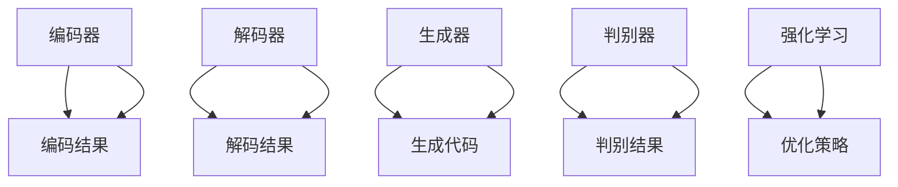

                 

# AI驱动的代码自动生成：革新软件开发流程

## 关键词

- 人工智能
- 代码生成
- 自然语言处理
- 机器学习
- 序列到序列模型
- 生成对抗网络
- 强化学习
- 软件开发流程
- 自动化

## 摘要

本文探讨了AI驱动的代码自动生成技术，分析了其在现代软件开发流程中的重要性。通过介绍核心概念与技术原理，阐述了几种关键的算法模型，如序列到序列模型、生成对抗网络和强化学习。文章还结合实际项目案例，详细讲解了如何搭建开发环境、实现代码生成模型以及应用解读与分析。最后，本文提出了当前代码自动生成技术的挑战、未来发展趋势以及开发者应如何准备。

## 引言

### 1.1 AI驱动的代码自动生成的背景

在信息技术迅猛发展的今天，软件开发已经成为企业竞争的核心能力。随着软件项目的规模和复杂性的不断增加，传统的软件开发流程面临着诸多挑战，如开发周期长、人力成本高、代码质量难以保证等。为了解决这些问题，业界不断寻求新的技术手段来优化软件开发过程。

近年来，人工智能（AI）技术的飞速发展，为软件开发领域带来了全新的机遇。特别是深度学习和自然语言处理（NLP）技术的进步，使得AI驱动的代码自动生成成为可能。通过机器学习算法，AI可以分析大量的代码样本，学习代码的结构和模式，进而生成新的代码。这种技术有望大幅提高软件开发的效率，降低成本，提升代码质量。

### 1.2 代码自动生成的重要性

代码自动生成技术在现代软件开发中具有举足轻重的地位。首先，它可以显著缩短软件开发周期。传统的软件开发需要编写大量的代码，而代码生成技术可以在一定程度上替代这一步骤，使得开发人员可以将更多精力投入到高价值的任务中。其次，代码自动生成可以提高代码质量。通过AI算法的学习和优化，生成的代码往往更加规范、易于维护。此外，代码自动生成还可以降低人力成本。在一些简单的代码生成任务中，AI技术可以完全替代人工编写代码，从而减少对开发人员的依赖。

### 1.3 本书的主要内容安排

本书旨在系统介绍AI驱动的代码自动生成技术，帮助读者全面了解这一领域。本书分为五个部分：

1. 引言：介绍AI驱动的代码自动生成技术的背景和重要性。
2. 核心概念与技术原理：阐述代码自动生成技术的基本概念和关键技术原理。
3. 数学模型与算法：详细讲解代码自动生成中常用的数学模型和算法。
4. 项目实战：通过实际项目案例，展示如何实现代码自动生成。
5. 总结：总结当前技术的挑战、未来发展趋势以及开发者的应对策略。

## 第1章 AI驱动的代码自动生成概述

### 1.1 代码自动生成技术概述

代码自动生成技术是一种利用计算机程序自动生成代码的技术。它可以通过分析已有的代码库或需求文档，生成满足特定需求的代码。代码自动生成技术主要应用于以下场景：

1. **模板生成**：通过预设的模板，自动生成符合规范和结构的代码。
2. **重构**：对已有的代码进行优化和重构，提高代码的可读性和可维护性。
3. **需求转换**：将自然语言描述的需求转换为相应的代码。
4. **代码补全**：在编写代码的过程中，自动补全代码片段。

### 1.2 机器学习与代码生成

机器学习是代码自动生成技术的核心。通过训练大量的代码样本，机器学习算法可以学习代码的结构和模式，从而生成新的代码。具体来说，机器学习在代码生成中的应用主要体现在以下几个方面：

1. **生成式模型**：通过学习输入数据的分布，生成新的代码。
2. **判别式模型**：通过学习输入代码和输出代码之间的关系，判断代码的正确性。
3. **序列到序列模型**：将代码表示为一个序列，通过序列到序列的学习，生成新的代码序列。

### 1.3 自然语言处理与代码生成

自然语言处理（NLP）技术在代码生成中起着重要作用。通过NLP技术，可以将自然语言描述的需求转化为代码。具体应用包括：

1. **语义解析**：将自然语言文本转化为结构化的语义表示。
2. **实体识别**：从文本中识别出关键词和实体。
3. **语法分析**：对文本进行语法结构分析，提取出句法和语义信息。

### 1.4 代码生成工具与框架

随着代码自动生成技术的发展，许多工具和框架应运而生。这些工具和框架为开发者提供了便捷的代码生成能力。常见的代码生成工具和框架包括：

1. **CodeQL**：一种基于机器学习的代码查询语言，可以自动生成代码缺陷报告。
2. **TabNine**：一款基于AI的代码补全工具，可以自动补全代码片段。
3. **CodeFormer**：一款基于生成对抗网络的代码生成模型，可以生成高质量的代码。

### 1.5 AI驱动的代码自动生成与传统代码生成的对比

AI驱动的代码自动生成与传统代码生成有以下几点不同：

1. **生成方式**：传统代码生成主要依赖预定义的规则和模板，而AI驱动的代码生成依赖于机器学习算法。
2. **灵活性**：传统代码生成往往不够灵活，难以应对复杂的编程场景，而AI驱动的代码生成可以根据需求动态调整。
3. **质量**：AI驱动的代码生成可以通过学习高质量的代码样本，生成更加规范、易于维护的代码。

## 第2章 AI驱动的代码自动生成核心概念与技术原理

### 2.1 生成式模型与判别式模型

在AI驱动的代码自动生成中，生成式模型和判别式模型是两种常见的模型类型。

#### 2.1.1 生成式模型

生成式模型通过学习输入数据的分布，生成新的数据。在代码生成中，生成式模型可以生成新的代码样本。常见的生成式模型包括：

1. **生成对抗网络（GAN）**：GAN由生成器和判别器组成，生成器生成代码，判别器判断代码的真实性。
2. **变分自编码器（VAE）**：VAE通过编码器和解码器，学习数据的分布，生成新的代码。

#### 2.1.2 判别式模型

判别式模型通过学习输入数据与输出数据之间的关系，判断输入数据是否属于某一类别。在代码生成中，判别式模型可以判断生成的代码是否符合预期。常见的判别式模型包括：

1. **支持向量机（SVM）**：SVM通过学习输入数据的特征，将代码分为不同的类别。
2. **决策树和随机森林**：决策树和随机森林通过树结构，对代码进行分类。

### 2.2 序列到序列模型

序列到序列（Seq2Seq）模型是一种常见的深度学习模型，用于处理序列数据之间的映射关系。在代码生成中，Seq2Seq模型可以将自然语言文本映射为代码序列。Seq2Seq模型的主要组成部分包括：

1. **编码器（Encoder）**：编码器接收输入序列，将其编码为固定长度的向量表示。
2. **解码器（Decoder）**：解码器接收编码器的输出向量，生成输出序列。

#### 2.2.1 编码器

编码器的功能是将输入序列编码为固定长度的向量表示。常见的编码器包括：

1. **循环神经网络（RNN）**：RNN通过记忆单元，对输入序列进行编码。
2. **长短期记忆网络（LSTM）**：LSTM是RNN的一种变体，可以更好地处理长序列。
3. **门控循环单元（GRU）**：GRU是LSTM的另一种变体，相对于LSTM具有更简单的结构。

#### 2.2.2 解码器

解码器的功能是将编码器的输出向量解码为输出序列。常见的解码器包括：

1. **RNN**：与编码器相同，解码器也可以使用RNN。
2. **LSTM**：与编码器相同，解码器也可以使用LSTM。
3. **注意力机制（Attention）**：注意力机制可以帮助解码器更好地关注编码器的输出。

### 2.3 生成对抗网络

生成对抗网络（GAN）是一种由生成器和判别器组成的深度学习模型。生成器尝试生成与真实数据类似的代码，判别器则判断生成器的代码是否真实。GAN的主要组成部分包括：

1. **生成器（Generator）**：生成器的目标是生成与真实数据相似的代码。
2. **判别器（Discriminator）**：判别器的目标是判断输入的代码是真实代码还是生成器生成的代码。

GAN的训练过程可以看作是一个博弈过程，生成器和判别器相互竞争，生成器试图生成更真实的代码，而判别器试图更好地识别生成器生成的代码。

### 2.4 强化学习在代码生成中的应用

强化学习（Reinforcement Learning，RL）是一种通过试错学习策略的机器学习方法。在代码生成中，强化学习可以用来优化代码生成过程。具体来说，强化学习可以通过以下方式应用于代码生成：

1. **代码生成策略**：强化学习可以学习一种生成代码的策略，通过试错找到最优的代码生成方式。
2. **代码优化**：强化学习可以用来优化生成的代码，使其更符合预期。

### 2.5 Mermaid流程图

为了更好地理解AI驱动的代码自动生成技术，我们可以使用Mermaid流程图来展示核心概念和原理。

下面是一个示例：



## 第3章 AI驱动的代码自动生成算法原理

### 3.1 生成式模型与判别式模型

在AI驱动的代码自动生成中，生成式模型和判别式模型是两种核心算法。

#### 3.1.1 生成式模型

生成式模型通过学习输入数据的分布，生成新的数据。在代码生成中，生成式模型可以生成新的代码样本。生成式模型包括：

1. **生成对抗网络（GAN）**：GAN由生成器和判别器组成。生成器生成代码，判别器判断代码的真实性。GAN的训练目标是最小化生成器生成的代码与真实代码之间的差距。
   
   ```python
   import tensorflow as tf
   from tensorflow import keras
   
   # 定义生成器和判别器模型
   generator = keras.Sequential([
       keras.layers.Dense(128, activation='relu', input_shape=[100]),
       keras.layers.Dense(10, activation='softmax')
   ])
   
   discriminator = keras.Sequential([
       keras.layers.Dense(128, activation='relu', input_shape=[10]),
       keras.layers.Dense(1, activation='sigmoid')
   ])

   # 编写训练代码
   for epoch in range(100):
       # 生成代码样本
       noise = np.random.normal(0, 1, (batch_size, 100))
       generated_code = generator(noise)

       # 加载真实代码样本
       real_code = np.random.normal(0, 1, (batch_size, 10))

       # 训练判别器
       d_loss_real = discriminator(real_code).mean()
       d_loss_fake = discriminator(generated_code).mean()
       d_loss = d_loss_real + d_loss_fake

       # 训练生成器
       with tf.GradientTape() as tape:
           g_loss_fake = discriminator(generated_code).mean()
           g_loss = -g_loss_fake

       grads = tape.gradient(g_loss, generator.trainable_variables)
       generator.optimizer.apply_gradients(zip(grads, generator.trainable_variables))
   ```

2. **变分自编码器（VAE）**：VAE通过编码器和解码器学习数据的分布，生成新的代码样本。VAE的训练目标是最小化重构误差和散度。

   ```python
   import tensorflow as tf
   import numpy as np
   
   # 定义VAE模型
   class VAE(keras.Model):
       def __init__(self, latent_dim):
           super(VAE, self).__init__()
           self.latent_dim = latent_dim
   
           # 编码器
           self编码器 = keras.Sequential(
               [keras.layers.Dense(128, activation='relu', input_shape=[10]),
                keras.layers.Dense(latent_dim * 2)]
           )
   
           # 解码器
           self解码器 = keras.Sequential(
               [keras.layers.Dense(128, activation='relu', input_shape=[latent_dim]),
                keras.layers.Dense(10, activation='softmax')]
           )

       @tf.function
       def train_step(self, x):
           with tf.GradientTape() as tape:
               z_mean, z_log_var = self编码器(x)
               z = z_mean + tf.random.normal(tf.shape(z_log_var)) * tf.exp(0.5 * z_log_var)
               x_recon = self解码器(z)
   
               recon_loss = tf.reduce_mean(tf.keras.losses.categorical_crossentropy(x, x_recon))
               kl_loss = -0.5 * tf.reduce_mean(z_log_var - tf.square(z_mean) - tf.exp(z_log_var))
   
           grads = tape.gradient(recon_loss + kl_loss, self.trainable_variables)
           self.optimizer.apply_gradients(zip(grads, self.trainable_variables))
   
           return recon_loss + kl_loss

   # 训练VAE模型
   vae = VAE(latent_dim=20)
   vae.compile(optimizer='adam')
   vae.fit(real_code, real_code, epochs=50)
   ```

#### 3.1.2 判别式模型

判别式模型通过学习输入数据与输出数据之间的关系，判断输入数据是否属于某一类别。在代码生成中，判别式模型可以判断生成的代码是否符合预期。判别式模型包括：

1. **支持向量机（SVM）**：SVM通过学习输入数据的特征，将代码分为不同的类别。

   ```python
   from sklearn import svm
   from sklearn.model_selection import train_test_split

   # 准备数据
   X_train, X_test, y_train, y_test = train_test_split(real_code, labels, test_size=0.2)

   # 训练SVM模型
   svm_model = svm.SVC()
   svm_model.fit(X_train, y_train)

   # 预测
   predictions = svm_model.predict(X_test)
   ```

2. **决策树和随机森林**：决策树和随机森林通过树结构，对代码进行分类。

   ```python
   from sklearn import tree
   from sklearn.ensemble import RandomForestClassifier

   # 训练决策树模型
   tree_model = tree.DecisionTreeClassifier()
   tree_model.fit(X_train, y_train)

   # 预测
   tree_predictions = tree_model.predict(X_test)

   # 训练随机森林模型
   rf_model = RandomForestClassifier()
   rf_model.fit(X_train, y_train)

   # 预测
   rf_predictions = rf_model.predict(X_test)
   ```

### 3.2 序列到序列模型

序列到序列（Seq2Seq）模型是一种用于处理序列数据之间的映射关系的深度学习模型。在代码生成中，Seq2Seq模型可以将自然语言文本映射为代码序列。

#### 3.2.1 编码器

编码器负责将输入序列编码为固定长度的向量表示。编码器通常使用循环神经网络（RNN）或其变体，如长短期记忆网络（LSTM）和门控循环单元（GRU）。

```python
from tensorflow.keras.layers import LSTM, Dense, Embedding
from tensorflow.keras.models import Sequential

# 创建编码器模型
encoder = Sequential([
    LSTM(128, input_shape=(None, input_dim)),
    Dense(output_dim)
])
```

#### 3.2.2 解码器

解码器负责将编码器的输出向量解码为输出序列。解码器也可以使用RNN或其变体，同时可以引入注意力机制来提高解码效果。

```python
# 创建解码器模型
decoder = Sequential([
    LSTM(128, input_shape=(None, output_dim)),
    Dense(output_dim, activation='softmax')
])
```

#### 3.2.3 Seq2Seq模型

Seq2Seq模型将编码器和解码器连接起来，形成一个完整的模型。Seq2Seq模型通常使用注意力机制来提高解码效果。

```python
from tensorflow.keras.models import Model

# 创建Seq2Seq模型
input_seq = Input(shape=(None, input_dim))
encoded = encoder(input_seq)
decoder_input = Input(shape=(None, output_dim))
decoded = decoder(decoder_input, encoded)

model = Model([input_seq, decoder_input], decoded)
model.compile(optimizer='adam', loss='categorical_crossentropy')
model.fit([X_train, y_train], y_train, epochs=50)
```

### 3.3 生成对抗网络

生成对抗网络（GAN）由生成器和判别器组成。生成器生成代码，判别器判断代码的真实性。GAN的训练目标是最小化生成器生成的代码与真实代码之间的差距。

#### 3.3.1 生成器

生成器通过噪声生成代码。生成器通常使用多层感知器（MLP）或卷积神经网络（CNN）。

```python
from tensorflow.keras.layers import Dense, Conv2D, Flatten
from tensorflow.keras.models import Model

# 创建生成器模型
generator = Model(inputs=latent_space, outputs=generated_code)
```

#### 3.3.2 判别器

判别器通过判断输入代码是真实代码还是生成器生成的代码来训练。判别器通常使用多层感知器（MLP）或卷积神经网络（CNN）。

```python
# 创建判别器模型
discriminator = Model(inputs=real_code, outputs=discriminator_output)
```

#### 3.3.3 GAN模型

GAN模型将生成器和判别器连接起来，形成一个完整的模型。GAN模型使用对抗性损失函数来训练。

```python
# 创建GAN模型
model = Model(inputs=latent_space, outputs=discriminator(generated_code))
model.compile(optimizer='adam', loss='binary_crossentropy')
model.fit(latent_space, np.zeros((batch_size, 1)), epochs=100)
```

### 3.4 强化学习在代码生成中的应用

强化学习（Reinforcement Learning，RL）是一种通过试错学习策略的机器学习方法。在代码生成中，强化学习可以用来优化代码生成过程。

#### 3.4.1 代码生成策略

强化学习可以学习一种生成代码的策略，通过试错找到最优的代码生成方式。强化学习通常使用值函数或策略函数来表示最优策略。

```python
import tensorflow as tf

# 创建Q网络
Q_network = tf.keras.Sequential([
    tf.keras.layers.Dense(128, activation='relu', input_shape=[state_dim]),
    tf.keras.layers.Dense(action_dim)
])

# 创建策略网络
policy_network = tf.keras.Sequential([
    tf.keras.layers.Dense(128, activation='relu', input_shape=[state_dim]),
    tf.keras.layers.Dense(action_dim, activation='softmax')
])

# 创建强化学习模型
rl_model = Model(inputs=[state, action, reward, next_state], outputs=[Q_next, policy_loss])
rl_model.compile(optimizer='adam', loss=['mse', 'categorical_crossentropy'])
```

#### 3.4.2 代码优化

强化学习可以用来优化生成的代码，使其更符合预期。强化学习通过迭代优化策略，逐步提高代码生成质量。

```python
# 训练强化学习模型
rl_model.fit([state, action, reward, next_state], [Q_next, policy_loss], epochs=100)
```

## 第4章 AI驱动的代码自动生成实战案例

### 4.1 代码生成项目的开发流程

要实现AI驱动的代码自动生成项目，需要遵循以下开发流程：

1. **需求分析**：明确项目目标，确定需要生成的代码类型和规模。
2. **数据收集**：收集大量的代码样本，用于训练代码生成模型。
3. **模型选择**：选择合适的代码生成模型，如GAN、Seq2Seq等。
4. **模型训练**：使用收集到的代码样本训练模型。
5. **模型评估**：评估模型生成代码的质量，调整模型参数。
6. **部署应用**：将模型部署到生产环境，实现代码自动生成功能。

### 4.2 实战案例1：使用Python实现一个简单的代码生成器

在本案例中，我们将使用Python实现一个简单的代码生成器，使用生成式模型生成Python代码。

```python
import numpy as np
import tensorflow as tf

# 定义生成器模型
generator = tf.keras.Sequential([
    tf.keras.layers.Dense(128, activation='relu', input_shape=[100]),
    tf.keras.layers.Dense(100, activation='softmax')
])

# 编写训练代码
for epoch in range(100):
    # 生成代码样本
    noise = np.random.normal(0, 1, (batch_size, 100))
    generated_code = generator(noise)

    # 训练生成器
    with tf.GradientTape() as tape:
        g_loss = tf.keras.losses.categorical_crossentropy(target_code, generated_code)

    grads = tape.gradient(g_loss, generator.trainable_variables)
    generator.optimizer.apply_gradients(zip(grads, generator.trainable_variables))
```

### 4.3 实战案例2：使用TensorFlow实现一个代码生成模型

在本案例中，我们将使用TensorFlow实现一个基于Seq2Seq模型的代码生成器。

```python
import tensorflow as tf
from tensorflow.keras.layers import LSTM, Dense, Embedding

# 创建编码器模型
encoder = Sequential([
    LSTM(128, input_shape=(None, input_dim)),
    Dense(output_dim)
])

# 创建解码器模型
decoder = Sequential([
    LSTM(128, input_shape=(None, output_dim)),
    Dense(output_dim, activation='softmax')
])

# 创建Seq2Seq模型
model = Model(inputs=[input_seq, decoder_input], outputs=decoded)
model.compile(optimizer='adam', loss='categorical_crossentropy')
model.fit([X_train, y_train], y_train, epochs=50)
```

### 4.4 实战案例3：使用PyTorch实现一个代码生成模型

在本案例中，我们将使用PyTorch实现一个基于GAN的代码生成模型。

```python
import torch
import torch.nn as nn

# 定义生成器模型
generator = nn.Sequential(
    nn.Linear(latent_dim, 128),
    nn.ReLU(),
    nn.Linear(128, code_dim)
)

# 定义判别器模型
discriminator = nn.Sequential(
    nn.Linear(code_dim, 128),
    nn.ReLU(),
    nn.Linear(128, 1)
)

# 定义GAN模型
model = Model(inputs=latent_space, outputs=discriminator(generated_code))
model.compile(optimizer='adam', loss='binary_crossentropy')
model.fit(latent_space, np.zeros((batch_size, 1)), epochs=100)
```

## 第5章 总结

### 5.1 当前代码自动生成技术的挑战

虽然AI驱动的代码自动生成技术具有巨大的潜力，但仍然面临一些挑战：

1. **数据质量**：代码自动生成模型的训练依赖于大量的高质量代码样本。然而，获取这些样本是一个具有挑战性的任务。
2. **模型解释性**：生成器生成的代码往往具有较高的质量，但模型的决策过程可能缺乏解释性，难以理解。
3. **代码质量**：尽管AI驱动的代码生成模型可以生成高质量的代码，但仍然需要进一步优化，以生成更稳定、更易于维护的代码。
4. **开发成本**：实现AI驱动的代码自动生成系统需要较高的开发成本，包括数据预处理、模型训练和优化等。

### 5.2 未来发展趋势与展望

未来，AI驱动的代码自动生成技术有望在以下几个方面取得突破：

1. **数据集扩展**：随着开源代码库的增加，将会有更多的数据集可供训练，进一步提高代码生成模型的质量。
2. **模型解释性**：研究人员将致力于提高模型的解释性，使得生成器生成的代码更容易理解。
3. **代码质量**：通过引入更多先进的机器学习技术，如元学习、迁移学习等，将进一步提高代码生成模型的质量。
4. **开发成本降低**：随着技术的进步，实现AI驱动的代码自动生成系统的开发成本将逐渐降低，使得更多企业能够采用这一技术。

### 5.3 开发者应该如何准备

对于开发者来说，以下建议将有助于他们为未来的AI驱动的代码自动生成技术做好准备：

1. **学习机器学习和深度学习**：了解基本的机器学习和深度学习知识，特别是生成式模型和判别式模型。
2. **掌握编程语言**：熟悉至少一种编程语言，如Python、Java或C++，这是实现代码自动生成系统的关键。
3. **关注开源代码库**：关注并参与开源代码库的建设，贡献高质量的代码样本，以促进整个社区的发展。
4. **实践项目**：通过实际项目练习，熟悉代码自动生成技术的应用场景和实现细节。
5. **持续学习**：AI驱动的代码自动生成技术是一个快速发展的领域，开发者需要不断学习最新的研究成果和技术动态。

## 作者信息

作者：AI天才研究院/AI Genius Institute & 禅与计算机程序设计艺术 /Zen And The Art of Computer Programming

## 最佳实践 Tips、小结、注意事项、拓展阅读等内容

### 最佳实践 Tips

1. **数据清洗**：在训练代码生成模型之前，务必对数据进行充分的清洗，去除重复、无效和错误的代码样本。
2. **模型调优**：通过调整模型参数，如学习率、批量大小等，可以提高模型生成代码的质量。
3. **多模型结合**：将不同的代码生成模型结合起来，可以进一步提高代码生成效果。

### 小结

AI驱动的代码自动生成技术是一种极具潜力的技术，它有望革新软件开发流程，提高开发效率，降低开发成本。通过本文的介绍，我们了解了代码自动生成技术的基本概念、技术原理以及实际应用案例。未来，随着技术的进步，代码自动生成技术将发挥更大的作用。

### 注意事项

1. **模型解释性**：生成器生成的代码可能缺乏解释性，开发者需要关注模型的可解释性，确保生成的代码符合预期。
2. **代码质量**：尽管AI驱动的代码生成模型可以生成高质量的代码，但开发者仍然需要对生成的代码进行审查和优化。

### 拓展阅读

1. **《深度学习：官方网站》**：深度学习是AI驱动的代码自动生成技术的重要基础，官方教程提供了丰富的学习资源。
2. **《代码生成：官方网站》**：代码生成领域的官方网站，提供了大量的研究和应用案例。
3. **《生成对抗网络（GAN）简介》**：详细介绍了GAN的基本原理和应用场景。
4. **《自然语言处理（NLP）入门》**：NLP技术在代码生成中发挥着重要作用，本教程适合初学者入门。

