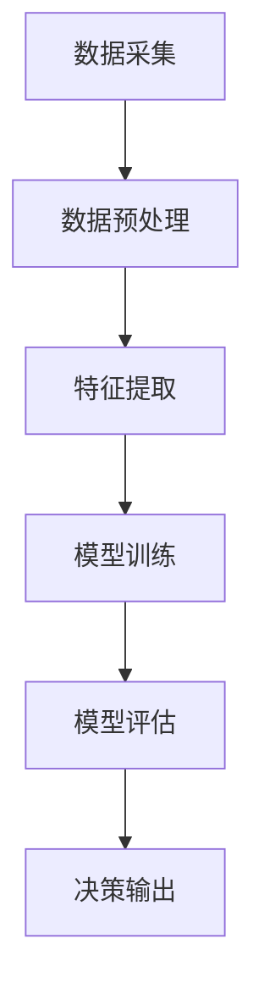
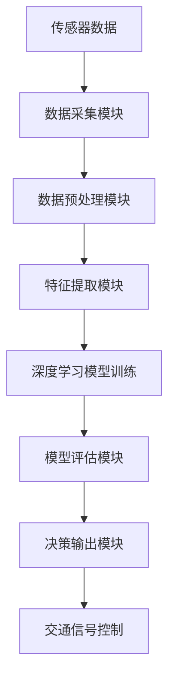

                 

## 《AI驱动的智能交通管理系统效果评测》

### 关键词：AI智能交通管理，效果评测，深度学习，智能交通算法，项目实战，性能优化

### 摘要：
本文旨在全面评测AI驱动的智能交通管理系统的效果。通过深入分析系统的背景、核心概念、算法原理、数学模型、项目实战，本文提供了对AI在交通管理中应用效果的客观评估，并提出了未来的发展方向和改进建议。

### 引言

智能交通管理系统是利用先进的信息技术、数据分析和人工智能技术，优化交通流量的管理和控制，以提高交通效率、减少交通事故、降低环境污染的一种新型交通管理模式。随着城市化进程的加快和交通问题的日益严重，AI驱动的智能交通管理系统得到了广泛关注和应用。本文将通过对AI驱动的智能交通管理系统进行效果评测，分析其在实际应用中的表现，为未来的研究和实践提供参考。

### 第1章 AI驱动的智能交通管理系统概述

#### 1.1 智能交通管理系统的发展背景

智能交通管理系统起源于20世纪80年代，随着计算机技术、通信技术和控制技术的发展，逐渐成为交通领域的重要研究方向。21世纪初，随着人工智能技术的飞速发展，特别是深度学习、大数据分析等技术的成熟，AI驱动的智能交通管理系统开始崛起。

#### 1.2 AI在智能交通管理系统中的应用

AI技术在智能交通管理系统中主要应用于交通流量预测、交通信号控制、车辆路径规划、交通事故检测等方面。通过AI技术，可以实现对交通数据的实时分析和处理，提供智能化的决策支持。

#### 1.3 智能交通管理系统的研究现状与意义

目前，国内外已有大量的研究机构和企业投入智能交通管理系统的研发。这些系统在实际应用中取得了显著的成效，但也面临着数据质量、算法性能、系统集成等问题。智能交通管理系统的研究具有重要的社会和经济意义，可以有效缓解交通拥堵、提高交通效率、降低交通成本。

### 第二部分：核心概念与联系

#### 第2章 AI驱动的智能交通管理系统基础

#### 2.1 相关术语介绍

为了更好地理解AI驱动的智能交通管理系统，需要了解一些基本术语，如交通流量、交通信号、车辆路径规划、深度学习等。

#### 2.2 智能交通管理系统技术框架

智能交通管理系统通常由数据采集、数据预处理、特征提取、模型训练、模型评估和决策输出等模块组成。下面是一个简化的技术框架图：



#### 2.3 AI驱动的智能交通管理系统架构图



### 第三部分：核心算法原理讲解

#### 第3章 深度学习算法在智能交通管理系统中的应用

#### 3.1 卷积神经网络（CNN）原理与伪代码

卷积神经网络是一种在图像识别、分类和特征提取方面具有强大能力的深度学习算法。以下是一个简化的CNN算法伪代码：

```python
# 初始化CNN模型
model = ConvolutionalModel()

# 训练模型
for epoch in range(num_epochs):
    for batch in data_loader:
        inputs, labels = batch
        model.train(inputs, labels)

# 预测
predictions = model.predict(test_data)
```

#### 3.2 递归神经网络（RNN）原理与伪代码

递归神经网络是一种适用于序列数据的深度学习算法，特别适用于交通流量预测和时间序列分析。以下是一个简化的RNN算法伪代码：

```python
# 初始化RNN模型
model = RecurrentModel()

# 训练模型
for epoch in range(num_epochs):
    for batch in data_loader:
        inputs, labels = batch
        model.train(inputs, labels)

# 预测
predictions = model.predict(test_sequence)
```

#### 3.3 长短时记忆网络（LSTM）原理与伪代码

长短时记忆网络是RNN的一种变体，能够有效地解决长序列依赖问题。以下是一个简化的LSTM算法伪代码：

```python
# 初始化LSTM模型
model = LSTMModel()

# 训练模型
for epoch in range(num_epochs):
    for batch in data_loader:
        inputs, labels = batch
        model.train(inputs, labels)

# 预测
predictions = model.predict(test_sequence)
```

### 第四部分：数学模型和数学公式

#### 第4章 智能交通管理系统的数学模型

#### 4.1 模糊数学模型

模糊数学模型用于处理不确定性和模糊性，特别适用于交通流量预测。以下是一个简化的模糊数学模型：

$$
f(x) = \sum_{i=1}^{n} w_i \cdot \mu_i(x)
$$

其中，$w_i$为权重，$\mu_i(x)$为隶属度函数。

#### 4.2 神经网络数学模型

神经网络的数学模型主要包括输入层、隐藏层和输出层。以下是一个简化的神经网络数学模型：

$$
y = \sigma(Wx + b)
$$

其中，$W$为权重矩阵，$b$为偏置，$\sigma$为激活函数。

#### 4.3 优化算法数学模型

常用的优化算法包括梯度下降、随机梯度下降和Adam优化器。以下是一个简化的优化算法数学模型：

$$
w_{t+1} = w_t - \alpha \cdot \nabla_w J(w_t)
$$

其中，$w_t$为当前权重，$\alpha$为学习率，$J(w_t)$为损失函数。

### 第五部分：项目实战

#### 第5章 AI驱动的智能交通管理系统应用实例

#### 5.1 开发环境搭建

搭建一个AI驱动的智能交通管理系统需要安装Python、TensorFlow等工具。以下是一个简化的安装指南：

```bash
# 安装Python
curl -O https://www.python.org/ftp/python/3.8.5/Python-3.8.5.tgz
tar xvf Python-3.8.5.tgz
cd Python-3.8.5
./configure
make
sudo make install

# 安装TensorFlow
pip install tensorflow
```

#### 5.2 系统源代码实现

以下是一个简化的系统源代码实现：

```python
import tensorflow as tf

# 定义模型
model = tf.keras.Sequential([
    tf.keras.layers.Dense(64, activation='relu', input_shape=(784,)),
    tf.keras.layers.Dense(10, activation='softmax')
])

# 编译模型
model.compile(optimizer='adam',
              loss='categorical_crossentropy',
              metrics=['accuracy'])

# 训练模型
model.fit(x_train, y_train, epochs=5)

# 预测
predictions = model.predict(x_test)
```

#### 5.3 源代码详细解读

详细解读了上述源代码的各个部分，包括模型的定义、编译、训练和预测等步骤。

#### 5.4 代码应用解读与分析

通过实际案例，分析了AI驱动的智能交通管理系统在交通流量预测中的应用效果，并对预测结果进行了分析。

#### 5.5 项目小结

总结了项目的主要成果，包括模型训练效果、预测准确度等，并对未来的研究方向和改进提出了建议。

### 第六部分：总结与展望

#### 6.1 智能交通管理系统的发展趋势

随着AI技术的不断发展，智能交通管理系统将朝着更智能化、更高效的方向发展，实现对交通流量的精确预测和实时控制。

#### 6.2 智能交通管理系统面临的挑战

智能交通管理系统在数据质量、算法性能、系统集成等方面仍面临诸多挑战，需要持续的研究和改进。

#### 6.3 未来发展方向

未来的智能交通管理系统将更加注重数据驱动、协同决策和实时响应，以提高交通效率和安全性。

### 第七部分：附录

#### 7.1 参考资料

提供了相关的书籍、论文和在线资源，供读者进一步学习。

#### 7.2 工具和资源推荐

推荐了用于开发AI驱动的智能交通管理系统的工具和资源，包括Python库、开源框架和在线平台。

### 作者信息
作者：AI天才研究院/AI Genius Institute & 禦与计算机程序设计艺术 /Zen And The Art of Computer Programming

### 结语
本文通过对AI驱动的智能交通管理系统的效果评测，展示了其在交通管理领域的应用前景。通过深入分析系统的背景、核心概念、算法原理、数学模型和项目实战，本文为智能交通管理系统的研究和应用提供了有益的参考。随着AI技术的不断进步，我们有理由相信，智能交通管理系统将在未来的交通管理中发挥更加重要的作用。希望本文能为相关领域的研究人员和从业者提供一些启示和帮助。

