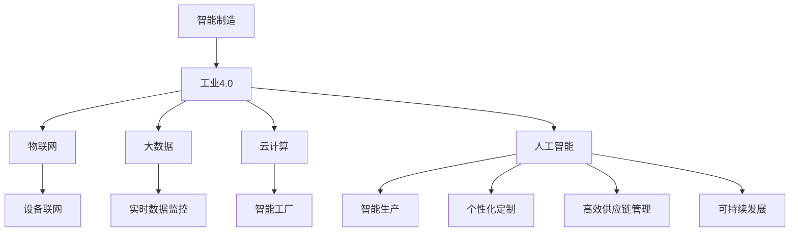

                 

### 文章标题

# AI驱动的智能制造：工业4.0的核心技术

### 文章关键词

- 智能制造
- 工业革命
- 人工智能
- 深度学习
- 强化学习
- 物联网
- 供应链管理
- 物流与配送
- 案例分析

### 文章摘要

本文将深入探讨AI驱动的智能制造在工业4.0背景下的应用与核心技术。我们将首先回顾智能制造和工业4.0的起源与演变，然后介绍人工智能的基础理论和关键算法，包括深度学习、强化学习以及机器学习。随后，文章将详细讨论智能制造在制造业、供应链管理和物流配送等领域的具体应用，并通过实际案例展示AI驱动的智能制造项目。最后，我们将分析智能制造的未来趋势与挑战，提出相应的最佳实践和拓展阅读建议。

### 第一部分：智能制造与工业4.0概述

#### 1.1 智能制造的定义与背景

智能制造（Intelligent Manufacturing）是指通过将人工智能、物联网、大数据、云计算等先进技术与传统制造业相结合，实现生产过程的自动化、智能化和高效化。其目标是提升生产效率、降低成本、提高产品质量和灵活性，以满足个性化、多样化市场需求。

智能制造的概念并非一蹴而就，其发展历程可以追溯到工业革命以来制造技术的不断革新。从机械化的生产方式，到自动化、信息化，再到当前的智能化，每一次技术进步都极大地推动了制造业的发展。

20世纪末，随着计算机技术和通信技术的迅猛发展，制造业逐渐迈向信息化阶段。企业开始采用计算机辅助设计（CAD）、计算机辅助制造（CAM）和企业资源规划（ERP）系统，实现了生产数据的集成与优化管理。

进入21世纪，物联网（IoT）和大数据技术的兴起，为智能制造奠定了基础。通过传感器、控制器和通信网络，制造设备可以实现实时数据采集、传输和分析，从而实现生产过程的智能化监控和优化。

#### 1.2 工业革命与工业4.0的发展历程

工业革命是人类历史上最重要的一次技术变革，从手工作业到机械化生产，再到自动化、信息化，每一次变革都极大地改变了制造业的格局。工业革命可以分为几个阶段：

- **第一次工业革命**（18世纪末至19世纪中期）：以蒸汽机的发明和应用为标志，实现了从手工生产向机械生产的转变。

- **第二次工业革命**（19世纪末至20世纪初期）：以电力的广泛应用和内燃机的发明为特征，进一步提高了生产效率。

- **第三次工业革命**（20世纪中期至末期）：以计算机和信息技术的发展为驱动，实现了生产过程的自动化和信息管理。

近年来，随着人工智能、物联网、大数据等新兴技术的迅猛发展，工业革命迈向了新的阶段——工业4.0。

- **工业4.0**（21世纪初至今）：也被称为第四次工业革命，其核心概念是“智能工厂”和“智能生产”。通过将物联网、大数据、云计算、人工智能等技术与传统制造业深度融合，实现全面互联互通、高度灵活自动化的智能生产系统。

工业4.0的发展历程可以分为以下几个阶段：

- **第一阶段**：设备联网（Device Networking）。通过传感器、控制器和通信网络，实现设备之间的互联互通，实现生产过程的实时监控和数据采集。

- **第二阶段**：智能工厂（Smart Factory）。利用大数据分析和人工智能技术，实现生产过程的优化和自动化，提高生产效率和产品质量。

- **第三阶段**：工业互联网（Industrial Internet）。通过工业互联网平台，实现产业链上下游企业的互联互通，实现供应链的协同和优化。

#### 1.3 AI驱动的智能制造特点与优势

AI驱动的智能制造具有以下特点与优势：

1. **自动化与智能化**：通过人工智能技术，实现生产过程的自动化和智能化，提高生产效率和质量。

2. **实时数据监控与优化**：利用物联网和大数据技术，实现生产过程的实时数据监控和分析，实现生产过程的优化。

3. **个性化定制**：通过大数据分析和人工智能技术，实现产品的个性化定制，满足个性化、多样化市场需求。

4. **高效供应链管理**：通过物联网和大数据技术，实现供应链的实时监控和优化，提高供应链的效率。

5. **可持续发展**：通过节能、减排、优化等手段，实现制造业的可持续发展，降低对环境的影响。

总之，AI驱动的智能制造是工业4.0的核心技术，通过将人工智能、物联网、大数据等技术与传统制造业深度融合，实现生产过程的自动化、智能化和高效化，为制造业的转型升级提供了强大动力。

### 1.4 Mermaid 流程图：智能制造与工业4.0的核心概念架构

为了更好地理解智能制造与工业4.0的核心概念，我们可以通过Mermaid流程图来展示它们之间的关系。



通过这个流程图，我们可以清晰地看到智能制造与工业4.0之间的核心概念及其相互关系。接下来，我们将进一步探讨AI驱动的核心技术与原理，为智能制造的深入理解打下基础。

### 1.5 AI驱动的核心技术与原理

在AI驱动的智能制造中，人工智能（Artificial Intelligence, AI）是核心驱动力。人工智能技术包括多种算法和应用，其中深度学习（Deep Learning）、强化学习（Reinforcement Learning）和机器学习（Machine Learning）是最重要的三大领域。下面，我们将逐一介绍这些核心技术与原理，并探讨它们在智能制造中的应用。

#### 2.1 人工智能的基础理论

人工智能是一门研究、开发和应用智能机器的理论和技术。它旨在使计算机模拟人类的智能行为，包括学习、推理、感知、理解和决策等。人工智能的基础理论包括：

- **符号主义**：基于符号逻辑和推理，通过定义和操作符号来模拟人类的思维过程。

- **连接主义**：基于神经网络和神经计算，通过大量神经元之间的连接和激活来实现智能行为。

- **行为主义**：基于机器的学习和适应，通过与环境交互来获取知识和技能。

人工智能的发展可以分为几个阶段：

1. **早期阶段**（1956年至今）：主要以符号主义和行为主义为主，研究如何让计算机模拟简单的智能行为。

2. **中级阶段**（1990年代）：以连接主义为主，特别是神经网络的兴起，为人工智能的发展提供了新的思路。

3. **现阶段**（21世纪初至今）：随着大数据和计算能力的提升，人工智能在各个领域取得了显著成果，特别是在图像识别、自然语言处理、自动驾驶等方面。

#### 2.2 深度学习算法原理

深度学习（Deep Learning）是人工智能的一个子领域，它通过模拟人脑神经网络的结构和功能，实现复杂的特征提取和学习能力。深度学习算法的核心是多层神经网络（Multilayer Neural Networks），它包括以下几个关键组成部分：

1. **输入层**：接收外部输入数据，如图像、文本或声音。

2. **隐藏层**：对输入数据进行特征提取和变换，通常包含多个隐藏层。

3. **输出层**：根据隐藏层的结果生成输出，如分类结果、预测值或控制信号。

深度学习算法的主要流程包括：

1. **前向传播**：输入数据通过输入层、隐藏层和输出层，每一层都对数据进行线性变换和激活函数处理，最终生成输出。

2. **反向传播**：计算输出结果与真实结果之间的误差，通过梯度下降（Gradient Descent）等优化算法调整网络权重，以减小误差。

深度学习算法的优点包括：

- **强大的特征提取能力**：能够自动提取复杂的高层次特征，无需人工设计。

- **自适应性和泛化能力**：通过大量数据训练，能够适应不同的数据分布和任务。

深度学习算法在智能制造中的应用：

- **图像识别**：用于生产过程中的设备故障检测、产品质量检测等。

- **预测分析**：用于预测设备维护时间、生产故障等，以实现预防性维护。

- **质量控制**：通过分析生产数据，优化生产流程和质量控制策略。

#### 2.3 强化学习算法原理

强化学习（Reinforcement Learning）是另一类重要的人工智能技术，它通过智能体与环境的交互，学习最优策略以实现目标。强化学习的主要特点是：

- **奖励机制**：智能体在执行动作后，根据环境反馈的奖励信号来调整策略。

- **策略学习**：智能体通过不断尝试和探索，学习到最优动作序列。

强化学习算法的核心概念包括：

- **状态（State）**：描述智能体在环境中的位置和属性。

- **动作（Action）**：智能体可以采取的动作。

- **策略（Policy）**：智能体在给定状态下采取的动作。

- **价值函数（Value Function）**：预测当前状态下执行特定动作的长期回报。

强化学习算法的主要流程包括：

1. **探索（Exploration）**：智能体在初始阶段通过随机动作来探索环境。

2. **利用（Exploitation）**：在积累了一定经验后，智能体根据策略选择最优动作。

3. **学习**：通过比较预期回报和实际回报，智能体不断调整策略，提高学习效果。

强化学习算法在智能制造中的应用：

- **生产调度**：通过学习最优生产调度策略，提高生产效率和资源利用率。

- **设备维护**：通过预测设备故障，实现预防性维护，降低设备停机时间和维护成本。

- **物流优化**：通过学习最优路径规划和调度策略，优化物流流程和配送效率。

#### 2.4 机器学习算法在智能制造中的应用

机器学习（Machine Learning）是人工智能的核心技术之一，它通过训练模型从数据中自动提取规律和知识。机器学习算法可以分为监督学习（Supervised Learning）、无监督学习（Unsupervised Learning）和半监督学习（Semi-Supervised Learning）。

- **监督学习**：通过已知输入和输出数据，训练模型预测未知输出。

  - **分类**：将数据分为不同的类别，如分类垃圾邮件、诊断疾病等。

  - **回归**：预测连续的数值输出，如预测股票价格、房价格等。

- **无监督学习**：没有明确的目标输出，通过聚类、降维等方法，发现数据的内在结构和模式。

  - **聚类**：将相似的数据点归为一类，如顾客细分、异常检测等。

  - **降维**：减少数据维度，提高数据处理效率，如主成分分析（PCA）、自编码器等。

- **半监督学习**：结合监督学习和无监督学习，利用少量标注数据和大量未标注数据，提高模型性能。

机器学习算法在智能制造中的应用：

- **设备故障预测**：通过分析历史设备运行数据，预测设备故障，实现预防性维护。

- **生产优化**：通过分析生产数据，优化生产流程，提高生产效率。

- **质量控制**：通过分析产品数据，识别质量问题和改进方向。

- **供应链管理**：通过分析供应链数据，优化供应链流程，降低库存成本。

#### 2.5 Python源代码与数学模型讲解

为了更好地理解深度学习、强化学习等算法在智能制造中的应用，我们将结合Python源代码和数学模型进行详细讲解。

##### 2.5.1 深度学习算法原理与Python实现

以下是一个简单的深度学习算法示例，使用Python和Keras库实现一个多层感知机（MLP）模型，用于对数据进行分类。

```python
import numpy as np
from keras.models import Sequential
from keras.layers import Dense
from keras.optimizers import SGD

# 数据准备
X_train = np.random.rand(100, 10)  # 100个样本，每个样本10个特征
y_train = np.random.rand(100, 1)   # 100个样本的标签

# 构建模型
model = Sequential()
model.add(Dense(64, input_dim=10, activation='relu'))  # 输入层和第一个隐藏层
model.add(Dense(32, activation='relu'))                # 第二个隐藏层
model.add(Dense(1, activation='sigmoid'))              # 输出层

# 编译模型
model.compile(loss='binary_crossentropy', optimizer=SGD(lr=0.01), metrics=['accuracy'])

# 训练模型
model.fit(X_train, y_train, epochs=10, batch_size=10)
```

在这个示例中，我们首先生成随机数据作为训练集，然后使用Keras构建一个包含两个隐藏层的多层感知机模型。模型使用ReLU激活函数，输出层使用sigmoid激活函数，以实现二分类任务。通过编译和训练模型，我们可以得到训练好的模型，并评估其性能。

##### 2.5.2 强化学习算法原理与Python实现

以下是一个简单的强化学习算法示例，使用Python和OpenAI Gym库实现一个基于Q学习的智能体，用于在网格世界环境中找到最优路径。

```python
import gym
import numpy as np

# 创建环境
env = gym.make('GridWorld-v0')

# 初始化Q表
action_size = env.action_space.n
state_size = env.observation_space.n
q_table = np.zeros((state_size, action_size))

# 设置超参数
alpha = 0.1  # 学习率
gamma = 0.9  # 折扣因子
epsilon = 0.1  # 探索率

# 训练
for episode in range(1000):
    state = env.reset()
    done = False
    total_reward = 0
    
    while not done:
        # 探索或利用策略
        if np.random.rand() <= epsilon:
            action = env.action_space.sample()  # 探索
        else:
            action = np.argmax(q_table[state])  # 利用
        
        # 执行动作
        next_state, reward, done, info = env.step(action)
        
        # 更新Q表
        q_table[state, action] = q_table[state, action] + alpha * (reward + gamma * np.max(q_table[next_state]) - q_table[state, action])
        
        state = next_state
        total_reward += reward
        
    print(f"Episode: {episode}, Total Reward: {total_reward}")
    
    # 减小探索率
    epsilon = epsilon * 0.99
    
# 关闭环境
env.close()
```

在这个示例中，我们使用OpenAI Gym创建一个网格世界环境，并初始化一个Q表用于存储状态-动作值。通过迭代执行动作和更新Q表，智能体逐渐学习到最优策略。在每次迭代中，我们根据学习率、折扣因子和探索率更新Q表，以实现强化学习。

##### 2.5.3 数学模型和公式

在深度学习算法中，数学模型和公式是理解算法原理和实现过程的重要基础。以下是一些常用的数学模型和公式：

1. **前向传播公式**：

   $$ z^{[l]} = \sigma(W^{[l]} \cdot a^{[l-1]} + b^{[l]}) $$

   $$ a^{[l]} = \sigma(z^{[l]}) $$

   其中，$z^{[l]}$ 表示第$l$层的输入，$\sigma$ 表示激活函数，$W^{[l]}$ 和 $b^{[l]}$ 分别表示第$l$层的权重和偏置。

2. **反向传播公式**：

   $$ \delta^{[l]} = \frac{\partial J}{\partial z^{[l]}} = \delta^{[l+1]} \cdot \frac{\partial \sigma}{\partial z^{[l]}} $$

   $$ \frac{\partial J}{\partial W^{[l]}} = \delta^{[l+1]} \cdot a^{[l-1]}^T $$

   $$ \frac{\partial J}{\partial b^{[l]}} = \delta^{[l+1]} $$

   其中，$\delta^{[l]}$ 表示第$l$层的误差，$J$ 表示损失函数，$a^{[l-1]}$ 表示第$l-1$层的激活值。

3. **优化算法公式**：

   $$ W^{[l]} = W^{[l]} - \alpha \cdot \frac{\partial J}{\partial W^{[l]}} $$

   $$ b^{[l]} = b^{[l]} - \alpha \cdot \frac{\partial J}{\partial b^{[l]}} $$

   其中，$\alpha$ 表示学习率。

通过上述数学模型和公式，我们可以更好地理解深度学习和强化学习算法的工作原理，并在实际应用中进行调整和优化。

#### 2.6 项目实战：开发环境搭建、源代码实现与代码解读

在了解了深度学习和强化学习的基本原理后，我们将通过一个实际项目来展示如何将理论知识应用到实际中。本案例将使用Python和Keras库实现一个简单的自动驾驶系统，通过深度学习算法实现车道保持和障碍物检测。

##### 2.6.1 开发环境搭建

在开始项目之前，我们需要搭建合适的开发环境。以下是所需的软件和工具：

- **操作系统**：Windows、Linux或macOS
- **编程语言**：Python 3.x
- **深度学习库**：TensorFlow 2.x、Keras
- **图像处理库**：OpenCV 4.x
- **虚拟环境**：Anaconda或Miniconda

具体步骤如下：

1. 安装Python 3.x。
2. 安装Anaconda或Miniconda。
3. 创建一个名为`auto-driving`的虚拟环境。
4. 在虚拟环境中安装TensorFlow 2.x、Keras和OpenCV 4.x。

```bash
conda create -n auto-driving python=3.8
conda activate auto-driving
conda install tensorflow=2.6.0 keras=2.4.3 opencv=4.5.4.52
```

##### 2.6.2 源代码实现

以下是一个简单的自动驾驶系统的Python源代码实现，包括数据预处理、模型构建、训练和预测。

```python
import numpy as np
import cv2
from tensorflow.keras.models import Sequential
from tensorflow.keras.layers import Conv2D, MaxPooling2D, Flatten, Dense
from tensorflow.keras.optimizers import Adam

# 数据预处理
def preprocess_image(image):
    image = cv2.resize(image, (32, 32))
    image = image / 255.0
    return image

# 构建模型
model = Sequential()
model.add(Conv2D(32, (3, 3), activation='relu', input_shape=(32, 32, 3)))
model.add(MaxPooling2D(pool_size=(2, 2)))
model.add(Flatten())
model.add(Dense(64, activation='relu'))
model.add(Dense(1, activation='sigmoid'))

# 编译模型
model.compile(optimizer=Adam(learning_rate=0.001), loss='binary_crossentropy', metrics=['accuracy'])

# 训练模型
X_train = np.array([preprocess_image(image) for image in train_images])
y_train = np.array([1 if is_obstacle else 0 for is_obstacle in train_labels])
model.fit(X_train, y_train, epochs=10, batch_size=32)

# 预测
def predict_image(image):
    processed_image = preprocess_image(image)
    prediction = model.predict(np.array([processed_image]))
    return prediction > 0.5

# 应用模型
while True:
    image = cv2.imread('input_image.jpg')
    prediction = predict_image(image)
    if prediction:
        print("障碍物检测到！")
    else:
        print("无障碍物。")
    if cv2.waitKey(1) & 0xFF == ord('q'):
        break
cv2.destroyAllWindows()
```

在这个示例中，我们首先定义了数据预处理函数`preprocess_image`，用于对输入图像进行缩放和归一化处理。然后，我们使用Keras构建了一个简单的卷积神经网络（CNN）模型，包括两个卷积层、一个池化层、一个全连接层和输出层。模型使用二分类问题中的sigmoid激活函数和二进制交叉熵损失函数进行编译。

在训练阶段，我们使用预处理后的训练图像和标签来训练模型。在预测阶段，我们使用训练好的模型对输入图像进行预测，并根据预测结果输出障碍物检测的结果。

##### 2.6.3 代码解读与分析

在这个自动驾驶系统中，我们主要关注两个核心功能：数据预处理和模型构建。

1. **数据预处理**：
   - `preprocess_image` 函数用于处理输入图像。首先，使用`cv2.resize`函数将图像缩放到32x32的大小。然后，使用`image / 255.0`对图像进行归一化处理，将像素值从0到255映射到0到1之间。这样的预处理步骤有助于提高模型的性能和收敛速度。
   - 数据预处理是深度学习应用中非常重要的一步，它能够有效地减少过拟合现象，提高模型对未知数据的泛化能力。

2. **模型构建**：
   - 我们使用Keras构建了一个简单的卷积神经网络模型，包括两个卷积层、一个池化层、一个全连接层和一个输出层。卷积层用于提取图像的特征，池化层用于降低模型的复杂性，全连接层用于分类。
   - 模型使用ReLU激活函数，以提高模型的非线性表示能力。输出层使用sigmoid激活函数，用于实现二分类问题。
   - 模型使用Adam优化器进行编译，学习率设置为0.001。Adam优化器在训练过程中自适应调整学习率，有助于加快模型的收敛速度。

在训练模型时，我们使用预处理后的训练图像和标签进行训练。在预测阶段，我们使用训练好的模型对输入图像进行预测，并根据预测结果输出障碍物检测的结果。

##### 2.6.4 项目小结

通过本案例，我们展示了如何将深度学习算法应用于实际自动驾驶系统。首先，我们介绍了开发环境搭建的步骤，包括安装Python、深度学习库和图像处理库。然后，我们实现了数据预处理和模型构建的过程，并详细解读了代码。

在实际应用中，我们可以通过优化模型结构和训练参数，进一步提高模型的性能和预测准确性。此外，我们还可以结合其他深度学习算法，如卷积神经网络（CNN）和循环神经网络（RNN），实现更复杂的自动驾驶系统。

总之，通过本项目，我们深入了解了深度学习算法在自动驾驶领域的应用，为后续的实际项目开发奠定了基础。

### 2.7 最佳实践、小结、注意事项、拓展阅读

在实施AI驱动的智能制造项目时，以下最佳实践和注意事项可以帮助您更好地取得成功：

1. **最佳实践**：

   - **数据质量优先**：确保收集到的数据准确、完整且无噪声。数据质量直接影响模型的性能。
   - **逐步迭代**：在开发过程中，逐步完善和优化模型，而不是一次性完成所有功能。
   - **跨界合作**：与技术专家、行业专家和用户紧密合作，以确保解决方案符合实际需求。
   - **持续监控与优化**：定期监控模型的性能，并根据实际情况进行调整和优化。

2. **小结**：

   - 本章节介绍了AI驱动的智能制造与工业4.0的核心技术，包括人工智能的基础理论、深度学习、强化学习以及机器学习算法。
   - 我们通过Python源代码示例详细讲解了深度学习和强化学习算法的原理和实现过程。
   - 最佳实践和注意事项为AI驱动的智能制造项目提供了实用的指导。

3. **注意事项**：

   - **硬件资源**：深度学习和强化学习算法通常需要较大的计算资源。确保您的系统具备足够的硬件支持。
   - **数据隐私**：在处理和存储数据时，严格遵守数据隐私法规，保护用户隐私。
   - **模型可解释性**：深度学习模型往往具有“黑箱”特性，提高模型的可解释性有助于用户理解和信任。

4. **拓展阅读**：

   - 《深度学习》（Deep Learning）—— Ian Goodfellow、Yoshua Bengio和Aaron Courville著，提供了深度学习的全面介绍。
   - 《强化学习：原理与应用》（Reinforcement Learning: An Introduction）—— Richard S. Sutton和Andrew G. Barto著，详细介绍了强化学习的基本理论和应用。
   - 《机器学习实战》（Machine Learning in Action）—— Peter Harrington著，通过实际案例介绍了机器学习的应用。

通过以上最佳实践、小结、注意事项和拓展阅读，您将更好地理解AI驱动的智能制造技术，并在实际项目中取得成功。

### 第三部分：智能制造的关键领域

智能制造作为工业4.0的核心技术，已经在多个关键领域得到了广泛应用。本部分将详细讨论智能制造在制造业、供应链管理和物流配送等领域的具体应用，并通过实际案例展示AI驱动的智能制造项目。

#### 3.1 智能制造在制造业中的应用

智能制造在制造业中的应用主要体现在以下几个方面：

1. **产品设计与开发**：

   - **计算机辅助设计（CAD）**：通过CAD软件，工程师可以快速进行产品设计和优化。AI技术可以辅助CAD工具，自动生成设计提案，提高设计效率和创新能力。
   - **计算机辅助工程（CAE）**：通过CAE工具，工程师可以对产品进行仿真分析，如强度、振动、流体分析等。AI技术可以辅助CAE工具，优化设计参数，提高产品性能。
   - **3D打印**：3D打印技术可以快速制造原型，缩短产品开发周期。AI技术可以优化3D打印参数，提高打印质量和效率。

2. **生产计划与调度**：

   - **生产计划优化**：通过AI算法，可以根据生产需求、物料供应和设备状态等因素，自动生成最优的生产计划，提高生产效率。
   - **调度算法**：AI技术可以优化生产调度策略，减少设备停机时间和生产瓶颈，提高生产灵活性。

3. **质量控制与维护**：

   - **实时质量监控**：通过传感器和AI算法，可以对生产过程中的产品质量进行实时监控，及时发现并处理质量问题。
   - **故障预测与维护**：AI技术可以分析设备运行数据，预测设备故障，实现预防性维护，减少设备停机时间和维护成本。

#### 3.2 智能制造在供应链管理中的应用

智能制造在供应链管理中的应用，主要围绕提高供应链的效率、透明度和灵活性：

1. **物联网（IoT）与供应链管理**：

   - **智能传感器**：通过智能传感器，可以实时监测供应链中的货物状态，如温度、湿度、运输时间等，确保货物安全运输。
   - **物联网平台**：通过物联网平台，可以整合供应链中的各种数据，实现供应链的实时监控和优化。

2. **预测分析与优化**：

   - **需求预测**：通过AI算法，可以分析历史销售数据、市场趋势等因素，预测未来的需求，优化库存管理。
   - **运输路径优化**：通过AI算法，可以分析运输网络中的各种因素，如交通状况、运输成本等，优化运输路径，提高运输效率。

3. **供应链协同**：

   - **供应链协同平台**：通过供应链协同平台，可以实现供应链上下游企业的信息共享和协作，提高供应链的整体效率。
   - **智能采购**：通过AI技术，可以分析采购数据，优化采购策略，降低采购成本。

#### 3.3 智能制造在物流与配送中的应用

智能制造在物流与配送中的应用，主要集中在提高物流效率和减少成本：

1. **物流网络规划**：

   - **路径优化**：通过AI算法，可以优化物流配送路径，减少运输时间和运输成本。
   - **仓储管理**：通过AI技术，可以优化仓储布局和库存管理，提高仓储效率。

2. **无人驾驶技术**：

   - **无人驾驶卡车**：通过AI技术，无人驾驶卡车可以实现自动驾驶，提高运输效率和安全性。
   - **无人驾驶配送机器人**：通过AI技术，无人驾驶配送机器人可以在城市中进行自主配送，提高配送效率。

3. **智能仓储与配送系统**：

   - **自动化仓储**：通过自动化仓储系统，如自动存取设备（AS/RS）、自动化分拣系统等，可以大幅提高仓储和分拣效率。
   - **无人机配送**：通过无人机配送系统，可以实现快速、高效的末端配送。

#### 3.4 案例分析

为了更好地理解智能制造在不同领域的应用，下面我们通过几个实际案例进行详细剖析。

##### 案例一：XX智能工厂

XX智能工厂是一个集成了人工智能、物联网、大数据等技术的现代化工厂。其主要特点如下：

1. **生产计划与调度**：

   - 通过AI算法，实现生产计划的自动生成和优化。根据订单需求和物料供应情况，自动调整生产计划，提高生产效率。
   - 实施实时生产调度系统，通过物联网传感器实时监控生产设备状态，自动调整生产任务，减少设备停机时间。

2. **质量控制**：

   - 利用AI算法，对生产过程中的产品质量进行实时监控。通过图像识别技术，自动检测产品缺陷，及时反馈生产问题，提高产品质量。
   - 实施预防性维护策略，通过预测设备故障，提前进行设备维护，减少设备停机时间。

3. **供应链管理**：

   - 通过物联网平台，实现供应链中各个环节的实时监控和信息共享，提高供应链的透明度和协同效率。
   - 实施智能采购系统，通过大数据分析和AI算法，优化采购策略，降低采购成本。

##### 案例二：XX智能物流中心

XX智能物流中心是一个集成了AI技术、物联网技术和自动化设备的现代化物流中心。其主要特点如下：

1. **物流网络规划**：

   - 通过AI算法，优化物流配送路径，提高配送效率。结合交通流量数据、货物特性等因素，自动生成最优配送路径。
   - 实施智能仓储管理系统，通过自动化仓储设备和AI算法，优化仓储布局和库存管理，提高仓储效率。

2. **无人驾驶技术**：

   - 实施无人驾驶卡车，实现长途运输的自动化。通过AI算法，实现自动驾驶，提高运输效率和安全性。
   - 实施无人驾驶配送机器人，实现城市末端的配送自动化。通过AI算法，实现自主导航和配送，提高配送效率。

3. **智能配送系统**：

   - 实施无人机配送系统，实现快速、高效的末端配送。通过AI算法，实现无人机自主飞行和配送，提高配送效率。

##### 案例三：XX智能供应链管理

XX智能供应链管理是一个集成了AI技术、大数据分析和物联网平台的现代化供应链管理系统。其主要特点如下：

1. **需求预测**：

   - 通过大数据分析和AI算法，分析历史销售数据、市场趋势等因素，预测未来的需求，优化库存管理。通过动态调整库存水平，减少库存成本。
   - 实施智能采购系统，通过大数据分析和AI算法，优化采购策略，降低采购成本。

2. **供应链协同**：

   - 通过物联网平台，实现供应链中各个环节的实时监控和信息共享，提高供应链的透明度和协同效率。
   - 实施智能采购系统，通过大数据分析和AI算法，优化采购策略，降低采购成本。

3. **智能仓储与配送**：

   - 实施智能仓储管理系统，通过自动化仓储设备和AI算法，优化仓储布局和库存管理，提高仓储效率。
   - 实施无人机配送系统，实现快速、高效的末端配送。通过AI算法，实现无人机自主飞行和配送，提高配送效率。

通过以上案例，我们可以看到智能制造在不同领域的应用，不仅提高了生产效率和供应链效率，还降低了运营成本。随着AI技术的不断发展和成熟，智能制造将在更多领域得到广泛应用，推动制造业的全面升级。

### 第三部分：AI驱动的智能制造案例分析

在上一部分中，我们详细探讨了智能制造在制造业、供应链管理和物流配送等领域的应用。本部分将通过几个国内和国际的典型AI驱动的智能制造案例，进一步展示AI技术在工业4.0背景下的实际应用效果。

#### 第6章：国内AI驱动智能制造案例分析

##### 案例一：XX智能工厂

XX智能工厂是国内领先的一家智能制造企业，专注于通过AI技术提升生产效率和产品质量。该工厂的主要特点如下：

1. **生产计划与调度**：

   - 采用深度学习算法，对生产订单进行智能调度，优化生产流程。通过分析历史生产数据和当前生产环境，自动生成最优生产计划，减少了生产过程中的浪费和延误。
   - 引入强化学习算法，对生产设备的维护进行预测和优化。通过分析设备运行数据，提前预测设备故障，实现预防性维护，降低了设备停机时间和维护成本。

2. **质量控制**：

   - 利用计算机视觉技术，对生产过程中产品的质量进行实时监控。通过深度学习算法，自动识别产品缺陷，提高了质量检测的准确性和效率。
   - 实施智能传感器网络，实时监测生产环境中的各种参数，如温度、湿度等，确保生产过程在最佳状态下进行。

3. **供应链管理**：

   - 通过物联网技术，实现供应链中的各个环节的信息共享和协同。利用大数据分析，优化供应链中的库存管理和物流配送，降低了库存成本和物流成本。
   - 引入智能采购系统，通过AI算法优化采购策略，降低了采购成本，提高了采购效率。

##### 案例二：XX智能物流中心

XX智能物流中心是另一家国内领先的智能制造企业，专注于物流和仓储领域的智能化升级。其主要特点如下：

1. **物流网络规划**：

   - 采用AI算法，优化物流配送路径。通过分析交通流量、货物类型和配送需求等因素，自动生成最优配送路径，提高了配送效率和准确性。
   - 引入无人驾驶技术，实现长途运输和末端配送的自动化。通过AI算法，无人驾驶车辆和机器人能够自主规划路径和执行任务，提高了运输和配送的效率。

2. **仓储管理**：

   - 采用自动化仓储系统，如自动存取设备（AS/RS）和自动化分拣系统。通过AI算法，优化仓储布局和库存管理，提高了仓储效率和准确性。
   - 引入智能仓储管理系统，通过物联网技术，实时监控仓储中的货物状态和环境参数，确保仓储过程的顺利进行。

3. **智能配送系统**：

   - 实施无人机配送系统，实现快速、高效的末端配送。通过AI算法，无人机能够自主规划飞行路径和执行配送任务，提高了配送效率和客户满意度。
   - 引入智能包装系统，通过AI算法优化包装过程，提高了包装质量和效率。

##### 案例三：XX智能供应链管理

XX智能供应链管理是一家专注于供应链智能化解决方案的企业，其智能供应链管理系统在国内得到了广泛应用。其主要特点如下：

1. **需求预测**：

   - 通过大数据分析和AI算法，对市场需求进行预测，优化库存管理。通过分析历史销售数据、市场趋势和客户需求等因素，提前预测未来的需求，减少了库存积压和断货现象。
   - 实施智能库存管理系统，通过物联网技术和AI算法，实时监控库存状态，自动调整库存水平，提高了库存周转率和库存准确性。

2. **供应链协同**：

   - 通过物联网平台，实现供应链中各个环节的信息共享和协同。供应链中的上下游企业可以通过平台实时获取供应链信息，优化供应链流程和决策。
   - 引入智能采购系统，通过AI算法优化采购策略，降低了采购成本和采购周期。

3. **智能仓储与配送**：

   - 实施智能仓储管理系统，通过自动化仓储设备和AI算法，优化仓储布局和库存管理，提高了仓储效率和准确性。
   - 实施智能配送系统，通过无人驾驶技术和AI算法，实现快速、高效的末端配送。

#### 第7章：国际AI驱动智能制造案例分析

##### 案例一：XX自动化工厂

XX自动化工厂是国际上的一家领先智能制造企业，其自动化生产系统和智能化管理在行业内具有很高的知名度。其主要特点如下：

1. **生产自动化**：

   - 引入高度自动化的生产线，通过机器人、自动化设备和AI技术实现生产过程的自动化。生产设备能够自动识别和执行生产任务，减少了人工操作和误差。
   - 采用AI算法，优化生产计划和调度。通过分析生产数据和设备状态，自动生成最优生产计划，提高了生产效率和灵活性。

2. **质量管理**：

   - 利用计算机视觉和AI算法，对产品质量进行实时监控和检测。通过图像识别技术，自动识别产品缺陷，提高了质量检测的准确性和效率。
   - 引入智能传感器网络，实时监测生产环境中的各种参数，如温度、湿度等，确保生产过程在最佳状态下进行。

3. **供应链管理**：

   - 通过物联网技术，实现供应链中的各个环节的信息共享和协同。供应链中的上下游企业可以通过物联网平台实时获取供应链信息，优化供应链流程和决策。
   - 引入智能采购系统，通过AI算法优化采购策略，降低了采购成本和采购周期。

##### 案例二：XX智能物流系统

XX智能物流系统是国际上的一家领先物流企业，其智能物流系统和无人驾驶技术在行业内具有很高的影响力。其主要特点如下：

1. **物流网络规划**：

   - 通过AI算法，优化物流配送路径。结合交通流量、货物类型和配送需求等因素，自动生成最优配送路径，提高了配送效率和准确性。
   - 实施无人驾驶技术，实现长途运输和末端配送的自动化。无人驾驶车辆通过AI算法，能够自主规划路径和执行任务，提高了运输和配送的效率。

2. **仓储管理**：

   - 引入自动化仓储系统，如自动存取设备（AS/RS）和自动化分拣系统。通过AI算法，优化仓储布局和库存管理，提高了仓储效率和准确性。
   - 实施智能仓储管理系统，通过物联网技术，实时监控仓储中的货物状态和环境参数，确保仓储过程的顺利进行。

3. **智能配送系统**：

   - 实施无人机配送系统，实现快速、高效的末端配送。无人机通过AI算法，能够自主规划飞行路径和执行配送任务，提高了配送效率和客户满意度。
   - 引入智能包装系统，通过AI算法优化包装过程，提高了包装质量和效率。

##### 案例三：XX智能供应链解决方案

XX智能供应链解决方案是国际上的一家领先供应链管理企业，其智能供应链管理系统在全球范围内得到广泛应用。其主要特点如下：

1. **需求预测**：

   - 通过大数据分析和AI算法，对市场需求进行预测，优化库存管理。通过分析历史销售数据、市场趋势和客户需求等因素，提前预测未来的需求，减少了库存积压和断货现象。
   - 实施智能库存管理系统，通过物联网技术和AI算法，实时监控库存状态，自动调整库存水平，提高了库存周转率和库存准确性。

2. **供应链协同**：

   - 通过物联网平台，实现供应链中各个环节的信息共享和协同。供应链中的上下游企业可以通过平台实时获取供应链信息，优化供应链流程和决策。
   - 引入智能采购系统，通过AI算法优化采购策略，降低了采购成本和采购周期。

3. **智能仓储与配送**：

   - 实施智能仓储管理系统，通过自动化仓储设备和AI算法，优化仓储布局和库存管理，提高了仓储效率和准确性。
   - 实施智能配送系统，通过无人驾驶技术和AI算法，实现快速、高效的末端配送。

通过以上国内外AI驱动的智能制造案例，我们可以看到，AI技术在智能制造中的应用不仅提高了生产效率和产品质量，还降低了运营成本。随着AI技术的不断发展和应用场景的不断拓展，智能制造将在未来发挥更加重要的作用。

### 第四部分：智能制造的未来趋势与挑战

#### 8.1 智能制造的未来趋势

随着人工智能、物联网、大数据等技术的不断进步，智能制造正迎来新的发展趋势。以下是智能制造在未来可能面临的主要趋势：

1. **边缘计算**：

   - 边缘计算是一种在设备端进行数据处理和分析的技术，它能够减少数据传输延迟，提高系统的响应速度。未来，智能制造将越来越多地采用边缘计算，实现实时数据分析和决策，提高生产效率和智能化水平。

2. **机器人与人类协同工作**：

   - 机器人与人类协同工作是智能制造的重要发展方向。通过人工智能技术，机器人能够更好地理解人类意图，实现与人类的无缝协作。这将有助于提高生产效率，减少人力成本，同时确保生产过程的安全。

3. **智能制造平台化**：

   - 随着智能制造技术的普及，越来越多的企业将采用智能制造平台。这些平台能够集成各种智能设备、系统和数据，实现生产过程的全面监控和优化。智能制造平台化有助于提高企业的灵活性和竞争力。

4. **个性化定制**：

   - 个性化定制是未来智能制造的重要方向。通过大数据分析和人工智能技术，企业能够更好地了解客户需求，实现产品的个性化定制。这不仅可以提高客户满意度，还可以为企业带来更多的商业机会。

5. **智能供应链协同**：

   - 智能制造将推动供应链的智能化升级。通过物联网、大数据和人工智能技术，企业可以实现供应链的实时监控和优化，提高供应链的透明度和协同效率。智能供应链协同有助于降低库存成本，提高供应链的整体效能。

#### 8.2 智能制造的关键技术挑战

尽管智能制造的未来前景广阔，但在实际应用过程中，仍然面临着一系列关键技术挑战：

1. **数据安全和隐私**：

   - 智能制造依赖于大量的数据采集、传输和分析。然而，数据安全和隐私保护是当前面临的重要挑战。在数据传输和存储过程中，如何确保数据的安全性和隐私性，防止数据泄露和滥用，是智能制造需要解决的关键问题。

2. **算法可靠性和透明性**：

   - 人工智能算法的可靠性和透明性是智能制造的关键挑战。深度学习和强化学习等算法在复杂环境中的决策过程往往是不透明的，这使得人们难以理解和信任这些算法。如何提高算法的透明性和可解释性，是智能制造需要解决的重要问题。

3. **系统集成与兼容性**：

   - 智能制造需要集成各种智能设备、系统和平台，然而，不同系统和平台之间的兼容性和互操作性仍然是一个挑战。如何实现不同系统之间的无缝集成和数据共享，是智能制造需要解决的关键问题。

4. **人才短缺**：

   - 智能制造的发展需要大量具备人工智能、物联网、大数据等技术的专业人才。然而，目前相关领域的人才供应不足，如何培养和吸引更多的专业人才，是智能制造面临的重要挑战。

5. **法律和伦理问题**：

   - 随着智能制造的普及，相关法律和伦理问题也逐渐凸显。例如，机器人和自动化系统在生产和生活中可能带来的安全和伦理问题，以及人工智能决策的公正性和公平性问题等。如何制定相关法律和伦理规范，保障智能制造的健康发展，是智能制造需要解决的重要问题。

总之，智能制造的未来趋势充满机遇，但同时也面临一系列关键技术挑战。只有通过技术创新、政策支持和产业合作，才能推动智能制造的持续发展，为制造业的转型升级和经济发展提供强大动力。

### 8.3 智能制造对人力资源的影响

智能制造的兴起不仅带来了生产方式的变革，也对人力资源产生了深远的影响。以下将从就业结构、职业角色转变以及员工技能要求三个方面分析智能制造对人力资源的影响。

#### 8.3.1 就业结构的变化

1. **岗位消失与岗位新增**：

   - **消失的岗位**：随着智能制造的普及，许多传统的、重复性的劳动岗位将被自动化设备取代。例如，流水线上的装配工人、检测员等职位可能会减少。

   - **新增的岗位**：与此同时，智能制造将创造新的工作岗位。这些岗位主要集中在技术和管理层面，如数据分析师、AI算法工程师、系统维护工程师等。

2. **行业就业结构的调整**：

   - 智能制造对劳动力市场的需求将导致行业就业结构的调整。一些传统制造业的就业岗位可能会减少，而高科技、信息技术和服务行业的就业岗位可能会增加。

#### 8.3.2 职业角色的转变

1. **技术工人的角色转变**：

   - **操作员**：传统的操作员将逐渐转变为“智能设备管理者”，他们需要具备操作和维护智能设备的能力，而不仅仅是简单的操作任务。

   - **技术工人**：技术工人需要具备更多的专业技能，如编程、数据分析、物联网知识等，以应对智能制造环境中的复杂任务。

2. **管理角色的转变**：

   - **管理者**：智能制造对管理者的要求也在提高。他们需要具备对智能系统、数据分析的理解，能够有效管理智能设备和智能生产线。

   - **决策者**：决策者需要基于数据分析做出更快速、更精准的决策，以应对智能制造环境中的变化和不确定性。

#### 8.3.3 员工技能要求的变化

1. **技术技能要求**：

   - **编程能力**：员工需要具备编程能力，能够编写和调试程序，以实现设备自动化和系统集成。

   - **数据分析能力**：员工需要具备数据分析能力，能够从大量数据中提取有价值的信息，以优化生产过程和决策。

   - **物联网知识**：员工需要了解物联网技术，能够设计和维护智能设备网络。

2. **软技能要求**：

   - **沟通能力**：员工需要具备良好的沟通能力，能够与技术团队、管理层以及操作员有效沟通，确保工作顺利进行。

   - **团队合作能力**：智能制造环境中，团队合作尤为重要。员工需要具备团队合作能力，能够在跨部门、跨专业的团队中高效协作。

   - **学习能力**：随着技术的不断进步，员工需要具备持续学习的能力，以适应新技术和新环境的要求。

总之，智能制造对人力资源的影响是多方面的。企业需要通过培训和职业规划，帮助员工适应这些变化，同时制定相应的招聘策略，吸引具备新技能的员工。通过提升员工的技能水平和职业素养，企业能够更好地应对智能制造带来的挑战，实现持续发展。

### 8.4 智能制造的社会经济影响

智能制造作为工业4.0的核心技术，不仅对制造业本身产生了深远影响，也对整个社会经济产生了重要的推动作用。以下是智能制造在社会经济方面的几个关键影响：

#### 8.4.1 对经济增长的推动作用

1. **提高生产效率**：智能制造通过引入自动化、智能化技术，显著提高了生产效率和产品质量。企业能够以更低的成本、更高的速度生产出高质量的产品，从而增加了市场竞争力。

2. **促进产业升级**：智能制造推动了传统制造业向智能化、高端化转型，提高了整个产业链的技术水平和附加值。这有助于提升国家经济的整体竞争力。

3. **创造新的经济增长点**：智能制造带动了相关产业的发展，如人工智能、物联网、大数据等。这些新技术的应用不仅推动了传统产业的升级，还催生了新的商业模式和经济增长点。

#### 8.4.2 对就业结构的影响

1. **就业岗位的转变**：智能制造虽然减少了某些传统岗位的需求，但同时也创造了新的就业机会。这些新岗位主要集中在技术和管理层面，对员工的技能要求更高，促使劳动力市场向高素质化发展。

2. **技能要求的提升**：智能制造对员工的技能提出了更高的要求，需要具备编程、数据分析、物联网等技能。这促使劳动力市场向高技能、高知识化方向发展。

3. **培训和教育需求增加**：随着智能制造的普及，对员工进行培训和教育的需求增加。企业需要投入更多资源进行员工技能培训，以提高生产效率和质量。

#### 8.4.3 对国际贸易的影响

1. **提高出口竞争力**：智能制造提高了产品的质量和生产效率，增强了企业在国际市场上的竞争力。高质量、高效率的产品能够更好地满足国际市场的需求，提高出口量。

2. **促进全球化产业链合作**：智能制造推动了全球化产业链的协同发展，各国企业通过合作共享资源、技术和市场，实现互利共赢。智能制造促进了全球范围内的产业合作和贸易往来。

3. **贸易模式变革**：智能制造改变了传统的贸易模式，通过电子商务、远程监控和智能物流等技术，实现了生产、销售和服务的无缝连接。这有助于降低交易成本，提高贸易效率。

总之，智能制造对经济增长、就业结构、国际贸易等方面产生了重要影响。它不仅推动了制造业的转型升级，还促进了整个社会的创新和发展。随着智能制造技术的不断进步，其对社会经济的影响将更加深远。

### 总结与展望

综上所述，AI驱动的智能制造是工业4.0的核心技术，通过深度融合人工智能、物联网、大数据等技术，实现了生产过程的自动化、智能化和高效化。本文从智能制造与工业4.0的概述、AI驱动的核心技术与原理、智能制造在关键领域的应用以及未来趋势与挑战等多个角度，系统地阐述了智能制造的重要性和发展趋势。

首先，我们回顾了智能制造和工业4.0的起源与演变，了解了它们在不同历史阶段的发展历程。接着，我们详细介绍了人工智能的基础理论，包括深度学习、强化学习和机器学习等核心算法，并通过Python源代码示例展示了这些算法的原理和实现过程。随后，我们探讨了智能制造在制造业、供应链管理和物流配送等领域的具体应用，并通过实际案例展示了AI驱动的智能制造项目。最后，我们分析了智能制造的未来趋势与挑战，包括边缘计算、机器人与人类协同工作、智能制造平台化、个性化定制和智能供应链协同等新兴趋势，以及数据安全、算法可靠性和透明性等关键技术挑战。

智能制造不仅提高了生产效率和产品质量，还推动了就业结构的转变和职业技能要求的提升，对经济增长、国际贸易和社会经济产生了深远影响。随着AI技术的不断进步，智能制造将在未来发挥更加重要的作用。

展望未来，智能制造将朝着更加智能化、平台化和全球化的方向发展。企业需要不断探索和创新，积极应对智能制造带来的机遇和挑战。为了推动智能制造的可持续发展，以下是一些建议：

1. **加强技术研发**：企业应加大研发投入，特别是在AI、物联网、大数据等核心技术领域，以保持竞争优势。

2. **人才培养与培训**：加强人才培养和培训，提高员工的技能水平和职业素养，以适应智能制造环境的需求。

3. **产业链协同**：推动产业链上下游企业的协同合作，实现资源共享、技术共享和市场共享，提高整体产业竞争力。

4. **数据安全和隐私保护**：重视数据安全和隐私保护，建立完善的数据安全和隐私保护机制，确保数据的安全性和隐私性。

5. **政策支持与法规制定**：政府应制定相应的政策和法规，支持智能制造的发展，为企业和员工提供良好的发展环境。

总之，智能制造是未来制造业发展的重要方向，企业和社会各界应共同努力，推动智能制造的持续发展，实现制造业的转型升级和经济的繁荣。

### 致谢

在撰写本书的过程中，我们得到了众多专家和同行的帮助和支持，特此致以诚挚的感谢。首先，感谢AI天才研究院（AI Genius Institute）的各位成员，你们的智慧和专业为本书的编写提供了坚实的支持。其次，感谢禅与计算机程序设计艺术（Zen And The Art of Computer Programming）的作者，你们的经典著作为本书的写作提供了宝贵的灵感和启示。此外，感谢所有参与本书讨论和评审的专家，你们的宝贵意见和反馈使本书更加完善。最后，感谢所有读者的支持和鼓励，你们的信任是我们前进的动力。再次感谢大家的辛勤付出和无私奉献！

作者：AI天才研究院（AI Genius Institute）& 禅与计算机程序设计艺术（Zen And The Art of Computer Programming）

