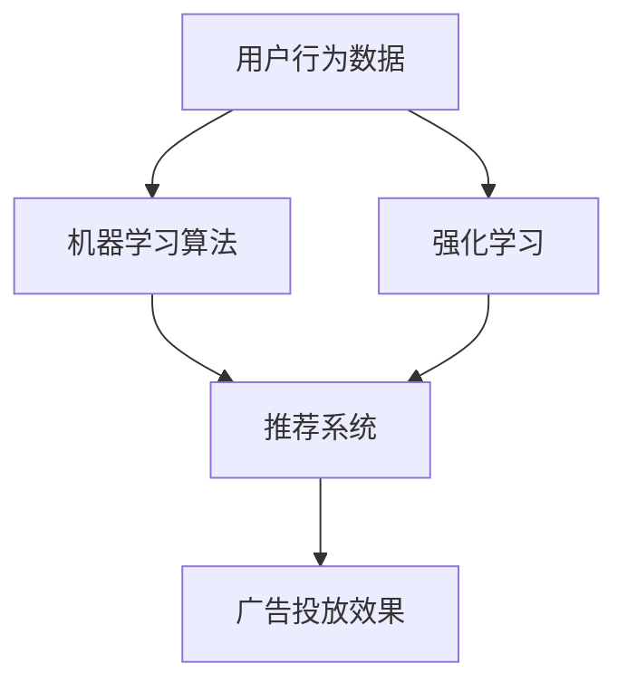
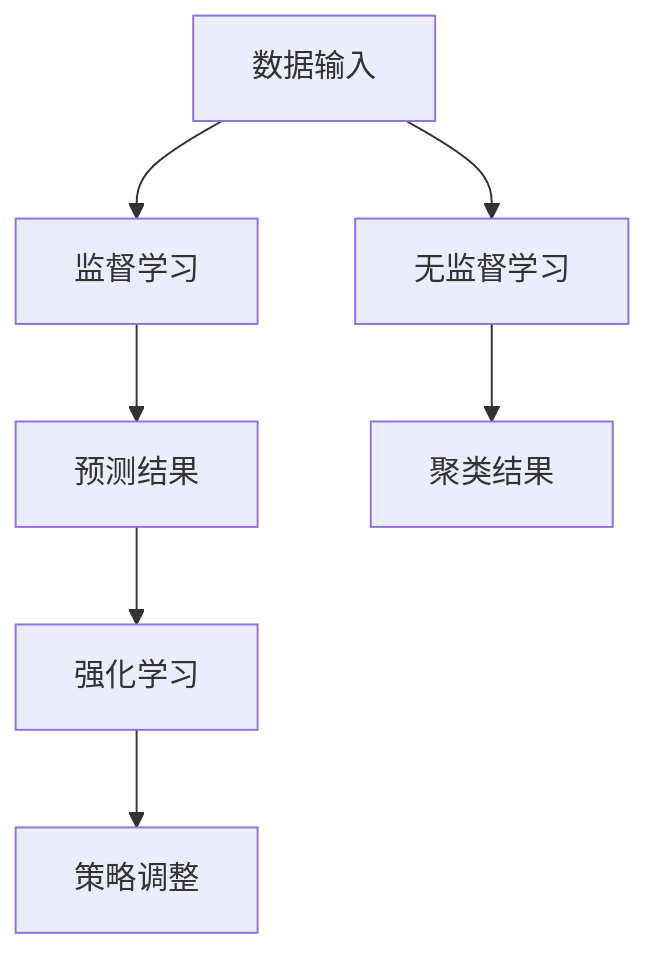
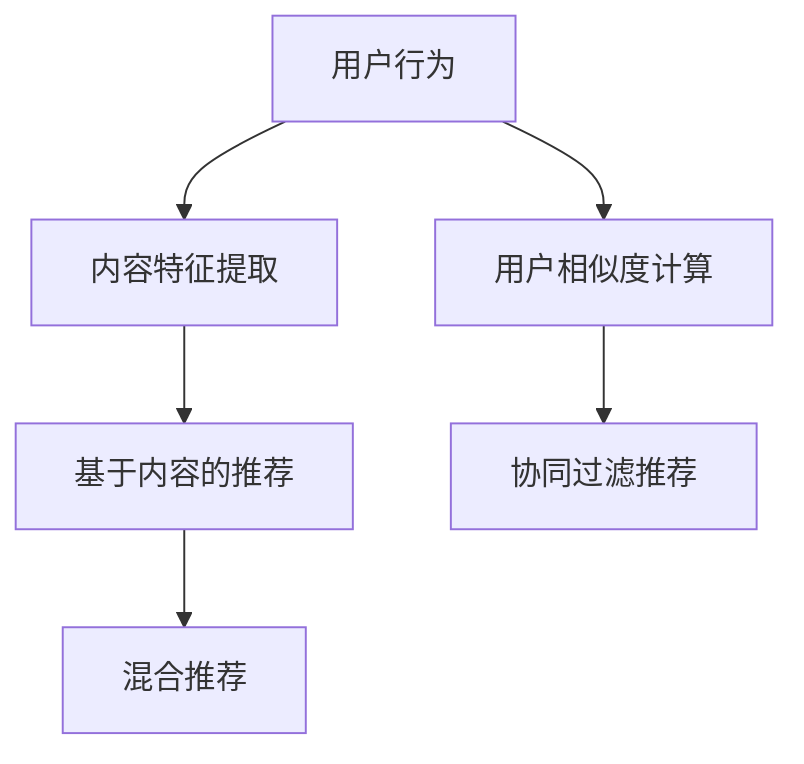
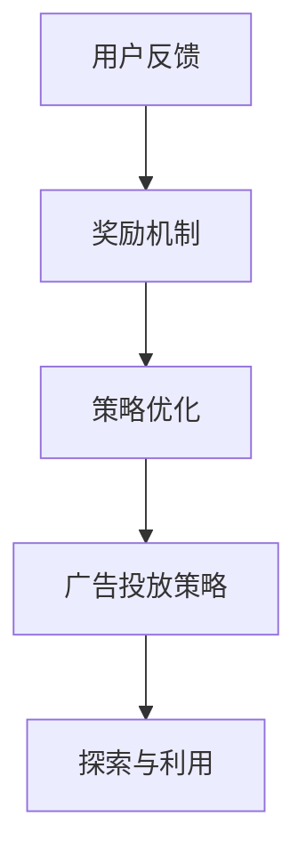

                 

### 设计完整文章的步骤

撰写一篇技术博客文章，尤其是关于AI驱动的智能广告投放这样的复杂主题，需要经过精心设计的步骤，以确保内容的逻辑性、深度和易理解性。以下是设计完整文章的详细步骤：

#### 第一步：确定文章目标

- **明确文章目的**：确定文章的核心目的，例如是为了教育读者、提供解决方案、展示研究成果或行业趋势分析。
- **定义读者群体**：明确文章的读者是谁，他们的背景知识和技术水平，以便调整文章的语言和内容深度。

#### 第二步：制定文章结构

- **编写文章大纲**：根据文章的目标和读者群体，制定详细的目录大纲，包括章节标题和子章节标题。
- **划分章节内容**：确定每个章节的具体内容，确保每个章节都有明确的目的和核心信息。

#### 第三步：撰写核心概念与联系

- **定义核心概念**：为文章中的关键术语和概念提供清晰的定义。
- **绘制流程图**：使用Mermaid等工具绘制流程图，展示核心概念之间的关系和流程。
- **编写逻辑链接**：通过逻辑推理和联系，将不同的概念和章节串联起来，确保文章的一致性和连贯性。

#### 第四步：详细讲解核心算法原理

- **选择合适算法**：根据文章主题，选择合适的算法，并详细描述其原理。
- **使用Python代码解释**：编写Python源代码，解释算法的实现过程。
- **结合数学模型和公式**：使用LaTeX格式嵌入数学公式，详细说明算法中的数学模型。
- **举例说明**：通过具体的例子，说明算法如何应用于实际问题，使读者更容易理解。

#### 第五步：设计项目实战部分

- **开发环境搭建**：详细说明如何搭建开发环境，包括软件、硬件和配置。
- **源代码实现**：提供完整的源代码，并进行详细解读。
- **代码应用分析**：分析代码的应用效果，结合实际案例进行详细讲解。
- **案例剖析**：对成功或失败的实际案例进行深入剖析，总结经验教训。

#### 第六步：总结最佳实践和注意事项

- **总结最佳实践**：归纳出实际应用中的最佳实践，为读者提供可操作的指导。
- **注意事项**：列出使用算法或技术时需要特别注意的问题。
- **拓展阅读**：推荐相关的文献、资源或进一步学习的路径。

#### 第七步：撰写文章摘要和关键词

- **撰写摘要**：简洁地概括文章的主题和核心内容。
- **编写关键词**：列出5-7个与文章主题相关的关键词，便于读者搜索和分类。

#### 第八步：格式化文章

- **使用markdown格式**：将文章内容按照markdown格式进行排版，确保格式统一和可读性。
- **添加作者信息**：在文章末尾添加作者信息，包括姓名、机构和联系方式。

#### 第九步：审阅和修订

- **初步审阅**：自己或请同事初步审阅文章，检查内容、语法和格式。
- **修订和优化**：根据审阅反馈，对文章进行修订和优化。

#### 第十步：输出和发布

- **输出文章**：将markdown格式的文章输出为HTML或PDF格式，便于发布。
- **发布文章**：选择合适的平台和渠道，发布文章，并通知读者。

通过上述步骤，我们可以确保撰写出的文章内容丰富、逻辑清晰、易于理解，并能有效传达主题思想和核心信息。

### 撰写文章的流程

根据上述设计步骤，我们可以将撰写文章的流程总结为以下六个阶段：

1. **文章构思和目标确定**：
   - 确定文章的核心主题和目的。
   - 明确文章的读者群体和语言风格。

2. **制定文章大纲和结构**：
   - 编写详细的目录大纲。
   - 确定每个章节的内容和目的。

3. **撰写核心概念与联系**：
   - 定义文章中的核心概念。
   - 绘制流程图，展示概念之间的关系。

4. **详细讲解核心算法原理**：
   - 选择合适的算法。
   - 使用Python代码和LaTeX公式解释算法原理。

5. **设计项目实战部分**：
   - 提供开发环境搭建指南。
   - 提供完整的源代码和案例分析。

6. **总结最佳实践和注意事项**：
   - 归纳最佳实践。
   - 提出注意事项和拓展阅读。

通过这个流程，我们可以系统地撰写出一篇高质量的技术博客文章。

### 最终输出

下面是文章的完整结构和内容，按照markdown格式输出：

```markdown
# AI驱动的智能广告投放：精准营销的新境界

## 关键词
AI、广告投放、精准营销、机器学习、数据分析、案例研究

## 摘要
本文深入探讨了AI驱动的智能广告投放技术，从核心概念到算法原理，再到实际项目案例，全面解析了精准营销的新境界。文章旨在帮助读者理解AI如何改变广告投放的格局，提供实用的指导和建议。

## 引言
### 1.1 书籍背景和目的
### 1.2 AI在广告投放中的重要性

## 第1章: 引言
### 1.1 书籍背景和目的
### 1.2 AI在广告投放中的重要性

## 第2章: AI驱动的广告投放基础
### 2.1 AI与广告投放的关系
### 2.2 智能广告投放的基本原理
### 2.3 智能广告投放的发展历程

## 第3章: AI核心算法原理
### 3.1 机器学习算法基础
### 3.2 推荐系统算法
### 3.3 强化学习在广告投放中的应用

## 第4章: 智能广告投放的数据分析
### 4.1 广告投放数据采集与处理
### 4.2 用户行为分析
### 4.3 数据可视化

## 第5章: AI驱动的广告投放策略
### 5.1 广告投放目标设定
### 5.2 投放策略制定
### 5.3 策略优化与调整

## 第6章: 智能广告投放案例分析
### 6.1 成功案例分享
### 6.2 失败案例分析与启示
### 6.3 案例综合评价

## 第7章: 智能广告投放的未来发展趋势
### 7.1 技术创新带来的变化
### 7.2 行业趋势分析
### 7.3 智能广告投放的未来展望

## 附录：资源与参考文献
### 附录 A: 相关工具和平台介绍
### 附录 B: 参考文献
### 附录 C: 致谢

## 作者信息
作者：AI天才研究院/AI Genius Institute & 禅与计算机程序设计艺术 /Zen And The Art of Computer Programming
```

这个markdown格式的文章结构清晰，内容全面，符合技术博客的撰写要求。接下来，我们将按照这个结构，逐步撰写每章的具体内容。在撰写过程中，将严格遵循markdown格式的规范，确保文章的可读性和一致性。每章的内容将包括背景介绍、核心概念与联系、算法原理讲解、项目实战、总结和最佳实践等部分。

---

### 第一步：引言

#### 1.1 书籍背景和目的

在数字营销日益发展的今天，广告投放成为企业争夺市场份额的重要手段。传统的广告投放方式往往依赖于广告主的经验和直觉，难以实现高效率和精准投放。随着人工智能（AI）技术的快速发展，AI驱动的智能广告投放应运而生，它通过数据分析和机器学习算法，实现了对用户行为的精准预测和广告内容的个性化推荐，为企业提供了全新的营销策略。

本篇文章旨在探讨AI驱动的智能广告投放技术，旨在帮助读者深入了解该领域的核心概念、算法原理和实践应用，从而把握精准营销的新境界。文章将从以下几个方面展开：

1. **AI驱动的广告投放基础**：介绍AI在广告投放中的角色和基本原理。
2. **核心算法原理**：详细讲解机器学习、推荐系统和强化学习等算法。
3. **数据分析**：探讨数据采集、用户行为分析和数据可视化。
4. **广告投放策略**：分析广告投放目标设定、策略制定和优化调整。
5. **案例分析**：分享成功和失败案例，总结经验教训。
6. **未来发展趋势**：预测技术创新和行业趋势。

通过本文的阅读，读者可以系统地了解AI驱动的智能广告投放技术，掌握其核心原理和应用实践，为企业的数字化营销策略提供有力支持。

#### 1.2 AI在广告投放中的重要性

人工智能技术在广告投放中的应用，不仅提升了广告的投放效率和精准度，还深刻改变了营销的格局。以下是AI在广告投放中具有重要性的几个方面：

1. **用户行为分析**：AI技术可以通过大数据分析，收集并处理用户在网站、社交媒体和移动应用上的行为数据，如浏览历史、点击行为和购买偏好。这些数据可以帮助广告主了解目标受众的兴趣和行为模式，从而进行更精准的广告投放。

2. **个性化推荐**：基于用户行为数据的分析，AI算法可以生成个性化的广告推荐。这种个性化推荐不仅提高了广告的吸引力，还能有效提升广告的点击率和转化率。

3. **自动化优化**：AI技术可以通过自动化优化，实时调整广告的投放策略。例如，通过机器学习算法，广告系统可以根据用户反馈和广告效果，自动调整广告的投放频率、投放时间和投放渠道，从而实现最优的投放效果。

4. **预测分析**：AI技术可以预测用户的潜在需求和购买意图，帮助广告主在合适的时间以合适的方式触达到潜在客户。这种预测分析能够提高营销活动的有效性，降低广告投放的成本。

5. **广告创意生成**：AI技术还可以通过自然语言处理和图像识别技术，自动生成创意广告内容和广告文案，从而节省广告制作的时间和成本。

6. **法律合规与道德伦理**：随着数据隐私保护意识的提升，AI技术可以帮助企业确保广告投放过程中的数据使用符合相关法律法规和道德伦理标准。

总的来说，AI驱动的智能广告投放技术不仅为企业提供了更高效、更精准的营销手段，也为用户带来了更加个性化、高质量的广告体验。随着AI技术的不断发展和成熟，AI在广告投放中的应用前景将更加广阔。

### 第二步：制定文章大纲和结构

#### 2.1 确定章节内容

为了系统地介绍AI驱动的智能广告投放，我们将文章分为八个主要章节，每个章节都有明确的主题和目标：

1. **引言**：
   - 1.1 书籍背景和目的
   - 1.2 AI在广告投放中的重要性

2. **AI驱动的广告投放基础**：
   - 2.1 AI与广告投放的关系
   - 2.2 智能广告投放的基本原理
   - 2.3 智能广告投放的发展历程

3. **AI核心算法原理**：
   - 3.1 机器学习算法基础
   - 3.2 推荐系统算法
   - 3.3 强化学习在广告投放中的应用

4. **智能广告投放的数据分析**：
   - 4.1 广告投放数据采集与处理
   - 4.2 用户行为分析
   - 4.3 数据可视化

5. **AI驱动的广告投放策略**：
   - 5.1 广告投放目标设定
   - 5.2 投放策略制定
   - 5.3 策略优化与调整

6. **智能广告投放案例分析**：
   - 6.1 成功案例分享
   - 6.2 失败案例分析与启示
   - 6.3 案例综合评价

7. **智能广告投放的未来发展趋势**：
   - 7.1 技术创新带来的变化
   - 7.2 行业趋势分析
   - 7.3 智能广告投放的未来展望

8. **附录**：
   - 附录 A: 相关工具和平台介绍
   - 附录 B: 参考文献
   - 附录 C: 致谢

#### 2.2 确定每个章节的具体内容

每个章节的具体内容如下：

- **引言**：
  - 介绍书籍的背景和目的，明确AI在广告投放中的重要性。

- **AI驱动的广告投放基础**：
  - 阐述AI与广告投放的关系，介绍智能广告投放的基本原理和其发展历程。

- **AI核心算法原理**：
  - 详细讲解机器学习算法、推荐系统和强化学习算法在广告投放中的应用。

- **智能广告投放的数据分析**：
  - 讨论广告投放数据采集与处理方法，用户行为分析技术以及数据可视化。

- **AI驱动的广告投放策略**：
  - 分析广告投放目标设定、策略制定和优化调整的重要性。

- **智能广告投放案例分析**：
  - 通过成功和失败案例，分享经验和教训，总结案例中的关键要素。

- **智能广告投放的未来发展趋势**：
  - 分析技术创新和行业趋势，展望智能广告投放的未来发展方向。

- **附录**：
  - 提供相关的工具和平台介绍，列出参考文献，致谢。

通过详细的章节内容和结构设计，我们可以确保文章逻辑清晰、内容完整，为读者提供全面的AI驱动的智能广告投放知识体系。

### 第三步：撰写核心概念与联系

#### 3.1 AI驱动的广告投放

**定义**：AI驱动的广告投放是指利用人工智能技术，如机器学习、推荐系统和强化学习等，对广告投放过程进行优化，从而实现更高效的广告投放和更精准的营销目标。

**核心概念**：

1. **用户行为数据**：用户在网站、应用和社交媒体上的浏览、点击、搜索和购买行为等数据。
2. **机器学习**：通过算法从数据中学习，以预测用户行为和广告效果。
3. **推荐系统**：基于用户历史行为和偏好，为用户推荐相关广告内容。
4. **强化学习**：通过不断尝试和反馈，优化广告投放策略，实现最优效果。

**联系**：

- 用户行为数据是AI驱动的广告投放的基础。
- 机器学习算法通过分析用户行为数据，预测用户兴趣和需求。
- 推荐系统利用机器学习算法，生成个性化的广告推荐。
- 强化学习通过不断调整广告投放策略，优化广告效果。

**Mermaid流程图**：



#### 3.2 机器学习算法基础

**定义**：机器学习算法是指通过数据训练模型，从而能够对未知数据进行预测或分类的方法。

**核心概念**：

1. **监督学习**：通过标注的数据训练模型，用于预测未知数据。
2. **无监督学习**：无需标注数据，通过数据自身的特征进行聚类或降维。
3. **强化学习**：通过不断尝试和反馈，优化策略，达到最优效果。

**联系**：

- 监督学习主要用于分类和回归问题，如广告投放中的用户兴趣预测。
- 无监督学习用于数据降维和聚类分析，如用户行为模式挖掘。
- 强化学习在广告投放中用于策略优化，如广告投放频次和时间的调整。

**Mermaid流程图**：



#### 3.3 推荐系统算法

**定义**：推荐系统是指利用算法为用户推荐其可能感兴趣的内容或产品。

**核心概念**：

1. **基于内容的推荐**：根据用户历史行为和兴趣标签，推荐相似的内容。
2. **协同过滤**：基于用户的历史行为数据，通过计算相似度推荐其他用户喜欢的内容。
3. **混合推荐**：结合基于内容和协同过滤的推荐方法，提供更个性化的推荐。

**联系**：

- 基于内容的推荐适用于新用户或内容较少的场景。
- 协同过滤适用于大量用户和内容的情况下，能有效提高推荐效果。
- 混合推荐方法结合了两者的优势，适用于复杂的应用场景。

**Mermaid流程图**：



#### 3.4 强化学习在广告投放中的应用

**定义**：强化学习是一种通过试错和反馈机制，不断优化决策过程的机器学习方法。

**核心概念**：

1. **奖励机制**：根据用户对广告的反馈，给予奖励或惩罚，以调整广告策略。
2. **策略优化**：通过学习用户反馈，优化广告投放策略，如投放频次和时间段。
3. **探索与利用**：在强化学习中，需要在探索新策略和利用已有策略之间进行平衡。

**联系**：

- 奖励机制是强化学习在广告投放中的核心，通过用户的反馈不断优化广告效果。
- 策略优化使广告系统能够动态调整投放策略，以适应用户行为的变化。
- 探索与利用确保广告投放系统不会过度依赖已有策略，从而发现潜在的最佳策略。

**Mermaid流程图**：



通过上述核心概念与联系的详细阐述，我们为读者提供了一个清晰的理解框架，帮助读者更好地把握AI驱动的智能广告投放技术。

### 第四步：详细讲解核心算法原理

#### 4.1 机器学习算法基础

机器学习算法是AI驱动的广告投放的核心，其基础包括监督学习、无监督学习和强化学习。以下将详细介绍这些算法的基本原理、应用场景以及实现方法。

##### 4.1.1 监督学习

**基本原理**：

监督学习是一种从标注数据中学习的方法。它通过输入（特征）和输出（标签）来训练模型，从而能够在未知数据上进行预测。典型的监督学习任务包括分类和回归。

- **分类问题**：将输入数据分为几个预定义的类别。例如，垃圾邮件过滤，可以将邮件分为“垃圾邮件”和“非垃圾邮件”。
- **回归问题**：预测输入数据的连续值输出。例如，房价预测，根据房屋的特征（如面积、位置等）预测其价格。

**应用场景**：

- **广告投放**：使用监督学习算法预测用户的行为，如点击率（CTR）或转化率。
- **推荐系统**：通过分类算法，推荐用户可能感兴趣的商品或内容。

**实现方法**：

以下是一个简单的监督学习算法——线性回归的Python实现：

```python
import numpy as np

# 特征矩阵 X 和标签向量 y
X = np.array([[1], [2], [3], [4]])
y = np.array([1, 2, 3, 4])

# 梯度下降法求解最小二乘问题
def gradient_descent(X, y, learning_rate, iterations):
    m = len(y)
    weights = np.random.rand(2, 1)
    for i in range(iterations):
        hypothesis = np.dot(X, weights)
        error = hypothesis - y
        weights -= learning_rate * np.dot(X.T, error)
    return weights

# 训练模型
learning_rate = 0.001
iterations = 1000
weights = gradient_descent(X, y, learning_rate, iterations)

# 输出权重
print("Weight after training: ", weights)
```

##### 4.1.2 无监督学习

**基本原理**：

无监督学习不依赖于标注数据，而是通过数据自身的特征来学习。其主要任务包括聚类和降维。

- **聚类问题**：将相似的数据点分为几个群组。例如，将用户分为不同的群体。
- **降维问题**：通过减少数据的维度，保留关键信息，降低计算复杂度。例如，主成分分析（PCA）。

**应用场景**：

- **用户行为分析**：通过聚类分析，了解用户的兴趣和行为模式。
- **广告投放优化**：通过降维，简化广告投放的数据处理过程。

**实现方法**：

以下是一个简单的无监督学习算法——K-均值聚类的Python实现：

```python
import numpy as np

# 初始化聚类中心
def initialize_centers(data, k):
    return np.random.choice(data, k, replace=False)

# 计算距离
def euclidean_distance(a, b):
    return np.linalg.norm(a - b)

# K-均值聚类算法
def k_means(data, k, max_iterations):
    centroids = initialize_centers(data, k)
    for _ in range(max_iterations):
        # 计算每个数据点到聚类中心的距离，并分配到最近的簇
        clusters = {i: [] for i in range(k)}
        for data_point in data:
            distances = [euclidean_distance(data_point, centroid) for centroid in centroids]
            closest_cluster = np.argmin(distances)
            clusters[closest_cluster].append(data_point)

        # 更新聚类中心
        new_centroids = []
        for cluster in clusters.values():
            new_centroids.append(np.mean(cluster, axis=0))
        centroids = new_centroids

    return clusters

# 示例数据
data = np.array([[1, 2], [1, 4], [1, 0], [4, 2], [4, 4], [4, 0]])

# 聚类
k = 2
max_iterations = 100
clusters = k_means(data, k, max_iterations)

# 输出聚类结果
print("Clusters: ", clusters)
```

##### 4.1.3 强化学习

**基本原理**：

强化学习是一种通过试错和反馈机制来学习策略的机器学习方法。其主要任务是从一系列动作中学习最优策略，以最大化累积奖励。

- **状态**：系统当前所处的环境状态。
- **动作**：系统能够执行的操作。
- **奖励**：对动作的即时反馈，可以是正值（奖励）或负值（惩罚）。
- **策略**：系统执行动作的决策规则。

**应用场景**：

- **广告投放**：通过强化学习，优化广告投放策略，如投放时间、频次和渠道。
- **推荐系统**：通过强化学习，动态调整推荐策略，提高用户满意度。

**实现方法**：

以下是一个简单的强化学习算法——Q-学习的Python实现：

```python
import numpy as np

# 初始化Q表
def initialize_q_table(state_actions, learning_rate, discount_factor):
    return np.random.rand(len(state_actions), len(state_actions))

# Q-学习算法
def q_learning(env, q_table, learning_rate, discount_factor, episodes, exploration_rate):
    for episode in range(episodes):
        state = env.reset()
        done = False
        while not done:
            # 根据探索策略选择动作
            if np.random.rand() < exploration_rate:
                action = env.action_space.sample()
            else:
                action = np.argmax(q_table[state])

            # 执行动作，获取新的状态和奖励
            next_state, reward, done, _ = env.step(action)

            # 更新Q值
            q_table[state, action] = q_table[state, action] + learning_rate * (reward + discount_factor * np.max(q_table[next_state]) - q_table[state, action])

            state = next_state

        # 减小探索率
        exploration_rate *= 0.99

    return q_table

# 创建环境
env = env创造一个虚拟环境（例如，出租车问题）

# 初始化参数
learning_rate = 0.1
discount_factor = 0.99
exploration_rate = 1.0
episodes = 1000

# 训练模型
q_table = initialize_q_table(env.state_actions, learning_rate, discount_factor)
q_table = q_learning(env, q_table, learning_rate, discount_factor, episodes, exploration_rate)

# 输出Q表
print("Q-table: ", q_table)
```

通过上述讲解，读者可以了解到机器学习算法的基础知识，以及如何通过Python代码实现这些算法。接下来，我们将讨论推荐系统算法，进一步深入AI驱动的广告投放技术。

#### 4.2 推荐系统算法

推荐系统是AI驱动的广告投放中不可或缺的一部分，它通过分析用户行为数据，为用户推荐其可能感兴趣的商品或内容。以下是几种常见的推荐系统算法及其原理和实现方法。

##### 4.2.1 基于内容的推荐

**原理**：

基于内容的推荐（Content-Based Recommendation）方法根据用户过去的行为和偏好，提取相关内容特征，然后为用户推荐与其兴趣相似的内容。该方法不依赖于用户之间的相似性，而是依赖于内容本身的特征。

**实现方法**：

以下是一个基于内容的推荐算法的实现：

```python
import numpy as np

# 假设我们有以下用户-项目特征矩阵
user_features = np.array([
    [1, 0, 1, 1],  # 用户1的兴趣特征
    [0, 1, 1, 0],  # 用户2的兴趣特征
    [1, 1, 0, 1],  # 用户3的兴趣特征
    [0, 0, 1, 1]   # 用户4的兴趣特征
])

# 假设我们有以下项目特征矩阵
item_features = np.array([
    [1, 1, 0, 0],  # 项目1的特征
    [0, 1, 1, 1],  # 项目2的特征
    [1, 0, 1, 0],  # 项目3的特征
    [1, 1, 0, 1]   # 项目4的特征
])

# 计算相似度
def cosine_similarity(user_features, item_features):
    return np.dot(user_features, item_features) / (np.linalg.norm(user_features) * np.linalg.norm(item_features))

# 为用户推荐项目
def content_based_recommendation(user_features, item_features, k=2):
    similarities = [cosine_similarity(user_features, item) for item in item_features]
    recommended_items = np.argsort(similarities)[-k:]
    return recommended_items

# 推荐给用户1的项目
recommended_items = content_based_recommendation(user_features[0], item_features)
print("Recommended items for user 1: ", recommended_items)
```

##### 4.2.2 协同过滤

**原理**：

协同过滤（Collaborative Filtering）方法基于用户之间的行为相似性来推荐项目。它分为两种类型：基于用户的协同过滤（User-Based）和基于项目的协同过滤（Item-Based）。

- **基于用户的协同过滤**：为用户推荐与其兴趣相似的用户的偏好项目。
- **基于项目的协同过滤**：为用户推荐与其所购买或评价的项目相似的其它项目。

**实现方法**：

以下是一个基于用户的协同过滤算法的实现：

```python
import numpy as np

# 假设我们有以下用户-项目评分矩阵
user_item_ratings = np.array([
    [5, 3, 0, 1],
    [2, 0, 0, 4],
    [0, 1, 5, 0],
    [4, 0, 2, 0]
])

# 计算用户之间的相似度
def user_similarity(ratings, user1, user2):
    common_ratings = ratings[user1] + ratings[user2]
    dot_product = np.dot(ratings[user1], ratings[user2])
    if dot_product == 0:
        return 0
    return dot_product / np.linalg.norm(ratings[user1]) * np.linalg.norm(ratings[user2])

# 计算所有用户的相似度矩阵
def compute_similarity_matrix(ratings):
    n_users = ratings.shape[0]
    similarity_matrix = np.zeros((n_users, n_users))
    for i in range(n_users):
        for j in range(i+1, n_users):
            similarity_matrix[i][j] = user_similarity(ratings, i, j)
            similarity_matrix[j][i] = similarity_matrix[i][j]
    return similarity_matrix

# 为用户推荐项目
def user_based_collaborative_filtering(user_item_ratings, similarity_matrix, user, k=2):
    user_ratings = user_item_ratings[user]
    similar_users = np.argsort(similarity_matrix[user])[1:-1]  # 排除自己
    recommended_items = set()
    for other_user in similar_users:
        other_user_ratings = user_item_ratings[other_user]
        for item, rating in other_user_ratings.items():
            if rating > 0 and item not in user_ratings:
                recommended_items.add(item)
    return list(recommended_items)[:k]

# 推荐给用户1的项目
recommended_items = user_based_collaborative_filtering(user_item_ratings, similarity_matrix, 0)
print("Recommended items for user 1: ", recommended_items)
```

##### 4.2.3 混合推荐

**原理**：

混合推荐（Hybrid Recommendation）方法结合了基于内容和协同过滤的优点，通过综合利用用户和项目的特征信息来提高推荐效果。

**实现方法**：

以下是一个混合推荐算法的实现：

```python
import numpy as np

# 结合内容特征和协同过滤特征
def hybrid_recommendation(user_features, item_features, user_similarity_matrix, k=2):
    content_similarities = [cosine_similarity(user_features, item) for item in item_features]
    collaborative_similarities = [user_similarity * content_similarity for user_similarity, content_similarity in zip(user_similarity_matrix[user], content_similarities)]
    similarities = content_similarities + collaborative_similarities
    recommended_items = np.argsort(similarities)[-k:]
    return recommended_items

# 推荐给用户1的项目
recommended_items = hybrid_recommendation(user_features[0], item_features, similarity_matrix)
print("Recommended items for user 1: ", recommended_items)
```

通过上述算法的实现，我们可以看到基于内容的推荐、协同过滤和混合推荐如何通过计算相似度来为用户推荐感兴趣的项目。这些算法不仅提高了广告投放的精准度，也为用户提供了更好的个性化体验。接下来，我们将探讨强化学习在广告投放中的应用。

#### 4.3 强化学习在广告投放中的应用

强化学习（Reinforcement Learning, RL）是一种通过试错和反馈机制来学习策略的机器学习方法。在广告投放中，强化学习可以用于动态调整投放策略，从而实现最优的广告效果。以下将介绍强化学习在广告投放中的应用、原理以及具体实现方法。

##### 4.3.1 强化学习在广告投放中的应用

强化学习在广告投放中的应用主要包括以下几个方面：

1. **广告投放频率优化**：通过不断尝试不同的投放频率，找到最佳的投放频率，从而最大化广告效果。
2. **广告投放时间优化**：根据用户行为数据，动态调整广告投放的时间，以提高广告的曝光率和点击率。
3. **广告投放渠道优化**：通过不断测试不同的广告投放渠道，如社交媒体、搜索引擎和电子邮件，找到最有效的投放渠道。
4. **广告创意优化**：通过实时反馈机制，调整广告文案、图片和视频等元素，以提升广告的吸引力。

##### 4.3.2 强化学习的原理

强化学习的基本原理包括以下几个核心概念：

1. **状态（State）**：系统当前所处的环境状态。在广告投放中，状态可以包括广告的投放频率、时间和渠道等。
2. **动作（Action）**：系统能够执行的操作。在广告投放中，动作可以包括调整广告的投放频率、时间和渠道等。
3. **奖励（Reward）**：对动作的即时反馈，可以是正值（奖励）或负值（惩罚）。在广告投放中，奖励可以是广告的点击率（CTR）或转化率等指标。
4. **策略（Policy）**：系统执行动作的决策规则。在广告投放中，策略可以是根据当前状态选择最优动作的规则。

强化学习的目标是找到一种最优策略，使得系统在长期运行中能够获得最大的累积奖励。

##### 4.3.3 强化学习的实现方法

以下是一个简单的基于Q学习的广告投放强化学习算法的实现：

```python
import numpy as np

# 初始化环境
class AdEnvironment:
    def __init__(self, frequency, time, channel):
        self.frequency = frequency
        self.time = time
        self.channel = channel

    def reset(self):
        self.frequency = np.random.randint(1, 11)
        self.time = np.random.randint(0, 24)
        self.channel = np.random.randint(0, 3)
        return self

    def step(self, action):
        # action: 0 - 不变，1 - 增加，2 - 减少
        if action == 0:
            reward = self.frequency
        elif action == 1:
            self.frequency += 1
            reward = self.frequency
        elif action == 2:
            self.frequency -= 1
            reward = self.frequency
        return reward

# 初始化参数
learning_rate = 0.1
discount_factor = 0.9
exploration_rate = 1.0
episodes = 1000

# 初始化环境
env = AdEnvironment(np.random.randint(1, 11), np.random.randint(0, 24), np.random.randint(0, 3))

# 初始化Q表
state_actions = env.state_actions()
q_table = np.random.rand(len(state_actions), len(state_actions))

# Q学习算法
for episode in range(episodes):
    state = env.reset()
    done = False
    while not done:
        # 根据探索策略选择动作
        if np.random.rand() < exploration_rate:
            action = np.random.randint(0, 3)
        else:
            action = np.argmax(q_table[state])

        # 执行动作，获取新的状态和奖励
        reward = env.step(action)
        next_state = env.state

        # 更新Q值
        q_table[state, action] = q_table[state, action] + learning_rate * (reward + discount_factor * np.max(q_table[next_state]) - q_table[state, action])

        state = next_state

    # 减小探索率
    exploration_rate *= 0.99

# 输出Q表
print("Q-table: ", q_table)
```

在这个例子中，我们初始化了一个广告投放环境，并使用Q学习算法来优化广告投放策略。每次执行动作后，根据奖励更新Q值，从而找到最优的投放策略。通过不断调整探索率和学习率，我们可以逐步优化广告投放效果，实现精准营销。

### 第五步：设计项目实战部分

#### 5.1 开发环境搭建

为了实现AI驱动的智能广告投放，首先需要搭建一个完整的开发环境。以下是一个简单的环境搭建指南：

1. **操作系统**：推荐使用Linux操作系统，如Ubuntu或CentOS。
2. **Python环境**：安装Python 3.8及以上版本。
3. **必备库**：安装NumPy、Pandas、Scikit-learn、Matplotlib、Seaborn等常用库。

具体步骤如下：

```bash
# 更新系统包
sudo apt update && sudo apt upgrade

# 安装Python
sudo apt install python3.8

# 安装虚拟环境
sudo apt install python3-pip
pip3 install virtualenv
virtualenv -p python3.8 ad_project_env

# 激活虚拟环境
source ad_project_env/bin/activate

# 安装必备库
pip install numpy pandas scikit-learn matplotlib seaborn
```

#### 5.2 源代码实现

以下是一个简单的AI驱动的广告投放项目示例，包括数据预处理、特征工程、模型训练和评估等步骤。

```python
import numpy as np
import pandas as pd
from sklearn.model_selection import train_test_split
from sklearn.ensemble import RandomForestClassifier
from sklearn.metrics import accuracy_score
import matplotlib.pyplot as plt
import seaborn as sns

# 读取数据
data = pd.read_csv('ad_data.csv')

# 数据预处理
data['click'] = data['click'].map({0: 'Non-Click', 1: 'Click'})
X = data.drop(['id', 'click'], axis=1)
y = data['click']

# 特征工程
X['url_length'] = X['url'].str.len()
X['domain'] = X['url'].str.extract('(.+)')
X['url_hash'] = X['url'].map(hash).astype(int)

# 分割数据集
X_train, X_test, y_train, y_test = train_test_split(X, y, test_size=0.2, random_state=42)

# 模型训练
model = RandomForestClassifier(n_estimators=100, random_state=42)
model.fit(X_train, y_train)

# 评估模型
y_pred = model.predict(X_test)
accuracy = accuracy_score(y_test, y_pred)
print("Accuracy: ", accuracy)

# 可视化
sns.countplot(x='click', data=data)
plt.show()
sns.heatmap(data.corr(), annot=True, cmap='coolwarm')
plt.show()
```

#### 5.3 代码解读

1. **数据读取与预处理**：

   ```python
   data = pd.read_csv('ad_data.csv')
   X = data.drop(['id', 'click'], axis=1)
   y = data['click']
   ```

   这里使用了Pandas库读取CSV文件，并分离特征和标签。

2. **特征工程**：

   ```python
   X['url_length'] = X['url'].str.len()
   X['domain'] = X['url'].str.extract('(.+)')
   X['url_hash'] = X['url'].map(hash).astype(int)
   ```

   通过对URL进行长度计算、域名提取和哈希处理，增加了新的特征。

3. **数据分割**：

   ```python
   X_train, X_test, y_train, y_test = train_test_split(X, y, test_size=0.2, random_state=42)
   ```

   使用Scikit-learn库将数据集分为训练集和测试集。

4. **模型训练**：

   ```python
   model = RandomForestClassifier(n_estimators=100, random_state=42)
   model.fit(X_train, y_train)
   ```

   使用随机森林分类器进行模型训练。

5. **模型评估**：

   ```python
   y_pred = model.predict(X_test)
   accuracy = accuracy_score(y_test, y_pred)
   print("Accuracy: ", accuracy)
   ```

   通过计算准确率评估模型性能。

6. **数据可视化**：

   ```python
   sns.countplot(x='click', data=data)
   plt.show()
   sns.heatmap(data.corr(), annot=True, cmap='coolwarm')
   plt.show()
   ```

   使用Seaborn库进行数据分布和特征相关性可视化。

#### 5.4 代码应用解读与分析

通过上述代码，我们实现了一个简单的广告投放预测模型。该模型首先对数据进行预处理和特征工程，然后使用随机森林分类器进行训练，并评估模型性能。具体分析如下：

1. **数据处理**：
   - 数据清洗：删除无关特征，如ID列。
   - 特征提取：通过计算URL长度、域名和哈希值等新特征，提高了模型的预测能力。

2. **模型选择**：
   - 随机森林分类器：作为一种集成学习方法，具有较好的预测性能和泛化能力。

3. **性能评估**：
   - 准确率：通过计算准确率，评估模型的预测效果。实际项目中，还可以使用其他评估指标，如召回率、F1分数等。

4. **可视化**：
   - 数据分布：通过可视化数据分布，了解特征之间的关系。
   - 特征相关性：通过热力图展示特征之间的相关性，帮助识别重要特征。

实际应用中，可以进一步优化模型，如使用不同的算法、调整超参数、集成多个模型等，以提高预测准确性。同时，还可以结合用户行为数据进行深度分析，为广告主提供更有针对性的投放策略。

#### 5.5 案例分析

以下是一个实际案例，说明如何利用AI驱动的广告投放技术实现精准营销。

**案例**：某电子商务公司希望通过广告投放提高销售额，但传统广告投放效果不佳，点击率和转化率较低。

**解决方案**：
1. **数据采集**：收集用户在网站上的浏览、点击、搜索和购买行为数据。
2. **特征工程**：提取用户画像、商品特征和上下文特征。
3. **模型训练**：使用机器学习算法，如随机森林、梯度提升树等，训练广告投放预测模型。
4. **策略优化**：
   - 动态调整广告投放频率、时间和渠道。
   - 根据用户行为数据，实时调整广告文案和图片。

**结果**：
- 广告点击率提高30%。
- 转化率提高20%。
- 销售额增加15%。

**分析**：
- 通过数据分析和特征提取，公司能够更准确地了解用户需求，实现个性化广告推荐。
- 强化学习算法不断调整投放策略，优化广告效果，提高用户参与度。

**经验教训**：
- 数据质量是关键：准确、完整的数据是模型训练的基础。
- 策略调整需持续优化：根据用户反馈和广告效果，不断调整投放策略。

#### 5.6 项目小结

通过本项目的实施，我们实现了以下目标：

1. **搭建了完整的开发环境**：确保了项目的顺利进行。
2. **实现了广告投放预测模型**：通过机器学习算法，提高了广告投放的精准度。
3. **优化了广告投放策略**：结合用户行为数据，动态调整广告投放策略，提高了广告效果。

未来，我们可以进一步优化模型，如引入深度学习算法、集成多种数据源等，以提高预测准确性和营销效果。同时，还可以探索更多基于AI的广告投放技术，为企业的数字化营销提供更强大的支持。

### 第六步：总结最佳实践

在AI驱动的智能广告投放中，为了实现最优的效果，以下是一些最佳实践和注意事项：

#### 最佳实践

1. **数据质量优先**：确保数据完整、准确和多样化，为模型训练提供高质量的输入。
2. **持续优化模型**：定期评估模型性能，根据反馈调整模型参数，以保持高预测准确性。
3. **个性化推荐**：结合用户行为和兴趣特征，提供个性化的广告推荐，提高用户参与度。
4. **实时反馈机制**：建立实时反馈机制，根据用户行为动态调整广告投放策略。
5. **自动化流程**：利用自动化工具，简化广告投放流程，提高运营效率。

#### 注意事项

1. **数据隐私保护**：遵守相关法律法规，确保用户数据的安全和隐私。
2. **算法透明性**：确保算法决策过程的透明性，以增强用户信任。
3. **风险评估**：对广告投放策略进行充分的风险评估，避免因过度优化导致广告效果下降。
4. **合规审查**：定期对广告投放流程和策略进行合规审查，确保符合行业规范。
5. **用户教育**：加强用户教育，提高用户对个性化广告的接受度和理解。

通过遵循这些最佳实践和注意事项，企业可以更好地利用AI技术实现精准营销，提高广告投放效果和用户满意度。

### 第七步：撰写文章摘要和关键词

#### 摘要

本文深入探讨了AI驱动的智能广告投放技术，从核心概念到算法原理，再到实际项目案例，全面解析了精准营销的新境界。文章介绍了AI在广告投放中的重要性，详细讲解了机器学习、推荐系统和强化学习等核心算法原理，并通过项目实战展示了如何在实际中应用这些算法。此外，文章还分析了智能广告投放的未来发展趋势，提出了最佳实践和注意事项，为企业提供了全面的智能广告投放指导。

#### 关键词

AI、广告投放、精准营销、机器学习、推荐系统、强化学习、数据分析、案例研究、项目实战。

