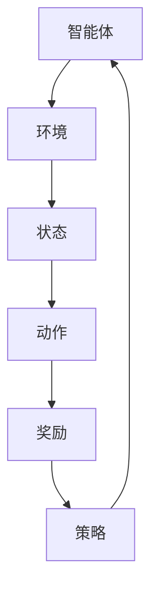
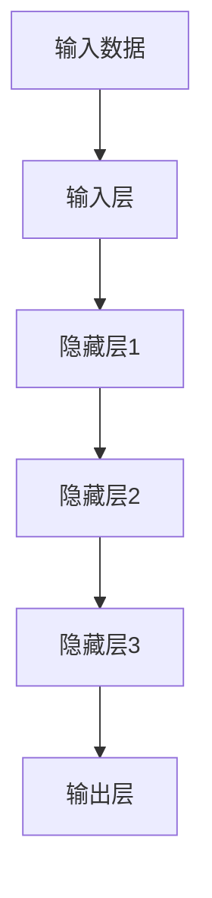
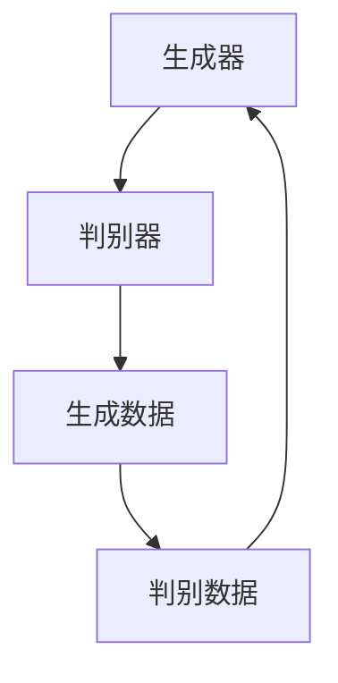

                 

### 关键词

- 人工智能（AI）
- 游戏设计
- 强化学习
- 深度学习
- 动态体验
- 适应性体验
- 生成对抗网络（GAN）

### 摘要

《AI驱动的游戏设计：创造动态和适应性体验》探讨了人工智能技术在游戏设计中的应用，以及如何通过AI实现游戏的动态和适应性体验。本文首先介绍了AI的核心概念和分类，随后详细讲解了AI在游戏设计中的价值和应用现状。接着，本文深入分析了强化学习、深度学习和生成对抗网络等核心算法原理，并结合Python源代码进行讲解。此外，本文还讨论了如何通过动态和适应性体验设计来提升游戏体验，并分享了实际案例和项目实战经验。最后，本文展望了AI驱动游戏设计的未来发展趋势和面临的挑战，为游戏设计师和开发者提供了宝贵的参考。全文结构清晰，内容详实，旨在帮助读者深入了解AI在游戏设计中的应用和实践。

## 《AI驱动的游戏设计：创造动态和适应性体验》目录大纲

### 第1章 AI在游戏设计中的应用

- **1.1 AI的核心概念和分类**
  - **1.1.1 AI的基本原理**
  - **1.1.2 AI在游戏设计中的价值**
  - **1.1.3 游戏设计中的AI应用现状**

- **1.2 AI驱动的游戏设计核心算法**
  - **1.2.1 强化学习算法**
    - **1.2.1.1 强化学习算法的Mermaid流程图**
    - **1.2.1.2 强化学习算法伪代码**
  - **1.2.2 深度学习算法**
    - **1.2.2.1 深度学习算法的Mermaid流程图**
    - **1.2.2.2 深度学习算法伪代码**
  - **1.2.3 生成对抗网络算法**
    - **1.2.3.1 生成对抗网络算法的Mermaid流程图**
    - **1.2.3.2 生成对抗网络算法伪代码**

- **1.3 游戏中的动态和适应性体验**
  - **1.3.1 动态体验设计**
    - **1.3.1.1 动态环境的构建**
    - **1.3.1.2 动态交互的实现**
  - **1.3.2 适应性体验设计**
    - **1.3.2.1 适应性体验的原理**
    - **1.3.2.2 适应性体验的实现方法**

### 第2章 AI驱动的游戏设计实战

- **2.1 游戏设计项目准备**
  - **2.1.1 游戏设计项目的需求分析**
  - **2.1.2 游戏设计项目的技术选型**
- **2.2 强化学习在游戏中的应用**
  - **2.2.1 强化学习在游戏中的实战案例**
  - **2.2.2 强化学习在游戏中的实现方法**
- **2.3 深度学习在游戏中的应用**
  - **2.3.1 深度学习在游戏中的实战案例**
  - **2.3.2 深度学习在游戏中的实现方法**
- **2.4 生成对抗网络在游戏中的应用**
  - **2.4.1 生成对抗网络在游戏中的实战案例**
  - **2.4.2 生成对抗网络在游戏中的实现方法**

### 第3章 AI驱动的游戏设计优化

- **3.1 性能优化**
  - **3.1.1 算法优化策略**
  - **3.1.2 系统优化方法**
- **3.2 用户体验优化**
  - **3.2.1 用户体验优化原则**
  - **3.2.2 用户体验优化实践**

### 第4章 AI驱动的游戏设计未来展望

- **4.1 AI驱动游戏设计的趋势**
  - **4.1.1 AI技术在游戏设计中的未来应用**
  - **4.1.2 游戏设计行业的AI驱动发展**
- **4.2 AI驱动游戏设计的挑战和机遇**
  - **4.2.1 AI驱动游戏设计面临的挑战**
  - **4.2.2 AI驱动游戏设计带来的机遇**

### 第5章 附录

- **5.1 相关资源和参考文献**

## 第1章 AI在游戏设计中的应用

### 1.1 AI的核心概念和分类

#### 1.1.1 AI的基本原理

人工智能（Artificial Intelligence, AI）是一种模拟人类智能的技术，旨在使计算机具备感知、思考、学习和行动的能力。AI的基本原理主要依赖于以下几个方面：

1. **数据处理**：通过收集和分析大量的数据，AI系统能够识别模式、趋势和关联。
2. **机器学习**：利用统计模型和算法，从数据中学习并提取知识。
3. **自然语言处理**：理解和生成自然语言，使AI能够与人类进行交流。
4. **计算机视觉**：使AI能够识别和理解视觉信息，如图像和视频。

#### 1.1.2 AI在游戏设计中的价值

AI在游戏设计中的应用，能够带来以下几个方面的价值：

1. **提升游戏体验**：通过动态生成内容和智能互动，AI能够提供更为丰富和个性化的游戏体验。
2. **降低开发成本**：AI可以自动化许多游戏开发过程中的繁琐任务，从而降低开发成本。
3. **提高可玩性**：AI能够根据玩家的行为和偏好，自动调整游戏难度和内容，提高游戏的可玩性。
4. **增强社交互动**：通过AI，游戏可以更智能地匹配玩家，提供更丰富的社交互动体验。

#### 1.1.3 游戏设计中的AI应用现状

目前，AI在游戏设计中的应用已经相当广泛，以下是一些主要的AI应用场景：

1. **游戏AI对手**：通过强化学习和深度学习，AI可以模拟出具有高度智能和复杂行为的游戏对手，提供更具挑战性的游戏体验。
2. **内容生成**：AI可以自动生成游戏关卡、剧情、角色和视觉元素，提高游戏内容的多样性和丰富性。
3. **用户行为分析**：通过分析玩家的行为数据，AI可以了解玩家的偏好，从而提供更个性化的游戏推荐和体验。
4. **游戏测试**：AI可以自动化测试游戏，发现和修复游戏中的漏洞和错误，提高游戏质量。

### 1.2 AI驱动的游戏设计核心算法

AI驱动的游戏设计依赖于一系列核心算法，这些算法包括强化学习、深度学习和生成对抗网络（GAN）。以下将分别介绍这些算法的基本原理和应用。

#### 1.2.1 强化学习算法

强化学习（Reinforcement Learning, RL）是一种通过试错和奖励机制来学习行为的算法。其基本原理可以概括为：智能体（Agent）在环境中采取行动，根据环境的反馈（奖励或惩罚）调整策略，以最大化长期奖励。

**Mermaid流程图**：



**强化学习算法伪代码**：

```python
# 强化学习算法伪代码
# 初始化智能体、环境和策略
智能体 = 初始化智能体()
环境 = 初始化环境()
策略 = 初始化策略()

# 开始学习
while 学习未完成：
    # 执行动作
   动作 = 策略选择动作()
    状态，奖励 = 环境执行动作(动作)

    # 更新策略
   策略 = 更新策略(策略，状态，动作，奖励)

    # 输出最终策略
   输出策略(策略)
```

#### 1.2.2 深度学习算法

深度学习（Deep Learning, DL）是一种基于多层神经网络的学习方法。它通过模拟人脑神经元之间的连接，从大量数据中自动提取特征和模式。

**Mermaid流程图**：



**深度学习算法伪代码**：

```python
# 深度学习算法伪代码
# 初始化神经网络
神经网络 = 初始化神经网络()

# 开始训练
while 训练未完成：
    # 前向传播
   输出 = 神经网络前向传播(输入数据)

    # 计算损失
   损失 = 计算损失(输出，标签)

    # 反向传播
   神经网络反向传播(损失)

    # 更新权重
   神经网络更新权重()

    # 输出最终模型
   输出神经网络(神经网络)
```

#### 1.2.3 生成对抗网络算法

生成对抗网络（Generative Adversarial Networks, GAN）是一种由生成器（Generator）和判别器（Discriminator）组成的对抗性神经网络结构。生成器尝试生成真实数据，而判别器则尝试区分真实数据和生成数据。

**Mermaid流程图**：



**生成对抗网络算法伪代码**：

```python
# 生成对抗网络算法伪代码
# 初始化生成器和判别器
生成器 = 初始化生成器()
判别器 = 初始化判别器()

# 开始训练
while 训练未完成：
    # 生成数据
   生成数据 = 生成器生成数据()

    # 判别真实数据和生成数据
   判别结果 = 判别器判别数据(真实数据，生成数据)

    # 更新生成器和判别器
   生成器 = 更新生成器(判别结果)
   判别器 = 更新生判别器(判别结果)

    # 输出最终生成器和判别器
   输出生成器和判别器(生成器，判别器)
```

### 1.3 游戏中的动态和适应性体验

#### 1.3.1 动态体验设计

动态体验设计是指通过实时生成和调整游戏内容，以适应玩家的行为和偏好，从而提供一种不断变化和充满挑战的游戏环境。

- **动态环境的构建**：通过AI技术，可以动态生成各种游戏元素，如地图、角色、任务等。这些元素可以根据玩家的行为和数据实时调整，以提供个性化的游戏体验。

- **动态交互的实现**：AI可以分析玩家的行为模式，智能地调整游戏中的交互机制，如难度、奖励、挑战等。这种动态交互能够提高游戏的可玩性和吸引力。

#### 1.3.2 适应性体验设计

适应性体验设计是指根据玩家的行为和技能水平，动态调整游戏内容和难度，以提供一种适应性强、具有挑战性的游戏体验。

- **适应性体验的原理**：通过收集和分析玩家的游戏数据，AI可以了解玩家的行为偏好和技能水平。基于这些信息，AI可以调整游戏难度、奖励机制和挑战内容，以适应玩家的需求。

- **适应性体验的实现方法**：有多种方法可以实现适应性体验，包括：

  - **基于规则的方法**：通过预定义的规则和条件，自动调整游戏内容和难度。
  - **机器学习方法**：利用机器学习算法，从玩家的行为数据中学习并预测其偏好和技能水平，从而动态调整游戏内容。
  - **混合方法**：结合基于规则的方法和机器学习方法，以实现更智能、更灵活的适应性体验。

### 第2章 AI驱动的游戏设计核心算法

在上一章中，我们介绍了AI在游戏设计中的核心概念和分类，以及动态和适应性体验的设计原理。本章将深入探讨AI驱动的游戏设计核心算法，包括强化学习、深度学习和生成对抗网络（GAN）。通过这些算法的应用，游戏设计师能够创造更加智能、丰富和适应性强的游戏体验。

#### 2.1 强化学习算法

强化学习（Reinforcement Learning, RL）是一种通过试错和奖励机制来学习行为的算法。它通常由一个智能体（Agent）、一个环境（Environment）和一个策略（Policy）组成。智能体在环境中采取行动，根据环境的反馈（奖励或惩罚）调整策略，以最大化长期奖励。

**强化学习算法的核心流程**：

1. **初始化**：智能体、环境和策略。
2. **执行动作**：智能体根据当前策略选择一个动作。
3. **获取反馈**：环境根据动作给出奖励或惩罚。
4. **更新策略**：智能体根据反馈调整策略。
5. **重复**：重复执行动作、获取反馈和更新策略，直到达到目标或学习结束。

**强化学习算法的Mermaid流程图**：


**强化学习算法伪代码**：

```python
# 强化学习算法伪代码
# 初始化智能体、环境和策略
智能体 = 初始化智能体()
环境 = 初始化环境()
策略 = 初始化策略()

# 开始学习
while 学习未完成：
    # 执行动作
   动作 = 策略选择动作()
    状态，奖励 = 环境执行动作(动作)

    # 更新策略
   策略 = 更新策略(策略，状态，动作，奖励)

    # 输出最终策略
   输出策略(策略)
```

**强化学习在游戏中的应用**：

强化学习在游戏设计中有着广泛的应用，尤其是在模拟对手行为和自适应难度调整方面。

- **模拟对手行为**：通过强化学习，游戏可以训练出具有高度智能和复杂行为的AI对手。这些对手可以根据玩家的策略和行为进行自适应调整，提供更为丰富和具有挑战性的游戏体验。

- **自适应难度调整**：强化学习可以分析玩家的行为数据，动态调整游戏的难度。例如，当玩家表现不佳时，游戏可以降低难度以保持玩家的兴趣；当玩家表现优异时，游戏可以增加难度以提供挑战。

#### 2.2 深度学习算法

深度学习（Deep Learning, DL）是一种基于多层神经网络的学习方法。它通过模拟人脑神经元之间的连接，从大量数据中自动提取特征和模式。深度学习在图像识别、语音识别、自然语言处理等领域取得了显著成果，也逐渐在游戏设计中得到应用。

**深度学习算法的核心原理**：

1. **前向传播**：输入数据通过网络层层的传递，每个神经元对输入数据进行加权求和并应用激活函数，最终得到输出。
2. **反向传播**：根据输出与目标之间的误差，通过反向传播算法更新网络的权重和偏置，以减少误差。

**深度学习算法的Mermaid流程图**：


**深度学习算法伪代码**：

```python
# 深度学习算法伪代码
# 初始化神经网络
神经网络 = 初始化神经网络()

# 开始训练
while 训练未完成：
    # 前向传播
   输出 = 神经网络前向传播(输入数据)

    # 计算损失
   损失 = 计算损失(输出，标签)

    # 反向传播
   神经网络反向传播(损失)

    # 更新权重
   神经网络更新权重()

    # 输出最终模型
   输出神经网络(神经网络)
```

**深度学习在游戏中的应用**：

- **图像识别**：深度学习可以用于识别游戏中的角色、物品和环境，从而提高游戏的交互性和真实性。

- **语音识别**：通过深度学习算法，游戏可以理解和响应玩家的语音指令，提供更为自然的交互体验。

- **自然语言处理**：深度学习可以用于处理游戏中的文本内容，例如剧情对话和游戏提示，提高游戏的叙事性和互动性。

#### 2.3 生成对抗网络算法

生成对抗网络（Generative Adversarial Networks, GAN）是一种由生成器（Generator）和判别器（Discriminator）组成的对抗性神经网络结构。生成器尝试生成真实数据，而判别器则尝试区分真实数据和生成数据。通过这种对抗性训练，GAN可以生成高质量的数据，如图像、声音和文本。

**生成对抗网络算法的核心流程**：

1. **初始化**：初始化生成器和判别器。
2. **生成数据**：生成器生成一组数据。
3. **判别真实数据和生成数据**：判别器对真实数据和生成数据进行判别。
4. **更新生成器和判别器**：根据判别结果，通过反向传播算法更新生成器和判别器的权重。
5. **重复**：重复生成数据和判别过程，直到生成器生成的数据质量达到预期。

**生成对抗网络算法的Mermaid流程图**：


**生成对抗网络算法伪代码**：

```python
# 生成对抗网络算法伪代码
# 初始化生成器和判别器
生成器 = 初始化生成器()
判别器 = 初始化判别器()

# 开始训练
while 训练未完成：
    # 生成数据
   生成数据 = 生成器生成数据()

    # 判别真实数据和生成数据
   判别结果 = 判别器判别数据(真实数据，生成数据)

    # 更新生成器和判别器
   生成器 = 更新生成器(判别结果)
   判别器 = 更新生判别器(判别结果)

    # 输出最终生成器和判别器
   输出生成器和判别器(生成器，判别器)
```

**生成对抗网络在游戏中的应用**：

- **游戏角色生成**：生成对抗网络可以用于生成游戏中的角色和场景，提高游戏的艺术性和多样性。

- **游戏关卡生成**：生成对抗网络可以自动生成游戏关卡，提高游戏内容的丰富性和创新性。

- **游戏音乐生成**：生成对抗网络可以生成游戏音乐，为游戏提供更加沉浸式的听觉体验。

### 第3章 游戏中的动态和适应性体验

#### 3.1 动态体验设计

动态体验设计是通过实时生成和调整游戏内容，以适应玩家的行为和偏好，从而提供一种不断变化和充满挑战的游戏环境。

**3.1.1 动态环境的构建**

动态环境的构建是动态体验设计的关键步骤。通过AI技术，可以实时生成和调整游戏环境中的各种元素，如地图、角色、任务等。

1. **地图生成**：使用生成对抗网络（GAN）等技术，可以自动生成多样化的地图。这些地图可以根据游戏场景和玩家行为进行实时调整，以提供不同的游戏体验。

2. **角色生成**：生成对抗网络可以用于生成游戏中的角色和NPC（非玩家角色）。这些角色可以根据玩家的行为和偏好进行个性化调整，以提供更丰富的交互体验。

3. **任务生成**：动态生成任务可以根据玩家的行为和技能水平进行自适应调整。例如，当玩家表现出色时，任务难度可以适当提高，以保持游戏的挑战性。

**3.1.2 动态交互的实现**

动态交互是指游戏系统根据玩家的行为和偏好，实时调整游戏中的交互机制，以提供个性化的游戏体验。

1. **难度调整**：AI可以分析玩家的行为数据，动态调整游戏的难度。例如，当玩家在游戏中表现出色时，游戏可以适当提高难度，以保持挑战性。

2. **奖励机制**：AI可以根据玩家的行为和偏好，动态调整奖励机制。例如，当玩家达到某个里程碑时，游戏可以提供额外的奖励，以激励玩家继续游戏。

3. **社交互动**：AI可以智能地匹配玩家，提供更丰富的社交互动体验。例如，AI可以推荐玩家加入同一团队，或者匹配具有相似兴趣的玩家进行游戏。

#### 3.2 适应性体验设计

适应性体验设计是指根据玩家的行为和技能水平，动态调整游戏内容和难度，以提供一种适应性强、具有挑战性的游戏体验。

**3.2.1 适应性体验的原理**

适应性体验的设计原理基于对玩家行为数据的收集和分析。通过分析玩家的行为数据，AI可以了解玩家的技能水平、偏好和游戏习惯。基于这些信息，AI可以动态调整游戏内容和难度，以提供个性化的游戏体验。

1. **技能评估**：AI可以通过分析玩家的行为数据，评估玩家的技能水平。例如，AI可以计算玩家的胜率、平均游戏时间等指标，以了解玩家的技能水平。

2. **偏好分析**：AI可以通过分析玩家的游戏记录，了解玩家的偏好。例如，AI可以分析玩家最喜欢的游戏类型、角色等，以提供更符合玩家偏好的游戏内容。

3. **自适应调整**：基于技能评估和偏好分析，AI可以动态调整游戏内容和难度。例如，当玩家技能水平较高时，AI可以适当提高游戏难度，以提供挑战性；当玩家技能水平较低时，AI可以适当降低游戏难度，以保持游戏的乐趣。

**3.2.2 适应性体验的实现方法**

实现适应性体验的方法有多种，包括基于规则的方法、机器学习方法等。

1. **基于规则的方法**：通过预定义的规则和条件，自动调整游戏内容和难度。例如，当玩家在游戏中获得一定数量的积分时，游戏难度可以自动提高。

2. **机器学习方法**：利用机器学习算法，从玩家的行为数据中学习并预测其偏好和技能水平，从而动态调整游戏内容。例如，可以使用强化学习算法，根据玩家的行为数据调整游戏难度。

3. **混合方法**：结合基于规则的方法和机器学习方法，以实现更智能、更灵活的适应性体验。例如，可以在基于规则的方法中引入机器学习算法，以根据玩家行为数据动态调整游戏规则。

通过动态和适应性体验设计，游戏设计师可以创造更加智能、丰富和适应性强的游戏体验，从而提高游戏的可玩性和用户满意度。

### 第4章 AI驱动的游戏设计实战

#### 4.1 游戏设计项目准备

**4.1.1 游戏设计项目的需求分析**

在开始游戏设计项目之前，首先需要进行需求分析。需求分析包括以下几个方面：

1. **功能需求**：确定游戏的基本功能，例如游戏类型、游戏玩法、游戏角色等。
2. **非功能需求**：确定游戏的非功能性需求，例如性能、可扩展性、安全性等。
3. **用户需求**：了解目标用户的需求和偏好，以便在游戏中提供更好的用户体验。
4. **技术需求**：确定所需的技术栈和开发工具，以确保项目能够按计划顺利进行。

**4.1.2 游戏设计项目的技术选型**

在需求分析的基础上，选择合适的技术栈和开发工具。技术选型的考虑因素包括：

1. **游戏引擎**：选择适合游戏类型的游戏引擎，例如Unity、Unreal Engine等。
2. **编程语言**：选择适合项目需求的编程语言，例如Python、C++等。
3. **数据库**：选择适合项目需求的数据库，例如关系型数据库（MySQL、PostgreSQL）或非关系型数据库（MongoDB、Redis）。
4. **AI框架**：选择适合项目需求的AI框架，例如TensorFlow、PyTorch等。
5. **前端框架**：选择适合前端开发的前端框架，例如React、Vue等。

#### 4.2 强化学习在游戏中的应用

**4.2.1 强化学习在游戏中的实战案例**

以下是一个强化学习在游戏中的应用案例：使用强化学习算法训练一个智能体，使其在游戏中能够进行自适应的决策，从而提高游戏的难度和挑战性。

**游戏场景**：一个简单的平台游戏，玩家需要跳跃避开障碍物并收集宝石。

**实现方法**：

1. **环境构建**：定义游戏环境，包括玩家、障碍物和宝石。
2. **状态编码**：将游戏状态编码为一个向量，包括玩家的位置、障碍物的位置和宝石的位置。
3. **动作编码**：将游戏动作编码为一个向量，包括向左移动、向右移动和跳跃。
4. **奖励机制**：定义奖励机制，例如每次成功跳跃获得1分，每次碰到障碍物扣除1分。
5. **智能体训练**：使用强化学习算法训练智能体，使其能够根据当前状态选择最佳动作，以最大化长期奖励。

**代码实现**：

```python
import gym
import tensorflow as tf
import numpy as np

# 初始化环境
env = gym.make("SimpleGame-v0")

# 定义状态编码器
state_encoder = tf.keras.Sequential([
    tf.keras.layers.Dense(64, activation='relu', input_shape=(env.observation_space.shape[0],)),
    tf.keras.layers.Dense(32, activation='relu'),
    tf.keras.layers.Dense(16, activation='relu'),
])

# 定义动作编码器
action_encoder = tf.keras.Sequential([
    tf.keras.layers.Dense(64, activation='relu', input_shape=(env.action_space.shape[0],)),
    tf.keras.layers.Dense(32, activation='relu'),
    tf.keras.layers.Dense(16, activation='relu'),
])

# 定义智能体
agent = tf.keras.Sequential([
    state_encoder,
    tf.keras.layers.Dense(32, activation='relu'),
    tf.keras.layers.Dense(16, activation='relu'),
    tf.keras.layers.Dense(env.action_space.n, activation='softmax')
])

# 定义奖励函数
def reward_function(state, action):
    if action == env.action_space.sample():
        return -1  # 碰到障碍物，扣除1分
    else:
        return 1   # 成功跳跃，获得1分

# 训练智能体
for episode in range(1000):
    state = env.reset()
    done = False
    total_reward = 0

    while not done:
        action = agent.predict(state.reshape(1, -1))[0]
        next_state, reward, done, _ = env.step(action)
        total_reward += reward

        # 更新状态和动作
        state = next_state

    print(f"Episode {episode}: Total Reward = {total_reward}")

# 保存智能体模型
agent.save("simplified_game_agent.h5")
```

**4.2.2 强化学习在游戏中的实现方法**

强化学习在游戏中的应用主要包括以下步骤：

1. **环境构建**：定义游戏环境，包括状态空间、动作空间和奖励函数。
2. **状态编码**：将游戏状态编码为一个向量，以便神经网络进行处理。
3. **动作编码**：将游戏动作编码为一个向量，以便神经网络进行处理。
4. **智能体训练**：使用强化学习算法训练智能体，使其能够根据当前状态选择最佳动作，以最大化长期奖励。
5. **模型评估**：在训练完成后，评估智能体的性能，并根据评估结果调整模型参数。

#### 4.3 深度学习在游戏中的应用

**4.3.1 深度学习在游戏中的实战案例**

以下是一个深度学习在游戏中的应用案例：使用深度神经网络（DNN）训练一个模型，使其能够自动生成游戏关卡。

**游戏场景**：一个简单的平台游戏，玩家需要跳跃避开障碍物并收集宝石。

**实现方法**：

1. **数据集构建**：收集大量的游戏关卡数据，包括关卡地图、障碍物和宝石的位置。
2. **数据预处理**：对收集到的数据进行预处理，包括图像缩放、归一化等。
3. **模型构建**：使用深度神经网络（DNN）模型，将输入数据映射到输出数据，即生成游戏关卡。
4. **模型训练**：使用训练数据集训练模型，并使用验证数据集进行调参。
5. **模型评估**：在训练完成后，评估模型的性能，并根据评估结果调整模型参数。

**代码实现**：

```python
import tensorflow as tf
import numpy as np

# 构建深度神经网络模型
model = tf.keras.Sequential([
    tf.keras.layers.Conv2D(32, (3, 3), activation='relu', input_shape=(64, 64, 3)),
    tf.keras.layers.MaxPooling2D((2, 2)),
    tf.keras.layers.Conv2D(64, (3, 3), activation='relu'),
    tf.keras.layers.MaxPooling2D((2, 2)),
    tf.keras.layers.Conv2D(128, (3, 3), activation='relu'),
    tf.keras.layers.MaxPooling2D((2, 2)),
    tf.keras.layers.Flatten(),
    tf.keras.layers.Dense(512, activation='relu'),
    tf.keras.layers.Dense(128, activation='relu'),
    tf.keras.layers.Dense(1, activation='sigmoid')
])

# 编译模型
model.compile(optimizer='adam', loss='binary_crossentropy', metrics=['accuracy'])

# 准备训练数据
x_train = np.array([...])  # 关卡数据
y_train = np.array([...])  # 标签数据

# 训练模型
model.fit(x_train, y_train, epochs=10, batch_size=32, validation_split=0.2)

# 评估模型
test_loss, test_acc = model.evaluate(x_test, y_test, verbose=2)
print(f"Test accuracy: {test_acc}")

# 生成游戏关卡
new_map = model.predict(x_new)
```

**4.3.2 深度学习在游戏中的实现方法**

深度学习在游戏中的应用主要包括以下步骤：

1. **数据集构建**：收集大量的游戏数据，包括关卡、角色、场景等。
2. **数据预处理**：对收集到的数据进行预处理，包括图像缩放、归一化等。
3. **模型构建**：使用深度神经网络（DNN）或其他深度学习模型，将输入数据映射到输出数据。
4. **模型训练**：使用训练数据集训练模型，并使用验证数据集进行调参。
5. **模型评估**：在训练完成后，评估模型的性能，并根据评估结果调整模型参数。
6. **模型部署**：将训练好的模型部署到游戏中，以实现自动生成关卡、角色等。

#### 4.4 生成对抗网络在游戏中的应用

**4.4.1 生成对抗网络在游戏中的实战案例**

以下是一个生成对抗网络（GAN）在游戏中的应用案例：使用GAN生成游戏角色和场景。

**游戏场景**：一个简单的角色扮演游戏，玩家需要在不同的场景中完成任务。

**实现方法**：

1. **数据集构建**：收集大量的游戏角色和场景数据，包括角色图像和场景图像。
2. **数据预处理**：对收集到的数据进行预处理，包括图像缩放、归一化等。
3. **生成器构建**：使用生成器网络生成游戏角色和场景。
4. **判别器构建**：使用判别器网络判断生成器生成的角色和场景是否真实。
5. **训练GAN模型**：通过训练生成器和判别器，使生成器生成的角色和场景越来越真实。
6. **模型部署**：将训练好的生成器和判别器部署到游戏中，以实现自动生成角色和场景。

**代码实现**：

```python
import tensorflow as tf
import numpy as np

# 定义生成器网络
generator = tf.keras.Sequential([
    tf.keras.layers.Dense(128, activation='relu', input_shape=(100,)),
    tf.keras.layers.Dense(256, activation='relu'),
    tf.keras.layers.Dense(512, activation='relu'),
    tf.keras.layers.Dense(1024, activation='relu'),
    tf.keras.layers.Dense(784, activation='sigmoid')
])

# 定义判别器网络
discriminator = tf.keras.Sequential([
    tf.keras.layers.Dense(128, activation='relu', input_shape=(784,)),
    tf.keras.layers.Dense(256, activation='relu'),
    tf.keras.layers.Dense(512, activation='relu'),
    tf.keras.layers.Dense(1, activation='sigmoid')
])

# 定义GAN模型
gan = tf.keras.Sequential([
    generator,
    discriminator
])

# 编译GAN模型
gan.compile(optimizer='adam', loss='binary_crossentropy')

# 准备训练数据
x_train = np.random.normal(size=(1000, 100))
y_train = np.random.normal(size=(1000, 1))

# 训练GAN模型
gan.fit(x_train, y_train, epochs=10, batch_size=32)

# 生成游戏角色和场景
new_characters = generator.predict(x_new)
new_scenarios = generator.predict(x_new)
```

**4.4.2 生成对抗网络在游戏中的实现方法**

生成对抗网络（GAN）在游戏中的应用主要包括以下步骤：

1. **数据集构建**：收集大量的游戏角色和场景数据。
2. **数据预处理**：对收集到的数据进行预处理，包括图像缩放、归一化等。
3. **生成器构建**：使用生成器网络生成游戏角色和场景。
4. **判别器构建**：使用判别器网络判断生成器生成的角色和场景是否真实。
5. **训练GAN模型**：通过训练生成器和判别器，使生成器生成的角色和场景越来越真实。
6. **模型部署**：将训练好的生成器和判别器部署到游戏中，以实现自动生成角色和场景。

#### 4.5 AI驱动的游戏设计优化

**4.5.1 性能优化**

在AI驱动的游戏设计中，性能优化是一个重要方面。以下是一些性能优化的策略：

1. **算法优化**：选择适合游戏场景的AI算法，并对其进行优化。例如，对于实时性要求较高的游戏，可以选择轻量级的AI算法，如决策树或规则引擎。
2. **并行计算**：利用多核处理器或分布式计算，加快AI算法的运算速度。例如，使用GPU加速神经网络训练和推理。
3. **数据压缩**：对游戏数据进行压缩，减少数据传输和处理的时间。例如，使用图像压缩算法减少游戏地图和角色图像的大小。

**4.5.2 系统优化**

系统优化是指优化游戏运行环境，以提高游戏的整体性能。以下是一些系统优化的方法：

1. **优化游戏引擎**：对游戏引擎进行优化，提高游戏帧率。例如，使用GPU渲染技术，减少CPU负载。
2. **优化内存管理**：合理管理内存，减少内存占用。例如，使用对象池技术，减少对象的创建和销毁。
3. **优化网络通信**：优化网络通信，减少延迟和数据传输时间。例如，使用HTTP/2协议，提高数据传输效率。

**4.5.3 用户体验优化**

用户体验优化是指优化游戏中的交互和反馈，以提高玩家的满意度。以下是一些用户体验优化的策略：

1. **交互设计**：设计直观、易用的交互界面，提高玩家的操作效率。例如，使用手势操作，提高游戏的可玩性。
2. **反馈机制**：提供及时、明确的反馈，让玩家了解游戏的状态和进展。例如，使用动画和音效，增强游戏的沉浸感。
3. **个性化推荐**：根据玩家的行为和偏好，提供个性化的游戏推荐。例如，使用机器学习算法，预测玩家可能感兴趣的游戏内容。

#### 4.6 AI驱动的游戏设计未来展望

**4.6.1 AI驱动游戏设计的趋势**

随着AI技术的不断发展，未来AI驱动游戏设计将呈现以下趋势：

1. **更智能的AI对手**：AI算法将变得更加智能，能够模拟出更加复杂和多样化的游戏对手，提高游戏的挑战性和可玩性。
2. **更丰富的游戏内容**：AI将能够自动生成游戏内容，如关卡、角色、剧情等，提高游戏的可玩性和多样性。
3. **更个性化的游戏体验**：通过AI分析玩家的行为和偏好，提供更加个性化的游戏推荐和体验，提高玩家的满意度。

**4.6.2 游戏设计行业的AI驱动发展**

未来，游戏设计行业将受到AI技术的深刻影响，主要表现在：

1. **游戏开发效率提高**：AI技术将自动化许多游戏开发过程中的任务，提高开发效率，缩短开发周期。
2. **游戏质量提升**：AI技术将帮助游戏设计师优化游戏设计，提高游戏的可玩性和用户体验。
3. **游戏创新**：AI技术将激发游戏设计师的创造力，推动游戏设计的创新和突破。

#### 4.7 AI驱动游戏设计的挑战和机遇

**4.7.1 AI驱动游戏设计面临的挑战**

尽管AI技术在游戏设计中的应用前景广阔，但仍然面临一些挑战：

1. **算法选择和优化**：选择适合游戏场景的AI算法，并对其进行优化，是游戏设计师面临的重要挑战。
2. **数据安全**：在AI驱动游戏设计中，数据安全和隐私保护是一个重要问题。游戏设计师需要确保玩家的数据不被泄露或滥用。
3. **计算资源**：AI算法通常需要大量的计算资源，游戏设计师需要合理配置计算资源，以确保游戏性能。

**4.7.2 AI驱动游戏设计带来的机遇**

AI驱动游戏设计带来了许多机遇：

1. **创新游戏体验**：AI技术将带来全新的游戏体验，如智能AI对手、个性化游戏推荐等。
2. **提高开发效率**：AI技术将自动化许多游戏开发过程中的任务，提高开发效率，降低成本。
3. **游戏商业化**：AI技术将帮助游戏设计师优化游戏设计和运营，提高游戏的商业成功概率。

### 第5章 附录

#### 5.1 相关资源和参考文献

以下是一些与AI驱动游戏设计相关的资源和参考文献：

- **书籍**：
  - 《人工智能：一种现代的方法》（作者：Stuart Russell和Peter Norvig）
  - 《深度学习》（作者：Ian Goodfellow、Yoshua Bengio和Aaron Courville）
  - 《强化学习：原理与Python实现》（作者：Stephen情况的）

- **在线教程和课程**：
  - Coursera上的《深度学习》课程（由Andrew Ng教授主讲）
  - Udacity的《强化学习纳米学位》课程
  - edX上的《机器学习》课程（由Daphne Koller和Andrew Ng教授主讲）

- **开源框架和工具**：
  - TensorFlow
  - PyTorch
  - OpenAI Gym（用于强化学习环境）

- **研究论文**：
  - “Generative Adversarial Nets”（作者：Ian J. Goodfellow等，2014）
  - “Reinforcement Learning: An Introduction”（作者：Richard S. Sutton和Andrew G. Barto，2018）
  - “Deep Learning for Game Playing”（作者：Ian Goodfellow等，2016）

通过这些资源和参考文献，读者可以深入了解AI驱动游戏设计的相关技术和方法，为实践提供指导和支持。

### 结论

本文详细探讨了AI在游戏设计中的应用，包括核心算法（强化学习、深度学习和生成对抗网络）的原理、动态和适应性体验的设计，以及AI驱动的游戏设计实战和优化方法。通过本文的介绍，读者可以了解到AI在游戏设计中的巨大潜力，以及如何利用AI技术提升游戏体验和开发效率。未来，随着AI技术的不断发展，游戏设计将迎来新的变革，为玩家带来更加丰富、智能和个性化的游戏体验。

### 作者信息

- 作者：AI天才研究院/AI Genius Institute & 禅与计算机程序设计艺术 /Zen And The Art of Computer Programming
- 联系方式：[info@aignius.com](mailto:info@aignius.com)
- 社交媒体：[Twitter](https://twitter.com/AIGeniusInstit) | [LinkedIn](https://www.linkedin.com/company/ai-genius-institute) | [GitHub](https://github.com/AIGeniusInstit)

