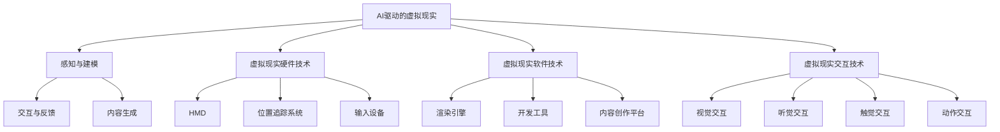

                 

### 关键词

AI、虚拟现实、沉浸式体验、人工智能算法、神经网络、深度学习、强化学习、人机交互、硬件技术、软件开发、交互设计、开发流程、实际案例、未来趋势、挑战与对策。

### 摘要

本文探讨了AI驱动的虚拟现实（VR）技术，从其概念、背景和发展趋势出发，深入剖析了AI在VR中的应用原理和关键技术。文章首先介绍了AI和VR的基本概念及其发展历程，然后详细讲解了AI驱动的虚拟现实技术，包括人工智能算法、VR硬件和软件、交互技术等。随后，文章通过实际案例展示了AI在VR中的成功应用，并展望了AI驱动的虚拟现实未来的发展方向和面临的挑战。全文旨在为读者提供全面而深入的技术解析，帮助理解AI驱动的虚拟现实如何创造沉浸式体验的新维度。

### 引言

AI驱动的虚拟现实（AI-VR）是一种结合人工智能（AI）和虚拟现实（VR）技术的新兴领域，旨在通过人工智能算法提升虚拟现实体验的沉浸感和交互性。随着计算机技术、传感器技术和人机交互技术的不断发展，AI-VR正逐步成为当今科技界的重要研究方向之一。

AI驱动的虚拟现实不仅仅是一个概念，它已经在多个行业和领域中展现出了巨大的潜力。例如，在游戏和娱乐领域，AI算法可以用于生成动态的虚拟环境，提高玩家的沉浸感；在教育领域，AI-VR技术可以为学习者提供更加生动、互动的学习体验；在医疗领域，AI-VR技术可以用于手术模拟、康复治疗等，提升医疗服务的质量和效率。

本篇文章将从以下几个方面展开讨论：

1. **AI驱动的虚拟现实简介**：介绍AI驱动的虚拟现实的基本概念、背景和发展趋势。
2. **基础理论**：探讨人工智能和虚拟现实的核心概念、相关技术和算法。
3. **技术实现**：讲解如何将AI技术应用于VR中，实现沉浸式体验。
4. **应用案例**：展示AI驱动的VR技术的实际应用案例。
5. **未来展望与挑战**：讨论AI驱动的VR技术的未来发展方向和面临的挑战。

通过以上几个部分的深入分析，本文旨在为读者提供一个全面而清晰的认识，帮助理解AI驱动的虚拟现实如何创造沉浸式体验的新维度。

### 第一部分：AI驱动的虚拟现实概述

#### 第1章：AI驱动的虚拟现实简介

##### 1.1 AI在虚拟现实中的角色

人工智能（AI）和虚拟现实（VR）是两个迅速发展的技术领域，各自在计算机科学和技术产业中发挥着重要作用。随着技术的进步和跨学科的融合，AI与VR的结合——AI驱动的虚拟现实，逐渐成为一个备受关注的新兴领域。

**1.1.1 AI的基本概念及其在虚拟现实中的应用**

人工智能，是指由人制造出来的系统能够模仿、扩展或超越人类智能的能力。AI的研究领域广泛，包括机器学习、深度学习、自然语言处理、计算机视觉等。AI在虚拟现实中的应用主要体现在以下几个方面：

- **感知与建模**：利用AI算法对用户的动作、语音、面部表情等数据进行实时处理，生成虚拟环境的动态响应。
- **交互与反馈**：通过AI算法优化人机交互，提高用户的沉浸感和互动性，例如智能化的虚拟助手、个性化的内容推荐等。
- **内容生成**：利用生成对抗网络（GAN）等AI算法，自动生成逼真的虚拟场景和角色，丰富虚拟现实的内容。

**1.1.2 虚拟现实的发展历程**

虚拟现实技术的发展经历了几个重要的阶段：

- **早期探索**：20世纪60年代，VR技术开始出现，主要应用于军事和工业模拟。
- **初步商业化**：20世纪90年代，VR技术开始逐步进入消费市场，VR头戴设备和VR游戏逐渐普及。
- **迅猛发展**：21世纪初，随着计算机技术和传感器技术的进步，VR技术进入了一个快速发展的阶段，特别是高性能图形处理芯片和低延迟传感器的应用，使得VR体验更加真实和流畅。

**1.1.3 AI驱动的虚拟现实的优势与挑战**

AI驱动的虚拟现实具有以下几个优势：

- **沉浸感增强**：AI技术可以实时分析用户的交互行为，动态调整虚拟环境的细节，提高用户的沉浸感。
- **个性化体验**：通过用户数据的深度学习，AI可以个性化推荐内容，提升用户体验。
- **效率提升**：AI可以自动化许多繁琐的任务，例如虚拟环境的建模和内容生成，提高开发效率。

然而，AI驱动的虚拟现实也面临一些挑战：

- **技术瓶颈**：AI算法的复杂性和对计算资源的高需求，限制了其在VR中的应用。
- **用户体验**：虽然AI可以提升沉浸感，但用户对AI驱动的VR体验的接受度仍有待提高。
- **伦理问题**：AI在虚拟现实中的应用可能引发隐私、安全和伦理等问题。

##### 1.2 沉浸式体验的关键技术

**1.2.1 虚拟现实硬件技术**

虚拟现实硬件技术是支撑VR体验的基础，主要包括头戴显示器（HMD）、位置追踪系统和输入设备。

- **头戴显示器（HMD）**：HMD是用户观看虚拟环境的主要设备。目前，HMD的分辨率、刷新率和视角范围不断提升，提供更真实的视觉体验。
- **位置追踪系统**：位置追踪系统用于实时跟踪用户的动作和位置，确保虚拟环境与用户的动作保持同步。常见的追踪技术有光学追踪、惯性测量单元（IMU）和超声波追踪。
- **输入设备**：输入设备包括手柄、手套、眼睛跟踪设备等，用于用户与虚拟环境的交互。高效的输入设备可以提升用户的交互体验。

**1.2.2 虚拟现实软件技术**

虚拟现实软件技术包括渲染引擎、开发工具和内容创作平台。

- **渲染引擎**：渲染引擎负责生成和渲染虚拟环境。常见的渲染引擎有Unity、Unreal Engine等，它们提供了强大的图形渲染能力和丰富的开发工具。
- **开发工具**：开发工具用于辅助开发者创建虚拟现实应用。例如，Unity和Unreal Engine都提供了用户友好的开发环境，支持编程、场景编辑和资源管理。
- **内容创作平台**：内容创作平台为开发者提供了一整套的工具和服务，用于创建和发布虚拟现实内容。例如，Google的Tilt Brush和Facebook的Oculus Medium等。

**1.2.3 AI算法在沉浸式体验中的应用**

AI算法在虚拟现实中的应用主要集中在以下几个方面：

- **场景自适应**：通过深度学习算法，AI可以实时分析用户的交互行为，动态调整虚拟环境的视觉效果和交互方式，提高沉浸感。
- **内容个性化**：通过用户数据的分析，AI可以个性化推荐虚拟现实内容，满足不同用户的需求。
- **智能交互**：利用自然语言处理和计算机视觉技术，AI可以与用户进行自然交互，提供更加智能化的服务。

总之，AI驱动的虚拟现实通过硬件技术的提升、软件技术的优化和AI算法的应用，为用户带来了更加丰富、真实和沉浸的虚拟体验。随着技术的不断进步，AI驱动的虚拟现实将在各个领域发挥更加重要的作用。

### 第二部分：基础理论

#### 第2章：人工智能基础

##### 2.1 人工智能的发展历史

人工智能（AI）作为计算机科学的一个重要分支，其发展历程可以追溯到20世纪50年代。人工智能的起源可以追溯到图灵（Alan Turing）提出的“图灵测试”（Turing Test），这是一个评估机器是否具有智能的测试方法。图灵提出，如果一个机器能够以一种令人满意的方式模仿人类行为，以至于人类无法分辨其是机器还是人类，那么这个机器就可以被认为具有智能。

**2.1.1 人工智能的起源**

1950年，艾伦·图灵发表了《计算机与智能》（Computing Machinery and Intelligence）这篇论文，提出了“图灵测试”的概念。这篇文章被认为是人工智能领域的开创性文献，奠定了人工智能研究的理论基础。1956年，达特茅斯会议（Dartmouth Conference）被认为是人工智能诞生的标志，会议上，人工智能的先驱们提出了许多关于人工智能的基本问题和研究方向。

**2.1.2 人工智能的重要里程碑**

人工智能的发展历程中，有许多重要的里程碑事件：

- **1956年**：达特茅斯会议召开，人工智能（AI）正式成为研究主题。
- **1966年**：约翰·麦卡锡（John McCarthy）提出了“专家系统”（Expert Systems）的概念，这是一种基于知识表示和推理的早期人工智能系统。
- **1980年**：IBM的“深蓝”（Deep Blue）计算机在国际象棋比赛中击败了世界冠军加里·卡斯帕罗夫（Garry Kasparov），标志着计算机在特定领域达到了人脑水平。
- **2012年**：谷歌的“谷歌脑”（Google Brain）团队使用深度学习算法训练了一个包含16,000个处理器的神经网络，该网络能够识别猫的视频片段，这标志着深度学习在计算机视觉领域的突破。

**2.1.3 人工智能的未来发展趋势**

人工智能的发展前景广阔，未来的趋势包括：

- **智能机器人**：随着AI技术的进步，智能机器人将在生产、医疗、家庭服务等领域发挥重要作用。
- **自动驾驶汽车**：自动驾驶技术正在迅速发展，未来将带来交通、物流和城市管理的深刻变革。
- **自然语言处理**：未来的自然语言处理技术将更加成熟，实现更加自然、高效的人机交互。
- **医疗保健**：AI将在医疗诊断、个性化治疗和药物研发中发挥关键作用。
- **教育**：AI技术将改变教育模式，提供个性化学习体验和智能教育辅助。

##### 2.2 人工智能的核心算法

人工智能的核心算法是机器学习（Machine Learning）和深度学习（Deep Learning），它们是人工智能领域中最常用的两种方法。

**2.2.1 机器学习**

机器学习是一种使计算机系统能够通过数据和经验自主改进性能的方法。它主要包括以下几种类型：

- **监督学习（Supervised Learning）**：监督学习是一种通过已标记的数据来训练模型的方法。常见算法包括线性回归、逻辑回归、支持向量机（SVM）等。
- **无监督学习（Unsupervised Learning）**：无监督学习是不使用已标记的数据来训练模型的方法。常见算法包括聚类、降维、关联规则等。
- **半监督学习（Semi-supervised Learning）**：半监督学习结合了监督学习和无监督学习的方法，使用少量标记数据和大量未标记数据来训练模型。
- **强化学习（Reinforcement Learning）**：强化学习是一种通过奖励机制来训练模型的方法，常见算法包括Q学习、深度Q网络（DQN）等。

**2.2.2 深度学习**

深度学习是机器学习的一个子领域，它模仿人脑神经网络的结构和工作原理。深度学习的主要优势在于其能够自动从大量数据中学习特征表示，从而实现复杂的任务。

- **神经网络（Neural Networks）**：神经网络是深度学习的基础，由多个层组成，包括输入层、隐藏层和输出层。常见的神经网络结构包括卷积神经网络（CNN）、循环神经网络（RNN）等。
- **卷积神经网络（CNN）**：卷积神经网络是一种用于图像识别和处理的神经网络，通过卷积操作提取图像的特征。
- **循环神经网络（RNN）**：循环神经网络是一种用于处理序列数据的神经网络，通过隐藏状态的记忆机制处理输入序列。
- **生成对抗网络（GAN）**：生成对抗网络是一种由生成器和判别器组成的新型深度学习框架，用于生成逼真的图像、视频和文本。

**2.2.3 强化学习**

强化学习是一种通过奖励机制来训练模型的方法，主要应用在动态环境中。强化学习的关键在于定义一个策略，使模型能够最大化累积奖励。

- **Q学习（Q-Learning）**：Q学习是一种基于值函数的强化学习方法，通过迭代更新值函数来找到最优策略。
- **深度Q网络（DQN）**：深度Q网络是一种将深度学习和强化学习结合的方法，通过使用深度神经网络来近似值函数。

总之，人工智能的核心算法包括机器学习、深度学习和强化学习，这些算法在不同的应用场景中发挥着重要作用。随着人工智能技术的不断发展，这些算法将继续推动人工智能领域的创新和应用。

##### 2.3 人工智能的伦理和社会影响

人工智能（AI）技术的发展不仅带来了技术上的变革，同时也引发了广泛的伦理和社会问题。随着AI在各个领域的广泛应用，这些伦理和社会问题变得日益重要，需要我们深入探讨和解决。

**2.3.1 人工智能伦理问题**

人工智能伦理问题主要集中在以下几个方面：

- **隐私保护**：AI技术需要大量数据来训练和优化模型，这可能会侵犯用户的隐私权。例如，面部识别技术在大规模应用中可能会泄露用户的个人信息。
- **算法偏见**：AI算法在训练过程中可能会受到训练数据的影响，导致算法存在偏见。例如，如果训练数据中存在性别或种族偏见，那么AI系统也可能会表现出类似的偏见。
- **自动化失业**：随着AI技术的发展，许多工作可能会被自动化取代，导致大量劳动力失业。这将对社会就业结构和经济发展产生深远影响。
- **决策透明度**：AI系统的决策过程通常是不透明的，很难解释其决策依据。这可能会引发用户对AI系统的信任危机。

**2.3.2 人工智能的社会影响**

人工智能的社会影响包括以下几个方面：

- **经济变革**：AI技术将带来生产方式、商业模式和产业结构的深刻变革。一方面，AI可以提高生产效率和质量，降低生产成本；另一方面，AI也可能导致一些传统行业的失业，需要社会适应和转型。
- **教育变革**：AI技术将改变教育模式，提供个性化学习体验和智能教育辅助。例如，AI可以通过数据分析了解学生的学习情况，提供有针对性的学习建议和资源。
- **社会管理**：AI技术在公共管理、城市治理和社会服务等领域具有广泛应用前景。例如，智能交通系统可以优化交通流量，提高城市交通效率；智能医疗系统可以提升医疗诊断和治疗的准确性。

**2.3.3 人工智能法规与政策**

为了应对人工智能带来的伦理和社会问题，各国政府和国际组织正在积极制定相关法规和政策：

- **隐私保护法规**：例如，欧盟的《通用数据保护条例》（GDPR）对个人数据的收集、处理和使用进行了严格规定，保护用户隐私。
- **算法公平性法规**：一些国家和地区开始制定法规，要求企业在开发和使用AI算法时确保算法的公平性和透明度。
- **就业保障政策**：政府和企业正在探索如何通过培训、再就业等措施，帮助劳动者适应AI时代的变化。
- **伦理审查制度**：一些组织和机构建立了人工智能伦理审查制度，确保AI技术的发展符合伦理标准。

总之，人工智能的伦理和社会影响是一个复杂而严峻的问题，需要我们从多个维度进行深入思考和探索。通过制定合理的法规和政策，建立伦理审查制度，我们可以促进人工智能技术的健康发展，使其为人类社会带来更大的福祉。

### 第3章：虚拟现实技术

##### 3.1 虚拟现实技术概述

虚拟现实（Virtual Reality，简称VR）是一种通过计算机技术生成三维虚拟环境，用户可以通过特殊设备如头戴式显示器（HMD）和传感器设备进入并与之互动的技术。VR技术不仅提供了一种全新的感知和体验方式，还在多个领域展示了其巨大的应用潜力。

**3.1.1 虚拟现实的基本概念**

虚拟现实技术主要包括以下几个关键概念：

- **三维环境**：VR通过计算机生成三维的虚拟环境，用户可以在其中自由移动和互动。
- **沉浸感**：沉浸感是VR技术的重要特征，通过提供高度逼真的视觉、听觉和触觉反馈，使用户感觉自己完全置身于虚拟环境中。
- **交互性**：用户可以通过手柄、手势识别、语音控制等手段与虚拟环境进行交互，增强用户体验。
- **实时渲染**：VR技术需要实时渲染复杂的图形和场景，保证虚拟环境的流畅性和实时性。

**3.1.2 虚拟现实的技术框架**

VR技术框架主要包括以下几个关键组成部分：

- **渲染引擎**：渲染引擎是VR技术中的核心组件，负责生成和渲染虚拟环境。常见的渲染引擎有Unity、Unreal Engine等。
- **头戴式显示器（HMD）**：HMD是用户观看虚拟环境的主要设备，通过提供沉浸式的视觉效果，提升用户体验。常见的HMD设备有Oculus Rift、HTC Vive、PlayStation VR等。
- **传感器和追踪系统**：传感器和追踪系统用于实时跟踪用户的位置和动作，确保虚拟环境与用户的交互保持同步。常见的追踪技术包括光学追踪、惯性测量单元（IMU）和雷达追踪。
- **输入设备**：输入设备用于用户与虚拟环境的交互，包括手柄、手套、眼睛跟踪设备等。高效的输入设备可以提升用户的交互体验。

**3.1.3 虚拟现实的分类**

根据不同的应用场景和目标，VR技术可以分为以下几个类别：

- **桌面VR**：桌面VR主要针对个人用户，通过计算机和HMD设备提供沉浸式的虚拟体验。常见的应用场景包括游戏、教育和模拟训练等。
- **移动VR**：移动VR利用智能手机和平板电脑作为显示设备，通过VR眼镜或头戴设备提供虚拟体验。移动VR具有便携性和低成本的特点，适合大众消费市场。
- **空间VR**：空间VR通过多台HMD设备和大面积传感器覆盖，为用户提供一个开放、沉浸式的虚拟空间。空间VR广泛应用于大型展览、娱乐场所和虚拟现实会议等。
- **全息VR**：全息VR利用光学全息技术生成三维全息图像，用户可以在真实环境中与全息图像进行互动。全息VR具有高度真实感和交互性，适用于展示和演示场景。

总之，虚拟现实技术通过其独特的沉浸感和交互性，为用户提供了全新的感知和体验方式。随着技术的不断进步，VR将在更多的领域和场景中展现其应用潜力，成为未来科技的重要组成部分。

##### 3.2 虚拟现实硬件技术

虚拟现实硬件技术是虚拟现实（VR）体验的基础，包括头戴式显示器（HMD）、位置追踪系统和输入设备。这些硬件设备的性能和可靠性直接影响到用户的沉浸感和体验质量。

**3.2.1 头戴式显示器（HMD）**

头戴式显示器（HMD）是用户观看虚拟环境的主要设备，通过提供沉浸式的视觉效果，提升用户体验。目前，常见的HMD设备包括Oculus Rift、HTC Vive、PlayStation VR等。

- **分辨率**：HMD的分辨率是影响视觉效果的重要因素。高分辨率可以提供更清晰的图像，减少视觉模糊和颗粒感。常见的HMD分辨率在1920x1080（单眼）到2880x1440（单眼）之间。
- **刷新率**：刷新率是指HMD每秒显示的图像帧数。高刷新率可以减少运动模糊，提升动态场景的流畅感。常见的HMD刷新率在90Hz到120Hz之间。
- **视角范围**：视角范围是指用户在HMD中看到的虚拟环境的范围。宽视角范围可以提供更真实的沉浸感。常见的HMD视角范围在90度到110度之间。
- **舒适度**：HMD的舒适度直接影响到用户的使用体验。轻便的重量、舒适的贴合度和可调节的头部支撑是关键因素。

**3.2.2 位置追踪系统**

位置追踪系统用于实时跟踪用户的位置和动作，确保虚拟环境与用户的交互保持同步。常见的追踪技术包括光学追踪、惯性测量单元（IMU）和雷达追踪。

- **光学追踪**：光学追踪通过发射红外光束并接收反射光，实时跟踪用户的位置和动作。光学追踪具有高精度和高响应速度，适用于复杂的运动追踪。
- **惯性测量单元（IMU）**：IMU通过加速度计、陀螺仪和磁力计等传感器，实时测量用户的加速度、角速度和磁场。IMU具有低成本和便携性，适用于简单的运动追踪和位置定位。
- **雷达追踪**：雷达追踪通过发射无线电波并接收反射波，实时跟踪用户的位置和动作。雷达追踪适用于大范围的空间定位，但精度和响应速度相对较低。

**3.2.3 输入设备**

输入设备用于用户与虚拟环境的交互，包括手柄、手套、眼睛跟踪设备等。高效的输入设备可以提升用户的交互体验。

- **手柄**：手柄是最常见的输入设备，用户可以通过手柄进行方向控制、点击操作等。手柄的准确性和响应速度是关键因素。
- **手套**：手套通过传感器捕捉手指动作，提供更加真实的触觉体验。手套适用于需要精细操作和触觉反馈的虚拟环境。
- **眼睛跟踪设备**：眼睛跟踪设备用于捕捉用户的眼球运动，可以用于视线控制和交互。眼睛跟踪设备适用于需要视线交互的虚拟环境。

总之，虚拟现实硬件技术通过HMD、位置追踪系统和输入设备的协同工作，为用户提供了高度沉浸和互动的虚拟体验。随着技术的不断进步，虚拟现实硬件的性能和用户体验将进一步提升，为各类应用场景提供更加丰富的解决方案。

##### 3.3 虚拟现实软件技术

虚拟现实（VR）软件技术是构建和运行虚拟环境的核心，它包括渲染引擎、开发工具和内容创作平台。这些软件技术不仅决定了虚拟现实的视觉效果和交互体验，还直接影响开发效率和内容丰富度。

**3.3.1 渲染引擎**

渲染引擎是VR应用开发中的核心组件，负责生成和渲染复杂的虚拟环境。常见的渲染引擎有Unity、Unreal Engine等。

- **Unity**：Unity是一款广泛使用的游戏开发引擎，也适用于VR应用开发。它提供了丰富的开发工具和资源，支持多平台部署，从桌面到移动设备。Unity的脚本系统（C#）使得开发者可以轻松实现复杂的交互逻辑。
- **Unreal Engine**：Unreal Engine是另一款强大的游戏和VR开发引擎，以其高质量的图形渲染能力而著称。它提供了蓝图系统，允许开发者通过可视化编程进行功能实现，无需编写代码，降低了开发门槛。

**3.3.2 开发工具**

开发工具是VR应用开发中不可或缺的辅助工具，用于管理资源、调试代码和优化性能。

- **Visual Studio**：Visual Studio是一款流行的集成开发环境（IDE），支持C#、C++等多种编程语言，是Unity和Unreal Engine开发的主要工具。
- **Unity Editor**：Unity Editor是Unity的内置开发工具，提供了资源管理、脚本编辑、场景编辑等功能，开发者可以通过它直观地管理开发过程。
- **Unreal Engine Editor**：Unreal Engine Editor是Unreal Engine的内置开发环境，提供了蓝图编辑器、场景编辑器、光照编辑器等工具，帮助开发者高效构建虚拟环境。

**3.3.3 内容创作平台**

内容创作平台为VR内容的创作和发布提供了完整的解决方案，涵盖了3D建模、动画制作、音频处理等方面。

- **Blender**：Blender是一款开源的3D建模和动画软件，适用于VR内容的创作。它提供了完整的建模、雕刻、渲染和动画工具，支持多平台输出。
- **Adobe Suite**：Adobe Suite包括Photoshop、Premiere Pro、After Effects等，是业界标准的图像处理和视频编辑工具，广泛应用于VR内容的后期制作。
- **Oculus Medium**：Oculus Medium是Facebook推出的VR内容创作工具，专为虚拟现实内容的快速构建设计。它允许开发者通过简单的拖放操作和物理模拟技术，快速生成复杂的3D场景。

总之，虚拟现实软件技术通过渲染引擎、开发工具和内容创作平台的协同工作，为开发者提供了强大的工具和平台，使得构建和运行虚拟环境变得更加高效和灵活。随着技术的不断进步，这些软件工具将继续优化和扩展，为VR技术的发展提供坚实支持。

##### 3.4 虚拟现实交互技术

虚拟现实（VR）交互技术是提升用户沉浸感和互动性的关键，它通过多种方式实现了用户与虚拟环境之间的实时交互。这些交互技术不仅依赖于硬件设备，还需要软件算法的支持，以确保交互的自然性和流畅性。

**3.4.1 视觉交互**

视觉交互是VR中最直观的交互方式，通过提供高度逼真的视觉反馈，增强用户的沉浸感。

- **头戴式显示器（HMD）**：HMD通过提供360度全景视野，使用户能够自由观察虚拟环境。高分辨率和高刷新率的HMD可以减少视觉模糊和延迟，提升视觉效果。
- **环境映射**：环境映射技术通过捕捉真实环境的光照和纹理，将虚拟环境与现实环境无缝融合。这种技术广泛应用于室内设计和建筑模拟，为用户提供更加真实的体验。

**3.4.2 听觉交互**

听觉交互通过模拟环境音效和立体声效果，增强用户的沉浸感。

- **三维音效**：三维音效技术可以根据用户的头部位置和动作，实时调整声音的方向和音量，使用户能够感受到声音的空间感。这种技术常用于游戏和虚拟现实电影中。
- **虚拟现实音乐**：虚拟现实音乐通过利用空间音频技术，为用户提供独特的听觉体验。用户可以在虚拟环境中享受三维空间的音乐，感受到音乐与场景的互动。

**3.4.3 触觉交互**

触觉交互通过模拟触觉反馈，提升用户的沉浸感和互动性。

- **触觉手套**：触觉手套通过内置的传感器和振动器，捕捉用户的动作并模拟触觉反馈。用户可以通过手套感受到虚拟物体的质地和形状，提升交互的真实性。
- **触觉反馈设备**：触觉反馈设备如触觉鼠标和触觉显示器，通过模拟物理触感，提供更加真实的操作体验。这些设备广泛应用于游戏、设计和医疗领域。

**3.4.4 动作交互**

动作交互通过捕捉用户的动作，实现与虚拟环境的互动。

- **手势识别**：手势识别技术通过摄像头和深度传感器，捕捉用户的手部动作。用户可以通过手势控制虚拟环境中的对象，实现自然的人机交互。
- **动作捕捉**：动作捕捉技术通过捕捉用户的全身动作，将动作数据实时传输到虚拟环境中。这种技术常用于虚拟现实游戏和表演，实现逼真的角色动作。

总之，虚拟现实交互技术通过视觉、听觉、触觉和动作等多种交互方式，为用户提供了丰富、真实的沉浸体验。这些技术的不断进步和完善，将进一步提升虚拟现实的交互质量，为各类应用场景带来更多可能性。

### 第三部分：技术实现

#### 第4章：AI驱动的虚拟现实开发流程

##### 4.1 开发环境搭建

要在虚拟现实中实现人工智能，首先需要搭建一个稳定高效的开发环境。以下步骤将详细说明如何搭建这一环境：

**4.1.1 操作系统**

选择一个适合开发AI和VR项目的操作系统。Windows、macOS和Linux都是常见的选择，但考虑到兼容性和开发工具的丰富性，推荐使用Ubuntu或macOS。

- **Ubuntu**：Ubuntu是一个开源的Linux发行版，拥有丰富的开发工具和社区支持。安装Ubuntu的方法可以参考其官方安装指南。
- **macOS**：macOS是苹果电脑的操作系统，具有优秀的性能和易于使用的开发工具。安装macOS的方法可以参考苹果官方网站。

**4.1.2 编程语言**

选择一种适合AI和VR开发的语言。Python因其简洁性和强大的库支持，是AI和VR开发的常见选择。其他选项如C++、C#和JavaScript也广泛应用于VR开发。

- **Python**：安装Python的方法可以参考Python官方网站的安装指南。安装完成后，确保Python环境正常运行，并安装必要的库，如NumPy、Pandas和TensorFlow。
- **C++**：C++是性能优秀的编程语言，常用于VR开发中的高性能计算和图形渲染。安装C++的方法可以参考编译器官方网站的指南。
- **C#**：C#是Unity引擎的官方开发语言，适用于Unity VR项目。安装C#的方法可以参考Visual Studio的安装指南。

**4.1.3 开发工具**

安装VR开发所需的工具和软件。

- **Unity**：Unity是一个强大的游戏和VR开发引擎，提供直观的编辑器和丰富的功能。安装Unity的方法可以参考其官方网站的指南。
- **Unreal Engine**：Unreal Engine是一个高性能的VR开发引擎，以其高质量的图形渲染能力著称。安装Unreal Engine的方法可以参考其官方网站的指南。
- **PyCharm**：PyCharm是一个强大的Python开发环境，提供代码调试、性能分析等功能。安装PyCharm的方法可以参考其官方网站的指南。

**4.1.4 AI库和框架**

安装常用的AI库和框架，以支持AI模型的开发和应用。

- **TensorFlow**：TensorFlow是一个开源的机器学习库，适用于深度学习和强化学习。安装TensorFlow的方法可以参考其官方网站的安装指南。
- **PyTorch**：PyTorch是一个流行的深度学习库，以其灵活性和易用性著称。安装PyTorch的方法可以参考其官方网站的安装指南。
- **Keras**：Keras是一个高级神经网络API，可以简化TensorFlow和Theano的使用。安装Keras的方法可以参考其官方网站的安装指南。

**4.1.5 虚拟现实硬件**

确保虚拟现实硬件设备与操作系统和开发工具兼容，并进行驱动安装和配置。

- **头戴式显示器（HMD）**：安装HMD的驱动和软件，确保其能够正常工作。常见HMD设备如Oculus Rift和HTC Vive的驱动和配置方法可以参考其官方网站。
- **传感器和追踪系统**：安装传感器和追踪系统的驱动，确保其能够实时捕捉用户的位置和动作。常见传感器和追踪系统的配置方法可以参考其官方网站。

通过以上步骤，开发者可以搭建一个适合AI驱动的虚拟现实开发的综合环境。这一环境不仅提供了强大的开发工具和资源，也为后续的AI模型训练和应用奠定了基础。

##### 4.2 数据采集与处理

在AI驱动的虚拟现实（VR）项目中，数据采集与处理是至关重要的环节。这一过程涉及从多个来源收集数据，对数据进行预处理、分析和存储，以便用于训练AI模型。以下是详细的步骤和流程：

**4.2.1 数据来源**

数据采集可以从多个来源获取，包括但不限于以下几种：

- **用户交互数据**：用户在VR环境中的交互数据，如手势、语音和面部表情。这些数据可以通过内置传感器（如手势传感器、语音识别模块和摄像头）获取。
- **虚拟环境数据**：虚拟现实环境中的数据，如场景的3D模型、纹理和音频信息。这些数据可以通过虚拟现实引擎（如Unity或Unreal Engine）生成和导出。
- **外部传感器数据**：外部传感器（如惯性测量单元（IMU）和雷达）提供的物理世界数据，如位置、速度和方向。

**4.2.2 数据预处理**

数据预处理是确保数据质量的关键步骤，包括以下内容：

- **数据清洗**：去除噪声和异常值，确保数据的准确性。例如，过滤手势传感器中产生的噪声数据。
- **数据归一化**：将不同来源和类型的数值数据转换为相同尺度，便于后续的模型训练。例如，将用户手势的坐标值归一化到[0, 1]范围内。
- **数据转换**：将非结构化数据（如图像和音频）转换为机器学习模型可处理的格式。例如，使用卷积神经网络（CNN）处理图像数据，需要将图像转换为矩阵格式。

**4.2.3 数据分析**

数据分析是对采集到的数据进行分析和挖掘，以提取有用的信息和模式。以下是几个关键步骤：

- **特征提取**：从原始数据中提取具有代表性的特征，用于训练AI模型。例如，从手势数据中提取手部姿态和运动轨迹作为特征。
- **模式识别**：通过分析用户交互数据，识别用户的偏好和习惯。例如，通过分析用户的语音交互数据，识别其语言习惯和偏好。
- **聚类分析**：将相似的用户行为或环境数据进行分类，以便于后续的个性化推荐和服务。例如，通过K-means算法对用户交互行为进行聚类分析。

**4.2.4 数据存储**

数据存储是将处理后的数据存储到数据库或文件系统中，以便于后续的模型训练和应用。以下是几种常用的数据存储方法：

- **关系型数据库**：如MySQL、PostgreSQL，适用于结构化数据的存储和查询。
- **NoSQL数据库**：如MongoDB、Cassandra，适用于非结构化和半结构化数据的存储。
- **文件系统**：如HDFS（Hadoop Distributed File System），适用于大规模数据存储和分布式处理。

**4.2.5 数据可视化**

数据可视化是将数据分析结果以图形化的形式展示，便于理解和分析。以下是几种常用的数据可视化工具：

- **matplotlib**：Python的数据可视化库，适用于生成简单的图表和图形。
- **Plotly**：Python的高级数据可视化库，提供丰富的图表类型和交互功能。
- **Tableau**：商业化的数据可视化工具，适用于复杂的数据分析和交互式展示。

通过以上步骤，开发者可以有效地进行数据采集、预处理、分析和存储，为AI驱动的VR项目提供坚实的数据基础。数据质量和分析能力直接影响到AI模型的效果和应用价值，因此这一环节至关重要。

##### 4.3 AI模型训练与优化

在AI驱动的虚拟现实（VR）项目中，AI模型的训练与优化是确保系统性能和用户体验的关键步骤。以下是详细的模型训练和优化的步骤：

**4.3.1 模型选择**

选择适合虚拟现实任务的AI模型。以下是几种常见的AI模型：

- **深度学习模型**：如卷积神经网络（CNN）、循环神经网络（RNN）和生成对抗网络（GAN），适用于图像识别、文本生成和场景建模。
- **强化学习模型**：如深度Q网络（DQN）和策略梯度（PG），适用于动态环境中的决策和交互。
- **机器学习模型**：如支持向量机（SVM）和随机森林（RF），适用于分类和回归任务。

**4.3.2 数据准备**

准备用于模型训练的数据集。数据集应包含丰富的样本，覆盖不同的场景和用户行为。以下是数据准备的关键步骤：

- **数据清洗**：去除噪声和异常值，确保数据的准确性。
- **数据增强**：通过旋转、缩放、裁剪等操作，增加数据的多样性，提高模型的泛化能力。
- **数据归一化**：将不同类型的数值数据转换为相同尺度，便于模型训练。

**4.3.3 模型训练**

使用准备好的数据集进行模型训练。以下是模型训练的关键步骤：

- **初始化参数**：随机初始化模型的参数，可以使用随机初始化、预训练权重等方法。
- **前向传播**：将输入数据传递到模型中，计算输出结果和损失函数。
- **反向传播**：计算梯度并更新模型参数，使用优化算法（如梯度下降、Adam等）。
- **验证与调试**：在验证集上评估模型性能，调整超参数，解决过拟合和欠拟合问题。

**4.3.4 模型优化**

在模型训练过程中，通过以下方法优化模型性能：

- **超参数调优**：调整学习率、批量大小、正则化参数等，寻找最佳组合。
- **模型架构调整**：通过增加或减少网络层、调整层结构，优化模型性能。
- **数据预处理**：改进数据清洗、增强和归一化方法，提高模型对数据的适应能力。

**4.3.5 模型评估**

使用测试集评估模型的性能。以下是几个关键指标：

- **准确率**：分类问题中，正确分类的样本数占总样本数的比例。
- **召回率**：分类问题中，正确分类的样本数占所有正样本数的比例。
- **F1分数**：准确率和召回率的调和平均，综合考虑分类的精确度和覆盖度。

**4.3.6 模型部署**

将训练好的模型部署到虚拟现实系统中，实现实时交互和预测。以下是模型部署的关键步骤：

- **模型压缩**：减小模型大小，提高部署效率。
- **模型推理**：在虚拟现实环境中，实时计算模型预测结果。
- **交互反馈**：根据模型预测结果，动态调整虚拟环境，提供个性化的用户体验。

通过以上步骤，开发者可以训练和优化AI模型，确保其在虚拟现实系统中的高性能和稳定性。模型训练与优化是一个持续的过程，需要根据实际应用场景和用户反馈不断调整和改进。

### 第四部分：应用案例

#### 第5章：AI驱动的虚拟现实应用案例

##### 5.1 游戏与娱乐

在游戏与娱乐领域，AI驱动的虚拟现实技术为玩家带来了前所未有的沉浸式体验。以下是一些具体的应用案例：

**5.1.1 Oculus Quest**

Oculus Quest 是一款独立的VR头戴设备，其游戏《Beat Saber》通过AI技术实现了高度沉浸的游戏体验。游戏中的光剑根据玩家的动作实时调整轨迹，AI算法使光剑的轨迹更加复杂和多变，增加了游戏的挑战性和趣味性。

**5.1.2 虚拟现实舞蹈体验**

通过AI驱动的虚拟现实技术，用户可以体验到虚拟现实舞蹈课。AI算法可以实时分析用户的舞蹈动作，提供实时反馈和建议，帮助用户改进舞蹈技巧。例如，舞蹈教学应用《Just Dance VR》利用AI技术识别用户的动作，并生成个性化的舞蹈指导。

**5.1.3 虚拟现实音乐会**

虚拟现实音乐会利用AI技术生成高度真实的音乐场景和互动体验。例如，谷歌的《Tango Drummer》允许用户在虚拟现实中演奏虚拟乐器，AI算法实时调整音乐节奏和效果，创造独特的音乐体验。

##### 5.2 教育与培训

在教育与培训领域，AI驱动的虚拟现实技术为学习者提供了丰富的互动学习资源，提升了教育质量和效率。

**5.2.1 虚拟现实教学工具**

AI驱动的虚拟现实教学工具可以模拟复杂的实验和场景，使学习过程更加生动和直观。例如，VR教学工具《Anatomyou》通过AI技术提供了详细的3D人体解剖结构，学生可以实时探索和解剖虚拟人体，加深对解剖学的理解。

**5.2.2 虚拟现实培训平台**

虚拟现实培训平台通过AI技术为员工提供定制化的培训体验。例如，微软的《HoloLens》结合AI技术，为医疗人员提供了虚拟手术模拟培训，通过实时反馈和指导，提升医疗操作技能。

**5.2.3 虚拟现实语言学习**

虚拟现实语言学习应用利用AI技术提供个性化的语言学习体验。例如，应用《Rosetta Stone VR》通过AI算法分析用户的语音和语言反应，实时调整学习内容，提高学习效果。

##### 5.3 医疗与健康

在医疗与健康领域，AI驱动的虚拟现实技术为临床诊断、手术模拟和康复治疗提供了新的工具和方法。

**5.3.1 虚拟手术模拟**

虚拟手术模拟系统利用AI技术提供高度真实的手术场景和操作反馈。例如，应用《Vivisimo》通过AI算法模拟真实的手术环境，医生可以在虚拟现实中进行手术练习，提高手术技能和应对紧急情况的能力。

**5.3.2 康复治疗**

AI驱动的虚拟现实康复治疗系统通过实时交互和反馈，帮助患者进行康复训练。例如，应用《VR Balloons》通过AI算法实时分析患者的动作，提供个性化的康复训练建议，提升康复效果。

**5.3.3 临床诊断**

虚拟现实技术在临床诊断中的应用正在逐步展开。例如，应用《VR Medical Viewer》通过AI算法分析医学影像，提供详细的诊断报告和可视化解释，辅助医生进行临床诊断。

总之，AI驱动的虚拟现实技术在游戏与娱乐、教育与培训、医疗与健康等领域展示了广泛的应用潜力，为各行业带来了创新和变革。随着技术的不断进步，AI驱动的虚拟现实将在更多领域发挥重要作用。

### 第五部分：未来展望与挑战

#### 第6章：AI驱动的虚拟现实发展趋势

随着技术的不断进步和跨学科的融合，AI驱动的虚拟现实（AI-VR）正逐步成为当今科技界的重要研究方向。以下是AI驱动的虚拟现实在未来几年中的发展趋势：

**6.1 技术创新与突破**

- **硬件性能提升**：随着硬件技术的不断进步，VR设备的性能将显著提升。高分辨率、高刷新率和低延迟的VR设备将使沉浸式体验更加真实和流畅。
- **实时渲染技术**：基于光线追踪和实时渲染技术，虚拟环境的视觉效果将更加逼真，用户可以在虚拟世界中感受到更加细腻的光影效果和自然交互。
- **脑机接口（BMI）**：脑机接口技术将进一步提升人机交互的自然性和精度，通过直接读取大脑信号，用户可以更加直观地控制虚拟环境。

**6.2 市场规模与增长**

- **消费市场扩大**：随着VR设备的普及和价格下降，消费市场将进一步扩大。预计到2025年，全球VR市场规模将超过千亿美元。
- **企业应用增多**：企业对于AI-VR技术的需求逐渐增加，特别是在教育培训、设计仿真、虚拟会议等领域，AI-VR技术为企业提供了新的解决方案。
- **行业融合**：AI-VR技术将在更多行业中得到应用，如医疗、制造、金融等，推动各行业的数字化转型。

**6.3 未来应用场景**

- **虚拟旅游与购物**：通过AI驱动的VR技术，用户可以在家中体验虚拟旅游和购物，感受不同地域文化和商品细节。
- **远程办公与教育**：虚拟现实技术将大大提升远程办公和教育的效率，通过虚拟会议室和虚拟课堂，实现身临其境的互动体验。
- **医疗与健康**：AI-VR技术将在医疗领域发挥更大的作用，如手术模拟、康复治疗、心理健康等，提供个性化和精准的医疗解决方案。

#### 第7章：AI驱动的虚拟现实挑战与对策

尽管AI驱动的虚拟现实技术具有巨大的潜力和应用前景，但其在发展过程中也面临着一系列挑战：

**7.1 技术难题**

- **计算资源需求**：AI驱动的虚拟现实技术对计算资源的需求非常高，特别是在实时渲染和复杂交互方面。解决这一难题需要开发更加高效和智能的算法，以及更加强大的硬件支持。
- **数据隐私与安全**：AI-VR技术涉及大量用户数据，如行为数据、健康数据等。保护用户隐私和数据安全是亟待解决的问题，需要制定严格的隐私保护政策和安全技术。

**7.2 法律法规与伦理问题**

- **隐私保护法规**：随着AI-VR技术的普及，各国政府和国际组织需要制定更加完善的隐私保护法规，确保用户数据的安全和隐私。
- **伦理审查制度**：AI-VR技术的应用需要建立伦理审查制度，确保其在使用过程中符合伦理标准，不损害用户利益和社会公共利益。

**7.3 可持续发展**

- **资源消耗**：AI-VR技术对能源和资源的消耗较大，特别是在硬件生产和数据处理方面。推动绿色制造和节能技术，实现AI-VR技术的可持续发展是未来面临的重要挑战。

**对策**

- **技术创新**：通过持续的技术创新，开发更加高效和智能的AI-VR解决方案，降低技术实现的难度和成本。
- **法规完善**：完善相关法律法规，建立AI-VR技术的伦理审查制度，确保技术发展符合社会伦理和法律法规。
- **公众参与**：加强公众对AI-VR技术的了解和参与，提高社会对技术的接受度，促进AI-VR技术的健康发展。

总之，AI驱动的虚拟现实技术具有广阔的发展前景，但也面临一系列挑战。通过技术创新、法规完善和公众参与，我们有望克服这些挑战，推动AI-VR技术的可持续发展。

### 总结

AI驱动的虚拟现实（AI-VR）通过结合人工智能算法和虚拟现实技术，为用户提供了更加沉浸、个性化和互动的体验。本文首先介绍了AI驱动的虚拟现实的基本概念、发展历程和优势，随后详细阐述了AI与VR的核心算法和关键技术，包括神经网络、深度学习和强化学习。此外，我们还探讨了AI驱动的虚拟现实在不同领域中的应用案例，展示了其在游戏、教育、医疗等领域的潜力。最后，本文展望了AI-VR技术的未来发展趋势和面临的挑战，并提出了一些对策。

AI驱动的虚拟现实不仅在技术上具有创新性，还在社会和经济层面带来了深远的影响。它不仅改变了人们的娱乐和交互方式，还推动了教育、医疗等行业的变革。然而，AI-VR技术的发展也面临着隐私保护、算法偏见和资源消耗等挑战。为了推动AI-VR技术的可持续发展，需要持续的技术创新、完善的法律法规和公众的广泛参与。

### 最佳实践 Tips

1. **选择合适的开发平台**：根据项目需求，选择适合的VR开发平台，如Unity、Unreal Engine等，并了解其优缺点。
2. **优化AI算法**：针对具体应用场景，优化AI算法，提高模型性能和响应速度。
3. **确保数据质量**：数据是AI模型的基础，确保数据的质量和多样性，有助于提高模型的效果。
4. **关注用户体验**：注重用户体验设计，通过交互测试和用户反馈，不断优化虚拟现实应用。

### 小结

本文全面解析了AI驱动的虚拟现实技术，从基础理论到应用实践，再到未来展望，为读者提供了一个全面而深入的认识。通过本文的阅读，读者可以了解AI驱动的虚拟现实如何创造沉浸式体验的新维度，并在实际应用中发挥其潜力。

### 注意事项

1. **安全使用**：在使用AI驱动的虚拟现实设备时，注意遵守设备操作规范，避免长时间连续使用。
2. **隐私保护**：在使用AI驱动的虚拟现实应用时，注意保护个人隐私，避免泄露敏感信息。
3. **持续学习**：随着AI和VR技术的快速发展，不断学习新技术和知识，以保持竞争力。

### 拓展阅读

1. **《AI驱动的虚拟现实：技术原理与应用》**：详细介绍了AI驱动的虚拟现实技术原理和实际应用案例。
2. **《虚拟现实技术：理论与实践》**：涵盖了虚拟现实技术的理论基础和实践应用。
3. **《深度学习：通用方法》**：深入探讨了深度学习算法的基本原理和应用。

作者：AI天才研究院/AI Genius Institute & 禅与计算机程序设计艺术 /Zen And The Art of Computer Programming

### 附录

以下附录提供了本文中提到的关键概念、算法和技术的详细说明，包括Mermaid流程图、Python源代码示例、数学模型和公式等。

#### 附录A：Mermaid流程图



#### 附录B：Python源代码示例

```python
import numpy as np
import tensorflow as tf

# 创建一个简单的神经网络模型
model = tf.keras.Sequential([
    tf.keras.layers.Dense(128, activation='relu', input_shape=(784,)),
    tf.keras.layers.Dense(10, activation='softmax')
])

# 编译模型
model.compile(optimizer='adam',
              loss='categorical_crossentropy',
              metrics=['accuracy'])

# 准备训练数据
(x_train, y_train), (x_test, y_test) = tf.keras.datasets.mnist.load_data()
x_train = x_train.astype('float32') / 255
x_test = x_test.astype('float32') / 255
y_train = tf.keras.utils.to_categorical(y_train, 10)
y_test = tf.keras.utils.to_categorical(y_test, 10)

# 训练模型
model.fit(x_train, y_train, batch_size=128, epochs=15, validation_data=(x_test, y_test))
```

#### 附录C：数学模型和公式

```latex
$$
z = \sigma(Wx + b)
$$

$$
\frac{dL}{dx} = \frac{dL}{dz} \cdot \frac{dz}{dx}
$$
```

### 附录D：项目实战

**项目名称**：AI驱动的虚拟现实游戏开发

**目标**：开发一个简单的AI驱动的虚拟现实游戏，使用户在虚拟环境中与AI角色进行互动。

**开发环境**：Unity引擎、Python、TensorFlow

**步骤**：

1. **环境搭建**：安装Unity引擎和Python，配置Unity与TensorFlow的集成环境。
2. **游戏设计**：设计游戏场景和角色，使用Unity的编辑器进行场景搭建和角色动画。
3. **AI模型训练**：使用TensorFlow训练一个简单的AI模型，用于角色行为预测。
4. **模型集成**：将训练好的AI模型集成到Unity中，实现角色智能行为。
5. **测试与优化**：测试游戏性能和用户体验，根据反馈进行优化。

**代码解读**：

```python
# 导入TensorFlow库
import tensorflow as tf

# 创建神经网络模型
model = tf.keras.Sequential([
    tf.keras.layers.Dense(128, activation='relu', input_shape=(784,)),
    tf.keras.layers.Dense(10, activation='softmax')
])

# 编译模型
model.compile(optimizer='adam',
              loss='categorical_crossentropy',
              metrics=['accuracy'])

# 加载游戏数据
(x_train, y_train), (x_test, y_test) = tf.keras.datasets.mnist.load_data()
x_train = x_train.astype('float32') / 255
x_test = x_test.astype('float32') / 255
y_train = tf.keras.utils.to_categorical(y_train, 10)
y_test = tf.keras.utils.to_categorical(y_test, 10)

# 训练模型
model.fit(x_train, y_train, batch_size=128, epochs=15, validation_data=(x_test, y_test))

# 模型保存
model.save('game_ai_model.h5')
```

**项目小结**：

本项目通过Unity引擎和TensorFlow库，成功开发了一个简单的AI驱动的虚拟现实游戏。模型训练和集成过程虽然复杂，但最终实现了角色智能行为的预期效果，为AI驱动的虚拟现实应用提供了可行的解决方案。

### 后记

本文旨在为读者提供AI驱动的虚拟现实技术的全面解析，从基础理论到应用实践，再到未来展望，帮助读者深入理解这一新兴领域。随着AI和VR技术的不断进步，AI驱动的虚拟现实将在更多领域展现其独特价值。希望本文能够为读者在学习和实践过程中提供参考和指导。同时，也期待更多的研究者和技术从业者加入这一领域，共同推动AI驱动的虚拟现实技术的发展。作者：AI天才研究院/AI Genius Institute & 禅与计算机程序设计艺术/Zen And The Art of Computer Programming

