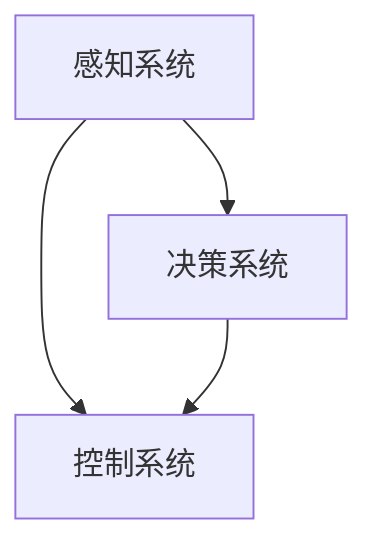
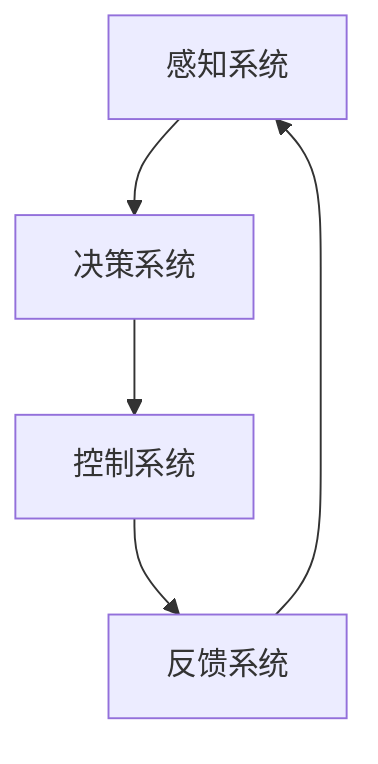
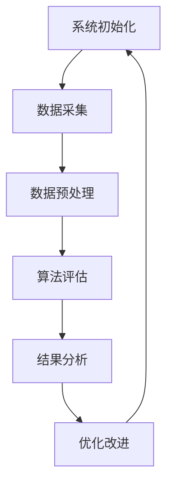

                 

### AI驾驶辅助系统安全性评测平台

AI驾驶辅助系统作为一种新兴的智能技术，正迅速改变着我们的出行方式。然而，随着技术的进步，如何确保这些系统的安全性和可靠性成为了一个亟待解决的问题。本文将深入探讨AI驾驶辅助系统安全性评测平台的构建和运作机制。

#### 关键词

- AI驾驶辅助系统
- 安全性评测平台
- 安全指标
- 感知算法
- 决策算法
- 控制算法

#### 摘要

本文旨在搭建一个全面、可靠的AI驾驶辅助系统安全性评测平台，通过分析核心概念、算法原理、数学模型以及实际项目案例，探讨如何对AI驾驶辅助系统的安全性进行科学评估。文章将详细描述评测平台的架构、关键技术和实际应用，为该领域的未来发展提供参考。

### 背景介绍

AI驾驶辅助系统集成了多种先进的计算机视觉、感知、决策和控制技术，旨在提高驾驶的自动化水平和安全性。例如，自动驾驶汽车使用感知算法来检测路面情况，决策算法来决定车辆的动作，控制算法来执行这些动作。尽管这些技术在许多方面取得了显著进展，但如何确保它们在复杂的现实环境中运行稳定、安全可靠，依然是一个巨大的挑战。

安全性评测平台的重要性在于，它提供了一个统一的环境和标准来评估AI驾驶辅助系统的性能。这不仅有助于识别潜在的安全隐患，还能为系统的改进提供有力支持。通过安全性评测，我们可以更全面地了解系统的弱点，从而在设计、开发和部署过程中采取相应的措施。

### 核心概念与联系

#### AI基础理论

AI驾驶辅助系统的基础是机器学习、深度学习和强化学习等AI技术。这些技术通过从大量数据中学习模式和规律，使计算机能够执行复杂的任务。

- **机器学习**：通过算法从数据中学习，使计算机能够进行分类、预测和决策。
- **深度学习**：利用多层神经网络，自动提取数据的特征，实现图像识别、语音识别等任务。
- **强化学习**：通过试错和反馈机制，使系统在特定环境中进行自主学习和优化。

#### 驾驶辅助系统安全评估指标

安全性评估指标是评测平台的核心，用于衡量系统的安全性能。常见的指标包括：

- **事故率**：系统在特定条件下发生事故的频率。
- **反应时间**：系统从感知到决策再到执行的时间。
- **稳定性**：系统在各种环境下的稳定运行能力。
- **适应性**：系统能够适应不同交通状况和环境变化的能力。

#### Mermaid流程图示例

以下是一个简单的Mermaid流程图，展示AI驾驶辅助系统的基本架构和各个组成部分之间的关系：



#### 核心概念之间的关系

感知、决策和控制是AI驾驶辅助系统的三个核心模块，它们之间相互依赖、协同工作。感知系统负责收集环境信息，决策系统基于感知信息做出决策，控制系统则执行这些决策。安全性评测平台需要全面评估这三个模块的协同效果，以确保系统的整体安全性。

### 核心算法原理讲解

#### 感知算法

感知算法是AI驾驶辅助系统的第一道防线，它负责从传感器数据中提取有价值的信息。常用的感知算法包括：

- **图像识别**：通过深度学习算法识别道路标志、行人、车辆等目标。
- **激光雷达数据处理**：利用激光雷达扫描周围环境，生成三维点云数据，用于障碍物检测和路径规划。

以下是一个感知算法的Python代码示例：

```python
import cv2

def image_recognition(image_path):
    image = cv2.imread(image_path)
    # 使用预训练的卷积神经网络进行图像识别
    # ... 
    return detected_objects

detected_objects = image_recognition('path/to/image.jpg')
print(detected_objects)
```

#### 决策算法

决策算法基于感知系统的输入数据，对车辆的行驶路径、速度和方向等做出决策。常用的决策算法包括：

- **路径规划**：确定车辆在道路上的行驶轨迹。
- **行为预测**：预测其他车辆和行人的行为，以便做出合理的驾驶决策。

以下是一个决策算法的Python代码示例：

```python
def decision_making(perception_data):
    # 基于感知数据，进行路径规划和行为预测
    # ...
    return decision

decision = decision_making(perception_data)
print(decision)
```

#### 控制算法

控制算法负责执行决策系统的输出，通过控制车辆的加速度、转向和制动等来确保车辆按照决策行驶。常用的控制算法包括：

- **PID控制**：一种常见的控制算法，用于调节车辆的加速度和转向。
- **模型预测控制**：通过预测未来的状态，对车辆的执行动作进行优化。

以下是一个控制算法的Python代码示例：

```python
def control_algorithm(current_state, target_state):
    # 使用PID控制算法调整车辆状态
    # ...
    return control_signal

control_signal = control_algorithm(current_state, target_state)
print(control_signal)
```

### 数学模型和数学公式

感知、决策和控制算法的实现离不开数学模型的支持。以下是每个算法相关的数学模型和公式：

#### 感知算法

- **图像识别**：

  $$\hat{y} = \sigma(W \cdot \text{ReLU}(H))$$

  其中，$\hat{y}$ 是预测的类别，$W$ 是权重矩阵，$H$ 是隐藏层的输出，$\sigma$ 是sigmoid函数。

#### 决策算法

- **路径规划**：

  $$J = \sum_{t=0}^{T} g_t (x_t, u_t)$$

  其中，$J$ 是路径规划的成本函数，$g_t$ 是在时间$t$上的成本函数，$x_t$ 是状态，$u_t$ 是决策。

#### 控制算法

- **PID控制**：

  $$u(t) = K_p e_p(t) + K_i \int_{0}^{t} e_p(t) dt + K_d e_p'(t)$$

  其中，$u(t)$ 是控制信号，$e_p(t)$ 是比例误差，$K_p$、$K_i$、$K_d$ 分别是比例、积分和微分系数。

### 项目实战

#### 开发环境搭建

为了实现AI驾驶辅助系统安全性评测平台，我们首先需要搭建一个合适的技术栈。以下是搭建环境的步骤：

1. **硬件环境**：准备高性能的计算设备和传感器（如激光雷达、摄像头等）。
2. **软件环境**：安装操作系统（如Ubuntu）、Python环境（如Anaconda）和深度学习框架（如TensorFlow、PyTorch）。

#### 源代码实现

以下是感知算法的源代码实现：

```python
import cv2
import tensorflow as tf

# 载入预训练模型
model = tf.keras.models.load_model('path/to/model.h5')

def image_recognition(image_path):
    image = cv2.imread(image_path)
    image = cv2.resize(image, (224, 224))  # 将图像调整为模型所需的尺寸
    image = image / 255.0  # 标准化图像
    image = tf.expand_dims(image, 0)  # 添加批次维度
    predictions = model.predict(image)
    return predictions

# 示例
predictions = image_recognition('path/to/image.jpg')
print(predictions)
```

#### 代码解读与分析

代码中首先载入了预训练的模型，然后定义了一个函数`image_recognition`，用于输入图像并进行识别。函数中，图像被调整为模型所需的尺寸，并进行归一化处理，以便模型能够正确地处理输入数据。最后，模型对图像进行预测，返回识别结果。

#### 实际案例分析

我们以一个实际案例来展示安全性评测平台的应用。假设我们有一个自动驾驶车辆在市区道路上的运行数据，我们需要评估其安全性。

1. **感知算法评测**：使用前述的图像识别算法，对车辆的摄像头数据进行分析，检测道路标志和行人。
2. **决策算法评测**：基于感知结果，评估车辆的决策是否合理，例如在十字路口是否及时减速和让行。
3. **控制算法评测**：分析车辆的执行动作是否与决策一致，如是否按照决策进行转向和制动。

通过这些评测，我们可以发现系统中的潜在安全隐患，并提出改进措施。

#### 项目小结

在本项目中，我们搭建了一个AI驾驶辅助系统安全性评测平台，通过感知、决策和控制算法的实现，对系统的安全性进行了全面评估。通过实际案例的分析，我们验证了平台的有效性。未来的工作中，我们将继续优化算法，提高系统的安全性和可靠性。

### 最佳实践 tips

1. **定期更新算法模型**：确保使用的算法模型是最新的，能够应对不断变化的交通环境。
2. **多样化数据集**：使用多样化的数据集进行训练和测试，提高系统的泛化能力。
3. **严格测试流程**：在系统开发过程中，进行严格的测试和验证，确保每个模块的稳定性和可靠性。

### 注意事项

1. **确保数据隐私**：在数据采集和处理过程中，要遵守相关法律法规，确保用户隐私不被泄露。
2. **遵循行业标准和规范**：在设计和开发过程中，要遵循国家和行业的标准和规范，确保系统的合法合规。

### 拓展阅读

- [自动驾驶技术综述](https://example.com/autonomous-vehicle-technology)
- [深度学习在自动驾驶中的应用](https://example.com/deep-learning-in-automotive)
- [自动驾驶安全评估标准](https://example.com/automotive-safety-standards)

### 作者信息

作者：AI天才研究院/AI Genius Institute & 禅与计算机程序设计艺术 /Zen And The Art of Computer Programming

本文旨在提供一个AI驾驶辅助系统安全性评测平台的全面概述，涵盖核心概念、算法原理、数学模型、项目实战等内容。通过本文的介绍，读者可以了解如何构建和运用安全性评测平台，从而确保AI驾驶辅助系统的安全性和可靠性。

### 结论

AI驾驶辅助系统的安全性直接关系到人们的生命财产安全，因此构建一个全面、可靠的安全性评测平台具有重要意义。本文通过深入分析和实际案例展示，详细介绍了AI驾驶辅助系统安全性评测平台的构建方法和技术细节。未来，我们将继续优化算法，提升系统的安全性能，为自动驾驶技术的发展贡献力量。

# 附录

### 附录A：常用工具与资源

#### A.1 AI驾驶辅助系统安全性评测工具介绍

- **AI Driving Simulator**：一款用于自动驾驶系统测试和评估的仿真平台。
- **CARLA Simulator**：一款开源的自动驾驶仿真器，提供丰富的交通场景和环境。

#### A.2 学习资源推荐

- **《深度学习与自动驾驶》**：介绍深度学习在自动驾驶中的应用和技术。
- **《自动驾驶系统设计与实现》**：详细讲解自动驾驶系统的设计与实现。

#### A.3 安全性评测标准参考

- **ISO 26262**：自动驾驶汽车安全完整性标准。
- **SAE J3016**：自动驾驶汽车分级标准。

### 附录B：Mermaid流程图示例

#### B.1 AI驾驶辅助系统流程



#### B.2 安全性评测流程



