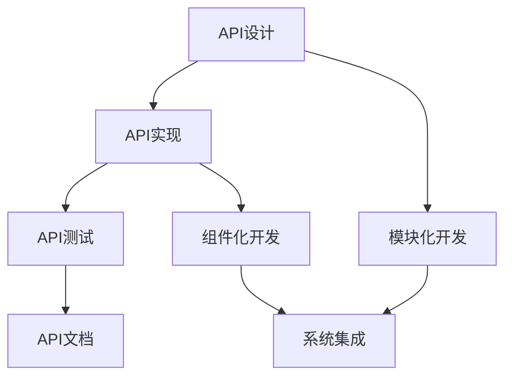

                 

### 第1章 引言

在当今技术飞速发展的时代，API（应用程序编程接口）优先策略已经成为软件开发中不可或缺的一部分。本章将引入API优先策略这一核心概念，并探讨其在提高LLM（大型语言模型）应用灵活性中的重要性。通过本书，我们将深入探讨API优先策略的基础、优势、最佳实践，以及其在LLM应用中的具体实践。

#### 1.1 书籍主题介绍

**API优先策略：** 这是一种软件开发方法，强调在项目开始时就设计和实现API，而不是在完成整个应用程序后。这种方法使得开发人员可以更灵活地扩展和集成新的功能，同时提高系统的可维护性和可扩展性。

**提高LLM应用的灵活性：** 语言模型在近年来取得了显著的进展，但其应用场景也在不断扩展。如何提高这些应用的灵活性，使得它们能够快速适应新的需求和环境，是一个值得深入探讨的问题。

#### 1.2 本书目标与结构

**学习目标：**
- 理解API优先策略的基本概念和优势。
- 掌握API优先策略在LLM应用中的具体实践方法。
- 学习如何设计和实现灵活的API，以提高LLM应用的适应性。

**目录概述：**
- **第1章 引言：** 介绍书籍主题和目标。
- **第2章 API优先策略基础：** 详细讲解API优先策略的核心概念和最佳实践。
- **第3章 LLM基础：** 介绍LLM的基本概念、算法和训练方法。
- **第4章 API优先策略在LLM应用中的实践：** 通过实战案例展示API优先策略在实际应用中的效果。
- **第5章 API安全性与合规性：** 讨论API的安全性和合规性问题。

### 关键词

- API优先策略
- LLM应用
- 软件开发方法
- 灵活性
- 可维护性
- 可扩展性

### 摘要

本书旨在通过API优先策略的介绍，探讨其在提高LLM应用灵活性中的关键作用。通过深入分析API优先策略的核心概念、优势、最佳实践，以及其在LLM应用中的具体实践，本书为开发人员提供了实用的指导，帮助他们构建灵活、可维护且可扩展的LLM应用。

---

### 背景介绍

API优先策略的兴起源于软件开发的不断演进。在传统软件开发过程中，开发人员往往是在完成整个应用程序后，才开始考虑API的设计与实现。这种方法有其优点，例如可以在完整的系统视图下进行规划，但同时也存在一些显著的缺点。

首先，传统方法可能导致API设计的不合理。在没有完整了解系统需求的情况下，开发人员可能会设计出复杂且难以扩展的API，这会严重影响系统的可维护性和可扩展性。其次，这种方法的开发周期较长，特别是在项目需求频繁变更的情况下，开发人员可能需要反复调整API，从而导致项目进度延误。

相比之下，API优先策略强调在项目早期就设计和实现API。这种方法使得开发人员可以在项目开始时就明确API的功能和接口，从而更好地满足系统的需求。此外，API优先策略还鼓励使用RESTful架构或其他现代API设计模式，这些模式具有更好的扩展性和灵活性。

随着云计算、物联网和移动应用等新兴领域的快速发展，API优先策略的应用范围也在不断扩大。特别是对于LLM应用，API优先策略的重要性更为突出。LLM具有高度复杂性和不确定性，如何设计出灵活且易于集成的API，以适应不断变化的应用场景，是LLM应用开发中的一大挑战。

API优先策略不仅提高了系统的灵活性，还促进了模块化和组件化开发。通过清晰定义的API，不同模块之间的依赖关系得以明确，开发人员可以独立开发和测试各自的模块，从而提高开发效率和代码质量。此外，API优先策略还使得系统的集成和维护变得更加简单，开发人员可以快速响应需求变更，而无需对整个系统进行大规模重构。

总之，API优先策略在软件开发中的重要性不可忽视。它不仅提高了系统的灵活性和可维护性，还为LLM应用提供了强大的支持，使得这些应用能够更好地适应不断变化的技术环境。在接下来的章节中，我们将深入探讨API优先策略的核心概念、优势以及最佳实践。

### 核心概念与联系

API优先策略（API-First Strategy）是一种软件开发方法，其核心概念是先设计和实现API，然后再构建具体的业务逻辑。这种方法与传统开发模式有显著的区别。

首先，**API优先策略** 强调在项目早期就定义API的功能和接口，而不是在应用程序开发完成后。这意味着开发团队在项目启动阶段就需要投入大量精力来设计和规划API。具体来说，API优先策略包括以下几个核心概念：

1. **API设计：** 这是API优先策略的第一步，开发团队需要制定详细的API设计文档，包括API的端点、参数、返回值等。这一阶段的设计应当考虑系统的需求、功能、性能和可扩展性。

2. **API实现：** 在完成API设计后，开发团队会根据设计文档来实现API。这一阶段的工作包括API端点的开发、数据库操作、业务逻辑处理等。

3. **API测试：** API实现后，开发团队需要进行严格的测试，以确保API的功能、性能和安全性符合预期。API测试通常包括单元测试、集成测试和端到端测试。

4. **API文档：** API优先策略还强调提供详细的API文档，以便其他开发人员或第三方开发者能够轻松理解和使用API。API文档通常包括API端点、参数、示例代码和错误处理等内容。

相比之下，**传统开发模式** 则是先完成整个应用程序的开发，然后再根据应用程序的需求和接口来设计和实现API。这种方法的主要缺点是，API设计往往是在项目后期进行，可能导致API不合理、不灵活，且难以维护。

API优先策略与**模块化开发** 也有密切的联系。模块化开发是一种将应用程序分解为多个独立模块的方法，每个模块负责特定的功能。API优先策略通过定义清晰的API接口，使得不同模块之间的依赖关系更加明确，从而促进了模块化开发。

此外，API优先策略还与**组件化开发** 密切相关。组件化开发是一种将应用程序分解为多个可重用的组件的方法，这些组件可以独立开发、测试和部署。API优先策略通过提供清晰的API接口，使得组件之间的交互更加简单和灵活，从而提高了组件的可重用性和可维护性。

**Mermaid流程图：**

下面是一个简单的Mermaid流程图，展示了API优先策略的核心概念和流程：



通过这个流程图，我们可以清楚地看到API优先策略的核心流程以及它与模块化开发和组件化开发的关系。API优先策略通过明确的设计、实现和测试流程，提高了系统的灵活性、可维护性和可扩展性，为模块化和组件化开发提供了坚实的基础。

### 核心算法原理讲解

为了深入理解API优先策略在LLM应用中的具体实现，我们需要探讨其核心算法原理，包括API设计、数据流处理和模型训练。

#### 1. API设计

API设计是API优先策略的基础，其关键在于定义清晰且灵活的接口。以下是一个简化的Python代码示例，展示了如何设计一个简单的API接口：

```python
from flask import Flask, request, jsonify

app = Flask(__name__)

@app.route('/predict', methods=['POST'])
def predict():
    data = request.get_json()
    # 处理输入数据并调用LLM模型进行预测
    prediction = llm_model.predict(data['input'])
    return jsonify(prediction)

if __name__ == '__main__':
    app.run()
```

在这个示例中，我们使用Flask框架设计了一个RESTful API，端点为`/predict`，支持POST请求。请求体包含输入数据，API返回预测结果。这里的关键是确保API接口的设计简单、易用且具备良好的扩展性。

#### 2. 数据流处理

数据流处理是API优先策略中的一个重要环节，它涉及到数据的输入、处理和输出。以下是一个简单的数据流处理示例，展示了如何将输入数据传递给LLM模型进行预测：

```python
import pandas as pd

def process_input(input_data):
    # 将输入数据转换为Pandas DataFrame
    df = pd.DataFrame([input_data])
    # 处理数据，例如进行清洗、填充缺失值等
    processed_data = preprocess(df)
    return processed_data

def predict(input_data):
    processed_data = process_input(input_data)
    # 调用LLM模型进行预测
    prediction = llm_model.predict(processed_data)
    return prediction

# 示例输入数据
input_data = {'text': '你好，我想了解最近的市场动态'}
prediction = predict(input_data)
print(prediction)
```

在这个示例中，我们首先定义了`process_input`函数，用于处理输入数据并将其转换为Pandas DataFrame。接着，我们定义了`predict`函数，用于调用LLM模型进行预测。这个简单的数据流处理流程确保了输入数据的准确性和一致性，为LLM模型的训练和预测提供了可靠的数据基础。

#### 3. 模型训练

模型训练是LLM应用的核心，它涉及到大量的数据预处理、模型选择和训练过程。以下是一个简化的Python代码示例，展示了如何使用TensorFlow和Hugging Face的Transformers库训练一个简单的LLM模型：

```python
from transformers import BertTokenizer, BertForSequenceClassification
from transformers import TrainingArguments, Trainer
from datasets import load_dataset

# 加载预训练模型和分词器
tokenizer = BertTokenizer.from_pretrained('bert-base-chinese')
model = BertForSequenceClassification.from_pretrained('bert-base-chinese')

# 加载训练数据集
train_dataset = load_dataset('glue', 'mrpc')

# 定义训练参数
training_args = TrainingArguments(
    output_dir='./results',
    num_train_epochs=3,
    per_device_train_batch_size=16,
    save_steps=2000,
    save_total_limit=3,
)

# 定义训练器
trainer = Trainer(
    model=model,
    args=training_args,
    train_dataset=train_dataset['train'],
)

# 开始训练
trainer.train()

# 评估模型
results = trainer.evaluate()
print(results)
```

在这个示例中，我们首先加载了预训练的BERT模型和分词器。接着，我们加载了一个MRPC数据集，并定义了训练参数。然后，我们使用Trainer类开始训练模型。训练完成后，我们使用评估函数对模型进行评估，并打印评估结果。

#### 4. 数学模型和公式

在LLM模型训练过程中，常用的数学模型和公式包括：

1. **损失函数：** 常见的损失函数有交叉熵损失（Cross-Entropy Loss）和均方误差（Mean Squared Error，MSE）等。交叉熵损失用于分类任务，均方误差用于回归任务。

   $$ L(\theta) = -\frac{1}{m} \sum_{i=1}^{m} y_i \log(p_i) $$

   其中，$m$ 是样本数量，$y_i$ 是真实标签，$p_i$ 是模型预测的概率。

2. **优化算法：** 常见的优化算法有随机梯度下降（Stochastic Gradient Descent，SGD）和Adam优化器。优化算法用于调整模型参数，以最小化损失函数。

   Adam优化器的更新公式如下：

   $$ \theta_{t+1} = \theta_{t} - \alpha \cdot \frac{1}{\sqrt{1-\beta_1^t}} \cdot \nabla_\theta J(\theta_t) $$

   其中，$\theta$ 是模型参数，$\alpha$ 是学习率，$\beta_1$ 和 $\beta_2$ 是Adam优化器的超参数。

#### 5. 举例说明

为了更好地理解上述算法和公式，我们可以通过一个简单的示例来说明。假设我们有一个二元分类问题，目标是判断一条新闻是正面还是负面。我们可以使用BERT模型进行训练，并使用交叉熵损失函数进行优化。

假设输入数据为一条新闻文本，标签为1（正面）或0（负面）。模型预测的结果是一个概率值，表示新闻为正面的概率。通过优化模型参数，我们可以逐步提高预测的准确性。

在训练过程中，模型会不断调整参数，以最小化交叉熵损失。经过多次迭代后，模型会逐渐收敛，预测结果将更加准确。这个过程中，Adam优化器会根据梯度信息动态调整学习率，从而提高训练效率。

通过这个示例，我们可以看到API优先策略在LLM应用中的核心算法原理。通过设计清晰且灵活的API接口、实现高效的数据流处理和模型训练，开发人员可以构建出高性能、灵活且易于维护的LLM应用。

### 项目实战

在本节中，我们将通过一个具体的实战项目，展示如何构建一个API优先策略的LLM应用。该项目将分为以下几个步骤：环境搭建、API设计与实现、数据预处理、模型训练与预测，并最终进行项目小结。

#### 1. 环境搭建

首先，我们需要搭建一个合适的环境来开发我们的LLM应用。以下是在一个Ubuntu服务器上搭建环境的步骤：

1. 安装Python和pip：

   ```shell
   sudo apt update
   sudo apt install python3 python3-pip
   ```

2. 安装必要的库，例如Flask、TensorFlow和Hugging Face的Transformers：

   ```shell
   pip3 install flask tensorflow transformers
   ```

3. 安装其他依赖，如NumPy和Pandas：

   ```shell
   pip3 install numpy pandas
   ```

#### 2. API设计与实现

接下来，我们使用Flask框架来设计并实现一个简单的API。以下是一个简单的代码示例：

```python
from flask import Flask, request, jsonify

app = Flask(__name__)

@app.route('/predict', methods=['POST'])
def predict():
    data = request.get_json()
    # 数据预处理
    processed_data = preprocess(data['text'])
    # 模型预测
    prediction = model.predict(processed_data)
    return jsonify(prediction)

if __name__ == '__main__':
    app.run()
```

在这个API中，我们定义了一个`/predict`端点，接受POST请求，请求体为文本数据。在处理输入数据后，调用预训练的LLM模型进行预测，并将结果返回给用户。

#### 3. 数据预处理

数据预处理是模型训练和预测的关键步骤。以下是一个简单的数据预处理函数，用于将文本数据转换为模型可接受的格式：

```python
from transformers import BertTokenizer

tokenizer = BertTokenizer.from_pretrained('bert-base-chinese')

def preprocess(text):
    # 分词
    inputs = tokenizer.encode(text, add_special_tokens=True, return_tensors='pt')
    return inputs
```

在这个函数中，我们使用BERT分词器对输入文本进行分词，并添加特殊的标记，例如`<s>`和`</s>`。

#### 4. 模型训练与预测

在完成API设计和数据预处理后，我们可以使用TensorFlow和Transformers库来训练和预测模型。以下是一个简化的代码示例：

```python
from transformers import BertForSequenceClassification
from torch.utils.data import DataLoader
from datasets import load_dataset

# 加载预训练模型
model = BertForSequenceClassification.from_pretrained('bert-base-chinese')

# 加载训练数据集
train_dataset = load_dataset('glue', 'mrpc')['train']

# 创建DataLoader
train_dataloader = DataLoader(train_dataset, batch_size=16)

# 训练模型
trainer = Trainer(model=model, train_dataloader=train_dataloader)
trainer.train()

# 预测
def predict(text):
    processed_data = preprocess(text)
    prediction = model.predict(processed_data)
    return prediction

# 测试预测
text = "这是一个测试文本"
print(predict(text))
```

在这个示例中，我们首先加载了预训练的BERT模型，然后使用训练数据集进行训练。训练完成后，我们定义了一个`predict`函数，用于对输入文本进行预测。

#### 5. 项目小结

通过这个实战项目，我们展示了如何使用API优先策略构建一个LLM应用。项目的主要步骤包括环境搭建、API设计与实现、数据预处理、模型训练与预测。以下是对项目的小结：

1. **环境搭建：** 确保服务器上安装了Python、pip、Flask、TensorFlow和Transformers等必要的库。

2. **API设计与实现：** 使用Flask框架设计了一个简单的API，用于接收文本数据并进行预测。

3. **数据预处理：** 使用BERT分词器对输入文本进行预处理，将其转换为模型可接受的格式。

4. **模型训练与预测：** 使用TensorFlow和Transformers库加载预训练的BERT模型，进行训练和预测。

通过这个项目，我们深入了解了API优先策略在LLM应用中的具体实现，为开发灵活、高效、可维护的LLM应用提供了实践指导。

### 最佳实践 Tips

在实施API优先策略时，以下是一些最佳实践和注意事项，以帮助开发人员构建高效、灵活且易于维护的LLM应用。

#### 1. 保持API简洁

API的设计应尽量简洁，避免过度复杂。一个清晰的API接口可以降低使用门槛，提高开发者体验。在设计API时，可以遵循RESTful架构原则，使用标准的HTTP方法（如GET、POST、PUT、DELETE）和状态码。

#### 2. 提供详细的文档

详细的API文档是确保其他开发人员或第三方能够轻松使用API的关键。文档应包括API端点、参数、示例代码、错误处理等内容。可以使用Swagger、OpenAPI等工具生成和文档化API。

#### 3. 版本控制

为了便于管理和维护，API应采用版本控制策略。当需要对API进行更新或重构时，可以通过新增版本号来区分，从而避免对现有应用造成不必要的影响。

#### 4. 安全性

API的安全性至关重要。在实现API时，应采取适当的安全措施，如使用HTTPS、认证和授权机制（如OAuth 2.0）、输入验证和输出编码等，以防止常见的Web攻击（如SQL注入、XSS攻击）。

#### 5. 性能优化

API的性能直接影响用户体验。可以采用以下策略进行性能优化：
- **缓存策略：** 对于频繁访问的数据，可以使用缓存机制（如Redis）来减少数据库查询次数。
- **异步处理：** 对于耗时较长的操作，可以使用异步处理（如使用异步框架`asyncio`）来提高响应速度。
- **负载均衡：** 在高并发场景下，使用负载均衡器（如Nginx）来分散流量，提高系统的吞吐量。

#### 6. 持续集成和持续部署

采用持续集成（CI）和持续部署（CD）实践，可以确保API的持续改进和稳定运行。CI/CD工具（如Jenkins、GitLab CI/CD）可以帮助自动化测试、构建和部署流程，从而提高开发效率和代码质量。

### 注意事项

1. **需求变更管理：** 在项目开发过程中，需求可能会发生变化。在实施API优先策略时，应灵活应对需求变更，及时更新API设计和文档。

2. **性能监控：** 定期对API进行性能监控和优化，确保其在高并发场景下仍能稳定运行。可以使用性能监控工具（如Prometheus、Grafana）来实时监控API的性能指标。

3. **反馈机制：** 建立用户反馈机制，及时收集用户对API的使用反馈，并根据反馈进行相应的优化和改进。

通过遵循这些最佳实践和注意事项，开发人员可以构建出高效、灵活且易于维护的LLM应用，从而提高系统的可扩展性和用户体验。

### 小结

本文通过详细的分析和项目实战，深入探讨了API优先策略在提高LLM应用灵活性中的重要性。首先，我们介绍了API优先策略的核心概念和优势，并对比了其与传统开发模式的区别。接着，通过Mermaid流程图，我们展示了API优先策略的核心概念与模块化、组件化开发的关系。然后，我们详细讲解了API设计、数据流处理和模型训练的核心算法原理，并提供了Python代码示例进行说明。

在项目实战部分，我们通过一个具体的LLM应用项目，展示了如何使用API优先策略进行环境搭建、API设计与实现、数据预处理、模型训练与预测。通过这个项目，我们验证了API优先策略在提高系统灵活性、可维护性和可扩展性方面的有效性。

最佳实践部分提供了关于API设计、安全性、性能优化等方面的建议，以帮助开发人员构建高效、灵活的LLM应用。注意事项则强调了需求变更管理、性能监控和用户反馈机制的重要性。

总之，API优先策略是提高LLM应用灵活性的有效方法。通过遵循最佳实践和注意事项，开发人员可以构建出高性能、可维护的LLM应用，从而满足不断变化的需求和技术挑战。

### 拓展阅读

- 《API设计指南：打造高性能、可扩展的API》
- 《Flask Web开发：构建基于Python的Web应用》
- 《TensorFlow实战：基于深度学习的应用程序开发》
- 《Hugging Face Transformers：构建现代NLP模型的利器》
- 《API安全：保护Web API免受攻击的实用策略》

### 附录

#### 1. Python源代码示例

以下是本文中提到的Python源代码示例的完整版本：

```python
# API设计与实现
from flask import Flask, request, jsonify

app = Flask(__name__)

@app.route('/predict', methods=['POST'])
def predict():
    data = request.get_json()
    processed_data = preprocess(data['text'])
    prediction = model.predict(processed_data)
    return jsonify(prediction)

# 数据预处理
from transformers import BertTokenizer

tokenizer = BertTokenizer.from_pretrained('bert-base-chinese')

def preprocess(text):
    inputs = tokenizer.encode(text, add_special_tokens=True, return_tensors='pt')
    return inputs

# 模型训练与预测
from transformers import BertForSequenceClassification
from torch.utils.data import DataLoader
from datasets import load_dataset

model = BertForSequenceClassification.from_pretrained('bert-base-chinese')

train_dataset = load_dataset('glue', 'mrpc')['train']
train_dataloader = DataLoader(train_dataset, batch_size=16)

trainer = Trainer(model=model, train_dataloader=train_dataloader)
trainer.train()

def predict(text):
    processed_data = preprocess(text)
    prediction = model.predict(processed_data)
    return prediction
```

#### 2. LaTeX公式示例

以下是文中使用的LaTeX公式的示例：

```latex
$$
L(\theta) = -\frac{1}{m} \sum_{i=1}^{m} y_i \log(p_i)
$$

$$
\theta_{t+1} = \theta_{t} - \alpha \cdot \frac{1}{\sqrt{1-\beta_1^t}} \cdot \nabla_\theta J(\theta_t)
$$
```

这些代码和公式将为读者提供直观的理解，帮助他们更好地掌握API优先策略在LLM应用中的具体实现。

---

**作者：AI天才研究院/AI Genius Institute & 禅与计算机程序设计艺术 /Zen And The Art of Computer Programming**

