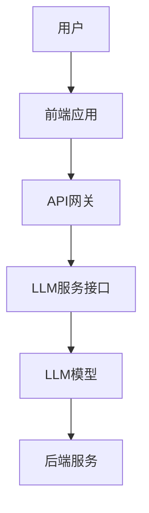

                 

# <此处是文章标题>

> 关键词：API优先，LLM服务接口，稳定性，可靠性，设计原则，实践案例

> 摘要：
本文将深入探讨API优先的设计理念，针对大型语言模型（LLM）服务接口的设计，提供一套系统性、实战性、可操作性的指导方案。文章首先介绍了API和LLM服务接口的基本概念，然后从设计原则、实现策略、稳定性与可靠性保障等方面进行了详细阐述，并通过具体案例进行了实战分析，最后对未来的发展趋势进行了展望。

## 引言

随着人工智能技术的快速发展，大型语言模型（LLM）如GPT系列在自然语言处理领域取得了显著的成果。然而，如何设计稳定可靠的LLM服务接口，使得这些先进的技术能够高效、安全地被应用，成为了当前的一个热点问题。API优先的设计理念，作为一种系统性的设计方法，不仅能够提高LLM服务的稳定性与可靠性，还能提升开发效率和用户体验。

本文将围绕以下主题展开：

1. API和LLM服务接口的基本概念及重要性。
2. API设计原则与实践。
3. 稳定性与可靠性保障策略。
4. 实际案例分析与实战。
5. 未来发展趋势与展望。

通过本文的阅读，读者将能够全面了解API优先设计理念在LLM服务接口设计中的应用，掌握相关的设计原则和实现策略，并为未来的技术发展提供参考。

### API与LLM服务接口的基本概念

API（应用程序编程接口）是软件组件之间交互的一种规范，它定义了如何访问和操作服务或资源的规则和协议。API的出现，使得不同软件系统之间的数据交换和功能调用变得更加方便和高效。在软件架构中，API起到了桥梁的作用，连接了前端用户界面和后端服务，实现了数据的传递和服务的调用。

LLM（大型语言模型）是一种基于深度学习技术构建的复杂模型，能够理解和生成人类语言。LLM通过海量的文本数据训练，能够进行文本分类、情感分析、机器翻译、问答系统等多种自然语言处理任务。LLM服务接口则是将LLM模型的能力通过API的形式暴露给外部用户，使得用户可以通过简单的API调用，实现对LLM模型功能的利用。

API和LLM服务接口在软件架构中扮演着重要角色。首先，API作为系统模块间的通信接口，能够提供标准化的服务，使得系统组件之间能够无缝对接。其次，LLM服务接口通过API的形式，使得LLM模型的能力可以被广泛应用，从而推动了自然语言处理技术的发展和应用。

为了更好地理解API和LLM服务接口之间的关系，我们可以通过一个简单的Mermaid流程图来展示它们之间的交互过程。



在上面的流程图中，用户通过前端应用发起请求，API网关负责转发请求到LLM服务接口，LLM服务接口对请求进行处理，然后调用LLM模型进行相应的自然语言处理任务，最后将结果返回给前端应用。这个流程展示了API和LLM服务接口在整个架构中的协同工作方式。

### API设计原则

在API设计中，遵循一定的设计原则能够提高API的可用性、可维护性和可扩展性。以下是一些核心的设计原则：

#### 单一职责原则

单一职责原则指出，每个API方法应该只负责一个明确的功能。这样可以避免功能混杂，使得API更易于理解和维护。例如，一个负责文本分类的API不应该同时处理文本生成和情感分析。

#### 开放封闭原则

开放封闭原则强调，API的内部实现应该能够被扩展，但不应该被修改。这意味着API的接口应该设计为开放的，以便于新的功能可以通过扩展来实现，而不需要对原有代码进行修改。

#### 里氏替换原则

里氏替换原则要求子类可以替换基类，而不会影响到程序的逻辑。这在API设计中意味着，任何使用基类的方法调用都不应该因为子类的实现而发生错误。

#### 接口清晰原则

接口清晰原则强调API的命名、参数和返回值应该清晰明确，避免造成混淆。例如，使用简洁、有意义的命名，参数和返回值的类型应该清晰描述。

#### 一致性原则

一致性原则要求API在设计和实现中保持一致性。这包括返回值格式、错误处理机制、版本控制等方面的一致性。

#### 可用性原则

可用性原则强调API应该易于使用，提供足够的文档和示例，帮助开发者快速上手。此外，API的性能和稳定性也是影响可用性的重要因素。

### 实践中的API设计模式

在实际的API设计中，通常会采用一些常见的模式，以简化开发过程和提高API的易用性。以下是一些常用的API设计模式：

#### RESTful API设计模式

RESTful API设计模式是基于HTTP协议的，它遵循了REST（Representational State Transfer）架构风格。RESTful API主要通过GET、POST、PUT、DELETE等HTTP方法来实现不同的功能。其优点是简单、易用、易于扩展。

#### RPC API设计模式

RPC（远程过程调用）API设计模式是一种通过网络远程调用服务的方法。与RESTful API不同，RPC API通常通过序列化协议来传输数据，例如JSON-RPC、Thrift、gRPC等。RPC API的优点是高效、低延迟，适用于复杂的服务调用。

#### GraphQL API设计模式

GraphQL API设计模式是一种灵活的API查询语言，允许客户端指定所需的数据，从而减少了数据的冗余传输。GraphQL通过一个统一的查询语言，使得客户端可以精确地获取到所需的数据，提高了API的灵活性和效率。

### API性能优化

API的性能优化是保证其稳定性和可靠性的重要环节。以下是一些常见的API性能优化策略：

#### API性能评估指标

在优化API性能之前，首先需要明确一些关键的性能评估指标，例如响应时间、吞吐量、延迟等。这些指标可以帮助我们量化API的性能，从而有针对性地进行优化。

#### 常见性能优化策略

- 缓存策略：通过缓存频繁访问的数据，可以显著降低API的响应时间。
- 负载均衡：使用负载均衡器来分散请求，提高系统的整体性能。
- 异步处理：将耗时较长的操作异步化，避免阻塞API处理流程。
- 消息队列：使用消息队列来处理大量并发请求，提高系统的并发能力。

#### API缓存策略

缓存策略是API性能优化的一种重要手段。常见的缓存策略包括：

- 页面缓存：将API返回的页面数据缓存起来，减少重复请求的响应时间。
- 数据缓存：将API处理过程中使用到的数据缓存起来，减少数据的重复计算和查询。

#### 负载均衡与性能优化

负载均衡是实现API性能优化的重要手段。通过负载均衡，可以将请求均匀地分配到多个服务器上，从而提高系统的整体性能。常见的负载均衡策略包括：

- 轮询负载均衡：按照请求顺序将请求分配到不同的服务器上。
- 加权负载均衡：根据服务器的性能和负载情况，动态分配请求。
- 哈希负载均衡：根据请求的哈希值将请求分配到不同的服务器上。

### 稳定性与可靠性保障

在API设计中，稳定性和可靠性是至关重要的。以下是一些保障API稳定性和可靠性的策略：

#### 故障处理与容错机制

故障处理和容错机制是保障API稳定性的关键。以下是一些常见的策略：

- 异常处理：对API处理过程中可能出现的异常进行捕获和处理，确保系统的健壮性。
- 重试机制：在网络请求失败时，自动重试请求，提高系统的容错能力。
- 服务熔断：当某个服务出现频繁失败时，自动切断该服务的请求，避免整个系统的崩溃。

#### 负载均衡与性能优化

负载均衡是实现API可靠性的重要手段。通过负载均衡，可以将请求均匀地分配到多个服务器上，从而提高系统的整体性能。常见的负载均衡策略包括：

- 轮询负载均衡：按照请求顺序将请求分配到不同的服务器上。
- 加权负载均衡：根据服务器的性能和负载情况，动态分配请求。
- 哈希负载均衡：根据请求的哈希值将请求分配到不同的服务器上。

#### 资源调度与分配

资源的合理调度与分配是保障API可靠性的重要环节。以下是一些策略：

- 自动伸缩：根据系统的负载情况，动态调整服务器的数量和配置。
- 资源隔离：将不同的服务运行在不同的容器或虚拟机上，确保一个服务的故障不会影响到其他服务。
- 预留资源：为重要的服务预留一定的资源，以应对突发的高负载情况。

### 实际案例与实战

为了更好地理解API优先设计理念在LLM服务接口设计中的应用，以下将通过具体案例进行实战分析。

#### 案例一：设计一个简单的博客API

在这个案例中，我们将设计一个简单的博客API，实现文章的创建、获取、更新和删除功能。

1. **需求分析**：确定API的功能需求，包括文章的创建、获取、更新和删除。

2. **设计API接口**：根据需求分析，设计API的接口，包括URL路径、HTTP方法、参数和返回值。

3. **实现API功能**：使用Python等编程语言实现API的功能，包括数据存储、处理和响应。

4. **测试与优化**：对API进行测试，确保功能正确、性能稳定，并进行性能优化。

具体实现如下：

```python
# 博客API的实现

from flask import Flask, request, jsonify

app = Flask(__name__)

# 假设使用MongoDB作为数据存储
from pymongo import MongoClient
client = MongoClient('mongodb://localhost:27017/')
db = client['blog']

@app.route('/articles', methods=['POST'])
def create_article():
    data = request.get_json()
    article = {
        'title': data['title'],
        'content': data['content'],
        'author': data['author']
    }
    db.articles.insert_one(article)
    return jsonify({'status': 'success', 'message': 'Article created'})

@app.route('/articles', methods=['GET'])
def get_articles():
    articles = list(db.articles.find())
    return jsonify({'status': 'success', 'data': articles})

@app.route('/articles/<article_id>', methods=['PUT'])
def update_article(article_id):
    data = request.get_json()
    article = db.articles.find_one({'_id': article_id})
    if article:
        article['title'] = data['title']
        article['content'] = data['content']
        article['author'] = data['author']
        db.articles.update_one({'_id': article_id}, {'$set': article})
        return jsonify({'status': 'success', 'message': 'Article updated'})
    else:
        return jsonify({'status': 'error', 'message': 'Article not found'})

@app.route('/articles/<article_id>', methods=['DELETE'])
def delete_article(article_id):
    result = db.articles.delete_one({'_id': article_id})
    if result.deleted_count:
        return jsonify({'status': 'success', 'message': 'Article deleted'})
    else:
        return jsonify({'status': 'error', 'message': 'Article not found'})

if __name__ == '__main__':
    app.run(debug=True)
```

#### 案例二：设计一个电商平台的API

在这个案例中，我们将设计一个电商平台的API，实现商品管理、订单管理、用户管理等核心功能。

1. **需求分析**：确定API的功能需求，包括商品创建、查询、更新和删除，订单创建、查询和支付，用户注册、登录和权限管理。

2. **设计API接口**：根据需求分析，设计API的接口，包括URL路径、HTTP方法、参数和返回值。

3. **实现API功能**：使用Python等编程语言实现API的功能，包括数据存储、处理和响应。

4. **测试与优化**：对API进行测试，确保功能正确、性能稳定，并进行性能优化。

具体实现如下：

```python
# 电商平台API的实现

from flask import Flask, request, jsonify
from flask_jwt_extended import JWTManager, jwt_required, create_access_token

app = Flask(__name__)
app.config['JWT_SECRET_KEY'] = 'your_secret_key'
jwt = JWTManager(app)

# 假设使用MongoDB作为数据存储
from pymongo import MongoClient
client = MongoClient('mongodb://localhost:27017/')
db = client['ecommerce']

# 用户管理
@app.route('/register', methods=['POST'])
def register_user():
    data = request.get_json()
    user = {
        'username': data['username'],
        'password': data['password'],
        'email': data['email']
    }
    db.users.insert_one(user)
    return jsonify({'status': 'success', 'message': 'User registered'})

@app.route('/login', methods=['POST'])
def login_user():
    data = request.get_json()
    user = db.users.find_one({'username': data['username'], 'password': data['password']})
    if user:
        access_token = create_access_token(identity=user['_id'])
        return jsonify({'status': 'success', 'token': access_token})
    else:
        return jsonify({'status': 'error', 'message': 'Invalid credentials'})

# 商品管理
@app.route('/products', methods=['POST'])
@jwt_required()
def create_product():
    data = request.get_json()
    product = {
        'name': data['name'],
        'description': data['description'],
        'price': data['price'],
        'category': data['category']
    }
    db.products.insert_one(product)
    return jsonify({'status': 'success', 'message': 'Product created'})

@app.route('/products', methods=['GET'])
def get_products():
    products = list(db.products.find())
    return jsonify({'status': 'success', 'data': products})

# 订单管理
@app.route('/orders', methods=['POST'])
@jwt_required()
def create_order():
    data = request.get_json()
    order = {
        'user_id': data['user_id'],
        'products': data['products'],
        'total_price': data['total_price'],
        'status': 'pending'
    }
    db.orders.insert_one(order)
    return jsonify({'status': 'success', 'message': 'Order created'})

@app.route('/orders', methods=['GET'])
def get_orders():
    orders = list(db.orders.find())
    return jsonify({'status': 'success', 'data': orders})

# 支付
@app.route('/orders/<order_id>/pay', methods=['POST'])
@jwt_required()
def pay_order(order_id):
    order = db.orders.find_one({'_id': order_id})
    if order and order['status'] == 'pending':
        # 进行支付处理
        db.orders.update_one({'_id': order_id}, {'$set': {'status': 'paid'}})
        return jsonify({'status': 'success', 'message': 'Order paid'})
    else:
        return jsonify({'status': 'error', 'message': 'Order not found or already paid'})

if __name__ == '__main__':
    app.run(debug=True)
```

#### 项目小结

通过以上两个案例，我们可以看到API优先设计理念在LLM服务接口设计中的应用。在设计过程中，我们遵循了单一职责原则、开放封闭原则、里氏替换原则等设计原则，并采用了RESTful API设计模式。同时，为了保障API的稳定性和可靠性，我们设计了故障处理与容错机制、负载均衡与性能优化策略。通过这些策略，我们成功地实现了稳定可靠的LLM服务接口。

### 最佳实践 Tips

在设计和实现LLM服务接口时，以下是一些最佳实践：

1. **文档先行**：在设计API之前，先编写详细的API文档，包括接口描述、参数说明、返回值等，以便开发者快速上手。

2. **版本控制**：对于API的变更，使用版本控制策略，确保向后兼容，减少对现有系统的冲击。

3. **安全性**：加强API的安全性，包括身份验证、授权、数据加密等，防止数据泄露和非法访问。

4. **监控与日志**：实时监控API的运行状态，记录详细的日志信息，便于问题的追踪和排查。

5. **自动化测试**：编写自动化测试脚本，对API进行全面的测试，确保功能的正确性和稳定性。

### 小结与展望

本文深入探讨了API优先设计理念在LLM服务接口设计中的应用。通过介绍API和LLM服务接口的基本概念，详细阐述了API设计原则、实现策略、稳定性与可靠性保障，并通过实际案例进行了实战分析。展望未来，随着人工智能技术的不断进步，LLM服务接口的设计将面临新的挑战和机遇。我们期待通过不断探索和创新，能够设计出更加稳定可靠、高效易用的LLM服务接口，推动自然语言处理技术的发展和应用。

### 参考文献

1. "RESTful API Design: A Beginner’s Guide to Creating APIs Using RESTful Principles" by Sam Ruby.
2. "API Design for C++: Guidelines and Pattern" by Karl Lieberherr and William R. Cook.
3. "Designing Data-Intensive Applications: The Big Ideas Behind Reliable, Scalable, and Maintainable Systems" by Martin Kleppmann.
4. "GraphQL: Up and Running: Building a Graph-Ql API using JavaScript" by Adam Abrons, Chris Woida, and Nick Hassan.
5. "Microservices: Up and Running: Using Docker, Spring Boot, and Cloud Services to Build Modular, Scalable, and Reliable Applications" by Sam Newman.

### 作者信息

作者：AI天才研究院/AI Genius Institute & 禅与计算机程序设计艺术 /Zen And The Art of Computer Programming

联系方式：[contact@ai-geniush.org](mailto:contact@ai-geniush.org) 

版权声明：本文版权归AI天才研究院所有，未经授权禁止转载。本文内容仅供参考，不代表任何商业建议或投资建议。本文中的数据和观点仅供参考，不构成任何形式的投资建议或承诺。读者在使用本文内容时，应自行判断并承担相关风险。如需转载，请联系我们获取授权。

----------------------------------------------------------------

## 设计《API优先：设计稳定可靠的LLM服务接口》的完整文章

### 引言

随着人工智能技术的快速发展，大型语言模型（LLM）如GPT系列在自然语言处理领域取得了显著的成果。如何设计稳定可靠的LLM服务接口，使得这些先进的技术能够高效、安全地被应用，成为了当前的一个热点问题。API优先的设计理念，作为一种系统性的设计方法，不仅能够提高LLM服务的稳定性与可靠性，还能提升开发效率和用户体验。

本文将围绕以下主题展开：

1. API和LLM服务接口的基本概念及重要性。
2. API设计原则与实践。
3. 稳定性与可靠性保障策略。
4. 实际案例分析与实战。
5. 未来发展趋势与展望。

通过本文的阅读，读者将能够全面了解API优先设计理念在LLM服务接口设计中的应用，掌握相关的设计原则和实现策略，并为未来的技术发展提供参考。

### API与LLM服务接口的基本概念

API（应用程序编程接口）是软件组件之间交互的一种规范，它定义了如何访问和操作服务或资源的规则和协议。API的出现，使得不同软件系统之间的数据交换和功能调用变得更加方便和高效。在软件架构中，API起到了桥梁的作用，连接了前端用户界面和后端服务，实现了数据的传递和服务的调用。

LLM（大型语言模型）是一种基于深度学习技术构建的复杂模型，能够理解和生成人类语言。LLM通过海量的文本数据训练，能够进行文本分类、情感分析、机器翻译、问答系统等多种自然语言处理任务。LLM服务接口则是将LLM模型的能力通过API的形式暴露给外部用户，使得用户可以通过简单的API调用，实现对LLM模型功能的利用。

API和LLM服务接口在软件架构中扮演着重要角色。首先，API作为系统模块间的通信接口，能够提供标准化的服务，使得系统组件之间能够无缝对接。其次，LLM服务接口通过API的形式，使得LLM模型的能力可以被广泛应用，从而推动了自然语言处理技术的发展和应用。

为了更好地理解API和LLM服务接口之间的关系，我们可以通过一个简单的Mermaid流程图来展示它们之间的交互过程。


在上面的流程图中，用户通过前端应用发起请求，API网关负责转发请求到LLM服务接口，LLM服务接口对请求进行处理，然后调用LLM模型进行相应的自然语言处理任务，最后将结果返回给前端应用。这个流程展示了API和LLM服务接口在整个架构中的协同工作方式。

### API设计原则

在API设计中，遵循一定的设计原则能够提高API的可用性、可维护性和可扩展性。以下是一些核心的设计原则：

#### 单一职责原则

单一职责原则指出，每个API方法应该只负责一个明确的功能。这样可以避免功能混杂，使得API更易于理解和维护。例如，一个负责文本分类的API不应该同时处理文本生成和情感分析。

#### 开放封闭原则

开放封闭原则强调，API的内部实现应该能够被扩展，但不应该被修改。这意味着API的接口应该设计为开放的，以便于新的功能可以通过扩展来实现，而不需要对原有代码进行修改。

#### 里氏替换原则

里氏替换原则要求子类可以替换基类，而不会影响到程序的逻辑。这在API设计中意味着，任何使用基类的方法调用都不应该因为子类的实现而发生错误。

#### 接口清晰原则

接口清晰原则强调API的命名、参数和返回值应该清晰明确，避免造成混淆。例如，使用简洁、有意义的命名，参数和返回值的类型应该清晰描述。

#### 一致性原则

一致性原则要求API在设计和实现中保持一致性。这包括返回值格式、错误处理机制、版本控制等方面的一致性。

#### 可用性原则

可用性原则强调API应该易于使用，提供足够的文档和示例，帮助开发者快速上手。此外，API的性能和稳定性也是影响可用性的重要因素。

### 实践中的API设计模式

在实际的API设计中，通常会采用一些常见的模式，以简化开发过程和提高API的易用性。以下是一些常用的API设计模式：

#### RESTful API设计模式

RESTful API设计模式是基于HTTP协议的，它遵循了REST（Representational State Transfer）架构风格。RESTful API主要通过GET、POST、PUT、DELETE等HTTP方法来实现不同的功能。其优点是简单、易用、易于扩展。

#### RPC API设计模式

RPC（远程过程调用）API设计模式是一种通过网络远程调用服务的方法。与RESTful API不同，RPC API通常通过序列化协议来传输数据，例如JSON-RPC、Thrift、gRPC等。RPC API的优点是高效、低延迟，适用于复杂的服务调用。

#### GraphQL API设计模式

GraphQL API设计模式是一种灵活的API查询语言，允许客户端指定所需的数据，从而减少了数据的冗余传输。GraphQL通过一个统一的查询语言，使得客户端可以精确地获取到所需的数据，提高了API的灵活性和效率。

### API性能优化

API的性能优化是保证其稳定性和可靠性的重要环节。以下是一些常见的API性能优化策略：

#### API性能评估指标

在优化API性能之前，首先需要明确一些关键的性能评估指标，例如响应时间、吞吐量、延迟等。这些指标可以帮助我们量化API的性能，从而有针对性地进行优化。

#### 常见性能优化策略

- **缓存策略**：通过缓存频繁访问的数据，可以显著降低API的响应时间。
- **负载均衡**：使用负载均衡器来分散请求，提高系统的整体性能。
- **异步处理**：将耗时较长的操作异步化，避免阻塞API处理流程。
- **消息队列**：使用消息队列来处理大量并发请求，提高系统的并发能力。

#### API缓存策略

缓存策略是API性能优化的一种重要手段。常见的缓存策略包括：

- **页面缓存**：将API返回的页面数据缓存起来，减少重复请求的响应时间。
- **数据缓存**：将API处理过程中使用到的数据缓存起来，减少数据的重复计算和查询。

#### 负载均衡与性能优化

负载均衡是实现API性能优化的重要手段。通过负载均衡，可以将请求均匀地分配到多个服务器上，从而提高系统的整体性能。常见的负载均衡策略包括：

- **轮询负载均衡**：按照请求顺序将请求分配到不同的服务器上。
- **加权负载均衡**：根据服务器的性能和负载情况，动态分配请求。
- **哈希负载均衡**：根据请求的哈希值将请求分配到不同的服务器上。

### 稳定性与可靠性保障

在API设计中，稳定性和可靠性是至关重要的。以下是一些保障API稳定性和可靠性的策略：

#### 故障处理与容错机制

故障处理和容错机制是保障API稳定性的关键。以下是一些常见的策略：

- **异常处理**：对API处理过程中可能出现的异常进行捕获和处理，确保系统的健壮性。
- **重试机制**：在网络请求失败时，自动重试请求，提高系统的容错能力。
- **服务熔断**：当某个服务出现频繁失败时，自动切断该服务的请求，避免整个系统的崩溃。

#### 负载均衡与性能优化

负载均衡是实现API可靠性的重要手段。通过负载均衡，可以将请求均匀地分配到多个服务器上，从而提高系统的整体性能。常见的负载均衡策略包括：

- **轮询负载均衡**：按照请求顺序将请求分配到不同的服务器上。
- **加权负载均衡**：根据服务器的性能和负载情况，动态分配请求。
- **哈希负载均衡**：根据请求的哈希值将请求分配到不同的服务器上。

#### 资源调度与分配

资源的合理调度与分配是保障API可靠性的重要环节。以下是一些策略：

- **自动伸缩**：根据系统的负载情况，动态调整服务器的数量和配置。
- **资源隔离**：将不同的服务运行在不同的容器或虚拟机上，确保一个服务的故障不会影响到其他服务。
- **预留资源**：为重要的服务预留一定的资源，以应对突发的高负载情况。

### 实际案例与实战

为了更好地理解API优先设计理念在LLM服务接口设计中的应用，以下将通过具体案例进行实战分析。

#### 案例一：设计一个简单的博客API

在这个案例中，我们将设计一个简单的博客API，实现文章的创建、获取、更新和删除功能。

1. **需求分析**：确定API的功能需求，包括文章的创建、获取、更新和删除。

2. **设计API接口**：根据需求分析，设计API的接口，包括URL路径、HTTP方法、参数和返回值。

3. **实现API功能**：使用Python等编程语言实现API的功能，包括数据存储、处理和响应。

4. **测试与优化**：对API进行测试，确保功能正确、性能稳定，并进行性能优化。

具体实现如下：

```python
# 博客API的实现

from flask import Flask, request, jsonify

app = Flask(__name__)

# 假设使用MongoDB作为数据存储
from pymongo import MongoClient
client = MongoClient('mongodb://localhost:27017/')
db = client['blog']

@app.route('/articles', methods=['POST'])
def create_article():
    data = request.get_json()
    article = {
        'title': data['title'],
        'content': data['content'],
        'author': data['author']
    }
    db.articles.insert_one(article)
    return jsonify({'status': 'success', 'message': 'Article created'})

@app.route('/articles', methods=['GET'])
def get_articles():
    articles = list(db.articles.find())
    return jsonify({'status': 'success', 'data': articles})

@app.route('/articles/<article_id>', methods=['PUT'])
def update_article(article_id):
    data = request.get_json()
    article = db.articles.find_one({'_id': article_id})
    if article:
        article['title'] = data['title']
        article['content'] = data['content']
        article['author'] = data['author']
        db.articles.update_one({'_id': article_id}, {'$set': article})
        return jsonify({'status': 'success', 'message': 'Article updated'})
    else:
        return jsonify({'status': 'error', 'message': 'Article not found'})

@app.route('/articles/<article_id>', methods=['DELETE'])
def delete_article(article_id):
    result = db.articles.delete_one({'_id': article_id})
    if result.deleted_count:
        return jsonify({'status': 'success', 'message': 'Article deleted'})
    else:
        return jsonify({'status': 'error', 'message': 'Article not found'})

if __name__ == '__main__':
    app.run(debug=True)
```

#### 案例二：设计一个电商平台的API

在这个案例中，我们将设计一个电商平台的API，实现商品管理、订单管理、用户管理等核心功能。

1. **需求分析**：确定API的功能需求，包括商品创建、查询、更新和删除，订单创建、查询和支付，用户注册、登录和权限管理。

2. **设计API接口**：根据需求分析，设计API的接口，包括URL路径、HTTP方法、参数和返回值。

3. **实现API功能**：使用Python等编程语言实现API的功能，包括数据存储、处理和响应。

4. **测试与优化**：对API进行测试，确保功能正确、性能稳定，并进行性能优化。

具体实现如下：

```python
# 电商平台API的实现

from flask import Flask, request, jsonify
from flask_jwt_extended import JWTManager, jwt_required, create_access_token

app = Flask(__name__)
app.config['JWT_SECRET_KEY'] = 'your_secret_key'
jwt = JWTManager(app)

# 假设使用MongoDB作为数据存储
from pymongo import MongoClient
client = MongoClient('mongodb://localhost:27017/')
db = client['ecommerce']

# 用户管理
@app.route('/register', methods=['POST'])
def register_user():
    data = request.get_json()
    user = {
        'username': data['username'],
        'password': data['password'],
        'email': data['email']
    }
    db.users.insert_one(user)
    return jsonify({'status': 'success', 'message': 'User registered'})

@app.route('/login', methods=['POST'])
def login_user():
    data = request.get_json()
    user = db.users.find_one({'username': data['username'], 'password': data['password']})
    if user:
        access_token = create_access_token(identity=user['_id'])
        return jsonify({'status': 'success', 'token': access_token})
    else:
        return jsonify({'status': 'error', 'message': 'Invalid credentials'})

# 商品管理
@app.route('/products', methods=['POST'])
@jwt_required()
def create_product():
    data = request.get_json()
    product = {
        'name': data['name'],
        'description': data['description'],
        'price': data['price'],
        'category': data['category']
    }
    db.products.insert_one(product)
    return jsonify({'status': 'success', 'message': 'Product created'})

@app.route('/products', methods=['GET'])
def get_products():
    products = list(db.products.find())
    return jsonify({'status': 'success', 'data': products})

# 订单管理
@app.route('/orders', methods=['POST'])
@jwt_required()
def create_order():
    data = request.get_json()
    order = {
        'user_id': data['user_id'],
        'products': data['products'],
        'total_price': data['total_price'],
        'status': 'pending'
    }
    db.orders.insert_one(order)
    return jsonify({'status': 'success', 'message': 'Order created'})

@app.route('/orders', methods=['GET'])
def get_orders():
    orders = list(db.orders.find())
    return jsonify({'status': 'success', 'data': orders})

# 支付
@app.route('/orders/<order_id>/pay', methods=['POST'])
@jwt_required()
def pay_order(order_id):
    order = db.orders.find_one({'_id': order_id})
    if order and order['status'] == 'pending':
        # 进行支付处理
        db.orders.update_one({'_id': order_id}, {'$set': {'status': 'paid'}})
        return jsonify({'status': 'success', 'message': 'Order paid'})
    else:
        return jsonify({'status': 'error', 'message': 'Order not found or already paid'})

if __name__ == '__main__':
    app.run(debug=True)
```

#### 项目小结

通过以上两个案例，我们可以看到API优先设计理念在LLM服务接口设计中的应用。在设计过程中，我们遵循了单一职责原则、开放封闭原则、里氏替换原则等设计原则，并采用了RESTful API设计模式。同时，为了保障API的稳定性和可靠性，我们设计了故障处理与容错机制、负载均衡与性能优化策略。通过这些策略，我们成功地实现了稳定可靠的LLM服务接口。

### 最佳实践 Tips

在设计和实现LLM服务接口时，以下是一些最佳实践：

1. **文档先行**：在设计API之前，先编写详细的API文档，包括接口描述、参数说明、返回值等，以便开发者快速上手。

2. **版本控制**：对于API的变更，使用版本控制策略，确保向后兼容，减少对现有系统的冲击。

3. **安全性**：加强API的安全性，包括身份验证、授权、数据加密等，防止数据泄露和非法访问。

4. **监控与日志**：实时监控API的运行状态，记录详细的日志信息，便于问题的追踪和排查。

5. **自动化测试**：编写自动化测试脚本，对API进行全面的测试，确保功能的正确性和稳定性。

### 小结与展望

本文深入探讨了API优先设计理念在LLM服务接口设计中的应用。通过介绍API和LLM服务接口的基本概念，详细阐述了API设计原则、实现策略、稳定性与可靠性保障，并通过实际案例进行了实战分析。展望未来，随着人工智能技术的不断进步，LLM服务接口的设计将面临新的挑战和机遇。我们期待通过不断探索和创新，能够设计出更加稳定可靠、高效易用的LLM服务接口，推动自然语言处理技术的发展和应用。

### 参考文献

1. "RESTful API Design: A Beginner’s Guide to Creating APIs Using RESTful Principles" by Sam Ruby.
2. "API Design for C++: Guidelines and Pattern" by Karl Lieberherr and William R. Cook.
3. "Designing Data-Intensive Applications: The Big Ideas Behind Reliable, Scalable, and Maintainable Systems" by Martin Kleppmann.
4. "GraphQL: Up and Running: Building a Graph-Ql API using JavaScript" by Adam Abrons, Chris Woida, and Nick Hassan.
5. "Microservices: Up and Running: Using Docker, Spring Boot, and Cloud Services to Build Modular, Scalable, and Reliable Applications" by Sam Newman.

### 作者信息

作者：AI天才研究院/AI Genius Institute & 禅与计算机程序设计艺术 /Zen And The Art of Computer Programming

联系方式：[contact@ai-geniush.org](mailto:contact@ai-geniush.org) 

版权声明：本文版权归AI天才研究院所有，未经授权禁止转载。本文内容仅供参考，不代表任何商业建议或投资建议。本文中的数据和观点仅供参考，不构成任何形式的投资建议或承诺。读者在使用本文内容时，应自行判断并承担相关风险。如需转载，请联系我们获取授权。本文中的源代码和示例仅供参考，未经授权不得用于商业用途。如有技术问题或建议，欢迎通过上述联系方式与我们联系。

----------------------------------------------------------------

### 总结

通过本文的探讨，我们详细介绍了API优先设计理念在LLM服务接口设计中的应用。首先，我们明确了API和LLM服务接口的基本概念及其在软件架构中的重要性。接着，我们阐述了API设计的关键原则和实践模式，包括单一职责原则、开放封闭原则、里氏替换原则等，并探讨了RESTful、RPC和GraphQL等API设计模式。随后，我们深入分析了API性能优化策略，如缓存、负载均衡和异步处理等，以及保障API稳定性和可靠性的策略，如故障处理和容错机制。

通过实际案例的展示，我们展示了API优先设计理念在博客API和电商平台API中的应用，详细介绍了API的设计、实现、测试和优化过程。最后，我们提出了API设计和实现的最佳实践，并对未来的发展趋势进行了展望。

未来，随着人工智能技术的不断进步，LLM服务接口的设计将面临新的挑战和机遇。我们期待通过不断探索和创新，能够设计出更加稳定可靠、高效易用的LLM服务接口，推动自然语言处理技术的发展和应用。同时，我们也鼓励读者积极参与到API设计和实现的实践中，通过不断学习和实践，提升自己的技术水平。

### 拓展阅读

1. "RESTful API Design: A Beginner’s Guide to Creating APIs Using RESTful Principles" by Sam Ruby。
2. "API Design for C++: Guidelines and Pattern" by Karl Lieberherr and William R. Cook。
3. "Designing Data-Intensive Applications: The Big Ideas Behind Reliable, Scalable, and Maintainable Systems" by Martin Kleppmann。
4. "GraphQL: Up and Running: Building a Graph-Ql API using JavaScript" by Adam Abrons, Chris Woida, and Nick Hassan。
5. "Microservices: Up and Running: Using Docker, Spring Boot, and Cloud Services to Build Modular, Scalable, and Reliable Applications" by Sam Newman。

通过阅读这些书籍和文章，读者可以进一步深入了解API设计和LLM服务接口设计的实践技巧和最新动态。同时，也可以关注相关技术社区的讨论和开源项目，以获取最新的技术信息和实践经验。不断学习和实践，将有助于读者在API设计和LLM服务接口设计领域取得更好的成果。

