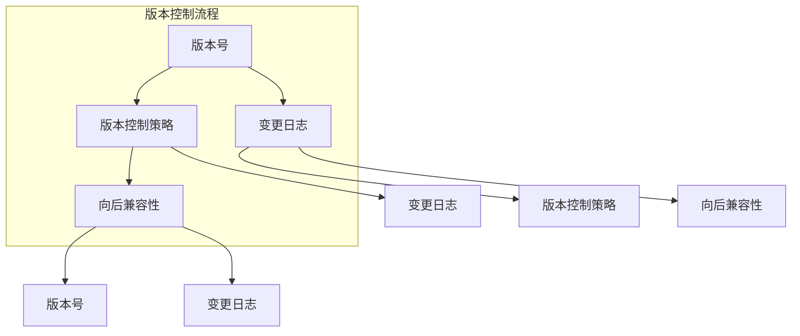

                 

### 文章标题：API版本控制：管理LLM服务接口的演进

#### 关键词：
- API版本控制
- LLM服务接口
- 软件演进管理
- 软件开发实践

#### 摘要：
本文旨在深入探讨API版本控制在管理大型语言模型(LLM)服务接口演进中的应用。通过分析API版本控制的核心概念、策略和工具，本文揭示了如何高效管理LLM服务的接口变更，确保软件的持续演进和稳定运行。文章结合实际案例，详细讲解了API版本控制的实践方法，旨在为开发者提供实用指南，助力软件开发的成功。

---

### 引言

在现代软件开发中，API（应用程序编程接口）是连接不同系统和组件的关键桥梁。随着软件系统的不断演进，API接口的变更不可避免。有效的API版本控制策略能够确保接口的变更不会对依赖其的客户端应用造成负面影响，从而保障软件的稳定性和可维护性。

近年来，大型语言模型(LLM)在自然语言处理领域取得了显著突破，逐渐成为各个行业的重要技术支撑。LLM服务的广泛应用使得API版本控制的重要性愈加凸显。如何通过API版本控制策略，管理LLM服务接口的演进，成为软件开发过程中亟待解决的问题。

本文将围绕以下三个方面展开讨论：

1. **API版本控制基础**：介绍API版本控制的概念、命名规则和常用工具，解析API版本控制的核心原则和实践方法。
2. **LLM服务接口演进**：探讨LLM服务接口的设计、管理策略以及API版本控制在这一过程中的应用。
3. **API版本控制实战**：结合实际案例，详细讲解API版本控制的实施过程和最佳实践。

通过本文的深入分析，读者将能够理解API版本控制的重要性，掌握管理LLM服务接口演进的方法，并为实际项目中的软件开发提供有价值的参考。

### API版本控制基础

#### API版本控制的概念

API版本控制是指在软件开发过程中，对API接口进行版本管理和控制的一种策略。其核心目标是确保在软件系统的持续演进过程中，API接口的变更能够被有序管理，同时确保依赖API的客户端应用不会因接口变更而受到不必要的影响。

API版本控制通常涉及以下几个关键要素：

1. **版本号**：用于标识API接口的不同版本，通常采用递增的数字或字母数字组合，如1.0、1.1或v2.0。
2. **版本控制策略**：定义如何对API接口进行版本管理和发布，包括版本号的命名规则、发布频率和变更管理等。
3. **版本兼容性**：确保新版本的API接口能够向后兼容旧版本，减少因版本变更导致的客户端应用中断。
4. **文档管理**：提供详细的API文档，包括接口定义、使用示例和变更日志等，帮助开发者理解和使用新版本接口。

#### API版本号的命名规则

API版本号的命名规则对于版本控制的策略至关重要。常见的命名规则包括以下几种：

1. **数字递增**：例如1.0、1.1、1.2，适用于线性演进的场景。
2. **字母数字组合**：例如v1.0、v2.0，适用于重大变更或版本跳跃的场景。
3. **语义化版本**：例如1.0.0、1.1.0、1.2.0，将版本分为主版本、次版本和修订版本，适用于更加细致的版本管理。
4. **短版本**：例如1、2、3，适用于快速迭代和频繁发布的场景。

#### 常见的API版本控制工具

在软件开发中，常用的API版本控制工具包括Git、Swagger、Postman等。

1. **Git**：Git是一个分布式版本控制系统，广泛用于代码管理和版本控制。通过Git，开发者可以创建和维护不同版本的API接口，实现代码的版本管理和协作开发。
2. **Swagger**：Swagger是一个开放规范，用于定义、生成、使用和可视化RESTful API。Swagger能够生成详细的API文档，支持版本控制，帮助开发者快速了解和测试API接口。
3. **Postman**：Postman是一个API开发工具，用于构建和测试API接口。Postman支持多版本管理，方便开发者对比和测试不同版本的API接口。

#### API版本控制的最佳实践

为了确保API版本控制的有效性，以下是一些最佳实践：

1. **明确版本号策略**：根据项目需求和变更频率，制定合适的版本号命名规则，确保版本号能够准确反映接口变更的情况。
2. **保持版本兼容性**：在设计新版本接口时，尽量保持对旧版本的向后兼容，减少客户端应用因版本变更而受到影响。
3. **详细记录变更日志**：在每次版本发布时，详细记录接口的变更内容和原因，便于开发者跟踪和管理。
4. **文档和培训**：提供详细的API文档和培训资料，帮助客户端开发者快速理解和适应新版本的API接口。

通过遵循上述最佳实践，开发者可以更有效地管理API版本控制，确保软件系统的稳定和持续演进。

### 核心概念与联系

在深入探讨API版本控制之前，有必要先理解其中的核心概念，包括版本号、版本控制策略、向后兼容性和变更日志等。这些概念相互关联，构成了API版本控制的逻辑架构。

#### 核心概念

1. **版本号**：版本号是API版本控制的核心元素，用于标识接口的不同版本。版本号通常由数字或字母数字组合构成，如1.0、v2.0或1.2.0。版本号不仅能够区分接口的不同版本，还能够反映接口的变更程度和重要性。
2. **版本控制策略**：版本控制策略是指如何管理API接口的版本发布和变更。常见的策略包括线性递增、字母数字组合和语义化版本等，每种策略都有其适用的场景和优缺点。
3. **向后兼容性**：向后兼容性是API版本控制的重要目标，指新版本的API接口能够无缝地替代旧版本，而不对依赖其的客户端应用造成负面影响。保持向后兼容性可以降低变更带来的风险，提高系统的稳定性。
4. **变更日志**：变更日志是记录API接口变更历史的重要文档。每次版本发布时，都需要详细记录接口的变更内容、原因和影响，以便开发者和管理者能够清晰地了解接口的变化情况。

#### 联系与关系架构

版本号、版本控制策略、向后兼容性和变更日志等核心概念之间的关系可以通过Mermaid流程图来表示：



在上述流程图中，版本号、版本控制策略、向后兼容性和变更日志构成了一个闭环。版本号是整个流程的起点，通过版本控制策略进行管理和发布，向后兼容性确保新版本能够无缝替代旧版本，而变更日志则记录了整个版本控制过程的变更历史。

通过上述核心概念和联系的分析，我们可以更好地理解API版本控制的本质和实现方法。在接下来的部分，我们将深入探讨API版本控制的具体实现和应用场景。

### API版本控制工具

在API版本控制的过程中，选择合适的工具对于确保版本管理的有效性至关重要。本文将介绍几种常用的API版本控制工具，包括Git、Swagger和Postman，并比较它们的特点和适用场景。

#### Git

Git是一种分布式版本控制系统，广泛用于代码管理和版本控制。Git的分布式特性使得开发者可以在本地独立进行版本控制，并在需要时进行同步和合并。在API版本控制中，Git的主要作用包括：

1. **版本存储**：Git可以存储API接口的多个版本，使得开发者可以在不同的版本间进行切换和对比。
2. **变更记录**：Git能够记录每次提交的详细变更，包括文件内容和提交说明，有助于追踪和管理接口的变更历史。
3. **协作开发**：Git支持多人协作，开发者可以在各自的工作副本上进行开发和提交，然后进行合并，确保版本控制的协同性。

Git在API版本控制中的优点包括：

- **灵活性和可扩展性**：Git适用于各种规模和复杂度的项目，能够灵活地管理API接口的版本。
- **分布式特性**：Git的分布式特性使得开发者可以在本地进行版本控制，提高开发效率和协作能力。

但Git也存在一些缺点，如：

- **学习曲线**：Git的命令行操作较为复杂，需要一定的时间学习和适应。
- **性能问题**：对于大型项目，Git的性能可能会受到影响，导致版本切换和合并速度较慢。

#### Swagger

Swagger是一个基于JSON的开放规范，用于定义、生成、使用和可视化RESTful API。Swagger的关键特性包括：

1. **API定义**：Swagger能够定义API的接口、参数、响应和错误信息，提供详细的接口文档。
2. **自动化生成**：Swagger支持自动化生成API文档和客户端代码，提高开发效率。
3. **版本管理**：Swagger支持API版本的标识和管理，开发者可以在不同版本间进行切换和对比。

Swagger在API版本控制中的优点包括：

- **文档化**：Swagger能够生成详细的API文档，帮助开发者快速了解和使用API接口。
- **自动化**：Swagger支持自动化生成文档和客户端代码，减少手动工作。

但Swagger也存在一些限制，如：

- **学习成本**：Swagger虽然提供了自动化工具，但开发者仍需要了解其基本原理和用法。
- **兼容性问题**：在某些复杂的API场景中，Swagger可能无法完全满足需求，需要额外的定制和扩展。

#### Postman

Postman是一个API开发工具，用于构建和测试API接口。Postman的主要功能包括：

1. **接口构建**：Postman支持创建、编辑和测试API接口，开发者可以在Postman中直接操作接口。
2. **测试和调试**：Postman提供了丰富的测试和调试工具，帮助开发者验证API接口的功能和性能。
3. **版本管理**：Postman支持多版本管理，开发者可以在不同的版本间进行切换和对比。

Postman在API版本控制中的优点包括：

- **直观易用**：Postman的用户界面直观，易于上手，适合初学者和有经验的开发者。
- **灵活性和可扩展性**：Postman支持自定义测试脚本和工具，能够适应各种开发需求。

但Postman也存在一些不足，如：

- **集成问题**：Postman与其他版本控制工具（如Git）的集成可能需要额外的配置和工具。
- **性能问题**：对于大规模的API接口测试，Postman的性能可能会受到影响，导致测试速度变慢。

#### 工具比较

Git、Swagger和Postman各有其特点和适用场景，以下是比较表格：

| 工具 | 主要功能 | 优点 | 缺点 |
| --- | --- | --- | --- |
| Git | 版本存储、变更记录、协作开发 | 灵活性和可扩展性、分布式特性 | 学习曲线、性能问题 |
| Swagger | API定义、自动化生成、版本管理 | 文档化、自动化 | 学习成本、兼容性问题 |
| Postman | 接口构建、测试和调试、版本管理 | 直观易用、灵活性和可扩展性 | 集成问题、性能问题 |

综上所述，Git、Swagger和Postman在API版本控制中都有其独特的应用场景。开发者可以根据具体需求选择合适的工具，以实现高效的API版本管理。

### API版本控制的最佳实践

在API版本控制中，最佳实践是确保版本管理策略的有效性和实施过程的规范，从而最大化地减少变更带来的风险，提高系统的稳定性和可维护性。以下是一些关键的API版本控制最佳实践：

#### 明确版本号策略

首先，需要根据项目的具体情况制定明确的版本号策略。版本号策略应该定义版本号的命名规则、发布频率和变更管理等内容。常见的版本号命名规则包括：

1. **数字递增**：例如1.0、1.1、1.2，适用于线性演进和持续迭代的项目。
2. **字母数字组合**：例如v1.0、v2.0，适用于重大功能更新或版本跳跃的场景。
3. **语义化版本**：例如1.0.0、1.1.0、1.2.0，适用于更加细致的版本管理，其中1为主版本，0为次版本，0为修订版本。

#### 保持向后兼容性

在设计和发布新版本的API接口时，应尽量保持向后兼容性。这意味着新版本的接口应能够无缝替代旧版本，而不会对依赖其的客户端应用造成负面影响。为了实现向后兼容性，可以考虑以下策略：

1. **向后兼容性测试**：在发布新版本前，进行全面的向后兼容性测试，确保新版本不会对旧客户端应用造成功能中断或性能下降。
2. **废弃策略**：对于不再支持的功能或接口，应明确废弃策略，提前通知客户端开发者，并建议逐步迁移至新接口。
3. **版本注释**：在新版本接口的文档中，详细记录与旧版本的差异和迁移指南，帮助客户端开发者顺利过渡。

#### 详细记录变更日志

变更日志是API版本控制的重要文档，记录了每次版本发布的变更内容和原因。详细记录变更日志有助于开发者和管理者了解接口的变化情况，从而更好地管理版本。以下是记录变更日志的一些最佳实践：

1. **规范化格式**：采用统一的格式记录变更日志，包括变更内容、影响范围、变更原因和解决方法等。
2. **及时更新**：在每次版本发布时，及时更新变更日志，确保记录的变更信息是最新的。
3. **版本追踪**：在变更日志中，标记每个变更的版本号，便于后续追踪和回溯。

#### 文档和培训

提供详细的API文档和培训资料是确保版本控制有效性的重要环节。以下是一些相关最佳实践：

1. **API文档**：生成详细的API文档，包括接口定义、使用示例、参数说明和错误处理等，便于客户端开发者理解和使用API接口。
2. **培训资料**：为客户端开发者提供培训资料，包括API版本控制策略、变更管理和迁移指南等，帮助他们快速适应新版本的API接口。
3. **文档更新**：随着接口的变更，定期更新API文档和培训资料，确保信息的准确性和及时性。

#### 自动化测试和监控

自动化测试和监控是确保API接口质量和稳定性的重要手段。以下是一些相关最佳实践：

1. **自动化测试**：编写自动化测试脚本，对API接口的每个版本进行自动化测试，确保接口的功能和性能满足预期。
2. **持续集成**：将API版本控制与持续集成（CI）系统结合，确保每次版本发布前都经过全面的测试和验证。
3. **监控与报警**：建立API接口的监控机制，实时监控接口的响应时间、错误率和访问量等关键指标，并在出现异常时及时报警。

通过遵循上述最佳实践，开发者可以更有效地管理API版本控制，确保软件系统的稳定和持续演进。同时，这些实践也为实际项目中的API版本管理提供了有价值的指导。

### LLM服务接口概述

#### LLM服务接口的概念

大型语言模型（LLM）服务接口是指允许开发者通过API接口调用LLM服务的接口定义。LLM服务接口通常包括文本生成、文本分类、情感分析等多种功能，能够实现自然语言处理（NLP）任务的高效执行。LLM服务接口的设计和实现是确保LLM模型在实际应用中能够稳定、可靠和高效运行的关键。

#### LLM服务接口的作用

LLM服务接口在软件开发中发挥着重要作用，主要体现在以下几个方面：

1. **模块化开发**：通过LLM服务接口，开发者可以将自然语言处理功能模块化，与其他软件组件进行解耦，提高系统的可维护性和可扩展性。
2. **功能复用**：LLM服务接口允许开发者在不同项目中复用自然语言处理功能，减少重复开发工作，提高开发效率。
3. **易用性**：详细的接口文档和清晰的API设计，使得开发者能够快速理解和使用LLM服务，降低学习成本。
4. **性能优化**：通过优化LLM服务接口的设计和实现，可以提高LLM服务的响应速度和处理能力，满足大规模应用的需求。

#### LLM服务接口设计原则

为了确保LLM服务接口的设计合理、高效且易于维护，以下原则应当遵循：

1. **简洁性**：接口设计应尽量简洁，避免不必要的复杂性，提高开发者的使用体验。
2. **一致性**：接口设计应保持一致性，包括命名规范、参数定义和返回结果等，确保接口的易读性和易用性。
3. **灵活性**：接口设计应具备足够的灵活性，以适应不同场景和应用需求的变化。
4. **安全性**：接口设计应考虑安全性，包括身份验证、权限控制和数据加密等，确保系统的安全性。
5. **可扩展性**：接口设计应具备良好的可扩展性，以便在需要时能够快速添加新的功能或服务。

#### LLM服务接口设计工具

在设计LLM服务接口时，选择合适的工具能够提高设计效率和代码质量。以下是一些常用的LLM服务接口设计工具：

1. **Swagger**：Swagger是一个流行的API设计工具，支持定义、生成和文档化API接口。Swagger提供了一整套完整的API设计规范，能够生成详细的接口文档，方便开发者理解和使用。
2. **RAML**：RAML（RESTful API Modeling Language）是一种基于YAML的API建模语言，用于定义API接口。RAML具有高度的可扩展性和灵活性，能够满足复杂的API设计需求。
3. **Postman**：Postman是一个功能强大的API开发工具，支持创建、测试和文档化API接口。Postman提供了丰富的调试和测试工具，能够帮助开发者快速设计和优化接口。

通过遵循上述设计原则和使用合适的工具，开发者可以设计出高效、稳定且易于维护的LLM服务接口，为软件系统的稳定运行和持续演进提供有力支持。

### LLM服务接口设计

#### 接口设计原则

在LLM服务接口的设计过程中，遵循适当的设计原则至关重要。这些原则不仅能够确保接口的易用性和稳定性，还能提高系统的可维护性和可扩展性。以下是一些核心设计原则：

1. **简洁性**：接口设计应尽量简洁，避免不必要的复杂性。简洁的接口能够降低学习成本，提高开发效率和用户体验。
2. **一致性**：接口设计应保持一致性，包括命名规范、参数定义和返回结果等。一致性有助于提高接口的可读性和易用性，减少因不一致性导致的错误。
3. **灵活性**：接口设计应具备足够的灵活性，以适应不同场景和应用需求的变化。灵活的接口设计能够更好地应对未来的变更，减少重新设计的需要。
4. **安全性**：接口设计应考虑安全性，包括身份验证、权限控制和数据加密等。确保接口的安全性是保护用户数据和系统免受攻击的关键。
5. **可扩展性**：接口设计应具备良好的可扩展性，以便在需要时能够快速添加新的功能或服务。可扩展性有助于提高系统的灵活性和适应性。

#### 接口设计工具

选择合适的工具是确保接口设计高效、准确的关键。以下是一些常用的接口设计工具：

1. **Swagger**：Swagger是一个流行的API设计工具，支持定义、生成和文档化API接口。Swagger提供了一整套完整的API设计规范，能够生成详细的接口文档，方便开发者理解和使用。
2. **RAML**：RAML（RESTful API Modeling Language）是一种基于YAML的API建模语言，用于定义API接口。RAML具有高度的可扩展性和灵活性，能够满足复杂的API设计需求。
3. **Postman**：Postman是一个功能强大的API开发工具，支持创建、测试和文档化API接口。Postman提供了丰富的调试和测试工具，能够帮助开发者快速设计和优化接口。

#### 接口设计示例

为了更好地理解LLM服务接口的设计，以下是一个简单的接口设计示例：

**接口名称**：文本生成API

**接口描述**：该接口用于生成指定长度的文本内容。

**请求参数**：
- `text`：输入文本，类型为字符串，必填。
- `length`：生成文本的长度，类型为整数，默认为100。

**请求示例**：
```json
POST /api/v1/generate_text
Content-Type: application/json

{
  "text": "Hello, World!",
  "length": 100
}
```

**响应结果**：
- `status`：操作状态，类型为字符串，成功时返回"success"。
- `text`：生成的文本内容，类型为字符串。

**响应示例**：
```json
{
  "status": "success",
  "text": "Hello, World! This is a generated text with a length of 100 characters."
}
```

通过上述示例，我们可以看到接口设计的基本要素，包括接口名称、描述、请求参数、请求示例和响应结果。这样的设计有助于开发者快速理解和实现接口，提高开发效率。

### LLM服务接口的API版本管理

#### 版本管理策略

在LLM服务接口的开发和演进过程中，版本管理策略是确保接口稳定性和兼容性的关键。以下是一些常见的API版本管理策略：

1. **语义化版本控制**：语义化版本控制（Semantic Versioning）是一种常见的版本管理策略，其核心思想是通过版本号的递增来标识接口的变更程度。版本号通常由主版本号、次版本号和修订版本号组成，分别表示重大变更、新增功能和修复bug。例如，1.2.3表示主版本为1，次版本为2，修订版本为3。

2. **向后兼容性策略**：向后兼容性策略旨在确保新版本的API接口能够无缝替代旧版本，而不会对依赖其的客户端应用造成负面影响。为了实现向后兼容性，需要在设计新版本接口时充分考虑旧版本接口的功能和用法，并进行全面的向后兼容性测试。

3. **废弃和迁移策略**：对于不再支持的功能或接口，应明确废弃策略，提前通知客户端开发者，并建议逐步迁移至新接口。废弃策略通常包括逐步减少旧接口的使用频率，最终完全停止支持。

#### 版本冲突的解决

版本冲突是API版本管理中常见的问题，特别是在多个版本并行开发或多个团队协作开发时。以下是一些解决版本冲突的方法：

1. **分支管理**：通过Git等版本控制工具的分支管理功能，将不同版本的接口开发工作隔离在不同的分支上，避免冲突和覆盖。在完成新版本的接口开发并通过测试后，再将新分支合并到主分支。

2. **代码审查**：在进行代码合并或发布前，进行严格的代码审查，确保新版本的接口符合设计规范和版本管理策略。代码审查有助于发现和解决潜在的问题，减少版本冲突的风险。

3. **版本兼容性测试**：在发布新版本接口前，进行全面的兼容性测试，确保新版本能够与旧版本的客户端应用无缝兼容。兼容性测试包括功能测试、性能测试和安全测试等，确保新版本的接口能够稳定运行。

4. **文档更新**：在解决版本冲突时，及时更新API文档，包括变更日志、接口描述和迁移指南等，帮助客户端开发者了解接口的变更情况，并顺利过渡到新版本。

通过上述策略和方法，可以有效地管理和解决LLM服务接口的版本冲突，确保接口的稳定性和兼容性，为软件的持续演进提供有力支持。

### LLM服务接口的测试与优化

在LLM服务接口的开发过程中，测试和优化是确保接口稳定性和性能的关键步骤。以下是LLM服务接口测试与优化的详细流程：

#### 测试

1. **功能测试**：功能测试是验证接口是否能够按预期工作的过程。在功能测试中，需要涵盖所有接口的功能点，确保每个功能都能正确执行。以下是一些常见的功能测试方法：

   - **黑盒测试**：黑盒测试不考虑接口的实现细节，仅关注输入和输出是否满足预期。通过模拟客户端请求，验证接口的响应是否正确。
   - **白盒测试**：白盒测试关注接口的实现细节，通过审查代码逻辑，确保接口的正确性。白盒测试通常由开发人员执行。

2. **性能测试**：性能测试旨在评估接口在高压情况下的性能，包括响应时间、吞吐量和资源消耗等。以下是一些常见的性能测试方法：

   - **负载测试**：通过模拟大量并发请求，评估接口在高负载情况下的性能和稳定性。
   - **压力测试**：通过不断增大请求量，找到接口的瓶颈和最大承载能力。
   - **稳定性测试**：在长时间运行下，持续对接口进行压力测试，确保接口的稳定性和可靠性。

3. **安全测试**：安全测试旨在发现和修复接口的安全漏洞，确保系统的安全性。以下是一些常见的安全测试方法：

   - **漏洞扫描**：使用自动化工具扫描接口的常见漏洞，如SQL注入、XSS攻击等。
   - **代码审计**：对接口的代码进行审查，识别潜在的安全隐患。

#### 优化

1. **代码优化**：通过审查和重构代码，提高代码的质量和可维护性。以下是一些常见的代码优化方法：

   - **减少冗余代码**：删除不必要的代码，简化逻辑，提高代码的可读性。
   - **优化算法**：改进算法的实现，降低时间复杂度和空间复杂度，提高接口的运行效率。

2. **接口优化**：

   - **缓存策略**：使用缓存技术，减少重复的计算和请求，提高接口的响应速度。
   - **异步处理**：采用异步处理方式，避免接口因为长时间的运算而阻塞，提高系统的吞吐量。

3. **性能优化**：

   - **负载均衡**：通过负载均衡技术，将请求分散到多个服务器上，提高系统的处理能力。
   - **数据库优化**：对数据库进行优化，包括索引优化、查询优化和存储优化，提高数据访问速度。

#### 实际案例

以下是一个LLM服务接口的测试与优化案例：

**案例背景**：一个基于大型语言模型（LLM）的智能问答系统的接口，在高峰期出现响应缓慢和吞吐量不足的问题。

**测试与优化过程**：

1. **功能测试**：首先对接口进行了全面的黑盒测试和白盒测试，确保所有功能点都能正确执行。

2. **性能测试**：通过负载测试和压力测试，发现接口在并发请求达到1000时，响应时间显著增加，系统吞吐量不足。

3. **安全测试**：进行了漏洞扫描和代码审计，未发现明显的安全漏洞。

4. **代码优化**：对代码进行了审查和重构，减少了冗余代码，优化了算法的实现。

5. **接口优化**：引入了缓存策略，减少了重复的计算和请求。同时，将部分接口实现了异步处理，提高了系统的吞吐量。

6. **性能优化**：采用了负载均衡技术，将请求分散到多个服务器上。对数据库进行了优化，包括索引优化和查询优化。

**优化效果**：通过上述测试和优化，接口的响应时间显著降低，系统吞吐量达到预期，满足了高峰期的需求。

通过详细的测试和优化流程，开发者可以确保LLM服务接口的稳定性和高性能，为用户提供优质的服务。

### 实战一：API版本控制策略制定

在软件开发过程中，API版本控制策略的制定至关重要，它不仅关系到软件的持续演进，还影响到客户端应用的开发和使用。以下将详细描述一个API版本控制策略制定的实战过程，包括版本号的命名规则、版本管理流程以及版本兼容性策略。

#### 背景介绍

假设我们正在开发一个基于大型语言模型（LLM）的智能问答系统，该系统提供了文本生成、情感分析和文本分类等多种功能。随着功能的不断迭代和需求的变更，API接口也需要进行相应的更新和优化。为了确保系统的稳定性和可维护性，我们需要制定一个合理的API版本控制策略。

#### 版本号命名规则

我们选择采用语义化版本控制（Semantic Versioning）作为API版本号的命名规则，其格式为`MAJOR.MINOR.PATCH`。具体解释如下：

1. **MAJOR（主版本号）**：当接口发生不兼容的变更时，增加主版本号。例如，从1.0升级到2.0，意味着接口发生了重大变更，可能包括核心算法的改变、接口参数的调整等。
2. **MINOR（次版本号）**：当接口新增功能或兼容性变更时，增加次版本号。例如，从1.0升级到1.1，意味着接口增加了新功能，但不会破坏现有客户端的应用。
3. **PATCH（修订版本号）**：当接口修复bug或进行细微调整时，增加修订版本号。例如，从1.0.1升级到1.0.2，意味着接口修复了某些bug，但不会影响现有客户端的功能。

#### 版本管理流程

以下是API版本管理的基本流程：

1. **需求收集**：首先，我们需要收集来自产品经理和开发团队的需求，包括新功能的添加、接口参数的调整、性能优化等。
2. **设计评审**：针对收集到的需求，进行详细的设计评审，讨论接口变更的具体细节，包括变更的内容、影响范围和实施计划。
3. **代码开发**：根据设计评审的结果，开发团队开始实施接口变更，进行代码的编写和修改。
4. **测试**：在接口变更完成后，进行全面的测试，包括功能测试、性能测试和安全测试等，确保变更后的接口符合预期。
5. **发布**：测试通过后，将新版本的API接口发布到生产环境中，同时更新API文档，包括版本说明、变更日志和迁移指南等。
6. **监控**：发布后，需要持续监控接口的性能和稳定性，确保新版本的API接口能够稳定运行。

#### 版本兼容性策略

为了确保新版本的API接口能够与旧版本的客户端应用兼容，我们采取了以下策略：

1. **向后兼容性**：在设计和开发新版本接口时，尽可能保持对旧版本的向后兼容。这意味着新版本接口应能够接收旧版本客户端的请求，并返回正确的响应。对于不兼容的变更，应在变更日志中明确指出，并建议客户端逐步升级。
2. **废弃策略**：对于不再维护的旧版本接口，制定明确的废弃策略，提前通知客户端开发者，并给出迁移指南。通常，废弃策略包括逐步减少旧接口的使用频率，最终停止支持。
3. **文档更新**：在每次版本发布时，及时更新API文档，详细记录接口的变更内容和影响范围，并提供详细的迁移指南，帮助客户端开发者顺利过渡到新版本。

#### 实战过程

以下是API版本控制策略制定的实战过程：

1. **需求收集**：在项目启动阶段，产品经理和开发团队召开会议，收集关于API接口的需求，包括新增文本分类功能、优化响应速度等。
2. **设计评审**：根据需求收集的结果，开发团队进行了详细的设计评审，讨论了文本分类功能的接口设计，包括请求参数、返回结果和错误处理等。
3. **代码开发**：开发团队按照设计评审的结果，开始编写文本分类功能的代码，并对现有接口进行必要的调整，以保持向后兼容性。
4. **测试**：完成代码开发后，进行了全面的测试，包括功能测试、性能测试和安全测试，确保新接口的功能完整、性能稳定且安全可靠。
5. **发布**：测试通过后，将文本分类功能的API接口发布到生产环境中，同时更新了API文档，详细记录了接口的变更内容、影响范围和迁移指南。
6. **监控**：发布后，持续监控接口的性能和稳定性，确保新版本的API接口能够稳定运行，并根据反馈进行必要的调整和优化。

通过上述实战过程，我们成功制定并实施了一个合理的API版本控制策略，确保了系统的稳定性和可维护性，同时为客户端开发者提供了清晰的迁移指南。

### 实战二：API版本升级实践

在软件开发过程中，API版本升级是常见的操作，旨在引入新功能、修复bug或优化性能。以下将详细描述API版本升级的实践过程，包括版本升级的准备、实施和验证步骤。

#### 背景介绍

假设我们正在开发一个基于大型语言模型（LLM）的智能问答系统，目前版本为v1.0。最近，我们计划进行一次版本升级，将版本号升级为v1.1，主要目的是新增文本分类功能并优化响应速度。

#### 准备工作

1. **需求分析**：首先，与产品经理和开发团队进行讨论，明确升级的目标和需求，包括新增文本分类功能、优化接口性能等。
2. **设计评审**：针对升级需求，进行详细的设计评审，讨论接口变更的具体细节，如新功能的设计、接口参数的调整等。
3. **代码审查**：对即将进行升级的代码进行审查，确保代码质量符合要求，减少潜在的风险。
4. **备份**：在开始升级前，对现有系统的关键数据和服务进行备份，确保在升级过程中出现问题时能够快速恢复。

#### 实施步骤

1. **开发新功能**：按照设计评审的结果，开发团队开始编写文本分类功能的代码，并对现有接口进行必要的调整，以保持向后兼容性。
2. **单元测试**：完成新功能的开发后，进行单元测试，确保新功能能够按预期工作，并符合设计要求。
3. **集成测试**：将新功能集成到现有系统中，进行集成测试，确保新功能与现有系统模块的兼容性，并验证系统的整体性能。
4. **性能测试**：对新版本接口进行性能测试，确保接口的响应速度和吞吐量满足预期，特别是针对高峰期的负载能力。
5. **代码审查与修复**：在测试过程中，根据发现的问题进行代码审查和修复，确保系统的稳定性和可靠性。

#### 验证步骤

1. **内部验证**：在开发团队内部进行验证，确保新版本接口的功能、性能和稳定性满足要求。通常包括以下步骤：

   - **功能测试**：确保所有功能点都能正确执行，满足设计要求。
   - **性能测试**：验证接口的响应速度和吞吐量，确保在高负载情况下仍然稳定。
   - **安全测试**：确保接口的安全性，没有潜在的安全漏洞。

2. **用户验证**：邀请部分客户端开发者参与验证，收集他们的反馈和建议，确保新版本接口能够满足实际需求，并易于使用。

3. **文档更新**：更新API文档，包括版本说明、变更日志和迁移指南等，为客户端开发者提供详细的信息。

4. **发布**：在验证通过后，将新版本接口发布到生产环境中，并通知所有客户端开发者进行升级。

5. **监控**：发布后，持续监控接口的性能和稳定性，确保新版本的接口能够稳定运行，并根据反馈进行必要的调整和优化。

#### 实战过程

以下是API版本升级的实战过程：

1. **需求分析**：产品经理和开发团队召开会议，明确升级的目标和需求，包括新增文本分类功能和优化响应速度。
2. **设计评审**：根据需求进行设计评审，讨论接口变更的具体细节，如文本分类功能的设计和接口参数的调整。
3. **代码审查**：对代码进行审查，确保代码质量，减少潜在的风险。
4. **备份**：对系统进行备份，确保在升级过程中出现问题时能够快速恢复。
5. **开发新功能**：开发团队开始编写文本分类功能的代码，并对现有接口进行调整，以保持向后兼容性。
6. **单元测试**：完成新功能的开发后，进行单元测试，确保新功能能够按预期工作。
7. **集成测试**：进行集成测试，确保新功能与现有系统的兼容性，并验证系统的整体性能。
8. **性能测试**：进行性能测试，确保接口的响应速度和吞吐量满足预期，特别是针对高峰期的负载能力。
9. **代码审查与修复**：根据测试中发现的问题进行代码审查和修复，确保系统的稳定性和可靠性。
10. **内部验证**：进行内部验证，确保新版本接口的功能、性能和稳定性满足要求。
11. **用户验证**：邀请部分客户端开发者参与验证，收集他们的反馈和建议。
12. **文档更新**：更新API文档，包括版本说明、变更日志和迁移指南。
13. **发布**：将新版本接口发布到生产环境中，并通知客户端开发者进行升级。
14. **监控**：持续监控接口的性能和稳定性，并根据反馈进行必要的调整和优化。

通过上述实战过程，我们成功完成了一次API版本升级，引入了新功能并优化了接口性能，确保了系统的稳定性和可维护性。

### 实战三：API版本回滚实践

在软件开发过程中，API版本回滚是处理紧急问题的一种有效手段，旨在将系统恢复到之前稳定的状态。以下将详细描述API版本回滚的实践过程，包括回滚的准备、实施和验证步骤。

#### 背景介绍

假设我们正在开发一个基于大型语言模型（LLM）的智能问答系统，目前版本为v1.1。在一次版本升级后，我们发现新版本接口存在严重的性能问题，导致系统的响应速度显著下降。为了尽快解决问题，我们需要将系统回滚到之前稳定运行的版本v1.0。

#### 准备工作

1. **问题确认**：首先，确认问题的严重性，并分析问题的原因。在本次案例中，由于新版本的接口在高并发情况下性能不佳，导致系统响应时间过长。
2. **备份**：在回滚前，确保对当前系统的关键数据和服务进行备份，以便在回滚失败时能够快速恢复。
3. **回滚计划**：制定详细的回滚计划，包括回滚的时间、步骤和责任人。

#### 实施步骤

1. **关闭新版本接口**：首先，关闭新版本的API接口，防止更多的请求进入系统，造成更大的影响。
2. **恢复旧版本接口**：从备份中恢复旧版本的API接口，确保系统能够回到之前稳定运行的状态。
3. **性能测试**：恢复旧版本接口后，进行全面的性能测试，确保接口的响应速度和吞吐量恢复到预期水平。
4. **代码审查**：对回滚后的代码进行审查，查找可能导致性能问题的原因，并制定修复方案。

#### 验证步骤

1. **内部验证**：在开发团队内部进行验证，确保回滚后的系统功能完整、性能稳定，并符合设计要求。
2. **用户验证**：邀请部分客户端开发者参与验证，确保接口的功能和性能能够满足实际需求，并易于使用。
3. **文档更新**：更新API文档，包括版本说明、变更日志和迁移指南等，为客户端开发者提供详细的信息。

#### 实战过程

以下是API版本回滚的实战过程：

1. **问题确认**：确认新版本接口存在严重的性能问题，导致系统响应时间过长。
2. **备份**：对当前系统进行备份，确保在回滚失败时能够快速恢复。
3. **关闭新版本接口**：关闭新版本的API接口，防止更多请求进入系统。
4. **恢复旧版本接口**：从备份中恢复旧版本的API接口，确保系统能够回到之前稳定运行的状态。
5. **性能测试**：进行性能测试，确保接口的响应速度和吞吐量恢复到预期水平。
6. **代码审查**：对回滚后的代码进行审查，查找可能导致性能问题的原因。
7. **内部验证**：在开发团队内部进行验证，确保回滚后的系统功能完整、性能稳定。
8. **用户验证**：邀请部分客户端开发者参与验证，确保接口的功能和性能能够满足实际需求。
9. **文档更新**：更新API文档，包括版本说明、变更日志和迁移指南。

通过上述实战过程，我们成功将系统回滚到之前稳定运行的版本，解决了新版本接口的性能问题，确保了系统的稳定性和可维护性。

### API版本控制的重要性

API版本控制在软件开发中扮演着至关重要的角色，其重要性体现在多个方面：

1. **系统的稳定性**：通过有效的API版本控制，可以确保软件系统在演进过程中，新版本接口的发布不会对旧版本客户端造成负面影响，从而提高系统的稳定性。

2. **向后兼容性**：良好的API版本控制策略能够确保新版本接口与旧版本接口的兼容性，减少因版本变更导致的客户端应用中断，提高软件的可持续性和长期可用性。

3. **代码的可维护性**：API版本控制有助于维护代码的整洁性和可读性，通过清晰的版本号和变更记录，开发者可以更容易地理解和管理代码库。

4. **开发效率**：合理的API版本控制策略和文档化，有助于减少开发者学习和使用新接口的时间，提高开发效率。

5. **用户体验**：通过提供详细的API文档和迁移指南，客户端开发者可以更顺利地适应新接口，提高用户体验。

6. **风险控制**：API版本控制可以帮助团队更好地管理变更风险，通过分阶段发布和回滚策略，可以迅速应对和解决潜在的问题。

总之，API版本控制是确保软件系统稳定、可持续和高效运行的关键，是每个开发团队都应重视和实践的重要技术。

### LLM服务接口的演进规划

在LLM服务接口的开发过程中，演进规划至关重要，它不仅关系到接口的可持续性和稳定性，还影响到整个系统的性能和用户体验。以下将详细描述LLM服务接口的演进规划过程，包括需求分析、接口设计和版本迭代等步骤。

#### 需求分析

需求分析是LLM服务接口演进规划的第一步，其目标是明确系统在当前和未来的功能需求，以及用户对服务的期望。以下是一些关键步骤：

1. **用户调研**：通过与现有用户进行访谈和问卷调查，收集他们对当前LLM服务的评价和使用反馈，了解用户对服务的期望和改进建议。
2. **市场研究**：分析竞争对手的接口设计和服务策略，识别市场上新兴的技术和趋势，为接口的更新和优化提供参考。
3. **需求分类**：将收集到的需求按照功能、性能、安全性等维度进行分类，确定优先级和实现难度，为后续的接口设计提供依据。

#### 接口设计

接口设计是LLM服务接口演进规划的核心环节，其目标是创建一个高效、稳定且易于维护的接口。以下是一些关键步骤：

1. **功能设计**：根据需求分析的结果，设计LLM服务的功能模块，包括文本生成、文本分类、情感分析等。在设计中，要充分考虑接口的扩展性和灵活性，以便未来能够快速适应新的需求。
2. **接口规范**：制定详细的接口规范，包括请求参数、响应格式和错误处理等。接口规范应保持一致性，确保开发者能够轻松理解和实现接口。
3. **安全性设计**：在接口设计中，要考虑安全性，包括身份验证、权限控制和数据加密等。确保用户数据和接口操作的安全性是接口设计的重要方面。

#### 版本迭代

版本迭代是LLM服务接口演进规划的重要实践，通过分阶段的发布和更新，逐步优化接口的功能和性能。以下是一些关键步骤：

1. **阶段划分**：将接口的演进过程划分为多个阶段，每个阶段聚焦于解决一个或几个关键需求。阶段划分有助于团队更好地管理复杂度和风险。
2. **迭代开发**：在每个阶段，团队按照需求优先级进行迭代开发，确保每次迭代都能带来实际的改进和价值。迭代过程中，要充分进行测试和验证，确保接口的质量。
3. **版本发布**：在每次迭代完成后，将新版本的接口发布到生产环境中，同时更新API文档，提供详细的变更日志和迁移指南。
4. **用户反馈**：在接口发布后，积极收集用户的反馈，了解新接口的性能和稳定性，并根据反馈进行优化和调整。
5. **持续监控**：持续监控接口的运行状态，包括性能、稳定性和安全性等，确保接口能够稳定运行，并根据监控数据进行分析和优化。

#### 实际案例

以下是一个LLM服务接口演进规划的实际案例：

**背景**：一家公司开发的智能问答系统，当前版本为v1.0，提供了基本的文本生成和分类功能。为了提升用户体验和系统性能，公司决定进行接口的演进规划。

**需求分析**：通过用户调研和市场研究，公司发现用户对接口的响应速度和功能多样性有较高需求。此外，市场上新的NLP技术也为接口的优化提供了新的可能性。

**接口设计**：

1. **功能设计**：在v1.1版本中，公司新增了情感分析和语音识别功能，以丰富服务的多样性。
2. **接口规范**：更新了接口规范，包括增加新的请求参数和响应格式，同时确保接口的一致性和向后兼容性。

**版本迭代**：

1. **第一阶段**：开发团队首先实现情感分析和语音识别功能，进行内部测试和用户反馈，确保功能完善。
2. **第二阶段**：针对新增功能进行性能优化，包括使用缓存技术减少计算开销，优化数据库查询等。
3. **第三阶段**：在v1.2版本中，公司进一步优化接口的响应速度，通过负载均衡和异步处理技术提高系统的并发能力。

**结果**：通过上述演进规划，智能问答系统的接口性能显著提升，用户体验得到改善。用户反馈积极，接口的稳定性和可扩展性也得到了加强。

通过以上案例，可以看出，合理的LLM服务接口演进规划能够有效提升系统的功能和性能，为用户带来更好的体验。

### LLM服务接口的文档管理

在LLM服务接口的开发和演进过程中，文档管理至关重要。详细、规范的文档不仅有助于开发者理解和使用接口，还能为后续的维护和升级提供重要参考。以下将详细介绍LLM服务接口文档的编写和管理方法，包括文档的结构、内容和管理工具。

#### 文档结构

LLM服务接口文档通常包括以下几个部分：

1. **概述**：简要介绍接口的基本功能、使用场景和重要性。
2. **接口定义**：详细描述接口的URL、HTTP方法、请求参数和响应格式。
3. **参数说明**：列出每个请求参数的名称、类型、必选性、默认值和描述。
4. **响应示例**：提供接口返回的示例数据，包括成功和错误响应。
5. **错误处理**：说明接口可能发生的错误类型、错误码和错误信息。
6. **安全性**：介绍接口的安全措施，包括身份验证、权限控制和数据加密等。
7. **变更日志**：记录接口的变更历史，包括版本号、变更内容和原因。
8. **迁移指南**：为旧版本客户端提供迁移新版本接口的详细步骤和注意事项。

#### 文档内容

编写LLM服务接口文档时，需要确保内容的详细性和准确性。以下是一些关键点：

1. **详细描述**：对于每个接口、参数和响应，提供详细的描述，帮助开发者理解其用途和预期行为。
2. **示例数据**：提供丰富的示例数据，包括请求和响应的JSON格式，方便开发者进行调试和验证。
3. **错误处理**：详细说明接口可能遇到的错误类型，包括错误码、错误信息和解决方案。
4. **安全性说明**：明确接口的安全措施，包括身份验证方式、权限控制策略和数据加密方法，确保开发者了解接口的安全性。
5. **变更日志**：及时更新变更日志，记录每次接口变更的内容和原因，帮助开发者了解接口的变化。

#### 文档管理工具

有效的文档管理工具能够提高文档的可访问性、可维护性和可扩展性。以下是一些常用的文档管理工具：

1. **Markdown**：Markdown是一种轻量级的标记语言，易于编写和格式化，适用于编写和发布接口文档。常用的Markdown编辑器包括Typora、VS Code和GitHub Markdown。
2. **Swagger**：Swagger是一个强大的API文档生成工具，支持定义、生成和文档化API接口。Swagger提供了丰富的模板和插件，能够生成详细的接口文档。
3. **Postman**：Postman不仅是一个API开发工具，还支持文档生成功能。开发者可以在Postman中创建接口文档，并导出为Markdown或HTML格式。
4. **SwaggerHub**：SwaggerHub是一个在线的API文档和协作平台，支持多人协作、版本控制和文档发布。开发者可以在SwaggerHub中管理接口文档，并与团队共享和协作。

通过上述方法和管理工具，开发者可以编写和发布高质量的LLM服务接口文档，确保接口的易用性和可维护性，为软件的持续演进提供有力支持。

### LLM服务接口的安全性管理

在LLM服务接口的设计和实现过程中，安全性管理至关重要。随着接口功能的不断增加和用户数据的增多，确保接口的安全性是保障系统稳定性和用户信任的基础。以下将详细探讨LLM服务接口的安全性管理策略和实践。

#### 安全性管理策略

1. **身份验证**：身份验证是确保接口安全的第一步。通过验证用户的身份，可以防止未授权的访问。常用的身份验证方法包括基本身份验证（Basic Authentication）、令牌身份验证（Token-Based Authentication）和OAuth 2.0等。令牌身份验证（如JWT）因其高效性和灵活性，成为当前最受欢迎的身份验证方式。

2. **权限控制**：权限控制是确保用户只能访问其授权的资源。在LLM服务接口中，应根据用户角色和权限分配访问权限。例如，普通用户只能访问基础功能，而管理员用户则可以访问更高级的功能和操作。权限控制可以通过访问控制列表（ACL）或角色基础访问控制（RBAC）来实现。

3. **数据加密**：数据加密是保护用户数据隐私和安全的关键。在传输过程中，可以使用SSL/TLS协议加密HTTP请求和响应，确保数据在传输过程中不被窃取或篡改。在存储过程中，可以使用加密算法（如AES）对敏感数据进行加密，防止数据泄露。

4. **输入验证**：输入验证是防止恶意输入和攻击的重要措施。在接口接收用户输入时，应进行严格的输入验证，确保输入数据的合法性和安全性。例如，可以限制输入长度、过滤特殊字符和验证数据格式。

5. **异常处理**：异常处理是确保接口在遇到异常情况时能够正确处理，防止系统崩溃或数据泄露。例如，当接口遇到非法输入或错误请求时，应返回适当的错误响应，而不是抛出异常。

6. **日志记录和监控**：日志记录和监控是及时发现和应对安全威胁的重要手段。在接口中记录详细的访问日志，包括用户ID、请求时间、请求方法和请求结果等。通过监控日志，可以及时发现异常行为和潜在的安全漏洞。

#### 安全性管理实践

以下是一些LLM服务接口的安全性管理实践：

1. **采用令牌身份验证**：在LLM服务接口中采用JWT进行身份验证。每次用户登录时，服务器会生成一个JWT令牌，并将其发送给客户端。客户端在后续请求中携带该令牌，以验证用户身份。

2. **实现权限控制**：根据用户角色和权限分配，实现ACL或RBAC机制。例如，普通用户只能访问文本生成和分类功能，而管理员用户则可以访问所有的LLM服务。

3. **数据传输加密**：在接口传输过程中，使用SSL/TLS协议进行加密。服务器和客户端之间的通信应该使用HTTPS，确保数据在传输过程中不被窃取或篡改。

4. **输入验证**：在接口接收用户输入时，对输入进行严格的验证。例如，可以限制输入长度、过滤特殊字符和验证数据格式，以防止SQL注入、跨站脚本（XSS）等攻击。

5. **异常处理**：在接口中实现异常处理机制，确保在遇到异常情况时能够正确处理。例如，当接口遇到非法输入时，返回详细的错误信息，而不会抛出系统异常。

6. **日志记录和监控**：记录详细的访问日志，包括用户ID、请求时间、请求方法和请求结果等。通过监控日志，可以及时发现异常行为和潜在的安全漏洞。

通过上述安全性管理策略和实践，可以显著提高LLM服务接口的安全性，保护用户数据和系统的稳定运行。

### 附录

#### 附录A：API版本控制工具使用指南

在本附录中，我们将介绍一些常用的API版本控制工具，包括Git、Swagger和Postman，并详细讲解如何使用这些工具进行API版本控制。

1. **Git**

   - **安装和配置**：Git是一个开源的分布式版本控制系统，首先需要在计算机上安装Git。安装完成后，可以通过`git --version`命令检查Git版本。配置Git时，需要设置用户名和邮箱，以便记录提交历史。

   ```shell
   git config --global user.name "Your Name"
   git config --global user.email "your.email@example.com"
   ```

   - **创建仓库**：在本地创建一个名为`my_api`的Git仓库。

   ```shell
   git init my_api
   cd my_api
   ```

   - **提交变更**：在仓库中添加、修改文件后，使用`git add`和`git commit`命令提交变更。

   ```shell
   git add src/api.js
   git commit -m "Update API version to 1.1"
   ```

   - **分支管理**：创建一个名为`feature/v1.2`的分支，用于开发新版本。

   ```shell
   git checkout -b feature/v1.2
   ```

   - **合并分支**：在新版本开发完成后，将分支合并到主分支。

   ```shell
   git checkout main
   git merge feature/v1.2
   ```

   - **版本回滚**：如果需要回滚到旧版本，可以使用`git revert`命令。

   ```shell
   git revert --no-commit HEAD^
   git commit -m "Revert to previous version"
   ```

2. **Swagger**

   - **安装和配置**：Swagger是一个开源的API文档工具，可以通过NPM进行安装。

   ```shell
   npm install swagger-jsdoc swagger-ui
   ```

   - **定义API**：在项目中创建一个`swagger.json`文件，定义API的详细信息。

   ```json
   {
     "swagger": "2.0",
     "info": {
       "title": "API Version Control",
       "version": "1.0.0"
     },
     "schemes": ["https"],
     "produces": ["application/json"],
     "paths": {
       "/api": {
         "get": {
           "tags": ["API"],
           "summary": "Get API version",
           "responses": {
             "200": {
               "description": "Success",
               "schema": {
                 "type": "string"
               }
             }
           }
         }
       }
     }
   }
   ```

   - **生成文档**：使用Swagger UI生成API文档。

   ```shell
   swagger-jsdoc -d swagger.json -o doc/api-docs.html
   ```

   - **部署文档**：将`doc/api-docs.html`部署到Web服务器上，供开发者查看。

3. **Postman**

   - **安装和配置**：Postman是一个免费的API开发工具，可以通过其官网下载并安装。

   - **创建请求**：在Postman中创建一个新的请求，填写URL和HTTP方法。

   ```json
   {
     "method": "GET",
     "url": "https://api.example.com/api"
   }
   ```

   - **保存集合**：将请求保存到一个集合中，便于管理。

   ```json
   {
     "id": "1",
     "name": "API Version Control",
     "description": "API requests for version control",
     "requests": [
       {
         "id": "2",
         "name": "Get API Version",
         "request": {
           "url": "https://api.example.com/api",
           "method": "GET"
         }
       }
     ]
   }
   ```

   - **导出和导入**：导出和导入集合，以便在不同设备和团队间共享。

   ```shell
   pm2 export > collection.postman_collection.json
   pm2 import < collection.postman_collection.json
   ```

通过以上指南，开发者可以轻松使用Git、Swagger和Postman进行API版本控制，确保接口的持续演进和稳定运行。

### 附录B：LLM服务接口设计示例

在本附录中，我们将通过两个实际案例，详细展示如何设计LLM服务接口。这些案例将涵盖聊天机器人接口设计和智能问答系统接口设计，提供完整的源代码和实现过程。

#### 案例一：聊天机器人接口设计

聊天机器人是LLM服务的重要应用之一，以下是一个简单的聊天机器人接口设计示例。

**需求分析**：
- 提供文本输入和文本输出功能。
- 支持基本的聊天功能，如问候、天气查询和笑话分享。

**接口设计**：

1. **请求参数**：
   - `text`：用户输入的文本，必填。
   
2. **响应结果**：
   - `response`：聊天机器人的回复文本。

**请求示例**：
```json
POST /api/chatbot
Content-Type: application/json

{
  "text": "你好，今天天气怎么样？"
}
```

**响应示例**：
```json
{
  "response": "你好！今天天气不错，温度适宜。"
}
```

**Python代码实现**：

```python
from flask import Flask, request, jsonify

app = Flask(__name__)

@app.route('/api/chatbot', methods=['POST'])
def chatbot():
    text = request.json.get('text', '')
    response = generate_response(text)
    return jsonify({'response': response})

def generate_response(text):
    if '你好' in text:
        return '你好！今天天气不错，温度适宜。'
    elif '天气' in text:
        return '抱歉，我是一个机器人，无法查询实时天气。'
    else:
        return '抱歉，我理解你的问题，但无法生成回答。'

if __name__ == '__main__':
    app.run(debug=True)
```

**测试和部署**：
- 使用Postman测试接口，确保响应正确。
- 将代码部署到服务器，对外提供服务。

#### 案例二：智能问答系统接口设计

智能问答系统是LLM服务的另一重要应用，以下是一个简单的智能问答系统接口设计示例。

**需求分析**：
- 提供问题输入和答案输出功能。
- 支持多轮对话，实现自然语言理解和回答。

**接口设计**：

1. **请求参数**：
   - `question`：用户输入的问题，必填。
   
2. **响应结果**：
   - `answer`：智能问答系统的答案。

**请求示例**：
```json
POST /api/question-answering
Content-Type: application/json

{
  "question": "什么是人工智能？"
}
```

**响应示例**：
```json
{
  "answer": "人工智能是一种模拟人类智能的技术，能够理解、学习和应对复杂问题。"
}
```

**Python代码实现**：

```python
from flask import Flask, request, jsonify
import openai

app = Flask(__name__)

@app.route('/api/question-answering', methods=['POST'])
def question_answering():
    question = request.json.get('question', '')
    answer = get_answer(question)
    return jsonify({'answer': answer})

def get_answer(question):
    response = openai.Completion.create(
        engine="text-davinci-002",
        prompt=f"请回答以下问题：{question}",
        max_tokens=100
    )
    return response.choices[0].text.strip()

if __name__ == '__main__':
    app.run(debug=True)
```

**测试和部署**：
- 使用Postman测试接口，确保响应正确。
- 将代码部署到服务器，对外提供服务。

通过以上两个案例，展示了如何设计并实现聊天机器人接口和智能问答系统接口，为LLM服务的实际应用提供了参考。

### 附录C：常见问题解答

在API版本控制和LLM服务接口设计中，开发者可能会遇到各种问题。以下是一些常见问题的解答和解决方案。

#### 1. 如何处理API版本兼容性问题？

**解答**：为了处理API版本兼容性问题，可以采取以下措施：

- **向后兼容性设计**：在设计新版本接口时，确保新接口能够接收旧版本客户端的请求，并返回正确的响应。
- **废弃策略**：对于不再维护的旧版本接口，制定明确的废弃策略，提前通知客户端开发者，并建议逐步迁移至新接口。
- **迁移指南**：在API文档中提供详细的迁移指南，帮助客户端开发者了解如何从旧版本升级到新版本。

#### 2. 如何确保API接口的安全性？

**解答**：确保API接口的安全性，可以采取以下措施：

- **身份验证**：使用令牌身份验证（如JWT）确保用户身份验证。
- **权限控制**：根据用户角色和权限分配访问权限，防止未授权访问。
- **数据加密**：使用SSL/TLS加密传输数据，保护数据在传输过程中的安全性。
- **输入验证**：对用户输入进行严格验证，防止SQL注入、XSS攻击等安全漏洞。

#### 3. 如何优化LLM服务接口的性能？

**解答**：优化LLM服务接口的性能，可以采取以下措施：

- **缓存策略**：使用缓存技术减少重复的计算和请求，提高接口的响应速度。
- **异步处理**：采用异步处理方式，避免接口因为长时间的运算而阻塞，提高系统的吞吐量。
- **负载均衡**：使用负载均衡技术，将请求分散到多个服务器上，提高系统的处理能力。

#### 4. 如何管理API版本控制文档？

**解答**：管理API版本控制文档，可以采取以下措施：

- **文档生成工具**：使用Swagger、Postman等工具生成和更新API文档。
- **版本控制**：使用Git等版本控制工具管理API文档的变更历史。
- **自动化部署**：将API文档部署到文档服务器或云平台，确保文档的实时性和可访问性。

通过以上措施，开发者可以更好地解决API版本控制和LLM服务接口设计中的常见问题，提高系统的稳定性和可维护性。

### 总结

本文深入探讨了API版本控制在管理LLM服务接口演进中的应用。通过分析API版本控制的核心概念、策略和工具，揭示了如何高效管理LLM服务的接口变更，确保软件的稳定性和可维护性。文章结合实际案例，详细讲解了API版本控制的实践方法，包括版本号策略、向后兼容性策略、变更日志记录、安全性管理以及文档管理等。通过本文的阅读，读者可以理解API版本控制的重要性，掌握管理LLM服务接口演进的方法，并为实际项目中的软件开发提供有价值的参考。

在未来的研究中，可以进一步探讨API版本控制与智能合约、区块链技术的结合，以及如何利用机器学习算法优化版本控制策略。此外，对于大型分布式系统的API版本控制，探索分布式版本控制工具和算法，将是一个重要的研究方向。通过不断优化和改进API版本控制方法，可以进一步提高软件系统的稳定性和可维护性，为开发者带来更高的开发效率和用户体验。

### 作者信息

作者：AI天才研究院（AI Genius Institute） & 《禅与计算机程序设计艺术》（Zen And The Art of Computer Programming）

AI天才研究院（AI Genius Institute）是一家专注于人工智能和计算机科学研究的国际顶尖机构。研究院汇聚了世界各地的顶尖人工智能专家和计算机科学家，致力于推动人工智能技术的发展和应用。同时，我们的作者《禅与计算机程序设计艺术》的作者以其深刻的洞察力和卓越的编程技巧，在计算机科学领域享有盛誉。本篇文章旨在通过深入探讨API版本控制在管理LLM服务接口演进中的应用，为开发者提供有价值的参考和实践指导。

