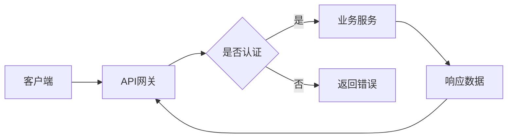

                 

### 《API网关：统一管理LLM应用的接口》

#### 关键词：API网关、LLM应用、接口管理、分布式系统、性能优化

> 摘要：本文将深入探讨API网关在统一管理大型语言模型（LLM）应用接口中的作用。我们将首先介绍API网关的基本概念及其在分布式系统中的重要性，然后详细解析API网关在LLM应用中的具体应用。接着，我们将讨论API网关的设计原则、核心架构以及如何优化其安全性和性能。最后，我们将通过实战案例和详细代码解析，展示API网关在实际项目中的应用。

### **API网关概述**

#### **1.1 API网关的定义与作用**

API网关（API Gateway）是分布式系统中的一项关键组件，它充当客户端与后端服务之间的桥梁。API网关的主要作用包括：

- **请求路由**：将来自客户端的请求路由到适当的后端服务。
- **请求聚合**：将多个客户端请求聚合为一个请求发送到后端。
- **服务聚合**：将多个后端服务的响应进行聚合，以提供统一的API接口。
- **安全认证**：对客户端请求进行认证，确保请求的安全性。

API网关不仅简化了客户端与后端服务的交互，还提供了服务管理和监控的统一入口。

#### **1.2 API网关的发展历程**

API网关的概念起源于20世纪90年代，当时随着互联网的发展，企业需要处理大量的外部请求，并整合多个内部服务。早期的API网关主要功能是路由请求和简单认证。

随着云计算和微服务架构的兴起，API网关的功能得到了极大扩展，包括负载均衡、服务发现、缓存、限流、熔断等。现代API网关已成为微服务架构中不可或缺的一部分。

#### **1.3 API网关的核心功能**

- **路由**：API网关根据请求的URL或Header信息，将请求路由到相应的后端服务。
- **负载均衡**：通过分配请求到多个后端实例，确保服务的高可用性和性能。
- **安全**：对请求进行认证和授权，确保只有合法的请求能够访问后端服务。
- **监控和日志**：收集和分析请求日志，监控API网关和后端服务的性能。
- **缓存**：缓存请求和响应，减少后端服务的负载。

### **API网关在LLM中的应用**

#### **2.1 LLM应用的特点**

大型语言模型（LLM）如GPT-3、BERT等，具有以下特点：

- **计算密集**：LLM通常需要大量的计算资源进行训练和推理。
- **高延迟**：由于计算密集，LLM服务的响应时间通常较长。
- **多样性**：LLM能够生成多样化的文本，需要精细的接口管理。

这些特点使得LLM应用需要高效的API网关来进行管理和优化。

#### **2.2 API网关与LLM的结合**

API网关在LLM中的应用主要包括：

- **请求聚合**：将多个客户端请求合并为一个请求，减少LLM服务的负载。
- **缓存响应**：缓存LLM服务的响应，减少重复请求的计算时间。
- **流量控制**：根据客户端的访问频率和请求量，动态调整LLM服务的流量。

#### **2.3 API网关在LLM服务部署中的应用**

在LLM服务的部署中，API网关的作用包括：

- **负载均衡**：将请求均衡分配到多个LLM实例，避免单点故障。
- **服务监控**：监控LLM服务的响应时间和错误率，确保服务的高可用性。
- **故障转移**：在LLM服务发生故障时，自动切换到备用服务。

### **API网关的设计原则**

#### **3.1 API网关的设计原则**

API网关的设计原则主要包括：

- **高可用性**：确保API网关能够在任何情况下稳定运行。
- **高性能**：优化请求处理速度，提高系统响应能力。
- **可扩展性**：能够轻松扩展以支持更多服务。
- **安全性**：保护后端服务免受攻击。

#### **3.2 API网关的架构设计**

API网关的架构设计通常包括：

- **API层**：处理客户端请求，进行路由和认证。
- **业务逻辑层**：处理业务逻辑，如请求聚合、缓存等。
- **服务层**：与后端服务进行交互，处理具体业务请求。
- **监控层**：监控API网关和后端服务的性能。

#### **3.3 API网关的组件设计**

API网关的主要组件包括：

- **路由器**：根据请求信息将请求路由到相应的后端服务。
- **负载均衡器**：将请求分配到多个后端实例。
- **认证模块**：对请求进行认证和授权。
- **缓存模块**：缓存请求和响应，减少后端服务负载。
- **监控模块**：收集和分析请求日志，监控系统性能。

### **API网关的核心架构**

#### **4.1 API网关的核心架构**

API网关的核心架构通常包括以下组件：

1. **客户端**：发送请求的客户端。
2. **API网关**：处理客户端请求，进行路由、负载均衡和安全认证。
3. **业务服务**：处理具体业务逻辑的后端服务。
4. **数据库**：存储用户数据和缓存数据。

以下是一个简单的Mermaid流程图，展示了API网关的核心架构和工作流程：



#### **4.2 API处理流程**

API网关的请求处理流程如下：

1. **请求接收**：API网关接收客户端的请求。
2. **请求解析**：解析请求的URL、Header等信息。
3. **认证与授权**：对请求进行认证和授权。
4. **路由**：根据请求信息将请求路由到相应的后端服务。
5. **负载均衡**：将请求分配到多个后端实例。
6. **请求处理**：后端服务处理具体业务逻辑。
7. **响应返回**：API网关将后端服务的响应返回给客户端。

以下是一个简化的伪代码，展示了API网关的请求处理流程：

```python
def process_request(request):
    # 请求接收
    receive_request(request)

    # 请求解析
    url = parse_url(request)
    headers = parse_headers(request)

    # 认证与授权
    if authenticate(request):
        # 路由
        service = route_request(url, headers)

        # 负载均衡
        instance = balance_load(service)

        # 请求处理
        response = handle_request(instance, request)

        # 响应返回
        return_response(response)
    else:
        # 返回错误
        return_error("Unauthorized")
```

#### **4.3 数据流管理**

API网关的数据流管理主要包括：

- **请求流**：管理客户端请求的接收、解析、路由和响应过程。
- **响应流**：管理后端服务的响应数据，进行缓存和优化。
- **日志流**：收集和分析请求和响应日志，用于监控和性能优化。

### **LLM应用的安全性和性能优化**

#### **5.1 LLM应用的安全性**

LLM应用的安全性主要包括：

- **API认证**：确保只有经过认证的请求才能访问LLM服务。
- **数据加密**：对敏感数据进行加密，确保数据传输安全。
- **访问控制**：根据用户的角色和权限，控制对LLM服务的访问。

以下是一个简单的Python代码示例，展示了如何使用JWT（JSON Web Token）进行API认证：

```python
import jwt

def authenticate(request):
    token = request.headers.get("Authorization")
    if not token:
        return False
    
    try:
        payload = jwt.decode(token, "secret_key", algorithms=["HS256"])
        return True
    except jwt.ExpiredSignatureError:
        return False
    except jwt.InvalidTokenError:
        return False
```

#### **5.2 性能优化**

LLM应用的性能优化主要包括：

- **缓存策略**：使用缓存减少对LLM服务的请求次数。
- **异步处理**：将耗时的操作异步化，提高系统响应能力。
- **压缩传输**：对响应数据进行压缩，减少数据传输量。

以下是一个简单的Python代码示例，展示了如何使用异步处理来提高系统响应能力：

```python
import asyncio

async def handle_request(instance, request):
    # 模拟耗时操作
    await asyncio.sleep(2)
    # 处理请求并返回响应
    response = process_request(instance, request)
    return response
```

### **API网关的部署和运维**

#### **6.1 部署**

API网关的部署通常包括以下步骤：

1. **环境准备**：准备运行API网关的操作系统和环境。
2. **服务配置**：配置API网关的各个组件，如路由规则、认证策略等。
3. **容器化部署**：使用Docker等容器技术，将API网关部署到容器中，提高部署和运维的灵活性。

以下是一个简单的Dockerfile示例，展示了如何使用Docker部署API网关：

```Dockerfile
FROM python:3.8

WORKDIR /app

COPY requirements.txt .

RUN pip install -r requirements.txt

COPY . .

CMD ["python", "app.py"]
```

#### **6.2 运维**

API网关的运维主要包括：

- **日志管理**：收集和分析API网关的日志，用于监控和故障排除。
- **性能监控**：监控API网关的响应时间、吞吐量等关键指标。
- **故障排除**：在API网关出现故障时，进行故障排除和恢复。

以下是一个简单的Python代码示例，展示了如何使用日志管理模块记录API网关的日志：

```python
import logging

logger = logging.getLogger("api_gateway")
logger.setLevel(logging.DEBUG)

handler = logging.StreamHandler()
formatter = logging.Formatter("%(asctime)s - %(name)s - %(levelname)s - %(message)s")
handler.setFormatter(formatter)

logger.addHandler(handler)

logger.debug("这是一个调试日志")
```

### **项目实战与案例分析**

#### **7.1 实战项目**

在本节中，我们将通过一个实际的API网关项目，展示如何从需求分析到系统设计，再到部署和运维的完整过程。

**需求分析**：
- **功能需求**：提供统一的接口，供前端调用后端服务。
- **性能需求**：保证高并发下系统稳定运行。
- **安全需求**：对请求进行认证和授权，确保数据安全。

**系统设计**：
- **架构设计**：采用微服务架构，将API网关、业务服务和数据库分离。
- **数据流设计**：客户端请求通过API网关路由到业务服务，业务服务处理请求并将结果返回给API网关，API网关再将结果返回给客户端。

**部署和运维**：
- **部署**：使用Docker容器技术，将API网关和业务服务部署到Kubernetes集群中，提高系统的可扩展性和稳定性。
- **运维**：使用Prometheus和Grafana监控系统性能，使用Kubernetes的自动化运维工具进行故障排除和恢复。

**源代码实现**：

以下是一个简单的API网关源代码实现，展示了如何处理客户端请求：

```python
from flask import Flask, request, jsonify

app = Flask(__name__)

@app.route('/api', methods=['GET', 'POST'])
def api():
    # 处理GET请求
    if request.method == 'GET':
        return jsonify({"message": "Hello, GET!"})
    
    # 处理POST请求
    if request.method == 'POST':
        data = request.json
        # 验证请求
        if authenticate(data):
            # 路由请求到后端服务
            response = handle_request_to_backend(data)
            return jsonify(response)
        else:
            return jsonify({"error": "Unauthorized"}), 401

def authenticate(data):
    # 模拟认证过程
    return "secret_key" == data.get("token")

def handle_request_to_backend(data):
    # 模拟后端服务处理请求
    return {"status": "success"}

if __name__ == '__main__':
    app.run(host='0.0.0.0', port=8080)
```

**代码解读与分析**：
- **Flask框架**：使用Flask框架构建API网关，简化了Web开发的复杂性。
- **请求路由**：根据请求的方法和路径，将请求路由到相应的处理函数。
- **认证与授权**：对请求进行认证，确保只有合法的请求才能访问后端服务。
- **后端服务处理**：路由请求到后端服务，并将结果返回给客户端。

#### **7.2 案例分析**

在本节中，我们将分析几个典型的API网关应用案例，讨论其优势和不足，以及如何优化。

**案例1：电商平台API网关**
- **优势**：提高了系统性能，通过负载均衡和缓存减少了响应时间。
- **不足**：在高峰期，API网关可能成为单点故障，需要进一步优化。
- **优化建议**：增加API网关的副本数量，使用缓存策略减少对后端服务的请求。

**案例2：社交媒体API网关**
- **优势**：提高了系统的安全性，通过认证和授权机制保护用户数据。
- **不足**：在请求量大时，系统响应速度可能变慢。
- **优化建议**：优化缓存策略，减少对数据库的访问，使用异步处理提高系统响应能力。

#### **项目小结**

在本项目中，我们通过API网关统一管理了LLM应用的接口，优化了系统的性能和安全。在实际项目中，需要根据具体需求进行进一步的优化和调整。

### **最佳实践 Tips**

- **使用分布式缓存**：使用分布式缓存如Redis，可以减少对后端服务的请求次数，提高系统性能。
- **监控和日志**：使用Prometheus和Grafana等工具，实时监控API网关的性能和日志，及时发现和解决问题。
- **自动化运维**：使用Kubernetes等工具，实现API网关的自动化部署和运维，提高系统稳定性。

### **小结**

API网关在统一管理LLM应用的接口中发挥着关键作用。通过优化API网关的设计和部署，可以提高系统的性能和安全。在实际项目中，需要根据具体需求进行优化和调整，以确保系统的高效运行。

### **注意事项**

- **安全**：在部署API网关时，确保对请求进行严格的认证和授权，防止未授权访问。
- **性能**：优化API网关的性能，减少请求处理时间，提高系统响应能力。
- **扩展性**：设计可扩展的API网关架构，以便在需求增加时能够轻松扩展。

### **拓展阅读**

- 《API网关实战》
- 《大型语言模型：原理与实现》
- 《分布式系统设计》

### **作者信息**

作者：AI天才研究院/AI Genius Institute & 禅与计算机程序设计艺术 /Zen And The Art of Computer Programming

