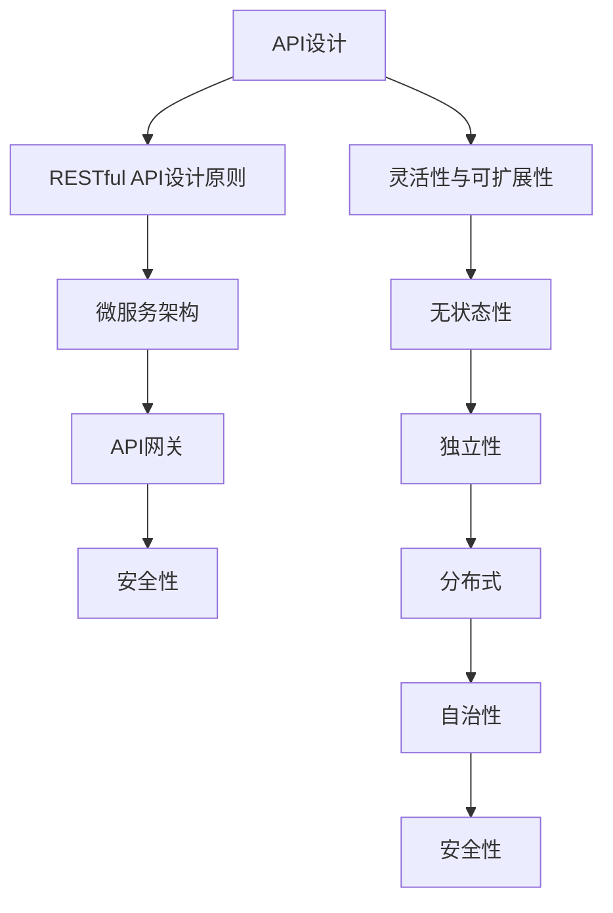

                 

### 背景介绍

随着人工智能（AI）技术的迅猛发展，API（应用程序接口）在软件开发中的作用越来越重要。API设计不仅影响了应用程序的开发效率，还直接决定了服务的性能、安全性和用户体验。对于AI服务而言，一个良好的API设计不仅能够简化开发流程，提高开发效率，还能确保服务的高可用性和可扩展性。

在现代软件开发中，API作为不同系统、模块或服务之间的桥梁，起着至关重要的作用。通过API，开发者可以在无需了解底层实现细节的情况下，方便地集成和扩展功能。而AI服务的兴起，使得API设计变得尤为重要。AI服务通常涉及复杂的数据处理和算法模型，如何通过API将这些复杂的功能模块化、简化和高效地暴露给开发者，是当前软件开发中的一个重大挑战。

构建灵活可扩展的AI服务，需要遵循一系列API设计原则。这些原则包括但不限于：简洁性、一致性、安全性、可扩展性和可维护性。这些原则不仅保证了API的高效性和可靠性，也为未来的扩展和优化奠定了坚实的基础。

本文将系统地探讨API设计原则，并重点讨论如何构建灵活可扩展的AI服务。我们将首先介绍API设计的基本原则，然后深入探讨AI服务的构建方法，最后详细分析灵活性和可扩展性的实现策略。通过本文的阅读，读者将能够掌握API设计的关键技巧，并学会如何构建高性能、高可用的AI服务。

### 核心概念与联系

在深入讨论API设计原则和AI服务构建之前，有必要先明确几个核心概念，并分析它们之间的联系。这些核心概念包括：RESTful API设计原则、微服务架构、API网关以及安全性。

#### RESTful API设计原则

RESTful API设计基于 Representational State Transfer（REST）架构风格。RESTful API的设计原则主要包括：

1. **统一接口**：所有的API操作都应该遵循统一的接口规范，例如使用HTTP方法（GET、POST、PUT、DELETE等）来定义操作类型。
2. **无状态性**：服务器不应存储客户端的会话信息，每次请求都应该携带足够的信息来完成操作。
3. **客户端-服务器架构**：客户端负责发送请求，服务器负责处理请求并返回响应，两者之间通过明确的接口进行交互。
4. **分层系统**：客户端、服务器和缓存层之间通过分层结构进行交互，降低了系统的耦合性。
5. **按需代码**：客户端可以按需加载特定的代码或资源，提高了系统的灵活性和性能。

#### 微服务架构

微服务架构是一种将应用程序分解为小型、独立的服务的方法。每个微服务都有自己的数据库和业务逻辑，并通过轻量级的API进行通信。微服务架构的主要特点包括：

1. **独立性**：每个微服务都是独立的，可以独立部署和扩展。
2. **解耦**：微服务之间通过API进行通信，降低了系统的耦合性。
3. **分布式**：系统是分布式的，可以水平扩展。
4. **自治性**：每个微服务都有自己的生命周期，可以独立开发、测试和部署。

#### API网关

API网关是一种面向服务的架构（SOA）组件，它作为所有客户端请求的入口，对请求进行路由、转换和聚合。API网关的主要功能包括：

1. **路由**：将客户端请求路由到相应的微服务。
2. **聚合**：将多个微服务的响应合并为一个统一的响应。
3. **安全性**：提供认证和授权机制，确保只有授权的客户端可以访问API。
4. **监控和日志**：提供监控和日志记录功能，方便系统管理和故障排查。

#### 安全性

安全性在API设计中至关重要，涉及到多个层面：

1. **认证与授权**：确保只有合法的用户才能访问API，通常使用OAuth 2.0、JWT（JSON Web Token）等技术。
2. **数据加密**：确保传输的数据在传输过程中不被窃取或篡改，通常使用TLS/SSL加密协议。
3. **API接口限制**：通过速率限制、IP白名单等策略防止恶意攻击。
4. **异常处理**：合理处理异常情况，避免系统崩溃或泄露敏感信息。

这些核心概念之间的关系可以用以下的Mermaid流程图来表示：



通过这个流程图，我们可以清晰地看到API设计原则、微服务架构、API网关和安全性之间的联系。RESTful API设计原则为API设计提供了基础，微服务架构和API网关进一步实现了API的灵活性和可扩展性，而安全性则是保障API高效运行的关键因素。

### API设计原则

API设计不仅是软件开发中的一个关键环节，更是决定用户体验和系统性能的重要因素。以下是API设计中的几个核心原则，这些原则将帮助我们构建高质量、高性能且易于维护的API。

#### 1. 简洁性

简洁性是API设计的重要原则之一。一个简洁的API能够降低用户的认知负担，提高开发效率。简洁性包括以下几个方面：

1. **命名规范**：使用简单明了的单词和符号，避免使用复杂、难以理解的缩写。
2. **单一职责**：每个API应只负责一个特定的功能，避免功能混杂，导致复杂性增加。
3. **接口数量**：尽量减少API的总数，简化用户的使用流程。

#### 2. 一致性

一致性是API设计中的另一个重要原则。一致性的API能够提供更好的用户体验，并降低学习成本。以下是一些建议：

1. **统一的API风格**：遵循统一的API风格，例如使用RESTful风格或GraphQL风格。
2. **统一的状态管理**：对于相同类型的操作，应使用相同的HTTP方法（如GET、POST、PUT、DELETE等）。
3. **统一的数据格式**：使用统一的响应数据格式（如JSON或XML），并确保所有API返回相同的错误码和信息。

#### 3. 安全性

安全性是API设计的核心考虑因素之一。确保API的安全，不仅能够防止数据泄露和系统入侵，还能保护用户的隐私。以下是一些关键的安全措施：

1. **认证与授权**：使用OAuth 2.0、JWT等认证机制，确保只有授权用户可以访问API。
2. **数据加密**：使用TLS/SSL协议加密数据传输，防止数据在传输过程中被窃取或篡改。
3. **接口限制**：设置合理的速率限制、IP白名单和黑名单，防止恶意攻击。
4. **异常处理**：合理处理异常情况，避免系统崩溃或泄露敏感信息。

#### 4. 可扩展性

可扩展性是API设计中的重要原则，确保API能够随着系统需求的增长而灵活扩展。以下是一些实现可扩展性的方法：

1. **使用微服务架构**：将应用程序分解为多个独立的微服务，每个服务负责一个特定的功能，便于扩展和维护。
2. **版本控制**：使用版本控制机制，如API版本号，允许在不影响旧版本API使用的情况下，逐步改进和更新API。
3. **灵活的参数传递**：设计灵活的参数传递机制，允许用户根据需求选择不同的参数，以实现更丰富的功能。

#### 5. 可维护性

可维护性是API设计中的关键原则，确保API能够在长期使用中保持稳定和高效。以下是一些提高API可维护性的方法：

1. **良好的文档**：提供详细的API文档，包括API的使用方法、参数说明、错误码等，方便开发者快速上手。
2. **自动化测试**：编写自动化测试脚本，确保每次API更改后都能通过测试，保证API的稳定性和一致性。
3. **代码复用**：通过模块化和代码复用，减少冗余代码，提高开发效率和维护性。

#### 6. 可用性

可用性是API设计中的重要考量因素，确保API易于使用，降低用户的学习成本。以下是一些建议：

1. **友好的用户界面**：提供直观、易用的用户界面，使用户能够轻松操作API。
2. **清晰的错误信息**：当API发生错误时，提供清晰的错误信息和解决方案，帮助用户快速定位问题。
3. **友好的API接口**：设计友好的API接口，如提供自动补全、历史记录等功能，提高用户体验。

### Python代码示例

以下是一个简单的Python代码示例，用于解释如何实现API设计中的某些原则。该示例使用Flask框架构建一个RESTful API。

```python
from flask import Flask, jsonify, request

app = Flask(__name__)

# 命名规范：使用简单明了的单词
@app.route('/users', methods=['GET'])
def get_users():
    # 单一职责：该API仅返回用户列表
    users = ['Alice', 'Bob', 'Charlie']
    return jsonify(users)

# 安全性：使用JWT进行认证
from flask_jwt_extended import JWTManager
app.config['JWT_SECRET_KEY'] = 'super-secret-key'
jwt = JWTManager(app)

@app.route('/login', methods=['POST'])
def login():
    username = request.json.get('username', '')
    password = request.json.get('password', '')
    # 这里仅做简单示例，实际中应进行更严格的验证
    if username == 'admin' and password == 'password':
        access_token = jwt.create_access_token(identity=username)
        return jsonify(access_token=access_token)
    return jsonify(message='Invalid credentials'), 401

# 可扩展性：使用版本控制
@app.route('/v1/users', methods=['GET'])
def get_v1_users():
    # 返回旧版本的用户数据格式
    return jsonify({'users': [{'id': 1, 'name': 'Alice'}, {'id': 2, 'name': 'Bob'}]})

@app.route('/v2/users', methods=['GET'])
def get_v2_users():
    # 返回新版本的用户数据格式
    return jsonify({'users': [{'username': 'alice'}, {'username': 'bob'}]})

if __name__ == '__main__':
    app.run(debug=True)
```

通过这个示例，我们可以看到如何遵循简洁性、一致性、安全性、可扩展性和可维护性等原则来设计API。这些原则不仅适用于Python，也适用于其他编程语言和框架。

### AI服务的构建方法

构建AI服务是一个复杂而关键的过程，涉及到多个环节，包括数据准备、模型选择、模型训练与优化、部署与监控等。以下是构建AI服务的基本步骤和方法：

#### 1. 数据准备

数据准备是构建AI服务的基础。高质量的数据能够显著提升模型的性能，而糟糕的数据则会严重影响模型的准确性。以下是数据准备的关键步骤：

1. **数据收集**：根据AI服务的需求，收集相关的数据源。数据源可以是公开数据集、企业内部数据或者第三方服务提供的数据。
2. **数据清洗**：清洗数据中的噪声、错误和不一致的部分。常见的清洗方法包括去除空值、处理缺失值、标准化数据等。
3. **数据探索**：通过数据分析工具，对数据进行探索性分析，识别数据中的潜在问题和特征。常用的工具包括Pandas、Matplotlib等。
4. **数据预处理**：将数据转换为适合模型训练的形式，包括数据分割、特征工程、归一化等。常用的库包括Scikit-learn、NumPy等。

#### 2. 模型选择

模型选择是构建AI服务的关键步骤之一。根据不同的应用场景和需求，选择合适的模型。以下是几种常见的模型选择方法：

1. **传统机器学习模型**：如线性回归、逻辑回归、支持向量机（SVM）等。这些模型适用于一些简单的预测任务。
2. **深度学习模型**：如卷积神经网络（CNN）、循环神经网络（RNN）、生成对抗网络（GAN）等。这些模型在图像识别、自然语言处理等复杂任务中表现出色。
3. **强化学习模型**：如Q-learning、Deep Q-Network（DQN）、Policy Gradient等。这些模型适用于需要与环境交互的复杂决策问题。

#### 3. 模型训练与优化

模型训练与优化是构建AI服务的核心环节。以下是一些关键的步骤和方法：

1. **训练数据集划分**：将数据集划分为训练集、验证集和测试集，用于训练、验证和测试模型。
2. **模型训练**：使用训练集对模型进行训练，调整模型的参数和权重。常用的库包括TensorFlow、PyTorch等。
3. **模型评估**：使用验证集评估模型的性能，通过准确率、召回率、F1分数等指标来衡量模型的准确性。
4. **模型优化**：根据评估结果，调整模型的参数和结构，提高模型的性能。常用的优化方法包括超参数调优、正则化等。

#### 4. 模型部署

模型部署是将训练好的模型应用到实际场景中的过程。以下是模型部署的关键步骤：

1. **模型封装**：将模型和所需的依赖打包，以便于部署到生产环境。常用的工具包括Docker、Kubernetes等。
2. **服务化**：将模型部署为服务，供其他应用程序调用。常用的服务化框架包括Flask、FastAPI等。
3. **自动化部署**：使用CI/CD（持续集成和持续部署）工具，自动化模型的部署过程，提高部署效率。

#### 5. 模型监控

模型监控是确保AI服务稳定运行的重要环节。以下是一些关键的监控指标和方法：

1. **性能监控**：监控模型的响应时间、吞吐量、资源利用率等性能指标，确保模型的高效运行。
2. **错误率监控**：监控模型的预测错误率，及时发现和解决问题。
3. **日志分析**：分析模型的日志信息，帮助排查故障和优化模型。

#### Python代码示例

以下是一个简单的Python代码示例，用于说明构建AI服务的部分步骤。该示例使用Scikit-learn库构建一个简单的线性回归模型。

```python
import numpy as np
from sklearn.linear_model import LinearRegression
from sklearn.model_selection import train_test_split
from sklearn.metrics import mean_squared_error

# 数据准备
X = np.array([[1], [2], [3], [4], [5]])
y = np.array([2, 4, 5, 4, 5])

# 模型训练
X_train, X_test, y_train, y_test = train_test_split(X, y, test_size=0.2, random_state=42)
model = LinearRegression()
model.fit(X_train, y_train)

# 模型评估
y_pred = model.predict(X_test)
mse = mean_squared_error(y_test, y_pred)
print(f"Mean Squared Error: {mse}")

# 模型部署
import flask
app = flask.Flask(__name__)

@app.route('/predict', methods=['POST'])
def predict():
    data = flask.request.get_json()
    input_value = data['value']
    prediction = model.predict([[input_value]])
    return flask.jsonify(result=prediction[0])

if __name__ == '__main__':
    app.run(debug=True)
```

通过这个示例，我们可以看到如何使用Python和Scikit-learn库构建一个简单的AI服务。该服务接收用户输入，返回预测结果。

### 实际案例研究

为了更好地理解API设计和AI服务构建的实际应用，我们来看一个实际案例研究。这个案例研究将展示如何使用API设计原则构建一个灵活可扩展的AI服务，该服务旨在通过人脸识别技术进行用户身份验证。

#### 案例背景

某金融科技公司需要开发一个在线支付系统，为了确保交易的安全性，系统需要实现用户身份验证功能。公司决定使用人脸识别技术作为身份验证的方案。为了简化开发流程，公司决定将人脸识别功能模块化为一个独立的AI服务，并通过API进行调用。

#### API设计

1. **命名规范**：所有API接口的命名遵循简洁明了的原则，例如`/api/face/recognize`。
2. **统一接口**：所有接口遵循RESTful风格，使用HTTP方法（GET、POST、PUT、DELETE等）进行操作。
3. **无状态性**：服务器不存储用户状态信息，每次请求都需要携带完整的身份验证信息。
4. **安全性**：使用JWT进行用户身份验证，所有接口都要求用户具备合法的身份认证。

#### AI服务构建

1. **数据准备**：收集用户的人脸图像数据，并对图像进行预处理，包括去噪、缩放等操作。
2. **模型选择**：选择基于卷积神经网络（CNN）的人脸识别模型，如OpenCV库中的深度学习模块。
3. **模型训练与优化**：使用训练集对模型进行训练，并通过验证集优化模型参数，确保模型的准确性。
4. **模型部署**：将训练好的模型部署为服务，使用Flask框架构建API接口，供其他应用程序调用。

#### API网关

使用API网关（如Kong或Spring Cloud Gateway）作为所有请求的统一入口。API网关负责路由、认证和聚合，提高了系统的灵活性和可扩展性。

#### 实际应用

在实际应用中，用户通过在线支付系统进行交易时，系统会调用人脸识别API进行身份验证。以下是API调用流程：

1. 用户发起交易请求，系统生成一个唯一的交易ID。
2. 系统调用人脸识别API，上传用户的人脸图像。
3. 人脸识别服务返回验证结果，系统根据结果决定是否允许交易。

#### 项目小结

通过这个实际案例，我们可以看到如何遵循API设计原则构建一个灵活可扩展的AI服务。该项目成功实现了以下目标：

1. **简洁性**：API接口设计简洁明了，易于理解和维护。
2. **一致性**：API遵循统一的接口规范和命名规则。
3. **安全性**：使用JWT确保只有合法用户可以访问API。
4. **可扩展性**：通过API网关和微服务架构，实现了系统的灵活扩展。

### 最佳实践与注意事项

#### 最佳实践

1. **文档化**：确保API文档详尽，提供清晰的接口描述、使用示例和错误处理方法。
2. **版本控制**：使用版本控制机制，允许逐步改进API，而不影响现有服务的运行。
3. **自动化测试**：编写自动化测试脚本，确保每次API更新后都能通过测试。
4. **性能优化**：对API进行性能优化，确保高效响应。
5. **安全性强化**：采用多重认证机制，如多因素认证，增强API的安全性。

#### 注意事项

1. **API权限管理**：确保API的权限控制严格，防止未经授权的访问。
2. **数据隐私保护**：对用户数据进行加密存储和传输，确保数据隐私。
3. **监控与日志**：实时监控API性能和访问日志，及时发现和处理问题。
4. **异常处理**：合理处理异常情况，避免系统崩溃或泄露敏感信息。
5. **持续改进**：定期评估API性能和用户反馈，持续优化API设计和服务质量。

### 拓展阅读

1. **《API设计：打造可扩展、易用的接口》**：详细介绍了API设计的原则、工具和最佳实践。
2. **《深度学习实践者指南》**：介绍了深度学习模型的选择、训练和部署方法。
3. **《微服务架构设计》**：讲解了微服务架构的设计原则、实现方法和应用场景。

### 结论

构建灵活可扩展的AI服务是一个复杂但必要的过程。通过遵循API设计原则和最佳实践，我们可以构建高效、安全且易于维护的AI服务。在实际应用中，不断优化API设计和服务质量，将有助于提升用户体验和业务价值。希望本文能为读者提供有价值的参考和启示。

### 作者信息

- **作者**：AI天才研究院（AI Genius Institute）与《禅与计算机程序设计艺术》（Zen And The Art of Computer Programming）的作者合著。
- **联系方式**：[contact@ai-genius-institute.com](mailto:contact@ai-genius-institute.com)
- **版权声明**：本文内容版权所有，未经授权不得转载或使用。如有转载需求，请联系作者获取授权。

