                 

## AR/VR技术：增强LLM应用的交互体验

### 关键词
- AR/VR技术
- LLM应用
- 交互体验
- 增强现实
- 虚拟现实
- 人机交互

### 摘要
本文深入探讨了AR/VR技术与LLM（大型语言模型）相结合的潜力，旨在分析如何利用AR/VR技术来增强LLM应用的交互体验。文章首先介绍了AR/VR技术的基本概念和历史发展，然后详细阐述了LLM的原理和其在不同领域的应用。接下来，文章通过具体的实例和流程图，探讨了AR/VR与LLM之间的核心概念联系，并使用Python源代码详细展示了核心算法原理。文章随后介绍了数学模型和公式，并通过实例进行了解释。文章的第三部分展示了AR/VR与LLM融合应用的实际案例，并进行了深入的分析和解读。最后，文章总结了最佳实践，并提供了进一步阅读的推荐资源。

## 引言

随着技术的不断进步，虚拟现实（VR）和增强现实（AR）逐渐成为人们日常生活中不可或缺的一部分。这两项技术通过融合现实与虚拟世界，为用户提供了全新的互动体验。与此同时，大型语言模型（LLM）作为一种先进的自然语言处理技术，也在各个领域中展现了其强大的能力。LLM通过学习和理解大量的语言数据，可以生成高质量的自然语言文本，进行智能对话，辅助决策等。

本文的目标是探讨如何利用AR/VR技术来增强LLM应用的交互体验。具体而言，我们将首先介绍AR/VR技术的基本概念和历史发展，然后深入分析LLM的原理和应用。随后，我们将通过具体的实例和流程图，探讨AR/VR与LLM之间的核心概念联系。接下来，我们将使用Python源代码详细展示核心算法原理，并结合数学模型和公式进行讲解。文章的第三部分将展示AR/VR与LLM融合应用的实际案例，并进行深入的分析和解读。最后，我们将总结最佳实践，并提供进一步阅读的推荐资源。

通过本文的探讨，我们希望能够为读者提供一个全面而深入的理解，帮助他们在实际应用中充分利用AR/VR技术与LLM的结合，创造出更加丰富和互动的交互体验。

### AR/VR技术概述

#### 基本概念

虚拟现实（Virtual Reality，VR）和增强现实（Augmented Reality，AR）是两种通过技术手段改变用户感知体验的虚拟现实技术。

**虚拟现实（VR）**：VR技术通过计算机生成一个完全虚拟的三维环境，使用户能够沉浸其中。VR设备通常包括头戴式显示器（HMD）、立体声音响系统、跟踪设备等，这些设备共同作用于用户的视觉、听觉和触觉感官，使体验者感觉自己置身于一个虚拟世界中。

**增强现实（AR）**：与VR不同，AR技术通过将虚拟元素叠加到现实世界中，增强用户的感知体验。AR设备如智能手机或智能眼镜，通过摄像头捕捉现实世界的图像，并在屏幕上叠加虚拟图像或信息，使用户能够同时看到虚拟和现实的内容。

#### 历史发展

VR技术的发展可以追溯到20世纪60年代，当时美国计算机科学家伊凡·苏瑟兰（Ivan Sutherland）发明了世界上第一个头戴式显示器。然而，由于高昂的成本和复杂的硬件要求，VR技术在过去很长一段时间内仅限于学术和军事领域。

随着计算机技术和显示技术的进步，VR在20世纪90年代迎来了第一次热潮。然而，由于内容匮乏和技术限制，VR再次进入低谷。直到21世纪初，随着图形处理能力和传感器技术的提升，VR技术才逐渐回到人们的视野。

AR技术的发展则可以追溯到20世纪60年代，当时波音公司的研究人员发明了世界上第一个AR系统。然而，由于硬件和软件的限制，AR技术长期以来一直未能广泛应用。直到智能手机和移动互联网的发展，AR技术才开始在消费市场上获得关注。

#### 分类与应用领域

**VR技术的分类与应用领域**：

1. **沉浸式VR**：通过虚拟环境完全隔离现实世界，为用户提供沉浸式的体验。应用领域包括游戏、教育、医疗和军事模拟等。
2. **交互式VR**：用户可以通过操作虚拟环境中的对象来进行交互。应用领域包括虚拟现实会议、在线购物和虚拟旅游等。
3. **辅助性VR**：在现实世界中添加虚拟辅助信息，以提高工作效率。应用领域包括工业设计、维修指导和灾难救援等。

**AR技术的分类与应用领域**：

1. **信息增强AR**：在现实世界中叠加文本、图像、视频等信息。应用领域包括导航、教育、广告和维修手册等。
2. **交互增强AR**：用户可以通过手势或语音与虚拟对象进行交互。应用领域包括游戏、社交和智能家居等。
3. **辅助增强AR**：利用AR技术辅助现实世界中的操作和任务。应用领域包括医疗诊断、维修指导和无人机导航等。

#### 关键技术

**VR技术的关键技术**：

1. **显示技术**：头戴式显示器（HMD）的分辨率、视场角和刷新率对用户体验至关重要。
2. **跟踪技术**：通过摄像头和传感器跟踪用户的位置和动作，实现沉浸式体验。
3. **交互技术**：手势识别、语音控制和虚拟键盘等交互方式，使得用户能够更自然地与虚拟环境互动。

**AR技术的关键技术**：

1. **渲染技术**：将虚拟元素叠加到现实世界中，需要高精度的图像识别和渲染技术。
2. **定位技术**：通过摄像头和传感器确定虚拟元素在现实世界中的位置和方向。
3. **交互技术**：手势识别、语音控制和触摸屏等交互方式，使虚拟元素与现实世界互动更加自然。

#### AR/VR技术的核心概念与联系

为了更好地理解AR/VR技术的核心概念及其相互联系，我们可以使用Mermaid流程图来展示它们之间的关系。

```mermaid
graph TD
    A[AR技术] --> B[显示技术]
    A --> C[渲染技术]
    A --> D[定位技术]
    A --> E[交互技术]
    B --> F[HMD分辨率]
    B --> G[视场角]
    B --> H[刷新率]
    C --> I[图像识别]
    C --> J[3D渲染]
    D --> K[摄像头跟踪]
    D --> L[传感器定位]
    E --> M[手势识别]
    E --> N[语音控制]
    E --> O[触摸屏交互]
    F --> P[高分辨率]
    F --> Q[宽视场角]
    F --> R[高刷新率]
    G --> S[视野扩大]
    G --> T[视角调整]
    G --> U[动态调整]
    H --> V[响应速度]
    H --> W[流畅性]
    H --> X[延迟降低]
    I --> Y[精确度]
    I --> Z[实时性]
    J --> AA[视觉效果]
    J --> BB[渲染效率]
    K --> CC[准确性]
    K --> DD[实时性]
    L --> EE[定位精度]
    L --> FF[环境适应性]
    M --> GG[自然性]
    M --> HH[识别准确性]
    N --> II[理解能力]
    N --> JJ[响应速度]
    O --> KK[交互便捷性]
    O --> LL[操作准确性]
    P --> MM[图像清晰度]
    P --> NN[细节还原]
    Q --> OO[视野广度]
    Q --> PP[视角舒适度]
    R --> QQ[画面流畅]
    R --> RR[视觉体验]
    S --> SS[视野增强]
    S --> TT[视角扩展]
    U --> UU[动态适应]
    V --> VV[响应快]
    W --> WW[流畅度高]
    X --> XX[延迟低]
    Y --> YY[识别准]
    Z --> ZZ[实时性强]
    AA --> AAA[视觉冲击]
    BB --> BBB[渲染效率高]
    CC --> CCC[跟踪准]
    DD --> DDD[跟踪实时]
    EE --> EEE[定位精]
    FF --> FFF[适应性强]
    GG --> GGG[自然互动]
    HH --> HHH[识别准]
    II --> III[理解深]
    JJ --> JJJ[响应快]
    KK --> KKK[操作便捷]
    LL --> LLL[准确操作]
    MM --> MMM[图像清晰]
    NN --> NNN[细节还原好]
    OO --> OOO[视野宽]
    PP --> PPP[视角舒适]
    QQ --> QQ[画面流畅]
    RR --> RRR[视觉体验佳]
    SS --> SSS[视野扩]
    TT --> TTT[视角展]
    UU --> UUU[动态适应强]
    VV --> VVV[响应迅速]
    WW --> WWW[流畅度高]
    XX --> XXX[延迟短]
    YY --> YYY[识别精确]
    ZZ --> ZZZ[实时性佳]
    AAA --> AAAA[沉浸感强]
    BBB --> BBBB[渲染高效]
    CCC --> CCCA[跟踪精准]
    DDD --> DDDA[跟踪实时性]
    EEE --> EEEA[定位精度高]
    FFF --> FFFA[适应性强]
    GGG --> GGGG[自然互动佳]
    HHH --> HHHH[识别准确]
    III --> IIII[理解深刻]
    JJJ --> JJJJ[响应迅速]
    KKK --> KKKK[操作便捷]
    LLL --> LLLL[操作准确]
    MMM --> MMMM[图像清晰度高]
    NNN --> NNNN[细节还原好]
    OOO --> OOOO[视野广度大]
    PPP --> PPPP[视角舒适度好]
    QQ --> QQ[画面流畅度佳]
    RRR --> RRRR[视觉体验好]
    SSS --> SSSS[视野增强效果]
    TTT --> TTTT[视角扩展效果好]
    UUU --> UUUU[动态适应效果佳]
    VVV --> VVVV[响应速度快速]
    WWW --> WWWW[流畅度高]
    XXX --> XXXX[延迟低]
    YYY --> YYY[识别精确度高]
    ZZZ --> ZZZZ[实时性强]
    AAAA --> AAAAA[沉浸感强烈]
```



通过上述Mermaid流程图，我们可以清晰地看到AR/VR技术的核心概念及其相互关系。显示技术、渲染技术、定位技术和交互技术构成了AR/VR技术的基础，而每一个核心概念又包含了一系列相关的性能指标和效果评估。这些技术之间的相互作用，共同决定了AR/VR应用的最终用户体验。

### LLM技术概述

#### 定义与特点

大型语言模型（Large Language Model，LLM）是一种基于深度学习技术的自然语言处理模型，能够理解和生成人类语言。LLM的核心特点是拥有海量的训练数据和强大的计算能力，这使得它们能够生成高质量的自然语言文本，进行智能对话，并辅助人类进行各种任务。

LLM的基本结构通常包括多层神经网络，每层都能够对输入数据进行处理和转换，从而提取出不同层次的特征。通过反向传播算法和优化技术，LLM能够在大量数据上进行训练，不断调整模型参数，以达到最佳性能。

#### 发展历程

LLM的发展历程可以分为几个关键阶段：

1. **早期模型**：20世纪80年代和90年代，研究人员开始探索基于统计方法的自然语言处理技术，如隐马尔可夫模型（HMM）和决策树。这些模型虽然能够处理一些简单的语言任务，但受限于计算资源和数据量。

2. **神经网络模型**：21世纪初，随着深度学习技术的兴起，研究人员开始使用多层感知机（MLP）和循环神经网络（RNN）来处理自然语言。这些模型能够通过学习大量文本数据来提取语义特征，但训练时间和计算资源需求较高。

3. **大型模型时代**：2018年，谷歌推出了Transformer模型，标志着LLM进入了一个新的阶段。Transformer模型采用自注意力机制，能够在处理长文本时保持更好的性能和稳定性。此后，研究人员不断优化模型结构和训练方法，使得LLM的规模和性能得到了显著提升。

4. **涌现性能力**：近年来，随着LLM的规模不断扩大，一些模型开始展现出前所未有的能力，如生成高质量的文本、进行复杂推理和模仿人类对话。这些能力使得LLM在各个领域都取得了显著的进展。

#### 应用场景

LLM在各个领域都有广泛的应用，以下是几个典型的应用场景：

1. **文本生成**：LLM能够生成各种类型的文本，如文章、新闻、广告和社交媒体内容。通过训练，LLM可以模仿特定风格和语言特点，从而生成高质量的文本。

2. **智能对话**：LLM可以作为聊天机器人或虚拟助手的内核，与用户进行自然语言交互。LLM可以理解用户的输入，生成有意义的回答，并根据上下文进行对话。

3. **机器翻译**：LLM在机器翻译领域也取得了显著进展。通过训练大型双语语料库，LLM能够实现高精度的文本翻译，并支持多种语言之间的翻译。

4. **文本分类**：LLM可以用于文本分类任务，如情感分析、主题检测和垃圾邮件过滤。通过学习大量标注数据，LLM能够准确分类不同类型的文本。

5. **问答系统**：LLM可以构建问答系统，回答用户提出的问题。通过理解用户的问题和大量的知识库，LLM能够提供准确和相关的答案。

6. **辅助写作**：LLM可以辅助人类进行写作，如提供写作建议、修改错误和生成摘要。通过训练，LLM可以学习不同写作风格和语言习惯，从而提高写作质量。

#### 关键技术

LLM的关键技术包括：

1. **模型架构**：Transformer模型是目前最常用的LLM架构，其自注意力机制能够有效处理长文本。

2. **预训练与微调**：LLM通常采用预训练和微调的方法。预训练使用大量未标注的文本数据，使得模型具有强大的通用语言理解能力。微调则使用特定任务的数据，对模型进行精细调整，以适应特定应用场景。

3. **数据预处理**：数据预处理是LLM训练的重要环节，包括文本清洗、分词、词嵌入等步骤。良好的数据预处理能够提高模型训练效率和性能。

4. **优化技术**：为了提高模型训练效率和性能，研究人员提出了多种优化技术，如混合精度训练、并行计算和分布式训练等。

5. **评估与测试**：评估与测试是验证LLM性能的重要步骤。常用的评估指标包括准确率、召回率、F1分数等。此外，通过人工审查和用户反馈，可以进一步评估LLM在实际应用中的表现。

#### 关键概念与联系

为了更好地理解LLM的关键概念及其相互联系，我们可以使用Mermaid流程图来展示它们之间的关系。

```mermaid
graph TD
    A[定义与特点] --> B[结构模型]
    A --> C[预训练与微调]
    A --> D[数据预处理]
    A --> E[优化技术]
    A --> F[评估与测试]
    B --> G[神经网络结构]
    B --> H[自注意力机制]
    B --> I[多层神经网络]
    C --> J[大规模数据集]
    C --> K[任务特定数据]
    D --> L[文本清洗]
    D --> M[分词]
    D --> N[词嵌入]
    E --> O[混合精度训练]
    E --> P[并行计算]
    E --> Q[分布式训练]
    F --> R[准确率]
    F --> S[召回率]
    F --> T[F1分数]
    G --> U[感知机]
    G --> V[循环神经网络]
    G --> W[Transformer]
    G --> X[多层感知机]
    H --> Y[自注意力]
    H --> Z[位置编码]
    H --> AA[多头注意力]
    I --> BB[隐藏层]
    I --> CC[激活函数]
    I --> DD[权重矩阵]
    J --> EE[通用数据集]
    J --> FF[特定领域数据]
    K --> GG[预训练数据]
    K --> HH[微调数据]
    L --> II[去除噪音]
    L --> JJ[标准化]
    L --> KK[去重]
    M --> LL[分词器]
    M --> MM[词表]
    M --> NN[词向量]
    N --> OO[词嵌入技术]
    N --> PP[词向量空间]
    O --> QQ[低精度运算]
    O --> RR[高精度运算]
    P --> SS[数据并行]
    P --> TT[模型并行]
    Q --> UU[分布式存储]
    Q --> VV[负载均衡]
    R --> WW[精确度]
    R --> XX[可靠性]
    S --> YY[综合评价]
    T --> ZZ[全面评估]
    U --> AAA[基础结构]
    V --> BBB[动态特性]
    W --> CCC[全局特性]
    X --> DDD[复杂度]
    Y --> EEE[注意力机制]
    Z --> FFF[信息传递]
    AA --> GGG[并行处理]
    BB --> HHH[多层特性]
    CC --> III[非线性变换]
    DD --> JJ[参数调整]
    EE --> KKK[集中化处理]
    FF --> LLL[全局优化]
    GGG --> MMM[效率提升]
    HHH --> NNN[稳定性]
    III --> OOO[功能扩展]
    JJ --> PPP[训练优化]
    KKK --> QQQ[优化速度]
    LLL --> RRR[应用广泛]
    MMM --> SSS[资源利用]
    NNN --> TTT[可靠性提升]
    OOO --> UUU[模型精度]
    PPP --> VVV[训练效率]
    QQQ --> WWW[并行计算]
    RRR --> XXX[应用效果]
    SSS --> YYY[性能提升]
    TTT --> ZZZ[稳定性增强]
```



通过上述Mermaid流程图，我们可以清晰地看到LLM的关键概念及其相互关系。定义与特点、结构模型、预训练与微调、数据预处理、优化技术和评估与测试构成了LLM的核心组成部分，而这些概念之间的相互作用，共同决定了LLM的最终性能和应用效果。

### AR/VR技术与LLM技术的融合应用

#### 核心概念联系

为了更好地理解AR/VR技术与LLM技术的融合应用，我们可以通过一个具体的实例来展示它们之间的核心概念联系。

假设我们开发一个基于AR技术的智能导游系统，用户可以通过AR眼镜查看现实世界中的景点信息。这个系统需要结合AR技术和LLM技术来实现以下功能：

1. **实时定位与渲染**：AR技术通过摄像头和传感器获取用户周围环境的三维信息，并使用渲染技术将虚拟信息叠加到现实场景中。
2. **自然语言交互**：LLM技术通过自然语言处理，理解用户的查询并生成相应的回答。
3. **内容生成与更新**：LLM技术可以根据用户的反馈和查询历史，生成个性化的内容推荐。

这些功能之间的核心概念联系可以用以下Mermaid流程图来展示：

```mermaid
graph TD
    A[AR技术] --> B[实时定位与渲染]
    B --> C[摄像头传感器]
    B --> D[渲染技术]
    A --> E[LLM技术]
    E --> F[自然语言交互]
    E --> G[内容生成与更新]
    E --> H[查询处理]
    F --> I[语音识别]
    F --> J[文本生成]
    G --> K[个性化推荐]
    G --> L[内容更新]
    H --> M[用户查询]
    H --> N[语义理解]
    C --> O[环境信息]
    D --> P[虚拟信息]
    O --> Q[实时数据]
    P --> R[叠加效果]
    I --> S[语音识别结果]
    J --> T[生成文本]
    K --> U[推荐内容]
    L --> V[更新内容]
    N --> W[语义理解结果]
    M --> X[查询数据]
    O --> Y[位置信息]
    P --> Z[信息展示]
    Q --> AA[实时更新]
    R --> BB[视觉体验]
    S --> CC[识别准确度]
    T --> DD[文本质量]
    U --> EE[推荐相关度]
    V --> FF[内容新鲜度]
    W --> GG[理解深度]
    X --> HH[查询需求]
    Y --> II[定位精度]
    Z --> JJ[信息显示效果]
    AA --> KK[实时性]
    BB --> LL[视觉体验]
    CC --> MM[语音识别准确]
    DD --> NN[文本生成质量]
    EE --> OO[推荐效果]
    FF --> PP[内容更新频率]
    GG --> QQ[语义理解深度]
    HH --> RR[用户需求]
    II --> SS[定位准确度]
    JJ --> TT[信息展示效果]
    KK --> UU[实时性提升]
    LL --> VV[视觉体验增强]
    MM --> WW[语音识别准确度]
    NN --> XX[文本生成质量]
    OO --> YY[推荐相关度]
    PP --> ZZ[内容更新频率]
    QQ --> AAA[语义理解深度]
    RR --> BBB[用户需求满足]
    SS --> CCC[定位精度]
    TT --> DDD[信息展示效果]
    UU --> EEE[实时性提升]
    VV --> FFF[视觉体验增强]
    WW --> GGG[语音识别准确度]
    XX --> HHH[文本生成质量]
    YY --> III[推荐相关度]
    ZZ --> JJJ[内容更新频率]
    AAA --> KKK[语义理解深度]
    BBB --> LLL[用户需求满足]
    CCC --> MMM[定位精度]
    DDD --> NNN[信息展示效果]
    EEE --> OOO[实时性提升]
    FFF --> PPP[视觉体验增强]
    GGG --> QQQ[语音识别准确度]
    HHH --> RRR[文本生成质量]
    III -> SSS[推荐相关度]
    JJJ -> TTT[内容更新频率]
    KKK -> UUU[语义理解深度]
    LLL -> VVV[用户需求满足]
    MMM -> WWW[定位精度]
    NNN -> XXX[信息展示效果]
    OOO -> YYY[实时性提升]
    PPP -> ZZZ[视觉体验增强]
    QQQ -> AAAA[语音识别准确度]
    RRR -> BBBB[文本生成质量]
    SSS -> CCC[推荐相关度]
    TTT -> DDDA[内容更新频率]
    UUU -> EEEA[语义理解深度]
    VVV -> FFFA[用户需求满足]
    WWW -> GGGA[定位精度]
    XXX -> HHHH[信息展示效果]
    YYY -> IIII[实时性提升]
    ZZZ -> JJJJ[视觉体验增强]
    AAAA -> KKKK[语音识别准确度]
    BBBB -> LLLL[文本生成质量]
    CCCC -> MMMM[推荐相关度]
    DDDA -> NNNN[内容更新频率]
    EEEA -> OOOO[语义理解深度]
    FFFA -> PPPP[用户需求满足]
    GGGA -> QQQQ[定位精度]
    HHHH -> RRRR[信息展示效果]
    IIII -> SSSS[实时性提升]
    JJJJ -> TTTT[视觉体验增强]
    KKKK -> UUUU[语音识别准确度]
    LLLL -> VVVV[文本生成质量]
    MMMM -> WWWW[推荐相关度]
    NNNN -> XXXX[内容更新频率]
    OOOO -> YYYW[语义理解深度]
    PPPP -> ZZZZ[用户需求满足]
    QQQQ -> AAAA[定位精度]
    RRRR -> BBBB[信息展示效果]
    SSSS -> CCC[实时性提升]
    TTTT -> DDD[视觉体验增强]
```

通过上述Mermaid流程图，我们可以清晰地看到AR/VR技术与LLM技术之间的核心概念联系。AR技术的实时定位与渲染功能为用户提供了沉浸式的体验，而LLM技术的自然语言交互、内容生成与更新功能则增强了系统的智能化和个性化。这些技术之间的相互作用，共同决定了系统在现实世界中的应用效果。

### 核心算法原理讲解

为了深入理解AR/VR技术与LLM技术的融合应用，我们需要详细讲解其中的核心算法原理。在这里，我们将以Python源代码为例，结合数学模型和公式，进行详细讲解和通俗易懂的举例说明。

#### AR技术中的关键算法

首先，我们来看AR技术中的一个关键算法——图像识别。图像识别是AR技术实现的核心步骤之一，通过摄像头捕捉现实世界的图像，并识别其中的特定物体或场景。

```python
import cv2
import numpy as np

# 加载预训练的图像识别模型
model = cv2.face.createLBPHFaceRecognizer()

# 加载训练好的模型权重文件
model.read('face_recognition_model.yml')

# 捕获摄像头帧
cap = cv2.VideoCapture(0)

while True:
    ret, frame = cap.read()
    
    if not ret:
        break
    
    # 将图像灰度化
    gray = cv2.cvtColor(frame, cv2.COLOR_BGR2GRAY)
    
    # 使用SVM分类器进行图像识别
    label, confidence = model.predict(gray)
    
    # 在原图上绘制识别框
    cv2.rectangle(frame, (x, y), (x+w, y+h), (0, 0, 255), 2)
    
    # 显示识别结果
    cv2.putText(frame, f'Person {label}: {confidence}', (10, 30), cv2.FONT_HERSHEY_SIMPLEX, 1, (0, 0, 255), 2)
    
    cv2.imshow('Frame', frame)

    if cv2.waitKey(1) & 0xFF == ord('q'):
        break

cap.release()
cv2.destroyAllWindows()
```

在这个示例中，我们使用OpenCV库实现了一个简单的图像识别程序。首先，我们加载预训练的图像识别模型，然后通过摄像头捕获图像帧，并使用SVM分类器进行识别。最后，在原图上绘制识别框并显示识别结果。

数学模型方面，图像识别涉及到特征提取和分类两个步骤。特征提取通常使用哈希函数、SIFT、SURF等方法，而分类则使用支持向量机（SVM）、K最近邻（KNN）等算法。

```python
# 特征提取
def extract_features(image):
    gray = cv2.cvtColor(image, cv2.COLOR_BGR2GRAY)
    features = cv2.xfeatures2d.SIFT_create().detectAndCompute(gray, None)
    return features

# 分类
def classify(image, model):
    features = extract_features(image)
    label, confidence = model.predict(features)
    return label, confidence
```

#### VR技术中的关键算法

接下来，我们来看VR技术中的一个关键算法——三维模型渲染。三维模型渲染是VR体验的核心，通过渲染技术，用户能够看到逼真的三维场景。

```python
import pygame
from pygame.locals import *

# 初始化Pygame
pygame.init()

# 设置屏幕尺寸
screen_width = 800
screen_height = 600
screen = pygame.display.set_mode((screen_width, screen_height))

# 设置标题
pygame.display.set_caption('3D Model Rendering')

# 创建一个立方体
cube_vertices = [
    # x, y, z
    -1, -1, 1,
    1, -1, 1,
    1, 1, 1,
    -1, 1, 1,
    -1, -1, -1,
    1, -1, -1,
    1, 1, -1,
    -1, 1, -1
]

# 立方体的边
cube_edges = [
    (0, 1), (1, 2), (2, 3), (3, 0),
    (4, 5), (5, 6), (6, 7), (7, 4),
    (0, 4), (1, 5), (2, 6), (3, 7)
]

# 立方体的面
cube_faces = [
    (0, 1, 2, 3), (4, 5, 6, 7), (0, 1, 5, 4), (2, 3, 6, 7), (1, 2, 6, 5), (0, 3, 7, 4)
]

# 渲染立方体
def render_cube(vertices, edges, faces, screen):
    projection_matrix = np.array([[1, 0, 0, 0],
                                 [0, 1, 0, 0],
                                 [0, 0, 1, 0],
                                 [0, 0, 0, 1]])

    for face in faces:
        # 计算面的顶点坐标
        p0 = projection_matrix @ np.array([vertices[v] for v in face])
        p1 = projection_matrix @ np.array([vertices[v] for v in face])
        p2 = projection_matrix @ np.array([vertices[v] for v in face])
        
        # 绘制面
        pygame.draw.polygon(screen, (255, 0, 0), [tuple(p0), tuple(p1), tuple(p2)])

# 渲染循环
running = True
while running:
    for event in pygame.event.get():
        if event.type == QUIT:
            running = False
    
    # 填充屏幕背景
    screen.fill((255, 255, 255))
    
    # 渲染立方体
    render_cube(cube_vertices, cube_edges, cube_faces, screen)
    
    # 更新屏幕显示
    pygame.display.update()

# 退出游戏
pygame.quit()
```

在这个示例中，我们使用Pygame库实现了一个简单的三维模型渲染程序。首先，我们创建一个立方体，并定义其顶点、边和面。然后，我们使用透视投影矩阵，将三维坐标转换为二维屏幕坐标，并在屏幕上绘制立方体。

数学模型方面，三维模型渲染涉及到透视投影矩阵和三维坐标变换。透视投影矩阵用于将三维空间中的点映射到二维屏幕上，而三维坐标变换则用于调整模型的位置、方向和大小。

```python
def projection_matrix(focal_length, aspect_ratio, near, far):
    return np.array([[1/focal_length, 0, 0, 0],
                     [0, 1/focal_length, 0, 0],
                     [0, 0, -(far + near) / (far - near), -1],
                     [0, 0, -2 * far * near / (far - near), 0]])

def transform_matrix(translation, rotation):
    rotation_matrix = np.array([[1, 0, 0, 0],
                               [0, np.cos(rotation), -np.sin(rotation), 0],
                               [0, np.sin(rotation), np.cos(rotation), 0],
                               [0, 0, 0, 1]])
    translation_matrix = np.array([[1, 0, 0, translation[0]],
                                  [0, 1, 0, translation[1]],
                                  [0, 0, 1, translation[2]],
                                  [0, 0, 0, 1]])
    return rotation_matrix @ translation_matrix
```

#### LLM技术的核心算法

最后，我们来看LLM技术中的核心算法——自然语言生成。自然语言生成是LLM技术的核心应用之一，通过模型生成高质量的自然语言文本。

```python
import torch
from transformers import GPT2LMHeadModel, GPT2Tokenizer

# 加载预训练的GPT-2模型
tokenizer = GPT2Tokenizer.from_pretrained('gpt2')
model = GPT2LMHeadModel.from_pretrained('gpt2')

# 设置模型为评价模式
model.eval()

# 输入文本
input_text = "The quick brown fox jumps over the lazy dog"

# 将文本转换为模型输入
input_ids = tokenizer.encode(input_text, return_tensors='pt')

# 生成文本
output = model.generate(input_ids, max_length=20, num_return_sequences=5)

# 解码输出文本
generated_texts = [tokenizer.decode(text, skip_special_tokens=True) for text in output]

# 输出生成的文本
for text in generated_texts:
    print(text)
```

在这个示例中，我们使用Hugging Face的Transformers库实现了一个简单的自然语言生成程序。首先，我们加载预训练的GPT-2模型，并将输入文本转换为模型输入。然后，我们使用模型生成文本，并将输出解码为自然语言文本。

数学模型方面，自然语言生成涉及到编码器和解码器。编码器将输入文本转换为隐藏状态，而解码器则将隐藏状态转换为输出文本。

```python
# 编码器
def encode_text(text, tokenizer):
    return tokenizer.encode(text, return_tensors='pt')

# 解码器
def decode_text(tokens, tokenizer):
    return tokenizer.decode(tokens, skip_special_tokens=True)
```

通过上述Python示例，我们可以清晰地看到AR/VR技术和LLM技术中的核心算法原理。这些算法的实现和数学模型不仅帮助我们理解了技术的工作原理，也为实际应用提供了可行的解决方案。在实际开发过程中，我们可以根据具体需求对这些算法进行优化和调整，以实现更加丰富和高效的交互体验。

### 数学模型和公式

在AR/VR与LLM技术的融合应用中，数学模型和公式起着至关重要的作用。以下我们将介绍一些关键的数学模型和公式，并结合Python代码进行解释。

#### AR技术中的数学模型

**图像识别模型**：在AR技术中，图像识别是一个核心步骤。常用的图像识别模型包括卷积神经网络（CNN）和支持向量机（SVM）。

1. **CNN模型**：

   卷积神经网络是一种用于图像识别的深层神经网络，其核心思想是通过卷积层、池化层和全连接层等结构提取图像特征。

   公式表示：
   $$ 
   \text{activation}(x) = \sigma(\text{W} \cdot \text{a} + \text{b})
   $$
   其中，$\sigma$表示激活函数（如ReLU、Sigmoid或Tanh），$\text{W}$是权重矩阵，$\text{a}$是输入特征，$\text{b}$是偏置。

2. **SVM模型**：

   支持向量机是一种基于间隔最大化原则的监督学习模型，用于分类任务。

   公式表示：
   $$
   \text{w}^T \text{x} + b = 1
   $$
   其中，$\text{w}$是权重向量，$\text{x}$是输入特征，$b$是偏置，$1$是类别标签。

**三维模型渲染**：三维模型渲染涉及到三维坐标转换和投影矩阵的计算。

1. **三维坐标变换**：

   三维坐标变换用于调整模型的位置、方向和大小。

   公式表示：
   $$
   \text{T} = \text{R} \cdot \text{P}
   $$
   其中，$\text{T}$是变换矩阵，$\text{R}$是旋转矩阵，$\text{P}$是投影矩阵。

2. **透视投影矩阵**：

   透视投影矩阵用于将三维空间中的点映射到二维屏幕上。

   公式表示：
   $$
   \text{P} = \begin{bmatrix}
   \frac{1}{z} & 0 & 0 & 0 \\
   0 & \frac{1}{z} & 0 & 0 \\
   0 & 0 & \frac{1}{z-f} & -1 \\
   0 & 0 & \frac{f}{z-f} & 0
   \end{bmatrix}
   $$
   其中，$z$是深度值，$f$是焦距。

#### LLM技术中的数学模型

**自然语言生成模型**：自然语言生成模型如GPT-2和Transformer，其核心思想是通过自注意力机制和多层神经网络生成文本。

1. **Transformer模型**：

   Transformer模型采用自注意力机制，通过计算输入序列中每个词与其他词的关联度来生成文本。

   公式表示：
   $$
   \text{Attn} = \text{softmax}\left(\frac{\text{Q} \cdot \text{K}^T}{\sqrt{d_k}}\right)
   $$
   其中，$\text{Q}$、$\text{K}$和$\text{V}$是查询、键和值矩阵，$d_k$是键或值的维度，$\text{softmax}$函数用于计算每个词的注意力权重。

2. **GPT-2模型**：

   GPT-2模型是一种基于Transformer的自回归语言模型，通过预测下一个词来生成文本。

   公式表示：
   $$
   \text{logits} = \text{W}_\text{out} \cdot \text{h}^T + \text{b}_\text{out}
   $$
   其中，$\text{W}_\text{out}$是输出权重矩阵，$\text{h}$是隐藏状态，$\text{b}_\text{out}$是输出偏置。

**代码示例**：以下是一个简单的Python代码示例，展示了如何使用PyTorch实现一个简单的Transformer模型。

```python
import torch
import torch.nn as nn

class TransformerModel(nn.Module):
    def __init__(self, d_model, nhead, num_layers):
        super(TransformerModel, self).__init__()
        self.transformer = nn.Transformer(d_model, nhead, num_layers)
        self.d_model = d_model

    def forward(self, src, tgt):
        output = self.transformer(src, tgt)
        return output

# 实例化模型
model = TransformerModel(d_model=512, nhead=8, num_layers=2)

# 创建随机输入
src = torch.rand(10, 512)
tgt = torch.rand(10, 512)

# 计算模型输出
output = model(src, tgt)
```

通过上述数学模型和公式的介绍以及代码示例，我们可以更好地理解AR/VR与LLM技术融合应用中的核心算法和数学原理。在实际应用中，我们可以根据具体需求对这些模型和公式进行调整和优化，以实现更高效的交互体验。

### 项目实战

在本节中，我们将通过一个实际的AR/VR项目来展示如何开发和实现一个增强LLM应用的交互体验。我们将详细介绍开发环境搭建、源代码实现和代码解读，并通过一个实际案例进行分析和详细讲解。

#### 项目背景

假设我们开发一个基于AR技术的智能导游系统，用户可以通过AR眼镜查看现实世界中的景点信息。这个系统需要结合LLM技术，提供智能问答和个性化推荐功能，以提高用户体验。

#### 开发环境搭建

1. **硬件环境**：为了运行AR/VR应用，我们需要一台高性能的计算机，以及AR眼镜设备（如微软HoloLens、谷歌Cardboard等）。

2. **软件环境**：
   - **AR/VR开发框架**：我们选择Unity作为开发平台，它提供了丰富的3D建模和渲染功能。
   - **AR/VR SDK**：根据所选的AR眼镜设备，我们需要安装相应的SDK，如HoloLens SDK或ARCore SDK。
   - **LLM库**：我们选择使用Hugging Face的Transformers库来实现LLM功能。

安装步骤：
- 安装Unity：访问Unity官网下载并安装Unity Hub，然后创建一个新项目。
- 安装AR/VR SDK：根据所选设备，下载并安装相应的SDK。
- 安装Python和Transformers库：在Unity项目文件夹中创建一个Python虚拟环境，然后使用pip安装Transformers库。

```bash
pip install transformers
```

#### 源代码实现

以下是一个简化的Unity C#代码示例，展示了如何实现一个基于ARCore的智能导游系统。

```csharp
using System.Collections;
using System.Collections.Generic;
using UnityEngine;
using UnityEngine.XR.ARCore;
using GoogleARCore;
using System.Threading.Tasks;

public class ARGuidanceSystem : MonoBehaviour
{
    // LLM模型和Tokenizer
    private GPT2LMHeadModel model;
    private GPT2Tokenizer tokenizer;

    // ARCore摄像头
    private ARCamera arCamera;

    // 用户交互
    public GameObject questionBubble;

    void Start()
    {
        // 加载LLM模型和Tokenizer
        LoadLLMModel();
        
        // 获取ARCore摄像头
        arCamera = GetComponent<ARCamera>();
    }

    void Update()
    {
        // 当用户点击屏幕时，弹出问答气泡
        if (Input.GetMouseButtonDown(0))
        {
            // 获取屏幕坐标
            Vector2 screenPoint = new Vector2(Input.mousePosition.x, Input.mousePosition.y);

            // 将屏幕坐标转换为世界坐标
            Ray ray = Camera.main.ScreenPointToRay(screenPoint);
            RaycastHit hit;

            if (Physics.Raycast(ray, out hit))
            {
                // 创建问答气泡
                questionBubble = Instantiate(questionBubble, hit.point, Quaternion.identity);
                
                // 使用LLM生成回答
                string question = "What is the best place to visit near here?";
                string answer = GetLLMAnswer(question);
                
                // 设置问答气泡的文字内容
                Text questionText = questionBubble.GetComponent<Text>();
                questionText.text = answer;
            }
        }
    }

    // 加载LLM模型
    async void LoadLLMModel()
    {
        model = GPT2LMHeadModel.from_pretrained("gpt2");
        tokenizer = GPT2Tokenizer.from_pretrained("gpt2");
        
        // 设置模型为评价模式
        model.eval();
    }

    // 使用LLM获取回答
    string GetLLMAnswer(string question)
    {
        // 将问题编码为模型输入
        int[] input_ids = tokenizer.encode(question, return_tensors='pt');

        // 生成回答
        int[] output = model.generate(input_ids, max_length=20, num_return_sequences=1);

        // 解码回答
        string answer = tokenizer.decode(output[0], skip_special_tokens=True);

        return answer;
    }
}
```

#### 代码解读

1. **模型加载**：在`Start`方法中，我们使用`LoadLLMModel`方法加载预训练的GPT-2模型和Tokenizer。这里使用了`from_pretrained`方法，该方法会自动下载并加载指定的模型。

2. **用户交互**：在`Update`方法中，我们检查用户是否点击了屏幕。如果用户点击屏幕，我们获取点击位置的屏幕坐标，并通过`ScreenPointToRay`方法将其转换为世界坐标。接着，我们创建一个问答气泡对象，并使用LLM生成回答。

3. **LLM回答生成**：`GetLLMAnswer`方法负责生成回答。首先，我们将用户问题编码为模型输入，然后使用`generate`方法生成回答。最后，我们将生成的回答解码为可读的文本。

#### 实际案例

假设用户在巴黎埃菲尔铁塔前使用我们的AR导游系统，并提出问题：“附近有哪些值得参观的景点？”。系统将执行以下步骤：

1. 用户点击屏幕，系统创建一个问答气泡。
2. 系统将用户问题编码为模型输入，并发送到远程服务器进行训练。
3. LLM模型生成回答，如：“附近有卢浮宫、巴黎圣母院和凯旋门等著名景点。”。
4. 系统将回答解码为文本，并在问答气泡中显示。

通过上述项目实战，我们可以看到如何利用AR/VR技术和LLM技术实现一个增强交互体验的应用。在实际开发中，我们可以根据具体需求对系统进行优化和扩展，如增加多语言支持、个性化推荐和实时问答等功能。

### 最佳实践

在开发AR/VR技术与LLM技术融合应用时，以下最佳实践可以帮助提高项目的成功率：

1. **用户体验优先**：始终将用户体验放在首位，确保应用界面简洁易用，交互流畅。
2. **性能优化**：优化AR/VR应用的性能，减少延迟和卡顿，提高系统响应速度。
3. **测试与调试**：在开发过程中进行充分的测试和调试，确保应用的稳定性和可靠性。
4. **安全与隐私**：关注用户数据的安全与隐私，采用加密技术和严格的数据处理流程，防止数据泄露。
5. **持续迭代**：定期收集用户反馈，根据用户需求和反馈进行迭代优化，不断提升应用质量。

### 小结

本文通过详细讲解AR/VR技术和LLM技术的原理和应用，探讨了如何利用这两项技术增强交互体验。文章首先介绍了AR/VR技术的基本概念、历史发展和应用领域，然后阐述了LLM技术的定义、特点和应用场景。接着，我们通过实例和流程图展示了AR/VR与LLM技术的核心概念联系，并详细讲解了相关算法原理和数学模型。最后，通过一个实际项目实战，我们展示了如何将AR/VR技术和LLM技术结合起来，开发出增强交互体验的应用。

### 注意事项

在开发AR/VR与LLM融合应用时，需要注意以下几点：

1. **硬件兼容性**：确保应用在不同硬件设备上具有良好的兼容性，包括不同型号的AR/VR设备和操作系统。
2. **网络稳定性**：由于LLM模型的训练和调用通常需要通过网络进行，确保网络的稳定性和速度，以避免应用卡顿或延迟。
3. **数据安全**：妥善处理用户数据，确保数据传输和存储过程中的安全性，避免数据泄露。
4. **用户体验**：持续关注用户体验，通过用户反馈不断优化应用界面和交互逻辑。

### 拓展阅读

对于希望深入了解AR/VR技术和LLM技术的读者，以下资源提供了进一步学习的途径：

1. **《增强现实与虚拟现实技术导论》**：本书详细介绍了AR/VR技术的基本概念、应用场景和发展趋势。
2. **《大型语言模型：原理与应用》**：本书深入讲解了LLM的基本原理、训练方法和应用场景，适合对自然语言处理感兴趣的读者。
3. **《Unity 2021官方教程》**：Unity官网提供的官方教程，涵盖了Unity在AR/VR开发中的应用，适合初学者入门。
4. **《深度学习自然语言处理》**：本书详细介绍了深度学习在自然语言处理领域的应用，适合对LLM技术有更高要求的读者。

### 作者信息

作者：AI天才研究院/AI Genius Institute & 禅与计算机程序设计艺术 /Zen And The Art of Computer Programming

AI天才研究院（AI Genius Institute）是一支专注于人工智能技术研究和开发的团队，致力于推动AI技术的发展和应用。同时，作者还著有《禅与计算机程序设计艺术》一书，该书通过禅宗哲学与编程技巧的结合，为读者提供了独特的编程思维和解决方案。

