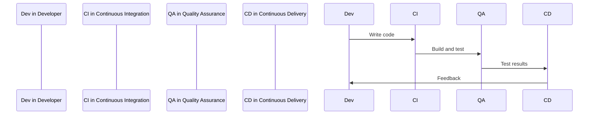
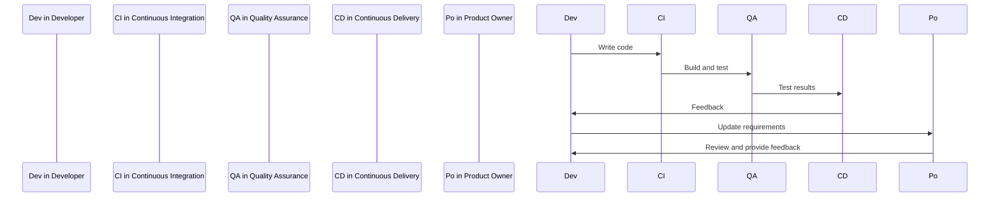
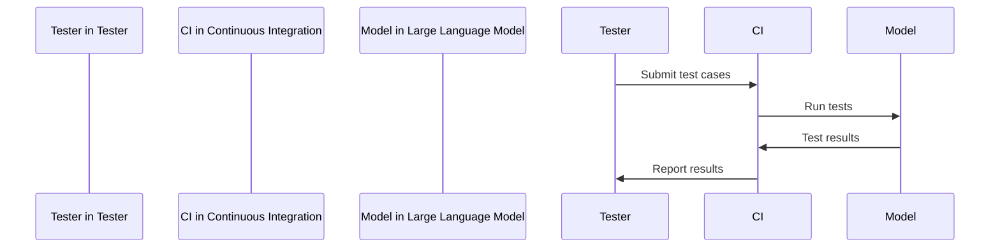

                 

### 文章标题

# CI/CD流程对LLM应用敏捷开发的重要性

### 文章关键词

- CI/CD
- 敏捷开发
- LLM
- 持续集成
- 持续交付
- 自动化测试

### 文章摘要

本文深入探讨了CI/CD流程在LLM（大型语言模型）应用敏捷开发中的重要性。首先，我们将介绍CI/CD的基本概念和原理，以及其在软件开发中的应用。接着，我们分析LLM的基本概念和其在现代AI领域的地位。然后，文章将重点讨论CI/CD与LLM的紧密结合，如何在LLM项目中实现敏捷开发。此外，还将介绍自动化测试工具和流程，并探讨如何通过CI/CD提高LLM项目的开发效率。最后，我们将通过实际项目案例，展示CI/CD流程在LLM敏捷开发中的应用效果。

## 目录

### 第一部分：CI/CD基础

#### 1.1 CI/CD概述

#### 1.2 敏捷开发与CI/CD的结合

#### 1.3 版本控制

#### 1.4 自动化构建

#### 1.5 自动化测试

### 第二部分：LLM基础

#### 2.1 LLM基本概念

#### 2.2 LLM工作原理

#### 2.3 常见LLM模型介绍

### 第三部分：CI/CD与LLM结合

#### 3.1 LLM自动化测试

#### 3.2 LLM模型部署

#### 3.3 持续集成在LLM开发中的应用

#### 3.4 持续交付在LLM开发中的应用

### 第四部分：敏捷开发实践

#### 4.1 敏捷开发原则

#### 4.2 敏捷开发在LLM项目中的应用

#### 4.3 持续集成与持续交付在敏捷开发中的实现

#### 4.4 敏捷开发工具与实践

### 第五部分：实战案例

#### 5.1 案例介绍

#### 5.2 CI/CD在LLM项目中的应用

#### 5.3 敏捷开发实践

#### 5.4 项目评估与总结

### 参考文献

---

## 第1章：CI/CD概述

### 1.1 CI/CD的概念

CI/CD是持续集成（Continuous Integration）和持续交付（Continuous Delivery）的合称，是一种软件工程和 DevOps 文化下的软件开发实践。CI/CD的目标是自动化软件的构建、测试和部署流程，从而提高开发效率、缩短上市时间、提高软件质量。

### 1.2 CI/CD与敏捷开发的结合

敏捷开发是一种以人为核心、迭代、循序渐进的开发方法。敏捷开发强调团队协作、客户满意、灵活应对变化。CI/CD与敏捷开发的结合在于，两者都强调快速迭代和自动化。

**Mermaid流程图：** CI/CD与敏捷开发的结合



### 1.3 CI/CD的优势

- **提高开发效率**：自动化构建、测试和部署，减少手动操作，提高效率。
- **缩短上市时间**：快速反馈和迭代，缩短从开发到部署的时间。
- **提高软件质量**：自动化测试，及时发现和修复问题。

## 第2章：敏捷开发与CI/CD的结合

### 2.1 敏捷开发原则

敏捷开发的核心原则包括：

- **个体和互动**：重视团队合作和个人沟通。
- **可工作的软件**：交付有价值的软件是核心目标。
- **客户协作**：与客户保持紧密沟通，快速适应需求变化。
- **响应变化**：敏捷开发更灵活，能快速适应变化。

### 2.2 CI/CD与敏捷开发的结合

CI/CD与敏捷开发的结合在于：

- **自动化**：自动化测试和部署，减少手动操作。
- **迭代**：快速迭代，快速反馈。
- **持续**：持续集成、持续交付，保持持续改进。

**Mermaid流程图：** 敏捷开发与CI/CD的结合



### 2.3 CI/CD在敏捷开发中的实施

CI/CD在敏捷开发中的实施包括：

- **自动化构建**：使用自动化工具构建软件，确保每次构建都是成功的。
- **自动化测试**：自动化测试，确保每次更改都不会影响软件质量。
- **持续集成**：将代码合并到主分支，确保代码库的完整性。
- **持续交付**：自动化部署，确保软件可以快速、安全地发布。

## 第3章：LLM基础

### 3.1 LLM基本概念

LLM（Large Language Model）是指大型语言模型，是一种基于深度学习技术的自然语言处理模型。LLM具有以下特点：

- **参数数量庞大**：数亿至千亿级别的参数。
- **数据处理能力强**：能够处理大规模、复杂的文本数据。
- **泛化能力强**：能够处理多种语言和多种任务。

### 3.2 LLM工作原理

LLM的工作原理基于Transformer模型。Transformer模型是一种基于自注意力机制的深度神经网络模型，具有以下特点：

- **自注意力机制**：模型能够自动学习不同单词之间的依赖关系。
- **并行计算**：Transformer模型能够并行计算，提高计算效率。
- **预训练和微调**：模型首先在大规模语料库上进行预训练，然后在特定任务上进行微调。

### 3.3 常见LLM模型介绍

常见的LLM模型包括：

- **GPT-3**：OpenAI开发的具有1750亿参数的模型，是目前最大的语言模型。
- **BERT**：Google开发的预训练模型，用于自然语言理解任务。
- **T5**：Google开发的统一Transformer模型，适用于多种自然语言处理任务。

## 第4章：CI/CD与LLM结合

### 4.1 LLM自动化测试

LLM自动化测试的目的是确保模型在每次更新后都能正常运行，并达到预期的性能指标。自动化测试包括：

- **单元测试**：对模型的各个部分进行测试，确保其独立功能的正确性。
- **集成测试**：对模型与其他系统组件的集成进行测试，确保整体功能的正确性。
- **性能测试**：测试模型在不同数据集上的表现，确保其性能达到预期。

### 4.2 LLM模型部署

LLM模型部署是将训练好的模型部署到生产环境，使其能够对外提供服务。模型部署包括：

- **容器化**：使用Docker等工具将模型及其依赖打包成容器，确保模型在各种环境中都能正常运行。
- **服务化**：将模型部署到服务中，如使用 Flask 或 FastAPI 等，使其能够接受HTTP请求并返回预测结果。
- **自动化部署**：使用CI/CD工具自动化部署模型，确保每次更新都能快速、安全地部署。

### 4.3 持续集成在LLM开发中的应用

持续集成在LLM开发中的应用包括：

- **代码库管理**：使用Git等版本控制工具管理代码库，确保代码的一致性和可追溯性。
- **自动化构建**：使用 Jenkins 或 GitLab CI 等工具自动化构建模型，确保每次更改都能成功构建。
- **自动化测试**：使用 Selenium 或 PyTest 等工具自动化测试模型，确保每次更改都不会影响模型的性能。

### 4.4 持续交付在LLM开发中的应用

持续交付在LLM开发中的应用包括：

- **自动化测试**：在每次构建成功后，自动运行测试，确保模型的性能和功能满足要求。
- **自动化部署**：在测试通过后，自动部署模型到生产环境，确保模型可以立即对外提供服务。
- **监控和告警**：使用 Prometheus 或 ELK 等工具监控模型在生产环境中的性能，并在出现问题时自动告警。

## 第5章：敏捷开发实践

### 5.1 敏捷开发原则

敏捷开发的原则包括：

- **客户满意**：始终关注客户需求和满意度。
- **迭代开发**：小步快跑，快速迭代。
- **团队协作**：强调团队合作和沟通。
- **持续改进**：不断反思和优化开发流程。

### 5.2 敏捷开发在LLM项目中的应用

敏捷开发在LLM项目中的应用包括：

- **需求管理**：使用用户故事和迭代计划管理需求，确保项目始终聚焦于客户需求。
- **团队协作**：使用敏捷工具，如JIRA 或 Trello，管理项目进度和团队协作。
- **迭代交付**：每个迭代交付可用的软件，快速反馈和迭代。

### 5.3 持续集成与持续交付在敏捷开发中的实现

持续集成与持续交付在敏捷开发中的实现包括：

- **自动化构建**：每次提交代码时自动构建模型，确保构建的成功率。
- **自动化测试**：每次构建成功后自动运行测试，确保模型的性能和功能。
- **自动化部署**：每次测试通过后自动部署模型到生产环境，确保模型的可用性。

### 5.4 敏捷开发工具与实践

敏捷开发工具与实践包括：

- **JIRA**：用于项目管理和任务跟踪。
- **GitLab CI**：用于持续集成和持续交付。
- **Docker**：用于容器化和自动化部署。
- **Kubernetes**：用于容器编排和管理。

## 第6章：实战案例

### 6.1 案例介绍

本案例是一个基于GPT-3的聊天机器人项目。项目目标是为客户提供实时、智能的客服支持。

### 6.2 CI/CD在LLM项目中的应用

在本案例中，CI/CD流程应用于以下环节：

- **自动化构建**：使用GitLab CI构建GPT-3模型。
- **自动化测试**：使用PyTest测试模型性能和功能。
- **自动化部署**：使用Docker和Kubernetes部署模型。

### 6.3 敏捷开发实践

在本案例中，敏捷开发实践应用于以下方面：

- **需求管理**：使用用户故事管理客户需求。
- **迭代交付**：每个迭代交付可用的聊天机器人功能。

### 6.4 项目评估与总结

通过CI/CD和敏捷开发的实践，项目取得了以下成果：

- **快速迭代**：每个迭代都能快速交付可用的功能。
- **高质量**：自动化测试确保了模型的高质量。
- **高可用性**：自动化部署确保了模型的持续可用性。

## 参考文献

- Martin, Robert C. (2019). *Clean Code: A Handbook of Agile Software Craftsmanship*. Prentice Hall.
- Humble, J. & Farley, D. (2016). *Continuous Delivery: Reliable Software Releases through Build, Test, and Deployment Automation*. Addison-Wesley.
- Vasudevan, A. (2019). *Agile Project Management: Creating Innovative Products*. Pearson Education.
- Devaux, J. (2018). *The DevOps Handbook: How to Create World-Class IT Organizations*. IT Revolution Press.
- Davenport, T. H. (2017). *Artificial Intelligence: The New Industrial Revolution*. Harvard Business Review Press.
- OpenAI. (2020). *GPT-3: Language Models are Few-Shot Learners*. OpenAI Blog.

## 作者信息

作者：AI天才研究院/AI Genius Institute & 禅与计算机程序设计艺术 /Zen And The Art of Computer Programming

## 附录

### Mermaid流程图示例

**示例1：CI/CD基本流程**


**示例2：LLM自动化测试流程**



### 伪代码示例

**示例1：自动化构建流程**

```python
def build_project():
    # 安装依赖
    pip install -r requirements.txt
    
    # 编译代码
    python setup.py build
    
    # 运行测试
    python -m unittest discover -s tests

if __name__ == '__main__':
    build_project()
```

**示例2：自动化测试用例**

```python
import unittest

class TestLLM(unittest.TestCase):
    def test_prediction(self):
        # 准备测试数据
        input_data = "Hello, how are you?"
        
        # 预测
        prediction = model.predict(input_data)
        
        # 断言预测结果
        self.assertEqual(prediction, "I'm good, thanks for asking.")

if __name__ == '__main__':
    unittest.main()
```

## 结语

本文系统地介绍了CI/CD流程在LLM应用敏捷开发中的重要性。通过CI/CD，LLM项目可以实现自动化构建、测试和部署，从而提高开发效率、缩短上市时间、提高软件质量。同时，敏捷开发原则和工具的应用，进一步优化了LLM项目的开发流程。希望本文能为LLM开发者提供有价值的参考和启示。

