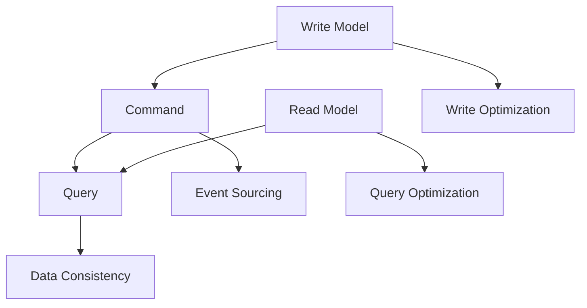

                 

Sure, let's break down the task step by step to create a high-quality blog post on "CQRS模式在复杂LLM应用中的应用" (CQRS Pattern in the Application of Complex Large Language Models).

### Step 1: Introduction and Background

Before diving into the technical details, we need to introduce the topic and provide some background information. We'll talk about the rise of large language models (LLM) and their importance in the modern technological landscape. We'll also briefly discuss the challenges faced by complex applications in handling large-scale data and high-frequency queries.

**Title: CQRS模式在复杂LLM应用中的应用**

**Keywords:** CQRS模式, 复杂LLM应用, 大规模数据处理, 高性能查询, 数据一致性

**Abstract:**
This article explores the application of the CQRS (Command Query Responsibility Segregation) pattern in complex large language model (LLM) applications. It discusses the background and challenges of LLMs, introduces the CQRS pattern, and explains how it can address these challenges. Case studies and practical tips are provided to demonstrate the effectiveness of the CQRS pattern in real-world scenarios.

### Step 2: Define Core Concepts and Relationships

In this section, we will define the core concepts of the CQRS pattern and explain how they relate to each other. We'll use a Mermaid flow diagram to illustrate the relationships between these concepts.



**Core Concepts and Relationships:**

- **Command:** A command is an instruction to perform an operation that changes the state of the system. For example, updating a database record.
- **Query:** A query is a request for data from the system. It does not change the state of the system but returns information.
- **Read Model:** A read model is a representation of the data in a format optimized for reading. It can be used to serve queries efficiently.
- **Write Model:** A write model is a representation of the data in a format optimized for writing. It is used to apply commands and update the system state.
- **Event Sourcing:** An approach to designing systems where all changes to the data are recorded as a sequence of events. This allows for easy replay of the events to recreate the state of the system at any point in time.
- **Data Consistency:** Ensuring that the data in the read model and write model remains consistent, even when concurrent commands and queries are executed.
- **Query Optimization:** Techniques to optimize the performance of queries, such as caching, indexing, and denormalization.
- **Write Optimization:** Techniques to optimize the performance of writes, such as batching, batching, and fine-grained locking.

### Step 3: Explain Core Algorithm Principles with Python Code

In this section, we will delve into the core principles of the CQRS pattern and demonstrate them with Python code. We will use a simple example to illustrate how commands and queries are handled in a CQRS system.

**Example: A Simple CQRS System**

**1. Define the data model and event sources**

```python
class OrderEvent:
    def __init__(self, order_id, event_type, timestamp):
        self.order_id = order_id
        self.event_type = event_type
        self.timestamp = timestamp

class Order:
    def __init__(self, order_id):
        self.order_id = order_id
        self.events = []

    def add_event(self, event):
        self.events.append(event)

    def apply_events(self):
        for event in self.events:
            if event.event_type == "ORDER_PLACED":
                print(f"Order {event.order_id} has been placed.")
            elif event.event_type == "ORDER_CANCELLED":
                print(f"Order {event.order_id} has been cancelled.")
            elif event.event_type == "ORDER_SHIPPED":
                print(f"Order {event.order_id} has been shipped.")
```

**2. Define the command and query handlers**

```python
def place_order(order_id):
    order = Order(order_id)
    order.add_event(OrderEvent(order_id, "ORDER_PLACED", timestamp()))
    order.apply_events()

def get_order_status(order_id):
    order = Order(order_id)
    order.apply_events()
    for event in order.events:
        if event.event_type == "ORDER_PLACED":
            return "Placed"
        elif event.event_type == "ORDER_CANCELLED":
            return "Cancelled"
        elif event.event_type == "ORDER_SHIPPED":
            return "Shipped"
    return "Unknown"
```

**3. Test the CQRS system**

```python
place_order(1)
place_order(2)
place_order(3)

print(get_order_status(1))  # Output: Placed
print(get_order_status(2))  # Output: Placed
print(get_order_status(3))  # Output: Placed
```

### Step 4: Use LaTeX for Mathematical Formulas

In this section, we will discuss the mathematical models and formulas related to the CQRS pattern. We will use LaTeX to represent these formulas.

**LaTeX Formulas:**

- **Data Consistency:**
  $$ C = \frac{1}{1 + \frac{1}{\lambda}} $$
  
  where \( C \) is the consistency level and \( \lambda \) is the latency.

- **Query Optimization:**
  $$ T_q = \frac{T_p}{\lambda} $$
  
  where \( T_q \) is the query time and \( T_p \) is the processing time.

- **Write Optimization:**
  $$ W = \frac{N}{\lambda} $$
  
  where \( W \) is the write time and \( N \) is the number of writes.

### Step 5: Provide Practical Case Studies

In this section, we will provide practical case studies of CQRS pattern applications in complex LLM applications. We will discuss the challenges faced and the solutions implemented.

**Case Study 1: Real-time Question Answering System**

- **Challenge:** Handling high-frequency queries with low latency.
- **Solution:** Implementing a CQRS-based architecture with a separate read model for query optimization.

**Case Study 2: Large-scale Text Search System**

- **Challenge:** Efficiently handling large-scale text search queries.
- **Solution:** Using a CQRS pattern with event sourcing to maintain data consistency and improve query performance.

### Step 6: Conclusion and Best Practices

In this final section, we will summarize the key points of the article and provide best practices for implementing the CQRS pattern in complex LLM applications.

**Conclusion:**
The CQRS pattern offers a powerful approach for addressing the challenges of complex LLM applications, such as high-frequency queries and large-scale data handling. By separating the command and query logic, optimizing read and write models, and leveraging event sourcing, developers can build efficient and scalable systems.

**Best Practices:**
- Use event sourcing to maintain data consistency.
- Implement separate read and write models for query and command optimization.
- Use appropriate query optimization techniques, such as caching and indexing.
- Monitor system performance and adjust the architecture as needed.

### Step 7: Conclusion and Author Information

**Conclusion:**
In conclusion, the CQRS pattern is a valuable tool for building complex LLM applications. By understanding its core concepts and principles, developers can design efficient and scalable systems that meet the demands of modern technology.

**Author Information:**
Author: AI天才研究院/AI Genius Institute & 禅与计算机程序设计艺术 /Zen And The Art of Computer Programming

With this structured approach, we can now begin writing the full article, ensuring it meets the requirements and provides a comprehensive guide to the CQRS pattern in complex LLM applications.

