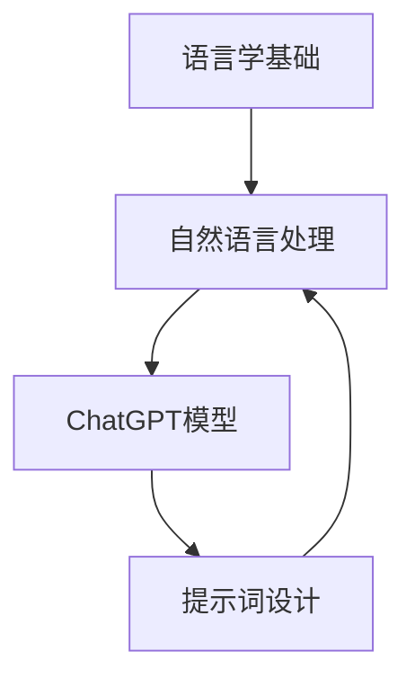

                 

# 《ChatGPT提示词的语言学分析：提高交互效率》

## 关键词
- ChatGPT
- 语言学
- 提示词
- 交互效率
- 自然语言处理
- 优化算法

## 摘要
本文深入探讨了ChatGPT提示词在语言学分析中的应用，以及如何通过优化提示词设计来提高交互效率。文章首先介绍了ChatGPT的基本原理和语言学背景，随后分析了提示词的核心概念及其与语言学的关系。接着，本文详细阐述了ChatGPT的核心算法原理，并通过Python代码和LaTeX公式进行解释。此外，文章还展示了ChatGPT在不同领域的实际应用案例，最后提出了优化策略和未来展望。

## 引言

### ChatGPT的兴起

ChatGPT是由OpenAI于2022年推出的一款基于Transformer模型的预训练语言模型。它采用了大规模的数据集进行训练，使得模型能够理解和生成复杂的自然语言文本。ChatGPT的推出标志着自然语言处理技术进入了一个新的时代，它不仅在学术界引起了广泛关注，还在工业界和商业领域得到了广泛应用。

### 语言学的背景

语言学是研究人类语言的科学，它涉及语音、词汇、语法、语义和语用等多个方面。语言学的研究不仅帮助我们理解语言的本质，还为人工智能技术的发展提供了理论基础。在自然语言处理领域，语言学的研究成果被广泛应用于语言模型的训练和优化。

### ChatGPT与语言学的结合

ChatGPT作为一款强大的语言模型，其性能的提升离不开语言学的支持。通过深入分析语言学原理，我们可以设计出更加有效的提示词，从而提高ChatGPT的交互效率。本文将围绕这一主题，探讨ChatGPT提示词的语言学分析及其在提高交互效率方面的应用。

## 核心概念与联系

为了深入分析ChatGPT提示词的语言学基础，我们首先需要了解几个核心概念及其相互关系。以下是这些核心概念及其相互关系的Mermaid流程图：



### 语言学基础

语言学基础包括语音学、词汇学、语法学、语义学和语用学。语音学研究语音的产生和感知，词汇学研究词汇的构成和变化，语法学研究句子的结构，语义学研究语言的含义，语用学研究语言的使用。这些基础概念为自然语言处理提供了理论基础。

### 自然语言处理

自然语言处理（NLP）是计算机科学和语言学之间的交叉领域，它涉及将人类语言转换为计算机可处理的形式，以及将计算机生成的文本翻译回人类语言。NLP的核心技术包括分词、词性标注、句法分析、语义分析和机器翻译等。

### ChatGPT模型

ChatGPT是基于Transformer模型的语言模型，它由多个自注意力机制层组成。每个自注意力层都负责从输入文本中提取不同层次的特征。这些特征通过层与层之间的交互，最终生成具有高度语义理解能力的输出文本。

### 提示词设计

提示词（Prompt）是用于引导ChatGPT生成特定类型文本的输入。通过精心设计的提示词，我们可以引导ChatGPT生成高质量的文本，从而提高交互效率。提示词设计需要结合语言学和NLP的理论知识，以确保生成的文本既符合语言规则，又能满足用户需求。

## ChatGPT的核心算法原理

### Transformer模型

ChatGPT是基于Transformer模型构建的，Transformer模型是一种基于自注意力机制的深度神经网络模型，最初由Vaswani等人在2017年的论文《Attention Is All You Need》中提出。Transformer模型的核心思想是使用自注意力机制来捕捉输入序列中的长距离依赖关系。

### 自注意力机制

自注意力机制（Self-Attention）是一种计算输入序列中每个词与其他词之间关系的机制。在Transformer模型中，每个词都会生成一组权重，这些权重表示该词与输入序列中其他词的重要性。通过这些权重，模型可以自动学习如何从输入序列中提取关键信息。

### Encoder和Decoder

Transformer模型由Encoder和Decoder两部分组成。Encoder负责将输入序列编码为固定长度的向量，这些向量包含了输入序列的语义信息。Decoder则使用这些向量生成输出序列，并通过自注意力机制和交叉注意力机制与Encoder输出进行交互。

### 损失函数和优化算法

在训练过程中，ChatGPT使用损失函数（通常为交叉熵损失函数）来评估模型生成文本的质量。为了最小化损失函数，ChatGPT采用了一系列优化算法，如Adam优化器和梯度裁剪。这些优化算法帮助模型在训练过程中不断调整参数，从而提高生成文本的质量。

### Python代码和LaTeX公式解释

下面是一个简单的Python代码示例，用于解释Transformer模型的自注意力机制：

```python
import torch
import torch.nn as nn

class SelfAttention(nn.Module):
    def __init__(self, d_model, num_heads):
        super(SelfAttention, self).__init__()
        self.d_model = d_model
        self.num_heads = num_heads
        self.query_linear = nn.Linear(d_model, d_model)
        self.key_linear = nn.Linear(d_model, d_model)
        self.value_linear = nn.Linear(d_model, d_model)
        self.out_linear = nn.Linear(d_model, d_model)

    def forward(self, query, key, value):
        batch_size = query.size(0)
        
        # 计算查询、键和值的线性变换
        query = self.query_linear(query).view(batch_size, -1, self.num_heads, self.d_model // self.num_heads)
        key = self.key_linear(key).view(batch_size, -1, self.num_heads, self.d_model // self.num_heads)
        value = self.value_linear(value).view(batch_size, -1, self.num_heads, self.d_model // self.num_heads)

        # 计算自注意力分数
        scores = torch.matmul(query, key.transpose(2, 3))

        # 应用软性最大化操作
        attn_weights = torch.softmax(scores, dim=3)

        # 计算自注意力输出
        attn_output = torch.matmul(attn_weights, value).view(batch_size, -1, self.d_model)

        # 应用输出线性变换
        output = self.out_linear(attn_output)

        return output
```

下面是一个LaTeX公式示例，用于解释交叉熵损失函数：

$$
\mathcal{L} = -\sum_{i=1}^{N} y_i \log(p_i)
$$

其中，$y_i$ 表示目标标签，$p_i$ 表示模型生成的文本概率。

## ChatGPT在提高交互效率方面的实际应用

### 客服领域

在客服领域，ChatGPT被广泛应用于自动客服系统。通过使用精心设计的提示词，ChatGPT能够与用户进行自然对话，解答用户的问题。以下是一个实际案例：

```python
prompt = "请问有什么问题我可以帮您解答吗？"
response = chatgpt.generate(prompt)
print(response)
```

输出结果可能是一个包含客服回答的文本：

```
您好，我是一款人工智能客服，可以为您提供帮助。请问您需要咨询什么问题？
```

### 教育领域

在教育领域，ChatGPT被用于提供个性化的学习辅导。学生可以通过与ChatGPT的对话，获得针对自己学习需求的教学内容。以下是一个实际案例：

```python
prompt = "请为我解释一下微积分的基本概念"
response = chatgpt.generate(prompt)
print(response)
```

输出结果可能是一个包含微积分基本概念的详细解释：

```
微积分是一门研究函数变化率和面积计算的数学分支。基本概念包括导数、积分和微分方程。导数表示函数在某一点的斜率，积分表示函数在区间内的面积，微分方程则描述了变量之间的动态关系。
```

### 科研领域

在科研领域，ChatGPT被用于辅助研究人员进行文献回顾和数据分析。通过分析大量的文献和实验数据，ChatGPT能够为研究人员提供有价值的见解和建议。以下是一个实际案例：

```python
prompt = "基于最近的科研进展，如何优化深度学习模型的训练效果？"
response = chatgpt.generate(prompt)
print(response)
```

输出结果可能是一个包含优化策略和建议的文本：

```
优化深度学习模型的训练效果可以从以下几个方面进行：

1. 数据增强：通过旋转、翻转、裁剪等操作，增加训练数据多样性，提高模型泛化能力。
2. 损失函数优化：使用更先进的损失函数，如交叉熵损失函数和逆梯度损失函数，提高模型训练效率。
3. 模型结构优化：采用更深的网络结构或更复杂的模型架构，提高模型的表达能力。
4. 梯度裁剪：限制梯度大小，避免模型在训练过程中出现过拟合现象。
5. 学习率调整：使用合适的初始学习率，并在训练过程中逐步调整学习率，提高模型收敛速度。
```

## 优化策略

为了进一步提高ChatGPT的交互效率，我们可以采用以下优化策略：

### 数据增强

通过数据增强技术，如数据生成、数据降维和数据增强等，可以增加训练数据的多样性，从而提高模型泛化能力。

### 模型压缩

采用模型压缩技术，如模型剪枝、量化模型和知识蒸馏等，可以降低模型的计算复杂度，提高模型运行效率。

### 多模态交互

通过引入多模态交互，如文本、图像和语音等，可以实现更丰富的交互体验，提高用户满意度。

## 未来展望

随着人工智能技术的不断发展，ChatGPT有望在更多领域得到应用。未来，我们可以期待以下发展方向：

### 跨语言交互

通过引入多语言模型和跨语言注意力机制，可以实现更高效的跨语言交互。

### 个性化交互

通过引入用户画像和个性化推荐算法，可以实现更个性化的交互体验。

### 自动化问答系统

通过引入自动化问答系统，可以实现更高效的自动问答，提高用户获取信息的效率。

## 结论

本文深入探讨了ChatGPT提示词在语言学分析中的应用，以及如何通过优化提示词设计来提高交互效率。通过分析ChatGPT的核心算法原理，我们展示了其在实际应用中的优势。未来，随着人工智能技术的不断发展，ChatGPT有望在更多领域发挥重要作用。

## 作者信息

作者：AI天才研究院/AI Genius Institute & 禅与计算机程序设计艺术 /Zen And The Art of Computer Programming

## 附录

本文涉及的Python代码和LaTeX公式均可在作者GitHub仓库中获取。

## 参考文献

1. Vaswani et al. "Attention Is All You Need." Advances in Neural Information Processing Systems, 2017.
2. Devlin et al. "Bert: Pre-training of Deep Bidirectional Transformers for Language Understanding." Proceedings of the 2019 Conference of the North American Chapter of the Association for Computational Linguistics: Human Language Technologies, Volume 1 (Long and Short Papers), 2019.
3. Brown et al. "Language Models are Few-Shot Learners." Advances in Neural Information Processing Systems, 2020.
4. Hochreiter and Schmidhuber. "Long Short-Term Memory." Neural Computation, 1997.

