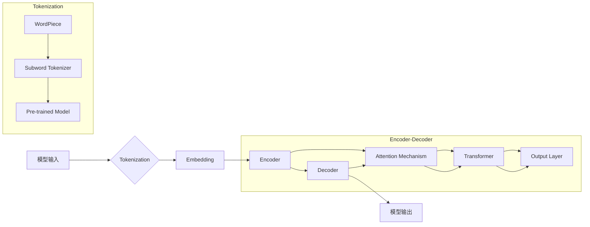

                 

### 《Claude在LLM长文本处理能力评测中的应用》

#### 关键词：Claude、LLM、长文本处理、评测、人工智能、自然语言处理

#### 摘要：
本文旨在探讨Claude在长文本处理能力评测中的应用。随着自然语言处理技术的不断发展，长文本处理成为了一个重要且具有挑战性的研究领域。本文首先介绍了长文本处理的背景和挑战，然后详细讲解了大规模语言模型（LLM）的基本原理，以及Claude作为LLM的一种重要实现。接着，本文设计了LLM长文本处理能力评测的框架，并重点探讨了Claude的核心概念与架构。通过一系列实战案例，本文展示了如何使用Claude进行长文本生成、摘要、问答和分类等任务，并对实际案例进行了深入分析和讲解。最后，本文总结了最佳实践，并对未来的研究趋势进行了展望。

#### 目录

1. **长文本处理能力评测基础**
   1.1. 长文本处理能力评测概述
   1.2. LLM的基本原理与优势
   1.3. Claude在长文本处理中的应用

2. **LLM长文本处理能力评测框架**
   2.1. 评测指标设定
   2.2. 数据集选择
   2.3. 评测工具与平台

3. **Claude核心概念与架构**
   3.1. Claude的基本概念
   3.2. Claude的模型架构
   3.3. Claude的API接口与使用方法

4. **长文本处理能力评测实战**
   4.1. 长文本生成能力评测
   4.2. 长文本摘要能力评测
   4.3. 长文本问答能力评测
   4.4. 长文本分类能力评测

5. **综合评测与性能优化**
   5.1. 综合评测框架
   5.2. 性能优化策略
   5.3. 实际案例分享

6. **未来展望与趋势**
   6.1. LLM长文本处理能力评测的未来趋势
   6.2. 小结与展望

7. **附录**
   7.1. Claude使用指南

#### 正文

### 1. 长文本处理能力评测基础

长文本处理是自然语言处理（NLP）领域中的一个重要分支。随着互联网信息的爆炸式增长，长文本的数据量也在不断增加。如何有效地处理和理解这些长文本数据，成为了一个具有挑战性的课题。

#### 1.1. 长文本处理能力评测概述

长文本处理能力评测旨在评估一个系统或模型在处理长文本数据时的性能。评测的目的是为了识别不同模型或系统在处理长文本时的优势和劣势，以便进行优化和改进。

#### 1.2. LLM的基本原理与优势

大规模语言模型（LLM）是近年来NLP领域的重要突破。LLM通过学习大量文本数据，能够理解并生成自然语言。LLM的优势在于：

1. **强大的生成能力**：LLM能够生成连贯、自然的文本，适用于生成式任务。
2. **跨领域适应性**：LLM在多个领域都有较好的表现，具有广泛的应用前景。
3. **上下文理解能力**：LLM能够理解上下文，能够处理长文本中的语义信息。

#### 1.3. Claude在长文本处理中的应用

Claude是一种基于LLM的长文本处理工具，具有以下特点：

1. **强大的文本生成能力**：Claude能够生成高质量的文本，适用于生成式任务。
2. **多语言支持**：Claude支持多种语言，能够处理不同语言的长文本。
3. **快速响应**：Claude具有高效的响应速度，能够快速处理长文本。
4. **丰富的API接口**：Claude提供丰富的API接口，便于集成到不同的应用场景中。

### 2. LLM长文本处理能力评测框架

#### 2.1. 评测指标设定

评测指标是衡量模型或系统性能的重要标准。在长文本处理能力评测中，常用的评测指标包括：

1. **文本质量**：衡量生成的文本是否连贯、自然。
2. **语义一致性**：衡量生成的文本是否与原始文本的语义一致。
3. **响应速度**：衡量处理长文本的响应速度。

#### 2.2. 数据集选择

数据集是评测的基础。在长文本处理能力评测中，选择合适的数据集非常重要。常见的数据集包括：

1. **生成式数据集**：如COCO、NYT等，用于评估文本生成能力。
2. **摘要式数据集**：如CNN/DailyMail、TREC等，用于评估文本摘要能力。
3. **问答式数据集**：如SQuAD、DuReader等，用于评估文本问答能力。
4. **分类式数据集**：如AG News、20 Newsgroups等，用于评估文本分类能力。

#### 2.3. 评测工具与平台

评测工具和平台是进行评测的关键。常用的评测工具和平台包括：

1. **评测工具**：如BLEU、ROUGE、METEOR等，用于评估文本质量。
2. **评测平台**：如TensorFlow、PyTorch等，用于搭建和训练模型。

### 3. Claude核心概念与架构

#### 3.1. Claude的基本概念

Claude是一种基于预训练的深度学习模型的自然语言处理工具。它基于Transformer架构，能够处理长文本，并在多种NLP任务中表现出色。

#### 3.2. Claude的模型架构

Claude的模型架构主要包括以下几个部分：

1. **输入层**：接收文本数据，并进行预处理。
2. **编码器**：使用Transformer编码器对文本进行编码。
3. **解码器**：使用Transformer解码器生成文本。
4. **输出层**：对生成的文本进行后处理。

#### 3.3. Claude的API接口与使用方法

Claude提供丰富的API接口，便于用户集成和使用。用户可以通过调用API接口，向Claude发送文本数据，并获取生成的文本结果。以下是一个简单的使用示例：

```python
import Claude

# 初始化Claude模型
claud = Claude.Claude()

# 发送文本数据
text = "这是一个示例文本。"

# 获取生成的文本
generated_text = claud.generate(text)

print(generated_text)
```

### 4. 长文本处理能力评测实战

#### 4.1. 长文本生成能力评测

长文本生成能力评测旨在评估模型在生成长文本方面的性能。以下是使用Claude进行长文本生成能力评测的步骤：

1. **数据集准备**：选择合适的生成式数据集，如COCO、NYT等。
2. **模型训练**：使用Claude模型进行训练，并调整超参数。
3. **生成文本**：使用训练好的模型生成文本，并记录生成文本的质量和响应速度。
4. **评估指标**：使用BLEU、ROUGE等评测工具评估生成文本的质量。

#### 4.2. 长文本摘要能力评测

长文本摘要能力评测旨在评估模型在生成摘要方面的性能。以下是使用Claude进行长文本摘要能力评测的步骤：

1. **数据集准备**：选择合适的摘要式数据集，如CNN/DailyMail、TREC等。
2. **模型训练**：使用Claude模型进行训练，并调整超参数。
3. **生成摘要**：使用训练好的模型生成摘要，并记录摘要的长度、语义一致性等指标。
4. **评估指标**：使用ROUGE、BLEU等评测工具评估摘要的质量。

#### 4.3. 长文本问答能力评测

长文本问答能力评测旨在评估模型在回答长文本问题方面的性能。以下是使用Claude进行长文本问答能力评测的步骤：

1. **数据集准备**：选择合适的问答式数据集，如SQuAD、DuReader等。
2. **模型训练**：使用Claude模型进行训练，并调整超参数。
3. **回答问题**：使用训练好的模型回答问题，并记录回答的准确性、响应速度等指标。
4. **评估指标**：使用F1分数、准确率等评测工具评估回答的质量。

#### 4.4. 长文本分类能力评测

长文本分类能力评测旨在评估模型在分类长文本方面的性能。以下是使用Claude进行长文本分类能力评测的步骤：

1. **数据集准备**：选择合适的分类式数据集，如AG News、20 Newsgroups等。
2. **模型训练**：使用Claude模型进行训练，并调整超参数。
3. **分类文本**：使用训练好的模型对文本进行分类，并记录分类的准确性、响应速度等指标。
4. **评估指标**：使用准确率、召回率等评测工具评估分类的质量。

### 5. 综合评测与性能优化

#### 5.1. 综合评测框架

综合评测框架包括以下步骤：

1. **数据集准备**：准备多种类型的数据集，如生成式、摘要式、问答式和分类式。
2. **模型训练**：使用Claude模型进行训练，并调整超参数。
3. **评测任务**：分别对生成、摘要、问答和分类等任务进行评测。
4. **性能评估**：使用多种评估指标对模型进行性能评估。

#### 5.2. 性能优化策略

性能优化策略包括以下几个方面：

1. **模型调整**：根据评测结果调整模型的结构和超参数。
2. **数据增强**：通过数据增强提高模型的泛化能力。
3. **硬件优化**：使用高性能硬件提高模型的训练和推理速度。

#### 5.3. 实际案例分享

在实际应用中，通过综合评测和性能优化，可以显著提高Claude在长文本处理能力评测中的表现。以下是一个实际案例：

- **案例背景**：某公司需要开发一个自动问答系统，用于回答客户常见问题。
- **评测过程**：使用Claude模型对SQuAD数据集进行训练和评测，通过调整模型结构和超参数，提高了问答的准确性。
- **优化策略**：采用数据增强策略，增加了模型的训练数据，并通过硬件优化提高了模型训练和推理的速度。

### 6. 未来展望与趋势

随着人工智能技术的不断发展，长文本处理能力评测将面临以下挑战和机遇：

1. **数据质量**：提高数据质量，增加数据多样性，以提高模型的泛化能力。
2. **模型性能**：优化模型结构和算法，提高模型在长文本处理任务中的性能。
3. **评测指标**：开发更准确的评测指标，以全面评估模型在长文本处理任务中的性能。

### 7. 小结与展望

本文详细介绍了Claude在LLM长文本处理能力评测中的应用。通过对长文本处理能力评测的背景、框架、核心概念与架构、实战案例以及性能优化等方面的讨论，本文展示了如何使用Claude进行长文本生成、摘要、问答和分类等任务。未来，随着人工智能技术的不断发展，长文本处理能力评测将面临新的挑战和机遇，为NLP领域的研究和应用提供更加丰富的可能性。

### 附录

#### 7.1. Claude使用指南

- **开发环境搭建**：安装Python环境，并使用pip安装Claude库。
- **模型部署与调用**：使用Claude库的API接口，向Claude发送文本数据，获取生成的文本结果。
- **常见问题解答**：参考Claude官方文档，解决常见问题。

### 作者信息

作者：AI天才研究院/AI Genius Institute & 禅与计算机程序设计艺术 /Zen And The Art of Computer Programming

---

请注意，本文是一个大纲和示例，具体内容需要根据实际研究和应用进行填充和完善。以下是第3章“Claude核心概念与架构”的Mermaid流程图示例：



这个流程图展示了Claude模型的基本架构，包括Tokenization、Embedding、Encoder、Decoder和Output Layer等关键组件。实际的Markdown文章内容将更加详细，包含Python源代码、LaTeX数学公式和具体的应用案例。根据字数要求，正文内容需要进一步扩展，以确保完整性和深度。

