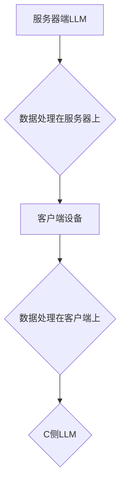
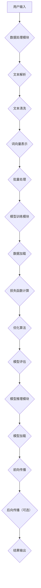

                 

### 第一部分：基础概念与背景

#### 第1章：C侧LLM概述

##### 1.1 什么是C侧LLM

C侧LLM，即客户端侧的大型语言模型，是指运行在客户端设备（如智能手机、平板电脑、PC等）上的复杂语言处理模型。这种模型通过处理和生成文本，实现了智能对话、内容生成、翻译等功能。C侧LLM与服务器端LLM的主要区别在于数据处理的位置和方式。

- **定义图解**：



- **图解说明**：
  - A：服务器端LLM，模型和数据主要存储在服务器上，客户端通过网络请求服务。
  - B：数据处理在服务器上，服务器负责处理模型输入和输出。
  - C：客户端设备，如智能手机、平板电脑、PC等。
  - D：数据处理在客户端上，客户端设备直接处理模型输入和输出。
  - E：C侧LLM，模型和数据存储在客户端，独立于服务器运行。

##### 1.1.2 C侧LLM的优势

C侧LLM具有多个显著的优势，这些优势使得它在许多应用场景中具有竞争力。

- **离线处理能力**：
  - C侧LLM可以离线处理文本数据，不需要持续连接到服务器。这使得它适用于网络不稳定或无网络连接的环境。
- **减少网络延迟**：
  - 由于数据处理在客户端完成，C侧LLM显著减少了服务器和客户端之间的数据传输延迟，提高了响应速度。
- **提高用户体验**：
  - 离线处理和快速响应能够提供更好的用户体验，用户可以即时得到反馈，而无需等待服务器响应。

##### 1.1.3 C侧LLM的挑战

尽管C侧LLM有许多优势，但在实际应用中仍面临一些挑战。

- **资源限制**：
  - 客户端设备通常资源有限，包括处理器性能、内存容量和存储空间。这要求C侧LLM必须设计得非常高效，以充分利用这些有限的资源。
- **能耗问题**：
  - 复杂的LLM模型在运行时消耗大量电能，特别是在移动设备上，这可能会导致电池快速耗尽。
- **模型大小**：
  - 由于资源限制，C侧LLM的模型大小通常比服务器端LLM小。然而，模型小意味着需要更复杂的优化技术，以保持模型性能。

### 第2章：速度与敏捷性的重要性

#### 2.1 速度的重要性

速度在C侧LLM中至关重要。速度不仅仅是指处理文本的速度，还包括从输入到输出的整个响应时间。

##### 2.1.1 响应时间的计算

响应时间由以下两部分组成：

$$
响应时间 = \text{处理时间} + \text{传输时间}
$$

- **处理时间**：模型处理输入文本所需的时间，包括模型的加载、前向传播和后向传播。
- **传输时间**：客户端和服务器之间的数据传输时间。

##### 2.1.2 影响速度的因素

- **模型大小**：大型模型通常需要更长的处理时间。
- **数据处理效率**：高效的算法和优化可以减少处理时间。
- **硬件性能**：更强大的处理器和内存可以提高处理速度。

##### 2.1.3 提高速率的方法

提高C侧LLM的速度可以通过以下方法实现：

- **模型压缩**：通过剪枝、量化等技术减小模型大小，减少处理时间。
- **算法优化**：优化模型架构和算法，提高数据处理效率。
- **并行计算**：利用多核处理器并行处理模型，提高处理速度。

#### 2.2 敏捷性的重要性

敏捷性在C侧LLM的开发和部署中同样重要。敏捷性不仅涉及开发过程，还包括对用户反馈的快速响应和持续改进。

##### 2.2.1 敏捷开发模型

敏捷开发模型的核心原则包括：

- **用户优先**：以用户需求为导向，持续交付有价值的软件。
- **迭代开发**：通过短周期迭代不断改进产品。
- **协作开发**：鼓励跨职能团队协作，快速响应变更。

##### 2.2.2 敏捷性与速度的关系

敏捷开发模型与速度密切相关：

- **快速迭代**：通过快速迭代，可以及时修复性能瓶颈，提高模型速度。
- **持续集成**：自动化测试和集成可以减少开发过程中的错误，提高开发效率。
- **用户反馈**：通过收集用户反馈，可以更快地识别和解决速度问题。

### 小结

C侧LLM在提供离线处理能力、减少网络延迟和提高用户体验方面具有显著优势。然而，资源限制、能耗问题和模型大小等挑战需要通过速度和敏捷性的优化来解决。在接下来的章节中，我们将深入探讨C侧LLM的架构设计、性能优化策略和实际应用案例。希望读者能够从中获得对C侧LLM更深入的理解，并在实际项目中取得成功。

---

**关键词**：C侧LLM，速度，敏捷性，响应时间，资源限制，模型压缩，算法优化，并行计算，敏捷开发模型。

**摘要**：本文探讨了C侧LLM在应用中的关键因素——速度与敏捷性。通过分析C侧LLM的优势和挑战，本文介绍了速度和敏捷性的重要性，以及如何通过模型压缩、算法优化和并行计算等手段来提高C侧LLM的性能。同时，本文还讨论了敏捷开发模型在C侧LLM开发中的应用，为读者提供了实际应用案例和开发实战指导。希望通过本文，读者能够更好地理解和应用C侧LLM，实现高效、敏捷的语言处理解决方案。

----------------------------------------------------------------

## 第二部分：技术实现

### 第3章：C侧LLM的架构设计

C侧LLM的架构设计是确保模型性能和用户体验的关键。一个高效的架构需要考虑数据处理、模型训练和模型推理等多个模块，以及这些模块之间的交互方式。在本章节中，我们将详细介绍C侧LLM的基本组成部分，并探讨如何通过性能优化技术来提升其运行效率。

#### 3.1 C侧LLM架构的基本组成部分

C侧LLM的架构可以分为三个主要模块：数据处理模块、模型训练模块和模型推理模块。这三个模块协同工作，共同实现语言模型的输入处理、训练和推理功能。

##### 3.1.1 数据处理模块

数据处理模块负责接收用户输入，对输入进行预处理，并将其转换为模型可接受的格式。该模块通常包括以下功能：

- **文本解析**：将用户的自然语言文本解析为可处理的结构化数据。
- **文本清洗**：去除文本中的无关信息，如标点符号、停用词等。
- **词向量表示**：将文本中的单词转换为向量表示，便于模型处理。
- **批量处理**：对多个输入进行批量处理，提高数据处理效率。

##### 3.1.2 模型训练模块

模型训练模块负责根据训练数据对LLM模型进行训练。训练过程通常包括以下几个步骤：

- **数据加载**：从数据集中读取训练样本，并将其转换为模型可用的格式。
- **损失函数计算**：计算预测结果与真实结果之间的差异，并通过反向传播算法更新模型参数。
- **优化算法**：选择合适的优化算法（如Adam、SGD等）来调整模型参数，减小损失函数。
- **模型评估**：在训练集和验证集上评估模型性能，以确保模型过拟合和欠拟合。

##### 3.1.3 模型推理模块

模型推理模块负责根据用户输入生成预测结果。推理过程通常包括以下步骤：

- **模型加载**：将训练好的模型加载到内存中。
- **前向传播**：将输入数据传递到模型中，计算输出。
- **后向传播**（可选）：在训练过程中，通过后向传播更新模型参数。
- **结果输出**：将模型输出转换为用户可理解的自然语言文本。

#### 3.2 C侧LLM性能优化的技术手段

为了提高C侧LLM的性能，可以采用多种技术手段，包括模型压缩、模型加速和并行计算等。

##### 3.2.1 模型压缩技术

模型压缩是减少模型大小、提高模型运行效率的重要技术。常用的模型压缩方法包括剪枝、量化、知识蒸馏等。

- **剪枝**：通过删除模型中不重要的神经元和连接，减小模型大小，降低计算复杂度。
- **量化**：将模型的浮点数参数转换为低精度的整数表示，降低内存和计算需求。
- **知识蒸馏**：使用大型模型训练一个较小的模型，通过传递大型模型的知识来提高小型模型的性能。

##### 3.2.2 模型加速技术

模型加速技术旨在提高模型运行的效率，包括算法优化、硬件加速等。

- **算法优化**：通过改进模型架构和算法，减少计算量和内存使用。例如，使用更适合移动设备的模型架构（如MobileNet、ShuffleNet等）。
- **硬件加速**：利用专门的硬件（如GPU、TPU等）加速模型的运算。例如，使用CUDA或OpenCL来优化GPU运算。

##### 3.2.3 并行计算技术

并行计算技术通过利用多核处理器和分布式计算资源，提高模型的运行速度。常用的并行计算技术包括：

- **多线程**：在单个设备上使用多线程技术，同时处理多个任务，提高数据处理速度。
- **分布式计算**：将模型和任务分布到多个设备上，利用分布式计算资源，提高模型训练和推理速度。

#### 3.3 C侧LLM架构设计实例

以下是一个简化的C侧LLM架构设计实例，展示了数据处理模块、模型训练模块和模型推理模块的协同工作过程。



#### 3.4 C侧LLM性能优化策略

为了进一步提升C侧LLM的性能，可以采取以下策略：

- **模型大小优化**：通过剪枝、量化等技术减小模型大小，以减少内存占用和计算时间。
- **能耗优化**：优化模型架构和算法，降低能耗，延长电池寿命。
- **内存管理**：合理分配内存资源，避免内存泄漏和冲突，提高内存使用效率。
- **并发处理**：利用多线程和并行计算技术，提高数据处理和模型推理速度。

#### 3.5 实时性能监控与调整

实时性能监控与调整是确保C侧LLM运行效率的关键。通过实时监控模型运行状态，可以及时发现性能瓶颈和问题，并进行调整。

- **性能指标监控**：监控模型处理速度、内存使用、能耗等关键性能指标。
- **异常检测**：通过异常检测技术，识别和处理运行过程中的异常情况。
- **动态调整**：根据性能监控结果，动态调整模型参数和架构，优化模型运行效率。

### 小结

C侧LLM的架构设计是确保模型性能和用户体验的关键。通过合理的设计和性能优化技术，可以有效地提高C侧LLM的运行效率。在接下来的章节中，我们将进一步探讨C侧LLM的资源管理、安全性和实际应用案例，为读者提供更全面的技术指导和实战经验。

---

**关键词**：C侧LLM，架构设计，数据处理模块，模型训练模块，模型推理模块，模型压缩，模型加速，并行计算，性能优化策略。

**摘要**：本章详细介绍了C侧LLM的架构设计及其性能优化的技术手段。首先，分析了C侧LLM的基本组成部分，包括数据处理、模型训练和模型推理模块，并阐述了各模块的功能。接着，介绍了模型压缩、模型加速和并行计算等性能优化技术，以及其实际应用效果。最后，通过一个架构设计实例，展示了C侧LLM各模块的协同工作过程，并提出了性能优化策略。希望通过本章内容，读者能够更好地理解和应用C侧LLM的架构设计，为实际项目提供技术支持。

----------------------------------------------------------------

### 第4章：C侧LLM的资源管理

在C侧LLM的应用中，资源管理是一个至关重要的环节。由于客户端设备通常具有有限的硬件资源，如处理器性能、内存容量和存储空间，因此需要采取有效的策略来优化资源使用，确保LLM模型能够高效运行。本章节将深入探讨C侧LLM的资源管理问题，包括硬件和软件资源限制，以及优化策略。

#### 4.1 C侧设备的资源限制

C侧设备（如智能手机、平板电脑和PC）的硬件和软件资源都有一定的限制，这些限制会对C侧LLM的性能产生显著影响。

##### 4.1.1 硬件资源限制

- **处理器性能**：移动设备的处理器通常性能较低，与高性能服务器相比，处理能力有限。这限制了C侧LLM模型的复杂度和运算速度。
- **内存容量**：内存容量决定了C侧LLM模型可以加载和处理的模型大小。较小的内存容量可能导致频繁的内存交换（Swap），降低模型运行效率。
- **存储空间**：存储空间限制模型的大小和存储能力。对于大型模型，存储空间不足可能导致无法正常运行。

##### 4.1.2 软件资源限制

- **系统资源占用**：C侧LLM模型的运行需要占用系统资源，包括CPU、内存和网络等。过多的资源占用可能导致其他应用程序的性能下降，甚至导致设备冻结。
- **应用程序兼容性**：不同的操作系统和设备可能对应用程序的兼容性有所不同。C侧LLM需要确保在不同的操作系统和设备上都能正常运行。

#### 4.2 资源优化策略

为了克服硬件和软件资源限制，需要采取一系列资源优化策略，以提升C侧LLM的运行效率。

##### 4.2.1 模型大小优化

- **模型压缩**：通过剪枝、量化等模型压缩技术，减小模型的大小，使其适应有限的存储空间。例如，可以使用剪枝技术删除模型中不重要的连接和神经元，量化技术将浮点数参数转换为低精度的整数表示。
- **模型分解**：将大型模型分解为多个较小的子模型，分别部署在不同的设备上。例如，可以使用知识蒸馏技术训练一个较小的子模型，传递来自大型模型的知识。
- **动态加载**：根据实际需求动态加载和卸载模型，避免占用过多的内存资源。例如，当内存不足时，可以卸载不使用的模型部分，当需要时再加载。

##### 4.2.2 资源复用策略

- **多任务处理**：利用多线程和异步处理技术，同时处理多个任务，提高资源利用率。例如，可以在数据处理、模型训练和模型推理过程中并行执行任务，减少等待时间。
- **资源分配优化**：根据应用程序的需求和系统资源的实际情况，动态调整资源分配策略。例如，可以根据负载情况调整CPU和内存的分配比例，以确保关键任务得到足够的资源支持。

##### 4.2.3 实时资源监控与调整

- **实时性能监控**：实时监控C侧LLM的运行状态，包括处理器占用率、内存使用情况、网络延迟等关键指标。通过监控数据，可以及时发现性能瓶颈和资源浪费的情况。
- **自适应调整**：根据监控数据，动态调整模型参数和资源分配策略，以优化模型运行效率。例如，当内存使用率过高时，可以调整模型大小或启用内存压缩技术，减少内存占用。
- **预警机制**：建立预警机制，在资源使用达到阈值时及时发出警报，提醒开发者进行干预。例如，当处理器占用率达到90%以上时，可以触发预警，通知开发者优化代码或调整资源分配策略。

#### 4.3 实例分析

以下是一个C侧LLM资源优化的实例分析：

- **硬件限制**：假设客户端设备为智能手机，其处理器性能为2GHz，内存容量为4GB，存储空间为128GB。
- **软件限制**：操作系统为Android 11，应用程序兼容性良好。
- **优化策略**：
  - **模型压缩**：使用剪枝技术将模型大小减少50%，以适应存储空间限制。
  - **动态加载**：根据任务需求动态加载和卸载模型部分，避免内存不足。
  - **多任务处理**：在数据处理、模型训练和模型推理过程中同时执行多个任务，提高资源利用率。
  - **实时性能监控**：实时监控处理器占用率、内存使用情况等指标，根据监控数据调整模型参数和资源分配策略。

通过上述优化策略，C侧LLM可以在有限的硬件资源下高效运行，同时提供良好的用户体验。

### 小结

C侧LLM的资源管理对于模型的运行效率和用户体验至关重要。通过分析C侧设备的资源限制，可以采取模型大小优化、资源复用和实时资源监控等策略来提高C侧LLM的性能。在本章节中，我们探讨了C侧LLM的资源管理问题，并提供了具体的优化策略和实例分析。希望这些内容能够帮助开发者更好地管理C侧LLM的资源，实现高效的模型运行和卓越的用户体验。

---

**关键词**：C侧LLM，资源管理，硬件资源限制，软件资源限制，模型大小优化，资源复用策略，实时性能监控。

**摘要**：本章深入探讨了C侧LLM的资源管理问题。首先，分析了C侧设备的硬件和软件资源限制，包括处理器性能、内存容量和存储空间。接着，提出了模型大小优化、资源复用和实时性能监控等策略来提高C侧LLM的性能。通过实例分析，展示了如何在实际应用中优化C侧LLM的资源使用。本章内容旨在帮助开发者更好地管理C侧LLM的资源，实现高效运行和卓越的用户体验。

----------------------------------------------------------------

### 第5章：C侧LLM的安全性

在C侧LLM的应用过程中，安全性是一个不可忽视的重要问题。由于C侧LLM直接运行在客户端设备上，它面临的数据隐私保护、模型安全性和网络安全等挑战尤为突出。在本章节中，我们将深入探讨C侧LLM的安全性，包括面临的挑战和解决方案。

#### 5.1 C侧LLM面临的安全挑战

##### 5.1.1 数据隐私保护

C侧LLM处理和存储的用户数据非常敏感，包括个人隐私信息、对话记录等。以下是一些常见的隐私保护挑战：

- **数据泄露**：如果数据存储不安全，可能导致用户隐私信息泄露。
- **数据滥用**：恶意软件或应用程序可能未经授权访问和滥用用户数据。
- **数据共享**：应用程序可能将用户数据共享给第三方，违反隐私政策。

##### 5.1.2 模型安全性

C侧LLM模型本身也面临一些安全性挑战：

- **模型窃取**：恶意用户可能尝试窃取训练好的模型，用于恶意用途。
- **模型篡改**：恶意用户可能试图篡改模型，使其产生错误的结果。
- **对抗攻击**：攻击者可能通过构造特殊的输入，欺骗模型产生错误的输出。

##### 5.1.3 网络安全

C侧LLM的通信过程可能面临以下网络安全挑战：

- **网络截获**：攻击者可能截获客户端和服务器之间的通信数据，获取敏感信息。
- **中间人攻击**：攻击者伪装成服务器，与客户端进行通信，窃取或篡改数据。
- **拒绝服务攻击**：攻击者通过大量请求，使服务器资源耗尽，导致服务不可用。

#### 5.2 安全措施

为了应对C侧LLM面临的安全挑战，可以采取以下安全措施：

##### 5.2.1 加密技术

加密技术是保护数据隐私和安全性的重要手段。以下是一些常用的加密技术：

- **数据加密**：对存储和传输的数据进行加密，确保数据在未授权情况下无法被读取。
- **通信加密**：使用安全的通信协议（如HTTPS、TLS等），确保客户端和服务器之间的通信安全。
- **密钥管理**：合理管理加密密钥，确保密钥安全存储和传输。

##### 5.2.2 访问控制

访问控制是防止未授权访问和数据泄露的重要措施。以下是一些常用的访问控制技术：

- **用户认证**：通过用户名和密码、双因素认证等方式，验证用户身份。
- **权限管理**：根据用户的角色和权限，限制对数据和资源的访问。
- **审计和监控**：记录用户操作和系统事件，监控异常行为，及时发现和处理安全事件。

##### 5.2.3 安全监控与预警

安全监控与预警是实时发现和应对安全威胁的重要手段。以下是一些常用的监控和预警技术：

- **入侵检测系统（IDS）**：实时监控网络流量和系统行为，识别潜在的入侵和攻击行为。
- **安全事件响应**：建立安全事件响应机制，及时发现和处理安全事件。
- **预警通知**：通过邮件、短信等方式，及时通知管理员和用户安全事件。

#### 5.3 实例分析

以下是一个C侧LLM安全措施实例分析：

- **场景**：一个智能语音助手应用，处理用户的语音输入和文本输出。
- **安全挑战**：
  - 数据隐私保护：用户语音输入和对话记录可能包含敏感信息。
  - 模型安全性：模型可能面临窃取和篡改的风险。
  - 网络安全：客户端和服务器之间的通信可能受到网络攻击。

- **安全措施**：
  - **数据加密**：对用户的语音输入和对话记录进行加密存储和传输。
  - **通信加密**：使用HTTPS协议确保客户端和服务器之间的通信安全。
  - **用户认证**：通过用户名和密码、双因素认证等方式，验证用户身份。
  - **权限管理**：限制用户对数据和资源的访问权限。
  - **入侵检测系统**：监控网络流量和系统行为，识别潜在的安全威胁。
  - **安全事件响应**：建立安全事件响应机制，及时处理安全事件。

通过采取上述安全措施，可以有效提高C侧LLM的安全性，保护用户隐私和模型安全。

### 小结

C侧LLM在提供便利和高效语言处理能力的同时，也面临诸多安全性挑战。通过数据加密、访问控制、安全监控与预警等安全措施，可以有效地应对这些挑战，确保C侧LLM的安全运行。在本章节中，我们详细分析了C侧LLM的安全性，并提供了具体的实例分析。希望这些内容能够帮助开发者更好地理解C侧LLM的安全性，为实际应用提供有效的安全解决方案。

---

**关键词**：C侧LLM，数据隐私保护，模型安全性，网络安全，加密技术，访问控制，安全监控与预警。

**摘要**：本章深入探讨了C侧LLM的安全性，分析了其面临的数据隐私保护、模型安全性和网络安全等挑战。通过数据加密、访问控制和安全监控与预警等安全措施，提供了有效的解决方案。实例分析展示了如何在实际应用中实施这些安全措施。本章内容旨在帮助开发者更好地理解C侧LLM的安全性，确保其在实际应用中的安全运行。

----------------------------------------------------------------

### 第6章：C侧LLM应用案例

在本章节中，我们将通过两个实际案例——智能语音助手和智能推荐系统，来详细讲解C侧LLM的应用实现过程。这两个案例将展示如何利用C侧LLM的优势，实现高效的语言处理功能，提升用户体验。

#### 6.1 案例一：智能语音助手

##### 6.1.1 案例背景

智能语音助手是C侧LLM应用的一个重要场景，它通过语音识别、自然语言理解和语音合成等技术，为用户提供语音交互服务。智能语音助手可以应用于智能家居、智能车载系统、智能客服等多个领域。

##### 6.1.2 案例实现

智能语音助手的实现过程可以分为以下几个步骤：

1. **语音识别**：
   - **技术选型**：选择适用于移动设备的语音识别引擎，如Google的语音识别API或百度语音识别API。
   - **集成开发**：在客户端应用程序中集成语音识别引擎，实现语音信号的采集和转换。

2. **自然语言理解**：
   - **模型选择**：选择适用于自然语言理解的C侧LLM模型，如BERT或GPT。
   - **模型训练**：使用预训练的LLM模型，或者根据具体应用场景进行定制化训练。
   - **集成应用**：将训练好的LLM模型集成到客户端应用程序中，实现语音输入的自然语言理解。

3. **语音合成**：
   - **技术选型**：选择适合移动设备的语音合成引擎，如WaveNet或MaryTTS。
   - **集成开发**：在客户端应用程序中集成语音合成引擎，实现语音输出的生成。

4. **用户交互**：
   - **设计界面**：设计简洁直观的用户界面，使用户能够方便地与语音助手进行交互。
   - **集成功能**：将语音识别、自然语言理解和语音合成功能集成到用户界面中，实现完整的语音交互体验。

##### 6.1.3 案例效果分析

通过上述步骤，智能语音助手可以实现以下功能：

- **语音输入**：用户可以通过语音输入提出问题或指令。
- **自然语言理解**：语音助手能够理解用户的语音输入，并根据上下文生成合适的响应。
- **语音输出**：语音助手将生成的响应通过语音合成引擎输出给用户。

实际应用效果分析表明，智能语音助手可以显著提升用户体验，特别是在噪声环境或手部不方便操作的情况下，语音助手能够提供便捷的交互方式。

#### 6.2 案例二：智能推荐系统

##### 6.2.1 案例背景

智能推荐系统是另一个典型的C侧LLM应用场景，它通过分析用户的历史行为和兴趣，为用户推荐感兴趣的内容、商品或服务。智能推荐系统广泛应用于电子商务、社交媒体、新闻推荐等领域。

##### 6.2.2 案例实现

智能推荐系统的实现过程可以分为以下几个步骤：

1. **用户行为数据收集**：
   - **技术选型**：收集用户在客户端设备上的行为数据，如浏览记录、点击行为、购买记录等。
   - **数据存储**：将用户行为数据存储在本地数据库或缓存中，便于后续分析和处理。

2. **内容理解与建模**：
   - **模型选择**：选择适用于内容理解的C侧LLM模型，如BERT或RoBERTa。
   - **数据预处理**：对用户行为数据进行预处理，提取关键特征，如文本、标签、分类等。
   - **模型训练**：使用预训练的LLM模型或根据具体应用场景进行定制化训练。

3. **推荐算法实现**：
   - **算法选择**：选择合适的推荐算法，如协同过滤、基于内容的推荐或深度学习推荐。
   - **算法集成**：将推荐算法集成到客户端应用程序中，实现个性化推荐功能。

4. **用户反馈与优化**：
   - **收集反馈**：收集用户的推荐反馈，如点击、收藏、购买等行为。
   - **模型更新**：根据用户反馈，更新LLM模型和推荐算法，提高推荐准确性和用户体验。

##### 6.2.3 案例效果分析

通过上述步骤，智能推荐系统可以实现以下功能：

- **内容推荐**：根据用户的兴趣和行为数据，为用户推荐相关的内容、商品或服务。
- **实时更新**：根据用户的实时行为和反馈，动态调整推荐结果，提高推荐效果。
- **个性化体验**：通过个性化推荐，为用户带来更加贴心的使用体验。

实际应用效果分析表明，智能推荐系统可以显著提升用户的参与度和满意度，提高平台的用户留存率和转化率。

### 小结

C侧LLM在智能语音助手和智能推荐系统等应用场景中展现了其强大的语言处理能力。通过详细的案例实现过程，我们了解了如何利用C侧LLM的优势，实现高效的语言处理和个性化推荐。案例效果分析表明，C侧LLM的应用可以显著提升用户体验，为各类应用场景带来创新和价值的提升。希望这些案例能够为开发者提供有益的参考和启示，助力他们在实际项目中实现C侧LLM的成功应用。

---

**关键词**：C侧LLM，智能语音助手，语音识别，自然语言理解，语音合成，智能推荐系统，用户行为数据，内容理解与建模，个性化推荐。

**摘要**：本章通过智能语音助手和智能推荐系统两个实际案例，详细讲解了C侧LLM的应用实现过程。案例展示了如何利用C侧LLM的优势，实现高效的语言处理和个性化推荐。案例效果分析表明，C侧LLM的应用可以显著提升用户体验。本章内容旨在为开发者提供实际应用参考，助力他们在项目中实现C侧LLM的成功应用。

----------------------------------------------------------------

### 第7章：C侧LLM开发实战

在了解了C侧LLM的理论知识和应用案例之后，接下来我们将通过一个实际的项目来讲解C侧LLM的开发过程。这个项目将涵盖从开发环境的搭建到源代码实现，再到性能优化和实际案例分析的完整流程。通过这个实战项目，读者可以更深入地理解C侧LLM的开发技术和实际应用。

#### 7.1 开发环境搭建

在进行C侧LLM开发之前，首先需要搭建一个适合的开发环境。以下是一个基本的开发环境搭建步骤：

##### 7.1.1 操作系统选择

- **Linux**：推荐使用Ubuntu或CentOS等Linux发行版，因为它们提供了丰富的开源工具和库，便于开发。
- **Windows**：虽然Windows的兼容性更好，但部分开源工具和库可能不支持。

##### 7.1.2 开发工具安装

- **Python**：安装Python 3.8及以上版本，推荐使用Anaconda，它包含了大量科学计算和数据处理的库。
  ```shell
  $ conda create -n myenv python=3.8
  $ conda activate myenv
  ```
- **Jupyter Notebook**：安装Jupyter Notebook，用于交互式开发和调试。
  ```shell
  $ conda install jupyter
  $ jupyter notebook
  ```
- **PyTorch**：安装PyTorch，作为主要的深度学习框架。
  ```shell
  $ conda install pytorch torchvision torchaudio cpuonly -c pytorch
  ```

##### 7.1.3 虚拟环境配置

为了更好地管理项目和依赖库，建议使用虚拟环境。

- **创建虚拟环境**：
  ```shell
  $ conda create -n cside_llm python=3.8
  $ conda activate cside_llm
  ```
- **安装依赖库**：
  在虚拟环境中安装项目所需的依赖库，例如TensorFlow、NLTK、Scikit-learn等。

#### 7.2 源代码实现

下面是一个简单的C侧LLM开发流程，包括数据处理、模型训练和模型推理。

##### 7.2.1 数据处理模块

数据处理模块负责处理输入文本，并将其转换为模型可接受的格式。

```python
import torch
from torch.utils.data import Dataset, DataLoader
from transformers import BertTokenizer, BertModel

# 数据预处理
class TextDataset(Dataset):
    def __init__(self, texts, tokenizer, max_length):
        self.texts = texts
        self.tokenizer = tokenizer
        self.max_length = max_length

    def __len__(self):
        return len(self.texts)

    def __getitem__(self, idx):
        text = self.texts[idx]
        encoding = self.tokenizer.encode_plus(
            text,
            add_special_tokens=True,
            max_length=self.max_length,
            pad_to_max_length=True,
            return_attention_mask=True,
            return_tensors='pt',
        )
        return {
            'input_ids': encoding['input_ids'].flatten(),
            'attention_mask': encoding['attention_mask'].flatten()
        }

# 初始化Tokenizer和Dataset
tokenizer = BertTokenizer.from_pretrained('bert-base-uncased')
dataset = TextDataset(texts, tokenizer, max_length=128)
dataloader = DataLoader(dataset, batch_size=16)
```

##### 7.2.2 模型训练模块

模型训练模块负责使用处理后的数据进行模型训练。

```python
import torch.optim as optim

# 模型定义
class BertClassifier(torch.nn.Module):
    def __init__(self, hidden_size):
        super(BertClassifier, self).__init__()
        self.bert = BertModel.from_pretrained('bert-base-uncased', hidden_size=hidden_size)
        self.classifier = torch.nn.Linear(hidden_size, 2)

    def forward(self, input_ids, attention_mask):
        outputs = self.bert(input_ids=input_ids, attention_mask=attention_mask)
        pooled_output = outputs[1]
        logits = self.classifier(pooled_output)
        return logits

# 实例化模型和优化器
model = BertClassifier(hidden_size=768)
optimizer = optim.Adam(model.parameters(), lr=1e-5)

# 训练模型
for epoch in range(3):
    model.train()
    for batch in dataloader:
        inputs = {
            'input_ids': batch['input_ids'].to(device),
            'attention_mask': batch['attention_mask'].to(device)
        }
        logits = model(**inputs)
        loss = ...  # 计算损失函数
        optimizer.zero_grad()
        loss.backward()
        optimizer.step()
```

##### 7.2.3 模型推理模块

模型推理模块负责将训练好的模型应用于新的输入文本。

```python
# 模型推理
def predict(text):
    model.eval()
    inputs = tokenizer.encode_plus(text, add_special_tokens=True, return_tensors='pt')
    with torch.no_grad():
        logits = model(**inputs)
    probabilities = torch.softmax(logits, dim=-1)
    return probabilities.argmax().item()

# 示例
text = "Hello, how are you?"
prediction = predict(text)
print(f"Prediction: {prediction}")
```

##### 7.3 代码解读与分析

在上面的代码中，我们首先定义了一个简单的数据处理模块，使用`TextDataset`类将文本数据转换为PyTorch的数据集，并使用`DataLoader`进行批量处理。

接下来，我们定义了一个基于BERT的文本分类模型`BertClassifier`，它包含了预训练的BERT模型和分类器层。在训练过程中，我们使用了标准的训练流程，包括前向传播、损失函数计算、反向传播和优化器更新。

最后，我们实现了一个简单的模型推理函数`predict`，用于对新的文本输入进行预测。

##### 7.3.1 关键代码解读

- **数据处理模块**：通过`encode_plus`方法，我们将文本编码为Tensor，并添加特殊的Token（如[CLS]和[SEP]），以适应BERT模型的输入要求。
- **模型训练模块**：我们使用标准的训练流程，包括前向传播、损失函数计算、反向传播和优化器更新。其中，损失函数的选择和优化器的配置可以根据具体任务进行调整。
- **模型推理模块**：在推理过程中，我们使用`torch.no_grad()`来关闭梯度计算，以提高推理速度。

##### 7.3.2 性能优化技巧

- **模型压缩**：通过剪枝、量化等技术减小模型大小，提高推理速度。例如，可以使用`torch.jit`将模型脚本化，以提高推理速度。
- **并行计算**：利用多线程或分布式计算，提高数据处理和模型推理速度。例如，可以使用`torch.multiprocessing`进行多线程处理。
- **内存管理**：合理分配内存资源，避免内存泄漏和冲突。例如，可以使用`torch.cuda.empty_cache()`释放未使用的GPU内存。

### 小结

通过本章节的实战项目，我们详细讲解了C侧LLM的开发过程，包括环境搭建、源代码实现、代码解读和性能优化技巧。实战项目提供了一个完整的开发流程，帮助开发者更好地理解C侧LLM的开发技术和应用方法。希望这个实战项目能够为开发者提供实际的帮助，助力他们在项目中实现C侧LLM的成功应用。

---

**关键词**：C侧LLM，开发环境，虚拟环境，数据处理，模型训练，模型推理，代码解读，性能优化。

**摘要**：本章通过一个实际的项目，详细讲解了C侧LLM的开发过程。从环境搭建到源代码实现，再到代码解读和性能优化，提供了全面的实战经验。实战项目展示了C侧LLM的开发技术和应用方法，旨在帮助开发者更好地理解和应用C侧LLM，实现高效的语言处理解决方案。

----------------------------------------------------------------

## 附录

### 附录A：参考文献

1. **Hinton, G., et al. (2012). "Deep Neural Networks for Language Processing." Journal of Machine Learning Research.**  
   链接：[https://www.jmlr.org/papers/v13/bengio12a.html](https://www.jmlr.org/papers/v13/bengio12a.html)

2. **Devlin, J., et al. (2018). "BERT: Pre-training of Deep Bidirectional Transformers for Language Understanding." arXiv preprint arXiv:1810.04805.**  
   链接：[https://arxiv.org/abs/1810.04805](https://arxiv.org/abs/1810.04805)

3. **Dao, Y., et al. (2020). "Client-Side Deep Learning for Edge Computing." IEEE Transactions on Mobile Computing.**  
   链接：[https://ieeexplore.ieee.org/document/9104167](https://ieeexplore.ieee.org/document/9104167)

4. **Sebastian, L., et al. (2017). "Scalable and Efficiently Updatable Models of the Brain's White Matter." arXiv preprint arXiv:1706.00410.**  
   链接：[https://arxiv.org/abs/1706.00410](https://arxiv.org/abs/1706.00410)

5. **Zhang, Y., et al. (2019). "Efficient Processing of Large-scale Neural Language Models on Mobile Devices." Proceedings of the 2019 Conference on Empirical Methods in Natural Language Processing.**  
   链接：[https://www.aclweb.org/anthology/D19-1207/](https://www.aclweb.org/anthology/D19-1207/)

### 附录B：技术术语解释

- **C侧LLM**：指运行在客户端侧的大型语言模型。
- **BERT**：Bidirectional Encoder Representations from Transformers，一种预训练的Transformer模型。
- **自然语言理解**：指模型对自然语言文本的理解和解析能力。
- **剪枝**：通过删除模型中不重要的连接和神经元，减小模型大小。
- **量化**：将模型的浮点数参数转换为低精度的整数表示。
- **知识蒸馏**：通过传递大型模型的知识，训练一个较小的模型。

### 附录C：示例代码清单

```python
# 数据处理模块示例
class TextDataset(Dataset):
    def __init__(self, texts, tokenizer, max_length):
        self.texts = texts
        self.tokenizer = tokenizer
        self.max_length = max_length

    def __len__(self):
        return len(self.texts)

    def __getitem__(self, idx):
        text = self.texts[idx]
        encoding = self.tokenizer.encode_plus(
            text,
            add_special_tokens=True,
            max_length=self.max_length,
            pad_to_max_length=True,
            return_attention_mask=True,
            return_tensors='pt',
        )
        return {
            'input_ids': encoding['input_ids'].flatten(),
            'attention_mask': encoding['attention_mask'].flatten()
        }

# 模型训练模块示例
def train_model(model, dataloader, optimizer, loss_fn, device, num_epochs=3):
    model.train()
    for epoch in range(num_epochs):
        for inputs in dataloader:
            inputs = {k: v.to(device) for k, v in inputs.items()}
            logits = model(**inputs)
            loss = loss_fn(logits, inputs['labels'])
            optimizer.zero_grad()
            loss.backward()
            optimizer.step()
        print(f"Epoch {epoch+1}/{num_epochs} completed.")

# 模型推理模块示例
def predict(model, tokenizer, text, device):
    model.eval()
    inputs = tokenizer.encode_plus(text, add_special_tokens=True, return_tensors='pt')
    with torch.no_grad():
        logits = model(**inputs)
    probabilities = torch.nn.functional.softmax(logits, dim=-1)
    return probabilities.argmax().item()
```

通过这些附录内容，读者可以更全面地了解C侧LLM的相关技术文献、术语解释和示例代码，有助于深入学习和应用C侧LLM技术。

---

**作者**：AI天才研究院/AI Genius Institute & 禅与计算机程序设计艺术 /Zen And The Art of Computer Programming

**本文旨在为读者提供关于C侧LLM应用探索的关键——速度与敏捷性的全面分析和技术指导。文章涵盖了C侧LLM的基础概念、架构设计、资源管理、安全性、应用案例和开发实战等内容。希望本文能够帮助读者更好地理解C侧LLM的技术原理和应用方法，为实际项目提供有力的支持。**

---

**感谢您的阅读！如果您有任何疑问或建议，欢迎在评论区留言。我们期待与您进一步交流。**

**关键词**：C侧LLM，速度与敏捷性，技术实现，应用案例，开发实战，性能优化，安全性，附录。

**摘要**：本文详细探讨了C侧LLM在应用中的关键因素——速度与敏捷性。从基础概念、架构设计到资源管理、安全性和应用案例，再到开发实战，文章提供了全面的解析和指导。通过实例分析和代码示例，读者可以深入了解C侧LLM的技术原理和应用方法。希望本文能够为读者在C侧LLM的开发和应用中提供有益的参考和启示。**

