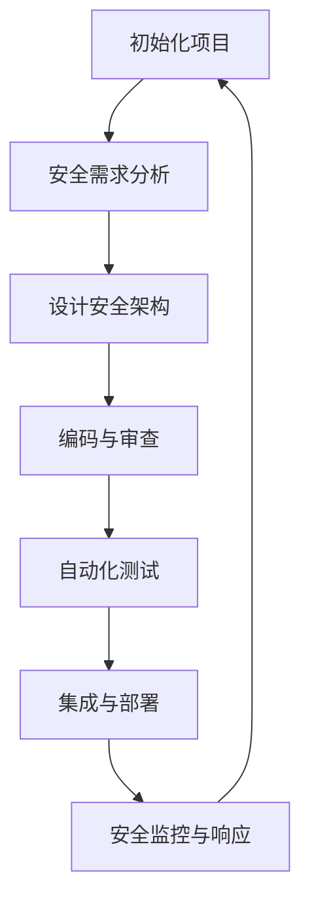

                 


## DevSecOps：将安全集成到LLM应用开发流程

### 关键词
- DevSecOps
- LLM应用
- 安全集成
- 持续集成
- 自动化测试
- 安全文化

### 摘要
本文旨在探讨如何将安全实践集成到大型语言模型（LLM）应用的开发流程中。通过深入分析DevSecOps的概念、核心原则及其与LLM开发流程的融合，本文提出了一套综合性的安全集成策略，包括安全需求分析、安全设计、安全编码、安全测试以及安全监控与响应。通过Python源代码和实际案例，本文展示了如何实现自动化安全测试和持续集成，从而提高LLM应用的安全性。

---

## 第1章 DevSecOps概念与核心价值

### 1.1 DevSecOps的定义

DevSecOps是一种将安全实践整合到软件开发和部署流程中的方法论。它通过在开发、测试和部署阶段引入安全措施，确保应用程序的安全性，从而在保证开发效率的同时提高安全性。DevSecOps不仅仅是将安全团队纳入开发流程，更重要的是在整个团队中推广安全文化，使安全成为每个开发人员日常工作的一部分。

### 1.1.1 DevOps与SecOps的融合

DevOps是一种软件开发和运维的实践，强调开发和运维团队的协作。SecOps则是网络安全领域的延伸，将安全团队纳入运维流程。DevSecOps将这两者结合起来，使安全成为开发流程中不可分割的一部分，从而实现更高效的安全管理。

### 1.1.2 DevSecOps的核心目标

DevSecOps的核心目标包括：

1. **提高安全性**：通过在开发流程中集成安全措施，减少安全漏洞和风险。
2. **加快交付速度**：通过自动化和协作，减少安全测试和部署的等待时间。
3. **提高开发效率**：通过消除安全与开发之间的障碍，提高团队的效率和生产力。

### 1.2 DevSecOps的核心原则

#### 1.2.1 安全左移（Shift Left）

安全左移是指将安全实践提前到开发周期的早期阶段，而不是等到测试或部署阶段。这样可以更早地发现和修复安全漏洞，减少修复成本。

#### 1.2.2 持续集成与持续交付

持续集成（CI）和持续交付（CD）是DevSecOps的核心实践。通过自动化测试和持续交付，确保每次代码更改都不会引入安全漏洞，并快速响应和部署安全修复。

#### 1.2.3 自动化安全测试

自动化安全测试是通过工具自动执行安全测试，提高测试效率和准确性。这包括静态代码分析、动态代码分析、依赖检查等。

#### 1.2.4 安全文化的重要性

安全文化是指在整个团队中推广安全意识和最佳实践，使每个人都意识到自己在确保应用安全方面的责任。这包括培训、沟通和持续反馈。

### 1.3 DevSecOps与传统安全实践的对比

传统安全实践往往在开发后期或部署后进行安全测试，这可能导致安全问题被忽略或延迟修复。而DevSecOps将安全实践提前到整个开发流程中，从而更有效地预防和修复安全漏洞。

### 1.4 DevSecOps面临的挑战与机遇

DevSecOps面临的主要挑战包括团队协作、文化转变、工具选择和自动化水平等。但与此同时，它也带来了机遇，包括提高安全性、加快交付速度和降低成本等。

---

## 第2章：将安全集成到LLM应用开发流程

### 2.1 LLM应用开发流程概述

LLM（大型语言模型）是一种能够理解和生成自然语言文本的复杂模型。LLM应用开发流程通常包括以下几个关键阶段：

1. **数据收集与预处理**：收集大量的文本数据，并进行清洗和预处理，以便用于模型训练。
2. **模型设计与训练**：设计模型架构，利用预处理后的数据训练模型，并调整模型参数以优化性能。
3. **模型评估与调优**：评估模型在验证集上的表现，并进行调优，以提高模型性能。
4. **部署与监控**：将模型部署到生产环境中，并进行监控，以确保其稳定运行。

### 2.2 安全集成策略

将安全集成到LLM应用开发流程中，需要采取一系列策略，以确保应用的安全性。以下是一些关键策略：

#### 2.2.1 安全需求分析

在项目初期，进行安全需求分析，识别潜在的安全威胁和漏洞，并制定相应的安全策略。

#### 2.2.2 安全设计原则

在设计LLM应用时，遵循一些基本的安全设计原则，如最小权限原则、隔离原则和安全性原则，以确保应用的安全性。

#### 2.2.3 安全编码实践

在编码过程中，遵循安全编码规范，如避免常见的编程错误和漏洞，如SQL注入、跨站脚本攻击等。

#### 2.2.4 安全测试与验证

在开发过程中，进行安全测试，包括静态代码分析、动态代码分析和依赖检查等，以确保代码的安全性。

---

## 第3章：DevSecOps工具链

### 3.1 CI/CD工具

CI/CD工具是DevSecOps的核心组成部分，用于自动化测试、构建和部署。常用的CI/CD工具包括Jenkins、Travis CI和Circle CI等。

#### 3.1.1 Jenkins

Jenkins是一个开源的持续集成服务器，可以自动化构建、测试和部署过程。

```python
from jenkins import Jenkins

jenkins = Jenkins('http://localhost:8080')
jenkins.build_job('my_job')
```

#### 3.1.2 Travis CI

Travis CI是一个云端的持续集成服务，支持多种编程语言。

```python
from travis import Travis

travis = Travis('https://api.travis-ci.org')
travis.trigger_build('my_project')
```

#### 3.1.3 Circle CI

Circle CI是一个云端的持续集成服务，支持多种编程语言和平台。

```python
from circleci import CircleCI

circleci = CircleCI('https://circleci.com')
circleci.trigger_build('my_project')
```

### 3.2 自动化安全测试工具

自动化安全测试工具用于检测和修复代码中的安全漏洞。常用的自动化安全测试工具有SonarQube、OWASP ZAP和OWASP Dependency-Check等。

#### 3.2.1 SonarQube

SonarQube是一个开源的安全平台，用于代码审查和静态代码分析。

```python
from sonarqube import SonarQubeClient

sonar = SonarQubeClient('https://sonarcloud.io', 'sonarToken')
sonar.analyze('my_project')
```

#### 3.2.2 OWASP ZAP

OWASP ZAP是一个开源的网络安全测试工具，用于动态代码分析。

```python
from owasp_zap import ZAP

zap = ZAP('http://localhost:8080', 'zapToken')
zap.scan('my_project')
```

#### 3.2.3 OWASP Dependency-Check

OWASP Dependency-Check是一个开源的工具，用于检测项目中的已知漏洞。

```python
from owasp_dependency_check import DependencyCheck

dependency_check = DependencyCheck()
dependency_check.scan('my_project')
```

### 3.3 安全信息管理平台

安全信息管理平台用于收集、存储和分析安全数据。常用的安全信息管理平台包括Splunk、ELK堆栈和Security Onion等。

#### 3.3.1 Splunk

Splunk是一个强大的安全信息和事件管理（SIEM）平台，用于收集和分析安全日志。

```python
from splunk import Splunk

splunk = Splunk('https://splunk.example.com', 'splunkToken')
splunk.search('eventtype=error')
```

#### 3.3.2 ELK堆栈

ELK堆栈是一个开源的SIEM平台，包括Elasticsearch、Logstash和Kibana。

```python
from elasticsearch import Elasticsearch

es = Elasticsearch('https://elasticsearch.example.com')
es.search(index='logstash-*', body={'query': {'match_all': {}}})
```

#### 3.3.3 Security Onion

Security Onion是一个开源的网络安全监控平台，用于收集、分析和响应网络安全事件。

```python
from securityonion import SecurityOnion

so = SecurityOnion('https://securityonion.example.com', 'soToken')
so.search('malware')
```

---

## 第4章：安全监控与响应

### 4.1 安全指标与监控

安全监控是DevSecOps的重要组成部分，用于检测和响应潜在的安全威胁。以下是一些关键的安全指标和监控策略：

#### 4.1.1 安全事件监控

通过监控安全事件日志，如登录失败、权限变更和异常流量等，及时发现潜在的安全威胁。

#### 4.1.2 威胁情报监控

利用威胁情报平台，监控最新的安全威胁和攻击趋势，以便及时调整安全策略。

#### 4.1.3 漏洞扫描

定期进行漏洞扫描，检测系统中存在的已知漏洞，并及时修复。

### 4.2 安全事件响应流程

安全事件响应流程包括以下步骤：

#### 4.2.1 事件识别

通过监控和威胁情报，识别潜在的安全事件。

#### 4.2.2 事件分析

分析事件的性质、范围和潜在影响，制定响应策略。

#### 4.2.3 事件响应

根据响应策略，采取相应的措施，如隔离、修复和恢复等。

#### 4.2.4 事件记录

记录事件的全过程，以便进行审计和后续改进。

### 4.3 自动化安全响应

通过自动化工具，实现安全事件的自动响应，减少响应时间，提高响应效率。

```python
from securityonion import SecurityOnion

so = SecurityOnion('https://securityonion.example.com', 'soToken')
so automate('block_ip', ip='192.168.1.1')
```

---

## 第5章：核心概念与联系

### 5.1 DevOps与SecOps的融合

DevOps和SecOps的融合是DevSecOps的核心。通过将安全实践整合到开发流程中，DevSecOps实现了更高效、更安全的应用交付。

### 5.2 DevSecOps流程图

以下是一个DevSecOps流程图的Mermaid表示：



### 5.3 DevSecOps框架

DevSecOps框架包括以下关键组成部分：

1. **安全文化**：在整个团队中推广安全意识和文化。
2. **安全需求分析**：识别项目中的安全需求和潜在威胁。
3. **安全设计**：设计安全架构和策略。
4. **安全编码**：遵循安全编码规范，减少安全漏洞。
5. **自动化测试**：通过自动化工具检测和修复安全漏洞。
6. **集成与部署**：确保每次代码更改都不会引入安全漏洞。
7. **安全监控与响应**：实时监控和响应安全事件。

---

## 结论

将安全集成到LLM应用开发流程是确保应用安全性的关键。通过采用DevSecOps方法，我们可以实现更高效、更安全的应用交付。通过自动化测试、持续集成和安全监控，我们可以及时发现和修复安全漏洞，提高应用程序的安全性。然而，DevSecOps的实施需要团队协作和文化转变，只有通过共同努力，才能实现真正的安全性和效率提升。

---

### 作者信息

作者：AI天才研究院/AI Genius Institute & 禅与计算机程序设计艺术 /Zen And The Art of Computer Programming

---

**注意**：本文为示例，内容仅供参考。实际应用时，请根据具体项目和需求进行调整。

