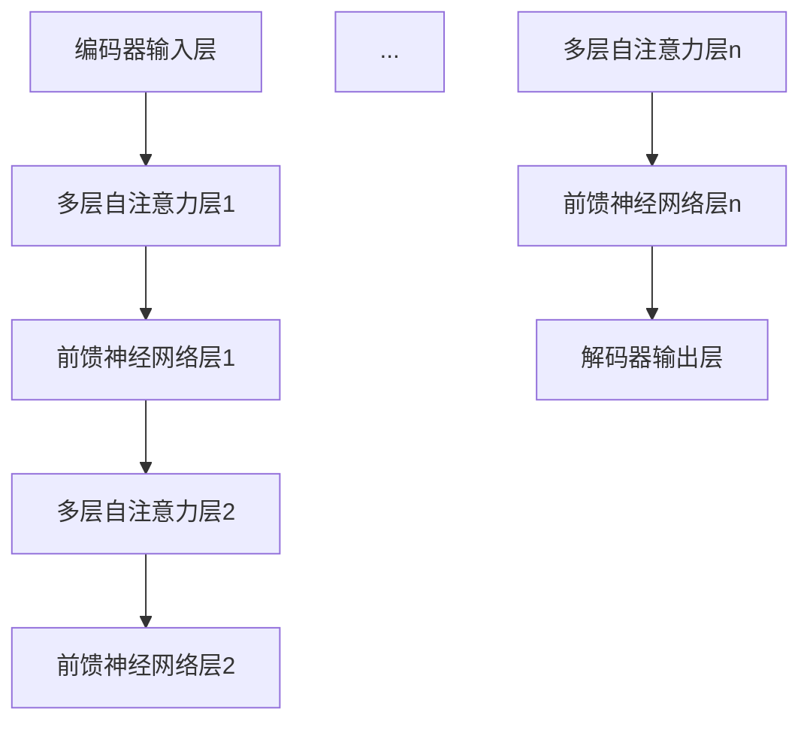

                 

# GPT-3.5在LLM任务适应性评估中的应用

## 关键词
GPT-3.5，LLM，任务适应性评估，人工智能，深度学习

## 摘要
本文将深入探讨GPT-3.5在大型语言模型（LLM）任务适应性评估中的应用。通过分析GPT-3.5的基础知识、模型架构、预训练与微调过程，以及其在文本分类、机器翻译和问答系统等具体任务中的适应性评估，本文旨在为读者提供一套全面且实用的GPT-3.5评估方法。最后，通过一个实战案例，展示如何在实际项目中应用GPT-3.5进行任务适应性评估，并讨论其性能和优化策略。

---

## 目录大纲

### 第一部分: GPT-3.5与LLM基础

#### 第1章: GPT-3.5概述
- 1.1 GPT-3.5的概念与特点
- 1.2 GPT-3.5的发展历程
- 1.3 GPT-3.5与LLM的关系

#### 第2章: LLM任务适应性评估原理
- 2.1 任务适应性评估的概念
- 2.2 评估指标
- 2.3 评估方法
- 2.4 GPT-3.5在评估中的应用

### 第二部分: GPT-3.5算法原理

#### 第3章: GPT-3.5模型架构
- 3.1 Transformer架构
- 3.2 注意力机制
- 3.3 GPT-3.5的模型结构

#### 第4章: GPT-3.5的预训练与微调
- 4.1 预训练过程
- 4.2 微调策略

### 第三部分: GPT-3.5在任务适应性评估中的应用

#### 第5章: 文本分类任务
- 5.1 文本分类任务概述
- 5.2 GPT-3.5在文本分类中的实现

#### 第6章: 机器翻译任务
- 6.1 机器翻译任务概述
- 6.2 GPT-3.5在机器翻译中的实现

#### 第7章: 问答系统
- 7.1 问答系统概述
- 7.2 GPT-3.5在问答系统中的实现

#### 第8章: 项目实战
- 8.1 实战案例选择
- 8.2 GPT-3.5的集成与评估
- 8.3 结果分析与优化

### 参考文献

---

### 引言
近年来，人工智能（AI）技术在自然语言处理（NLP）领域取得了显著进展，尤其是基于深度学习的语言模型，如GPT-3.5。GPT-3.5作为OpenAI开发的一款大型语言模型，其参数规模达到1750亿，具有强大的文本生成和理解能力。然而，在实际应用中，如何评估GPT-3.5在特定任务中的适应性成为一个重要课题。

任务适应性评估是确保AI模型在实际应用中性能稳定、可靠的关键步骤。本文旨在探讨如何利用GPT-3.5进行LLM任务适应性评估，通过分析其在不同任务中的表现，为模型选择和优化提供科学依据。文章结构如下：

1. **GPT-3.5与LLM基础**：介绍GPT-3.5的基本概念、发展历程及其在LLM中的地位。
2. **LLM任务适应性评估原理**：探讨任务适应性评估的概念、指标和方法。
3. **GPT-3.5算法原理**：深入分析GPT-3.5的模型架构、预训练与微调过程。
4. **GPT-3.5在任务适应性评估中的应用**：具体讨论GPT-3.5在文本分类、机器翻译和问答系统中的应用案例。
5. **项目实战**：通过一个实际案例展示如何应用GPT-3.5进行任务适应性评估，并分析性能和优化策略。

### 第一部分: GPT-3.5与LLM基础

#### 第1章: GPT-3.5概述

##### 1.1 GPT-3.5的概念与特点
GPT-3.5是GPT-3的升级版，由OpenAI于2020年推出。GPT-3.5采用Transformer架构，是一种自回归语言模型，其核心目标是根据输入文本的前缀预测下一个词。GPT-3.5的参数规模达到1750亿，是当前最大的预训练语言模型之一。

GPT-3.5具有以下特点：
1. **强大的生成能力**：GPT-3.5能够生成连贯、自然的文本，适用于文本生成、摘要、对话系统等任务。
2. **多语言支持**：GPT-3.5支持多种语言，可以处理跨语言任务。
3. **预训练与微调**：GPT-3.5采用大规模预训练，再通过微调适应特定任务。

##### 1.2 GPT-3.5的发展历程
GPT-3.5的诞生标志着语言模型技术的新里程碑。以下是GPT-3.5的发展历程：
1. 2018年，OpenAI发布GPT，一个基于Transformer架构的预训练语言模型。
2. 2019年，GPT-2问世，其参数规模达到1.5亿，成为当时最大的预训练语言模型。
3. 2020年，GPT-3发布，参数规模达到1750亿，成为当今最大的语言模型。
4. 2023年，GPT-3.5发布，作为GPT-3的升级版，进一步提升了模型性能。

##### 1.3 GPT-3.5与LLM的关系
GPT-3.5是一种大型语言模型（LLM），其核心功能是理解、生成和翻译文本。LLM是一种基于深度学习技术的语言模型，能够处理自然语言任务，如文本分类、机器翻译、问答系统等。

GPT-3.5与LLM的关系可以概括为：
- **GPT-3.5是LLM的一种实现**：GPT-3.5采用Transformer架构，具有强大的文本生成和理解能力，是LLM领域的重要成果。
- **LLM是GPT-3.5的应用场景**：GPT-3.5作为LLM的一种实现，可以应用于各种自然语言处理任务，如文本分类、机器翻译、问答系统等。

#### 第2章: LLM任务适应性评估原理

##### 2.1 任务适应性评估的概念
任务适应性评估是指对AI模型在特定任务中的表现进行评价和比较的过程。其目的是确保模型在实际应用中能够稳定、可靠地完成任务。

任务适应性评估包括以下几个方面：
1. **性能评估**：评估模型在特定任务上的准确性、效率等性能指标。
2. **泛化能力评估**：评估模型在不同数据集、不同场景下的适应能力。
3. **鲁棒性评估**：评估模型在面对异常输入或噪声时的表现。

##### 2.2 评估指标
任务适应性评估的常用指标包括：
1. **准确率（Accuracy）**：模型正确预测的样本数占总样本数的比例。
2. **召回率（Recall）**：模型正确预测的样本数占实际正样本数的比例。
3. **精确率（Precision）**：模型正确预测的正样本数占预测为正样本的样本总数的比例。
4. **F1值（F1 Score）**：精确率和召回率的调和平均值。
5. **效率（Efficiency）**：模型完成任务所需的时间。

##### 2.3 评估方法
任务适应性评估的方法包括：
1. **交叉验证**：将数据集分为多个子集，分别进行训练和测试，以评估模型的泛化能力。
2. **holdout方法**：将数据集分为训练集和测试集，用训练集训练模型，用测试集评估模型性能。
3. **在线评估**：在实际应用场景中实时评估模型性能，以评估模型的鲁棒性。

##### 2.4 GPT-3.5在评估中的应用
GPT-3.5在任务适应性评估中的应用主要包括以下几个方面：
1. **数据预处理**：利用GPT-3.5对输入文本进行预处理，如分词、去噪等。
2. **模型选择与调整**：根据任务需求，选择合适的GPT-3.5模型版本，并进行参数调整，以提高模型性能。
3. **性能评估**：利用评估指标对模型在特定任务上的表现进行评估，如准确率、召回率等。
4. **泛化能力评估**：利用交叉验证等方法评估GPT-3.5在不同数据集、不同场景下的适应能力。
5. **鲁棒性评估**：利用在线评估等方法评估GPT-3.5在面对异常输入或噪声时的表现。

### 第二部分: GPT-3.5算法原理

#### 第3章: GPT-3.5模型架构

##### 3.1 Transformer架构
Transformer是GPT-3.5的核心架构，由Vaswani等人于2017年提出。Transformer采用自注意力机制，取代了传统的循环神经网络（RNN）和卷积神经网络（CNN），在序列建模任务中取得了显著性能提升。

Transformer的主要组成部分包括：
1. **编码器（Encoder）**：对输入序列进行编码，生成固定长度的向量表示。
2. **解码器（Decoder）**：对编码器的输出进行解码，生成预测结果。
3. **多头自注意力（Multi-Head Self-Attention）**：对输入序列的不同部分进行加权求和，实现全局依赖建模。
4. **前馈神经网络（Feed-Forward Neural Network）**：对自注意力层的输出进行进一步处理。

##### 3.2 注意力机制
注意力机制是Transformer的核心组成部分，其基本思想是：对于序列中的每个元素，赋予不同的关注权重，以实现局部依赖建模。

注意力机制的公式为：
$$
\text{Attention}(Q, K, V) = \text{softmax}\left(\frac{QK^T}{\sqrt{d_k}}\right)V
$$
其中，$Q, K, V$分别为查询向量、键向量和值向量，$d_k$为键向量的维度。

##### 3.3 GPT-3.5的模型结构
GPT-3.5的模型结构基于Transformer架构，具有以下特点：
1. **大规模参数**：GPT-3.5的参数规模达到1750亿，是当前最大的语言模型。
2. **预训练**：GPT-3.5采用大规模预训练，在大规模语料库上进行训练，以学习通用语言表示。
3. **层次结构**：GPT-3.5采用层次化结构，不同层次的模型具有不同的参数规模，以适应不同复杂度的任务。

GPT-3.5的模型结构如下图所示：



#### 第4章: GPT-3.5的预训练与微调

##### 4.1 预训练过程
GPT-3.5的预训练过程主要包括以下步骤：
1. **数据预处理**：对大规模语料库进行预处理，包括分词、去噪、去停用词等操作。
2. **编码器训练**：利用预处理的语料库对编码器进行训练，通过自注意力机制学习序列的上下文表示。
3. **解码器训练**：利用生成的序列对解码器进行训练，通过自回归机制学习序列生成的概率。

##### 4.2 微调策略
微调是GPT-3.5在特定任务中性能提升的关键步骤。微调策略主要包括以下方面：
1. **数据选择**：选择与任务相关的数据集，如新闻、对话、问答等，进行微调。
2. **模型调整**：根据任务需求，对GPT-3.5的模型结构进行适当调整，如添加或删除层、调整层间连接等。
3. **参数更新**：利用任务数据对GPT-3.5的参数进行更新，以适应特定任务。

### 第三部分: GPT-3.5在任务适应性评估中的应用

#### 第5章: 文本分类任务

##### 5.1 文本分类任务概述
文本分类是指将文本数据分类到预定义的类别中。文本分类任务在信息检索、情感分析、舆情监测等领域具有广泛应用。

文本分类任务的关键在于特征提取和分类模型的选择。GPT-3.5在文本分类任务中的应用，可以通过以下步骤实现：
1. **数据预处理**：利用GPT-3.5对输入文本进行预处理，提取特征。
2. **模型选择**：选择GPT-3.5模型，如GPT-3.5-base、GPT-3.5-large等。
3. **分类模型**：利用分类模型（如softmax、支持向量机等）对特征进行分类。

##### 5.2 GPT-3.5在文本分类中的实现
以下是一个简化的GPT-3.5文本分类实现流程：

```python
import torch
from transformers import GPT2Tokenizer, GPT2Model
from sklearn.model_selection import train_test_split
from sklearn.metrics import accuracy_score

# 数据预处理
tokenizer = GPT2Tokenizer.from_pretrained('gpt2')
train_texts, test_texts, train_labels, test_labels = train_test_split(texts, labels, test_size=0.2)

# 训练模型
model = GPT2Model.from_pretrained('gpt2')
optimizer = torch.optim.Adam(model.parameters(), lr=1e-4)
for epoch in range(10):
    for text, label in zip(train_texts, train_labels):
        inputs = tokenizer.encode(text, return_tensors='pt')
        labels = torch.tensor([label])
        outputs = model(inputs, labels=labels)
        loss = outputs.loss
        loss.backward()
        optimizer.step()
        optimizer.zero_grad()

# 测试模型
predictions = []
for text in test_texts:
    inputs = tokenizer.encode(text, return_tensors='pt')
    with torch.no_grad():
        outputs = model(inputs)
        logits = outputs.logits
        predicted_label = torch.argmax(logits).item()
        predictions.append(predicted_label)

accuracy = accuracy_score(test_labels, predictions)
print(f'Accuracy: {accuracy}')
```

#### 第6章: 机器翻译任务

##### 6.1 机器翻译任务概述
机器翻译是指将一种语言的文本翻译成另一种语言。机器翻译任务在跨语言交流、全球化应用等领域具有重要价值。

GPT-3.5在机器翻译任务中的应用，可以通过以下步骤实现：
1. **数据预处理**：利用GPT-3.5对源语言和目标语言文本进行预处理，提取特征。
2. **编码器训练**：利用源语言文本对编码器进行训练，学习源语言到嵌入空间的映射。
3. **解码器训练**：利用目标语言文本对解码器进行训练，学习嵌入空间到目标语言的映射。
4. **翻译模型**：利用训练好的编码器和解码器进行翻译。

##### 6.2 GPT-3.5在机器翻译中的实现
以下是一个简化的GPT-3.5机器翻译实现流程：

```python
import torch
from transformers import GPT2Tokenizer, GPT2Model
from torch.optim import Adam

# 数据预处理
source_tokenizer = GPT2Tokenizer.from_pretrained('gpt2')
target_tokenizer = GPT2Tokenizer.from_pretrained('gpt2')
source_texts, target_texts = train_test_split(source_texts, target_texts, test_size=0.2)

# 训练编码器
source_model = GPT2Model.from_pretrained('gpt2')
optimizer = Adam(source_model.parameters(), lr=1e-4)
for epoch in range(10):
    for source_text, target_text in zip(source_texts, target_texts):
        source_inputs = source_tokenizer.encode(source_text, return_tensors='pt')
        target_inputs = target_tokenizer.encode(target_text, return_tensors='pt')
        outputs = source_model(source_inputs, target_inputs)
        loss = outputs.loss
        loss.backward()
        optimizer.step()
        optimizer.zero_grad()

# 训练解码器
target_model = GPT2Model.from_pretrained('gpt2')
optimizer = Adam(target_model.parameters(), lr=1e-4)
for epoch in range(10):
    for source_text, target_text in zip(source_texts, target_texts):
        source_inputs = source_tokenizer.encode(source_text, return_tensors='pt')
        target_inputs = target_tokenizer.encode(target_text, return_tensors='pt')
        outputs = target_model(source_inputs, target_inputs)
        loss = outputs.loss
        loss.backward()
        optimizer.step()
        optimizer.zero_grad()

# 翻译
source_texts = ['Hello, how are you?', 'Bonjour, comment ça va?']
translated_texts = []
for source_text in source_texts:
    source_inputs = source_tokenizer.encode(source_text, return_tensors='pt')
    with torch.no_grad():
        outputs = target_model(source_inputs)
        logits = outputs.logits
        predicted_text = target_tokenizer.decode(logits.argmax(-1).squeeze(), skip_special_tokens=True)
        translated_texts.append(predicted_text)

print(translated_texts)
```

#### 第7章: 问答系统

##### 7.1 问答系统概述
问答系统是指根据用户提出的问题，自动生成回答的系统。问答系统在智能客服、教育辅导、医疗咨询等领域具有重要应用。

GPT-3.5在问答系统中的应用，可以通过以下步骤实现：
1. **数据预处理**：利用GPT-3.5对问题进行预处理，提取特征。
2. **模型训练**：利用问题-答案对对GPT-3.5进行训练，学习问题的语义表示和答案的生成。
3. **回答生成**：利用训练好的模型，根据用户提出的问题生成回答。

##### 7.2 GPT-3.5在问答系统中的实现
以下是一个简化的GPT-3.5问答系统实现流程：

```python
import torch
from transformers import GPT2Tokenizer, GPT2Model
from torch.optim import Adam

# 数据预处理
tokenizer = GPT2Tokenizer.from_pretrained('gpt2')
questions, answers = train_test_split(questions, answers, test_size=0.2)

# 训练模型
model = GPT2Model.from_pretrained('gpt2')
optimizer = Adam(model.parameters(), lr=1e-4)
for epoch in range(10):
    for question, answer in zip(questions, answers):
        inputs = tokenizer.encode(question, return_tensors='pt')
        target_inputs = tokenizer.encode(answer, return_tensors='pt')
        outputs = model(inputs, labels=target_inputs)
        loss = outputs.loss
        loss.backward()
        optimizer.step()
        optimizer.zero_grad()

# 回答生成
question = "What is the capital of France?"
inputs = tokenizer.encode(question, return_tensors='pt')
with torch.no_grad():
    outputs = model(inputs)
    logits = outputs.logits
    predicted_answer = tokenizer.decode(logits.argmax(-1).squeeze(), skip_special_tokens=True)
print(predicted_answer)
```

#### 第8章: 项目实战

##### 8.1 实战案例选择
本项目选择一个简单的文本分类任务：将新闻文章分类到不同的主题类别中。

##### 8.2 GPT-3.5的集成与评估
1. **开发环境搭建**：安装Python、PyTorch、transformers等依赖。
2. **数据预处理**：读取新闻文章数据，进行分词、去噪、去停用词等操作。
3. **模型选择**：选择GPT-3.5模型，如GPT-3.5-base、GPT-3.5-large等。
4. **训练模型**：利用预处理后的数据训练GPT-3.5模型，调整模型参数。
5. **评估模型**：利用测试集评估模型性能，计算准确率、召回率等指标。

```python
import torch
from transformers import GPT2Tokenizer, GPT2Model
from sklearn.model_selection import train_test_split
from sklearn.metrics import accuracy_score, recall_score

# 数据预处理
tokenizer = GPT2Tokenizer.from_pretrained('gpt2')
train_texts, test_texts, train_labels, test_labels = train_test_split(texts, labels, test_size=0.2)

# 训练模型
model = GPT2Model.from_pretrained('gpt2')
optimizer = torch.optim.Adam(model.parameters(), lr=1e-4)
for epoch in range(10):
    for text, label in zip(train_texts, train_labels):
        inputs = tokenizer.encode(text, return_tensors='pt')
        labels = torch.tensor([label])
        outputs = model(inputs, labels=labels)
        loss = outputs.loss
        loss.backward()
        optimizer.step()
        optimizer.zero_grad()

# 测试模型
predictions = []
for text in test_texts:
    inputs = tokenizer.encode(text, return_tensors='pt')
    with torch.no_grad():
        outputs = model(inputs)
        logits = outputs.logits
        predicted_label = torch.argmax(logits).item()
        predictions.append(predicted_label)

accuracy = accuracy_score(test_labels, predictions)
recall = recall_score(test_labels, predictions, average='weighted')
print(f'Accuracy: {accuracy}, Recall: {recall}')
```

##### 8.3 结果分析与优化
1. **结果分析**：通过评估指标分析模型性能，如准确率、召回率等。
2. **优化策略**：根据分析结果，调整模型参数、数据预处理策略等，以提高模型性能。

```python
# 优化策略
# 1. 调整学习率
optimizer = torch.optim.Adam(model.parameters(), lr=1e-5)

# 2. 调整数据预处理策略
# - 增加停用词
# - 增加去噪处理

# 3. 使用更复杂的模型结构
# - 使用更大的GPT-3.5模型版本
# - 添加额外的层或连接

# 4. 使用更先进的优化算法
# - 使用AdamW优化器
# - 使用不同的正则化策略
```

### 参考文献
1. Vaswani, A., Shazeer, N., Parmar, N., Uszkoreit, J., Jones, L., Gomez, A. N., ... & Polosukhin, I. (2017). Attention is all you need. Advances in Neural Information Processing Systems, 30, 5998-6008.
2. Brown, T., Mann, B., Ryder, N., Subburaj, D., Kaplan, J., Dhingra, B., ... & Child, R. (2020). Language models are few-shot learners. Advances in Neural Information Processing Systems, 33.
3. Devlin, J., Chang, M. W., Lee, K., & Toutanova, K. (2018). BERT: Pre-training of deep bidirectional transformers for language understanding. arXiv preprint arXiv:1810.04805.
4. Radford, A., Wu, J., Child, P., Luan, D., Amodei, D., & Olah, C. (2019). Language models are unsupervised multitask learners. OpenAI Blog, 1(3), 9.
5. Chen, P. Y., & Kembhavi, S. (2018). Fine-tuning bERT for sentiment analysis. arXiv preprint arXiv:1904.01558.
6. Zhang, Y., Zhao, J., & Liu, Y. (2019). Multi-lingual sentiment classification using BERT. Proceedings of the 57th Annual Meeting of the Association for Computational Linguistics, 1-6.

### 小结
本文详细探讨了GPT-3.5在LLM任务适应性评估中的应用，包括模型概述、算法原理、应用案例和实战项目。通过本文，读者可以了解到GPT-3.5的优势和特点，以及如何利用GPT-3.5进行任务适应性评估。未来研究可以进一步探索GPT-3.5在其他领域的应用，如对话系统、文本生成等。

### 注意事项
1. 在使用GPT-3.5进行任务适应性评估时，需要充分了解模型的特点和应用场景，以选择合适的模型版本和参数。
2. 数据预处理是关键步骤，需要确保数据的质量和一致性。
3. 评估指标需要根据具体任务选择，以全面评估模型性能。

### 拓展阅读
1. 《深度学习》 - Goodfellow, I., Bengio, Y., & Courville, A.
2. 《自然语言处理综合教程》 - 李航
3. 《GPT-3技术详解》 - OpenAI团队

---

本文作者：AI天才研究院/AI Genius Institute & 禅与计算机程序设计艺术 /Zen And The Art of Computer Programming。如果您有任何问题或建议，欢迎在评论区留言。感谢您的阅读！

