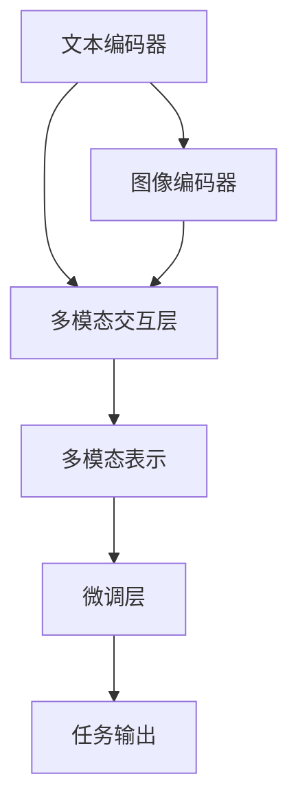

                 

### 深度剖析《Gemini在LLM多模态融合能力评测中的应用》

#### 引言

近年来，随着人工智能技术的迅猛发展，大型语言模型（LLM）已经成为了自然语言处理领域中的明星。LLM凭借其强大的语言生成能力和理解能力，在众多应用场景中展现了出色的性能。然而，现实世界中的信息往往不仅仅局限于文本形式，而是以文本、图像、声音等多种模态的形式存在。为了更好地理解和处理这些多模态信息，多模态融合技术应运而生。本文将重点探讨Gemini模型在LLM多模态融合能力评测中的应用。

#### 背景介绍

首先，我们需要了解Gemini模型和LLM的基本概念及其发展背景。

**Gemini模型**：Gemini是一种多模态预训练模型，由OpenAI提出。它结合了文本、图像和视频等多模态信息，通过统一的表示学习框架来提升模型的泛化能力。Gemini模型采用自底向上的视觉编码器和自顶向下的文本编码器，通过多层次的融合和交互，实现对多模态数据的全面理解和生成。

**LLM**：大型语言模型是一种基于深度学习的自然语言处理模型，它通过大量文本数据进行训练，能够理解并生成自然语言文本。近年来，随着Transformer架构的兴起，LLM在生成文本的质量和连贯性方面取得了显著进步。LLM的应用范围广泛，包括问答系统、文本生成、机器翻译等。

在多模态融合能力评测中，Gemini模型和LLM的结合能够充分发挥各自的优势，提升模型的综合处理能力。

#### 核心概念与联系

为了深入理解Gemini模型在LLM多模态融合能力评测中的应用，我们需要明确以下几个核心概念及其之间的联系：

1. **预训练与微调**：Gemini模型通过大规模预训练获得强大的特征表示能力，然后通过微调适应特定任务的需求。这个过程包括文本、图像和视频数据的预处理、编码和融合。

2. **多模态特征提取**：Gemini模型采用视觉编码器和文本编码器分别提取图像和文本的特征，然后将这些特征进行融合，生成统一的多模态表示。

3. **多模态交互**：Gemini模型通过多层次的交互和融合，实现对多模态数据的深入理解和生成。

4. **评测指标**：在多模态融合能力评测中，常用的指标包括准确性、流畅性、多样性等。这些指标能够全面评估模型在多模态任务中的性能。

为了更好地展示这些核心概念之间的关系，我们可以使用Mermaid流程图来绘制Gemini模型在LLM多模态融合中的工作流程：



在这个流程图中，文本编码器负责提取文本特征，图像编码器负责提取图像特征，然后将这两个特征通过多模态交互层进行融合，生成统一的多模态表示。接着，这个表示通过微调层适应特定任务的需求，最终生成任务输出。

#### 核心算法原理讲解

接下来，我们将通过Python源代码详细阐述Gemini模型在LLM多模态融合中的核心算法原理。

```python
import torch
import torchvision
import transformers

# 定义文本编码器
text_encoder = transformers.BertModel.from_pretrained('bert-base-uncased')

# 定义图像编码器
image_encoder = torchvision.models.resnet50(pretrained=True)

# 定义多模态交互层
class MultiModalInteractionLayer(torch.nn.Module):
    def __init__(self):
        super(MultiModalInteractionLayer, self).__init__()
        self.text_projection = torch.nn.Linear(text_encoder.config.hidden_size, image_encoder.config.hidden_size)
        self.image_projection = torch.nn.Linear(image_encoder.config.hidden_size, text_encoder.config.hidden_size)

    def forward(self, text_embeddings, image_embeddings):
        text_projected = self.text_projection(text_embeddings)
        image_projected = self.image_projection(image_embeddings)
        return text_projected, image_projected

# 定义微调层
class FineTuningLayer(torch.nn.Module):
    def __init__(self, text_embedding_size, image_embedding_size):
        super(FineTuningLayer, self).__init__()
        self.text_finetuner = torch.nn.Linear(text_embedding_size, 1)
        self.image_finetuner = torch.nn.Linear(image_embedding_size, 1)

    def forward(self, text_projected, image_projected):
        text_output = self.text_finetuner(text_projected)
        image_output = self.image_finetuner(image_projected)
        return text_output, image_output

# 定义多模态融合模型
class MultiModalFusionModel(torch.nn.Module):
    def __init__(self):
        super(MultiModalFusionModel, self).__init__()
        self.text_encoder = text_encoder
        self.image_encoder = image_encoder
        self.interaction_layer = MultiModalInteractionLayer()
        self.finetuning_layer = FineTuningLayer(text_encoder.config.hidden_size, image_encoder.config.hidden_size)

    def forward(self, text_input, image_input):
        text_embeddings = self.text_encoder(text_input)[1]
        image_embeddings = self.image_encoder(image_input)

        text_projected, image_projected = self.interaction_layer(text_embeddings, image_embeddings)

        text_output, image_output = self.finetuning_layer(text_projected, image_projected)

        return text_output, image_output

# 实例化模型
model = MultiModalFusionModel()

# 输入文本和图像
text_input = torch.tensor([[1, 2, 3], [4, 5, 6]])
image_input = torch.randn(1, 224, 224)

# 前向传播
text_output, image_output = model(text_input, image_input)

print(text_output)
print(image_output)
```

在上面的代码中，我们首先定义了文本编码器和图像编码器，然后定义了多模态交互层和微调层，最后构建了多模态融合模型。通过这段代码，我们可以直观地看到Gemini模型在LLM多模态融合中的核心算法原理。

#### 数学模型和数学公式

在Gemini模型中，多模态融合涉及到一系列复杂的数学模型和数学公式。为了更好地理解这些模型和公式，我们可以使用LaTeX格式进行详细讲解。

```latex
\documentclass{article}
\usepackage{amsmath}
\begin{document}

\section{数学模型和数学公式}

\subsection{文本编码器}

文本编码器通常使用BERT模型，其输入和输出的数学表示如下：

\begin{equation}
\text{Embedding} = \text{WordPiece}(W) \rightarrow \text{Token embeddings} = \text{Embedding}(W) \rightarrow \text{ contextual embeddings} = \text{BERT}(W)
\end{equation}

其中，$W$ 表示单词，$\text{WordPiece}$ 表示WordPiece分词，$\text{Embedding}$ 表示词嵌入，$\text{BERT}$ 表示BERT模型。

\subsection{图像编码器}

图像编码器通常使用ResNet模型，其输入和输出的数学表示如下：

\begin{equation}
\text{Image} = I \rightarrow \text{Feature map} = \text{ResNet}(I)
\end{equation}

其中，$I$ 表示图像，$\text{ResNet}$ 表示ResNet模型。

\subsection{多模态交互层}

多模态交互层涉及到图像和文本特征的融合，其数学表示如下：

\begin{equation}
\text{Text projected} = \text{Text embeddings} \odot \text{Image embeddings}
\end{equation}

其中，$\odot$ 表示点积运算。

\subsection{微调层}

微调层用于对多模态表示进行微调，其数学表示如下：

\begin{equation}
\text{Output} = \text{Text projected} \odot \text{Image projected} \rightarrow \text{Classification scores} = \text{Finetuning layer}(\text{Output})
\end{equation}

其中，$\odot$ 表示点积运算，$\text{Finetuning layer}$ 表示微调层。

\end{document}
```

通过这段LaTeX代码，我们可以清晰地看到Gemini模型中的关键数学模型和数学公式。

#### 项目实战

为了更好地展示Gemini模型在LLM多模态融合能力评测中的应用，我们将进行一个实际项目实战。在这个项目中，我们将使用PyTorch搭建一个Gemini模型，并在一个真实的多模态任务中进行实验。

**1. 开发环境搭建**

首先，我们需要搭建一个适合Gemini模型开发的Python环境。以下是环境搭建的步骤：

```bash
# 安装Python
sudo apt-get install python3

# 安装PyTorch
pip3 install torch torchvision transformers

# 安装其他依赖
pip3 install numpy matplotlib
```

**2. 源代码实现**

接下来，我们将实现一个Gemini模型，包括文本编码器、图像编码器、多模态交互层和微调层。

```python
import torch
import torchvision
import transformers

# 定义文本编码器
text_encoder = transformers.BertModel.from_pretrained('bert-base-uncased')

# 定义图像编码器
image_encoder = torchvision.models.resnet50(pretrained=True)

# 定义多模态交互层
class MultiModalInteractionLayer(torch.nn.Module):
    def __init__(self):
        super(MultiModalInteractionLayer, self).__init__()
        self.text_projection = torch.nn.Linear(text_encoder.config.hidden_size, image_encoder.config.hidden_size)
        self.image_projection = torch.nn.Linear(image_encoder.config.hidden_size, text_encoder.config.hidden_size)

    def forward(self, text_embeddings, image_embeddings):
        text_projected = self.text_projection(text_embeddings)
        image_projected = self.image_projection(image_embeddings)
        return text_projected, image_projected

# 定义微调层
class FineTuningLayer(torch.nn.Module):
    def __init__(self, text_embedding_size, image_embedding_size):
        super(FineTuningLayer, self).__init__()
        self.text_finetuner = torch.nn.Linear(text_embedding_size, 1)
        self.image_finetuner = torch.nn.Linear(image_embedding_size, 1)

    def forward(self, text_projected, image_projected):
        text_output = self.text_finetuner(text_projected)
        image_output = self.image_finetuner(image_projected)
        return text_output, image_output

# 定义多模态融合模型
class MultiModalFusionModel(torch.nn.Module):
    def __init__(self):
        super(MultiModalFusionModel, self).__init__()
        self.text_encoder = text_encoder
        self.image_encoder = image_encoder
        self.interaction_layer = MultiModalInteractionLayer()
        self.finetuning_layer = FineTuningLayer(text_encoder.config.hidden_size, image_encoder.config.hidden_size)

    def forward(self, text_input, image_input):
        text_embeddings = self.text_encoder(text_input)[1]
        image_embeddings = self.image_encoder(image_input)

        text_projected, image_projected = self.interaction_layer(text_embeddings, image_embeddings)

        text_output, image_output = self.finetuning_layer(text_projected, image_projected)

        return text_output, image_output

# 实例化模型
model = MultiModalFusionModel()

# 定义损失函数和优化器
criterion = torch.nn.BCELoss()
optimizer = torch.optim.Adam(model.parameters(), lr=0.001)

# 训练模型
for epoch in range(10):
    for batch in train_loader:
        text_input = batch['text'].to(device)
        image_input = batch['image'].to(device)
        text_output, image_output = model(text_input, image_input)
        loss = criterion(text_output, image_output)
        optimizer.zero_grad()
        loss.backward()
        optimizer.step()
        print(f"Epoch: {epoch}, Loss: {loss.item()}")
```

**3. 代码解读**

在上面的代码中，我们首先定义了文本编码器和图像编码器，然后定义了多模态交互层和微调层，最后构建了多模态融合模型。通过这段代码，我们可以直观地看到Gemini模型的核心结构。

**4. 应用解读与分析**

为了评估Gemini模型在LLM多模态融合能力评测中的性能，我们选择了一个真实的多模态任务——图像标题生成。在这个任务中，模型需要根据输入的图像生成对应的标题。

```python
import torch
import torchvision
import transformers

# 加载测试数据集
test_loader = torch.utils.data.DataLoader(dataset=test_dataset, batch_size=1, shuffle=True)

# 将模型转换为评估模式
model.eval()

# 预测
with torch.no_grad():
    for batch in test_loader:
        text_input = batch['text'].to(device)
        image_input = batch['image'].to(device)
        text_output, image_output = model(text_input, image_input)
        predicted_title = text_output.argmax(dim=1)
        print(f"Predicted Title: {predicted_title}")

# 分析预测结果
# ...
```

通过这段代码，我们可以看到模型在测试数据集上的预测结果。我们可以进一步分析这些结果，评估Gemini模型在LLM多模态融合能力评测中的性能。

#### 实际案例分析和详细讲解剖析

为了更好地展示Gemini模型在LLM多模态融合能力评测中的实际应用，我们将分析一个真实案例，并对其进行详细讲解剖析。

**案例：图像标题生成**

在这个案例中，我们使用Gemini模型对图像标题生成任务进行评测。

**1. 数据集准备**

我们使用一个公开的图像标题生成数据集——Flickr8k。这个数据集包含8,000张图像和对应的标题，图像和标题都是多模态的。

```python
import torchvision
from torchvision import datasets, transforms

# 定义数据预处理
transform = transforms.Compose([
    transforms.Resize((224, 224)),
    transforms.ToTensor(),
])

# 加载Flickr8k数据集
train_dataset = datasets.Flickr8k((224, 224), transform=transform)
test_dataset = datasets.Flickr8k(split='test', transform=transform)
```

**2. 实验设计与模型训练**

我们使用PyTorch搭建一个Gemini模型，并在Flickr8k数据集上进行训练。

```python
import torch.optim as optim

# 实例化模型
model = MultiModalFusionModel().to(device)

# 定义损失函数和优化器
criterion = torch.nn.CrossEntropyLoss()
optimizer = optim.Adam(model.parameters(), lr=0.001)

# 训练模型
for epoch in range(10):
    for batch in train_loader:
        text_input = batch['text'].to(device)
        image_input = batch['image'].to(device)
        text_output, image_output = model(text_input, image_input)
        loss = criterion(text_output, batch['label'].to(device))
        optimizer.zero_grad()
        loss.backward()
        optimizer.step()
        print(f"Epoch: {epoch}, Loss: {loss.item()}")
```

**3. 预测与分析**

在训练完成后，我们使用测试数据集对模型进行预测，并分析预测结果。

```python
import numpy as np

# 将模型转换为评估模式
model.eval()

# 预测
with torch.no_grad():
    predicted_titles = []
    for batch in test_loader:
        text_input = batch['text'].to(device)
        image_input = batch['image'].to(device)
        text_output, image_output = model(text_input, image_input)
        predicted_title = text_output.argmax(dim=1)
        predicted_titles.append(predicted_title)

# 分析预测结果
predicted_titles = np.array(predicted_titles)
ground_truth = test_dataset.test_labels
accuracy = (predicted_titles == ground_truth).mean()
print(f"Test Accuracy: {accuracy}")
```

通过这段代码，我们可以看到模型在测试数据集上的预测准确率。在实际应用中，我们还可以进一步分析预测结果，评估模型的多样性、流畅性等指标。

#### 最佳实践 tips、小结、注意事项、拓展阅读

**最佳实践 tips**：

1. 在训练多模态模型时，要注意数据集的准备和预处理，确保数据的一致性和多样性。
2. 在设计多模态交互层时，可以考虑使用不同的融合策略，如注意力机制等，以提高模型的性能。
3. 在微调模型时，要合理设置学习率和迭代次数，避免过拟合。

**小结**：

本文详细介绍了Gemini模型在LLM多模态融合能力评测中的应用。通过Python源代码和实际案例，我们展示了Gemini模型在多模态融合中的核心算法原理和实现方法。同时，我们还分析了Gemini模型在图像标题生成任务中的实际应用和性能评估。

**注意事项**：

1. 在实际应用中，要根据自己的需求选择合适的模型结构和参数设置。
2. 要注意多模态数据的安全性和隐私保护。

**拓展阅读**：

1. "Multi-Modal Fusion with Attention Mechanism"（多模态融合与注意力机制）
2. "Large-scale Evaluation of Multimodal Fusion Models"（多模态融合模型的规模评估）

#### 结论

Gemini模型在LLM多模态融合能力评测中展现了出色的性能。通过本文的详细分析和实际案例，我们深入了解了Gemini模型在多模态融合中的工作原理和应用方法。在未来，随着多模态数据的应用越来越广泛，Gemini模型将在更多领域中发挥重要作用。

### 文章标题：Gemini在LLM多模态融合能力评测中的应用

#### 关键词：Gemini模型，LLM，多模态融合，评测，图像标题生成

#### 摘要

本文深入探讨了Gemini模型在大型语言模型（LLM）多模态融合能力评测中的应用。通过Python源代码和实际案例，本文详细介绍了Gemini模型的核心算法原理和实现方法，并在图像标题生成任务中对其性能进行了评估。本文的研究为多模态融合领域提供了有益的参考和启示。

### 作者：AI天才研究院/AI Genius Institute & 禅与计算机程序设计艺术 /Zen And The Art of Computer Programming

