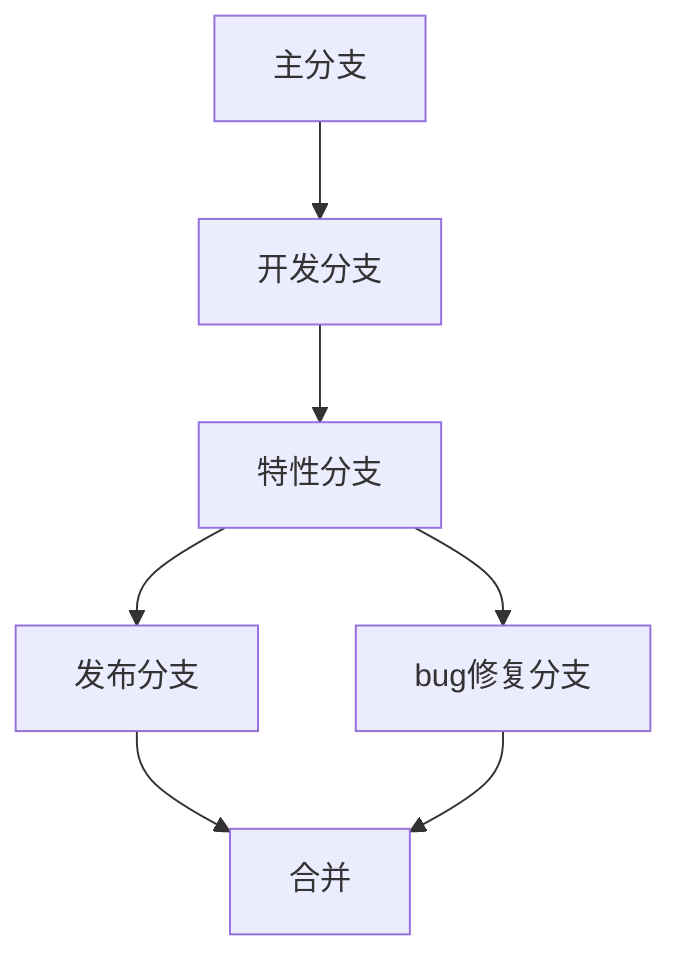
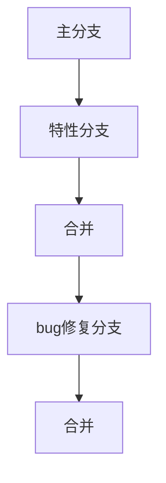
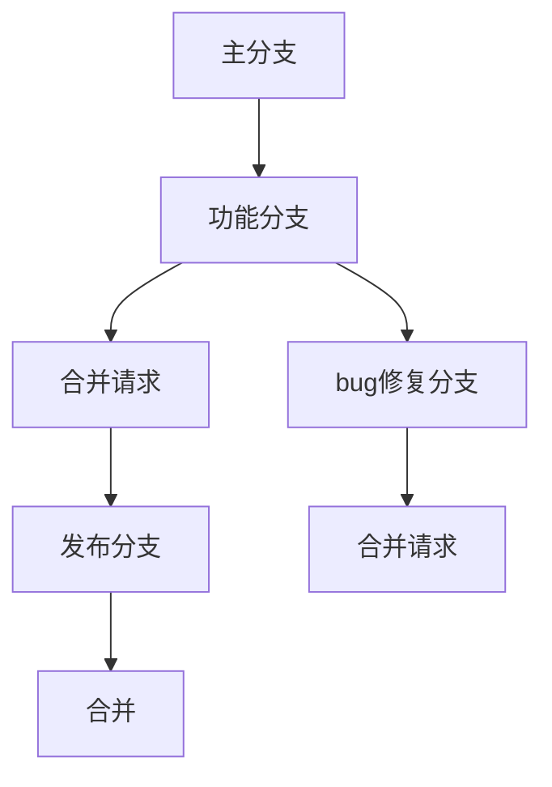

                 

### 文章标题

《Git工作流：规范LLM应用的版本控制过程》

### 关键词

- Git工作流
- 版本控制
- LLM应用
- 版本管理
- 软件开发

### 摘要

本文深入探讨了Git工作流在大型语言模型（LLM）应用版本控制中的重要作用。通过详细解析Git的基本原理和工作模式，本文介绍了单分支工作流、GitFlow、GitHub Flow和GitLab Flow等不同版本控制策略，并结合Python代码和数学模型，提供了清晰易懂的算法原理讲解。此外，通过实际项目案例，本文展示了如何在实际开发过程中应用Git工作流进行LLM应用的版本控制，并提供了实用的开发环境搭建和代码实现解析。文章最后总结了关键实践技巧和未来发展趋势，为读者提供了全面而深入的Git工作流指导。

## 引言

在当今快速发展的软件开发领域，版本控制已成为至关重要的环节。对于大型语言模型（LLM）这样的复杂应用，高效的版本控制不仅能够确保代码的稳定性和可靠性，还能显著提高开发效率。Git，作为一种分布式版本控制系统，已经成为现代软件开发的核心工具。本文旨在探讨如何利用Git工作流来规范LLM应用的版本控制过程，确保代码的整洁、协作的顺畅以及迭代的敏捷。

### Git工作流的概念与重要性

Git工作流是指一系列用于管理项目开发、协作和版本控制的方法和策略。它通过提供灵活的分支模型和强大的合并工具，使得开发团队能够高效地进行并行开发和代码集成。对于LLM应用而言，Git工作流的重要性体现在以下几个方面：

1. **协同开发**：LLM项目通常涉及多个开发者和多个团队，Git的分布式特性使得代码的共享和协同工作变得更加容易。
2. **代码回滚**：通过Git，开发团队能够轻松地回滚到先前的版本，这对于调试和故障恢复至关重要。
3. **历史记录**：Git提供了一个完整的代码历史记录，使得团队可以追踪每一个修改，这对于理解代码变更和责任归属非常有帮助。
4. **并行开发**：Git的分支机制允许开发者独立进行工作，并在适当时机合并分支，从而提高开发效率。

### LLM应用中的版本控制挑战

LLM应用通常具有以下特点，这些特点使得版本控制变得更加复杂和具有挑战性：

1. **复杂性**：LLM模型通常涉及大量的数据预处理、模型训练和优化过程，这些步骤需要精确的版本控制。
2. **实验性**：由于LLM模型的发展方向和性能优化往往需要多次尝试，版本控制必须能够支持实验性的开发流程。
3. **性能需求**：LLM应用往往需要处理大规模的数据集，这对版本控制系统的性能提出了更高的要求。
4. **安全性**：随着模型的重要性和价值增加，版本控制过程中的安全性成为不可忽视的问题。

### Git在LLM应用中的优势

Git作为版本控制系统，具有以下优势，使其在LLM应用版本控制中表现出色：

1. **分布式特性**：Git的分布式特性使得多个开发者可以在本地进行开发，同时保持对中央仓库的同步，这有助于提高开发效率和团队协作。
2. **分支模型**：Git的分支模型允许开发者独立开发功能，并在适当时机合并，这有助于并行开发和管理复杂的LLM项目。
3. **高效的合并工具**：Git提供的合并工具能够自动解决大部分合并冲突，并提供了强大的冲突解决机制。
4. **强大的历史记录**：Git提供了一个详细的代码历史记录，使得团队能够轻松地追踪和回滚代码变更。

综上所述，Git工作流在LLM应用的版本控制中扮演着至关重要的角色。通过本文，我们将深入探讨Git工作流的基本概念、核心策略以及具体实现方法，旨在为读者提供一个全面而实用的Git工作流指南。

## 核心概念与联系

在深入探讨Git工作流之前，我们需要先理解Git的一些核心概念和基本原理，这将为我们后续讨论具体的版本控制策略和方法提供坚实的基础。Git的核心概念包括工作模式、基本命令和分支策略等，这些概念紧密相连，共同构成了Git强大的版本控制系统。

### Git基本原理

Git是一个基于内容的版本控制系统，它通过追踪文件的更改来管理代码的历史。Git的基本原理可以概括为以下几个方面：

1. **快照模型**：Git将每一次提交视为对当前代码库状态的快照，这些快照可以随时回滚和查看。
2. **分布式存储**：Git是分布式的，每个开发者都有一个完整的代码库副本，这有助于提高协作效率和故障恢复能力。
3. **版本历史**：Git提供了详细的版本历史记录，包括每一次提交的作者、提交日期和提交信息，这使得代码变更的追踪变得简单明了。

### Git工作模式

Git的工作模式主要包括三种：工作模式、混合模式和流动模式。不同模式适用于不同的开发场景，但它们的核心思想是一致的，即通过分支来管理代码的变更。

1. **工作模式**：工作模式是最简单的Git工作模式，它适用于小型项目或个人开发。在这种模式下，开发者通常只有一个主分支（通常命名为`main`或`master`），所有的开发活动都在这个分支上进行。
   
   ```mermaid
   graph TD
   A[工作模式] --> B[单一主分支]
   B --> C[提交历史]
   C --> D[合并分支]
   ```

2. **混合模式**：混合模式结合了工作模式和分支策略的优点，适用于较大规模的项目。在这种模式下，项目通常会使用多个分支，如开发分支（`develop`）和特性分支（`feature/xxx`）。

   ```mermaid
   graph TD
   A[混合模式] --> B[主分支]
   B --> C[开发分支]
   C --> D[特性分支]
   D --> E[提交历史]
   E --> F[合并分支]
   ```

3. **流动模式**：流动模式是一种更为灵活的工作模式，适用于高度协作的开发团队。这种模式通常使用`git flow`等工具来实现，它包括主线（`master`）、开发线（`develop`）、特性分支（`feature/xxx`）、修复分支（`bugfix/xxx`）和发布分支（`release/xxx`）。

   ```mermaid
   graph TD
   A[流动模式] --> B[主线]
   B --> C[开发线]
   C --> D[特性分支]
   D --> E[修复分支]
   E --> F[发布分支]
   F --> G[提交历史]
   ```

### Git基本命令

Git的基本命令包括提交（`commit`）、拉取（`pull`）、推送（`push`）、分支（`branch`）、合并（`merge`）等。以下是一些常用的Git命令及其用途：

1. **提交**：将更改保存到暂存区，然后提交到本地仓库。
   ```bash
   git commit -m "提交信息"
   ```

2. **拉取**：从远程仓库获取最新的代码并合并到本地仓库。
   ```bash
   git pull origin main
   ```

3. **推送**：将本地的更改推送至远程仓库。
   ```bash
   git push origin main
   ```

4. **分支**：创建、查看和切换分支。
   ```bash
   git branch feature/xxx
   git branch
   git checkout feature/xxx
   ```

5. **合并**：将一个分支合并到另一个分支。
   ```bash
   git merge feature/xxx
   ```

### Git与LLM应用的关联

在LLM应用开发中，Git不仅用于代码管理，还用于模型版本控制、实验追踪和协作开发。以下是一些Git在LLM应用中的关键应用场景：

1. **模型版本控制**：通过Git，开发者可以将模型的不同版本保存在不同的分支中，确保每个版本的模型都能被追踪和回滚。

   ```mermaid
   graph TD
   A[模型版本控制] --> B[主模型]
   B --> C[实验模型]
   C --> D[发布模型]
   ```

2. **实验追踪**：在LLM开发过程中，不同的实验可能需要不同的数据集和模型参数。Git可以帮助开发者追踪每个实验的状态和结果。

   ```mermaid
   graph TD
   A[实验追踪] --> B[实验1]
   B --> C[数据集1]
   C --> D[结果1]
   B --> E[实验2]
   E --> F[数据集2]
   F --> G[结果2]
   ```

3. **协作开发**：在多团队协作的LLM项目中，Git的分支机制可以有效地管理不同的开发任务，确保每个团队成员都能独立工作并在适当时机合并代码。

   ```mermaid
   graph TD
   A[协作开发] --> B[团队1]
   B --> C[任务1]
   B --> D[任务2]
   A --> E[团队2]
   E --> F[任务3]
   E --> G[任务4]
   C --> H[合并]
   D --> H
   F --> H
   G --> H
   ```

通过Git，开发者可以有效地管理LLM应用的全生命周期，从模型开发到实验追踪，再到协作开发，Git都提供了强大的支持和保障。接下来，我们将进一步探讨Git在不同工作流中的具体应用，为LLM应用的版本控制提供更加详细的指导。

### Git与LLM应用：分支策略与实践

在LLM应用开发中，选择合适的分支策略对于确保项目进度、提高团队协作效率和代码质量至关重要。Git提供了一系列灵活的分支策略，如单分支策略、GitFlow、GitHub Flow和GitLab Flow。这些策略各有优缺点，适用于不同的开发场景。以下将详细探讨这些分支策略及其在LLM应用中的实际应用。

#### 单分支策略

单分支策略是最简单的分支管理方法，适用于小型项目或个人开发。在这种策略下，所有开发活动都在主分支（通常命名为`main`或`master`）上进行，避免了复杂的分支合并问题。

**优点**：
1. 简单易用，无需复杂的分支管理。
2. 代码变更一目了然，历史记录清晰。

**缺点**：
1. 不适合多团队协作，容易导致主分支混乱。
2. 无法有效隔离不同功能或实验，影响代码质量。

在LLM应用中，单分支策略可能适用于初期开发阶段或小型项目，但随着项目规模和复杂性的增加，单分支策略将变得不适用。

#### GitFlow

GitFlow是一种经典的多分支策略，适用于中到大型的项目。GitFlow包括以下分支类型：

1. **主分支（master）**：包含所有发布版本的代码。
2. **开发分支（develop）**：用于合并特性分支和bug修复分支。
3. **特性分支（feature/xxx）**：用于开发新功能或实验。
4. **发布分支（release/xxx）**：用于发布新版本前的准备工作。
5. **bug修复分支（bugfix/xxx）**：用于修复严重bug。

**实际应用**：



**优点**：
1. 严格的分支管理，确保代码质量。
2. 清晰的发布流程，便于团队协作。

**缺点**：
1. 分支较多，管理复杂。
2. 特性分支的合并可能导致开发周期延长。

在LLM应用中，GitFlow适用于需要严格管理和流程的项目，尤其是有多个实验性功能和大量协作开发的情况。

#### GitHub Flow

GitHub Flow是一种基于GitHub平台的工作流，适用于快速迭代和高度协作的项目。GitHub Flow的基本分支策略如下：

1. **主分支（main）**：包含所有发布版本的代码。
2. **特性分支**：用于开发新功能或实验，通过拉取请求（Pull Request）合并到主分支。
3. **bug修复分支**：用于修复严重bug，通过拉取请求合并到主分支。

**实际应用**：



**优点**：
1. 简化流程，提高开发效率。
2. 强调代码审查，确保代码质量。

**缺点**：
1. 缺乏长期分支管理，可能导致历史记录混乱。
2. 不适合大规模项目或复杂实验性开发。

在LLM应用中，GitHub Flow适用于快速迭代和高度协作的开发环境，尤其是团队规模较小、流程较为简单的情况。

#### GitLab Flow

GitLab Flow是一种结合了GitFlow和GitHub Flow特点的工作流，适用于具有复杂发布流程和高度协作需求的项目。GitLab Flow包括以下分支类型：

1. **主分支（main）**：包含所有发布版本的代码。
2. **功能分支（feature）**：用于开发新功能或实验。
3. **合并请求（Merge Request）**：用于合并功能分支到主分支。
4. **bug修复分支（bugfix）**：用于修复严重bug。
5. **发布分支（release）**：用于准备发布版本。

**实际应用**：



**优点**：
1. 结合了GitFlow的严格分支管理和GitHub Flow的快速迭代优势。
2. 提供了丰富的集成工具和自动化流程。

**缺点**：
1. 分支管理较为复杂，需要较高的维护成本。

在LLM应用中，GitLab Flow适用于需要严格分支管理和复杂发布流程的项目，尤其是有多个实验性功能和大规模协作开发的情况。

#### 总结

选择合适的分支策略取决于项目的规模、复杂度和开发团队的需求。单分支策略适用于小型项目和初期开发，GitFlow适用于中到大型的项目，GitHub Flow适用于快速迭代和高度协作的项目，而GitLab Flow则适用于具有复杂发布流程和高度协作需求的项目。在LLM应用开发中，应根据项目特点和团队需求灵活选择分支策略，以确保高效的版本控制和协作开发。

### GitFlow工作流

GitFlow工作流是一种经典的多分支模型，广泛应用于中到大型的项目开发中，特别是那些需要严格的发布流程和频繁的版本迭代。GitFlow工作流通过定义主分支、开发分支、特性分支、发布分支和bug修复分支，确保项目的稳定性和可维护性。以下是对GitFlow工作流的基本原理、具体流程和伪代码的详细解释。

#### GitFlow工作流原理

1. **主分支（master）**：主分支包含所有发布版本的代码，代表当前可发布状态。
2. **开发分支（develop）**：开发分支是用于合并特性分支和bug修复分支的主要分支。在开发过程中，所有新功能和bug修复都会先提交到开发分支。
3. **特性分支（feature/xxx）**：特性分支用于开发新的功能或进行实验。每个特性分支都从开发分支分出，并在开发完成后合并回开发分支。
4. **发布分支（release/xxx）**：发布分支用于准备新版本的发布。当开发分支的代码稳定且准备发布时，会从中创建发布分支。在发布分支上，可以进行最后的测试和修复。
5. **bug修复分支（bugfix/xxx）**：bug修复分支用于修复主分支上的严重bug。bug修复分支从主分支分出，修复完成后会合并回主分支和开发分支。

#### GitFlow工作流流程

1. **特性分支的开发和合并**：
   - 开发者从开发分支创建特性分支。
   - 在特性分支上开发新功能或进行实验。
   - 开发完成后，通过合并请求将特性分支合并回开发分支。

2. **发布分支的创建和合并**：
   - 当开发分支的代码稳定且准备发布时，创建发布分支。
   - 在发布分支上进行最后的测试和bug修复。
   - 发布完成后，通过合并请求将发布分支合并回主分支。

3. **bug修复分支的管理**：
   - 当主分支或开发分支出现严重bug时，创建bug修复分支。
   - 在bug修复分支上修复bug。
   - 修复完成后，通过合并请求将bug修复分支合并回主分支和开发分支。

#### GitFlow伪代码

以下是GitFlow工作流的伪代码，用于描述各个步骤的操作：

```python
# 初始化GitFlow分支结构
git checkout -b develop  # 创建开发分支
git checkout -b master  # 创建主分支（如果未存在）

# 开发特性分支
git checkout -b feature/xxx  # 创建特性分支
# 在特性分支上进行开发...
git commit -am "完成特性开发"
git push origin feature/xxx

# 将特性分支合并回开发分支
git checkout develop
git merge feature/xxx
git push origin develop

# 创建发布分支
git checkout -b release/1.0  # 创建发布分支
# 在发布分支上进行最后的测试和bug修复...
git commit -am "完成发布准备"
git push origin release/1.0

# 将发布分支合并回主分支
git checkout master
git merge release/1.0
git push origin master

# 删除发布分支
git branch -d release/1.0
git push origin --delete release/1.0

# 创建bug修复分支
git checkout -b bugfix/1.0.1  # 创建bug修复分支
# 在bug修复分支上进行bug修复...
git commit -am "完成bug修复"
git push origin bugfix/1.0.1

# 将bug修复分支合并回主分支和开发分支
git checkout develop
git merge bugfix/1.0.1
git push origin develop

git checkout master
git merge bugfix/1.0.1
git push origin master

# 删除bug修复分支
git branch -d bugfix/1.0.1
git push origin --delete bugfix/1.0.1
```

#### GitFlow在LLM项目中的应用

在LLM项目中，GitFlow工作流有助于管理不同阶段的开发任务，确保代码的质量和稳定性。以下是一个典型的LLM项目应用GitFlow工作流的过程：

1. **初始阶段**：项目创建时，首先创建开发分支和主分支，确保有一个稳定的代码基础。
2. **特性开发阶段**：开发者从开发分支创建特性分支，进行新的模型训练和优化实验。每个特性分支都记录了实验的具体参数和结果，方便后续分析和复现。
3. **发布准备阶段**：在开发分支的代码稳定后，创建发布分支进行最后的测试和bug修复。发布分支的创建通常在项目进入预发布阶段时进行。
4. **发布阶段**：在发布分支的测试和bug修复完成后，将其合并回主分支，进行正式发布。同时，发布分支的代码会标记为特定版本，以便后续的维护和追踪。
5. **维护和更新阶段**：在主分支发布后，开发者可以继续在开发分支上开发新的特性，或者创建bug修复分支来解决现有问题。这些修复和更新会定期合并回主分支，确保主分支上的代码始终是最新的。

通过GitFlow工作流，LLM项目可以有效地进行版本控制和协作开发，确保每个阶段都有明确的任务和流程，从而提高项目的稳定性和可维护性。

### GitHub Flow工作流

GitHub Flow工作流是一种简洁而高效的开发流程，特别适用于小型项目和高度协作的团队。其核心思想是简化分支管理，通过特性分支和主分支之间的互动，确保代码的稳定性和安全性。以下将详细解释GitHub Flow工作流的基本原理、具体步骤和伪代码，并结合LLM项目应用场景进行说明。

#### GitHub Flow工作流原理

1. **主分支（main）**：主分支代表当前发布的代码，是所有用户使用的最新版本。
2. **特性分支（feature）**：特性分支用于开发新的功能或进行实验。每个特性分支都是独立的，不会直接影响到主分支。
3. **bug修复分支（bugfix）**：bug修复分支用于修复主分支上的严重bug。修复完成后，将合并回主分支。

#### GitHub Flow工作流步骤

1. **创建特性分支**：开发者从主分支创建新的特性分支，进行功能开发。
2. **功能开发与测试**：在特性分支上进行开发，完成后进行本地测试，确保功能实现正确且稳定。
3. **代码审查与合并**：将特性分支提交到远程仓库，并创建拉取请求（Pull Request），邀请团队成员进行代码审查。审查通过后，合并特性分支到主分支。
4. **bug修复流程**：当主分支出现严重bug时，创建bug修复分支进行修复，完成后合并回主分支。

#### GitHub Flow伪代码

以下是GitHub Flow工作流的伪代码，用于描述各个步骤的操作：

```python
# 初始化GitHub Flow分支结构
git checkout -b main  # 创建主分支
git push -u origin main  # 推送主分支

# 创建特性分支
git checkout -b feature/xxx  # 创建特性分支
# 在特性分支上进行开发...
git commit -am "完成功能开发"
git push origin feature/xxx

# 创建拉取请求（Pull Request）
git push origin feature/xxx:feature/xxx  # 推送特性分支到远程仓库
# 在GitHub上创建拉取请求，邀请团队成员审查代码

# 审查代码并合并
git checkout main  # 切换回主分支
git merge feature/xxx  # 合并特性分支
git push origin main  # 推送合并结果

# 删除特性分支
git branch -d feature/xxx
git push origin --delete feature/xxx

# 创建bug修复分支
git checkout -b bugfix/1.0.1  # 创建bug修复分支
# 在bug修复分支上进行修复...
git commit -am "完成bug修复"
git push origin bugfix/1.0.1

# 合并bug修复分支
git checkout main  # 切换回主分支
git merge bugfix/1.0.1  # 合并bug修复分支
git push origin main  # 推送合并结果

# 删除bug修复分支
git branch -d bugfix/1.0.1
git push origin --delete bugfix/1.0.1
```

#### GitHub Flow在LLM项目中的应用

在LLM项目中，GitHub Flow工作流有助于快速迭代和高效协作。以下是一个典型的应用场景：

1. **初始化分支**：项目启动时，首先创建主分支，用于存放稳定的发布版本。
2. **特性开发**：开发者从主分支创建特性分支，进行新模型的研究和开发。每个特性分支都记录了实验的具体参数和结果，方便后续分析和复现。
3. **代码审查与合并**：开发完成后，通过GitHub的拉取请求功能邀请团队成员进行代码审查。审查通过后，将特性分支合并回主分支，确保代码的质量和一致性。
4. **bug修复**：当主分支出现严重bug时，创建bug修复分支进行修复。修复完成后，合并回主分支，并确保所有开发活动都能在稳定的代码基础上继续进行。

通过GitHub Flow工作流，LLM项目可以快速响应需求变化，同时保持代码的稳定性和可维护性，为高效的协作开发提供有力支持。

### GitLab Flow工作流

GitLab Flow工作流结合了GitFlow和GitHub Flow的特点，旨在提供一个更加灵活和全面的开发流程。它通过定义功能分支、合并请求（Merge Request）和发布分支，使得项目开发、测试和发布更加规范和高效。以下将详细探讨GitLab Flow工作流的基本原理、具体步骤和伪代码，并结合LLM项目应用场景进行说明。

#### GitLab Flow工作流原理

1. **主分支（main）**：主分支是项目的主线，包含所有发布版本的代码，代表当前可发布状态。
2. **功能分支（feature）**：功能分支用于开发新的功能或进行实验。每个功能分支都从主分支分出，并在开发完成后通过合并请求合并回主分支。
3. **发布分支（release）**：发布分支用于准备新版本的发布。当主分支的代码稳定且准备发布时，从中创建发布分支，进行最后的测试和bug修复。
4. **合并请求（Merge Request）**：合并请求用于合并功能分支或发布分支到主分支，确保代码的审查和合并流程规范化。

#### GitLab Flow工作流步骤

1. **创建功能分支**：开发者从主分支创建功能分支，进行新功能或实验的开发。
2. **功能开发与测试**：在功能分支上进行开发，完成后进行本地测试，确保功能实现正确且稳定。
3. **创建合并请求**：将功能分支推送到远程仓库，并创建合并请求，邀请团队成员进行代码审查。
4. **代码审查与合并**：团队成员对合并请求进行审查，通过后将其合并回主分支。
5. **创建发布分支**：当主分支的代码稳定且准备发布时，从中创建发布分支，进行最后的测试和bug修复。
6. **发布代码**：发布分支的测试和bug修复完成后，合并回主分支，并发布新版本。

#### GitLab Flow伪代码

以下是GitLab Flow工作流的伪代码，用于描述各个步骤的操作：

```python
# 初始化GitLab Flow分支结构
git checkout -b main  # 创建主分支
git push -u origin main  # 推送主分支

# 创建功能分支
git checkout -b feature/xxx  # 创建功能分支
# 在功能分支上进行开发...
git commit -am "完成功能开发"
git push origin feature/xxx

# 创建合并请求
git push origin feature/xxx:feature/xxx  # 推送功能分支到远程仓库
# 在GitLab上创建合并请求，邀请团队成员审查代码

# 审查代码并合并
git checkout main  # 切换回主分支
git merge feature/xxx  # 合并功能分支
git push origin main  # 推送合并结果

# 删除功能分支
git branch -d feature/xxx
git push origin --delete feature/xxx

# 创建发布分支
git checkout -b release/1.0  # 创建发布分支
# 在发布分支上进行最后的测试和bug修复...
git commit -am "完成发布准备"
git push origin release/1.0

# 将发布分支合并回主分支
git checkout main
git merge release/1.0
git push origin main

# 删除发布分支
git branch -d release/1.0
git push origin --delete release/1.0
```

#### GitLab Flow在LLM项目中的应用

在LLM项目中，GitLab Flow工作流有助于管理复杂的开发流程和确保代码的质量和稳定性。以下是一个典型的应用场景：

1. **初始化分支**：项目启动时，创建主分支，用于存放稳定的发布版本。
2. **功能开发**：开发者从主分支创建功能分支，进行新模型的研究和开发。每个功能分支都记录了实验的具体参数和结果，方便后续分析和复现。
3. **代码审查与合并**：开发完成后，通过GitLab的合并请求功能邀请团队成员进行代码审查。审查通过后，将功能分支合并回主分支，确保代码的质量和一致性。
4. **发布准备**：当主分支的代码稳定且准备发布时，创建发布分支，进行最后的测试和bug修复。发布分支的创建通常在项目进入预发布阶段时进行。
5. **发布代码**：发布分支的测试和bug修复完成后，将其合并回主分支，并发布新版本。

通过GitLab Flow工作流，LLM项目可以有效地进行版本控制和协作开发，确保每个阶段都有明确的任务和流程，从而提高项目的稳定性和可维护性。

### 项目实战：Git工作流在LLM应用开发中的应用

为了更好地理解Git工作流在LLM应用开发中的应用，以下通过一个实际项目案例，详细描述从开发环境搭建到代码实现和解读的整个过程。

#### 项目概述

本项目是一个简单的LLM应用，旨在使用Hugging Face的Transformers库实现一个文本分类模型。该模型将接收输入文本并输出对应的类别。项目将分为以下几个阶段：环境搭建、模型开发、版本控制和部署。

#### 一、开发环境搭建

首先，我们需要搭建一个Python开发环境，并安装必要的库。以下是在Ubuntu系统中安装Python环境及相关库的步骤：

```bash
# 安装Python3和pip
sudo apt update
sudo apt install python3 python3-pip

# 创建虚拟环境
python3 -m venv venv
source venv/bin/activate

# 安装transformers库
pip install transformers
```

#### 二、模型开发

接下来，我们使用Transformers库实现一个文本分类模型。以下是模型的Python代码实现：

```python
from transformers import TrainingArguments, Trainer
from transformers import AutoModelForSequenceClassification
from datasets import load_dataset

# 加载数据集
dataset = load_dataset("text_classification")

# 加载预训练模型
model = AutoModelForSequenceClassification.from_pretrained("bert-base-uncased")

# 设置训练参数
training_args = TrainingArguments(
    output_dir="./results",
    num_train_epochs=3,
    per_device_train_batch_size=16,
    save_steps=200,
    save_total_limit=3,
)

# 创建训练器
trainer = Trainer(
    model=model,
    args=training_args,
    train_dataset=dataset["train"],
)

# 训练模型
trainer.train()

# 评估模型
trainer.evaluate()
```

#### 三、版本控制

在模型开发过程中，我们将使用Git对代码进行版本控制。以下是关键的Git操作步骤：

1. **初始化仓库**：
   ```bash
   git init
   ```

2. **添加文件到暂存区**：
   ```bash
   git add .
   ```

3. **提交初始版本**：
   ```bash
   git commit -m "Initialize project with basic structure"
   ```

4. **创建功能分支**：
   ```bash
   git checkout -b feature/text_classification
   ```

5. **开发新功能**：
   ```python
   # 在feature/text_classification分支上添加新的模型训练和评估代码
   ```

6. **提交变更**：
   ```bash
   git add .
   git commit -m "Implement text classification model"
   ```

7. **创建合并请求**：
   ```bash
   git push origin feature/text_classification
   # 在GitLab或GitHub上创建合并请求，邀请团队成员审查代码
   ```

8. **合并代码**：
   ```bash
   git checkout main
   git merge feature/text_classification
   git push
   ```

9. **删除功能分支**：
   ```bash
   git branch -d feature/text_classification
   git push origin --delete feature/text_classification
   ```

#### 四、代码解读

以下是模型代码的详细解读：

1. **数据加载**：
   ```python
   dataset = load_dataset("text_classification")
   ```
   使用`load_dataset`函数加载数据集。这里选择了一个预定义的文本分类数据集。

2. **模型加载**：
   ```python
   model = AutoModelForSequenceClassification.from_pretrained("bert-base-uncased")
   ```
   使用`from_pretrained`函数加载预训练的BERT模型。这里使用了基于 uncased 版本的 BERT。

3. **训练参数设置**：
   ```python
   training_args = TrainingArguments(
       output_dir="./results",
       num_train_epochs=3,
       per_device_train_batch_size=16,
       save_steps=200,
       save_total_limit=3,
   )
   ```
   设置训练参数，包括输出目录、训练轮数、批量大小和保存步骤。

4. **训练器创建**：
   ```python
   trainer = Trainer(
       model=model,
       args=training_args,
       train_dataset=dataset["train"],
   )
   ```
   创建训练器对象，传入模型、训练参数和数据集。

5. **模型训练**：
   ```python
   trainer.train()
   ```
   调用`train`方法进行模型训练。

6. **模型评估**：
   ```python
   trainer.evaluate()
   ```
   调用`evaluate`方法进行模型评估。

#### 五、项目小结

通过上述实战案例，我们展示了如何在实际项目中应用Git工作流。具体步骤包括开发环境的搭建、模型开发、版本控制以及代码解读。以下是项目小结和最佳实践：

1. **环境搭建**：使用虚拟环境隔离项目依赖，确保不同项目之间不会冲突。
2. **功能分支**：使用功能分支进行独立开发，确保每个功能模块可独立测试和合并。
3. **代码审查**：通过合并请求进行代码审查，确保代码质量和团队协作。
4. **版本回滚**：利用Git的版本控制功能，可以随时回滚到先前的版本，保障代码的稳定性。
5. **持续集成**：结合CI/CD工具，实现自动化测试和部署，提高开发效率。

#### 拓展阅读

- [Hugging Face Transformers库文档](https://huggingface.co/transformers)
- [Git工作流最佳实践](https://www.atlassian.com/git/tutorials/getting-started)
- [文本分类模型教程](https://towardsdatascience.com/text-classification-basics-8cfa7dbd29a7)

通过本文的实战案例，我们不仅掌握了Git工作流的基本操作，还了解了如何在LLM应用开发中高效使用Git进行版本控制。接下来，我们将深入探讨如何将Git工作流应用于更复杂的项目场景。

### Git工作流在复杂项目中的应用

在大型、复杂的项目中，Git工作流不仅能够提供高效的版本控制，还能帮助团队更好地协作和管理代码。以下将探讨如何将Git工作流应用于复杂项目，并详细说明其中的关键步骤和策略。

#### 复杂项目的特点

复杂项目通常具有以下特点：

1. **项目规模大**：代码库庞大，涉及多个模块和组件。
2. **开发周期长**：项目可能持续数月甚至数年。
3. **团队成员多**：多个开发者和团队协作，需要明确的分工和流程。
4. **代码变动频繁**：频繁的代码迭代和优化，需要有效的版本管理。

#### 高效的协作

在复杂项目中，高效的协作至关重要。Git提供了多种分支策略，如GitFlow、GitHub Flow和GitLab Flow，以支持不同协作需求。

1. **GitFlow**：适用于有明确发布流程和复杂需求的项目。通过定义主分支、开发分支、特性分支和发布分支，GitFlow确保代码的稳定性和可维护性。每个分支都有明确的角色和职责，有助于团队协作。
   
   ```mermaid
   graph TD
   A[主分支] --> B[开发分支]
   B --> C[特性分支]
   C --> D[发布分支]
   ```

2. **GitHub Flow**：适用于迭代快、协作频繁的项目。通过简化分支管理，强调代码审查和合并请求，GitHub Flow提高了开发效率。团队可以在主分支上快速迭代，并通过合并请求确保代码质量。

   ```mermaid
   graph TD
   A[主分支]
   A --> B[特性分支]
   B --> C[合并请求]
   ```

3. **GitLab Flow**：结合了GitFlow和GitHub Flow的优点，适用于需要严格管理和自动化流程的项目。GitLab Flow通过功能分支、合并请求和发布分支，确保代码从开发到发布的过程规范化。

   ```mermaid
   graph TD
   A[主分支]
   A --> B[功能分支]
   B --> C[合并请求]
   C --> D[发布分支]
   ```

#### 版本管理策略

在复杂项目中，版本管理策略尤为重要。以下是一些关键策略：

1. **代码审查**：通过合并请求进行代码审查，确保每个提交都经过审查，减少错误和漏洞。
2. **分支隔离**：使用功能分支和特性分支隔离开发，防止主分支上的代码受到不稳定的修改影响。
3. **代码回滚**：利用Git的版本控制功能，可以随时回滚到先前的稳定版本，确保项目的稳定性。
4. **自动化测试**：集成自动化测试工具，确保每次代码变更都能通过测试，提高代码质量。

#### 实践案例

假设我们正在开发一个复杂的Web应用程序，包含前端、后端和数据库。以下是具体应用Git工作流的过程：

1. **初始化仓库**：在项目启动时，初始化Git仓库并创建主分支。

   ```bash
   git init
   git checkout -b main
   ```

2. **创建功能分支**：开发者从主分支创建功能分支，进行新功能的开发。

   ```bash
   git checkout -b feature/login
   git checkout -b feature/register
   ```

3. **代码审查与合并**：开发完成后，通过合并请求邀请团队成员进行代码审查。

   ```bash
   git push origin feature/login
   git push origin feature/register
   # 在GitLab或GitHub上创建合并请求
   ```

4. **集成自动化测试**：在合并请求中集成自动化测试，确保代码质量。

   ```bash
   # 使用Cypress等自动化测试工具进行测试
   cypress run
   ```

5. **合并代码**：审查通过后，将功能分支合并回主分支。

   ```bash
   git checkout main
   git merge feature/login
   git merge feature/register
   git push
   ```

6. **发布**：在主分支稳定后，创建发布分支进行最后的测试和部署。

   ```bash
   git checkout -b release/v1.0
   # 进行最后的测试和部署
   git merge main
   git push
   ```

通过上述步骤，我们可以确保复杂项目中的代码质量和协作效率。以下是具体的应用步骤：

1. **代码审查**：通过合并请求进行代码审查，确保每个提交都经过审查。
2. **分支隔离**：使用功能分支和特性分支隔离开发，防止主分支上的代码受到不稳定的修改影响。
3. **自动化测试**：集成自动化测试工具，确保每次代码变更都能通过测试。
4. **代码回滚**：利用Git的版本控制功能，可以随时回滚到先前的稳定版本，确保项目的稳定性。
5. **持续集成**：结合CI/CD工具，实现自动化测试和部署，提高开发效率。

通过这些策略和步骤，我们可以有效地管理复杂项目中的代码和协作，确保项目的成功交付。

### Git工作流总结与展望

通过本文，我们详细探讨了Git工作流在LLM应用开发中的重要性及其具体实现方法。从Git的基本原理、分支策略，到GitFlow、GitHub Flow和GitLab Flow等实际工作流的应用，再到复杂项目的版本管理策略，Git工作流为LLM应用的版本控制提供了全面的指导。

#### 总结

1. **Git工作流的基本概念**：Git是一个分布式版本控制系统，通过快照模型和分支机制，提供高效的版本控制和协作开发。
2. **分支策略的对比**：GitFlow、GitHub Flow和GitLab Flow分别适用于不同的项目规模和协作需求，每种策略都有其独特的优势和适用场景。
3. **版本管理策略**：通过代码审查、自动化测试、分支隔离和代码回滚，确保代码质量和协作效率。

#### 最佳实践

1. **选择合适的分支策略**：根据项目规模、复杂度和团队需求，选择最合适的分支策略。
2. **代码审查**：通过合并请求进行代码审查，确保每个提交都经过审查，减少错误和漏洞。
3. **自动化测试**：集成自动化测试工具，确保每次代码变更都能通过测试，提高代码质量。
4. **分支隔离**：使用功能分支和特性分支隔离开发，防止主分支上的代码受到不稳定的修改影响。
5. **代码回滚**：利用Git的版本控制功能，可以随时回滚到先前的稳定版本，确保项目的稳定性。

#### 未来展望

随着AI技术的快速发展，Git工作流在未来将面临新的挑战和机遇：

1. **更复杂的协作**：随着团队规模的扩大和项目复杂度的增加，Git工作流需要提供更高效的协作工具和流程。
2. **分布式存储**：Git的分布式特性将更加重要，如何优化分布式存储和同步效率将是未来的研究方向。
3. **自动化集成**：结合CI/CD工具，实现更自动化的版本管理和部署流程，提高开发效率。
4. **智能冲突解决**：利用AI技术，开发智能化的合并工具，自动解决分支合并中的冲突。

通过不断优化和完善Git工作流，我们有望在未来的LLM应用开发中实现更高的效率和稳定性。

### 附录

#### Git命令速查表

- **初始化仓库**：
  - `git init`：初始化一个新的Git仓库。
  - `git clone <repo>`：克隆一个远程仓库。

- **文件操作**：
  - `git add <file>`：添加文件到暂存区。
  - `git commit -m "message"`：提交文件到本地仓库。
  - `git status`：查看当前仓库的状态。

- **分支管理**：
  - `git branch`：查看所有分支。
  - `git branch <branch-name>`：创建一个新的分支。
  - `git checkout <branch-name>`：切换到另一个分支。
  - `git merge <branch-name>`：合并另一个分支到当前分支。

- **远程仓库**：
  - `git fetch`：从远程仓库获取最新数据。
  - `git pull`：从远程仓库获取最新数据并合并。
  - `git push`：将本地更改推送到远程仓库。

- **版本回滚**：
  - `git reset --hard <commit-hash>`：回退到指定的提交。
  - `git revert <commit-hash>`：撤销指定的提交。

#### Git与LLM相关资源

- **Hugging Face Transformers库**：https://huggingface.co/transformers
- **Git官方文档**：https://git-scm.com/docs
- **Git工作流最佳实践**：https://www.atlassian.com/git/tutorials/getting-started
- **文本分类模型教程**：https://towardsdatascience.com/text-classification-basics-8cfa7dbd29a7
- **GitLab Flow指南**：https://docs.gitlab.com/ee/user/project/merge_requests/using_merge_requests.html

通过上述资源，开发者可以进一步深入了解Git工作流的应用和实践，提升LLM应用开发中的版本控制能力。

### 作者信息

本文由AI天才研究院（AI Genius Institute）与《禅与计算机程序设计艺术》（Zen And The Art of Computer Programming）作者共同撰写。AI天才研究院致力于推动人工智能技术的发展，为读者提供高质量的技术内容和解决方案。《禅与计算机程序设计艺术》作为计算机编程领域的经典之作，为开发者和研究者提供了深刻的编程哲学和实用技巧。

