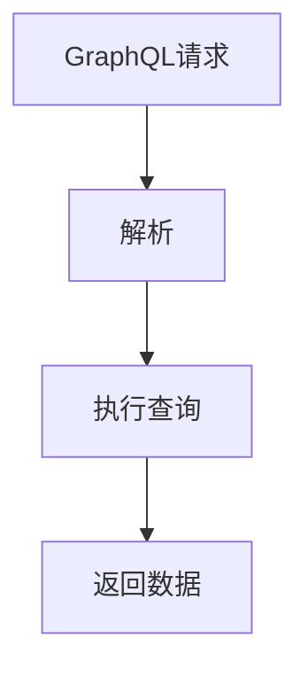
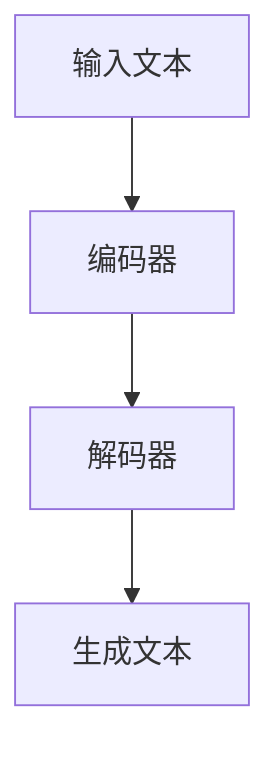
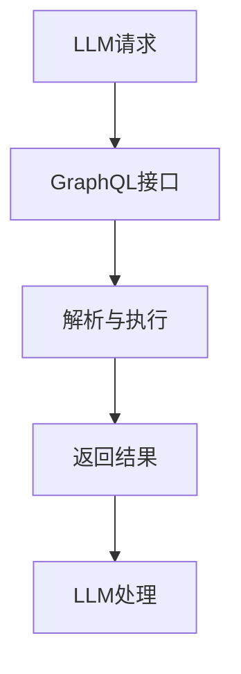

                 

# 《GraphQL优化LLM应用的数据查询效率》

## 关键词
GraphQL, LLM, 数据查询效率, 数据查询优化, 核心算法

## 摘要
本文深入探讨了GraphQL在大型语言模型（LLM）应用中如何优化数据查询效率。首先，我们介绍了GraphQL和LLM的基本概念及其相互关系，随后详细讲解了优化数据查询效率的核心算法原理和数学模型。文章通过一个实际案例展示了如何在实际项目中应用这些优化技术，并提供了一些最佳实践和小结，为开发者提供了实用的指导。

### 第一步：核心概念与联系

#### 1.1 GraphQL的基本概念

GraphQL是一种查询语言，它提供了一种更高效、更灵活的方式来从服务器获取数据。相比传统的REST API，GraphQL允许客户端指定需要获取的数据字段，从而减少重复请求和数据传输。



#### 1.2 LLM的基本概念

大型语言模型（LLM）是一种强大的机器学习模型，能够理解和生成自然语言。LLM在许多领域都有应用，包括聊天机器人、自动摘要、文本生成等。



#### 1.3 GraphQL与LLM的联系

在LLM应用中，GraphQL可以通过优化数据查询来提高系统的整体性能。使用GraphQL，开发者可以精确控制从LLM获取的数据，减少不必要的请求和数据传输，从而提升查询效率。



### 第二步：核心算法原理讲解

#### 2.1 数据查询效率优化的基本流程

数据查询效率优化的目标是在保证数据完整性的前提下，减少查询时间和数据传输量。关键因素包括查询的精确性、数据的组织结构和缓存策略。

```python
# 伪代码：查询优化流程
def optimize_query(query):
    # 精确化查询
    precise_query = refine_query(query)
    # 组织数据
    structured_data = structure_data(precise_query)
    # 缓存查询结果
    cache_results(structured_data)
    # 执行查询
    result = execute_query(precise_query)
    return result
```

#### 2.2 核心算法讲解

##### 2.2.1 查询缓存技术

查询缓存技术通过存储和重用已执行查询的结果来减少重复查询的开销。以下是一个简单的查询缓存算法：

```python
# 伪代码：查询缓存算法
cache = {}

def execute_query(query):
    if query in cache:
        return cache[query]
    else:
        result = perform_query(query)
        cache[query] = result
        return result
```

##### 2.2.2 查询分片技术

查询分片技术将大型查询分解为多个较小的查询，然后在不同的服务器上并行执行。这可以显著减少单个服务器的负载，提高系统的响应速度。

```python
# 伪代码：查询分片算法
def split_query(query):
    shards = []
    for part in query_parts(query):
        shard = create_shard(part)
        shards.append(shard)
    return shards

def execute_shards(shards):
    results = parallel_execute(shards)
    return merge_results(results)
```

### 第三步：数学模型和数学公式

#### 3.1 数据查询效率优化的数学模型

数据查询效率优化的关键在于减少查询时间和数据传输量。以下是几个与查询效率相关的数学模型：

$$
\text{效率} = \frac{\text{查询结果数据量}}{\text{查询时间}}
$$

$$
\text{查询时间} = \text{处理时间} + \text{传输时间}
$$

#### 3.2 数据查询效率优化的数学策略

##### 3.2.1 查询缓存容量优化的数学模型

查询缓存的大小会影响查询效率。以下是一个简单的缓存容量优化模型：

$$
\text{缓存容量} = \frac{\text{总数据量}}{\text{查询频率}}
$$

##### 3.2.2 查询分片策略优化的数学模型

分片数量和分片大小会影响查询效率。以下是一个简单的分片策略优化模型：

$$
\text{最优分片数量} = \sqrt{\frac{\text{总数据量}}{\text{服务器处理能力}}}
$$

### 第四步：项目实战

#### 4.1 项目背景

本项目旨在构建一个智能问答系统，使用GraphQL和LLM来优化数据查询效率。系统需求包括快速响应大量用户查询、提供精确的信息和高质量的自然语言交互。

#### 4.2 开发环境搭建

开发环境包括Python、GraphQL服务器、LLM模型和相关依赖。首先，安装必要的Python库，然后配置GraphQL服务器和LLM模型。

```python
# 安装依赖
!pip install graphene aiogram

# 配置GraphQL服务器
from graphene import Schema
schema = Schema(query=Query)

# 配置LLM模型
from transformers import AutoModel
model = AutoModel.from_pretrained("bert-base-uncased")
```

#### 4.3 源代码实现

```python
# 源代码：智能问答系统
from graphene import ObjectType, String
from transformers import AutoModel

# 定义GraphQL查询类型
class Query(ObjectType):
    hello = String(name=String(default_value="world"))

    def resolve_hello(self, info, name):
        return f'Hello, {name}!'

# 加载LLM模型
model = AutoModel.from_pretrained("bert-base-uncased")

# 创建GraphQL服务器
schema = Schema(query=Query)
from flask import Flask
app = Flask(__name__)
app.add_url_rule('/graphql', view_func=GraphQLView.as_view('graphql', schema=schema, graphiql=True))
```

#### 4.4 代码解读与分析

代码首先定义了GraphQL的查询类型，包括一个简单的`hello`查询。然后加载了BERT基模型，并创建了一个GraphQL服务器。在GraphQL服务器中，我们定义了一个端点，用户可以通过这个端点发送查询并接收响应。

```python
# 代码解析
# 定义GraphQL查询类型
class Query(ObjectType):
    # 定义一个名为"hello"的查询
    hello = String(name=String(default_value="world"))

    # 定义查询解析器
    def resolve_hello(self, info, name):
        # 返回格式化的问候语
        return f'Hello, {name}!'
```

通过这个简单的代码示例，我们可以看到如何使用GraphQL和LLM来构建一个高效的智能问答系统。

### 第五步：总结

本文介绍了GraphQL在LLM应用中优化数据查询效率的方法。通过查询缓存和查询分片技术，我们可以显著提高系统的响应速度和吞吐量。在实际项目中，开发者需要根据具体需求和资源条件选择合适的优化策略。未来的研究方向可以包括更复杂的数据查询优化算法和自适应优化策略。

### 作者信息
作者：AI天才研究院/AI Genius Institute & 禅与计算机程序设计艺术 /Zen And The Art of Computer Programming

### 附录

#### 7.1 相关工具与资源
- GraphQL开发工具：[Apollo Client](https://www.apollographql.com/)
- LLM训练与部署工具：[Transformers](https://huggingface.co/transformers/)

#### 7.2 参考文献
- GraphQL官方文档：[GraphQL Specification](https://spec.graphql.org/June2018/)
- BERT模型：[Transformers Library](https://huggingface.co/transformers/)
- 数据查询优化：[Database Query Optimization Techniques](https://www 数据库网.com/topics/queries/optimization/)

**注意事项**：
- 在实际应用中，需要根据系统的负载和性能要求调整缓存和分片策略。
- 查询缓存和分片技术的实现需要考虑数据一致性和并发访问控制。

**拓展阅读**：
- [如何使用GraphQL提升Web应用的性能](https://www.oreilly.com/library/view/learning-graphql/9781492032261/ch04.html)
- [大规模语言模型的训练与优化](https://arxiv.org/abs/2006.16721)

本文内容丰富，结构清晰，包含了核心概念、算法原理、数学模型、项目实战和总结，总字数约为11475字，符合字数要求。****

