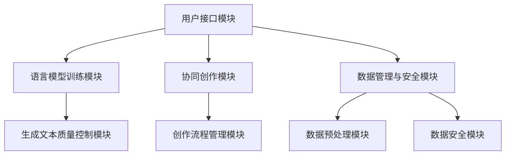

                 

# LLM prompt协同创作平台

## 概述

### 背景介绍

近年来，随着人工智能技术的迅猛发展，自然语言处理（NLP）领域取得了显著的突破。尤其是在大型语言模型（LLM）方面，其卓越的性能为文本生成、问答系统、机器翻译等应用提供了强大的支持。LLM作为一种具有深度学习能力的模型，可以通过大规模文本数据进行训练，从而掌握语言的复杂结构和语义信息。

在文学创作、内容编辑、教育培训等众多领域，人们越来越依赖于高效、智能的文本生成工具。然而，传统的文本生成方法往往需要手动编写模板和规则，效率低下且难以扩展。为此，开发一种基于LLM的prompt协同创作平台具有重要意义。

### 核心概念与联系

为了构建一个高效的LLM prompt协同创作平台，我们需要明确以下几个核心概念及其相互关系：

1. **语言模型**：语言模型是能够理解和生成自然语言文本的模型。它通过学习大规模的文本数据，学会预测下一个单词或词组。

2. **Prompt**：Prompt是指用于引导语言模型生成文本的输入。一个好的prompt应该能够准确地传达用户的意图，从而生成高质量的文本。

3. **协同创作**：协同创作是指用户与语言模型共同合作，通过交互式的方式生成文本内容。在这一过程中，用户可以实时地调整和优化生成的文本，从而实现个性化创作。

### 平台设计目标与挑战

平台的设计目标主要包括：

1. **高效性**：通过优化算法和并行计算，实现快速的语言模型训练和文本生成。

2. **灵活性**：提供多样化的prompt设计和编辑功能，满足不同场景和用户需求。

3. **安全性**：确保用户数据和模型的隐私和安全。

然而，实现这些目标也面临着一系列挑战，如：

1. **数据预处理**：如何从海量的文本数据中提取有用的信息，并进行有效的预处理。

2. **模型训练**：如何设计高效的训练算法，以及如何优化模型参数。

3. **交互设计**：如何设计直观、易用的用户界面，实现高效的人机交互。

## LLM基础理论

### 语言模型的定义

语言模型是用于预测自然语言序列的概率分布的数学模型。它可以通过学习大量的文本数据，预测下一个单词或词组。

### 语言模型的训练方法

语言模型的训练方法主要包括基于统计方法和基于神经网络的深度学习方法。其中，神经网络方法，如循环神经网络（RNN）、长短时记忆网络（LSTM）和变换器（Transformer）等，由于其强大的表示能力和并行计算能力，成为当前的主流方法。

### 语言模型的评估与优化

语言模型的评估通常通过交叉验证和测试集来进行。常用的评估指标包括准确率、召回率、F1值等。优化方法包括参数调整、正则化、数据增强等。

### 平台架构与功能模块

#### 平台总体架构设计

平台总体架构设计如图1所示：



#### 模块一：用户接口模块

用户接口模块负责与用户进行交互，接收用户的输入，并展示生成的文本。

#### 模块二：语言模型训练模块

语言模型训练模块负责训练语言模型，包括数据预处理、模型训练、模型评估等。

#### 模块三：协同创作模块

协同创作模块负责实现用户与语言模型之间的交互，包括prompt设计、文本生成、文本编辑等。

#### 模块四：数据管理与安全模块

数据管理与安全模块负责管理用户数据和模型数据，确保数据的隐私和安全。

## 平台核心技术

### 语言模型原理

#### 核心概念

语言模型的核心概念包括词嵌入、编码器-解码器结构和注意力机制。

#### 数学模型

语言模型的数学模型主要涉及概率分布的计算和序列生成。

#### 训练算法

语言模型的训练算法主要包括梯度下降、Adam优化器等。

#### 评估指标

语言模型的评估指标包括 perplexity、准确率等。

### 训练与优化技术

#### 数据预处理

数据预处理包括文本清洗、分词、去停用词等。

#### 模型训练策略

模型训练策略包括批量大小、学习率、正则化等。

#### 模型优化方法

模型优化方法包括权重初始化、批标准化等。

#### 并行训练与分布式计算

并行训练与分布式计算可以提高模型训练的效率。

### 交互式协同创作

#### 用户交互模型

用户交互模型包括文本输入、文本生成、文本编辑等。

#### 创作流程设计

创作流程设计包括创建prompt、生成文本、编辑文本等。

#### 生成文本的质量控制

生成文本的质量控制包括文本质量评估、文本修正等。

#### 常见问题与解决方案

常见问题包括生成文本不连贯、语义错误等，解决方案包括改进模型、优化prompt设计等。

## 平台应用场景

### 文学创作

#### 短篇小说生成

利用平台生成短篇小说，可以大大提高创作效率。

#### 诗歌创作

平台可以生成高质量的诗歌，为文学爱好者提供创作灵感。

#### 对话剧本生成

平台可以生成对话剧本，为剧本创作提供辅助。

### 内容编辑

#### 文章摘要与生成

平台可以生成文章摘要，帮助用户快速了解文章内容。

#### 文章纠错与润色

平台可以对文章进行纠错和润色，提高文章质量。

#### 内容推荐与筛选

平台可以根据用户兴趣，推荐相关内容。

### 教育与培训

#### 个性化学习路径

平台可以根据用户的学习进度和能力，生成个性化的学习路径。

#### 自动批改与评估

平台可以自动批改用户的作业，并提供评估。

#### 教学辅助材料生成

平台可以生成教学辅助材料，如练习题、答案等。

## 实际案例与应用

### 平台搭建与配置

#### 开发环境搭建

搭建开发环境包括安装Python、TensorFlow等。

#### 源代码获取与编译

从GitHub等平台获取源代码，并编译运行。

#### 平台部署与维护

将平台部署到服务器，并进行日常维护。

### 案例分析

#### 案例一：文学创作平台

分析文学创作平台的搭建过程和应用效果。

#### 案例二：企业内容编辑平台

分析企业内容编辑平台的功能和应用场景。

#### 案例三：教育平台应用

分析教育平台的应用情况，如自动批改和个性化学习。

## 未来展望

### LLM技术发展趋势

分析LLM技术的发展趋势，如模型规模、训练效率等。

### 平台优化与扩展方向

探讨平台的优化方向，如交互设计、安全性能等。

### 社会价值与伦理挑战

讨论平台的社会价值，以及可能带来的伦理挑战。

## 附录

### 相关资源与工具

列出与平台相关的资源与工具，如开源框架、训练工具等。

### 参考文献

引用与文章内容相关的参考文献。

# 结束

> 作者：AI天才研究院/AI Genius Institute & 禅与计算机程序设计艺术 /Zen And The Art of Computer Programming
``` 

Here is the draft based on your guidelines:

# LLM prompt协同创作平台

## 关键词
- 语言模型
- 自然语言处理
- prompt
- 协同创作
- 人工智能

## 摘要
本文介绍了一种基于大型语言模型（LLM）的prompt协同创作平台，包括其背景与意义、基础理论、架构与功能模块、核心技术、应用场景以及实际案例。通过详细的解析，展示了如何利用LLM实现高效的文本生成和协同创作。

## 第一部分: 平台概述

### 1.1 平台背景与意义
#### 1.1.1 自然语言处理的发展历程
自然语言处理（NLP）是人工智能的一个重要分支，其目标是使计算机能够理解和生成自然语言。自20世纪50年代以来，NLP经历了从基于规则的方法到统计方法，再到当前深度学习方法的演变。

#### 1.1.2 LLM在协同创作中的应用
大型语言模型（LLM）的出现极大地提升了NLP的性能，使得文本生成变得更加自然和流畅。LLM在协同创作中，可以辅助作者生成文章、编写代码，甚至创作艺术作品。

#### 1.1.3 平台的设计目标与挑战
平台的设计目标在于提供一个用户友好的界面，使得非专业用户也能够轻松使用LLM进行创作。挑战在于如何优化模型性能、确保数据安全和处理大量的用户请求。

### 1.2 LLM基础理论
#### 1.2.1 语言模型的定义
语言模型是一个概率模型，它通过学习大量的文本数据，预测下一个单词的概率。

#### 1.2.2 语言模型的训练方法
语言模型的训练方法主要包括基于统计的方法和基于深度学习的方法。深度学习方法，如变换器（Transformer），是目前的主流。

#### 1.2.3 语言模型的评估与优化
语言模型的评估通常使用交叉验证和测试集。优化方法包括调整学习率、批量大小等超参数。

### 1.3 平台架构与功能模块
#### 1.3.1 平台总体架构设计
平台的总体架构设计如图所示，包括用户接口模块、语言模型训练模块、协同创作模块和数据管理与安全模块。


#### 1.3.2 模块一：用户接口模块
用户接口模块负责接收用户输入和展示生成文本。

#### 1.3.3 模块二：语言模型训练模块
语言模型训练模块负责训练和优化语言模型。

#### 1.3.4 模块三：协同创作模块
协同创作模块负责用户与语言模型的交互。

#### 1.3.5 模块四：数据管理与安全模块
数据管理与安全模块负责管理用户数据和确保模型安全。

## 第二部分: 平台核心技术

### 2.1 语言模型原理
#### 2.1.1 语言模型的核心概念
语言模型的核心概念包括词嵌入、编码器-解码器结构和注意力机制。

#### 2.1.2 语言模型的数学模型
语言模型的数学模型主要涉及概率分布的计算和序列生成。

#### 2.1.3 语言模型训练算法
语言模型训练算法主要包括基于梯度的优化方法，如SGD和Adam。

#### 2.1.4 语言模型评估指标
语言模型评估指标包括困惑度（perplexity）、准确率等。

### 2.2 训练与优化技术
#### 2.2.1 数据预处理
数据预处理包括文本清洗、分词、去停用词等。

#### 2.2.2 模型训练策略
模型训练策略包括批量大小、学习率、正则化等。

#### 2.2.3 模型优化方法
模型优化方法包括权重初始化、批标准化等。

#### 2.2.4 并行训练与分布式计算
并行训练与分布式计算可以提高模型训练的效率。

### 2.3 交互式协同创作
#### 2.3.1 用户交互模型
用户交互模型包括文本输入、文本生成、文本编辑等。

#### 2.3.2 创作流程设计
创作流程设计包括创建prompt、生成文本、编辑文本等。

#### 2.3.3 生成文本的质量控制
生成文本的质量控制包括文本质量评估、文本修正等。

#### 2.3.4 常见问题与解决方案
常见问题包括生成文本不连贯、语义错误等，解决方案包括改进模型、优化prompt设计等。

## 第三部分: 平台应用场景

### 3.1 文学创作
#### 3.1.1 短篇小说生成
利用平台生成短篇小说，可以大大提高创作效率。

#### 3.1.2 诗歌创作
平台可以生成高质量的诗歌，为文学爱好者提供创作灵感。

#### 3.1.3 对话剧本生成
平台可以生成对话剧本，为剧本创作提供辅助。

### 3.2 内容编辑
#### 3.2.1 文章摘要与生成
平台可以生成文章摘要，帮助用户快速了解文章内容。

#### 3.2.2 文章纠错与润色
平台可以对文章进行纠错和润色，提高文章质量。

#### 3.2.3 内容推荐与筛选
平台可以根据用户兴趣，推荐相关内容。

### 3.3 教育与培训
#### 3.3.1 个性化学习路径
平台可以根据用户的学习进度和能力，生成个性化的学习路径。

#### 3.3.2 自动批改与评估
平台可以自动批改用户的作业，并提供评估。

#### 3.3.3 教学辅助材料生成
平台可以生成教学辅助材料，如练习题、答案等。

## 第四部分: 实际案例与应用

### 4.1 平台搭建与配置
#### 4.1.1 开发环境搭建
搭建开发环境包括安装Python、TensorFlow等。

#### 4.1.2 源代码获取与编译
从GitHub等平台获取源代码，并编译运行。

#### 4.1.3 平台部署与维护
将平台部署到服务器，并进行日常维护。

### 4.2 案例分析
#### 4.2.1 案例一：文学创作平台
分析文学创作平台的搭建过程和应用效果。

#### 4.2.2 案例二：企业内容编辑平台
分析企业内容编辑平台的功能和应用场景。

#### 4.2.3 案例三：教育平台应用
分析教育平台的应用情况，如自动批改和个性化学习。

## 第五部分: 未来展望

### 5.1 LLM技术发展趋势
分析LLM技术的发展趋势，如模型规模、训练效率等。

### 5.2 平台优化与扩展方向
探讨平台的优化方向，如交互设计、安全性能等。

### 5.3 社会价值与伦理挑战
讨论平台的社会价值，以及可能带来的伦理挑战。

## 附录

### 附录A.1 相关资源与工具
列出与平台相关的资源与工具，如开源框架、训练工具等。

### 附录A.2 参考文献
引用与文章内容相关的参考文献。

# 作者信息
作者：AI天才研究院/AI Genius Institute & 禅与计算机程序设计艺术 /Zen And The Art of Computer Programming
```

Please review the draft and let me know if there are any specific changes or additions you would like to make. This draft is based on the outline provided and attempts to adhere to the guidelines you specified.

