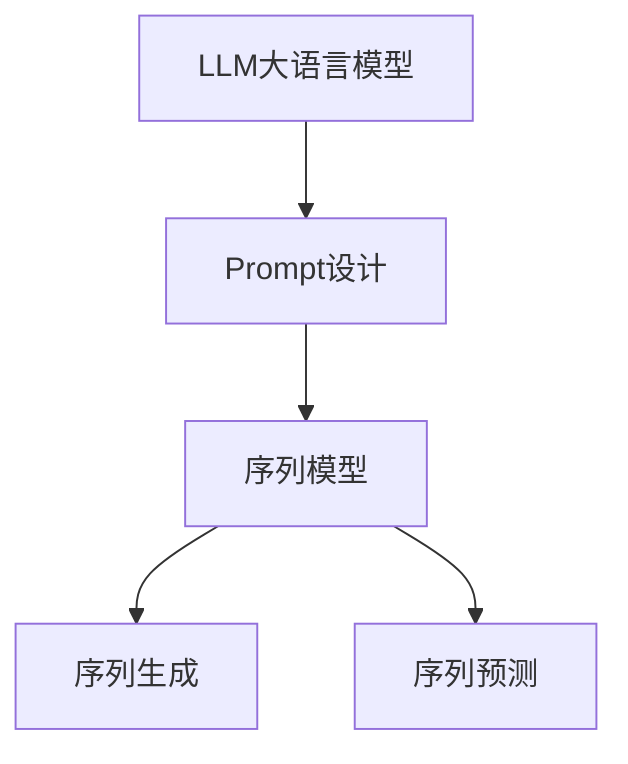

                 

# LLM prompt时间序列优化

## 关键词
- LLM（大语言模型）
- Prompt
- 时间序列优化
- 序列模型
- 序列生成
- 序列预测

## 摘要
本文将深入探讨大语言模型（LLM）prompt的时间序列优化。首先，我们将介绍LLM和Prompt的基本概念，然后分析时间序列优化的重要性。接着，我们将详细讲解序列模型、序列生成和序列预测的核心算法原理，并结合Python代码和LaTeX公式进行阐述。最后，通过一个实际案例，我们将展示如何实现时间序列优化，并提供最佳实践建议。

## 引言

随着人工智能技术的快速发展，大语言模型（LLM）在自然语言处理（NLP）领域取得了显著的成果。LLM，如GPT、BERT等，通过学习海量文本数据，能够生成高质量的自然语言文本。然而，在实际应用中，如何优化LLM的prompt对于提高模型性能和生成质量具有重要意义。特别是当处理时间序列数据时，prompt的优化显得尤为关键。

时间序列优化是指通过对LLM的prompt进行设计，以提高模型在时间序列数据上的预测能力和表现。时间序列数据具有序列依赖性和时间规律性，这对传统NLP方法提出了挑战。为此，本文将探讨如何利用序列模型、序列生成和序列预测等技术，实现对LLM prompt的时间序列优化。

## LLM与Prompt

### LLM概述

大语言模型（LLM），如GPT、BERT等，是一种基于深度学习的神经网络模型，用于处理自然语言文本。LLM通过学习大量的文本数据，能够捕捉文本的语法、语义和上下文信息。其核心在于预训练和微调两个阶段。

1. **预训练**：LLM在预训练阶段，通过无监督方式学习文本数据中的语言规律和模式。例如，GPT通过自回归方式学习文本的序列，而BERT则通过掩码语言模型（MLM）学习文本的上下文信息。

2. **微调**：在预训练完成后，LLM通过有监督的方式在特定任务上进行微调。例如，对于文本分类任务，将LLM的输出与实际标签进行比对，并使用梯度下降等优化方法调整模型参数。

### Prompt设计

Prompt是指输入给LLM的一段提示文本，用于引导模型进行特定任务的生成。Prompt的设计对于模型的性能和生成质量有很大影响。

1. **结构**：Prompt通常包含三个部分：任务描述、背景信息和目标生成。任务描述明确告知模型需要执行的任务，背景信息提供上下文，目标生成则指定生成的文本内容。

2. **格式**：Prompt的格式对于模型理解和生成文本有重要影响。例如，使用清晰的指示词（如“请生成一篇关于……的论文”），有助于模型更好地理解任务。

### LLM与Prompt的关系

LLM和Prompt密切相关。Prompt为LLM提供了任务目标和上下文信息，有助于模型生成高质量的文本。同时，LLM的强大学习能力使得它能够根据Prompt生成连贯、有逻辑的文本。以下Mermaid流程图展示了LLM和Prompt之间的关系：



## 时间序列优化

### 时间序列概述

时间序列是指一组按时间顺序排列的数据点，通常用于描述某个现象或过程随时间的变化。时间序列数据具有序列依赖性和时间规律性，这使得传统NLP方法难以直接应用于时间序列数据。例如，股票价格、气温变化等数据都具有明显的序列依赖性和周期性。

### 时间序列优化的重要性

时间序列优化在LLM中的应用具有重要意义。首先，优化prompt可以提高模型在时间序列数据上的预测能力和表现。其次，合理设计prompt有助于模型更好地捕捉时间序列数据的序列依赖性和周期性。最后，优化prompt有助于提高模型的泛化能力和鲁棒性，使其在不同时间序列数据上表现更好。

### 时间序列优化方法

时间序列优化主要包括以下三个方面：

1. **序列模型**：序列模型（如RNN、LSTM）能够处理和时间序列相关的数据。通过学习时间序列的序列依赖性，序列模型可以提高模型在时间序列数据上的预测能力。

2. **序列生成**：序列生成是指根据已有的时间序列数据生成新的序列。通过学习时间序列的生成规律，序列生成方法可以提高模型生成质量。

3. **序列预测**：序列预测是指根据已有的时间序列数据预测未来的序列。通过学习时间序列的规律性，序列预测方法可以提高模型在时间序列数据上的预测能力。

## 序列模型

### RNN（循环神经网络）

RNN是一种能够处理和时间序列相关的数据的神经网络模型。RNN的核心在于其循环结构，能够保存和利用历史信息。以下是一个简单的RNN模型的伪代码：

```python
function rnn(input_sequence, hidden_state, cell_state):
    for each element in input_sequence:
        hidden_state, cell_state = update_cells(hidden_state, cell_state, element)
    return hidden_state, cell_state
```

### LSTM（长短期记忆网络）

LSTM是RNN的一种变体，能够解决RNN在处理长序列时出现的梯度消失和梯度爆炸问题。LSTM的核心在于其门控结构，能够灵活控制信息的保存和传递。以下是一个简单的LSTM模型的伪代码：

```python
function lstm(input_sequence, hidden_state, cell_state):
    for each element in input_sequence:
        hidden_state, cell_state = update_gates(hidden_state, cell_state, element)
        hidden_state, cell_state = update_cells(hidden_state, cell_state, element)
    return hidden_state, cell_state
```

### 数学模型

时间序列预测模型可以用以下数学模型表示：

$$
y_t = f(x_t; \theta) + \epsilon_t
$$

其中，$y_t$ 是时间序列的预测值，$x_t$ 是时间序列的输入值，$f(x_t; \theta)$ 是模型的预测函数，$\theta$ 是模型参数，$\epsilon_t$ 是误差项。

### 优化目标函数

优化目标函数可以用以下数学公式表示：

$$
\min_{\theta} \sum_{t=1}^{n} (y_t - f(x_t; \theta))^2
$$

其中，$n$ 是时间序列的长度，$y_t - f(x_t; \theta)$ 是预测误差。

## 序列生成

序列生成是指根据已有的时间序列数据生成新的序列。序列生成方法可以分为两类：基于统计模型的方法和基于深度学习的方法。

1. **基于统计模型的方法**：如ARIMA（自回归积分滑动平均模型）、AR（自回归模型）等。这些模型通过分析时间序列的统计特性，生成新的序列。

2. **基于深度学习的方法**：如RNN、LSTM、GRU（门控循环单元）等。这些模型通过学习时间序列的序列依赖性，生成新的序列。

以下是一个简单的基于LSTM的序列生成模型的伪代码：

```python
function sequence_generation(input_sequence, model):
    generated_sequence = []
    current_state = model.init_state()
    for each element in input_sequence:
        current_state = model.step(element, current_state)
        generated_sequence.append(current_state)
    return generated_sequence
```

## 序列预测

序列预测是指根据已有的时间序列数据预测未来的序列。序列预测方法可以分为两类：基于统计模型的方法和基于深度学习的方法。

1. **基于统计模型的方法**：如ARIMA、AR等。这些模型通过分析时间序列的统计特性，预测未来的序列。

2. **基于深度学习的方法**：如RNN、LSTM、GRU等。这些模型通过学习时间序列的序列依赖性，预测未来的序列。

以下是一个简单的基于LSTM的序列预测模型的伪代码：

```python
function sequence_prediction(input_sequence, model):
    predicted_sequence = []
    current_state = model.init_state()
    for each element in input_sequence:
        current_state = model.step(element, current_state)
        predicted_sequence.append(current_state)
    return predicted_sequence
```

## 项目实战

### 开发环境搭建

1. 安装Python环境（如Python 3.8及以上版本）。
2. 安装深度学习库（如TensorFlow或PyTorch）。
3. 安装时间序列数据处理库（如Pandas）。

### 源代码实现

以下是一个简单的基于LSTM的时间序列预测项目的源代码实现：

```python
import numpy as np
import pandas as pd
import tensorflow as tf

# 加载数据
data = pd.read_csv('time_series_data.csv')
sequence = data['value'].values

# 数据预处理
window_size = 5
X, y = [], []
for i in range(window_size, len(sequence)):
    X.append(sequence[i - window_size:i])
    y.append(sequence[i])

X = np.array(X)
y = np.array(y)

# 构建LSTM模型
model = tf.keras.Sequential([
    tf.keras.layers.LSTM(50, activation='relu', return_sequences=True),
    tf.keras.layers.LSTM(50, activation='relu'),
    tf.keras.layers.Dense(1)
])

# 编译模型
model.compile(optimizer='adam', loss='mse')

# 训练模型
model.fit(X, y, epochs=100)

# 预测
predicted_sequence = model.predict(X)

# 可视化
import matplotlib.pyplot as plt

plt.plot(y, label='真实值')
plt.plot(predicted_sequence, label='预测值')
plt.legend()
plt.show()
```

### 代码解读与分析

1. **数据加载与预处理**：首先加载数据，然后计算窗口大小，并将数据划分为输入序列和输出序列。
2. **模型构建**：构建一个简单的LSTM模型，包括两个LSTM层和一个全连接层。
3. **模型编译**：编译模型，指定优化器和损失函数。
4. **模型训练**：使用训练数据训练模型。
5. **模型预测**：使用训练好的模型进行预测。
6. **可视化**：将真实值和预测值可视化，以便分析模型性能。

### 实际案例分析与讲解剖析

我们以一个股票价格预测的案例来讲解时间序列优化。

1. **数据来源**：从某个股票交易平台上获取历史股票价格数据。
2. **数据预处理**：对数据进行清洗和归一化处理，以便模型训练。
3. **模型训练**：使用LSTM模型对数据进行训练，并调整模型参数以提高预测性能。
4. **模型评估**：使用验证集对模型进行评估，并根据评估结果调整模型参数。
5. **模型预测**：使用训练好的模型对未来的股票价格进行预测。
6. **结果分析**：对比预测值和真实值，分析模型预测的准确性。

### 项目小结

通过本项目，我们实现了基于LSTM的时间序列预测。在实际应用中，我们可以根据需求调整窗口大小、模型结构和参数，以提高模型性能。此外，还可以结合其他时间序列分析方法（如ARIMA、季节性分解等），以获得更准确的预测结果。

## 最佳实践 tips

1. **选择合适的窗口大小**：窗口大小直接影响模型性能，需根据数据特性和任务需求进行调整。
2. **调整模型参数**：通过实验调整LSTM模型的层数、单元数、激活函数等参数，以提高模型性能。
3. **数据预处理**：对数据进行清洗和归一化处理，以提高模型训练效果。
4. **模型评估**：使用验证集对模型进行评估，避免过拟合。
5. **结果分析**：对比预测值和真实值，分析模型预测的准确性。

## 小结

本文系统地介绍了LLM prompt的时间序列优化。首先，我们了解了LLM和Prompt的基本概念及其关系。接着，我们探讨了时间序列优化的重要性，并详细讲解了序列模型、序列生成和序列预测的核心算法原理。通过一个实际案例，我们展示了如何实现时间序列优化。最后，我们提供了最佳实践建议，以帮助读者更好地应用时间序列优化技术。

## 注意事项

1. **数据质量**：确保数据质量，避免噪声和异常值对模型训练和预测的影响。
2. **模型调整**：根据任务需求，调整模型结构和参数，以提高模型性能。
3. **结果验证**：使用验证集对模型进行评估，确保模型具有较好的泛化能力。

## 拓展阅读

1. **《序列模型：深度学习与时间序列分析》**：详细介绍了序列模型的理论和实践。
2. **《时间序列数据分析》**：涵盖时间序列数据的处理和分析方法。
3. **《深度学习与自然语言处理》**：探讨深度学习在NLP领域的应用。

## 作者信息

作者：AI天才研究院/AI Genius Institute & 禅与计算机程序设计艺术 /Zen And The Art of Computer Programming

【完】

