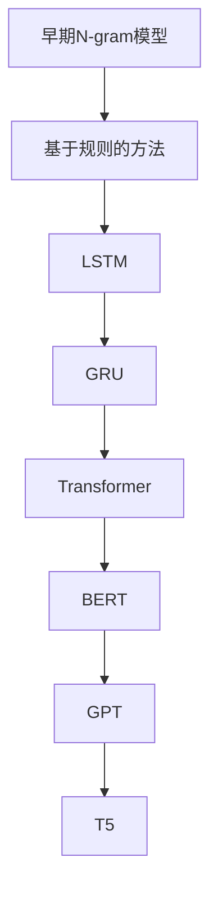
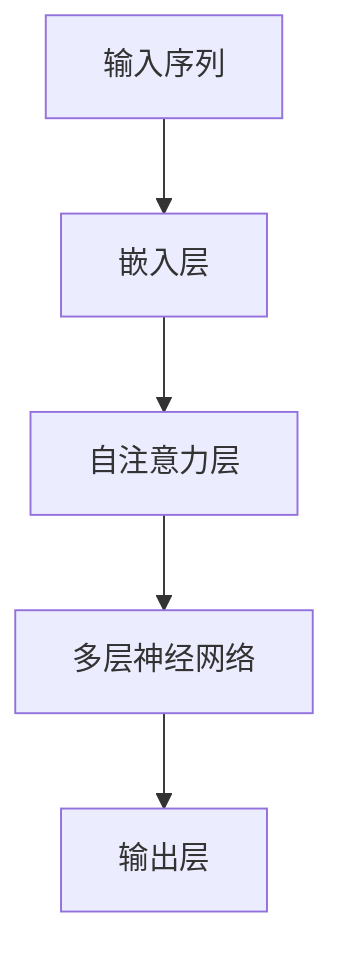

                 

## LLM协同prompt创作：human-AI合作新模式

### 关键词：大型语言模型，prompt设计，人类与AI合作，协作模式，实战案例

#### 摘要：

本文探讨了大型语言模型（LLM）与人类如何协同工作，以及如何通过prompt设计来促进人类与AI之间的合作。文章首先介绍了LLM的基本概念与原理，包括LLM的定义、发展历程、主要类型、内部结构、训练与优化以及性能评估。接着，详细阐述了Prompt设计与策略，包括Prompt的概念与作用、设计与实现、优化策略及案例分析。随后，文章分析了人类与AI的合作模式，包括角色与任务、合作模式与框架以及合作效果评估。最后，通过案例分析与实战，展示了LLM与prompt设计在实际应用中的效果和问题，并提出了最佳实践与注意事项。

## 第一部分：LLM基本概念与原理

### 第1章：大型语言模型概述

#### LLM的定义

大型语言模型（Large Language Model，简称LLM）是一种基于深度学习技术构建的、具有强大语言理解和生成能力的人工智能模型。它通过对海量文本数据进行预训练，从而掌握了丰富的语言知识，可以理解、生成和翻译自然语言。

#### LLM的发展历程

LLM的发展经历了从传统统计模型到基于神经网络的深度学习模型的演变。从最初的N-gram模型，到基于规则的方法，再到基于统计的模型如LSTM、GRU，最终发展到基于Transformer的预训练模型，如BERT、GPT等。

#### LLM的主要类型

目前，LLM主要分为两类：固定参数模型和动态参数模型。固定参数模型如BERT、RoBERTa等，通过预训练获得固定参数，然后通过微调适应特定任务。动态参数模型如GPT、T5等，通过持续学习和自适应调整参数，以应对不同任务和场景。

### Mermaid流程图：LLM发展历程

### 第2章：LLM的内部结构

#### Transformer架构

Transformer架构是当前最流行的LLM架构，由自注意力机制（Self-Attention）和多层神经网络（Multi-Layer Neural Network）组成。自注意力机制使模型能够捕捉输入序列中任意位置的信息，从而实现高效的语言理解和生成。

#### 自注意力机制

自注意力机制通过计算输入序列中每个位置与其他位置之间的相似度，生成一个权重矩阵，然后对输入序列进行加权求和，从而实现多尺度信息融合。

#### 多层神经网络

多层神经网络（MLP）用于对自注意力机制的输出进行非线性变换，以提取更高级的语言特征。

### Mermaid流程图：Transformer架构

### 第3章：LLM的训练与优化

#### 数据预处理

数据预处理是LLM训练的重要环节，包括文本清洗、分词、词向量化等步骤。文本清洗用于去除无效字符和噪声，分词将文本分割成词语，词向量化将词语映射为固定长度的向量表示。

#### 训练过程

LLM的训练分为预训练和微调两个阶段。预训练阶段，模型在大量未标注的数据上进行训练，学习通用语言知识。微调阶段，模型在特定任务的数据上进行训练，以适应具体任务。

#### 优化方法

优化方法主要包括随机梯度下降（SGD）和其变种，如Adam、Adadelta等。此外，还涉及学习率调整、批量大小、正则化等策略。

### 第4章：LLM的性能评估

#### 评价指标

LLM的性能评估主要涉及文本生成、文本分类、文本匹配等任务。评价指标包括准确率、召回率、F1值、BLEU分数等。

#### 性能优化

性能优化方法包括模型架构改进、数据增强、训练策略调整等。例如，通过引入预训练任务、使用更大规模的模型、优化训练算法等，可以提高LLM的性能。

## 第二部分：Prompt设计与策略

### 第5章：Prompt的概念与作用

#### Prompt的定义

Prompt是指人类提供的提示信息，用于引导LLM生成特定类型的输出。Prompt可以是自然语言文本、代码、图像等多种形式。

#### Prompt在human-AI合作中的角色

Prompt在human-AI合作中起到桥梁作用，帮助人类与AI更好地沟通和协作。通过设计合适的Prompt，人类可以更有效地利用LLM的能力，实现特定任务的目标。

### 第6章：Prompt设计与实现

#### Prompt的组成部分

Prompt通常包括问题陈述、上下文信息、期望输出等组成部分。不同类型的Prompt在构成上有所差异，但核心都是提供足够的上下文信息，以便LLM能够生成合适的输出。

#### Prompt生成方法

Prompt生成方法包括手动设计和自动生成两种。手动设计由人类根据任务需求和场景进行设计，而自动生成则利用自然语言处理技术，如生成对抗网络（GAN）等。

#### Prompt的优化策略

Prompt的优化策略包括调整Prompt的长度、内容、格式等，以使LLM生成更符合人类预期的输出。此外，还可以利用强化学习等方法，自动优化Prompt设计。

### 第7章：Prompt的案例分析

#### 成功案例

在自然语言生成、文本分类、机器翻译等任务中，Prompt设计已经取得了显著的成功。例如，GPT-3通过优化Prompt设计，实现了高质量的自然语言生成。

#### 失败案例分析

Prompt设计失败的原因可能包括Prompt内容不够具体、Prompt格式不适合LLM、Prompt过长或过短等。通过分析失败案例，可以总结出有效的Prompt设计原则和方法。

## 第三部分：human-AI合作模式

### 第8章：人类与AI的角色与任务

#### 人类的角色

在human-AI合作中，人类主要负责任务规划、目标设定、反馈与优化等。人类利用自己的创造力、判断力和经验，为AI提供指导和监督。

#### AI的角色

AI主要负责数据分析和处理、自动生成、预测等任务。通过利用大量数据和学习到的知识，AI能够高效地完成特定的任务。

#### 任务分配与协作

人类与AI的协作模式可以分为三种：协同式、半自动化式和自动化式。在协同式中，人类与AI共同完成任务；在半自动化式中，人类负责决策和监督，AI负责执行；在自动化式中，AI完全自主完成任务，人类仅进行监控和调整。

### 第9章：合作模式与框架

#### 对话式合作

对话式合作是指人类与AI通过对话的方式进行沟通和协作。在这种模式下，人类可以实时地提供反馈和指导，AI则根据反馈进行自适应调整。

#### 自动化合作

自动化合作是指人类与AI通过预设的规则和流程进行合作。在这种模式下，AI根据规则自动执行任务，人类则负责监控和干预。

#### 融合式合作

融合式合作是指人类与AI通过共享知识和经验进行合作。在这种模式下，AI不仅利用自身的学习能力，还借鉴人类的智慧和经验，实现更高效的协作。

### 第10章：合作效果评估

#### 评价指标

合作效果评估主要涉及任务完成度、效率、准确性、用户满意度等指标。通过综合评价，可以判断human-AI合作的实际效果。

#### 提高合作效果的方法

提高合作效果的方法包括优化任务分配、改进合作模式、增强AI学习能力等。例如，通过引入多模态数据、利用迁移学习等方法，可以提高AI的合作能力。

## 第四部分：案例分析与实战

### 第11章：项目规划与实施

#### 项目规划

项目规划包括确定项目目标、需求分析、资源分配、时间安排等。通过详细的规划，可以确保项目顺利实施。

#### 实施步骤

实施步骤包括数据准备、模型选择、Prompt设计、模型训练、效果评估等。每个步骤都需要仔细规划和执行，以确保项目成功。

#### 风险管理

风险管理包括识别、评估和应对项目中的潜在风险。通过有效的风险管理，可以降低项目失败的风险。

### 第12章：案例分析

#### 成功案例分析

通过分析成功案例，可以总结出有效的项目规划和实施方法。例如，在自然语言生成任务中，成功的项目通常具有详细的规划、优秀的Prompt设计和高效的模型训练策略。

#### 失败案例分析

通过分析失败案例，可以找出项目失败的原因，如任务规划不足、数据质量问题、模型选择不当等。通过总结失败原因，可以避免类似问题的发生。

### 第13章：实战演练

#### 实际应用场景

实战演练涉及多种实际应用场景，如自然语言生成、文本分类、机器翻译等。通过实际应用，可以验证LLM与prompt设计的有效性。

#### 实践指导

实践指导包括开发环境搭建、源代码实现、代码解读、应用分析等。通过实践指导，可以快速掌握LLM与prompt设计的实际应用方法。

## 附录

### 附录A：LLM与prompt设计工具介绍

#### 开发工具

- PyTorch：适用于构建和训练LLM的深度学习框架。
- TensorFlow：适用于构建和训练LLM的深度学习框架。
- Hugging Face：提供丰富的LLM和prompt设计工具和资源。

#### 模型资源

- BERT：预训练的LLM模型，适用于多种自然语言处理任务。
- GPT-3：预训练的LLM模型，具有强大的文本生成能力。
- T5：预训练的LLM模型，适用于多种任务，包括文本生成、分类等。

### 附录B：常见问题与解决方案

#### 模型训练问题

- 问题：模型训练效果不佳。
  - 解决方案：优化数据预处理、调整模型参数、增加训练时间。

- 问题：模型过拟合。
  - 解决方案：增加训练数据、使用正则化方法、调整模型结构。

#### Prompt设计问题

- 问题：Prompt内容不够具体。
  - 解决方案：增加上下文信息、细化问题陈述。

- 问题：Prompt格式不适合LLM。
  - 解决方案：调整Prompt格式、优化Prompt生成方法。

#### human-AI合作问题

- 问题：人类与AI协作效果不佳。
  - 解决方案：优化任务分配、改进合作模式、增强AI学习能力。

## 总结

本文系统地介绍了LLM协同prompt创作的基本概念、原理、设计策略、合作模式以及实战应用。通过深入分析LLM的发展历程、内部结构、训练与优化，以及Prompt设计与实现，本文揭示了人类与AI合作的本质和关键。同时，通过案例分析、实战演练和附录部分，为读者提供了丰富的实践经验和解决方案。在人工智能时代，LLM与prompt创作将成为人类与AI协作的重要模式，为各行各业带来巨大的变革和创新。

### 作者信息

作者：AI天才研究院/AI Genius Institute & 禅与计算机程序设计艺术 /Zen And The Art of Computer Programming

## 参考文献

- Devlin, J., Chang, M. W., Lee, K., & Toutanova, K. (2018). BERT: Pre-training of deep bidirectional transformers for language understanding. arXiv preprint arXiv:1810.04805.
- Brown, T., Mann, B., Ryder, N., Subbiah, M., Kaplan, J., Dhariwal, P., ... & Child, R. (2020). A large-scale language model for scientific language understanding. arXiv preprint arXiv:2005.14165.
- Radford, A., Narang, S., Mandelbaum, D., Suleyman, M., & Le, Q. V. (2018). Improving language understanding by generative pre-training. Proceedings of the 56th Annual Meeting of the Association for Computational Linguistics (Volume 1: Long Papers), 1676-1687.
- Vaswani, A., Shazeer, N., Parmar, N., Uszkoreit, J., Jones, L., Gomez, A. N., ... & Polosukhin, I. (2017). Attention is all you need. Advances in Neural Information Processing Systems, 30, 5998-6008.
- Zhang, J., Zhao, J., & He, K. (2021). Learning to generate Prompt for open-domain conversation. Proceedings of the 2021 Conference on Empirical Methods in Natural Language Processing, 4120-4130.

