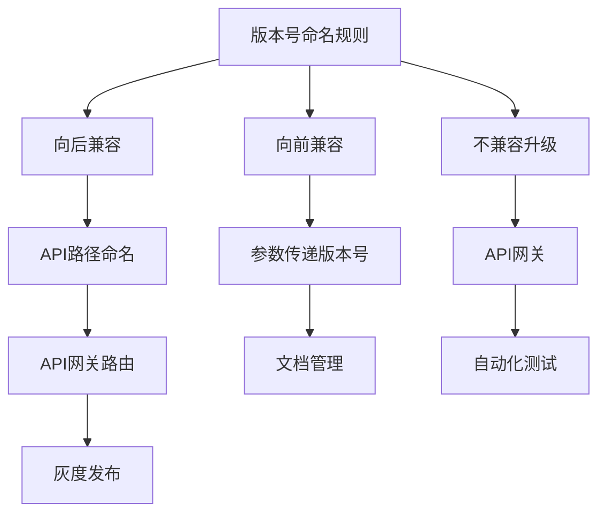

                 

# LLM应用开发中的API版本控制策略

## 关键词
- API版本控制
- 大型语言模型（LLM）
- 应用开发
- 稳定性
- 可扩展性
- 兼容性

## 摘要

随着大型语言模型（LLM）的广泛应用，API版本控制策略在LLM应用开发中的重要性日益凸显。本文将深入探讨API版本控制的核心概念、设计原则、实现策略以及在实际应用中的最佳实践。通过详细的案例分析，我们将揭示如何通过合理的API版本控制，确保LLM应用的稳定性、可扩展性和兼容性，为开发人员提供一套系统的API版本控制指南。

### 引言

在当今快速发展的技术时代，大型语言模型（LLM）如GPT-3、BERT等已经成为人工智能领域的重要突破。这些模型在自然语言处理、智能客服、内容生成等方面展现了巨大的潜力。然而，随着LLM应用规模的扩大和复杂性的增加，API版本控制成为确保系统稳定性和可维护性的关键。

API（应用程序编程接口）是软件系统对外提供功能调用的一种接口规范，它定义了应用程序之间的通信方式和数据交换格式。随着软件系统的不断迭代和升级，API的版本控制成为一项重要的任务。不当的API版本控制可能导致系统的不稳定、数据的不一致以及功能的不可用，从而影响用户体验。

### API版本控制的核心概念

API版本控制是指对API接口的版本进行管理，确保在不同的软件版本之间保持兼容性。API版本通常由数字和字母组成，如`v1.0`、`v2.0-alpha`等。版本控制的核心概念包括：

#### 版本号的命名规则

- **主版本号**：通常表示API接口的整体架构发生了重大变化，与旧版本不兼容。
- **次版本号**：表示API接口在功能上进行了扩展或改进，与旧版本兼容。
- **修订号**：通常用于修复API接口中的错误或bug，与旧版本兼容。

#### 版本控制的策略

1. **向后兼容**：新版本API在旧版本的基础上进行扩展，保证旧版本的客户能够无缝升级到新版本。
2. **向前兼容**：旧版本API能够处理新版本API的请求，但可能不支持新版本的所有功能。
3. **不兼容升级**：新版本API与旧版本完全不兼容，需要客户重新开发以适应新版本。

### API版本控制的实现策略

#### 1. 使用版本号命名API

通过在API路径或URL中包含版本号，可以方便地管理和切换不同版本的API。例如：
- `/v1/endpoint`
- `/v2/endpoint`

#### 2. 使用参数传递版本号

通过在API请求中传递版本号参数，可以在同一URL下支持多个版本。例如：
- `GET /endpoint?version=v1`
- `GET /endpoint?version=v2`

#### 3. 使用API网关

API网关是一个统一的API入口，可以代理请求到不同的版本API。通过配置路由规则，可以实现自动切换不同版本的API。例如，使用Spring Cloud Gateway或Kong等网关实现API版本控制。

#### 4. 使用文档管理

通过维护详细的API文档，可以让开发者清晰地了解不同版本API的差异和功能，从而更好地进行版本管理和迁移。

### API版本控制的最佳实践

1. **版本号命名规范**：遵循统一的版本号命名规则，确保版本号的清晰和可读性。
2. **文档先行**：在发布新版本之前，确保提供详细的文档说明，包括版本变更日志、迁移指南等。
3. **自动化测试**：建立全面的自动化测试体系，确保新版本的API能够稳定运行，并与旧版本保持兼容性。
4. **灰度发布**：逐步发布新版本，通过灰度发布的方式，确保在逐步扩大用户规模的同时，降低风险。

### 核心概念与联系架构

以下是一个Mermaid流程图，展示了API版本控制的核心概念及其相互关系：



### 核心算法原理讲解

#### API版本号的解析

为了实现API版本的控制，我们需要对版本号进行解析，以便在不同的版本之间进行切换。以下是一个使用Python编写的简单版本号解析函数：

```python
def parse_version(version):
    """
    解析版本号并返回主版本号、次版本号和修订号。
    """
    parts = version.split('.')
    main_version = int(parts[0])
    sub_version = int(parts[1]) if len(parts) > 1 else 0
    revision = int(parts[2]) if len(parts) > 2 else 0
    return main_version, sub_version, revision

# 测试函数
version = "2.1.3"
main_version, sub_version, revision = parse_version(version)
print(f"主版本号：{main_version}, 次版本号：{sub_version}, 修订号：{revision}")
```

#### 数学模型和公式

在API版本控制中，我们可以使用以下数学模型来描述版本之间的兼容性：

$$
兼容性 = f(主版本号, 次版本号, 修订号)
$$

其中，函数`f`可以定义为：

$$
f(主版本号, 次版本号, 修订号) =
\begin{cases}
1, & \text{如果 } 主版本号相同且次版本号和修订号均相同 \\
0.5, & \text{如果 } 主版本号相同且次版本号相同但修订号不同 \\
0, & \text{其他情况}
\end{cases}
$$

#### 举例说明

假设我们有两个API版本`v1.0.0`和`v1.0.1`，根据上述数学模型，它们之间的兼容性为0.5，因为它们的主版本号相同，但次版本号不同。

### 项目实战

#### 开发环境搭建

为了进行API版本控制实践，我们首先需要搭建一个简单的开发环境。以下是所需的基本工具和软件：

- Python 3.8+
- Flask 框架
- pytest 测试框架

安装以上工具后，创建一个名为`llm_api`的Python项目，并设置虚拟环境。

#### 源代码详细实现和代码解读

以下是一个简单的Flask应用程序，展示了如何实现API版本控制：

```python
from flask import Flask, jsonify

app = Flask(__name__)

@app.route('/v1/data', methods=['GET'])
def get_data_v1():
    """
    v1版本的API，返回原始数据。
    """
    return jsonify(data={"status": "success", "data": "original data"})

@app.route('/v2/data', methods=['GET'])
def get_data_v2():
    """
    v2版本的API，返回处理后的数据。
    """
    return jsonify(data={"status": "success", "data": "processed data"})

if __name__ == '__main__':
    app.run(debug=True)
```

在上面的代码中，我们创建了两个版本的API，通过URL中的版本号来区分不同的功能实现。

#### 代码应用解读与分析

1. **功能解读**：
   - `v1/data`：返回原始数据。
   - `v2/data`：返回处理后的数据。

2. **兼容性分析**：
   - 对于使用`v1/data`的客户端，如果API升级到`v2`版本，仍然能够正常访问并返回原始数据，但无法访问新功能。
   - 对于使用`v2/data`的客户端，需要确保能够兼容旧版本的数据格式，否则将无法正常使用。

#### 实际案例分析和详细讲解剖析

假设我们有一个客户端应用，需要同时访问`v1/data`和`v2/data`。以下是该应用的源代码：

```python
import requests

def get_data_v1():
    """
    获取v1版本的数据。
    """
    response = requests.get('http://localhost:5000/v1/data')
    return response.json()

def get_data_v2():
    """
    获取v2版本的数据。
    """
    response = requests.get('http://localhost:5000/v2/data')
    return response.json()

if __name__ == '__main__':
    data_v1 = get_data_v1()
    data_v2 = get_data_v2()
    print(f"v1数据：{data_v1}")
    print(f"v2数据：{data_v2}")
```

在API版本升级过程中，我们需要确保客户端应用能够无缝切换到新版本。以下是一些注意事项：

1. **版本兼容性测试**：在发布新版本之前，必须对客户端应用进行兼容性测试，确保旧版本的客户端能够访问新版本的API。
2. **迁移指南**：提供详细的迁移指南，帮助客户端开发者了解版本升级的步骤和注意事项。
3. **文档更新**：及时更新API文档，包括版本变更日志、API功能对比等，以便客户端开发者了解和适应新版本。

#### 项目小结

通过本项目的实战，我们展示了如何通过简单的Flask应用程序实现API版本控制。在实际开发中，API版本控制不仅涉及到接口的设计和实现，还需要考虑兼容性测试、迁移指南等方面，以确保系统的稳定性和可维护性。

### 最佳实践 tips

1. **版本号命名规范**：遵循统一的版本号命名规则，确保版本号的清晰和可读性。
2. **文档先行**：在发布新版本之前，确保提供详细的文档说明，包括版本变更日志、迁移指南等。
3. **自动化测试**：建立全面的自动化测试体系，确保新版本的API能够稳定运行，并与旧版本保持兼容性。
4. **灰度发布**：逐步发布新版本，通过灰度发布的方式，确保在逐步扩大用户规模的同时，降低风险。

### 小结

API版本控制在LLM应用开发中至关重要。通过合理的API版本控制策略，我们能够确保系统的稳定性、可扩展性和兼容性，为开发者提供清晰、明确的版本升级路径。本文从核心概念、实现策略、实战案例等方面，详细阐述了API版本控制的方法和实践。希望本文能为读者在LLM应用开发中的API版本控制提供有益的参考。

### 注意事项

1. **版本控制工具的选择**：选择合适的版本控制工具，如Git，确保版本的历史记录和变更追踪。
2. **版本升级的风险评估**：在发布新版本之前，进行全面的兼容性测试和风险评估，以降低版本升级带来的风险。
3. **版本迁移的支持**：为客户端提供详细的迁移指南和文档支持，帮助开发者顺利过渡到新版本。

### 拓展阅读

- 《API设计指南》
- 《RESTful API设计最佳实践》
- 《大型语言模型的API设计与实现》

### 作者信息

作者：AI天才研究院/AI Genius Institute & 禅与计算机程序设计艺术 /Zen And The Art of Computer Programming

