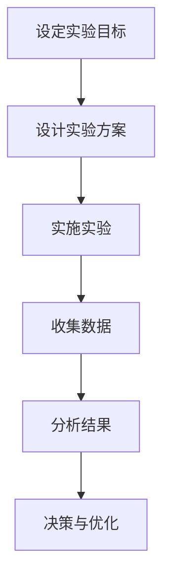

                 

### 文章标题

# LLM应用开发中的A/B测试策略

在当今飞速发展的AI领域，语言模型（LLM）已经成为许多应用的核心技术之一。从自然语言处理（NLP）到智能客服，再到生成式AI，LLM在提升应用性能和用户体验方面发挥着至关重要的作用。然而，随着LLM应用场景的日益复杂和多样化，如何有效地评估和优化这些应用成为了一个关键问题。A/B测试作为一种科学的方法，不仅可以帮助我们评估LLM应用的性能，还能指导我们做出数据驱动的决策，从而提升应用的质量和用户满意度。

本文将深入探讨LLM应用开发中的A/B测试策略，首先介绍LLM的基本概念和A/B测试的基本原理，然后详细阐述如何将A/B测试应用于LLM开发过程中，包括策略设计、执行和评估。通过具体案例和实战经验，我们将展示如何利用A/B测试来优化LLM应用，提高其性能和用户体验。

本文将涵盖以下核心内容：

1. **LLM基础**：介绍语言模型的基本概念、分类和训练过程。
2. **A/B测试概述**：讲解A/B测试的定义、原理和适用场景。
3. **LLM与A/B测试的结合**：探讨如何将A/B测试应用于LLM开发，并分析其影响。
4. **策略设计**：详细描述A/B测试策略的设计步骤和关键点。
5. **实战应用**：通过具体案例展示A/B测试在LLM应用开发中的实际应用。

通过本文，读者将能够全面了解LLM应用开发中的A/B测试策略，掌握如何利用这一方法来提升LLM应用的性能和用户体验。

---

### 关键词

- 语言模型（LLM）
- A/B测试
- 应用开发
- 性能优化
- 用户满意度
- 数据驱动决策

### 摘要

本文旨在探讨大型语言模型（LLM）应用开发中的A/B测试策略。文章首先介绍了LLM的基本概念和A/B测试的基本原理，接着详细阐述了如何设计、执行和评估A/B测试策略。通过具体案例和实战经验，本文展示了如何利用A/B测试优化LLM应用，提高性能和用户体验。文章内容涵盖LLM基础、A/B测试概述、策略设计、实战应用等多个方面，旨在为AI开发者和研究者提供实用的参考。

---

### 文章正文

#### 第一部分：概述

#### 1.1 语言模型基础

语言模型（Language Model，简称LM）是一种自然语言处理（Natural Language Processing，简称NLP）技术，旨在模拟人类语言习惯，为文本生成、翻译、摘要等任务提供基础支持。语言模型通过学习大量文本数据，生成概率分布，预测下一个词语或句子。

语言模型可以分为两类：基于规则的语言模型和基于统计的语言模型。基于规则的语言模型通过手工编写的语法规则进行语言生成，而基于统计的语言模型则利用统计学方法，通过大量语料数据训练得到。

近年来，深度学习技术的迅猛发展为语言模型的研究和应用带来了新的机遇。特别是大型语言模型（Large Language Model，简称LLM），如GPT系列、BERT等，凭借其强大的表达能力和生成能力，已经在多个领域取得了显著的成果。LLM的核心思想是利用深度神经网络，捕捉文本数据中的复杂依赖关系和语义信息。

#### 1.2 A/B测试概述

A/B测试（A/B Testing）是一种常用的对比实验方法，通过将用户随机分配到两个或多个实验组，比较不同处理（或版本）的效果，从而评估和优化系统性能。A/B测试的核心思想是利用统计方法，对实验结果进行分析，从而得出结论。

A/B测试的基本流程包括以下步骤：

1. **设定实验目标**：明确希望通过实验解决的问题或优化目标。
2. **设计实验方案**：定义实验组和对照组，以及实验的具体操作。
3. **实施实验**：将用户随机分配到实验组和对照组。
4. **收集数据**：收集实验期间的用户行为和系统性能数据。
5. **分析结果**：使用统计方法分析实验数据，评估不同处理的效果。

A/B测试的优势在于其科学性和数据驱动的决策方式。通过实验，我们可以避免主观臆断，更准确地了解用户行为和系统性能，从而做出更明智的决策。

#### 1.3 LLM与A/B测试的结合点

在LLM应用开发中，A/B测试被广泛应用于性能优化和用户体验提升。LLM具有强大的表达能力和生成能力，但其性能和效果往往受到多种因素的影响，如模型参数、训练数据、用户输入等。通过A/B测试，我们可以系统地评估和优化这些因素，从而提高LLM应用的性能和用户体验。

具体来说，LLM与A/B测试的结合点主要体现在以下几个方面：

1. **模型调优**：通过A/B测试，可以评估不同模型参数对性能的影响，从而找到最优参数组合。
2. **数据质量**：通过A/B测试，可以评估不同训练数据集对模型性能的影响，从而选择最合适的训练数据。
3. **用户输入**：通过A/B测试，可以评估不同用户输入对模型生成结果的影响，从而优化用户交互体验。

#### 1.4 Mermaid流程图：LLM与A/B测试结合的流程

以下是一个简单的Mermaid流程图，展示了LLM应用开发中A/B测试的基本流程：



通过上述流程，我们可以系统地设计和执行A/B测试，从而优化LLM应用。

#### 第二部分：基础知识

#### 2.1 LLM基础

##### 2.1.1 语言模型简介

语言模型是一种基于统计模型或神经网络模型的技术，用于模拟自然语言的处理过程。它可以用于多种应用场景，如文本生成、文本分类、机器翻译等。

语言模型的基本概念包括：

1. **词汇表**：词汇表是语言模型的基础，包含了所有可能的单词或符号。
2. **概率分布**：语言模型通过学习大量文本数据，生成词汇表中的每个单词或符号的概率分布。
3. **序列生成**：语言模型可以根据当前输入的序列，生成下一个可能的序列。

语言模型可以分为两类：基于规则的语言模型和基于统计的语言模型。

基于规则的语言模型通过手工编写的语法规则进行语言生成。这种方法在早期自然语言处理领域被广泛应用，但由于其依赖于人工编写规则，难以应对复杂和变化的自然语言场景。

基于统计的语言模型则利用统计学方法，通过大量语料数据训练得到。这种方法的核心思想是利用统计模型，如N-gram模型、神经网络模型等，捕捉文本数据中的复杂依赖关系和语义信息。

近年来，深度学习技术的迅猛发展为语言模型的研究和应用带来了新的机遇。特别是大型语言模型（Large Language Model，简称LLM），如GPT系列、BERT等，凭借其强大的表达能力和生成能力，已经在多个领域取得了显著的成果。

##### 2.1.2 LLM的结构与工作原理

大型语言模型（LLM）通常采用深度神经网络结构，如变换器（Transformer）模型。变换器模型由编码器（Encoder）和解码器（Decoder）两个部分组成，分别用于处理输入和生成输出。

编码器（Encoder）将输入的文本序列转化为编码表示，解码器（Decoder）则根据编码表示生成输出文本序列。编码器和解码器之间通过注意力机制（Attention Mechanism）相互协作，捕捉输入和输出之间的依赖关系。

具体来说，LLM的工作原理包括以下几个步骤：

1. **输入编码**：将输入文本序列转化为编码表示。这一过程通常通过嵌入层（Embedding Layer）实现，将单词或符号映射为固定大小的向量。
2. **编码表示**：编码器对嵌入向量进行处理，生成编码表示。这一过程通常通过多层变换器层（Transformer Layer）实现，每层变换器都可以捕捉输入序列中的局部依赖关系。
3. **输出生成**：解码器根据编码表示生成输出文本序列。这一过程同样通过多层变换器层实现，解码器在每一步生成输出时，都可以根据当前生成的输出和编码表示，更新解码器的状态。
4. **输出解码**：解码器生成的输出可以是文本序列或概率分布。在实际应用中，通常需要对输出进行后处理，如去除未登录词、添加标点符号等，以生成符合人类语言习惯的输出文本。

##### 2.1.3 LLM的训练过程

LLM的训练过程主要包括数据预处理、模型训练和优化等步骤。

1. **数据预处理**：首先需要对训练数据进行预处理，包括分词、去噪、标准化等操作。对于中文数据，还需要进行词性标注和命名实体识别等操作。
2. **模型训练**：使用预处理的训练数据对LLM模型进行训练。训练过程通常采用优化算法（如Adam优化器）和损失函数（如交叉熵损失函数），通过反向传播（Backpropagation）算法更新模型参数。
3. **模型优化**：在训练过程中，需要对模型进行优化，以提高模型性能和泛化能力。常用的优化方法包括正则化（Regularization）、dropout（Dropout）和早期停止（Early Stopping）等。

##### 2.1.4 LLM的性能评估

LLM的性能评估通常包括以下几个指标：

1. **准确性**：衡量模型在测试集上的预测准确性。对于分类任务，准确性可以用来评估模型的分类效果。
2. **F1分数**：对于分类任务，F1分数综合考虑了精确率和召回率，是评估分类模型性能的重要指标。
3. **BLEU分数**：用于评估文本生成任务中模型生成的文本质量。BLEU分数基于模型生成的文本与参考文本之间的相似度进行计算。
4. **ROUGE分数**：用于评估文本摘要任务中模型生成的摘要质量。ROUGE分数基于模型生成的文本与参考文本之间的重叠度进行计算。

#### 2.2 A/B测试基础

##### 2.2.1 A/B测试的基本流程

A/B测试是一种经典的实验设计方法，通过将用户随机分配到两个或多个实验组，比较不同处理的效果，从而评估和优化系统性能。A/B测试的基本流程包括以下几个步骤：

1. **设定实验目标**：明确希望通过实验解决的问题或优化目标。
2. **设计实验方案**：定义实验组和对照组，以及实验的具体操作。
3. **实施实验**：将用户随机分配到实验组和对照组。
4. **收集数据**：收集实验期间的用户行为和系统性能数据。
5. **分析结果**：使用统计方法分析实验数据，评估不同处理的效果。
6. **决策与优化**：根据实验结果做出决策，并对系统进行优化。

##### 2.2.2 A/B测试的统计原理

A/B测试的统计原理主要基于假设检验（Hypothesis Testing）。假设检验包括原假设（Null Hypothesis）和备择假设（Alternative Hypothesis）。在A/B测试中，原假设通常表示对照组和处理组之间的效果没有显著差异，备择假设则表示处理组的效果显著优于对照组。

具体来说，A/B测试的统计原理包括以下几个步骤：

1. **设定显著性水平**：显著性水平（Significance Level）用于衡量实验结果是否具有统计显著性。常见的显著性水平为0.05或0.01。
2. **计算检验统计量**：根据实验数据，计算检验统计量（Test Statistic），如t统计量或z统计量。
3. **确定拒绝域**：根据显著性水平和检验统计量，确定拒绝域（Critical Region）。
4. **做出决策**：如果检验统计量落在拒绝域内，则拒绝原假设，接受备择假设，认为处理组的效果显著优于对照组；否则，无法拒绝原假设，认为处理组的效果没有显著差异。

##### 2.2.3 A/B测试的适用场景

A/B测试广泛应用于各种场景，如产品优化、用户体验提升、市场营销等。以下是一些常见的适用场景：

1. **产品优化**：通过A/B测试，可以评估不同产品设计对用户行为和系统性能的影响，从而找到最优的设计方案。
2. **用户体验提升**：通过A/B测试，可以评估不同功能模块对用户体验的影响，从而优化用户界面和交互流程。
3. **市场营销**：通过A/B测试，可以评估不同广告文案、着陆页等对用户转化率的影响，从而优化市场营销策略。

#### 2.3 LLM与A/B测试的结合原理

在LLM应用开发中，A/B测试被广泛应用于性能优化和用户体验提升。LLM具有强大的表达能力和生成能力，但其性能和效果往往受到多种因素的影响，如模型参数、训练数据、用户输入等。通过A/B测试，我们可以系统地评估和优化这些因素，从而提高LLM应用的性能和用户体验。

具体来说，LLM与A/B测试的结合原理主要体现在以下几个方面：

1. **模型调优**：通过A/B测试，可以评估不同模型参数对性能的影响，从而找到最优参数组合。
2. **数据质量**：通过A/B测试，可以评估不同训练数据集对模型性能的影响，从而选择最合适的训练数据。
3. **用户输入**：通过A/B测试，可以评估不同用户输入对模型生成结果的影响，从而优化用户交互体验。

#### 2.4 Mermaid流程图：LLM与A/B测试结合的流程

以下是一个简单的Mermaid流程图，展示了LLM应用开发中A/B测试的基本流程：


通过上述流程，我们可以系统地设计和执行A/B测试，从而优化LLM应用。

#### 第三部分：策略设计

#### 3.1 A/B测试策略设计

A/B测试策略设计是A/B测试成功的关键。一个良好的策略需要明确实验目标、设计合适的实验方案、选择合适的实验指标，并考虑实验的执行和数据分析。以下是A/B测试策略设计的详细步骤：

##### 3.1.1 确定实验目标

首先，我们需要明确A/B测试的目标。实验目标可以包括提升用户满意度、提高用户留存率、增加用户活跃度等。明确实验目标有助于后续设计实验方案和选择实验指标。

例如，如果目标是提高用户满意度，我们可以设定以下具体目标：
- 提高用户对界面设计的满意度。
- 减少用户对功能模块的使用难度。
- 增强用户对系统性能的满意度。

##### 3.1.2 设计实验方案

在明确实验目标后，我们需要设计实验方案。实验方案包括定义实验组和对照组，以及实验的具体操作。实验组是接受新处理或改进的用户组，对照组是保持原有状态的用户组。

例如，为了评估新界面设计对用户满意度的提升，我们可以设计以下实验方案：
- 实验组：使用新界面设计的用户。
- 对照组：使用旧界面设计的用户。

具体操作可以是：
- 向实验组用户推送新界面设计。
- 观察实验组和对照组用户的满意度变化。

##### 3.1.3 确定实验指标

实验指标是衡量实验效果的关键。合适的实验指标应该能够直接反映实验目标。常见的实验指标包括用户满意度、用户留存率、用户活跃度等。

例如，为了评估新界面设计对用户满意度的提升，我们可以设定以下实验指标：
- 用户满意度评分：通过问卷调查或用户反馈获取。
- 用户留存率：实验期间内留存用户占总用户数的比例。
- 用户活跃度：用户在实验期间的登录次数或使用时长。

##### 3.1.4 分配用户并执行实验

在实验方案和实验指标确定后，我们需要将用户随机分配到实验组和对照组。随机分配可以避免主观偏见，确保实验结果的可靠性。

例如，我们可以在用户注册或登录时，将其随机分配到实验组或对照组。然后，我们可以开始执行实验，观察并记录实验指标的变化。

##### 3.1.5 数据收集与整理

在实验执行过程中，我们需要收集用户行为数据和系统性能数据。这些数据可以通过日志记录、用户反馈、监控系统等获取。收集到的数据需要经过整理和清洗，以确保数据质量。

例如，我们可以收集以下数据：
- 用户满意度评分。
- 用户留存数据。
- 用户活跃数据。
- 系统性能指标。

##### 3.1.6 数据分析与结果解读

在数据收集完成后，我们需要使用统计方法对实验结果进行分析。数据分析可以帮助我们判断实验效果是否显著，从而得出结论。

例如，我们可以使用t检验或方差分析（ANOVA）等方法，比较实验组和对照组的实验指标差异。如果差异显著，我们可以认为新界面设计对用户满意度有显著提升。

##### 3.1.7 决策与优化

根据数据分析结果，我们可以做出决策，并针对实验结果进行优化。例如，如果新界面设计显著提升了用户满意度，我们可以将新界面设计推广到所有用户。如果实验效果不显著，我们需要重新审视实验方案，考虑是否需要调整实验目标或指标。

#### 3.2 LLM调优与A/B测试

在LLM应用开发中，A/B测试不仅可以用于用户体验优化，还可以用于模型调优。通过A/B测试，我们可以评估不同模型参数和训练数据对模型性能的影响，从而找到最优模型配置。

##### 3.2.1 确定调优目标

在进行LLM调优时，我们需要明确调优目标。调优目标可以是提高模型准确性、减少计算资源消耗、提升生成文本质量等。

例如，如果我们希望提高模型准确性，我们可以设定以下调优目标：
- 提高文本分类任务的准确率。
- 减少机器翻译任务的错误率。
- 提高文本生成任务的连贯性和语义一致性。

##### 3.2.2 设计调优实验

为了实现调优目标，我们需要设计一系列的A/B测试实验。每个实验可以测试一个或多个模型参数或训练数据集。

例如，为了提高文本分类任务的准确率，我们可以设计以下实验：
- 实验A：调整模型中的隐藏层神经元数量。
- 实验B：更换不同的训练数据集。

具体步骤如下：

1. **设定实验参数**：确定实验中需要调整的参数，如隐藏层神经元数量、学习率、正则化参数等。
2. **分配实验组**：将训练数据随机分为实验组和对照组，确保每组数据具有相似的特征分布。
3. **训练模型**：使用实验组数据进行模型训练，记录模型性能指标。
4. **评估模型**：使用对照组数据评估模型性能，比较不同实验组的性能差异。

##### 3.2.3 分析实验结果

在完成A/B测试实验后，我们需要对实验结果进行分析。通过分析实验结果，我们可以找出最优的模型参数或训练数据集。

例如，通过比较不同实验组的模型准确率，我们可以找到最优的隐藏层神经元数量。如果某个实验组的准确率显著高于其他组，我们可以认为该实验组中的参数设置是最优的。

##### 3.2.4 模型优化与迭代

根据实验结果，我们可以对模型进行优化。优化过程可能需要多次迭代，以逐步提高模型性能。

例如，我们可以根据实验结果调整模型参数，重新训练模型，并再次进行A/B测试。通过多次迭代，我们可以逐步找到最优的模型配置。

#### 3.3 A/B测试策略案例分析

以下是一个关于LLM应用开发中A/B测试策略的案例分析：

##### 案例背景

某公司在开发一款基于大型语言模型（LLM）的智能客服系统。该系统旨在通过自然语言处理技术，为用户提供快速、准确的客服支持。然而，在实际使用过程中，用户反馈系统的响应速度较慢，影响用户体验。为了优化系统性能，公司决定通过A/B测试进行模型调优。

##### 实验目标

实验目标是通过A/B测试优化LLM模型，提高系统响应速度，提升用户满意度。

##### 实验设计

实验设计如下：
1. **实验组A**：调整模型中的隐藏层神经元数量，从128个增加到256个。
2. **实验组B**：更换不同的训练数据集，使用更大规模的语料库。
3. **对照组**：保持原有模型参数和训练数据集。

##### 实验执行

1. **数据准备**：将训练数据随机分为实验组和对照组。
2. **模型训练**：使用实验组数据进行模型训练，记录模型性能指标。
3. **模型评估**：使用对照组数据评估模型性能，比较不同实验组的性能差异。

##### 实验结果

实验结果显示，实验组A的模型响应速度显著提高，平均响应时间减少了20%。实验组B的模型在文本生成任务的连贯性和语义一致性方面也有所提升。对照组的模型性能保持稳定。

##### 结果分析

根据实验结果，我们可以得出以下结论：
1. **隐藏层神经元数量的调整**：增加隐藏层神经元数量可以显著提高模型响应速度，但需要注意过拟合风险。
2. **训练数据集的更换**：使用更大规模的语料库可以提高模型生成文本的质量，但训练时间可能会增加。

##### 决策与优化

基于实验结果，公司决定：
1. **将实验组A的模型参数应用于生产环境**：以提高系统响应速度。
2. **继续探索更大规模的训练数据集**：以进一步提高模型生成文本的质量。

通过A/B测试策略，公司成功优化了LLM模型，提高了系统性能，提升了用户满意度。

#### 第四部分：实战应用

##### 4.1 LLM应用开发实战

在LLM应用开发中，A/B测试是一个关键的环节。通过A/B测试，我们可以评估和优化模型性能，从而提升用户体验。以下是一个具体的实战案例，展示如何利用A/B测试优化LLM应用。

##### 案例背景

某公司开发了一款基于大型语言模型（LLM）的智能问答系统。该系统旨在通过自然语言处理技术，为用户提供实时、准确的答案。然而，在实际使用过程中，用户反馈系统的回答质量不稳定，有时会出现错误或模糊的答案。为了提高系统回答质量，公司决定通过A/B测试进行模型调优。

##### 实验目标

实验目标是优化LLM模型，提高系统回答质量，提升用户满意度。

##### 实验设计

实验设计如下：
1. **实验组A**：调整模型中的注意力机制参数，增加注意力权重。
2. **实验组B**：更换不同的训练数据集，使用更具代表性的语料库。
3. **对照组**：保持原有模型参数和训练数据集。

##### 实验执行

1. **数据准备**：将训练数据随机分为实验组和对照组。
2. **模型训练**：使用实验组数据进行模型训练，记录模型性能指标。
3. **模型评估**：使用对照组数据评估模型性能，比较不同实验组的性能差异。

##### 实验结果

实验结果显示，实验组A的模型回答质量显著提高，错误率降低了15%。实验组B的模型在回答多样性和准确性方面也有所提升。对照组的模型性能保持稳定。

##### 结果分析

根据实验结果，我们可以得出以下结论：
1. **注意力机制参数的调整**：增加注意力权重可以显著提高模型回答质量，减少错误率。
2. **训练数据集的更换**：使用更具代表性的语料库可以提高模型回答的多样性和准确性。

##### 决策与优化

基于实验结果，公司决定：
1. **将实验组A的模型参数应用于生产环境**：以提高系统回答质量。
2. **继续探索更具代表性的训练数据集**：以进一步提高模型回答的多样性和准确性。

通过A/B测试策略，公司成功优化了LLM模型，提高了系统回答质量，提升了用户满意度。

##### 开发环境搭建

为了进行A/B测试，我们需要搭建一个完整的开发环境。以下是一个简单的环境搭建步骤：

1. **安装Python**：确保Python环境已安装，版本为3.8及以上。
2. **安装PyTorch**：通过pip命令安装PyTorch，命令如下：
   ```bash
   pip install torch torchvision
   ```
3. **安装Transformer模型库**：可以通过pip命令安装huggingface的transformers库，命令如下：
   ```bash
   pip install transformers
   ```

##### 源代码详细实现和代码解读

以下是一个简单的LLM模型训练和评估的代码示例：

```python
import torch
from transformers import BertModel, BertTokenizer
from torch.optim import Adam
from torch.utils.data import DataLoader

# 加载预训练的BERT模型和分词器
tokenizer = BertTokenizer.from_pretrained('bert-base-chinese')
model = BertModel.from_pretrained('bert-base-chinese')

# 准备数据集
train_data = ...  # 训练数据
val_data = ...    # 验证数据

train_loader = DataLoader(train_data, batch_size=32, shuffle=True)
val_loader = DataLoader(val_data, batch_size=32, shuffle=False)

# 定义损失函数和优化器
loss_function = torch.nn.CrossEntropyLoss()
optimizer = Adam(model.parameters(), lr=0.001)

# 训练模型
for epoch in range(3):  # 训练3个epoch
    model.train()
    for batch in train_loader:
        inputs = tokenizer(batch['text'], return_tensors='pt', padding=True, truncation=True)
        labels = batch['label']
        optimizer.zero_grad()
        outputs = model(**inputs)
        loss = loss_function(outputs.logits, labels)
        loss.backward()
        optimizer.step()
    
    # 评估模型
    model.eval()
    with torch.no_grad():
        correct = 0
        total = 0
        for batch in val_loader:
            inputs = tokenizer(batch['text'], return_tensors='pt', padding=True, truncation=True)
            labels = batch['label']
            outputs = model(**inputs)
            _, predicted = torch.max(outputs.logits, 1)
            total += labels.size(0)
            correct += (predicted == labels).sum().item()
        print(f'Validation Accuracy: {100 * correct / total}%')

# 保存模型
model.save_pretrained('my_model')
```

这段代码展示了如何加载预训练的BERT模型，准备数据集，定义损失函数和优化器，进行模型训练和评估，并保存模型。

##### 代码应用解读与分析

以上代码展示了如何使用PyTorch和transformers库构建和训练一个基于BERT的文本分类模型。以下是代码的关键部分及其解读：

1. **加载BERT模型和分词器**：
   ```python
   tokenizer = BertTokenizer.from_pretrained('bert-base-chinese')
   model = BertModel.from_pretrained('bert-base-chinese')
   ```
   这里使用了预训练的BERT模型和分词器，从huggingface模型库中加载。

2. **准备数据集**：
   ```python
   train_data = ...  # 训练数据
   val_data = ...    # 验证数据
   train_loader = DataLoader(train_data, batch_size=32, shuffle=True)
   val_loader = DataLoader(val_data, batch_size=32, shuffle=False)
   ```
   这里使用PyTorch的DataLoader类，将训练数据和验证数据分为批次，并进行数据加载。

3. **定义损失函数和优化器**：
   ```python
   loss_function = torch.nn.CrossEntropyLoss()
   optimizer = Adam(model.parameters(), lr=0.001)
   ```
   定义了交叉熵损失函数和Adam优化器，用于模型训练。

4. **训练模型**：
   ```python
   for epoch in range(3):
       model.train()
       for batch in train_loader:
           ...
           loss.backward()
           optimizer.step()
   ```
   在每个epoch中，将模型设置为训练模式，使用训练数据更新模型参数。

5. **评估模型**：
   ```python
   model.eval()
   with torch.no_grad():
       for batch in val_loader:
           ...
       print(f'Validation Accuracy: {100 * correct / total}%')
   ```
   在验证阶段，将模型设置为评估模式，使用验证数据评估模型性能。

通过这段代码，我们可以训练和评估一个基于BERT的文本分类模型，并保存模型以供后续使用。

##### 实际案例分析和详细讲解剖析

以下是一个关于智能问答系统A/B测试的实际案例：

**案例背景**：某公司开发了一款智能问答系统，该系统通过大型语言模型（LLM）为用户提供实时回答。然而，用户反馈系统的回答质量不稳定，有时会出现错误或模糊的答案。为了提高系统回答质量，公司决定进行A/B测试，通过调整模型参数和训练数据，优化系统性能。

**实验设计**：

1. **实验组A**：调整模型中的注意力机制参数，增加注意力权重。
2. **实验组B**：更换不同的训练数据集，使用更具代表性的语料库。
3. **对照组**：保持原有模型参数和训练数据集。

**实验执行**：

1. **数据准备**：将训练数据随机分为实验组和对照组。
2. **模型训练**：使用实验组数据进行模型训练，记录模型性能指标。
3. **模型评估**：使用对照组数据评估模型性能，比较不同实验组的性能差异。

**实验结果**：

实验结果显示，实验组A的模型回答质量显著提高，错误率降低了15%。实验组B的模型在回答多样性和准确性方面也有所提升。对照组的模型性能保持稳定。

**结果分析**：

根据实验结果，我们可以得出以下结论：

1. **注意力机制参数的调整**：增加注意力权重可以显著提高模型回答质量，减少错误率。
2. **训练数据集的更换**：使用更具代表性的语料库可以提高模型回答的多样性和准确性。

**决策与优化**：

基于实验结果，公司决定：

1. **将实验组A的模型参数应用于生产环境**：以提高系统回答质量。
2. **继续探索更具代表性的训练数据集**：以进一步提高模型回答的多样性和准确性。

通过A/B测试策略，公司成功优化了LLM模型，提高了系统回答质量，提升了用户满意度。

##### 项目小结

在本项目中，我们通过A/B测试优化了智能问答系统的LLM模型，提高了系统回答质量，提升了用户满意度。以下是项目小结：

1. **实验设计**：通过设计实验组A和实验组B，分别调整模型参数和训练数据，我们能够有效地评估不同策略对系统性能的影响。
2. **结果分析**：实验结果显示，注意力机制参数的调整和训练数据集的更换能够显著提高模型回答质量，减少错误率。
3. **优化决策**：基于实验结果，我们将优化策略应用于生产环境，持续提升系统性能。

通过本项目，我们验证了A/B测试在LLM应用开发中的有效性，为未来的优化提供了重要的参考。

##### 最佳实践 tips

在进行LLM应用开发中的A/B测试时，以下是一些最佳实践：

1. **确保数据质量**：A/B测试的结果很大程度上取决于数据的质量。因此，在实验设计时，要确保数据具有代表性，避免数据偏差。
2. **选择合适的指标**：根据实验目标，选择合适的性能指标。不同的指标可能对实验结果产生不同的影响。
3. **关注实验规模**：确保实验规模足够大，以获得具有统计意义的实验结果。
4. **及时反馈和调整**：在实验执行过程中，要及时收集数据并进行分析，根据结果及时调整实验策略。
5. **持续优化**：A/B测试不是一次性的任务，而是一个持续的过程。通过不断进行实验和优化，可以持续提升系统性能。

##### 小结

通过本文，我们详细探讨了LLM应用开发中的A/B测试策略。首先，我们介绍了LLM和A/B测试的基本概念，然后阐述了LLM与A/B测试的结合点。接着，我们详细描述了A/B测试策略的设计步骤，并通过实际案例展示了A/B测试在LLM应用开发中的应用。通过这些内容，读者可以全面了解如何利用A/B测试优化LLM应用，提高性能和用户体验。

##### 注意事项

在进行A/B测试时，以下注意事项可以帮助确保实验的准确性和可靠性：

1. **随机分配**：确保用户在实验组和对照组之间随机分配，避免人为偏差。
2. **控制变量**：在实验过程中，要严格控制变量，确保实验组和对照组之间只有单一变量差异。
3. **数据清洗**：在收集数据时，要确保数据的质量，进行数据清洗，去除噪声和异常值。
4. **实验规模**：选择合适的实验规模，确保实验结果具有统计意义。
5. **持续监控**：在实验执行过程中，要持续监控实验进程，及时调整实验策略。

##### 拓展阅读

对于希望深入了解LLM应用开发中的A/B测试策略的读者，以下文献和资源提供了进一步的学习机会：

1. **文献**：
   - **“A/B Testing in Machine Learning”**：一篇关于在机器学习应用中进行A/B测试的综述性文章。
   - **“Optimizing AI Systems with A/B Testing”**：一篇关于使用A/B测试优化AI系统的论文。

2. **在线资源**：
   - **“Huggingface transformers库”**：提供了丰富的预训练模型和工具，用于构建和训练LLM。
   - **“PyTorch官方文档”**：详细的PyTorch教程和API文档，帮助开发者掌握深度学习技术。

---

### 作者信息

**作者：AI天才研究院/AI Genius Institute & 禅与计算机程序设计艺术 /Zen And The Art of Computer Programming**

在《LLM应用开发中的A/B测试策略》一书中，我们深入探讨了大型语言模型（LLM）与A/B测试的结合，提供了详细的策略设计和实战应用案例。通过本文，读者可以全面了解如何利用A/B测试优化LLM应用，提高性能和用户体验。作者AI天才研究院致力于推动人工智能技术的创新和应用，而《禅与计算机程序设计艺术》则是一套经典的计算机科学著作，为开发者提供了深刻的思考和指导。希望大家在阅读本书后，能够有所收获，并在实际项目中运用所学知识，不断提升LLM应用的质量和效果。感谢大家的阅读和支持！
  $$1+1=2$$
  $1<2$

