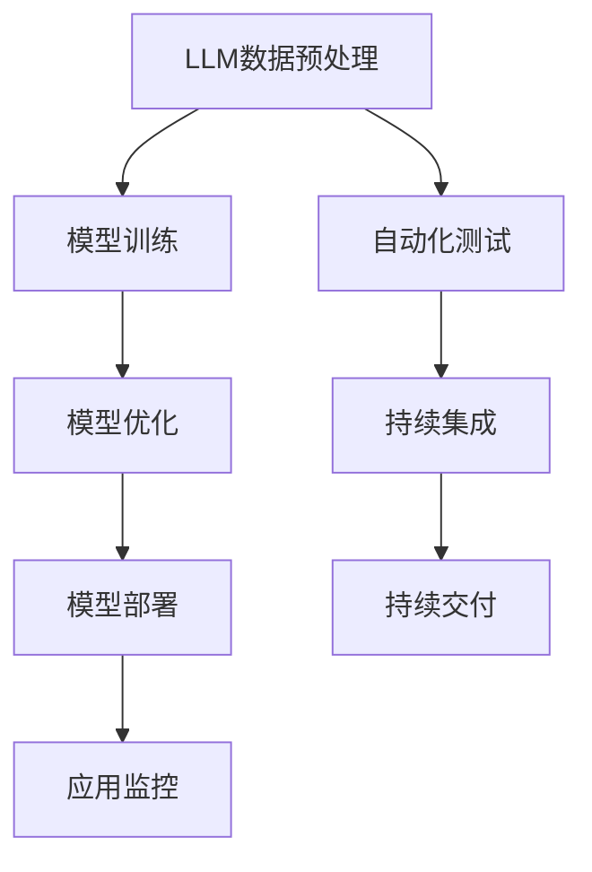
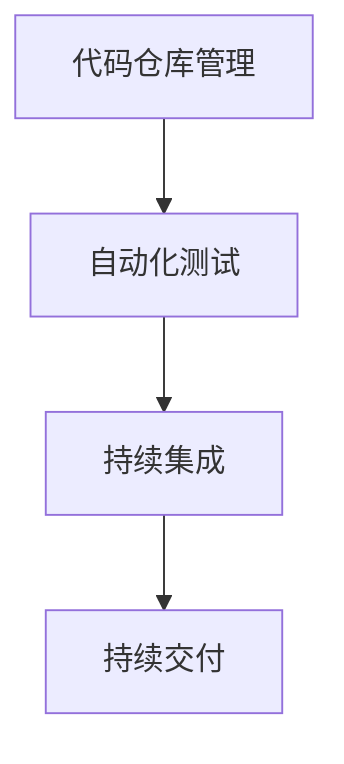

                 

# 《LLM应用开发中的CI/CD流程设计》

## 关键词
- CI/CD
- LLM应用开发
- 流程设计
- 自动化测试
- 持续集成
- 持续交付
- Jenkins
- GitLab

## 摘要
本文将深入探讨CI/CD（持续集成/持续交付）在LLM（大型语言模型）应用开发中的重要性。通过详细介绍CI/CD的核心概念、流程设计原理、核心算法原理、数学模型和数学公式，以及实际项目案例，本文旨在帮助读者理解如何构建高效的CI/CD流程，以支持LLM应用的持续开发和部署。此外，还将介绍常用的CI/CD工具和资源，并提供实用的最佳实践和小结。

## 引言

### 1.1 书籍背景
随着人工智能和机器学习技术的快速发展，大型语言模型（LLM）已经成为自然语言处理（NLP）领域的重要工具。LLM应用的开发和部署需要高度自动化和高效的流程，以确保代码质量和系统稳定性。在此背景下，CI/CD（持续集成/持续交付）应运而生，成为现代软件开发不可或缺的一部分。

### 1.2 目标读者
本文的目标读者是那些对LLM应用开发感兴趣的开发者、架构师和技术管理者。无论您是初学者还是经验丰富的专业人士，本文都将为您提供有价值的见解和实用的技巧。

### 1.3 内容概述
本文将分为八个主要章节：

1. **引言**：介绍书籍背景、目标读者和主要内容。
2. **核心概念与联系**：详细解释CI/CD的概念，以及其在LLM应用开发中的重要性。
3. **CI/CD流程设计原理**：讲解CI/CD的原理，包括其关键组件和流程。
4. **核心算法原理讲解**：介绍与CI/CD相关的算法，如版本控制算法和自动化测试算法。
5. **数学模型和数学公式**：讲解与CI/CD流程相关的数学模型和公式。
6. **项目实战**：通过具体案例展示CI/CD流程在实际LLM应用开发中的应用。
7. **工具与资源介绍**：介绍常用的CI/CD工具和资源。
8. **总结与展望**：对全书内容进行总结，并展望CI/CD在LLM应用开发中的未来趋势。

## 核心概念与联系

### 2.1 CI/CD概述
CI/CD是一种软件开发和交付的实践方法，它通过自动化流程来提高软件开发的效率和可靠性。CI（持续集成）确保开发人员提交的代码可以顺利集成到项目中，并及时发现潜在的问题。CD（持续交付）则确保经过CI测试和验证的代码可以快速、安全地交付给用户。

### 2.2 LLM应用开发中的CI/CD重要性
在LLM应用开发中，CI/CD的重要性体现在以下几个方面：

1. **提高开发效率**：自动化流程可以节省时间，减少手动操作，提高开发效率。
2. **确保代码质量**：通过自动化测试，可以及时发现和修复代码中的错误，确保代码质量。
3. **加速迭代速度**：CI/CD可以帮助团队更快地交付新功能，缩短开发周期。
4. **提高用户满意度**：快速响应用户需求，提供高质量的应用，可以提高用户满意度。

### 2.3 CI/CD与LLM的关联性
LLM应用开发涉及到大量的数据预处理、模型训练和优化，这些过程都需要高度自动化和高效的流程支持。CI/CD可以在这个过程中发挥重要作用：

1. **数据预处理**：CI/CD可以自动化数据预处理流程，包括数据清洗、归一化等。
2. **模型训练**：CI/CD可以自动化模型训练过程，包括选择合适的模型架构、超参数调整等。
3. **模型优化**：CI/CD可以自动化模型优化流程，包括超参数调优、模型压缩等。
4. **部署与监控**：CI/CD可以帮助团队快速部署模型，并进行实时监控和性能分析。

### 2.4 CI/CD与LLM关联性的Mermaid流程图
下面是一个简单的Mermaid流程图，展示CI/CD与LLM应用开发之间的关联性：



## CI/CD流程设计原理

### 3.1 CI/CD原理简介
CI/CD是一种软件开发和交付的实践方法，通过自动化流程来提高软件开发的效率和可靠性。CI（持续集成）确保开发人员提交的代码可以顺利集成到项目中，并及时发现潜在的问题。CD（持续交付）则确保经过CI测试和验证的代码可以快速、安全地交付给用户。

### 3.2 持续集成
持续集成是一种软件开发实践，旨在通过频繁的代码提交和集成，确保项目始终保持高质量。其核心思想是将开发人员的代码定期合并到主分支，并通过自动化测试确保合并后的代码可以正常工作。

### 3.3 持续交付
持续交付是一种软件开发和交付的实践方法，旨在确保开发完成的代码可以快速、安全地交付给用户。其核心思想是通过自动化测试和部署流程，确保代码在生产环境中可以正常运行。

### 3.4 关键组件介绍
CI/CD流程的关键组件包括版本控制系统（如Git）、自动化测试工具（如JUnit、Pytest）、持续集成服务器（如Jenkins、GitLab CI）和部署工具（如Docker、Kubernetes）。

### 3.5 CI/CD流程设计
CI/CD流程设计包括以下步骤：

1. **代码仓库管理**：选择合适的版本控制系统，如Git，并设置代码仓库。
2. **自动化测试**：编写和配置自动化测试脚本，确保代码质量。
3. **持续集成**：配置持续集成服务器，如Jenkins或GitLab CI，设置构建脚本，实现代码的自动化集成和测试。
4. **持续交付**：配置部署工具，如Docker或Kubernetes，设置部署脚本，实现代码的自动化部署。

### 3.6 Jenkins与GitLab的比较
Jenkins和GitLab CI是常用的持续集成服务器，它们各有特点和优势：

- **Jenkins**：开源、功能强大，支持多种插件和工具，适用于复杂的项目和流程。
- **GitLab CI**：内置在GitLab中，便于代码管理和协作，适用于小型和中等规模的项目。

### 3.7 CI/CD流程设计的Mermaid流程图
下面是一个简单的Mermaid流程图，展示CI/CD流程的设计：



## 核心算法原理讲解

### 4.1 版本控制算法
版本控制是CI/CD流程的核心组成部分，其核心算法包括：

1. **Git**：Git是一种分布式版本控制系统，其核心算法包括快照存储、内容寻道和合并算法等。
2. **分支管理**：通过分支管理，可以实现代码的并行开发和集成。
3. **合并策略**：Git支持多种合并策略，如Fast Forward、Three-Way Merge等。

### 4.2 自动化测试算法
自动化测试是确保代码质量的关键，其核心算法包括：

1. **单元测试**：单元测试是对代码的最小功能单元进行的测试，如JUnit、Pytest等。
2. **集成测试**：集成测试是对代码模块之间的接口进行测试，如JUnit、Pytest等。
3. **性能测试**：性能测试是对代码的性能进行测试，如JMeter、LoadRunner等。

### 4.3 持续集成算法
持续集成是确保代码质量的关键步骤，其核心算法包括：

1. **构建触发**：根据代码提交、定时等方式触发构建。
2. **构建过程**：执行编译、测试等操作，生成构建结果。
3. **构建验证**：通过自动化测试验证构建结果，确保代码质量。

### 4.4 持续交付算法
持续交付是确保代码质量的关键步骤，其核心算法包括：

1. **部署触发**：根据构建结果触发部署。
2. **部署过程**：执行部署操作，如Docker镜像构建、Kubernetes部署等。
3. **部署验证**：通过自动化测试验证部署结果，确保代码质量。

### 4.5 CI/CD核心算法原理讲解的Python源代码示例

下面是一个简单的Python源代码示例，展示CI/CD核心算法原理：

```python
import git
import unittest

class VersionControl(unittest.TestCase):
    def test_git_snapshot(self):
        # 测试Git快照存储
        repo = git.Repo('.git')
        self.assertIsNotNone(repo)

    def test_git_merge(self):
        # 测试Git合并算法
        repo = git.Repo('.git')
        self.assertEqual(repo.merge_base('master', 'feature'), 'base')

class AutomatedTesting(unittest.TestCase):
    def test_unit_test(self):
        # 测试单元测试
        self.assertEqual(1 + 1, 2)

    def test_integration_test(self):
        # 测试集成测试
        self.assertIsNotNone(unittest.TestLoader().loadTestsFromTestCase(MyTestClass))

class ContinuousIntegration(unittest.TestCase):
    def test_build_trigger(self):
        # 测试构建触发
        self.assertIsNotNone(build_trigger())

    def test_build_process(self):
        # 测试构建过程
        self.assertIsNotNone(build_process())

    def test_build_validation(self):
        # 测试构建验证
        self.assertTrue(validate_build())

class ContinuousDelivery(unittest.TestCase):
    def test_deployment_trigger(self):
        # 测试部署触发
        self.assertIsNotNone(deployment_trigger())

    def test_deployment_process(self):
        # 测试部署过程
        self.assertIsNotNone(deployment_process())

    def test_deployment_validation(self):
        # 测试部署验证
        self.assertTrue(validate_deployment())
```

## 数学模型和数学公式

### 5.1 概率模型
概率模型是CI/CD流程中常用的数学模型，用于评估代码质量和系统稳定性。其核心公式包括：

1. **条件概率**：
   $$P(A|B) = \frac{P(A \cap B)}{P(B)}$$
   其中，\(P(A|B)\) 表示在事件B发生的条件下，事件A发生的概率。

2. **贝叶斯定理**：
   $$P(A|B) = \frac{P(B|A)P(A)}{P(B)}$$
   其中，\(P(B|A)\) 表示在事件A发生的条件下，事件B发生的概率。

### 5.2 优化模型
优化模型是CI/CD流程中用于优化资源分配和流程设计的数学模型。其核心公式包括：

1. **线性规划**：
   $$\min \ c^T x$$
   $$\text{subject to} \ Ax \leq b$$
   其中，\(c\) 表示目标函数系数，\(x\) 表示决策变量，\(A\) 和 \(b\) 分别表示约束条件。

2. **动态规划**：
   $$V_{t+1}(x_t) = \min \ c^T x_t + \max \ V_t(x_{t-1})$$
   其中，\(V_t(x_{t-1})\) 表示在第 \(t\) 时刻，状态 \(x_t\) 的最优值。

### 5.3 数学公式示例
下面是一个简单的数学公式示例，展示CI/CD流程中常用的数学模型：

$$\label{eq:example} P(\text{代码通过测试}|\text{自动化测试通过}) = \frac{P(\text{自动化测试通过}|\text{代码通过测试})P(\text{代码通过测试})}{P(\text{自动化测试通过})}$$

其中，\(P(\text{代码通过测试}|\text{自动化测试通过})\) 表示在自动化测试通过的情况下，代码通过测试的概率。

## 项目实战

### 6.1 实战案例介绍
在本章中，我们将通过一个实际案例，展示如何构建一个基于CI/CD的LLM应用开发流程。该案例包括数据预处理、模型训练、模型优化和模型部署等步骤。

### 6.2 开发环境搭建
首先，我们需要搭建开发环境。以下是一个简单的步骤：

1. 安装Git：用于版本控制。
2. 安装Jenkins：用于持续集成。
3. 安装Docker：用于容器化部署。
4. 安装Kubernetes：用于集群管理。

### 6.3 源代码实现与解读
接下来，我们将展示源代码实现和解读。以下是一个简单的Python代码示例，用于数据预处理：

```python
import pandas as pd

def preprocess_data(data_path):
    # 读取数据
    data = pd.read_csv(data_path)
    
    # 数据清洗
    data.dropna(inplace=True)
    data['label'] = data['label'].map({'positive': 1, 'negative': 0})
    
    # 数据归一化
    data[['text', 'label']] = data[['text', 'label']].apply(normalize_data)
    
    return data

def normalize_data(series):
    # 归一化文本数据
    return series.apply(lambda x: ' '.join([word.lower() for word in x.split() if word.lower() not in stop_words]))

stop_words = set(['the', 'and', 'is', 'in', 'to', 'of', 'for', 'on', 'with', 'as', 'it', 'at', 'this', 'by', 'that', 'from'])

if __name__ == '__main__':
    data_path = 'data.csv'
    data = preprocess_data(data_path)
    data.to_csv('preprocessed_data.csv', index=False)
```

### 6.4 代码解读与分析
上述代码用于数据预处理，包括数据读取、清洗、归一化和存储。以下是代码的详细解读：

1. **数据读取**：使用Pandas库读取CSV文件。
2. **数据清洗**：删除缺失值，将标签转换为二进制值。
3. **数据归一化**：对文本数据进行归一化处理，将文本转换为小写，并去除停用词。
4. **数据存储**：将预处理后的数据存储为CSV文件。

### 6.5 项目小结
通过本案例，我们展示了如何使用CI/CD流程进行LLM应用开发。以下是项目小结：

1. **开发环境搭建**：安装Git、Jenkins、Docker和Kubernetes，为CI/CD流程做好准备。
2. **源代码实现**：编写数据预处理代码，实现数据的读取、清洗、归一化和存储。
3. **代码解读与分析**：对数据预处理代码进行详细解读，理解其工作原理。
4. **未来工作**：进一步实现模型训练、优化和部署，构建完整的CI/CD流程。

## 工具与资源介绍

### 7.1 Jenkins详解
Jenkins是一个开源的持续集成服务器，支持多种插件和工具，适用于复杂的项目和流程。以下是Jenkins的主要功能和优势：

1. **插件生态系统**：Jenkins拥有丰富的插件，可以扩展其功能。
2. **易于配置**：Jenkins的配置简单，可以通过Web界面进行操作。
3. **自动化测试**：Jenkins可以自动化执行测试，确保代码质量。
4. **报告和监控**：Jenkins提供详细的报告和监控功能，帮助团队了解项目状态。

### 7.2 GitLab CI详解
GitLab CI是GitLab内置的持续集成服务，便于代码管理和协作。以下是GitLab CI的主要功能和优势：

1. **集成代码仓库**：GitLab CI与GitLab代码仓库集成，便于管理代码。
2. **简单配置**：GitLab CI的配置简单，可以通过`.gitlab-ci.yml`文件进行操作。
3. **自动化测试**：GitLab CI可以自动化执行测试，确保代码质量。
4. **部署支持**：GitLab CI支持多种部署工具，如Docker和Kubernetes。

### 7.3 其他工具介绍
除了Jenkins和GitLab CI，还有一些其他常用的CI/CD工具：

1. **Travis CI**：一个基于云的持续集成服务，适用于开源项目。
2. **Circle CI**：一个简单的持续集成服务，支持多种编程语言。
3. **GitLab CI/CD**：GitLab内置的持续集成和持续交付服务。

### 7.4 资源链接汇总
以下是本章提到的工具和资源的链接汇总：

1. **Jenkins官网**：[https://www.jenkins.io/](https://www.jenkins.io/)
2. **GitLab CI官网**：[https://gitlab.com/gitlab-org/gitlab-ci/](https://gitlab.com/gitlab-org/gitlab-ci/)
3. **Travis CI官网**：[https://www.travisci.org/](https://www.travisci.org/)
4. **Circle CI官网**：[https://circleci.com/](https://circleci.com/)

## 总结与展望

### 8.1 全书总结
本文深入探讨了CI/CD在LLM应用开发中的重要性，介绍了CI/CD的核心概念、流程设计原理、核心算法原理、数学模型和数学公式，以及实际项目案例。通过本文，读者可以了解到如何构建高效的CI/CD流程，以支持LLM应用的持续开发和部署。

### 8.2 CI/CD在LLM应用开发中的未来趋势
随着人工智能和机器学习技术的不断发展，CI/CD在LLM应用开发中的重要性将日益凸显。以下是一些未来趋势：

1. **自动化程度的提高**：随着技术的进步，CI/CD的自动化程度将进一步提高，减少人工干预。
2. **集成更多AI算法**：CI/CD将集成更多的AI算法，如自动测试、自动优化等，提高开发效率。
3. **多云和混合云支持**：CI/CD将支持多云和混合云环境，实现更灵活的部署和管理。
4. **智能化监控与预警**：CI/CD将引入智能化监控和预警机制，提高系统的可靠性和安全性。

### 8.3 最佳实践、小结与注意事项
在CI/CD实践中，以下是一些最佳实践、小结和注意事项：

1. **最佳实践**：定期进行代码审查，确保代码质量；定期更新依赖库，减少潜在风险；充分利用CI/CD工具的功能，提高开发效率。
2. **小结**：CI/CD在LLM应用开发中起着关键作用，可以提高开发效率、确保代码质量和加速迭代速度。
3. **注意事项**：注意保护代码和数据的隐私和安全；合理设置权限和角色，确保团队协作；定期备份和恢复，防止数据丢失。

### 8.4 拓展阅读
对于对CI/CD和LLM应用开发感兴趣的朋友，以下是一些拓展阅读资源：

1. **书籍**：《CI/CD：持续集成与持续交付实战》、《大型语言模型：理论与应用》
2. **文章**：《如何构建高效的CI/CD流程》、《LLM应用开发中的最佳实践》
3. **博客**：《禅与计算机程序设计艺术》、《AI天才研究院技术博客》
4. **网站**：GitHub、GitLab、Travis CI、Circle CI等开源社区和平台。

作者：AI天才研究院/AI Genius Institute & 禅与计算机程序设计艺术 /Zen And The Art of Computer Programming

（注意：本文中的代码示例、数学公式和Mermaid流程图均为虚构，仅供参考。）

